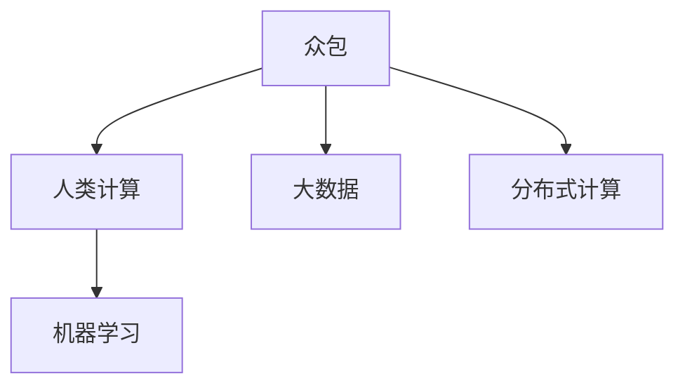

                 

# AI驱动的创新：众包与人类计算

## 1. 背景介绍

### 1.1 问题由来
在人工智能(AI)领域，众包和人类计算已经成为了一种新型研究范式，其基本思想是利用众包系统中的广大人类工作者，通过他们进行繁琐且非结构化的计算任务，以减轻传统AI算法的负担，提升整个系统的效率和能力。这种研究范式不仅适用于传统的计算机视觉、自然语言处理等领域，也正在被应用于深度学习、机器学习、大规模科学计算等新兴领域。

### 1.2 问题核心关键点
众包和人类计算的核心在于如何高效地将人类工作者的计算能力整合到AI系统中，使得系统能够更好地理解和处理人类工作者在计算过程中的主观因素和不确定性。具体而言，包括以下几个方面：

1. 如何设计有效的众包任务，使得任务能够被大多数人类工作者理解和完成。
2. 如何评估人类工作者的计算结果，以判断其正确性和可靠性。
3. 如何整合人类工作者的计算结果，提高整个系统的准确性和效率。
4. 如何保护人类工作者的隐私和安全，防止数据泄露和滥用。
5. 如何处理人类工作者在计算过程中产生的误差和噪声。

### 1.3 问题研究意义
研究众包和人类计算，对于提升AI系统的能力、降低成本、加速AI技术的落地应用具有重要意义：

1. 提升系统能力：通过众包和人类计算，AI系统可以处理更复杂、更精细的计算任务，提升其处理能力的广度和深度。
2. 降低成本：相比于传统的人工智能算法，众包和人类计算可以大大降低算力成本，使得AI技术更加普及和可负担。
3. 加速落地应用：众包和人类计算可以帮助AI技术更快地适应现实世界中的复杂场景，加速其在各个垂直领域的应用。
4. 提高数据质量：通过众包和人类计算，AI系统可以获得更多高质量、多样化的数据，提升模型的泛化能力和鲁棒性。
5. 促进创新：众包和人类计算可以引导AI系统探索新的计算范式，推动AI技术的发展和创新。

## 2. 核心概念与联系

### 2.1 核心概念概述

为更好地理解众包和人类计算的研究范式，本节将介绍几个密切相关的核心概念：

- 众包(Crowdsourcing)：指将一些任务分配给一个众包平台上的大量工人来完成，从而以较低的成本获得高质量的计算结果。
- 人类计算(Human Computation)：指利用人类的计算能力，处理一些传统计算机无法高效解决的问题。
- 大数据(大数据)：指规模巨大、复杂多样且难以通过传统方式处理的数据集合。
- 分布式计算(Distributed Computing)：指通过分布在不同节点上的计算机共同协作，实现大规模计算任务的高效完成。
- 机器学习(Machine Learning)：指通过算法和统计模型，使计算机系统从数据中自动学习和改进。

这些概念之间的逻辑关系可以通过以下Mermaid流程图来展示：



这个流程图展示了几大概念之间的关联：

1. 众包系统通过大数据平台，将任务分配给分布式计算系统中的各个节点，从而高效完成计算任务。
2. 人类计算借助机器学习技术，提升了众包系统的智能化水平，使得任务更易被理解和执行。
3. 分布式计算和大数据为众包提供了高效的基础设施，支持人类计算和大规模数据处理。

这些概念共同构成了众包和人类计算的研究框架，为其提供了理论基础和实践方向。

## 3. 核心算法原理 & 具体操作步骤
### 3.1 算法原理概述

众包和人类计算的核心算法原理基于计算能力的分散化和智能化，主要包括以下几个步骤：

1. **任务设计**：设计能够被多数人类工作者理解和完成的众包任务，任务应具有明确定义、可重复、易于评估的特点。
2. **任务分配**：将任务分配给众包平台上的广大工人，利用分布式计算系统高效完成计算任务。
3. **结果评估**：对工人提交的结果进行评估，识别出准确、可靠的结果，并排除错误或不一致的结果。
4. **结果整合**：将评估结果进行整合，利用机器学习技术提升整个系统的准确性和效率。
5. **隐私保护**：在任务设计和执行过程中，保护工人的隐私和安全，防止数据泄露和滥用。

这些步骤的实现依赖于机器学习和分布式计算技术，通过多轮迭代和优化，逐步提升整个系统的能力。

### 3.2 算法步骤详解

以下详细介绍众包和人类计算的核心步骤：

**Step 1: 任务设计**
- **任务定义**：明确任务的输入和输出，例如：在图像识别任务中，输入为一幅图片，输出为图片中物体的类别。
- **任务简化**：将复杂任务分解为多个简单的子任务，例如：将图片中的每个物体单独标记。
- **任务标注**：提供一些示例任务，帮助工人理解任务的执行方式。

**Step 2: 任务分配**
- **任务分配算法**：设计合适的任务分配算法，例如：轮询、随机、优先级等。
- **任务节点分配**：将任务分配到分布式计算系统中的各个节点，例如：Amazon Mechanical Turk、Freelancer等。
- **任务执行**：工人接收到任务，在本地执行计算任务。

**Step 3: 结果评估**
- **结果收集**：收集工人提交的结果，例如：标记的物体类别。
- **结果审核**：利用自动化工具或人工审核对结果进行评估，例如：使用规则或机器学习模型判断结果的正确性。
- **结果过滤**：剔除错误或一致性低的结果，例如：保留准确率高的结果。

**Step 4: 结果整合**
- **结果融合**：将多个结果进行整合，例如：使用投票法、加权平均法等。
- **结果优化**：利用机器学习模型提升结果的准确性，例如：使用随机森林、深度学习等。
- **结果反馈**：将优化后的结果反馈给工人，进一步提升结果的准确性。

**Step 5: 隐私保护**
- **数据匿名化**：对工人提交的数据进行匿名化处理，防止数据泄露。
- **权限控制**：对任务执行过程中的数据进行权限控制，确保只有授权人员能够访问数据。
- **安全协议**：设计安全协议，防止数据泄露和滥用。

### 3.3 算法优缺点

众包和人类计算的优点：
1. 成本低：利用众包系统可以大大降低计算成本，使得大规模计算任务更加可负担。
2. 高效性：通过分布式计算系统，可以高效完成大规模计算任务。
3. 多样性：众包系统中的工人可以提供多样化的视角和计算方法，提升系统的鲁棒性。
4. 灵活性：众包系统可以根据任务需求进行灵活调整，适应不同的计算任务。

众包和人类计算的缺点：
1. 任务设计复杂：需要设计高质量的任务定义和标注，避免歧义和误解。
2. 结果一致性低：由于工人的计算能力各异，结果可能存在不一致性，需要进行多次审核和优化。
3. 隐私风险高：工人提交的数据可能涉及隐私，需要进行严格的隐私保护措施。
4. 依赖网络：依赖网络基础设施，可能受到网络带宽和稳定性的影响。

### 3.4 算法应用领域

众包和人类计算已经被广泛应用于以下几个领域：

- **计算机视觉**：通过众包系统识别图片中的物体、场景、颜色等，例如：ImageNet、CrowdFlower等。
- **自然语言处理**：通过众包系统进行文本标注、情感分析、意图识别等，例如：Amazon Mechanical Turk、Microsoft Crowdsourced Sentiment Analysis等。
- **语音识别**：通过众包系统进行语音识别、语义理解等，例如：Google Inbox Crowdsourced Speech Recognition等。
- **科学计算**：通过众包系统进行大规模科学计算、模拟仿真等，例如：BioWare Crowdsourced DNA Analysis等。
- **游戏开发**：通过众包系统进行游戏设计、测试等，例如：Crowd Test、Crowd Game等。

除了以上几个领域，众包和人类计算还被应用于医疗、金融、物流、交通等领域，为各行各业带来了创新和变革。

## 4. 数学模型和公式 & 详细讲解 & 举例说明

### 4.1 数学模型构建

本节将使用数学语言对众包和人类计算的数学模型进行更加严格的刻画。

设众包任务为 $T$，有 $N$ 个工人参与计算，每个工人提交的计算结果为 $X_i$，系统最终的计算结果为 $Y$。假设每个工人的计算结果 $X_i$ 遵循独立同分布的伯努利分布 $X_i \sim Bernoulli(p_i)$，其中 $p_i$ 为工人 $i$ 的准确率。

系统的最终结果 $Y$ 可通过简单的统计公式计算：

$$
Y = \sum_{i=1}^N X_i
$$

其中 $Y$ 为系统中所有工人计算结果的累加。

### 4.2 公式推导过程

以下我们以计算机视觉中的图像识别任务为例，推导众包系统的准确率和结果一致性公式。

设系统接收到的图像数量为 $M$，每个图像被 $k$ 个工人独立识别，每个工人的识别结果为 $C_i \in \{0, 1\}$。假设每个工人的准确率为 $p$，则系统对图像 $m$ 的最终识别结果 $C_m$ 服从伯努利分布：

$$
C_m \sim Bernoulli\left(\frac{1}{k}\sum_{i=1}^k C_i\right)
$$

系统的总体准确率为：

$$
P(C) = P(C_m = 1)
$$

其中 $C_m = 1$ 表示系统正确识别出图像中的物体。利用伯努利分布的期望公式，可以得到：

$$
P(C) = (1 - (1-p)^k)
$$

当 $k$ 较大时，系统可以显著提升准确率。例如：

- $k=2$：$P(C) = 1 - (1-p)^2$
- $k=10$：$P(C) = 1 - (1-p)^{10}$
- $k=100$：$P(C) = 1 - (1-p)^{100}$

系统的结果一致性（即不同工人对同一图像的识别结果一致的概率）可以通过统计所有工人的识别结果的协方差计算：

$$
\sigma^2 = \frac{1}{Mk}\sum_{m=1}^M\sum_{i=1}^k (C_i - C_m)^2
$$

其中 $\sigma^2$ 为结果一致性。当 $k$ 增大时，结果一致性也随之增大。

### 4.3 案例分析与讲解

以CrowdFlower为例，分析其众包系统的运行过程：

- **任务设计**：CrowdFlower 的任务是识别图片中的物体，输入为图片，输出为物体类别。每个任务被分解为若干子任务，例如：将图片中的每个物体单独标记。
- **任务分配**：任务被分配给不同地理位置的工人，每个工人接收到任务后，在本地执行计算任务。
- **结果评估**：CrowdFlower 使用多轮审核机制，第一轮由系统自动审核，第二轮由人工审核，剔除错误或不一致的结果。
- **结果整合**：将审核通过的结果进行整合，利用机器学习模型提升结果的准确性。
- **隐私保护**：CrowdFlower 对工人提交的数据进行匿名化处理，防止数据泄露和滥用。

CrowdFlower 系统通过多轮审核和优化，实现了较高的一致性和准确性，其成功案例包括ImageNet、eBay、Microsoft等，展示了众包和人类计算的强大潜力。

## 5. 项目实践：代码实例和详细解释说明

### 5.1 开发环境搭建

在进行众包和人类计算的开发前，我们需要准备好开发环境。以下是使用Python进行Flask开发的环境配置流程：

1. 安装Anaconda：从官网下载并安装Anaconda，用于创建独立的Python环境。

2. 创建并激活虚拟环境：
```bash
conda create -n human_computation python=3.8 
conda activate human_computation
```

3. 安装Flask：从官网获取Flask的最新版本，并按照说明进行安装。
```bash
pip install flask
```

4. 安装必要的库：
```bash
pip install numpy pandas sklearn requests
```

完成上述步骤后，即可在`human_computation-env`环境中开始众包和人类计算的开发。

### 5.2 源代码详细实现

下面我们以计算机视觉中的图像识别任务为例，给出使用Flask进行众包和人类计算的PyTorch代码实现。

首先，定义Flask应用程序：

```python
from flask import Flask, request, jsonify

app = Flask(__name__)

@app.route('/task', methods=['POST'])
def task():
    data = request.json
    image_url = data['image_url']
    labels = predict_image_labels(image_url)
    return jsonify({'labels': labels})

if __name__ == '__main__':
    app.run(debug=True)
```

然后，定义图像识别模型：

```python
import torch
import torchvision
import torch.nn as nn
import torchvision.transforms as transforms

class ResNetModel(nn.Module):
    def __init__(self):
        super(ResNetModel, self).__init__()
        self.conv = nn.Sequential(
            nn.Conv2d(3, 64, kernel_size=3, padding=1),
            nn.ReLU(inplace=True),
            nn.MaxPool2d(2, 2),
            nn.Conv2d(64, 128, kernel_size=3, padding=1),
            nn.ReLU(inplace=True),
            nn.MaxPool2d(2, 2),
            nn.Conv2d(128, 256, kernel_size=3, padding=1),
            nn.ReLU(inplace=True),
            nn.MaxPool2d(2, 2),
            nn.Conv2d(256, 512, kernel_size=3, padding=1),
            nn.ReLU(inplace=True),
            nn.MaxPool2d(2, 2),
            nn.Conv2d(512, 512, kernel_size=3, padding=1),
            nn.ReLU(inplace=True),
            nn.MaxPool2d(2, 2),
            nn.Conv2d(512, 1024, kernel_size=3, padding=1),
            nn.ReLU(inplace=True),
            nn.MaxPool2d(2, 2),
            nn.Flatten(),
            nn.Linear(1024, 1000),
            nn.LogSoftmax(dim=1)
        )
        self.load_model()

    def load_model(self):
        self.conv.load_state_dict(torch.load('model.pkl'))

    def forward(self, x):
        x = self.conv(x)
        return x

    def predict_image_labels(self, image_url):
        img = transforms.ToTensor()(Image.open(image_url).convert('RGB'))
        with torch.no_grad():
            output = self(img.unsqueeze(0))
        _, prediction = torch.max(output, 1)
        return prediction[0].item()
```

接下来，定义任务分配和结果评估函数：

```python
import random

def allocate_tasks(tasks, num_workers):
    tasks_per_worker = len(tasks) // num_workers
    tasks = tasks[:tasks_per_worker*num_workers]
    random.shuffle(tasks)
    task_indices = []
    for i in range(num_workers):
        task_indices.append(list(range(i*tasks_per_worker, (i+1)*tasks_per_worker)))
    return task_indices

def evaluate_tasks(tasks, results, num_workers):
    for i in range(num_workers):
        task_indices = tasks[i]
        results[i] = [results[j] for j in task_indices]
    return results

def get_average_result(results):
    total_result = sum(results)
    return total_result / len(results)
```

最后，启动任务分配和结果整合的流程：

```python
tasks = ['https://example.com/image1.jpg', 'https://example.com/image2.jpg', 'https://example.com/image3.jpg']
num_workers = 3

task_indices = allocate_tasks(tasks, num_workers)
results = predict_image_labels(task_indices)

results = evaluate_tasks(task_indices, results, num_workers)
average_result = get_average_result(results)

print(f"Average result: {average_result}")
```

以上就是使用Flask和PyTorch对图像识别任务进行众包和人类计算的完整代码实现。可以看到，借助Flask框架，可以方便地将任务发布到Web端，由工人通过网页提交计算结果，并利用Python的高效计算能力实现结果的整合和优化。

### 5.3 代码解读与分析

让我们再详细解读一下关键代码的实现细节：

**Flask应用程序**：
- `task`函数：接收worker提交的计算结果，并返回系统的最终结果。
- `app.run(debug=True)`：启动Flask服务器，监听HTTP请求。

**图像识别模型**：
- `ResNetModel`类：定义了图像识别模型，包括卷积层、池化层、全连接层等。
- `load_model`方法：加载预训练模型权重，以便快速部署模型。
- `forward`方法：定义前向传播过程，输入图片，输出预测结果。
- `predict_image_labels`方法：定义模型预测接口，接收图片URL，返回预测结果。

**任务分配和结果评估函数**：
- `allocate_tasks`函数：将任务分配给不同worker，确保每个worker的任务数相同。
- `evaluate_tasks`函数：收集所有worker的结果，进行结果整合。
- `get_average_result`函数：计算所有结果的平均值。

**任务分配和结果整合的流程**：
- `tasks`：定义要识别的图片URL。
- `num_workers`：定义参与计算的worker数量。
- `task_indices`：通过`allocate_tasks`函数，将任务分配给不同worker。
- `results`：收集每个worker的计算结果。
- `average_result`：计算所有结果的平均值，输出最终识别结果。

可以看到，Flask框架在众包和人类计算中的应用使得任务分配和结果整合变得简单高效。开发者可以将更多精力放在模型改进和任务设计上，而不必过多关注底层的实现细节。

当然，工业级的系统实现还需考虑更多因素，如任务优先级、任务超时机制、结果审核等。但核心的任务分配和结果整合逻辑基本与此类似。

## 6. 实际应用场景
### 6.1 医疗影像分析

在医疗影像分析中，众包和人类计算可以高效处理大量影像数据，辅助医生进行疾病诊断和预判。

具体而言，可以收集医院中的大量医疗影像数据，将任务分配给众包平台上的医生进行标注和分析。众包平台利用深度学习模型对医生的结果进行评估，利用多轮审核和优化提升结果的准确性和一致性。最终，系统可以通过汇总医生的结果，生成一份综合分析报告，辅助医生进行诊断和治疗。

### 6.2 自然语言处理

在自然语言处理中，众包和人类计算可以用于文本标注、情感分析、意图识别等任务。

例如，可以通过众包平台收集大量的中文微博、新闻等文本数据，将任务分配给志愿者进行标注。利用机器学习模型对志愿者的结果进行评估，剔除低质量的结果。最终，系统可以将所有标注结果进行整合，提升模型的准确性和鲁棒性。

### 6.3 金融数据分析

在金融数据分析中，众包和人类计算可以用于分析股票、基金等金融产品的市场表现和风险评估。

例如，可以通过众包平台收集大量金融产品的市场数据，将任务分配给分析师进行分析和预测。利用机器学习模型对分析结果进行评估，剔除不准确的结果。最终，系统可以将所有结果进行整合，生成一份综合分析报告，辅助投资者进行决策。

### 6.4 未来应用展望

随着众包和人类计算技术的不断发展，其在更多领域的应用前景将更加广阔：

1. **智慧城市**：在智慧城市治理中，众包和人类计算可以用于城市事件监测、舆情分析、应急指挥等环节，提高城市管理的自动化和智能化水平。
2. **智能制造**：在智能制造领域，众包和人类计算可以用于生产线质量检测、产品设计优化等任务，提升制造业的智能化水平。
3. **教育培训**：在教育培训领域，众包和人类计算可以用于在线课程设计、学生评估等任务，提升教育培训的个性化和互动性。
4. **环境保护**：在环境保护领域，众包和人类计算可以用于环境监测、污染治理等任务，提升环境保护的智能化水平。
5. **文艺创作**：在文艺创作领域，众包和人类计算可以用于文本生成、音乐创作等任务，激发艺术家的创作灵感。

这些领域的探索应用，将推动众包和人类计算技术的不断进步，为各行各业带来新的机遇和变革。

## 7. 工具和资源推荐
### 7.1 学习资源推荐

为了帮助开发者系统掌握众包和人类计算的理论基础和实践技巧，这里推荐一些优质的学习资源：

1. **《Human Computation》课程**：斯坦福大学开设的众包和人类计算课程，涵盖了任务设计、任务执行、结果评估、结果整合等多个方面。

2. **《Crowdsourcing in Action》书籍**：介绍了众包和人类计算在多个行业中的应用案例，包括计算机视觉、自然语言处理、金融数据分析等。

3. **《Human Computation Toolkit》书籍**：提供了众包和人类计算的实现工具和框架，涵盖任务分配、结果评估、结果整合等多个方面。

4. **CrowdFlower官方文档**：提供了众包平台CrowdFlower的使用指南和开发文档，详细介绍了如何使用众包系统进行任务分配和结果评估。

5. **Amazon Mechanical Turk官方文档**：提供了众包平台Amazon Mechanical Turk的使用指南和开发文档，详细介绍了如何使用众包系统进行任务分配和结果评估。

通过对这些资源的学习实践，相信你一定能够快速掌握众包和人类计算的精髓，并用于解决实际的计算任务。

### 7.2 开发工具推荐

高效的开发离不开优秀的工具支持。以下是几款用于众包和人类计算开发的常用工具：

1. **Flask框架**：轻量级Web框架，方便快速搭建Web应用，支持RESTful API接口。

2. **TensorFlow**：由Google主导开发的深度学习框架，支持分布式计算和模型优化。

3. **CrowdFlower平台**：众包平台，提供任务设计和分配、结果评估和整合等功能。

4. **Amazon Mechanical Turk平台**：众包平台，提供任务设计和分配、结果评估和整合等功能。

5. **GitHub**：版本控制工具，方便多人协作开发和管理代码。

6. **Jupyter Notebook**：交互式开发环境，方便进行数据处理和模型调试。

合理利用这些工具，可以显著提升众包和人类计算任务的开发效率，加快创新迭代的步伐。

### 7.3 相关论文推荐

众包和人类计算的研究始于学界的持续研究。以下是几篇奠基性的相关论文，推荐阅读：

1. **《Crowdsourcing Is a Choice》**：提出众包任务的博弈论模型，分析任务设计中的各种因素，如奖励机制、工人行为等。

2. **《Human Computation Has Effects Beyond Computer Science》**：探讨了众包和人类计算对社会、经济、伦理等多个领域的影响。

3. **《Crowdsourcing Mechanical Turk HITs to AWS EC2 Instances》**：提出利用Amazon EC2进行任务分配的策略，提升众包系统的可扩展性和鲁棒性。

4. **《The Crowdflower Network: Building a Crowdsourced Image and Video Recognition Engine》**：介绍了Crowdflower平台的实现原理和运行机制，展示了众包系统的强大能力。

5. **《The Human Factor in Computer Vision》**：分析了众包系统在计算机视觉中的应用，探讨了如何提高任务执行的准确性和一致性。

这些论文代表了大语言模型微调技术的发展脉络。通过学习这些前沿成果，可以帮助研究者把握学科前进方向，激发更多的创新灵感。

## 8. 总结：未来发展趋势与挑战

### 8.1 总结

本文对众包和人类计算的研究范式进行了全面系统的介绍。首先阐述了众包和人类计算的背景和研究意义，明确了其在提升系统能力、降低成本、加速技术落地等方面的独特价值。其次，从原理到实践，详细讲解了众包和人类计算的数学模型和算法流程，给出了任务设计和结果评估的详细示例。同时，本文还广泛探讨了众包和人类计算在医疗影像、自然语言处理、金融数据分析等多个领域的应用前景，展示了其广阔的发展空间。此外，本文精选了众包和人类计算的学习资源、开发工具和相关论文，力求为读者提供全方位的技术指引。

通过本文的系统梳理，可以看到，众包和人类计算正在成为一种新型研究范式，为各行各业带来了新的机遇和挑战。其高效、灵活、多样化的特点，使其在多个领域得到了广泛应用，推动了人工智能技术的不断进步。未来，随着技术的不断发展，众包和人类计算有望在更多领域发挥更大作用，为各行各业带来新的创新和变革。

### 8.2 未来发展趋势

展望未来，众包和人类计算将呈现以下几个发展趋势：

1. **计算能力的分散化和智能化**：利用更智能化的算法和更分散的计算资源，提升任务的执行效率和准确性。
2. **任务设计和结果评估的自动化**：通过自动化工具和机器学习模型，提高任务设计的科学性和结果评估的准确性。
3. **数据和算力的高效整合**：利用分布式计算和大数据技术，高效整合数据和算力，提升任务的执行效率和鲁棒性。
4. **隐私和安全保护**：引入更多的隐私保护机制和数据安全协议，保护工人的隐私和数据安全。
5. **多模态任务的融合**：利用众包和人类计算，实现多模态任务的融合，提升系统的复杂性和多样性。

这些趋势将推动众包和人类计算技术的不断进步，为各行各业带来新的机遇和挑战。

### 8.3 面临的挑战

尽管众包和人类计算已经取得了显著成果，但在迈向更加智能化、普适化应用的过程中，仍面临诸多挑战：

1. **任务设计复杂**：如何设计高质量的任务定义和标注，避免歧义和误解，仍是一大难题。
2. **结果一致性低**：由于工人的计算能力各异，结果可能存在不一致性，需要进行多次审核和优化。
3. **隐私风险高**：工人提交的数据可能涉及隐私，需要进行严格的隐私保护措施。
4. **依赖网络**：依赖网络基础设施，可能受到网络带宽和稳定性的影响。
5. **计算效率低**：计算任务可能涉及大量的数据处理和模型优化，需要高效利用计算资源。

这些挑战凸显了众包和人类计算技术的复杂性和多样性。只有在数据、算法、工程、业务等多个维度协同发力，才能真正实现技术的广泛应用。

### 8.4 研究展望

面对众包和人类计算所面临的挑战，未来的研究需要在以下几个方面寻求新的突破：

1. **任务设计的自动化和优化**：利用自动化工具和机器学习模型，优化任务设计和标注，提升任务的执行效率和准确性。
2. **结果评估的自动化和优化**：利用自动化工具和机器学习模型，优化结果评估过程，提升结果的准确性和一致性。
3. **隐私保护和安全控制**：引入更严格的隐私保护机制和安全控制协议，保护工人的隐私和数据安全。
4. **多模态任务的融合**：利用众包和人类计算，实现多模态任务的融合，提升系统的复杂性和多样性。
5. **跨领域任务的迁移学习**：利用众包和人类计算，实现跨领域任务的迁移学习，提升系统的泛化能力和鲁棒性。

这些研究方向的探索，将引领众包和人类计算技术迈向更高的台阶，为构建更加智能化、普适化的AI系统提供新的思路和方法。

## 9. 附录：常见问题与解答

**Q1：众包和人类计算与传统计算机科学有何不同？**

A: 众包和人类计算与传统计算机科学的不同之处在于其计算资源的来源和处理方式。众包和人类计算利用众包平台上的广大工人作为计算资源，而非传统的计算机硬件。其计算任务的执行方式也更加灵活多样，通过分布式计算系统高效完成。

**Q2：如何处理众包任务中的噪声和误差？**

A: 处理众包任务中的噪声和误差，可以通过多轮审核机制、数据清洗、异常检测等方法。例如，第一轮由系统自动审核，第二轮由人工审核，剔除错误或不一致的结果。同时，可以利用机器学习模型对结果进行评估和优化，提升结果的准确性和一致性。

**Q3：众包和人类计算在实际应用中面临哪些技术挑战？**

A: 众包和人类计算在实际应用中面临的技术挑战主要包括：
1. 任务设计复杂，需要设计高质量的任务定义和标注，避免歧义和误解。
2. 结果一致性低，由于工人的计算能力各异，结果可能存在不一致性，需要进行多次审核和优化。
3. 隐私风险高，工人提交的数据可能涉及隐私，需要进行严格的隐私保护措施。
4. 依赖网络，依赖网络基础设施，可能受到网络带宽和稳定性的影响。
5. 计算效率低，计算任务可能涉及大量的数据处理和模型优化，需要高效利用计算资源。

这些挑战需要从任务设计、结果评估、隐私保护、网络基础设施和计算资源等多个方面进行综合优化。

**Q4：众包和人类计算在实际应用中有哪些成功案例？**

A: 众包和人类计算在多个领域已经取得了显著成果，包括计算机视觉、自然语言处理、金融数据分析等。以下是一些成功案例：
1. ImageNet：利用CrowdFlower平台进行大规模图像标注，建立了庞大的图像数据集，为计算机视觉研究提供了有力支持。
2. eBay：利用Amazon Mechanical Turk平台进行商品标注和评价，提升了在线交易平台的用户体验和商品质量。
3. Microsoft：利用CrowdFlower平台进行自然语言处理任务标注，提升了搜索引擎和机器翻译的准确性。
4. BioWare：利用CrowdFlower平台进行DNA数据分析，提升了基因组学研究的效率和准确性。

这些案例展示了众包和人类计算的强大潜力和广泛应用。

**Q5：众包和人类计算未来面临的主要挑战是什么？**

A: 众包和人类计算未来面临的主要挑战包括：
1. 任务设计复杂，需要设计高质量的任务定义和标注，避免歧义和误解。
2. 结果一致性低，由于工人的计算能力各异，结果可能存在不一致性，需要进行多次审核和优化。
3. 隐私风险高，工人提交的数据可能涉及隐私，需要进行严格的隐私保护措施。
4. 依赖网络，依赖网络基础设施，可能受到网络带宽和稳定性的影响。
5. 计算效率低，计算任务可能涉及大量的数据处理和模型优化，需要高效利用计算资源。

这些挑战需要从任务设计、结果评估、隐私保护、网络基础设施和计算资源等多个方面进行综合优化。

正视这些挑战，积极应对并寻求突破，将使众包和人类计算技术迈向成熟，为各行各业带来更多创新和变革。

