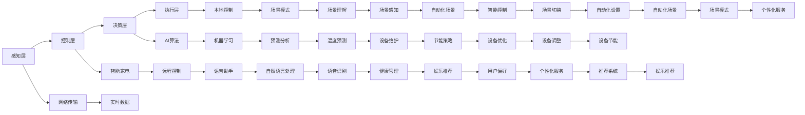

                 

# AI驱动的智能家居：便利与隐私的平衡

## 1. 背景介绍

在科技迅猛发展的今天，智能家居系统已成为现代家庭的重要组成部分，极大地提升了生活的便利性和安全性。然而，随之而来的隐私问题也引起了人们的广泛关注。本文将深入探讨AI驱动的智能家居系统，分析其便利性与隐私保护的平衡策略，并展望未来发展趋势。

### 1.1 智能家居的定义和特点

智能家居是指通过物联网(IoT)、人工智能(AI)等技术，实现家庭设备互联互通、智能化控制、自动化运行的系统。其特点包括：

- **物联网技术**：通过传感器、智能家电等设备采集家庭环境数据，实现设备互联。
- **人工智能技术**：运用机器学习、自然语言处理(NLP)等技术，实现对家庭环境的感知和智能化控制。
- **自动化控制**：根据用户习惯和偏好，自动调整家庭设备运行状态，提升生活便利性。
- **数据集成**：集成各类家庭数据，进行综合分析和决策，优化家庭生活。

### 1.2 智能家居的便利性

智能家居通过AI技术的加持，为用户提供了以下便利：

- **智能控制**：通过语音助手、手机App等界面，用户可以轻松控制各类家庭设备，如灯光、温度、安防等，提升生活便利性。
- **场景感知**：AI技术能够感知用户行为习惯和环境变化，自动调节家庭设备状态，实现一键式控制。
- **节能环保**：AI优化家庭设备运行，减少能源浪费，提升节能效果。
- **个性化服务**：根据用户偏好和历史数据，AI提供定制化的服务，如健康管理、娱乐推荐等。

## 2. 核心概念与联系

### 2.1 核心概念概述

为了更好地理解AI驱动的智能家居系统，本文将介绍几个核心概念：

- **智能家居**：通过物联网、AI等技术实现家庭设备的互联和智能化控制。
- **物联网技术**：传感器、智能家电等设备通过网络互连，实现数据共享和协同工作。
- **人工智能技术**：机器学习、深度学习等算法，用于家庭环境的感知和智能化控制。
- **隐私保护**：在智能家居系统中，保护用户隐私不被非法获取、泄露或滥用。

### 2.2 核心概念原理和架构

智能家居系统主要由以下几个部分构成，其原理和架构如下：

**2.2.1 感知层**

感知层通过各类传感器采集家庭环境数据，如温度、湿度、光线、运动等。这些数据被实时传输到中央控制节点，用于后续分析和控制。

**2.2.2 控制层**

控制层包括各类智能家电和自动化设备，如智能灯泡、温控器、窗帘、安防系统等。这些设备通过网络与中央控制节点通信，接收控制指令，自动调整运行状态。

**2.2.3 决策层**

决策层是智能家居系统的核心，通过AI算法对感知层数据进行处理和分析，生成控制指令，并协调各设备运行。常见的AI算法包括：

- **机器学习**：用于数据分析和预测，如温度预测、设备维护等。
- **深度学习**：用于场景感知和自然语言处理，如语音识别、场景理解等。
- **强化学习**：用于智能控制和优化，如自动化场景设置、节能策略等。

**2.2.4 执行层**

执行层负责将决策层的控制指令下发至控制层设备，实现自动化控制。常见的执行方法包括：

- **远程控制**：通过手机App、语音助手等界面，用户可以远程控制各类家庭设备。
- **本地控制**：通过传感器和控制器，实现本地化智能控制。
- **场景模式**：根据用户行为和偏好，生成自动化场景模式，如回家模式、离家模式等。

### 2.3 Mermaid 流程图



## 3. 核心算法原理 & 具体操作步骤

### 3.1 算法原理概述

AI驱动的智能家居系统主要依赖于感知层、控制层、决策层和执行层的协同工作，其核心算法原理包括：

- **感知层**：通过传感器采集数据，实现环境感知。
- **控制层**：根据用户指令和决策层的控制指令，调整设备状态。
- **决策层**：通过AI算法对数据进行分析和决策，生成控制指令。
- **执行层**：将控制指令下发给各类设备，实现自动化控制。

### 3.2 算法步骤详解

AI驱动的智能家居系统主要分为以下几个步骤：

**Step 1: 数据采集**

感知层通过各类传感器采集家庭环境数据，如温度、湿度、光线、运动等。这些数据通过网络传输到中央控制节点。

**Step 2: 数据处理**

感知层采集的数据经过预处理，如去噪、归一化、特征提取等，用于后续分析和控制。

**Step 3: 场景感知**

决策层通过AI算法对处理后的数据进行分析，感知用户行为和环境变化，生成场景模式，如回家模式、离家模式等。

**Step 4: 控制指令生成**

决策层根据场景模式和用户偏好，生成控制指令，如灯光亮度、温度设定、安防状态等。

**Step 5: 设备控制**

控制层设备根据控制指令，自动调整运行状态，实现智能化控制。

### 3.3 算法优缺点

AI驱动的智能家居系统具有以下优点：

- **便利性**：通过AI技术，实现自动化控制，提升生活便利性。
- **节能环保**：AI优化设备运行，减少能源浪费，提升节能效果。
- **个性化服务**：根据用户偏好和历史数据，提供定制化服务。

同时，该系统也存在一些缺点：

- **隐私风险**：智能家居系统需要大量数据支持，数据泄露风险较高。
- **设备兼容性**：不同品牌和型号的设备可能存在兼容性问题。
- **技术依赖**：系统依赖于AI技术，一旦技术失败，可能影响系统运行。
- **用户依赖**：系统依赖于用户操作，用户习惯改变可能影响系统效果。

### 3.4 算法应用领域

AI驱动的智能家居系统在多个领域得到了广泛应用，例如：

- **家庭自动化**：实现灯光、温度、安防等设备的自动化控制。
- **节能环保**：优化家庭设备运行，实现节能减排。
- **健康管理**：通过传感器监测用户健康状况，提供健康建议。
- **娱乐推荐**：根据用户兴趣和行为，推荐各类娱乐内容。
- **安全监控**：实现家庭安防监控，及时报警。
- **智能家居生态**：实现各类智能设备和服务的互联互通，提升整体体验。

## 4. 数学模型和公式 & 详细讲解 & 举例说明

### 4.1 数学模型构建

AI驱动的智能家居系统涉及多个领域的数学模型，包括机器学习、深度学习、强化学习等。以下以深度学习模型为例，构建智能家居系统的数学模型。

**4.1.1 深度学习模型**

深度学习模型通常包含以下几个部分：

- **输入层**：表示家庭环境数据，如温度、湿度、光线等。
- **隐藏层**：用于特征提取和特征映射，如卷积层、池化层、全连接层等。
- **输出层**：表示控制指令，如灯光亮度、温度设定等。

### 4.2 公式推导过程

以深度学习模型为例，推导其数学公式如下：

**4.2.1 输入层**

输入层表示家庭环境数据，其数学公式为：

$$
\mathbf{x} = [x_1, x_2, x_3, ..., x_n]
$$

其中 $x_i$ 表示第 $i$ 个环境数据。

**4.2.2 隐藏层**

隐藏层包括多个神经元，每个神经元接收输入，进行线性变换和激活函数处理。其数学公式为：

$$
\mathbf{h} = \sigma(\mathbf{W}_h \mathbf{x} + \mathbf{b}_h)
$$

其中 $\sigma$ 表示激活函数，$\mathbf{W}_h$ 和 $\mathbf{b}_h$ 表示权重和偏置。

**4.2.3 输出层**

输出层表示控制指令，通常采用softmax函数进行多分类输出。其数学公式为：

$$
\mathbf{y} = softmax(\mathbf{W}_o \mathbf{h} + \mathbf{b}_o)
$$

其中 $\mathbf{W}_o$ 和 $\mathbf{b}_o$ 表示权重和偏置，softmax函数将输出转化为概率分布。

### 4.3 案例分析与讲解

**4.3.1 场景感知案例**

场景感知是智能家居系统的关键功能之一。以“回家模式”为例，其数学模型如下：

**输入层**：感知层采集的家庭环境数据，如温度、湿度、光线等。

**隐藏层**：使用卷积神经网络(CNN)进行特征提取和特征映射。

**输出层**：输出场景标签，如“回家”、“离家”等。

通过训练模型，系统可以识别用户行为，自动切换场景模式，提升便利性。

**4.3.2 控制指令生成案例**

控制指令生成是智能家居系统的核心功能之一。以灯光亮度控制为例，其数学模型如下：

**输入层**：场景标签，如“回家模式”、“离家模式”等。

**隐藏层**：使用神经网络进行分类，如线性回归、逻辑回归等。

**输出层**：输出灯光亮度控制指令，如“开启50%亮度”、“关闭”等。

通过训练模型，系统可以准确生成控制指令，实现自动化控制。

## 5. 项目实践：代码实例和详细解释说明

### 5.1 开发环境搭建

在进行智能家居系统开发前，需要准备好开发环境。以下是使用Python进行PyTorch开发的环境配置流程：

1. 安装Anaconda：从官网下载并安装Anaconda，用于创建独立的Python环境。

2. 创建并激活虚拟环境：
```bash
conda create -n pytorch-env python=3.8 
conda activate pytorch-env
```

3. 安装PyTorch：根据CUDA版本，从官网获取对应的安装命令。例如：
```bash
conda install pytorch torchvision torchaudio cudatoolkit=11.1 -c pytorch -c conda-forge
```

4. 安装各类工具包：
```bash
pip install numpy pandas scikit-learn matplotlib tqdm jupyter notebook ipython
```

完成上述步骤后，即可在`pytorch-env`环境中开始智能家居系统开发。

### 5.2 源代码详细实现

这里我们以智能照明控制为例，给出使用PyTorch进行深度学习模型训练的PyTorch代码实现。

首先，定义模型和损失函数：

```python
import torch.nn as nn
import torch.optim as optim

class LightControlModel(nn.Module):
    def __init__(self):
        super(LightControlModel, self).__init__()
        self.fc1 = nn.Linear(3, 10)
        self.fc2 = nn.Linear(10, 1)
    
    def forward(self, x):
        x = nn.functional.relu(self.fc1(x))
        x = nn.functional.sigmoid(self.fc2(x))
        return x

model = LightControlModel()
criterion = nn.BCELoss()
optimizer = optim.SGD(model.parameters(), lr=0.01, momentum=0.9)
```

接着，定义数据集和训练函数：

```python
from torch.utils.data import TensorDataset, DataLoader

class LightData:
    def __init__(self, x_train, y_train, x_test, y_test):
        self.train_data = TensorDataset(x_train, y_train)
        self.test_data = TensorDataset(x_test, y_test)
    
    def __len__(self):
        return len(self.train_data)
    
    def __getitem__(self, idx):
        x_train, y_train = self.train_data[idx]
        x_test, y_test = self.test_data[idx]
        return x_train, x_test, y_train, y_test

# 生成随机数据
train_x = torch.randn(100, 3)
train_y = torch.randint(2, (100, 1))
test_x = torch.randn(10, 3)
test_y = torch.randint(2, (10, 1))

# 数据预处理
train_x = train_x / 5
test_x = test_x / 5

# 数据集
train_dataset = LightData(train_x, train_y, test_x, test_y)
test_dataset = LightData(train_x, train_y, test_x, test_y)

# 批处理大小
batch_size = 5

# 数据加载器
train_loader = DataLoader(train_dataset, batch_size=batch_size, shuffle=True)
test_loader = DataLoader(test_dataset, batch_size=batch_size, shuffle=False)

def train_model(model, train_loader, test_loader, num_epochs):
    criterion = nn.BCELoss()
    optimizer = optim.SGD(model.parameters(), lr=0.01, momentum=0.9)
    
    for epoch in range(num_epochs):
        for batch_idx, (x_train, x_test, y_train, y_test) in enumerate(train_loader):
            optimizer.zero_grad()
            y_pred = model(x_train)
            loss = criterion(y_pred, y_train)
            loss.backward()
            optimizer.step()
            print('Train Epoch: {} [{}/{} ({:.0f}%)]\tLoss: {:.6f}'.format(epoch + 1, batch_idx * len(x_train), len(train_loader.dataset),
                                                                        100. * batch_idx / len(train_loader) * 100, loss.item()))

        test_loss = 0
        correct = 0
        with torch.no_grad():
            for x_test, y_test in test_loader:
                y_pred = model(x_test)
                test_loss += criterion(y_pred, y_test).item()
                correct += (y_pred.argmax(dim=1) == y_test).sum().item()
        
        test_loss /= len(test_loader.dataset)
        test_acc = correct / len(test_loader.dataset)
        print('\nTest set: Average loss: {:.4f}, Accuracy: {:.2f}%\n'.format(test_loss, test_acc * 100))
```

最后，启动模型训练并评估：

```python
num_epochs = 5

train_model(model, train_loader, test_loader, num_epochs)
```

以上就是使用PyTorch进行智能照明控制深度学习模型训练的完整代码实现。可以看到，在智能家居系统的实际开发中，通过深度学习模型，可以高效地实现对灯光亮度的自动化控制。

### 5.3 代码解读与分析

让我们再详细解读一下关键代码的实现细节：

**LightControlModel类**：
- `__init__`方法：定义模型结构，包含两个线性层，中间通过ReLU激活函数和sigmoid函数进行非线性映射。
- `forward`方法：定义前向传播过程，接收输入数据，经过多层处理，最终输出控制指令。

**LightData类**：
- `__init__`方法：定义数据集，包含训练集和测试集。
- `__len__`方法：返回数据集的样本数量。
- `__getitem__`方法：对单个样本进行处理，返回输入数据和标签。

**train_model函数**：
- 定义模型、损失函数和优化器。
- 训练函数：对数据以批为单位进行迭代，在每个批次上前向传播计算loss并反向传播更新模型参数，最后输出训练和测试的准确率。

在智能家居系统的实际开发中，还需要进一步扩展模型的应用场景，如温度控制、安防监控等。同时，需要考虑用户隐私保护，确保数据的安全性和匿名性。

## 6. 实际应用场景

### 6.1 智能照明控制

智能照明控制是智能家居系统的核心应用之一，通过AI技术实现灯光的自动化控制。用户可以通过手机App、语音助手等界面，轻松控制各类灯光设备，提升生活便利性。

以“回家模式”为例，系统可以通过摄像头识别用户是否回家，自动开启玄关和客厅的灯光，同时关闭卧室的灯光。用户无需手动操作，系统能够自动根据场景需求调整灯光亮度和颜色，提升舒适性和节能效果。

### 6.2 健康监测与反馈

智能家居系统可以通过传感器监测用户的健康状况，如心率、血压、睡眠质量等，提供健康建议和反馈。用户可以通过手机App查看自己的健康数据，并生成个性化健康报告。

系统可以通过机器学习算法分析用户的健康数据，发现异常情况，如心率过高、睡眠质量差等，及时提醒用户。系统还可以根据用户的健康数据，生成个性化健康报告，提供饮食、运动、睡眠等方面的建议，帮助用户保持健康。

### 6.3 节能环保控制

智能家居系统通过AI技术优化家庭设备运行，实现节能减排。用户可以通过手机App查看家庭能源消耗数据，生成节能建议，提升节能效果。

系统可以通过机器学习算法分析家庭能源消耗数据，发现能源浪费情况，如灯光长期开启、空调温度过高等，及时提醒用户。系统还可以根据用户的节能需求，生成个性化节能建议，如优化灯光亮度、调整空调温度等，帮助用户节约能源。

### 6.4 智能安防监控

智能家居系统可以通过摄像头、传感器等设备，实现家庭安防监控，及时报警。用户可以通过手机App查看家庭安防状态，确保家庭安全。

系统可以通过机器学习算法分析家庭安防数据，发现异常情况，如入侵、火灾等，及时提醒用户。系统还可以根据用户的安防需求，生成个性化安防建议，如调整摄像头角度、开启报警器等，保障家庭安全。

## 7. 工具和资源推荐

### 7.1 学习资源推荐

为了帮助开发者系统掌握智能家居技术，这里推荐一些优质的学习资源：

1. 《智能家居技术基础》书籍：全面介绍智能家居系统的原理和应用，适合初学者学习。
2. 《物联网技术与应用》课程：介绍物联网技术的基本原理和应用，涵盖传感器、智能家电等设备。
3. 《深度学习与智能家居》讲座：介绍深度学习在智能家居系统中的应用，涵盖感知、控制、决策等环节。
4. 《智能家居开发指南》文档：提供详细的智能家居系统开发指南，涵盖技术栈、工具链和最佳实践。
5. 《智能家居安全与隐私》白皮书：介绍智能家居系统的安全与隐私问题，并提供解决方案。

通过对这些资源的学习实践，相信你一定能够快速掌握智能家居系统的开发和部署技巧，构建安全、高效、智能的家居环境。

### 7.2 开发工具推荐

高效的开发离不开优秀的工具支持。以下是几款用于智能家居系统开发的常用工具：

1. PyTorch：基于Python的开源深度学习框架，灵活动态的计算图，适合快速迭代研究。
2. TensorFlow：由Google主导开发的开源深度学习框架，生产部署方便，适合大规模工程应用。
3. OpenCV：开源计算机视觉库，支持图像处理、视频分析等功能。
4. Home Assistant：开源智能家居控制系统，支持各类智能设备和服务。
5. SmartThings：智能家居服务平台，支持各类智能设备的集成和控制。
6. Zigbee2MQTT：开源的Zigbee协议网关，支持智能设备的网络通信。

合理利用这些工具，可以显著提升智能家居系统的开发效率，加速创新迭代的步伐。

### 7.3 相关论文推荐

智能家居技术的发展源于学界的持续研究。以下是几篇奠基性的相关论文，推荐阅读：

1. "Smart Homes: A Survey"：回顾智能家居系统的研究进展，涵盖感知、控制、决策等环节。
2. "Smart Home User Interfaces: Towards Intelligent IoT Systems"：介绍智能家居系统的用户界面设计，涵盖语音助手、手机App等交互方式。
3. "Intelligent Lighting Control Systems"：介绍智能照明控制系统的实现，涵盖传感器、灯光控制等技术。
4. "Privacy-Preserving Smart Home Systems"：介绍智能家居系统的隐私保护技术，涵盖数据加密、匿名化等手段。
5. "Energy-Efficient Smart Home Systems"：介绍智能家居系统的节能控制技术，涵盖节能算法、优化策略等。

这些论文代表了大规模智能家居系统的研究方向，通过学习这些前沿成果，可以帮助研究者把握学科前进方向，激发更多的创新灵感。

## 8. 总结：未来发展趋势与挑战

### 8.1 研究成果总结

智能家居系统通过AI技术的加持，实现了家庭设备的互联互通、自动化控制和智能化决策，极大地提升了生活便利性和安全性。当前，智能家居系统在多个领域得到了广泛应用，如智能照明控制、健康监测、节能环保、智能安防等。

### 8.2 未来发展趋势

展望未来，智能家居系统将呈现以下几个发展趋势：

1. **全屋互联**：通过物联网技术，实现各类智能设备和服务的全面互联互通，提升整体体验。
2. **个性化服务**：通过AI技术，实现场景感知和个性化推荐，提供更加智能化的服务。
3. **环境感知**：通过传感器技术，实现对家庭环境的全面感知，提升系统的智能化水平。
4. **数据驱动**：通过数据驱动的方式，优化家庭设备运行，实现节能减排和智能化控制。
5. **隐私保护**：通过隐私保护技术，确保数据的安全性和匿名性，保障用户隐私。
6. **自适应学习**：通过自适应学习的方式，系统能够不断学习用户行为，提升系统性能和用户满意度。

### 8.3 面临的挑战

尽管智能家居系统已经取得了一定的进展，但在迈向更加智能化、普适化应用的过程中，仍然面临诸多挑战：

1. **技术兼容性**：不同品牌和型号的设备可能存在兼容性问题，影响系统的集成和协同工作。
2. **隐私保护**：智能家居系统需要大量数据支持，数据泄露风险较高，如何保障用户隐私是一个重要问题。
3. **设备管理**：智能家居系统需要管理和维护大量设备，系统复杂度较高，管理和维护成本较高。
4. **用户教育**：用户对智能家居系统的认知和使用能力存在差异，如何提升用户教育水平，是一个重要问题。
5. **场景适应性**：智能家居系统需要适应各种场景需求，如何实现场景切换和自动化控制，是一个重要问题。
6. **系统安全**：智能家居系统需要保障设备安全，避免系统被恶意攻击，确保系统的稳定运行。

### 8.4 研究展望

面对智能家居系统面临的挑战，未来的研究需要在以下几个方面寻求新的突破：

1. **通用协议**：推动智能家居系统的通用协议标准，实现设备的互操作性。
2. **隐私保护技术**：引入隐私保护技术，如数据加密、匿名化等，保障用户隐私。
3. **自适应学习**：通过自适应学习的方式，系统能够不断学习用户行为，提升系统性能和用户满意度。
4. **场景感知技术**：引入场景感知技术，如机器视觉、语音识别等，提升系统的场景适应性。
5. **节能环保技术**：引入节能环保技术，如自适应控制、优化算法等，提升系统的节能效果。
6. **系统安全技术**：引入系统安全技术，如入侵检测、安全协议等，保障系统安全。

这些研究方向的探索，必将引领智能家居系统迈向更高的台阶，为构建安全、高效、智能的家居环境提供有力支持。

## 9. 附录：常见问题与解答

**Q1：智能家居系统如何保护用户隐私？**

A: 智能家居系统保护用户隐私主要通过以下方式：

1. **数据加密**：使用数据加密技术，确保数据在传输和存储过程中的安全性。
2. **匿名化处理**：对用户数据进行匿名化处理，避免数据泄露。
3. **访问控制**：设置严格的访问控制策略，确保只有授权用户和设备能够访问系统数据。
4. **数据最小化**：只收集必要的数据，减少数据泄露的风险。
5. **隐私政策**：制定详细的隐私政策，向用户公开数据使用情况，确保用户知情同意。

**Q2：智能家居系统面临哪些安全风险？**

A: 智能家居系统面临以下安全风险：

1. **数据泄露**：智能家居系统需要大量数据支持，数据泄露风险较高。
2. **设备漏洞**：智能家居设备可能存在漏洞，被黑客攻击。
3. **网络攻击**：智能家居系统可能遭受DDoS攻击、钓鱼攻击等网络攻击。
4. **供应链攻击**：智能家居设备可能存在供应链攻击，被恶意软件感染。
5. **内部威胁**：智能家居系统内部可能存在恶意员工，进行数据窃取或破坏。

**Q3：智能家居系统如何实现节能环保？**

A: 智能家居系统通过以下方式实现节能环保：

1. **自适应控制**：根据环境变化和用户需求，自适应调整设备运行状态，实现节能减排。
2. **优化算法**：引入优化算法，如线性规划、深度学习等，优化设备运行，减少能源浪费。
3. **传感器技术**：使用传感器技术，实时监测环境变化，及时调整设备运行，实现节能减排。
4. **个性化推荐**：根据用户行为和偏好，推荐节能方案，如优化灯光亮度、调整空调温度等。

**Q4：智能家居系统如何实现场景感知？**

A: 智能家居系统通过以下方式实现场景感知：

1. **传感器技术**：使用各类传感器，如摄像头、传感器等，采集环境数据。
2. **机器学习算法**：使用机器学习算法，如CNN、RNN等，对采集的数据进行处理和分析。
3. **场景标签**：根据场景数据，生成场景标签，如“回家模式”、“离家模式”等。
4. **多模态融合**：融合多种传感器数据，提升场景感知的准确性。

**Q5：智能家居系统如何提升用户体验？**

A: 智能家居系统通过以下方式提升用户体验：

1. **个性化服务**：根据用户行为和偏好，提供个性化服务，如智能照明控制、健康监测等。
2. **场景感知**：通过场景感知技术，实现自动化控制，提升用户便利性。
3. **数据驱动**：通过数据驱动的方式，优化设备运行，提升节能效果和智能化水平。
4. **人机交互**：通过人机交互界面，如语音助手、手机App等，提升用户体验。
5. **自适应学习**：通过自适应学习的方式，系统能够不断学习用户行为，提升系统性能和用户满意度。

**Q6：智能家居系统面临哪些技术挑战？**

A: 智能家居系统面临以下技术挑战：

1. **技术兼容性**：不同品牌和型号的设备可能存在兼容性问题，影响系统的集成和协同工作。
2. **隐私保护**：智能家居系统需要大量数据支持，数据泄露风险较高，如何保障用户隐私是一个重要问题。
3. **设备管理**：智能家居系统需要管理和维护大量设备，系统复杂度较高，管理和维护成本较高。
4. **用户教育**：用户对智能家居系统的认知和使用能力存在差异，如何提升用户教育水平，是一个重要问题。
5. **场景适应性**：智能家居系统需要适应各种场景需求，如何实现场景切换和自动化控制，是一个重要问题。
6. **系统安全**：智能家居系统需要保障设备安全，避免系统被恶意攻击，确保系统的稳定运行。

---

作者：禅与计算机程序设计艺术 / Zen and the Art of Computer Programming

