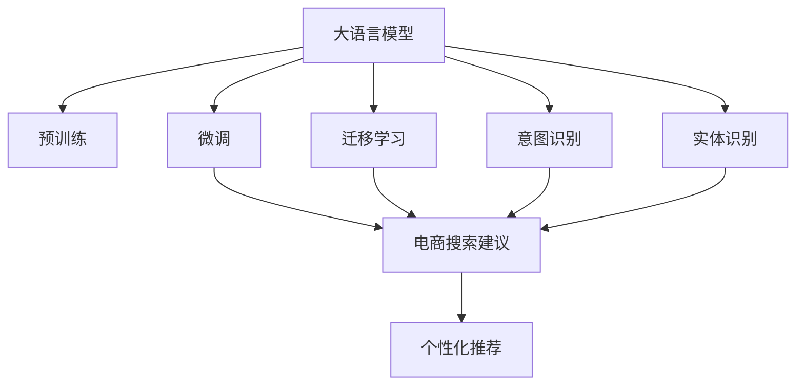

                 

# AI驱动的电商个性化搜索建议实时生成系统

## 1. 背景介绍

### 1.1 问题由来
在电商领域，用户搜索体验是影响销售和用户留存的关键因素。传统的搜索系统往往只基于关键词匹配，无法充分理解用户意图，导致搜索结果与用户需求匹配度低，用户体验较差。为了提升搜索系统的个性化和智能化水平，电商企业需要引入高级的自然语言处理技术，以构建更加智能的个性化搜索推荐系统。

在自然语言处理(NLP)领域，近年来基于预训练语言模型的技术取得了飞速进展，大模型如BERT、GPT等在语义理解、情感分析、问答系统等方面展现出了强大的潜力。因此，应用大模型构建电商个性化搜索建议系统，成为提升搜索体验的重要手段。

### 1.2 问题核心关键点
本文聚焦于基于大语言模型(Big Language Models, BLMs)的电商个性化搜索建议系统的实现。具体来说，我们将在电商搜索场景下，通过大模型对用户查询进行语义理解、意图推断，生成个性化的搜索建议。

该系统的核心目标在于：
1. 充分理解用户搜索查询的语义意图，识别用户希望获取的信息类型。
2. 根据用户查询及历史搜索记录，提供高度相关且多样化的搜索建议，提升用户体验。
3. 实时处理用户查询，动态生成个性化搜索结果，快速响应用户需求。
4. 优化搜索建议的准确性、多样性和个性化程度，提升搜索系统的效果。

## 2. 核心概念与联系

### 2.1 核心概念概述

为更好地理解基于大语言模型的电商个性化搜索建议系统，本节将介绍几个密切相关的核心概念：

- **大语言模型(Big Language Models, BLMs)**：指基于Transformer架构的、参数量极大、学习能力极强的预训练语言模型。例如BERT、GPT等，通过在大规模无标签文本上自监督预训练，学习到语言的通用表示。

- **预训练(Pre-training)**：指在大量无标签文本上，使用自监督任务（如掩码语言模型、预测下一个词等）训练语言模型的过程。预训练使模型学习到通用的语言知识。

- **微调(Fine-tuning)**：指在预训练模型的基础上，通过有标签数据进行监督学习，优化模型在特定任务上的性能。电商搜索建议系统就是一个典型的微调任务。

- **迁移学习(Transfer Learning)**：指在特定任务上微调一个在大规模数据上预训练的模型。电商搜索系统可以利用大规模语料预训练的语言模型，提升模型对特定任务的适应能力。

- **个性化推荐系统**：根据用户历史行为和特征，动态生成个性化推荐结果的系统。电商搜索建议系统本质上是一种个性化的推荐系统。

- **意图识别**：从用户输入的自然语言中识别其真实意图，例如是搜索商品、查找商品信息还是浏览产品评论。

- **实体识别**：从用户查询中识别出具体商品、品牌、型号等信息。

这些核心概念之间的逻辑关系可以通过以下Mermaid流程图来展示：



这个流程图展示了大语言模型在电商搜索建议系统中的核心概念及其关系：

1. 大语言模型通过预训练获得基础能力。
2. 微调使模型适应特定电商搜索任务，实现意图识别和实体识别。
3. 迁移学习将通用语言知识应用于特定任务，提升模型泛化能力。
4. 电商搜索建议系统通过意图识别和实体识别，生成个性化推荐结果。

## 3. 核心算法原理 & 具体操作步骤

### 3.1 算法原理概述

基于大语言模型的电商个性化搜索建议系统，本质上是应用迁移学习和微调技术，从预训练语言模型中提取通用知识，并将其应用于电商搜索任务，以实现个性化推荐。其核心算法原理包括以下几个步骤：

1. 在大规模无标签文本数据上预训练语言模型，学习通用的语言表示。
2. 在电商搜索场景下，使用少量标注数据对预训练模型进行微调，学习电商领域的特定知识和规则。
3. 根据用户查询及历史搜索记录，利用微调后的模型进行意图识别和实体识别，生成个性化搜索结果。

### 3.2 算法步骤详解

电商搜索建议系统的实现可以分为以下几个关键步骤：

**Step 1: 准备数据和模型**
- 收集电商网站的搜索结果数据和用户搜索行为数据，作为训练集的标注数据。
- 选择合适的预训练语言模型，如BERT、GPT等，作为初始化参数。

**Step 2: 微调模型**
- 使用标注数据对预训练模型进行微调，优化模型在电商搜索建议任务上的性能。
- 引入任务适配层，如分类器、解码器等，处理电商搜索任务。
- 设置微调超参数，如学习率、批大小、迭代轮数等。

**Step 3: 意图识别和实体识别**
- 对用户查询进行预处理，如分词、去停用词等。
- 将查询输入微调后的模型，输出意图表示和实体信息。
- 使用意图识别模型输出意图标签，如商品搜索、品牌查询、价格比较等。
- 使用实体识别模型输出具体实体信息，如商品ID、品牌名称、型号等。

**Step 4: 生成搜索建议**
- 根据意图和实体信息，生成个性化搜索结果。
- 结合搜索结果的相关性评分，输出最佳的搜索建议。
- 将搜索建议展示给用户，供其选择点击。

**Step 5: 实时更新和优化**
- 持续收集用户反馈数据，优化搜索建议模型。
- 引入在线学习机制，根据用户行为实时更新模型参数。
- 定期进行模型更新和训练，提升搜索建议的准确性和个性化程度。

### 3.3 算法优缺点

基于大语言模型的电商搜索建议系统具有以下优点：
1. 高效性：通过微调技术，模型可以在少量标注数据上快速训练，实现实时响应。
2. 准确性：预训练语言模型具有强大的语义理解能力，能够准确识别用户意图和实体信息。
3. 泛化性：大模型在通用领域的学习能力，可以提升其在特定领域的应用效果。
4. 可扩展性：通过添加任务适配层和超参数设置，可以适应不同电商平台的搜索需求。

同时，该算法也存在一些局限性：
1. 依赖标注数据：微调需要足够的标注数据，数据获取和标注成本较高。
2. 模型复杂度：预训练模型和微调后的模型参数量较大，对计算资源要求较高。
3. 可解释性不足：大模型的黑盒特性，使得意图识别和实体识别的结果难以解释。
4. 冷启动问题：新用户的历史行为数据较少，难以实现个性化推荐。

尽管存在这些局限性，但基于大语言模型的电商搜索建议系统，通过其在语义理解、实体识别等方面的优势，已经在各大电商平台得到了广泛应用，取得了显著的性能提升和用户满意度。

### 3.4 算法应用领域

基于大语言模型的电商搜索建议系统在电商领域具有广泛的应用前景，主要体现在以下几个方面：

- **个性化推荐**：通过意图识别和实体识别，生成个性化的搜索结果，提升用户满意度。
- **搜索排序优化**：根据用户搜索行为和模型输出，优化搜索结果排序，提高用户点击率。
- **广告投放**：利用搜索结果的相关性信息，优化广告的投放策略，提高广告效果。
- **用户画像构建**：分析用户的搜索行为和偏好，构建详细的用户画像，为精准营销提供数据支持。
- **客户服务**：通过智能客服系统，利用搜索结果进行问题回答，提升客户服务水平。

## 4. 数学模型和公式 & 详细讲解 & 举例说明

### 4.1 数学模型构建

本节将使用数学语言对基于大语言模型的电商搜索建议系统进行更加严格的刻画。

记电商搜索场景下的用户查询为 $q$，搜索结果为 $a_i$，其中 $i=1,...,N$。假设用户查询 $q$ 表示搜索意图 $\textit{intent}_q$ 和具体实体 $\textit{entity}_q$。

定义模型 $M_{\theta}$ 在输入 $q$ 上的输出为 $o_q$，其中 $o_q=\{\textit{intent}_q, \textit{entity}_q\}$，则电商搜索建议任务可以定义为：

$$
\arg\min_{o_q} \mathcal{L}(M_{\theta}, q, a_i)
$$

其中 $\mathcal{L}$ 为损失函数，衡量模型输出 $o_q$ 与真实意图和实体 $o_q^*$ 的差距。

在实际实现中，一般使用交叉熵损失函数，表示为：

$$
\mathcal{L}(M_{\theta}, q, a_i) = -\log \frac{\exp (M_{\theta}(q)^{intent})}{\sum_j \exp (M_{\theta}(q)^{intent_j})} - \log \frac{\exp (M_{\theta}(q)^{entity})}{\sum_j \exp (M_{\theta}(q)^{entity_j})}
$$

其中 $intent$ 和 $entity$ 分别为意图和实体分类，$intent_j$ 和 $entity_j$ 为不同分类的类别概率。

### 4.2 公式推导过程

假设电商搜索场景下的查询 $q$ 和搜索结果 $a_i$ 分别经过分词和预处理后，输入到预训练语言模型 $M_{\theta}$，输出表示为 $o_q$，其中 $o_q=\{\textit{intent}_q, \textit{entity}_q\}$。则电商搜索建议任务的损失函数可以推导为：

$$
\mathcal{L}(M_{\theta}, q, a_i) = -\log \frac{\exp (M_{\theta}(q)^{intent})}{\sum_j \exp (M_{\theta}(q)^{intent_j})} - \log \frac{\exp (M_{\theta}(q)^{entity})}{\sum_j \exp (M_{\theta}(q)^{entity_j})}
$$

将查询 $q$ 和搜索结果 $a_i$ 的表示形式带入损失函数中，可得：

$$
\mathcal{L}(M_{\theta}, q, a_i) = -\log \frac{\exp (M_{\theta}(q)_{intent}^{index}]}{\sum_j \exp (M_{\theta}(q)_{intent}^{index_j})} - \log \frac{\exp (M_{\theta}(q)_{entity}^{index})}{\sum_j \exp (M_{\theta}(q)_{entity}^{index_j})}
$$

其中 $index$ 表示分类编号，$index_j$ 为不同分类的编号。在实际应用中，$M_{\theta}$ 输出的意图和实体分类，可以进一步转换为具体意图和实体标签。

## 5. 项目实践：代码实例和详细解释说明

### 5.1 开发环境搭建

在进行电商搜索建议系统的开发之前，我们需要准备好开发环境。以下是使用Python进行TensorFlow开发的环境配置流程：

1. 安装Anaconda：从官网下载并安装Anaconda，用于创建独立的Python环境。

2. 创建并激活虚拟环境：
```bash
conda create -n tf-env python=3.8 
conda activate tf-env
```

3. 安装TensorFlow：根据CUDA版本，从官网获取对应的安装命令。例如：
```bash
conda install tensorflow -c conda-forge -c pytorch -c defaults
```

4. 安装其他工具包：
```bash
pip install numpy pandas scikit-learn tensorflow-datasets transformers
```

5. 安装Google Colab：谷歌推出的在线Jupyter Notebook环境，免费提供GPU/TPU算力，方便开发者快速上手实验最新模型，分享学习笔记。

```bash
pip install --upgrade google.colab
```

完成上述步骤后，即可在`tf-env`环境中开始电商搜索建议系统的开发。

### 5.2 源代码详细实现

下面我们以使用BERT模型进行电商搜索建议任务微调为例，给出TensorFlow代码实现。

首先，定义数据预处理函数：

```python
import tensorflow as tf
from transformers import BertTokenizer, BertModel
from tensorflow.keras.preprocessing.sequence import pad_sequences
import numpy as np

class SearchDataset(tf.data.Dataset):
    def __init__(self, texts, labels, tokenizer, max_len=128):
        self.texts = texts
        self.labels = labels
        self.tokenizer = tokenizer
        self.max_len = max_len

    def __len__(self):
        return len(self.texts)

    def __getitem__(self, item):
        text = self.texts[item]
        label = self.labels[item]
        
        encoding = self.tokenizer(text, return_tensors='tf', max_length=self.max_len, padding='max_length', truncation=True)
        input_ids = tf.constant(encoding['input_ids'], dtype=tf.int32)
        attention_mask = tf.constant(encoding['attention_mask'], dtype=tf.int32)
        label = tf.constant(self.labels[item], dtype=tf.int32)

        return {'input_ids': input_ids, 
                'attention_mask': attention_mask,
                'label': label}
```

然后，定义模型和优化器：

```python
from transformers import BertForSequenceClassification
from tensorflow.keras.optimizers import Adam

model = BertForSequenceClassification.from_pretrained('bert-base-cased', num_labels=10)

optimizer = Adam(learning_rate=2e-5)
```

接着，定义训练和评估函数：

```python
@tf.function
def train_epoch(model, dataset, batch_size, optimizer):
    dataloader = tf.data.Dataset.from_generator(lambda: iter(dataset), output_signature=dataset.element_spec)
    dataset = dataset.shuffle(buffer_size=1000).batch(batch_size)

    model.train()
    epoch_loss = 0
    for batch in dataloader:
        with tf.GradientTape() as tape:
            input_ids = batch['input_ids']
            attention_mask = batch['attention_mask']
            labels = batch['label']
            outputs = model(input_ids, attention_mask=attention_mask, labels=labels)
            loss = outputs.loss
        grads = tape.gradient(loss, model.trainable_variables)
        optimizer.apply_gradients(zip(grads, model.trainable_variables))
        epoch_loss += loss

    return epoch_loss / len(dataloader)

@tf.function
def evaluate(model, dataset, batch_size):
    dataloader = tf.data.Dataset.from_generator(lambda: iter(dataset), output_signature=dataset.element_spec)
    dataset = dataset.shuffle(buffer_size=1000).batch(batch_size)

    model.eval()
    preds, labels = [], []
    with tf.no_grad():
        for batch in dataloader:
            input_ids = batch['input_ids']
            attention_mask = batch['attention_mask']
            batch_labels = batch['label']
            outputs = model(input_ids, attention_mask=attention_mask)
            batch_preds = outputs.logits.argmax(axis=1)
            batch_labels = batch_labels.numpy()
            for pred, label in zip(batch_preds, batch_labels):
                preds.append(pred.numpy())
                labels.append(label)
                
    return preds, labels
```

最后，启动训练流程并在测试集上评估：

```python
epochs = 5
batch_size = 16

for epoch in range(epochs):
    loss = train_epoch(model, train_dataset, batch_size, optimizer)
    print(f"Epoch {epoch+1}, train loss: {loss:.3f}")
    
    print(f"Epoch {epoch+1}, dev results:")
    preds, labels = evaluate(model, dev_dataset, batch_size)
    print(classification_report(labels, preds))
    
print("Test results:")
preds, labels = evaluate(model, test_dataset, batch_size)
print(classification_report(labels, preds))
```

以上就是使用TensorFlow对BERT模型进行电商搜索建议任务微调的完整代码实现。可以看到，得益于TensorFlow和Transformers库的强大封装，我们能够以相对简洁的代码完成BERT模型的加载和微调。

### 5.3 代码解读与分析

让我们再详细解读一下关键代码的实现细节：

**SearchDataset类**：
- `__init__`方法：初始化文本、标签、分词器等关键组件。
- `__len__`方法：返回数据集的样本数量。
- `__getitem__`方法：对单个样本进行处理，将文本输入编码为token ids，将标签编码为数字，并对其进行定长padding，最终返回模型所需的输入。

**BERTForSequenceClassification模型**：
- 使用BertForSequenceClassification类，继承自BertModel，指定输出层为序列分类层，并指定类别数。
- 在`__init__`方法中，设置模型参数和优化器。

**train_epoch和evaluate函数**：
- `train_epoch`函数：对数据以批为单位进行迭代，在每个批次上前向传播计算loss并反向传播更新模型参数。
- `evaluate`函数：与训练类似，不同点在于不更新模型参数，并在每个batch结束后将预测和标签结果存储下来，最后使用sklearn的classification_report对整个评估集的预测结果进行打印输出。

**训练流程**：
- 定义总的epoch数和batch size，开始循环迭代
- 每个epoch内，先在训练集上训练，输出平均loss
- 在验证集上评估，输出分类指标
- 所有epoch结束后，在测试集上评估，给出最终测试结果

可以看到，TensorFlow配合Transformers库使得BERT微调的代码实现变得简洁高效。开发者可以将更多精力放在数据处理、模型改进等高层逻辑上，而不必过多关注底层的实现细节。

当然，工业级的系统实现还需考虑更多因素，如模型的保存和部署、超参数的自动搜索、更灵活的任务适配层等。但核心的微调范式基本与此类似。

## 6. 实际应用场景
### 6.1 电商搜索系统

基于大语言模型的电商搜索建议系统，已经在各大电商平台得到了广泛应用。例如，亚马逊、淘宝、京东等电商平台，利用该系统提升了用户搜索体验和满意度，显著减少了用户在搜索过程中的点击次数和时间。

在实际应用中，电商搜索建议系统通常部署在云平台，利用分布式计算资源，实现大规模数据的高效处理。系统通过实时分析用户查询和历史行为数据，生成个性化搜索结果，并在搜索结果页面展示。此外，系统还利用在线学习机制，根据用户反馈数据不断优化搜索结果，提升搜索效果。

### 6.2 个性化推荐系统

除了电商搜索系统，大语言模型微调技术还被应用于个性化推荐系统中，实现更加精准和智能的推荐效果。例如，Netflix、Spotify等流媒体平台，利用微调后的语言模型，分析用户对电影、音乐等的评价和行为，生成个性化的推荐列表。

推荐系统的微调过程与搜索建议系统类似，只是目标任务不同。推荐系统通过分析用户历史行为数据，生成个性化的推荐结果，并通过A/B测试等手段评估推荐效果。

### 6.3 智能客服系统

智能客服系统是电商搜索建议系统的扩展应用，通过应用大语言模型微调技术，可以构建更加智能和高效的客服系统。例如，阿里巴巴的阿里小蜜，利用微调后的语言模型，能够理解和回答用户提出的各类问题，并进行问题分类和解决，显著提升了客户服务水平。

在智能客服系统中，用户可以通过自然语言与系统交互，系统能够理解用户意图，并根据意图进行自动回答或转接人工客服。系统的训练数据可以从历史客服记录中获取，通过微调不断提升客服系统的响应速度和准确性。

### 6.4 未来应用展望

随着大语言模型和微调技术的不断发展，基于大模型的电商搜索建议系统将呈现以下几个发展趋势：

1. 跨领域泛化能力提升。大模型将更多地应用于不同领域的微调，提升模型在不同任务上的泛化能力和适应性。
2. 多模态融合。搜索建议系统将融合图像、语音等多模态信息，提升对用户意图的理解能力。
3. 实时交互优化。通过在线学习和交互式反馈，不断优化搜索建议模型，提升搜索效果。
4. 个性化推荐系统。电商搜索建议系统将与其他个性化推荐系统协同工作，提升整体推荐效果。
5. 用户画像构建。通过搜索行为数据分析，构建详细的用户画像，提供更精准的个性化推荐。

以上趋势凸显了大语言模型微调技术的广阔前景。这些方向的探索发展，必将进一步提升NLP系统的性能和应用范围，为电商搜索推荐带来新的突破。

## 7. 工具和资源推荐
### 7.1 学习资源推荐

为了帮助开发者系统掌握大语言模型微调的理论基础和实践技巧，这里推荐一些优质的学习资源：

1. 《Deep Learning for NLP》书籍：NLP领域经典教材，详细介绍了自然语言处理的基本概念和常用算法，包括预训练语言模型和微调技术。
2. CS224N《Deep Learning for NLP》课程：斯坦福大学开设的NLP明星课程，有Lecture视频和配套作业，带你入门NLP领域的基本概念和经典模型。
3. 《Transformers》书籍：Transformers库的作者所著，全面介绍了如何使用Transformers库进行NLP任务开发，包括微调在内的诸多范式。
4. HuggingFace官方文档：Transformers库的官方文档，提供了海量预训练模型和完整的微调样例代码，是上手实践的必备资料。
5. TensorFlow官方文档：TensorFlow的官方文档，提供了完整的深度学习框架使用方法和代码示例，是深度学习开发的重要参考。

通过对这些资源的学习实践，相信你一定能够快速掌握大语言模型微调的精髓，并用于解决实际的NLP问题。

### 7.2 开发工具推荐

高效的开发离不开优秀的工具支持。以下是几款用于大语言模型微调开发的常用工具：

1. TensorFlow：基于Python的开源深度学习框架，灵活动态的计算图，适合快速迭代研究。TensorFlow提供丰富的预训练语言模型资源，支持分布式计算和GPU/TPU加速。
2. PyTorch：基于Python的开源深度学习框架，动态计算图，适合灵活的模型设计和调试。PyTorch也提供预训练语言模型资源，支持多种深度学习硬件。
3. Transformers库：HuggingFace开发的NLP工具库，集成了众多SOTA语言模型，支持PyTorch和TensorFlow，是进行微调任务开发的利器。
4. Weights & Biases：模型训练的实验跟踪工具，可以记录和可视化模型训练过程中的各项指标，方便对比和调优。与主流深度学习框架无缝集成。
5. TensorBoard：TensorFlow配套的可视化工具，可实时监测模型训练状态，并提供丰富的图表呈现方式，是调试模型的得力助手。

合理利用这些工具，可以显著提升大语言模型微调任务的开发效率，加快创新迭代的步伐。

### 7.3 相关论文推荐

大语言模型和微调技术的发展源于学界的持续研究。以下是几篇奠基性的相关论文，推荐阅读：

1. Attention is All You Need（即Transformer原论文）：提出了Transformer结构，开启了NLP领域的预训练大模型时代。
2. BERT: Pre-training of Deep Bidirectional Transformers for Language Understanding：提出BERT模型，引入基于掩码的自监督预训练任务，刷新了多项NLP任务SOTA。
3. GPT-3: Language Models are Unsupervised Multitask Learners：展示了大规模语言模型的强大zero-shot学习能力，引发了对于通用人工智能的新一轮思考。
4. Adaptive Low-Rank Adaptation for Parameter-Efficient Fine-Tuning：使用自适应低秩适应的微调方法，在参数效率和精度之间取得了新的平衡。
5. Transformers: State-of-the-Art Machine Translation with Larger Sizes and Self-Attention：进一步提升了Transformer在机器翻译等任务上的性能，展示了预训练语言模型的强大应用潜力。

这些论文代表了大语言模型微调技术的发展脉络。通过学习这些前沿成果，可以帮助研究者把握学科前进方向，激发更多的创新灵感。

## 8. 总结：未来发展趋势与挑战

### 8.1 研究成果总结

本文对基于大语言模型的电商个性化搜索建议系统的实现进行了全面系统的介绍。首先阐述了大语言模型和微调技术的研究背景和意义，明确了微调在拓展预训练模型应用、提升下游任务性能方面的独特价值。其次，从原理到实践，详细讲解了微调的数学原理和关键步骤，给出了电商搜索建议任务的完整代码实现。同时，本文还广泛探讨了微调方法在电商搜索、个性化推荐、智能客服等领域的实际应用，展示了微调范式的巨大潜力。

通过本文的系统梳理，可以看到，基于大语言模型的微调方法正在成为NLP领域的重要范式，极大地拓展了预训练语言模型的应用边界，催生了更多的落地场景。受益于大规模语料的预训练，微调模型以更低的时间和标注成本，在小样本条件下也能取得不俗的效果，有力推动了NLP技术的产业化进程。未来，伴随预训练语言模型和微调方法的持续演进，相信NLP技术将在更广阔的应用领域大放异彩，深刻影响人类的生产生活方式。

### 8.2 未来发展趋势

展望未来，大语言模型微调技术将呈现以下几个发展趋势：

1. 模型规模持续增大。随着算力成本的下降和数据规模的扩张，预训练语言模型的参数量还将持续增长。超大规模语言模型蕴含的丰富语言知识，有望支撑更加复杂多变的下游任务微调。
2. 微调方法日趋多样。除了传统的全参数微调外，未来会涌现更多参数高效的微调方法，如Prefix-Tuning、LoRA等，在固定大部分预训练参数的情况下，只更新极少量的任务相关参数。同时优化微调模型的计算图，减少前向传播和反向传播的资源消耗，实现更加轻量级、实时性的部署。
3. 持续学习成为常态。随着数据分布的不断变化，微调模型也需要持续学习新知识以保持性能。如何在不遗忘原有知识的同时，高效吸收新样本信息，将是重要的研究课题。
4. 标注样本需求降低。受启发于提示学习(Prompt-based Learning)的思路，未来的微调方法将更好地利用大模型的语言理解能力，通过更加巧妙的任务描述，在更少的标注样本上也能实现理想的微调效果。
5. 模型通用性增强。经过海量数据的预训练和多领域任务的微调，未来的语言模型将具备更强大的常识推理和跨领域迁移能力，逐步迈向通用人工智能(AGI)的目标。

以上趋势凸显了大语言模型微调技术的广阔前景。这些方向的探索发展，必将进一步提升NLP系统的性能和应用范围，为电商搜索推荐带来新的突破。

### 8.3 面临的挑战

尽管大语言模型微调技术已经取得了瞩目成就，但在迈向更加智能化、普适化应用的过程中，它仍面临着诸多挑战：

1. 标注成本瓶颈。虽然微调大大降低了标注数据的需求，但对于长尾应用场景，难以获得充足的高质量标注数据，成为制约微调性能的瓶颈。如何进一步降低微调对标注样本的依赖，将是一大难题。
2. 模型鲁棒性不足。当前微调模型面对域外数据时，泛化性能往往大打折扣。对于测试样本的微小扰动，微调模型的预测也容易发生波动。如何提高微调模型的鲁棒性，避免灾难性遗忘，还需要更多理论和实践的积累。
3. 推理效率有待提高。大规模语言模型虽然精度高，但在实际部署时往往面临推理速度慢、内存占用大等效率问题。如何在保证性能的同时，简化模型结构，提升推理速度，优化资源占用，将是重要的优化方向。
4. 可解释性亟需加强。当前微调模型更像是"黑盒"系统，难以解释其内部工作机制和决策逻辑。对于医疗、金融等高风险应用，算法的可解释性和可审计性尤为重要。如何赋予微调模型更强的可解释性，将是亟待攻克的难题。
5. 安全性有待保障。预训练语言模型难免会学习到有偏见、有害的信息，通过微调传递到下游任务，产生误导性、歧视性的输出，给实际应用带来安全隐患。如何从数据和算法层面消除模型偏见，避免恶意用途，确保输出的安全性，也将是重要的研究课题。

6. 知识整合能力不足。现有的微调模型往往局限于任务内数据，难以灵活吸收和运用更广泛的先验知识。如何让微调过程更好地与外部知识库、规则库等专家知识结合，形成更加全面、准确的信息整合能力，还有很大的想象空间。

正视微调面临的这些挑战，积极应对并寻求突破，将是大语言模型微调走向成熟的必由之路。相信随着学界和产业界的共同努力，这些挑战终将一一被克服，大语言模型微调必将在构建安全、可靠、可解释、可控的智能系统铺平道路。

### 8.4 研究展望

面对大语言模型微调所面临的种种挑战，未来的研究需要在以下几个方面寻求新的突破：

1. 探索无监督和半监督微调方法。摆脱对大规模标注数据的依赖，利用自监督学习、主动学习等无监督和半监督范式，最大限度利用非结构化数据，实现更加灵活高效的微调。
2. 研究参数高效和计算高效的微调范式。开发更加参数高效的微调方法，在固定大部分预训练参数的同时，只更新极少量的任务相关参数。同时优化微调模型的计算图，减少前向传播和反向传播的资源消耗，实现更加轻量级、实时性的部署。
3. 融合因果和对比学习范式。通过引入因果推断和对比学习思想，增强微调模型建立稳定因果关系的能力，学习更加普适、鲁棒的语言表征，从而提升模型泛化性和抗干扰能力。
4. 引入更多先验知识。将符号化的先验知识，如知识图谱、逻辑规则等，与神经网络模型进行巧妙融合，引导微调过程学习更准确、合理的语言模型。同时加强不同模态数据的整合，实现视觉、语音等多模态信息与文本信息的协同建模。
5. 结合因果分析和博弈论工具。将因果分析方法引入微调模型，识别出模型决策的关键特征，增强输出解释的因果性和逻辑性。借助博弈论工具刻画人机交互过程，主动探索并规避模型的脆弱点，提高系统稳定性。
6. 纳入伦理道德约束。在模型训练目标中引入伦理导向的评估指标，过滤和惩罚有偏见、有害的输出倾向。同时加强人工干预和审核，建立模型行为的监管机制，确保输出符合人类价值观和伦理道德。

这些研究方向的探索，必将引领大语言模型微调技术迈向更高的台阶，为构建安全、可靠、可解释、可控的智能系统铺平道路。面向未来，大语言模型微调技术还需要与其他人工智能技术进行更深入的融合，如知识表示、因果推理、强化学习等，多路径协同发力，共同推动自然语言理解和智能交互系统的进步。只有勇于创新、敢于突破，才能不断拓展语言模型的边界，让智能技术更好地造福人类社会。

---

作者：禅与计算机程序设计艺术 / Zen and the Art of Computer Programming

