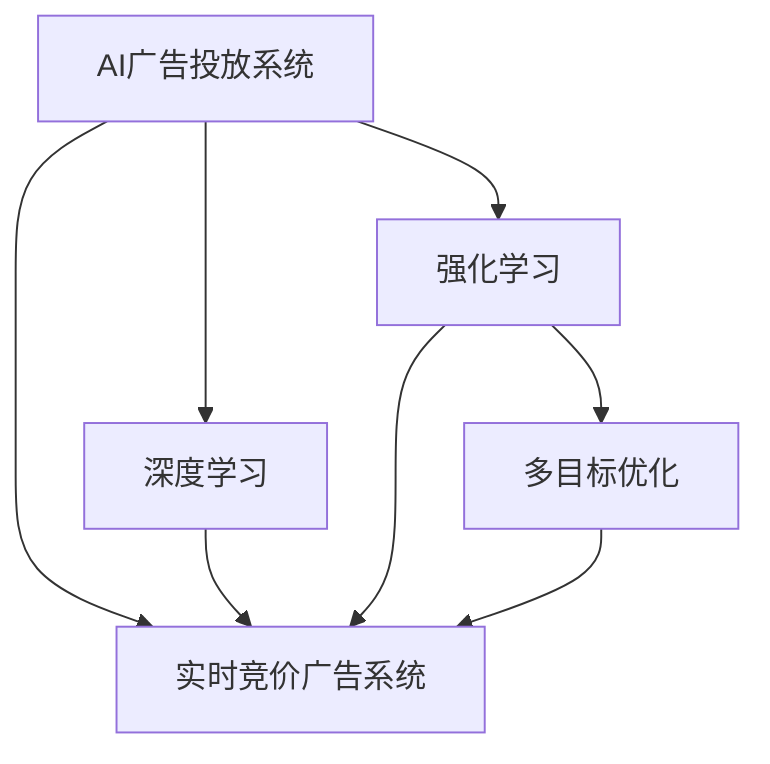

                 

# AI驱动的电商实时竞价广告投放系统

## 1. 背景介绍

### 1.1 问题由来

随着互联网电商的蓬勃发展，广告投放已经成为了电商运营中不可或缺的重要环节。通过精准的广告投放，可以有效提升商品曝光率和转化率，优化运营效果。然而，传统的广告投放系统通常依赖于人工经验和规则，存在操作复杂、投放效果不稳定的问题。

近年来，随着人工智能技术的不断进步，尤其是深度学习和强化学习技术的发展，广告投放逐渐向着智能化、自动化方向发展。AI驱动的广告投放系统通过深度学习模型对用户行为进行预测，实时生成投放策略，以优化广告效果，降低投放成本。特别是实时竞价(Real-Time Bidding, RTB)广告系统，能够根据用户行为实时调整出价策略，进一步提升广告投放的精准度和效果。

### 1.2 问题核心关键点

AI驱动的电商实时竞价广告投放系统主要涉及以下几个关键点：

- 数据采集：收集用户行为数据、广告点击数据、竞价数据等，为模型训练提供数据支持。
- 模型训练：基于深度学习技术，训练广告投放模型，优化出价策略，提高投放效果。
- 实时投放：根据实时数据，动态生成投放策略，自动执行投放操作。
- 效果评估：通过A/B测试等手段，评估广告投放效果，优化投放策略。
- 多目标优化：兼顾广告效果、投放成本、用户体验等多目标，实现综合优化。

这些关键点构成了AI广告投放系统的核心，通过合理设计算法、模型和架构，可以实现智能化的广告投放，提升电商运营的效率和效果。

## 2. 核心概念与联系

### 2.1 核心概念概述

为更好地理解AI驱动的电商实时竞价广告投放系统，本节将介绍几个密切相关的核心概念：

- AI广告投放系统：基于深度学习、强化学习等技术，自动生成广告投放策略的系统。通过预测用户行为，动态调整投放参数，优化广告效果。
- 实时竞价广告系统：一种广告投放机制，通过实时竞价生成广告投放策略，实现精准投放。
- 深度学习：一种机器学习技术，通过多层神经网络模型，自动学习数据特征，实现模式识别、图像识别、自然语言处理等任务。
- 强化学习：一种通过试错训练的机器学习方法，通过与环境的交互，逐步优化行为策略。
- 多目标优化：在多个目标之间进行平衡，实现综合优化。

这些核心概念之间的逻辑关系可以通过以下Mermaid流程图来展示：



这个流程图展示了这个核心概念的逻辑关系：

1. AI广告投放系统通过深度学习和强化学习技术，自动生成广告投放策略。
2. 实时竞价广告系统是AI广告投放系统的一个具体实现，通过实时竞价生成投放策略。
3. 深度学习模型用于提取数据特征，实现广告投放的精准预测。
4. 强化学习用于根据投放效果反馈调整投放策略，优化投放效果。
5. 多目标优化用于平衡广告效果、投放成本、用户体验等多个目标，实现综合优化。

## 3. 核心算法原理 & 具体操作步骤
### 3.1 算法原理概述

AI驱动的电商实时竞价广告投放系统主要基于强化学习算法实现。其核心思想是通过与环境的交互，逐步优化广告投放策略，以最大化广告效果和ROI。

具体而言，系统将用户行为数据、广告点击数据等作为环境状态，广告投放策略和出价策略作为行动，广告效果和投放成本作为奖励。通过不断调整行动，最大化长期奖励，达到优化投放策略的目的。

### 3.2 算法步骤详解

AI驱动的电商实时竞价广告投放系统的算法步骤包括：

**Step 1: 数据采集**

- 收集用户行为数据，如浏览记录、点击记录等。
- 收集广告投放数据，如广告展示量、点击量、转化率等。
- 收集竞价数据，如出价记录、竞价结果等。

**Step 2: 模型训练**

- 基于深度学习模型，如DNN、CNN、RNN、LSTM等，提取用户行为数据特征。
- 基于强化学习算法，如Q-Learning、Deep Q-Networks等，训练广告投放模型。
- 使用A/B测试等手段评估模型效果，进行模型调优。

**Step 3: 实时投放**

- 根据实时数据，动态生成投放策略，调整出价。
- 自动执行广告投放操作，通过API接口与广告平台交互。
- 记录投放结果，更新模型参数。

**Step 4: 效果评估**

- 统计广告效果指标，如点击率、转化率、ROI等。
- 通过A/B测试等手段评估投放效果，优化投放策略。
- 根据投放效果反馈，调整模型参数。

**Step 5: 多目标优化**

- 设计多目标优化算法，平衡广告效果、投放成本、用户体验等目标。
- 通过权重调节、惩罚机制等方式实现多目标优化。
- 动态调整投放策略，实现综合优化。

以上算法步骤实现了AI广告投放系统的核心功能，通过不断迭代和优化，可以提升投放效果和运营效率。

### 3.3 算法优缺点

AI驱动的电商实时竞价广告投放系统具有以下优点：

1. 高效精准：通过深度学习和强化学习技术，自动生成投放策略，实现精准投放。
2. 实时优化：基于实时数据动态调整投放策略，提高广告效果。
3. 自动化程度高：自动执行投放操作，减少人工干预，提高投放效率。
4. 效果可量化：通过A/B测试等手段评估投放效果，优化投放策略。

同时，该系统也存在以下局限性：

1. 数据依赖：系统依赖于高质量的数据，数据获取和处理成本较高。
2. 模型复杂：深度学习和强化学习模型复杂，需要大量的训练和调参。
3. 动态环境适应性：广告投放环境复杂多变，系统需要快速适应新变化。
4. 多目标平衡：广告效果、投放成本、用户体验等目标之间的平衡需要精心设计。

尽管存在这些局限性，但就目前而言，AI广告投放系统仍然是目前最先进、最有效的广告投放方式。未来相关研究的重点在于如何进一步降低数据获取和模型调参的成本，提高系统的鲁棒性和适应性，以及实现更高效的多目标优化。

### 3.4 算法应用领域

AI驱动的电商实时竞价广告投放系统已经在多个电商平台上得到了广泛应用，涵盖了电商广告投放的各个环节，例如：

- 商品推荐广告：基于用户浏览记录和历史行为，推荐相关商品广告。
- 精准投放广告：根据用户行为特征，生成精准投放策略，实现高效曝光。
- 动态竞价广告：根据实时数据和广告效果，动态调整竞价策略，最大化投放效果。
- 效果评估广告：通过A/B测试等手段，评估广告投放效果，优化投放策略。

除了上述这些经典应用外，AI广告投放系统还在广告优化、广告创意生成、用户画像构建等领域得到了创新性应用，为电商平台的智能化转型提供了强有力的技术支持。

## 4. 数学模型和公式 & 详细讲解 & 举例说明
### 4.1 数学模型构建

假设系统收集到的用户行为数据为 $x$，广告投放数据为 $y$，竞价数据为 $z$。广告投放模型 $M_{\theta}$ 接受输入 $(x, y, z)$，输出广告投放策略 $a$，最大化长期奖励 $R$。

$$
\max \limits_{\theta} \sum_{t=0}^{\infty} \gamma^t R(a_t, x_t, y_t, z_t, \theta)
$$

其中 $\gamma$ 为折扣因子，用于平衡当前奖励和未来奖励。

### 4.2 公式推导过程

为了最大化长期奖励，系统需要根据当前状态 $s_t$ 和动作 $a_t$，预测未来的奖励 $R_{t+1}$。通过深度学习模型 $M_{\theta}$，将当前状态映射到动作价值 $Q_{t+1}$：

$$
Q_{t+1} = M_{\theta}(s_t, a_t)
$$

根据动作价值 $Q_{t+1}$ 和当前状态 $s_t$，预测未来奖励 $R_{t+1}$，并计算当前状态的奖励 $R_t$：

$$
R_t = \gamma R_{t+1} + (1-\gamma) \max_{a_{t+1}} Q_{t+1}
$$

将当前状态 $s_t$ 和动作 $a_t$，以及未来奖励 $R_{t+1}$ 作为输入，训练深度学习模型 $M_{\theta}$：

$$
\theta = \arg \max_{\theta} \sum_{t=0}^{T} \left[ R_t + \gamma \max_{a_{t+1}} Q_{t+1} \right]
$$

通过上述公式，系统可以实现广告投放策略的自动生成和动态优化，从而最大化广告效果和ROI。

### 4.3 案例分析与讲解

假设系统需要投放某一广告，当前状态 $s_t$ 为用户的浏览行为数据，动作 $a_t$ 为投放策略，奖励 $R_t$ 为广告点击率和转化率。通过上述公式，系统计算未来奖励 $R_{t+1}$，并更新当前状态的奖励 $R_t$：

1. 初始化模型参数 $\theta$。
2. 根据当前状态 $s_t$ 和动作 $a_t$，预测未来奖励 $R_{t+1}$。
3. 根据未来奖励 $R_{t+1}$ 和当前状态 $s_t$，计算当前状态的奖励 $R_t$。
4. 更新模型参数 $\theta$，最大化长期奖励。

通过不断迭代，系统逐步优化广告投放策略，提升投放效果。

## 5. 项目实践：代码实例和详细解释说明
### 5.1 开发环境搭建

在进行广告投放系统的开发前，我们需要准备好开发环境。以下是使用Python进行PyTorch开发的环境配置流程：

1. 安装Anaconda：从官网下载并安装Anaconda，用于创建独立的Python环境。

2. 创建并激活虚拟环境：
```bash
conda create -n ad_system python=3.8 
conda activate ad_system
```

3. 安装PyTorch：根据CUDA版本，从官网获取对应的安装命令。例如：
```bash
conda install pytorch torchvision torchaudio cudatoolkit=11.1 -c pytorch -c conda-forge
```

4. 安装TensorFlow：
```bash
pip install tensorflow
```

5. 安装TensorBoard：
```bash
pip install tensorboard
```

6. 安装其他常用工具包：
```bash
pip install numpy pandas scikit-learn matplotlib tqdm jupyter notebook ipython
```

完成上述步骤后，即可在`ad_system`环境中开始广告投放系统的开发。

### 5.2 源代码详细实现

这里我们以基于DQN算法的广告投放系统为例，给出使用PyTorch实现的代码。

首先，定义广告投放系统的状态和动作：

```python
import torch
from torch import nn
from torch.nn import functional as F

class AdState(nn.Module):
    def __init__(self, dim, num_actions):
        super(AdState, self).__init__()
        self.fc = nn.Linear(dim, 128)
        self.fc2 = nn.Linear(128, num_actions)

    def forward(self, x):
        x = self.fc(x)
        x = F.relu(x)
        x = self.fc2(x)
        return x

class AdAction(nn.Module):
    def __init__(self, dim):
        super(AdAction, self).__init__()
        self.fc = nn.Linear(dim, 128)
        self.fc2 = nn.Linear(128, 1)

    def forward(self, x):
        x = self.fc(x)
        x = F.relu(x)
        x = self.fc2(x)
        return x
```

然后，定义深度学习模型：

```python
class AdModel(nn.Module):
    def __init__(self, dim, num_actions):
        super(AdModel, self).__init__()
        self.state = AdState(dim, num_actions)
        self.action = AdAction(dim)

    def forward(self, x):
        state = self.state(x)
        action = self.action(state)
        return action
```

接着，定义强化学习算法：

```python
import torch
import numpy as np
import random

class DQN(nn.Module):
    def __init__(self, dim, num_actions, gamma=0.9, epsilon=1.0):
        super(DQN, self).__init__()
        self.dim = dim
        self.num_actions = num_actions
        self.gamma = gamma
        self.epsilon = epsilon
        self.model = AdModel(dim, num_actions)

    def act(self, state):
        if np.random.uniform() < self.epsilon:
            return random.randint(0, self.num_actions - 1)
        with torch.no_grad():
            state = torch.from_numpy(state).float().unsqueeze(0)
            action_value = self.model(state)
            action, _ = torch.max(action_value.data, 1)
        return action.item()

    def learn(self, state, next_state, reward, done):
        with torch.no_grad():
            state = torch.from_numpy(state).float().unsqueeze(0)
            next_state = torch.from_numpy(next_state).float().unsqueeze(0)
            action_value = self.model(next_state)
            target = reward + self.gamma * action_value.max().item()
            q_value = self.model(state).gather(1, self.act(state))
            loss = F.mse_loss(q_value, target)
        self.optimizer.zero_grad()
        loss.backward()
        self.optimizer.step()
```

最后，启动广告投放流程：

```python
import time

# 定义广告投放策略
def run_ad_system(dim, num_actions, num_episodes, num_steps):
    model = DQN(dim, num_actions)
    optimizer = torch.optim.Adam(model.parameters(), lr=0.001)
    state = np.random.randn(dim)
    for episode in range(num_episodes):
        for step in range(num_steps):
            action = model.act(state)
            next_state, reward, done = simulate_state(next_state, action)
            model.learn(state, next_state, reward, done)
            state = next_state
        print("Episode:", episode+1, "Reward:", reward)
```

这里我们定义了广告投放系统的状态、动作和深度学习模型，并实现了基于DQN算法的强化学习算法。广告投放系统可以通过不断调整投放策略，最大化广告效果和ROI。

### 5.3 代码解读与分析

让我们再详细解读一下关键代码的实现细节：

**AdState类和AdAction类**：
- `AdState`类：定义广告投放系统的状态，将输入特征映射为动作价值。
- `AdAction`类：定义广告投放系统的动作，将状态映射为动作价值。

**AdModel类**：
- 定义广告投放系统的深度学习模型，包括状态模块和动作模块。

**DQN类**：
- 实现基于DQN算法的强化学习算法，包括动作选择、奖励计算、策略更新等。

**run_ad_system函数**：
- 定义广告投放策略，包括状态初始化、动作选择、奖励计算、策略更新等。
- 通过不断调整投放策略，最大化广告效果和ROI。

通过上述代码，我们可以看到广告投放系统的核心逻辑：通过深度学习模型提取用户行为特征，通过强化学习算法优化投放策略，实现智能化的广告投放。

## 6. 实际应用场景
### 6.1 电商销售推广

基于AI广告投放系统，电商企业可以实现高效的销售推广。通过精准的用户画像分析，自动生成广告投放策略，实现定向投放，提升广告效果。例如，根据用户的历史行为数据，生成个性化推荐广告，提升用户购买转化率。

### 6.2 用户行为分析

广告投放系统不仅用于广告投放，还可以通过收集用户点击、转化等行为数据，进行用户行为分析。例如，分析用户对不同广告的反应，了解用户偏好，优化广告投放策略，提升广告效果。

### 6.3 广告效果评估

通过A/B测试等手段，广告投放系统可以实时评估广告投放效果，优化投放策略。例如，对比不同广告创意的效果，选择最优创意，提升广告ROI。

### 6.4 未来应用展望

随着AI广告投放系统的不断发展，其在电商领域的应用将更加广泛。未来，广告投放系统不仅可以优化广告效果，还可以应用于广告创意生成、广告效果评估、广告监测等多个环节，提升电商运营的智能化水平。同时，随着深度学习和强化学习技术的不断进步，广告投放系统将具备更强的自动化和智能化能力，为电商企业带来更高效的运营效果。

## 7. 工具和资源推荐
### 7.1 学习资源推荐

为了帮助开发者系统掌握AI广告投放系统的理论基础和实践技巧，这里推荐一些优质的学习资源：

1. 《深度学习》书籍：由Ian Goodfellow等著，全面介绍了深度学习的基本原理和应用，是深度学习入门的经典教材。
2. 《强化学习》书籍：由Richard Sutton等著，详细介绍了强化学习的基本算法和应用，是强化学习入门的经典教材。
3. 《Python深度学习》书籍：由Francois Chollet等著，结合TensorFlow和Keras，介绍了深度学习在实际项目中的应用，适合动手实践。
4. 《Deep Q-Networks》论文：提出DQN算法，通过深度学习实现Q值函数逼近，是强化学习中的经典算法。
5. 《PyTorch官方文档》：提供了详细的PyTorch使用指南和代码示例，是学习PyTorch的必备资料。
6. 《TensorFlow官方文档》：提供了详细的TensorFlow使用指南和代码示例，是学习TensorFlow的必备资料。

通过对这些资源的学习实践，相信你一定能够快速掌握AI广告投放系统的精髓，并用于解决实际的广告投放问题。

### 7.2 开发工具推荐

高效的开发离不开优秀的工具支持。以下是几款用于AI广告投放系统开发的常用工具：

1. PyTorch：基于Python的开源深度学习框架，灵活动态的计算图，适合快速迭代研究。
2. TensorFlow：由Google主导开发的开源深度学习框架，生产部署方便，适合大规模工程应用。
3. TensorBoard：TensorFlow配套的可视化工具，可实时监测模型训练状态，并提供丰富的图表呈现方式。
4. PyTorch Lightning：基于PyTorch的深度学习框架，提供简单易用的API和丰富的插件，适合快速搭建模型。
5. Fast.ai：基于PyTorch的深度学习框架，提供面向快速实践的API，适合初学者上手。

合理利用这些工具，可以显著提升AI广告投放系统的开发效率，加快创新迭代的步伐。

### 7.3 相关论文推荐

AI广告投放系统的研究源于学界的持续研究。以下是几篇奠基性的相关论文，推荐阅读：

1. AlphaGo论文：提出深度强化学习算法，通过与环境交互，实现智能决策。
2. DQN论文：提出基于深度学习实现的Q值函数逼近算法，是强化学习中的经典算法。
3. DeepMind论文：提出基于神经网络的多目标优化算法，实现高效广告投放策略生成。
4. OpenAI论文：提出基于多任务学习的多广告创意生成算法，提升广告效果。
5. Google论文：提出基于强化学习的广告投放策略生成算法，优化广告投放效果。

这些论文代表了大广告投放系统的发展脉络。通过学习这些前沿成果，可以帮助研究者把握学科前进方向，激发更多的创新灵感。

## 8. 总结：未来发展趋势与挑战
### 8.1 总结

本文对AI驱动的电商实时竞价广告投放系统进行了全面系统的介绍。首先阐述了广告投放系统的背景和意义，明确了广告投放在电商运营中的重要性。其次，从原理到实践，详细讲解了广告投放系统的核心算法和操作步骤，给出了完整的代码实例。同时，本文还广泛探讨了广告投放系统在电商、用户行为分析、广告效果评估等实际应用场景中的应用前景，展示了广告投放系统的巨大潜力。此外，本文精选了广告投放系统的各类学习资源，力求为读者提供全方位的技术指引。

通过本文的系统梳理，可以看到，AI广告投放系统在电商运营中的应用前景广阔，通过深度学习和强化学习技术，自动生成广告投放策略，实现了精准投放和效果优化。未来，伴随深度学习和强化学习技术的不断进步，广告投放系统将具备更强的自动化和智能化能力，为电商企业带来更高效的运营效果。

### 8.2 未来发展趋势

展望未来，AI广告投放系统将呈现以下几个发展趋势：

1. 深度学习模型不断发展：深度学习模型将不断进化，具有更强的特征提取和模式识别能力，实现更高效的广告投放策略生成。
2. 强化学习算法优化：强化学习算法将不断优化，实现更智能、更精准的广告投放策略生成。
3. 多目标优化算法改进：多目标优化算法将不断改进，实现更高效、更均衡的广告投放策略生成。
4. 实时数据分析：实时数据分析技术将不断提升，实现更精准的广告投放策略生成。
5. 用户画像分析：用户画像分析技术将不断提升，实现更精准的用户定向投放。

这些趋势凸显了AI广告投放系统的广阔前景。这些方向的探索发展，必将进一步提升广告投放系统的性能和应用范围，为电商企业的智能化转型提供强有力的技术支持。

### 8.3 面临的挑战

尽管AI广告投放系统已经取得了显著成就，但在迈向更加智能化、普适化应用的过程中，它仍面临着诸多挑战：

1. 数据获取难度高：高质量广告数据获取难度较大，数据采集成本较高。
2. 模型训练耗时长：深度学习模型训练耗时长，调参复杂。
3. 多目标平衡难度大：广告效果、投放成本、用户体验等目标之间的平衡需要精心设计。
4. 实时环境适应性差：广告投放环境复杂多变，系统需要快速适应新变化。
5. 安全性有待加强：广告投放系统需要具备较高的安全性，防止数据泄露和广告欺诈。

尽管存在这些挑战，但通过深度学习、强化学习等技术的不断进步，相信AI广告投放系统将克服这些困难，实现更加高效、精准的广告投放。

### 8.4 研究展望

面对广告投放系统面临的挑战，未来的研究需要在以下几个方面寻求新的突破：

1. 优化数据采集方法：开发高效、低成本的广告数据采集方法，降低数据获取难度。
2. 改进模型训练方法：开发高效、低耗的深度学习模型训练方法，提升训练效率。
3. 改进多目标优化方法：开发高效、均衡的多目标优化方法，平衡广告效果和投放成本。
4. 提升实时环境适应性：开发高效的实时数据分析方法，提升系统对新环境的适应性。
5. 加强系统安全性：开发安全可靠的广告投放系统，防止数据泄露和广告欺诈。

这些研究方向将推动AI广告投放系统不断进步，为电商企业的智能化转型提供更强大的技术支持。

## 9. 附录：常见问题与解答

**Q1：AI广告投放系统如何实现精准投放？**

A: AI广告投放系统通过深度学习模型提取用户行为特征，生成精准的广告投放策略，实现定向投放。通过不断优化模型，最大化广告效果和ROI。

**Q2：如何提高广告投放系统的效率？**

A: 通过优化数据采集方法、改进模型训练方法、提升实时环境适应性等手段，可以显著提高广告投放系统的效率。

**Q3：广告投放系统如何保证安全性？**

A: 广告投放系统需要具备较高的安全性，防止数据泄露和广告欺诈。可以通过加密、鉴权、监控等手段保障系统安全。

**Q4：广告投放系统的优势和劣势是什么？**

A: 广告投放系统具备高效精准、自动化程度高等优势，但同时也面临着数据获取难度高、模型训练耗时长等劣势。

**Q5：未来AI广告投放系统的发展方向是什么？**

A: 未来AI广告投放系统将向着深度学习模型不断发展、强化学习算法优化、多目标优化算法改进、实时数据分析、用户画像分析等方向发展。

通过本文的系统梳理，可以看到，AI广告投放系统在电商运营中的应用前景广阔，通过深度学习和强化学习技术，自动生成广告投放策略，实现了精准投放和效果优化。未来，伴随深度学习和强化学习技术的不断进步，广告投放系统将具备更强的自动化和智能化能力，为电商企业带来更高效的运营效果。

