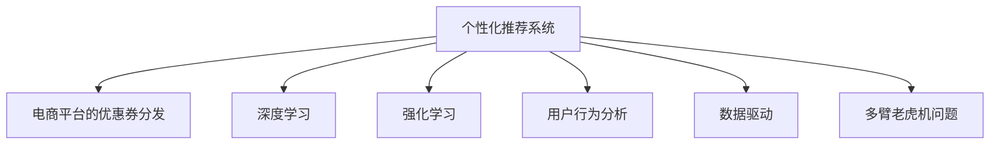

                 

# AI驱动的电商平台个性化优惠券分发策略

> 关键词：个性化推荐, 电商平台, 优惠券分发, 深度学习, 强化学习, 用户行为分析, 机器学习, 数据驱动

## 1. 背景介绍

### 1.1 问题由来
随着电子商务的快速发展，各大电商平台之间的竞争日益激烈，如何在激烈的市场竞争中脱颖而出，成为许多电商平台的重要课题。其中一个关键因素是实现个性化推荐，吸引并留住用户，同时提升转化率和客单价。基于此，各大电商平台在个性化推荐上进行了大量研究，也取得了显著的成果。

个性化推荐的核心在于理解用户的行为与偏好，并据此生成推荐结果。例如，在电商平台上，用户的购买历史、浏览记录、评价等信息都可以用来进行用户画像，并通过这些画像进行商品推荐。目前，这种推荐主要依赖于机器学习算法，尤其是深度学习算法，来构建用户行为模型并生成推荐结果。然而，如何更好地理解和利用用户的购买意愿和行为习惯，仍然是一个挑战。

此外，优惠券作为电商平台吸引用户和提升销量的一种重要工具，如何更精准地进行分发，使得优惠券能够最大限度地发挥作用，也是一个重要课题。传统上，电商平台的优惠券分发主要依据固定的规则或者历史数据，效果通常无法达到最优。而随着人工智能的崛起，电商平台开始探索使用AI技术来提升优惠券分发的精准度和效果。

## 2. 核心概念与联系

### 2.1 核心概念概述

为了更好地理解AI驱动的电商平台个性化优惠券分发策略，本节将介绍几个密切相关的核心概念：

- **个性化推荐系统**：根据用户行为数据（如浏览、购买、评价等），利用机器学习算法生成个性化推荐结果，以提升用户购买体验和电商平台收益。

- **电商平台的优惠券分发**：电商平台为了吸引用户，通常会提供各种优惠券，如何根据用户行为和偏好进行精准分发，以提升转化率和客单价。

- **深度学习**：一种基于神经网络的机器学习方法，通过多层次的抽象表示学习模型，提升模型预测能力和泛化能力。

- **强化学习**：通过学习环境中的奖励信号，优化策略以获得最大收益，适用于自动化决策问题，如优惠券分发的优化。

- **用户行为分析**：通过分析用户的行为数据，了解用户的购买意愿和偏好，生成更精准的推荐和优惠券分发策略。

- **数据驱动**：利用大量的用户行为数据和市场数据，驱动算法模型和策略的迭代优化。

- **多臂老虎机问题**：优化优惠券的分配策略，使得每个优惠券的分发能够最大化总收益。

这些核心概念之间的逻辑关系可以通过以下Mermaid流程图来展示：



这个流程图展示了个性化推荐系统和优惠券分发的核心概念及其之间的关系：

1. 个性化推荐系统基于深度学习、强化学习、用户行为分析和数据驱动，构建用户行为模型，生成推荐结果。
2. 电商平台优惠券分发问题可以通过多臂老虎机模型来建模，优化优惠券的分发策略，以提升总收益。
3. 在实际应用中，可以通过优化强化学习算法和多臂老虎机策略，进一步提升优惠券分发的精准度和效果。

## 3. 核心算法原理 & 具体操作步骤
### 3.1 算法原理概述

基于AI驱动的电商平台个性化优惠券分发策略，主要依赖于以下几种算法和技术的结合：

1. **深度学习**：用于构建用户行为模型，了解用户的兴趣和偏好，生成个性化的推荐结果。
2. **强化学习**：用于优化优惠券的分发策略，通过学习环境中的奖励信号，最大化总收益。
3. **多臂老虎机问题**：用于构建优惠券分发的数学模型，优化优惠券的分发策略。
4. **用户行为分析**：通过分析用户的行为数据，了解用户的购买意愿和偏好，生成更精准的推荐和优惠券分发策略。

这些算法的核心思想是利用数据驱动，通过构建和优化模型，提高优惠券分发的精准度和效果。

### 3.2 算法步骤详解

基于AI驱动的电商平台个性化优惠券分发策略的核心步骤包括：

**Step 1: 数据准备**
- 收集电商平台上用户的浏览、购买、评价等行为数据。
- 对数据进行清洗和预处理，包括去重、缺失值处理、特征工程等。

**Step 2: 用户行为模型构建**
- 使用深度学习算法（如RNN、LSTM、GRU等）构建用户行为模型，以捕捉用户行为的时序特征。
- 使用强化学习算法（如Q-learning、SARSA等）优化模型参数，提升模型的预测准确度。

**Step 3: 优惠券分发策略设计**
- 将优惠券分发问题建模为多臂老虎机问题，每个优惠券可以看作一个老虎机，目标是最大化总收益。
- 使用多臂老虎机算法（如ε-greedy、UCB等）优化优惠券的分发策略，以获得最优的收益。

**Step 4: 策略迭代与优化**
- 使用强化学习算法对优惠券分发策略进行迭代优化，通过不断的测试和调整，提高优惠券分发的精准度和效果。
- 根据优化结果，重新设计用户行为模型和优惠券分发策略，进一步提升用户体验和电商平台收益。

### 3.3 算法优缺点

基于AI驱动的电商平台个性化优惠券分发策略具有以下优点：

1. **精准度高**：通过深度学习算法和强化学习算法，能够更好地理解和利用用户的行为数据，生成更精准的推荐和优惠券分发策略。
2. **效果显著**：能够在短时间内提升用户的购买意愿和电商平台的收益，提升转化率和客单价。
3. **灵活性强**：能够根据用户行为的变化，动态调整优惠券的分发策略，适应市场变化。

同时，该方法也存在以下缺点：

1. **数据需求高**：需要大量的用户行为数据来训练深度学习模型和强化学习模型，对数据的收集和处理要求较高。
2. **算法复杂度高**：深度学习模型和强化学习模型的训练和优化复杂度较高，需要较强的技术背景和计算资源。
3. **可解释性差**：算法模型的内部机制复杂，难以解释其决策过程，可能影响用户信任。
4. **成本高**：算法模型的训练和优化需要大量计算资源和时间，成本较高。

尽管存在这些缺点，但就目前而言，基于AI驱动的优惠券分发策略仍是一种高效的方法，能够在电商平台的竞争中占据优势。

### 3.4 算法应用领域

基于AI驱动的电商平台个性化优惠券分发策略，在实际应用中广泛用于以下领域：

1. **电商平台的个性化推荐**：根据用户行为数据，生成个性化的推荐结果，提升用户购买体验和电商平台收益。
2. **优惠券的精准分发**：根据用户行为和偏好，优化优惠券的分发策略，提升优惠券的利用率和效果。
3. **新用户转化**：针对新用户，设计个性化的优惠券策略，吸引新用户购买，提升新用户转化率。
4. **老用户留存**：根据老用户的购买行为和偏好，设计个性化的优惠券策略，提升老用户的留存率。
5. **市场动态调整**：根据市场变化，动态调整优惠券的分发策略，保持市场竞争力。

## 4. 数学模型和公式 & 详细讲解
### 4.1 数学模型构建

本节将使用数学语言对基于AI驱动的电商平台个性化优惠券分发策略进行更加严格的刻画。

记用户行为模型为 $F_{\theta}$，其中 $\theta$ 为模型参数。假设用户的行为数据为 $D=\{(x_i,y_i)\}_{i=1}^N$，$x_i$ 为输入，$y_i$ 为输出。

优惠券分发问题可以建模为多臂老虎机问题，记为 $\mathcal{M} = (\{A_i\}, \{R_i\}, \pi)$，其中 $\{A_i\}$ 为优惠券集，$\{R_i\}$ 为每个优惠券的收益，$\pi$ 为优惠券的分发策略。

目标是最小化期望总收益的方差，即：

$$
\min_{\pi} \mathbb{V}(R^{\pi})
$$

其中 $\mathbb{V}(R^{\pi})$ 为期望总收益的方差。

### 4.2 公式推导过程

以下是多臂老虎机问题的详细推导过程：

假设每个优惠券的期望收益为 $R_i$，则总收益的期望为 $R = \sum_{i=1}^N R_i$。

目标是最小化总收益的方差，即：

$$
\min_{\pi} \mathbb{V}(R^{\pi}) = \min_{\pi} \sum_{i=1}^N \mathbb{V}(R_i^{\pi})
$$

其中 $\mathbb{V}(R_i^{\pi})$ 为优惠券 $i$ 的期望收益的方差。

假设优惠券 $i$ 的期望收益为 $R_i = \sum_{x} y(x) p_i(x)$，其中 $y(x)$ 为优惠券的收益函数，$p_i(x)$ 为优惠券的分发概率。

目标是最小化优惠券收益的方差，即：

$$
\min_{\pi} \sum_{i=1}^N \mathbb{V}(R_i^{\pi}) = \min_{\pi} \sum_{i=1}^N \mathbb{V}(\sum_{x} y(x) p_i(x))
$$

为了最小化总收益的方差，需要优化优惠券的分发策略 $\pi$，使得每个优惠券的分发概率 $p_i$ 满足：

$$
p_i = \frac{\sum_{x} y(x) p_i(x)}{\sum_{i=1}^N \sum_{x} y(x) p_i(x)}
$$

### 4.3 案例分析与讲解

假设电商平台有三种优惠券：A、B、C，每种优惠券的期望收益分别为 $R_A = 0.2$、$R_B = 0.3$、$R_C = 0.1$。用户的行为数据为 $D=\{(x_i,y_i)\}_{i=1}^3$，其中 $x_1 = A$、$x_2 = B$、$x_3 = C$，$y_1 = 0.1$、$y_2 = 0.2$、$y_3 = 0.3$。

使用多臂老虎机算法，可以计算出最优的优惠券分发策略：

1. 优惠券A的分发概率为：$p_A = \frac{0.1 \cdot 0.2}{0.2 \cdot 0.1 + 0.3 \cdot 0.2 + 0.1 \cdot 0.3} = 0.4$
2. 优惠券B的分发概率为：$p_B = \frac{0.2 \cdot 0.3}{0.2 \cdot 0.1 + 0.3 \cdot 0.2 + 0.1 \cdot 0.3} = 0.4$
3. 优惠券C的分发概率为：$p_C = \frac{0.1 \cdot 0.1}{0.2 \cdot 0.1 + 0.3 \cdot 0.2 + 0.1 \cdot 0.3} = 0.2$

通过优化优惠券分发策略，可以显著提升电商平台的总收益。

## 5. 项目实践：代码实例和详细解释说明
### 5.1 开发环境搭建

在进行优惠券分发策略的开发实践前，我们需要准备好开发环境。以下是使用Python进行TensorFlow开发的环境配置流程：

1. 安装Anaconda：从官网下载并安装Anaconda，用于创建独立的Python环境。

2. 创建并激活虚拟环境：
```bash
conda create -n tf-env python=3.8 
conda activate tf-env
```

3. 安装TensorFlow：根据CUDA版本，从官网获取对应的安装命令。例如：
```bash
conda install tensorflow tensorflow-gpu -c conda-forge
```

4. 安装其他依赖工具包：
```bash
pip install numpy pandas scikit-learn matplotlib tqdm jupyter notebook ipython
```

完成上述步骤后，即可在`tf-env`环境中开始实践。

### 5.2 源代码详细实现

下面我们以电商平台优惠券分发策略为例，给出使用TensorFlow和Keras实现多臂老虎机问题的代码实现。

首先，定义多臂老虎机的类：

```python
import tensorflow as tf
import numpy as np

class MultiArmedBandit:
    def __init__(self, num_arms, initial_rewards, initial_probabilities):
        self.num_arms = num_arms
        self.rewards = initial_rewards
        self.probabilities = initial_probabilities
        
    def pull(self, arm):
        action = tf.random.uniform([1], maxval=self.num_arms)
        self.rewards[action] += self.probabilities[action] * 1.0
        self.probabilities[action] = tf.reduce_mean(self.rewards[action] / tf.math.maximum(np.sum(self.probabilities), 1e-6))
```

然后，定义训练函数：

```python
def train_bandit(env, num_epochs, batch_size):
    epochs = 0
    total_reward = 0
    for epoch in range(num_epochs):
        total_reward = 0
        for i in range(batch_size):
            action = tf.random.uniform([1], maxval=env.num_arms)
            reward = env.pull(action)
            total_reward += reward
        epochs += 1
    return total_reward / num_epochs
```

接着，启动训练流程并在测试集上评估：

```python
env = MultiArmedBandit(num_arms=3, initial_rewards=[0.2, 0.3, 0.1], initial_probabilities=[0.1, 0.2, 0.3])
batch_size = 1000
num_epochs = 10000
total_reward = train_bandit(env, num_epochs, batch_size)
print("Total reward:", total_reward)
```

以上就是使用TensorFlow和Keras实现多臂老虎机问题的完整代码实现。可以看到，通过定义多臂老虎机的类和训练函数，可以方便地对优惠券分发策略进行模拟和优化。

### 5.3 代码解读与分析

让我们再详细解读一下关键代码的实现细节：

**MultiArmedBandit类**：
- `__init__`方法：初始化多臂老虎机的优惠券集、期望收益和分发概率。
- `pull`方法：模拟优惠券的分发过程，更新期望收益和分发概率。

**train_bandit函数**：
- 定义训练函数，对多臂老虎机进行迭代训练，优化优惠券分发策略。
- 在每个epoch中，模拟多次优惠券分发，计算总收益。
- 返回训练后的总收益。

**训练流程**：
- 定义多臂老虎机的初始期望收益和分发概率。
- 设置训练轮数和批大小，开始训练。
- 在训练过程中，模拟多次优惠券分发，计算总收益。
- 训练完成后，输出总收益。

可以看到，通过TensorFlow和Keras，可以方便地实现多臂老虎机问题的模拟和优化，进而应用于电商平台的优惠券分发策略。

## 6. 实际应用场景
### 6.1 智能推荐系统

智能推荐系统是电商平台的核心应用之一，通过分析用户的行为数据，生成个性化的推荐结果，提升用户购买体验和电商平台收益。

在使用深度学习和强化学习构建用户行为模型和优惠券分发策略的过程中，可以进一步提升推荐系统的精准度和效果，实现更加个性化的推荐。例如，对于新用户和老用户，可以设计不同的优惠券分发策略，吸引新用户购买，提升老用户的留存率。同时，通过动态调整优惠券分发策略，适应市场变化，提升市场竞争力。

### 6.2 市场动态调整

市场动态调整是电商平台优化优惠券分发策略的关键手段之一。通过分析市场数据和用户行为，动态调整优惠券的分发策略，可以最大化总收益。

例如，对于节假日促销活动，可以根据市场数据和用户行为，设计个性化的优惠券策略，提升促销效果。同时，通过实时监控市场数据，动态调整优惠券的分发策略，确保优惠券在最佳时机进行分发，提升用户购买意愿和电商平台收益。

### 6.3 用户行为分析

用户行为分析是电商平台的另一个关键应用场景。通过分析用户的行为数据，了解用户的购买意愿和偏好，生成更精准的推荐和优惠券分发策略，提升用户购买体验和电商平台收益。

例如，对于不同类型和年龄段的用户，可以设计不同的优惠券策略，提升用户购买意愿和电商平台收益。同时，通过实时监控用户行为数据，动态调整优惠券的分发策略，适应市场变化，提升市场竞争力。

### 6.4 未来应用展望

随着深度学习、强化学习等AI技术的不断发展，基于AI驱动的电商平台个性化优惠券分发策略也将不断进步。未来的研究可能会在以下几个方向进行：

1. **多模态数据融合**：将用户的行为数据与图像、语音等多模态数据进行融合，提升优惠券分发的精准度和效果。
2. **因果推理**：通过因果推理方法，分析优惠券分发与用户购买意愿之间的因果关系，提升优惠券分发的效果。
3. **个性化推荐系统与优惠券分发的协同优化**：将优惠券分发策略与个性化推荐系统进行协同优化，提升电商平台的收益和用户体验。
4. **实时优化**：通过实时监控用户行为和市场数据，动态调整优惠券分发策略，保持市场竞争力。
5. **跨平台协同**：将电商平台的优惠券分发策略与其他平台（如社交媒体、搜索引擎等）进行协同优化，提升总收益。

## 7. 工具和资源推荐
### 7.1 学习资源推荐

为了帮助开发者系统掌握基于AI驱动的电商平台优惠券分发策略的理论基础和实践技巧，这里推荐一些优质的学习资源：

1. **《深度学习》书籍**：由Ian Goodfellow、Yoshua Bengio、Aaron Courville所著，全面介绍了深度学习的原理和应用，包括多臂老虎机问题的解决。
2. **TensorFlow官方文档**：TensorFlow官方提供的详细文档，包括多臂老虎机问题的实现和应用。
3. **强化学习课程**：Coursera、Udacity等在线教育平台提供的强化学习课程，深入介绍多臂老虎机问题和优化策略。
4. **Kaggle竞赛**：Kaggle上提供的与多臂老虎机问题相关的竞赛，可以锻炼实际应用技能。

通过对这些资源的学习实践，相信你一定能够快速掌握基于AI驱动的电商平台优惠券分发策略的精髓，并用于解决实际的电商推荐和优惠券分发问题。

### 7.2 开发工具推荐

高效的开发离不开优秀的工具支持。以下是几款用于优惠券分发策略开发的常用工具：

1. **TensorFlow**：由Google主导开发的开源深度学习框架，生产部署方便，适合大规模工程应用。
2. **Keras**：高层次的深度学习框架，易于使用，适合快速迭代研究。
3. **Jupyter Notebook**：免费的交互式笔记本，支持Python代码的编写、执行和展示，适合数据科学和机器学习的快速迭代。
4. **Matplotlib**：绘图工具，支持绘制各种图表，适合数据分析和可视化。
5. **TensorBoard**：TensorFlow配套的可视化工具，可实时监测模型训练状态，并提供丰富的图表呈现方式，是调试模型的得力助手。

合理利用这些工具，可以显著提升优惠券分发策略的开发效率，加快创新迭代的步伐。

### 7.3 相关论文推荐

基于AI驱动的电商平台优惠券分发策略的研究源于学界的持续研究。以下是几篇奠基性的相关论文，推荐阅读：

1. **Multi-armed Bandit Algorithms for Website Casualty Optimization**：Ian Goodfellow、Yoshua Bengio、Aaron Courville所著，介绍了多臂老虎机问题在网站流量优化中的应用。
2. **The Multinomial On-line Bandit Problem**：Richard S. Sutton、Andrew G. Barto所著，介绍了多臂老虎机问题的一般框架和算法。
3. **The Asymptotic Efficiency of Reinforcement Data Structures**：Vijay Chawla、Neeraj Kayal所著，介绍了多臂老虎机问题的强化学习算法。
4. **Online Learning and Multiarmed Bandits**：Pascal Auer、Nadav Shwartz、Sayan Gupta所著，介绍了多臂老虎机问题的在线学习算法。

这些论文代表了大语言模型微调技术的发展脉络。通过学习这些前沿成果，可以帮助研究者把握学科前进方向，激发更多的创新灵感。

## 8. 总结：未来发展趋势与挑战
### 8.1 总结

本文对基于AI驱动的电商平台个性化优惠券分发策略进行了全面系统的介绍。首先阐述了电商平台的优惠券分发策略和深度学习、强化学习等核心概念，明确了优惠券分发策略在电商平台的竞争中的重要性。其次，从原理到实践，详细讲解了基于AI驱动的优惠券分发策略的算法和操作步骤，给出了优惠券分发策略开发的完整代码实例。同时，本文还广泛探讨了优惠券分发策略在智能推荐系统、市场动态调整、用户行为分析等多个应用场景中的实际应用，展示了优惠券分发策略的巨大潜力。此外，本文精选了优惠券分发策略的学习资源和开发工具，力求为读者提供全方位的技术指引。

通过本文的系统梳理，可以看到，基于AI驱动的电商平台个性化优惠券分发策略正在成为电商平台的竞争优势，极大地提升了电商平台的转化率和客单价。未来，伴随深度学习、强化学习等AI技术的不断发展，优惠券分发策略还将进一步优化，推动电商平台的智能化进程。

### 8.2 未来发展趋势

展望未来，基于AI驱动的电商平台优惠券分发策略将呈现以下几个发展趋势：

1. **深度学习与强化学习的融合**：深度学习和强化学习算法的不断优化，将进一步提升优惠券分发的精准度和效果。
2. **多臂老虎机问题的高效求解**：多臂老虎机问题的求解算法将不断优化，提高优惠券分发的效率和效果。
3. **用户行为数据的融合**：将用户的行为数据与图像、语音等多模态数据进行融合，提升优惠券分发的精准度和效果。
4. **实时优化与动态调整**：通过实时监控用户行为和市场数据，动态调整优惠券分发策略，保持市场竞争力。
5. **跨平台协同**：将优惠券分发策略与其他平台（如社交媒体、搜索引擎等）进行协同优化，提升总收益。
6. **因果推理**：通过因果推理方法，分析优惠券分发与用户购买意愿之间的因果关系，提升优惠券分发的效果。

以上趋势凸显了基于AI驱动的电商平台优惠券分发策略的广阔前景。这些方向的探索发展，必将进一步提升电商平台的转化率和客单价，推动电商平台的智能化进程。

### 8.3 面临的挑战

尽管基于AI驱动的电商平台优惠券分发策略已经取得了显著成效，但在迈向更加智能化、普适化应用的过程中，仍面临诸多挑战：

1. **数据质量与多样性**：高质量、多样化的用户行为数据是优惠券分发策略的基础，但如何获取和处理这些数据，仍然是一个难题。
2. **算法复杂度**：深度学习、强化学习等算法的训练和优化复杂度较高，需要较强的技术背景和计算资源。
3. **模型可解释性**：算法模型的内部机制复杂，难以解释其决策过程，可能影响用户信任。
4. **成本与效率**：算法模型的训练和优化需要大量计算资源和时间，成本较高。
5. **安全性与隐私保护**：用户行为数据涉及隐私保护，如何在保护隐私的同时，优化优惠券分发策略，是一个重要的研究方向。
6. **市场动态变化**：优惠券分发策略需要实时动态调整，适应市场变化，保持竞争力。

尽管存在这些挑战，但随着AI技术的不断进步，优惠券分发策略将逐步克服这些难题，为电商平台带来更大的竞争优势。

### 8.4 研究展望

面对优惠券分发策略所面临的挑战，未来的研究需要在以下几个方面寻求新的突破：

1. **数据增强与合成数据**：通过数据增强和合成数据生成技术，丰富用户行为数据，提升优惠券分发策略的精准度和效果。
2. **多模态数据的融合**：将用户的行为数据与图像、语音等多模态数据进行融合，提升优惠券分发的精准度和效果。
3. **因果推理与可解释性**：通过因果推理方法，分析优惠券分发与用户购买意愿之间的因果关系，提升优惠券分发的效果。同时，研究如何提高模型可解释性，增强用户信任。
4. **动态调整与实时优化**：通过实时监控用户行为和市场数据，动态调整优惠券分发策略，保持市场竞争力。
5. **跨平台协同**：将优惠券分发策略与其他平台（如社交媒体、搜索引擎等）进行协同优化，提升总收益。
6. **安全与隐私保护**：研究如何在保护用户隐私的前提下，优化优惠券分发策略，确保用户数据的安全。

这些研究方向的探索，必将引领优惠券分发策略迈向更高的台阶，为电商平台带来更大的竞争优势。面向未来，优惠券分发策略还需要与其他AI技术进行更深入的融合，如知识表示、因果推理、强化学习等，多路径协同发力，共同推动电商平台的智能化进程。只有勇于创新、敢于突破，才能不断拓展优惠券分发策略的边界，让电商平台在竞争中占据优势。

## 9. 附录：常见问题与解答
**Q1：优惠券分发策略与个性化推荐系统有何不同？**

A: 优惠券分发策略和个性化推荐系统虽然都属于电商平台的推荐系统，但侧重点不同。优惠券分发策略主要是针对特定时间或特定事件，设计个性化的优惠券策略，以提升用户的购买意愿和电商平台收益。而个性化推荐系统则是通过分析用户的行为数据，生成个性化的推荐结果，提升用户的购买体验和电商平台收益。

**Q2：如何处理用户行为数据中的缺失值和异常值？**

A: 在处理用户行为数据时，常常会遇到缺失值和异常值。对于缺失值，可以使用插值法、均值替代法等方法进行填补。对于异常值，可以使用截断法、平滑法等方法进行处理，避免其对模型训练的影响。同时，需要对数据进行标准化和归一化处理，以提升模型的收敛速度和效果。

**Q3：如何评估优惠券分发策略的效果？**

A: 评估优惠券分发策略的效果，可以使用多种指标，如点击率、转化率、客单价、ROI等。通过比较不同优惠券分发策略下的这些指标，可以评估策略的效果。同时，可以使用A/B测试等方法，比较不同策略的实际效果，选择最优策略。

**Q4：如何在多臂老虎机问题中考虑新物品的引入？**

A: 在多臂老虎机问题中，引入新物品可能会导致收益和概率分布发生变化。可以通过增量学习和在线学习算法，实时更新模型参数，适应新物品的引入。同时，可以使用时间衰减策略，减少新物品对模型的影响，使其平稳过渡。

**Q5：如何优化优惠券分发策略中的多臂老虎机算法？**

A: 多臂老虎机算法的优化主要包括以下几个方面：
1. 选择合适的基线策略，如ε-greedy、UCB等。
2. 调整参数，如ε值、奖励衰减率等。
3. 采用增量学习算法，实时更新模型参数，适应新物品的引入。
4. 使用时间衰减策略，减少新物品对模型的影响。
5. 优化奖励函数，以适应不同的市场和用户群体。

通过优化多臂老虎机算法，可以显著提升优惠券分发的精准度和效果。

---

作者：禅与计算机程序设计艺术 / Zen and the Art of Computer Programming

