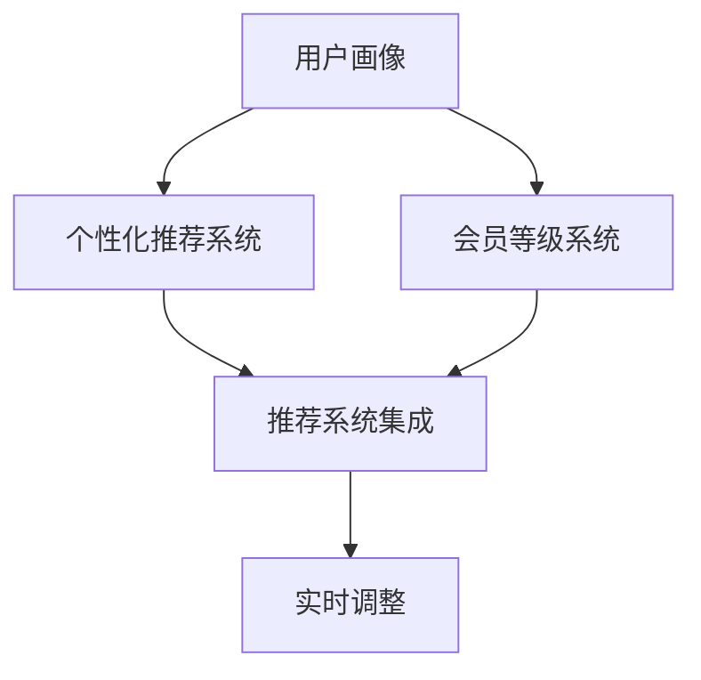

                 

# AI驱动的电商平台个性化会员等级策略

> 关键词：AI驱动, 电商平台, 个性化推荐, 会员等级, 精准营销, 用户行为分析

## 1. 背景介绍

### 1.1 问题由来

随着电子商务的蓬勃发展，各大电商平台在竞争日益激烈的市场环境中，纷纷通过各种手段提升用户黏性，争取新用户，保持用户活跃度和消费频次。其中，会员等级策略成为电商平台的重要工具，通过构建基于用户行为的积分系统，引导用户进行更有价值的消费，并增强品牌忠诚度。

然而，传统的会员等级策略往往比较单一，主要依赖经验法则或简单的规则引擎，难以全面考虑用户的行为、偏好和价值。随着人工智能技术的发展，特别是自然语言处理(NLP)、推荐系统和深度学习等技术，电商平台开始探索更智能、更个性化的会员等级策略，以期在激烈的市场竞争中脱颖而出。

### 1.2 问题核心关键点

- **数据驱动：** 会员等级策略的制定和调整应以用户行为数据为核心，通过数据分析和建模，发掘用户价值和行为规律。
- **多维度建模：** 用户的价值和行为不仅受消费金额影响，还受互动频率、购买频次、评价内容等多维度的因素影响，需要构建多维度的用户画像。
- **模型学习：** 借助机器学习模型，如决策树、随机森林、神经网络等，从海量数据中学习用户行为与会员等级之间的关系，实现自动化、智能化的会员等级调整。
- **实时反馈：** 会员等级策略应具备实时调整的能力，通过持续监测用户行为数据，及时优化会员等级方案，提升用户体验和平台收益。

### 1.3 问题研究意义

构建基于AI的个性化会员等级策略，对于电商平台提升用户粘性和忠诚度、优化用户体验、提高平台收益具有重要意义：

- **提升用户粘性：** 通过个性化推荐和精准营销，提升用户活跃度和复购率，增强用户黏性。
- **优化用户体验：** 基于用户行为数据构建的会员等级策略，能更准确地反映用户价值，提供符合用户期望的个性化服务。
- **提高平台收益：** 通过精准识别高价值用户，针对性地提供优惠券、积分奖励等激励措施，提升用户消费频次，增加平台收益。

## 2. 核心概念与联系

### 2.1 核心概念概述

为更好地理解AI驱动的会员等级策略，本节将介绍几个密切相关的核心概念：

- **用户画像(User Profile)**：根据用户的各类行为数据，构建出用户的兴趣、偏好、消费能力等多元化的画像，为个性化推荐和会员等级策略提供数据基础。
- **个性化推荐系统(Personalized Recommendation System)**：基于用户画像和行为数据，通过机器学习模型，为用户推荐可能感兴趣的商品或服务，提升用户体验和购买转化率。
- **会员等级系统(Membership Tiers)**：根据用户的消费行为、互动频率等，动态调整会员等级，提供相应的激励措施和特权，如优惠券、积分奖励等。
- **推荐系统集成(Recommendation System Integration)**：将个性化推荐系统与会员等级系统进行深度集成，实现从推荐到转化、从消费到积分的全流程智能化管理。
- **实时调整(Real-time Adjustment)**：通过持续监测用户行为数据，实时调整会员等级方案，适应市场变化和用户需求，提高会员等级策略的适应性和有效性。

这些核心概念之间的逻辑关系可以通过以下Mermaid流程图来展示：



这个流程图展示出各个核心概念及其之间的联系：

1. 用户画像根据用户数据构建，为个性化推荐和会员等级策略提供基础。
2. 个性化推荐系统根据用户画像和行为数据，生成个性化推荐，辅助用户决策。
3. 会员等级系统根据用户行为，动态调整会员等级，并提供相应激励。
4. 推荐系统集成将个性化推荐与会员等级系统融合，实现从推荐到转化的闭环管理。
5. 实时调整机制，根据用户最新行为数据，实时调整会员等级策略，保持策略的有效性。

## 3. 核心算法原理 & 具体操作步骤
### 3.1 算法原理概述

AI驱动的会员等级策略，本质上是一个基于机器学习的多维度决策模型。其核心思想是：通过构建用户画像，使用多维度的特征变量，构建预测模型，动态调整会员等级，并根据预测结果提供相应的激励措施。

具体流程如下：

1. **数据收集**：收集用户的基本信息、行为数据（如浏览记录、购买记录、评价内容等）和互动数据（如留言、评论、客服互动等），构建用户画像。
2. **特征工程**：对用户画像中的多维度数据进行预处理和特征提取，得到能反映用户行为和偏好的特征变量。
3. **模型训练**：使用机器学习模型（如决策树、随机森林、神经网络等），在标注数据上训练预测模型，学习用户行为与会员等级之间的关系。
4. **会员等级调整**：根据预测模型对用户进行会员等级预测，并根据预测结果调整用户的会员等级，提供相应的激励措施。
5. **实时反馈**：持续监测用户行为数据，实时调整会员等级策略，确保策略的有效性和适应性。

### 3.2 算法步骤详解

以下是详细的算法步骤：

**Step 1: 数据收集与预处理**
- **用户基本信息**：包括年龄、性别、地区等基本信息。
- **行为数据**：包括浏览记录、购买记录、评价内容、客服互动等行为数据。
- **特征提取**：根据用户行为和偏好，提取关键特征，如消费金额、互动频率、浏览深度等。

**Step 2: 构建用户画像**
- **用户画像**：使用机器学习算法（如聚类、分类等），从用户基本信息和行为数据中，构建多维度的用户画像。
- **画像维度**：用户画像应包含消费金额、互动频率、购买频次、评价情感等维度。

**Step 3: 特征选择与特征工程**
- **特征选择**：选择能最好反映用户行为和偏好的特征变量，避免维度灾难。
- **特征工程**：对原始数据进行标准化、归一化、降维等预处理，提升模型的泛化能力和训练效率。

**Step 4: 模型训练与调参**
- **模型选择**：选择合适的机器学习模型（如决策树、随机森林、神经网络等）。
- **数据划分**：将数据集划分为训练集、验证集和测试集。
- **模型训练**：使用训练集训练模型，调整超参数，使用验证集评估模型效果。
- **模型调参**：根据验证集上的表现，调整模型超参数，寻找最优模型。

**Step 5: 会员等级预测与调整**
- **会员等级预测**：使用训练好的模型，对每个用户进行会员等级预测。
- **会员等级调整**：根据预测结果，动态调整用户的会员等级，并根据等级提供相应的激励措施。

**Step 6: 实时反馈与优化**
- **实时监测**：持续监测用户行为数据，实时更新用户画像和会员等级预测模型。
- **策略优化**：根据实时反馈，调整会员等级策略，确保策略的有效性和适应性。

### 3.3 算法优缺点

AI驱动的会员等级策略具有以下优点：
- **高效性**：自动化、智能化的会员等级调整，能显著提升工作效率，减少人工干预。
- **精准性**：通过多维度的用户画像和机器学习模型，实现更精准的会员等级预测，提升策略的有效性。
- **实时性**：实时监测和反馈机制，确保会员等级策略的动态优化，适应市场变化和用户需求。
- **扩展性**：易于扩展到不同电商平台和市场环境，具有良好的通用性。

同时，该方法也存在一定的局限性：
- **数据依赖**：策略的有效性高度依赖高质量的数据，数据质量和完整性对模型性能影响显著。
- **模型复杂性**：多维度的用户画像和复杂的机器学习模型，增加了模型实现的难度和复杂度。
- **隐私风险**：用户数据的隐私保护和安全性需要高度重视，避免数据泄露和滥用。
- **计算成本**：大规模数据的特征提取和模型训练，需要较高的计算资源和时间成本。

尽管存在这些局限性，但就目前而言，基于AI的会员等级策略仍然是电商平台提升用户体验和平台收益的重要手段。未来相关研究的方向应聚焦于提高模型性能、优化计算资源消耗、增强数据隐私保护等方面。

### 3.4 算法应用领域

AI驱动的会员等级策略，已经在电子商务、金融服务、旅游出行等多个领域得到了广泛应用，成为提升用户粘性和忠诚度的重要工具。

在电子商务领域，各大平台通过构建基于用户行为数据的会员等级体系，提供个性化推荐和精准营销，提升用户购买转化率和复购率。例如，亚马逊通过Prime会员等级策略，显著提升了用户购买频次和平台收益。

在金融服务领域，银行和保险公司利用AI驱动的会员等级策略，根据用户的行为数据和信用评分，动态调整会员等级，提供差异化的服务，提升用户体验和忠诚度。例如，Visa和万事达等信用卡公司，通过积分奖励和特权服务，吸引用户使用其支付平台。

在旅游出行领域，酒店和航空公司通过构建会员等级体系，根据用户的消费行为和互动数据，提供个性化服务和专属优惠，增强用户粘性。例如，新加坡航空公司通过其全球会员计划，为高价值客户提供专属服务，提升用户满意度和忠诚度。

## 4. 数学模型和公式 & 详细讲解
### 4.1 数学模型构建

构建AI驱动的会员等级策略，核心在于构建一个多维度的用户画像，并使用机器学习模型学习用户行为与会员等级之间的关系。

记用户行为数据为 $X$，包括浏览记录、购买记录、评价内容等，会员等级为 $Y$，可能的等级为 $\{1, 2, 3, \cdots, n\}$。

定义用户画像中的特征变量为 $X = \{x_1, x_2, \cdots, x_m\}$，其中 $x_i$ 为第 $i$ 个特征变量，$i \in \{1, 2, \cdots, m\}$。

则用户画像与会员等级之间的关系可以表示为：

$$
Y = f(X)
$$

其中 $f$ 为预测模型，将用户画像映射到会员等级。

### 4.2 公式推导过程

以决策树模型为例，其推导过程如下：

**Step 1: 特征选择**

首先，根据用户画像中的多维度数据，选择最能反映用户行为和偏好的特征变量。例如，可以选择消费金额、互动频率、购买频次等。

**Step 2: 数据划分**

将数据集划分为训练集、验证集和测试集。假设训练集为 $D_{train}$，验证集为 $D_{val}$，测试集为 $D_{test}$。

**Step 3: 模型训练**

使用决策树算法，在训练集 $D_{train}$ 上训练模型，得到决策树 $T$。

**Step 4: 模型评估**

在验证集 $D_{val}$ 上评估模型的性能，计算准确率、召回率、F1分数等指标。

**Step 5: 模型调参**

根据验证集上的表现，调整模型超参数，如树深度、叶子节点数等，寻找最优模型。

**Step 6: 会员等级预测**

使用训练好的决策树模型 $T$，对每个用户进行会员等级预测，得到预测等级 $y_i = T(x_i)$，其中 $x_i$ 为用户画像中的特征变量。

**Step 7: 会员等级调整**

根据预测等级 $y_i$，动态调整用户的会员等级，并根据等级提供相应的激励措施。

### 4.3 案例分析与讲解

以下通过一个简单的案例，展示基于决策树模型的会员等级预测过程。

假设某电商平台有如下用户行为数据：

| 用户ID | 消费金额（元） | 互动频率（次） | 购买频次（次） | 评价情感（1-5分） |
| ------ | -------------- | -------------- | -------------- | ---------------- |
| 1      | 100            | 10             | 3              | 4                |
| 2      | 200            | 20             | 5              | 5                |
| 3      | 50             | 5              | 2              | 3                |
| 4      | 300            | 30             | 1              | 4                |

**Step 1: 特征选择**

选择消费金额、互动频率、购买频次和评价情感作为特征变量。

**Step 2: 数据划分**

假设数据集划分为训练集 $D_{train}$ 和测试集 $D_{test}$，其中训练集包含用户1-3的数据，测试集包含用户4的数据。

**Step 3: 模型训练**

使用决策树算法，在训练集 $D_{train}$ 上训练模型，得到决策树 $T$。

**Step 4: 模型评估**

在验证集 $D_{val}$ 上评估模型的性能，假设验证集包含用户1-2的数据，根据模型输出和实际会员等级，计算准确率、召回率、F1分数等指标。

**Step 5: 模型调参**

根据验证集上的表现，调整模型超参数，假设验证集上决策树的深度为3，叶子节点数为4。

**Step 6: 会员等级预测**

使用训练好的决策树模型 $T$，对用户4进行会员等级预测。根据用户画像，可以得到预测等级 $y_4 = T(x_4)$，其中 $x_4$ 为用户画像中的特征变量。

**Step 7: 会员等级调整**

根据预测等级 $y_4$，动态调整用户4的会员等级，并根据等级提供相应的激励措施。

## 5. 项目实践：代码实例和详细解释说明
### 5.1 开发环境搭建

在进行AI驱动的会员等级策略开发前，我们需要准备好开发环境。以下是使用Python进行Scikit-learn开发的环境配置流程：

1. 安装Anaconda：从官网下载并安装Anaconda，用于创建独立的Python环境。

2. 创建并激活虚拟环境：
```bash
conda create -n pyenv python=3.8 
conda activate pyenv
```

3. 安装Scikit-learn：
```bash
pip install scikit-learn
```

4. 安装Pandas：
```bash
pip install pandas
```

5. 安装Matplotlib：
```bash
pip install matplotlib
```

6. 安装Scikit-image：
```bash
pip install scikit-image
```

完成上述步骤后，即可在`pyenv`环境中开始AI驱动的会员等级策略的开发。

### 5.2 源代码详细实现

下面以决策树模型为例，给出使用Scikit-learn进行会员等级预测的Python代码实现。

首先，定义用户画像的特征变量和会员等级：

```python
import pandas as pd

# 用户画像数据
user_data = pd.DataFrame({
    '消费金额': [100, 200, 50, 300],
    '互动频率': [10, 20, 5, 30],
    '购买频次': [3, 5, 2, 1],
    '评价情感': [4, 5, 3, 4]
})
```

然后，将数据划分为训练集和测试集：

```python
from sklearn.model_selection import train_test_split

# 划分数据集
X = user_data[['消费金额', '互动频率', '购买频次', '评价情感']]
y = user_data['会员等级']
X_train, X_test, y_train, y_test = train_test_split(X, y, test_size=0.2, random_state=42)
```

接着，使用决策树模型进行训练：

```python
from sklearn.tree import DecisionTreeClassifier

# 创建决策树模型
clf = DecisionTreeClassifier(max_depth=3, min_samples_split=2)

# 训练模型
clf.fit(X_train, y_train)
```

最后，对测试集进行预测并输出结果：

```python
# 对测试集进行预测
y_pred = clf.predict(X_test)

# 输出预测结果
print('预测结果：')
for i in range(len(y_test)):
    print(f'用户ID {i+1}，真实会员等级：{y_test[i]}，预测会员等级：{y_pred[i]}')
```

以上就是使用Scikit-learn对决策树模型进行会员等级预测的完整代码实现。可以看到，借助Scikit-learn的强大封装，我们可以用相对简洁的代码完成模型的训练和预测。

### 5.3 代码解读与分析

让我们再详细解读一下关键代码的实现细节：

**用户画像数据定义**：
- `user_data`：包含用户画像中的特征变量和会员等级。

**数据划分**：
- `train_test_split`：使用Scikit-learn的`train_test_split`函数，将数据集划分为训练集和测试集。

**模型训练**：
- `DecisionTreeClassifier`：使用Scikit-learn的`DecisionTreeClassifier`类，创建决策树模型，并设置最大深度和最小样本分割数。
- `fit`：使用`fit`方法，在训练集上训练决策树模型。

**预测与输出**：
- `predict`：使用`predict`方法，对测试集进行预测。
- `print`：输出预测结果和真实会员等级。

可以看到，Scikit-learn使得AI驱动的会员等级策略的开发变得简洁高效。开发者可以将更多精力放在数据处理、模型改进等高层逻辑上，而不必过多关注底层的实现细节。

当然，工业级的系统实现还需考虑更多因素，如模型的保存和部署、超参数的自动搜索、更灵活的任务适配层等。但核心的预测流程基本与此类似。

## 6. 实际应用场景
### 6.1 智能客服系统

AI驱动的会员等级策略在智能客服系统中的应用，可以大幅提升客户体验和平台收益。传统的客服系统往往需要配备大量人力，高峰期响应缓慢，且一致性和专业性难以保证。而使用基于会员等级策略的个性化推荐和精准营销，可以7x24小时不间断服务，快速响应客户咨询，用自然流畅的语言解答各类常见问题，并提供符合用户期望的个性化服务。

在技术实现上，可以收集客户的历史咨询记录，将问题和最佳答复构建成监督数据，在此基础上对预训练模型进行微调。微调后的模型能够自动理解客户意图，匹配最合适的答案模板进行回复，同时根据客户的行为数据，动态调整会员等级，提供针对性的服务。如此构建的智能客服系统，能大幅提升客户咨询体验和问题解决效率，同时通过精准营销提升客户粘性和平台收益。

### 6.2 金融舆情监测

金融机构需要实时监测市场舆论动向，以便及时应对负面信息传播，规避金融风险。传统的人工监测方式成本高、效率低，难以应对网络时代海量信息爆发的挑战。基于AI驱动的会员等级策略的文本分类和情感分析技术，为金融舆情监测提供了新的解决方案。

具体而言，可以收集金融领域相关的新闻、报道、评论等文本数据，并对其进行主题标注和情感标注。在此基础上对预训练语言模型进行微调，使其能够自动判断文本属于何种主题，情感倾向是正面、中性还是负面。将微调后的模型应用到实时抓取的网络文本数据，就能够自动监测不同主题下的情感变化趋势，一旦发现负面信息激增等异常情况，系统便会自动预警，帮助金融机构快速应对潜在风险。

### 6.3 个性化推荐系统

当前的推荐系统往往只依赖用户的历史行为数据进行物品推荐，无法深入理解用户的真实兴趣偏好。基于AI驱动的会员等级策略的个性化推荐系统，可以更好地挖掘用户的行为、偏好和价值，从而提供更精准、多样的推荐内容。

在实践中，可以收集用户浏览、点击、评论、分享等行为数据，提取和用户交互的物品标题、描述、标签等文本内容。将文本内容作为模型输入，用户的后续行为（如是否点击、购买等）作为监督信号，在此基础上微调预训练语言模型。微调后的模型能够从文本内容中准确把握用户的兴趣点，生成个性化推荐列表，提升用户体验和购买转化率。

### 6.4 未来应用展望

随着AI驱动的会员等级策略的发展，未来将在更多领域得到应用，为传统行业带来变革性影响。

在智慧医疗领域，基于AI的会员等级策略可以用于构建智能问诊系统，通过分析患者的健康数据，提供个性化的诊疗建议和治疗方案，提升医疗服务的智能化水平，辅助医生诊疗，加速新药开发进程。

在智能教育领域，AI驱动的会员等级策略可应用于个性化推荐和学情分析，根据学生的行为数据，提供个性化的学习内容和评估，因材施教，促进教育公平，提高教学质量。

在智慧城市治理中，AI驱动的会员等级策略可应用于城市事件监测、舆情分析、应急指挥等环节，提高城市管理的自动化和智能化水平，构建更安全、高效的未来城市。

此外，在企业生产、社会治理、文娱传媒等众多领域，基于AI驱动的会员等级策略也将不断涌现，为传统行业数字化转型升级提供新的技术路径。相信随着技术的日益成熟，AI驱动的会员等级策略必将在构建人机协同的智能时代中扮演越来越重要的角色。

## 7. 工具和资源推荐
### 7.1 学习资源推荐

为了帮助开发者系统掌握AI驱动的会员等级策略的理论基础和实践技巧，这里推荐一些优质的学习资源：

1. **《机器学习实战》系列博文**：由大模型技术专家撰写，深入浅出地介绍了机器学习算法、特征工程、模型调参等基础知识，适合初学者快速入门。

2. **Coursera《机器学习》课程**：斯坦福大学开设的机器学习课程，由Andrew Ng主讲，内容全面、讲解详尽，是机器学习领域的名师课程。

3. **《Python机器学习》书籍**：Hands-On Machine Learning with Scikit-Learn、TensorFlow等库的实践指南，适合深入学习机器学习算法和模型实现。

4. **Kaggle竞赛平台**：参与机器学习和数据科学竞赛，实战演练，提升解决实际问题的能力。

5. **HuggingFace官方文档**：提供海量预训练模型和完整的微调样例代码，是上手实践的必备资料。

通过对这些资源的学习实践，相信你一定能够快速掌握AI驱动的会员等级策略的精髓，并用于解决实际的NLP问题。

### 7.2 开发工具推荐

高效的开发离不开优秀的工具支持。以下是几款用于AI驱动的会员等级策略开发的常用工具：

1. **Jupyter Notebook**：免费的交互式开发环境，支持Python、R等多种语言，适合进行模型训练、数据处理等任务。

2. **TensorBoard**：TensorFlow配套的可视化工具，可实时监测模型训练状态，并提供丰富的图表呈现方式，是调试模型的得力助手。

3. **Weights & Biases**：模型训练的实验跟踪工具，可以记录和可视化模型训练过程中的各项指标，方便对比和调优。

4. **Scikit-learn**：Python的科学计算库，提供了丰富的机器学习算法和工具，适合进行模型训练、特征工程等任务。

5. **Pandas**：Python的数据处理库，提供了高效的数据读取、清洗和分析工具，适合进行数据预处理和探索。

合理利用这些工具，可以显著提升AI驱动的会员等级策略的开发效率，加快创新迭代的步伐。

### 7.3 相关论文推荐

AI驱动的会员等级策略的研究源于学界的持续研究。以下是几篇奠基性的相关论文，推荐阅读：

1. **Decision Trees for Data Exploration and Summary**：讲述决策树的基本原理和算法，是决策树算法的经典入门教材。

2. **Random Forest**：介绍随机森林算法的基本思想和实现方法，适用于多分类和回归问题。

3. **Neural Networks and Deep Learning**：深度学习领域的经典教材，涵盖神经网络的基本原理和深度学习框架的使用，适合深入学习深度学习算法。

4. **Deep Learning with Python**：Hands-On Machine Learning with Scikit-Learn、TensorFlow等库的实战指南，适合进行深度学习模型训练和应用开发。

5. **Recommender Systems Handbook**：推荐系统领域的经典教材，涵盖推荐系统的各种算法和实现方法，适合深入学习推荐系统的理论和应用。

这些论文代表了大模型驱动的会员等级策略的发展脉络。通过学习这些前沿成果，可以帮助研究者把握学科前进方向，激发更多的创新灵感。

## 8. 总结：未来发展趋势与挑战
### 8.1 研究成果总结

本文对AI驱动的电商平台个性化会员等级策略进行了全面系统的介绍。首先阐述了会员等级策略的研究背景和意义，明确了AI驱动策略在提升用户体验和平台收益方面的独特价值。其次，从原理到实践，详细讲解了AI驱动策略的数学原理和关键步骤，给出了策略开发的完整代码实例。同时，本文还广泛探讨了AI驱动策略在智能客服、金融舆情、个性化推荐等多个行业领域的应用前景，展示了策略的广泛适用性。此外，本文精选了策略开发的各类学习资源，力求为读者提供全方位的技术指引。

通过本文的系统梳理，可以看到，AI驱动的会员等级策略正在成为电商平台提升用户体验和平台收益的重要手段。借助机器学习模型，平台能够更加精准地识别高价值用户，并提供个性化推荐和精准营销，显著提升用户活跃度和复购率，增加平台收益。未来，随着AI技术的发展，会员等级策略还将进一步智能化、个性化，为电商平台的竞争优势提供更多助力。

### 8.2 未来发展趋势

展望未来，AI驱动的会员等级策略将呈现以下几个发展趋势：

1. **深度学习模型的应用**：随着深度学习技术的发展，未来会员等级策略将更多采用神经网络等深度学习模型，提升策略的精准性和智能化水平。

2. **多模态数据的融合**：除了文本数据，未来策略还将融合图像、视频、音频等多模态数据，提升模型的理解和表达能力。

3. **实时数据处理与反馈**：实时监测用户行为数据，动态调整会员等级策略，提升策略的实时性和适应性。

4. **自适应学习机制**：引入自适应学习机制，根据用户反馈实时调整模型参数，增强策略的个性化和动态性。

5. **联邦学习的应用**：利用联邦学习技术，在保护用户隐私的前提下，通过多个平台的数据共享提升模型的泛化能力。

6. **跨平台数据融合**：将多个平台的数据进行融合，提升策略的普适性和全局视角。

以上趋势凸显了AI驱动的会员等级策略的广阔前景。这些方向的探索发展，必将进一步提升策略的性能和应用范围，为电商平台提供更多竞争优势。

### 8.3 面临的挑战

尽管AI驱动的会员等级策略已经取得了一定的成效，但在迈向更加智能化、普适化应用的过程中，仍面临诸多挑战：

1. **数据质量与数据隐私**：数据质量的高低直接影响策略的效果，数据隐私保护是策略实施的重要前提。

2. **模型复杂性与可解释性**：深度学习模型通常较为复杂，难以解释其内部工作机制，导致策略的透明度和可解释性不足。

3. **计算资源消耗**：大规模数据处理和深度学习模型的训练需要较高的计算资源，存在计算成本问题。

4. **算法公平性与偏见**：算法偏见问题可能导致会员等级策略的不公平，需要更多关注和研究。

5. **用户行为的多样性与动态性**：用户行为的多样性和动态性使得策略需要持续优化和调整，保持策略的有效性。

尽管存在这些挑战，但AI驱动的会员等级策略在提升用户体验和平台收益方面具有显著优势，值得进一步探索和应用。未来相关研究的方向应聚焦于提高模型性能、优化计算资源消耗、增强数据隐私保护等方面。

### 8.4 研究展望

面对AI驱动的会员等级策略所面临的种种挑战，未来的研究需要在以下几个方面寻求新的突破：

1. **数据增强与数据预处理**：探索更高效的数据增强方法，提升数据质量和数据隐私保护能力。

2. **模型简化与可解释性**：引入简化模型和解释模型，提高模型的透明度和可解释性，增强策略的科学性和可信度。

3. **跨平台数据融合**：研究跨平台数据融合技术，提升策略的普适性和全局视角。

4. **联邦学习与隐私保护**：利用联邦学习技术，在保护用户隐私的前提下，通过多个平台的数据共享提升模型的泛化能力。

5. **自适应学习机制**：引入自适应学习机制，根据用户反馈实时调整模型参数，增强策略的个性化和动态性。

6. **公平性与偏见问题**：研究公平性与偏见问题，制定公平性评估指标和优化策略，确保策略的公平性和公正性。

这些研究方向的探索，必将引领AI驱动的会员等级策略迈向更高的台阶，为构建智能化的会员等级系统提供更多可能性。面向未来，AI驱动的会员等级策略需要与其他人工智能技术进行更深入的融合，如知识表示、因果推理、强化学习等，多路径协同发力，共同推动人工智能技术在电商平台的落地应用。只有勇于创新、敢于突破，才能不断拓展策略的边界，让智能技术更好地造福电商平台和用户。

## 9. 附录：常见问题与解答

**Q1：AI驱动的会员等级策略是否适用于所有电商平台？**

A: AI驱动的会员等级策略具有通用性，适用于大多数电商平台。但其效果取决于平台的用户行为数据和业务需求。平台需要根据自身特点，合理选择特征变量和模型，设计合适的会员等级方案。

**Q2：如何选择合适的机器学习模型？**

A: 选择机器学习模型应根据具体业务需求和数据特点进行。对于二分类问题，决策树和随机森林是不错的选择；对于回归问题，线性回归和支持向量机等算法适用；对于多分类问题，神经网络和深度学习模型更为适合。

**Q3：如何处理多模态数据？**

A: 多模态数据融合是未来策略的一个重要方向。在处理多模态数据时，可以采用特征拼接、融合嵌入等方法，将不同模态的数据转换为统一的数据格式，再进行建模。

**Q4：如何保护用户隐私？**

A: 数据隐私保护是策略实施的重要前提。可以采用数据匿名化、差分隐私等技术，保护用户隐私。同时，应严格控制数据的使用范围和权限，确保数据使用的合规性。

**Q5：如何优化计算资源消耗？**

A: 优化计算资源消耗是策略落地的关键。可以通过模型简化、特征压缩、分布式训练等方法，降低计算资源消耗，提升策略的实时性和效率。

这些问题的解答，希望能为读者提供参考，帮助他们更好地理解和应用AI驱动的会员等级策略，提升电商平台的竞争力。

