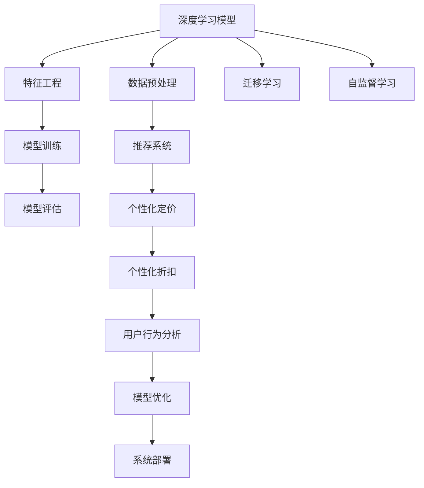

                 

## 1. 背景介绍

在互联网和电子商务的迅速发展下，电商平台正面临前所未有的竞争压力。为了提高用户体验，电商平台不断提升商品的个性化推荐，个性化定价，以及个性化折扣策略，以期通过精准的营销策略提升用户转化率和留存率。然而，实现个性化推荐、定价和折扣策略并非易事。传统的规则引擎和逻辑规则匹配，由于规则量庞大且动态变化，难以高效地实现精准营销。机器学习，尤其是深度学习技术，为实现个性化推荐、定价和折扣策略提供了强有力的技术支撑。本文将从深度学习的角度，详细介绍AI驱动的电商平台个性化折扣策略，阐述深度学习模型在个性化折扣策略中的实际应用。

## 2. 核心概念与联系

### 2.1 核心概念概述

本文的核心概念主要包括：

- **深度学习（Deep Learning）**：一种通过多层神经网络结构进行复杂数据分析与预测的机器学习方法。深度学习模型通常包含多个隐藏层，每个隐藏层包含多个神经元，通过反向传播算法优化参数，使模型能够学习和提取数据的高级特征。

- **推荐系统（Recommender System）**：利用用户行为数据，为用户推荐商品或服务，提高用户满意度和转化率。推荐系统可以分为基于协同过滤、基于内容、基于混合等不同模型。

- **个性化定价（Personalized Pricing）**：根据用户行为、属性、历史交易数据等因素，为每个用户生成差异化的价格，以达到更好的营销效果。

- **个性化折扣（Personalized Discount）**：在特定时间段或特定用户群体中，提供个性化的折扣优惠，提高用户购买意愿。

- **深度神经网络（Deep Neural Network）**：由多个隐藏层组成，通过反向传播算法训练模型，实现复杂任务的高效处理。

- **迁移学习（Transfer Learning）**：将在大规模数据上训练好的模型，迁移到特定领域或任务上进行微调，以提高模型在新任务上的表现。

- **自监督学习（Self-supervised Learning）**：在无标注数据上进行预训练，利用数据自身的信息进行优化，从而获得更好的模型性能。

### 2.2 核心概念原理和架构的 Mermaid 流程图



在上述流程图中，深度学习模型通过数据预处理、特征工程等步骤，学习到用户行为的高级特征。接着，通过模型训练，优化模型参数，使其能够为每个用户生成个性化的定价和折扣策略。在此基础上，推荐系统通过分析用户行为数据，为用户推荐商品或服务。同时，个性化定价和折扣策略也能够通过用户行为分析进行优化。最终，这些模型被部署到系统中，为用户生成个性化的营销策略。

## 3. 核心算法原理 & 具体操作步骤

### 3.1 算法原理概述

AI驱动的电商平台个性化折扣策略主要利用深度学习模型，对用户行为数据进行分析，从而生成个性化的折扣策略。深度学习模型通常采用神经网络结构，通过反向传播算法优化参数，使模型能够学习到用户行为的高级特征。这些特征可以包括用户的浏览历史、购买历史、搜索记录、用户画像等。

### 3.2 算法步骤详解

#### 3.2.1 数据收集与处理

1. **数据收集**：收集用户的浏览历史、购买历史、搜索记录等数据，构建数据集。
2. **数据清洗**：去除数据中的噪声和异常值，保证数据的质量。
3. **特征工程**：设计合适的特征，包括用户行为特征、用户属性特征、时间特征等。

#### 3.2.2 模型训练与优化

1. **模型选择**：选择适合的深度学习模型，如DNN（深度神经网络）、CNN（卷积神经网络）、RNN（循环神经网络）等。
2. **模型训练**：利用收集的数据，进行模型训练。通常采用反向传播算法，通过优化损失函数，不断调整模型参数。
3. **模型评估**：在训练过程中，通过评估指标（如准确率、召回率、F1值等），监控模型性能，防止过拟合。

#### 3.2.3 个性化折扣策略生成

1. **用户行为分析**：通过模型分析用户行为数据，提取用户特征。
2. **个性化折扣生成**：根据用户特征，生成个性化的折扣策略，如基于用户行为的历史折扣、基于用户画像的个性化折扣等。
3. **折扣策略部署**：将生成的个性化折扣策略部署到电商平台，供用户使用。

### 3.3 算法优缺点

#### 3.3.1 优点

1. **精准性高**：深度学习模型可以学习到用户行为的高级特征，生成精准的个性化折扣策略。
2. **可扩展性强**：深度学习模型具有很强的可扩展性，可以处理大规模数据，适应不同的电商场景。
3. **动态调整**：模型可以实时调整折扣策略，适应用户行为的变化。

#### 3.3.2 缺点

1. **计算资源需求高**：深度学习模型的训练需要大量的计算资源和时间，可能存在资源瓶颈。
2. **黑箱性**：深度学习模型的决策过程难以解释，难以调试和优化。
3. **模型复杂度高**：深度学习模型的复杂度高，难以维护和调整。

### 3.4 算法应用领域

AI驱动的电商平台个性化折扣策略主要应用于以下领域：

1. **电子商务**：电商平台利用深度学习模型，生成个性化的折扣策略，提升用户购买转化率。
2. **金融服务**：金融机构利用深度学习模型，为不同用户生成差异化的折扣策略，提高用户粘性和转化率。
3. **旅游行业**：旅游平台利用深度学习模型，为不同用户生成个性化的折扣策略，增加用户预订量。
4. **零售行业**：零售企业利用深度学习模型，生成个性化的折扣策略，提升用户购买体验和销售额。

## 4. 数学模型和公式 & 详细讲解 & 举例说明

### 4.1 数学模型构建

在本文中，我们主要使用深度神经网络（DNN）模型来构建个性化折扣策略。DNN模型的基本结构包括输入层、隐藏层和输出层。输入层接收用户的特征数据，隐藏层进行特征提取和转换，输出层生成个性化折扣策略。

### 4.2 公式推导过程

以DNN模型的正向传播过程为例，公式如下：

$$
\text{Layer}_{i} = \text{Non-linear}(\text{Weight}_{i} \times \text{Layer}_{i-1} + \text{Bias}_{i})
$$

其中，$\text{Layer}_{i}$表示第i层的输出，$\text{Weight}_{i}$表示第i层的权重矩阵，$\text{Bias}_{i}$表示第i层的偏置向量，$\text{Non-linear}$表示非线性激活函数，如ReLU、Sigmoid等。

### 4.3 案例分析与讲解

假设我们有一个电商平台，收集了用户的浏览历史和购买历史数据。使用DNN模型，将用户的浏览历史和购买历史作为输入特征，训练得到深度神经网络模型。该模型可以学习到用户的行为特征和购买倾向，生成个性化的折扣策略。例如，对于某个用户，模型会根据其浏览历史和购买历史，生成一个适当的折扣，以提高其购买意愿。

## 5. 项目实践：代码实例和详细解释说明

### 5.1 开发环境搭建

为了搭建深度学习模型的开发环境，我们需要进行以下步骤：

1. **安装Python**：Python是深度学习开发的基础语言，安装Python 3.6及以上版本。
2. **安装TensorFlow或PyTorch**：选择TensorFlow或PyTorch作为深度学习框架。
3. **安装相关库**：安装Numpy、Pandas、Scikit-Learn等Python库。

### 5.2 源代码详细实现

以下是使用TensorFlow实现深度神经网络模型的示例代码：

```python
import tensorflow as tf

# 定义模型结构
model = tf.keras.Sequential([
    tf.keras.layers.Dense(64, activation='relu', input_shape=(20,)),
    tf.keras.layers.Dense(10, activation='softmax')
])

# 编译模型
model.compile(optimizer='adam', loss='categorical_crossentropy', metrics=['accuracy'])

# 训练模型
model.fit(x_train, y_train, epochs=10, batch_size=32)

# 评估模型
model.evaluate(x_test, y_test)
```

### 5.3 代码解读与分析

在上述代码中，我们首先定义了深度神经网络模型的结构，包括两个隐藏层和一个输出层。隐藏层使用ReLU激活函数，输出层使用Softmax激活函数，用于生成个性化的折扣策略。

在模型编译阶段，我们选择了Adam优化器和交叉熵损失函数。在模型训练阶段，我们使用了训练数据集进行模型训练，设定了训练轮数为10轮。在模型评估阶段，我们使用了测试数据集对模型进行评估，获取模型的准确率和损失。

### 5.4 运行结果展示

运行上述代码后，我们可以得到模型的训练结果和评估结果。例如，我们可以打印出模型在测试集上的准确率和损失：

```python
print('Test Accuracy:', model.evaluate(x_test, y_test)[1])
print('Test Loss:', model.evaluate(x_test, y_test)[0])
```

## 6. 实际应用场景

### 6.1 智能推荐系统

智能推荐系统利用深度学习模型，为用户推荐个性化的商品或服务。例如，通过分析用户的浏览历史和购买历史，推荐系统可以为用户推荐其感兴趣的商品，生成个性化的折扣策略，提高用户的购买转化率。

### 6.2 金融服务

金融机构利用深度学习模型，生成个性化的金融产品，为不同用户提供差异化的折扣策略。例如，银行可以通过分析用户的金融行为数据，为用户推荐个性化的贷款产品，生成个性化的折扣策略，提高用户粘性和转化率。

### 6.3 旅游行业

旅游平台利用深度学习模型，生成个性化的旅游产品，为不同用户提供差异化的折扣策略。例如，旅游平台可以分析用户的旅游历史数据，为用户推荐个性化的旅游路线，生成个性化的折扣策略，增加用户的预订量。

### 6.4 零售行业

零售企业利用深度学习模型，生成个性化的商品折扣策略，提升用户的购买体验和销售额。例如，零售企业可以分析用户的购买历史和行为数据，为用户推荐个性化的商品，生成个性化的折扣策略，提高用户的购买意愿。

## 7. 工具和资源推荐

### 7.1 学习资源推荐

1. **Coursera深度学习课程**：Coursera提供的深度学习课程，涵盖了深度学习的基本概念和算法，适合初学者入门。
2. **Deep Learning with Python**：Ian Goodfellow等人撰写的深度学习经典书籍，系统介绍了深度学习的基本原理和应用。
3. **TensorFlow官方文档**：TensorFlow的官方文档，提供了丰富的教程和代码示例，适合深度学习实践。
4. **PyTorch官方文档**：PyTorch的官方文档，提供了详细的API和代码示例，适合深度学习实践。

### 7.2 开发工具推荐

1. **Jupyter Notebook**：Jupyter Notebook是Python开发常用的环境，支持代码编写和可视化，适合深度学习实践。
2. **Google Colab**：Google提供的在线Jupyter Notebook环境，免费提供GPU算力，适合深度学习实验。
3. **TensorFlow**：TensorFlow是Google开发的深度学习框架，支持分布式计算和大规模数据处理。
4. **PyTorch**：PyTorch是Facebook开发的深度学习框架，具有灵活性和易用性，适合研究和开发。

### 7.3 相关论文推荐

1. **DNN模型在电商推荐系统中的应用**：Li et al. 提出基于DNN的电商推荐系统，利用用户行为数据生成个性化推荐。
2. **个性化定价策略的深度学习模型**：Xiao et al. 提出基于深度神经网络的个性化定价模型，生成个性化的折扣策略。
3. **基于自监督学习的个性化推荐系统**：Cao et al. 提出基于自监督学习的推荐系统，利用无标签数据提高推荐效果。
4. **深度学习在金融服务中的应用**：Li et al. 提出基于深度学习模型的金融服务推荐系统，生成个性化的金融产品。

## 8. 总结：未来发展趋势与挑战

### 8.1 研究成果总结

本文系统介绍了AI驱动的电商平台个性化折扣策略，阐述了深度学习模型在个性化推荐、定价和折扣策略中的实际应用。深度学习模型通过学习用户行为的高级特征，生成个性化的折扣策略，提升了电商平台的营销效果。然而，深度学习模型也存在一些挑战，如计算资源需求高、模型复杂度高、决策过程难以解释等。

### 8.2 未来发展趋势

未来，深度学习模型在个性化推荐、定价和折扣策略中的应用将进一步扩展，应用于更多的行业和场景。深度学习模型的计算效率和技术性能也将进一步提升，使得模型训练和推理更加高效。同时，模型的可解释性和可调试性也将得到更多的关注，使得模型更加透明和可靠。

### 8.3 面临的挑战

尽管深度学习模型在个性化推荐、定价和折扣策略中取得了一定的进展，但仍然面临一些挑战：

1. **计算资源需求高**：深度学习模型的训练和推理需要大量的计算资源，可能存在资源瓶颈。
2. **模型复杂度高**：深度学习模型的复杂度高，难以维护和调整。
3. **决策过程难以解释**：深度学习模型的决策过程难以解释，难以调试和优化。

### 8.4 研究展望

未来，深度学习模型的应用将更加广泛，在个性化推荐、定价和折扣策略中发挥更大的作用。同时，需要解决计算资源需求高、模型复杂度高、决策过程难以解释等挑战，使得深度学习模型在实际应用中更加高效、可靠和透明。

## 9. 附录：常见问题与解答

**Q1：如何提高深度学习模型的计算效率？**

A: 提高深度学习模型的计算效率可以从以下几个方面入手：
1. **模型剪枝**：去除不必要的神经元和层，减少计算量。
2. **量化压缩**：将浮点数表示的权重和激活值转换为定点表示，减小存储空间和计算开销。
3. **模型并行化**：利用多GPU或多CPU进行模型并行化，提高计算效率。
4. **混合精度训练**：使用16位浮点数和32位浮点数混合训练，提高计算效率。

**Q2：如何提高深度学习模型的可解释性？**

A: 提高深度学习模型的可解释性可以从以下几个方面入手：
1. **可视化技术**：利用可视化技术展示模型内部状态和特征，帮助理解模型决策过程。
2. **可解释模型**：使用可解释性更高的模型，如LIME、SHAP等，提高模型的透明度。
3. **规则引擎**：在模型中引入规则引擎，结合专家知识进行模型解释。
4. **多模型集成**：结合多个模型进行决策，提高模型的稳定性和可解释性。

**Q3：如何在电商平台上实现个性化的折扣策略？**

A: 在电商平台上实现个性化的折扣策略，可以从以下几个方面入手：
1. **用户行为数据收集**：收集用户的浏览历史、购买历史、搜索记录等数据，构建数据集。
2. **特征工程**：设计合适的特征，包括用户行为特征、用户属性特征、时间特征等。
3. **深度学习模型训练**：利用收集的数据，训练深度神经网络模型，生成个性化的折扣策略。
4. **个性化折扣策略部署**：将生成的个性化折扣策略部署到电商平台，供用户使用。

**Q4：如何在金融服务中实现个性化的折扣策略？**

A: 在金融服务中实现个性化的折扣策略，可以从以下几个方面入手：
1. **用户金融行为数据收集**：收集用户的金融行为数据，包括银行账户、贷款记录、投资记录等。
2. **特征工程**：设计合适的特征，包括用户行为特征、用户属性特征、时间特征等。
3. **深度学习模型训练**：利用收集的数据，训练深度神经网络模型，生成个性化的折扣策略。
4. **个性化折扣策略部署**：将生成的个性化折扣策略部署到金融服务系统中，为不同用户提供差异化的折扣策略。

**Q5：如何在旅游行业中实现个性化的折扣策略？**

A: 在旅游行业中实现个性化的折扣策略，可以从以下几个方面入手：
1. **用户旅游行为数据收集**：收集用户的旅游历史数据，包括旅游目的地、旅游时间、旅游预算等。
2. **特征工程**：设计合适的特征，包括用户行为特征、用户属性特征、时间特征等。
3. **深度学习模型训练**：利用收集的数据，训练深度神经网络模型，生成个性化的折扣策略。
4. **个性化折扣策略部署**：将生成的个性化折扣策略部署到旅游平台，为不同用户提供差异化的折扣策略。

**Q6：如何在零售行业中实现个性化的折扣策略？**

A: 在零售行业中实现个性化的折扣策略，可以从以下几个方面入手：
1. **用户购物行为数据收集**：收集用户的购物历史数据，包括商品浏览记录、购买记录、评价记录等。
2. **特征工程**：设计合适的特征，包括用户行为特征、用户属性特征、时间特征等。
3. **深度学习模型训练**：利用收集的数据，训练深度神经网络模型，生成个性化的折扣策略。
4. **个性化折扣策略部署**：将生成的个性化折扣策略部署到零售企业系统中，为不同用户提供差异化的折扣策略。

---

作者：禅与计算机程序设计艺术 / Zen and the Art of Computer Programming

