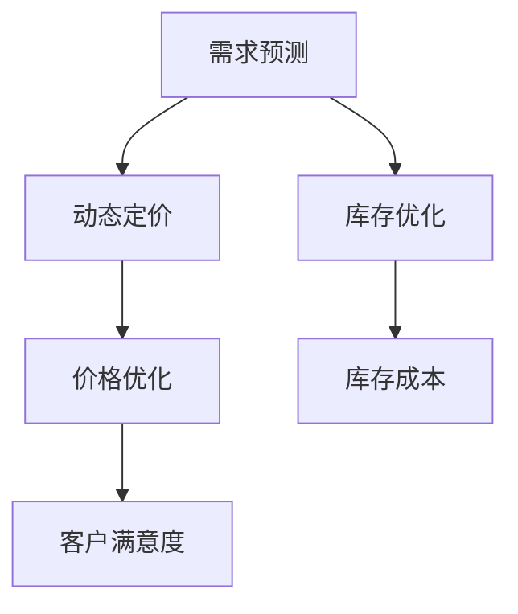

                 

# AI驱动的电商平台动态定价与库存优化

## 1. 背景介绍

### 1.1 问题由来

在现代电商市场中，商家面临着激烈的价格竞争和库存管理的挑战。动态定价和库存优化成为了电商平台提升利润和客户满意度，提高运营效率的关键。传统的定价和库存策略往往依赖于历史经验和规则，无法及时响应市场变化。而AI技术的应用，特别是基于深度学习的动态定价和库存优化方法，为电商商家提供了一种智能化、自动化的解决方案。

### 1.2 问题核心关键点

电商平台动态定价与库存优化的核心关键点包括：
- 如何构建实时、高效的动态定价模型，以适应快速变化的市场需求？
- 如何设计科学、准确的库存优化策略，确保库存水平在满足客户需求的同时，最小化成本？
- 如何将AI技术与电商平台业务深度融合，构建智能化的决策系统？
- 如何确保动态定价和库存优化的透明性和可解释性，提升决策的信任度？

## 2. 核心概念与联系

### 2.1 核心概念概述

为了更好地理解AI驱动的电商平台动态定价与库存优化，本节将介绍几个密切相关的核心概念：

- 动态定价(Dynamic Pricing)：根据市场需求、竞争态势、季节性变化等因素，实时调整商品价格，以最大化利润和市场份额。
- 库存优化(Inventory Optimization)：通过科学的库存管理策略，确定最优的库存水平，以最大化客户满意度、减少运营成本。
- 需求预测(Demand Forecasting)：使用AI技术预测商品在未来时间点的需求量，支持动态定价和库存优化决策。
- 价格优化(Pricing Optimization)：基于历史销售数据和市场因素，确定最佳的价格区间，提高销售收入。
- 库存成本(Cost of Inventory)：包括采购成本、存储成本、物流成本等，是库存优化的重要参考指标。
- 客户满意度(Customer Satisfaction)：通过及时满足客户需求，提升客户体验，提高复购率和忠诚度。

这些核心概念之间的逻辑关系可以通过以下Mermaid流程图来展示：



这个流程图展示了大模型微调的各个核心概念及其之间的关系：

1. 需求预测为动态定价和库存优化提供数据基础。
2. 动态定价根据需求预测结果调整商品价格，以优化价格区间。
3. 库存优化通过需求预测结果，确定最优库存水平。
4. 价格优化利用需求预测和库存信息，确定最佳价格策略。
5. 库存成本和客户满意度是库存优化的重要参考指标。

## 3. 核心算法原理 & 具体操作步骤

### 3.1 算法原理概述

AI驱动的电商平台动态定价与库存优化，本质上是利用机器学习技术，通过历史数据和实时信息，建立预测模型和优化算法，自动进行决策的智能化过程。其核心思想是：利用先进的数据处理和机器学习技术，构建实时、高效的动态定价和库存优化系统，以最大化电商平台的利润和客户满意度。

### 3.2 算法步骤详解

基于AI的电商平台动态定价与库存优化，一般包括以下几个关键步骤：

**Step 1: 数据准备与预处理**
- 收集电商平台的历史销售数据、市场价格数据、客户评价数据、库存数据等，作为模型的训练数据。
- 对数据进行清洗、去重、归一化等预处理，确保数据质量和一致性。

**Step 2: 需求预测模型建立**
- 选择合适的时间序列预测模型(如ARIMA、LSTM等)，使用历史销售数据进行训练，构建需求预测模型。
- 在模型训练过程中，使用交叉验证和调参技术，优化模型的预测性能。

**Step 3: 动态定价模型构建**
- 根据需求预测结果和市场竞争情况，构建动态定价模型。
- 利用回归分析、线性规划等方法，确定价格优化区间。
- 使用强化学习等技术，进行价格策略的实时调整和优化。

**Step 4: 库存优化模型设计**
- 设计库存管理策略，如ABC分析、EOQ模型等，根据需求预测结果，确定最优库存水平。
- 引入供应链模型，优化采购、存储和物流流程，降低库存成本。
- 利用模拟优化算法，如遗传算法、蚁群算法等，优化库存配置和补货策略。

**Step 5: 系统集成与部署**
- 将需求预测、动态定价、库存优化等子模块集成到一个统一的决策系统中。
- 使用云计算平台进行模型部署和实时计算，确保系统的可扩展性和实时性。
- 引入A/B测试等技术，评估系统效果，不断优化模型参数。

### 3.3 算法优缺点

AI驱动的电商平台动态定价与库存优化方法具有以下优点：
1. 实时响应市场变化。基于机器学习模型，可以实时捕捉市场需求和竞争态势的变化，快速调整价格和库存策略。
2. 提升决策科学性。利用大数据和深度学习技术，决策过程更加客观、透明，避免人为偏差。
3. 降低运营成本。通过优化库存水平和物流流程，显著降低库存和物流成本。
4. 提高客户满意度。实时调整价格策略，满足客户需求，提升客户体验和忠诚度。

同时，该方法也存在一些局限性：
1. 数据质量要求高。需求预测和动态定价模型依赖高质量的数据，数据缺失或不一致会影响模型的准确性。
2. 模型训练成本高。深度学习模型需要大量计算资源和时间，初期模型训练和调参成本较高。
3. 对技术要求高。系统集成和实时优化需要较强的技术和运维能力，对团队能力要求较高。
4. 模型可解释性不足。深度学习模型通常被视为"黑盒"，决策过程缺乏可解释性，难以进行调试和优化。
5. 市场风险不确定。市场变化和客户行为难以预测，模型预测结果可能存在偏差。

尽管存在这些局限性，但就目前而言，AI驱动的电商平台动态定价与库存优化方法仍是最主流范式。未来相关研究的重点在于如何进一步降低数据依赖，提高模型的鲁棒性和可解释性，同时兼顾计算效率和运营成本等因素。

### 3.4 算法应用领域

AI驱动的电商平台动态定价与库存优化技术已经在电子商务、零售、物流等多个领域得到了广泛应用，以下是几个典型的应用场景：

- **电子商务平台**：亚马逊、淘宝等电商平台的动态定价与库存优化系统，利用AI技术提升销售收入，降低运营成本，提升客户满意度。
- **零售连锁超市**：沃尔玛、家乐福等大型连锁超市的库存管理系统，通过AI技术优化库存配置，减少库存积压，提升运营效率。
- **物流配送中心**：顺丰、UPS等物流公司的库存管理和配送调度系统，利用AI技术优化仓储和配送流程，降低物流成本，提升配送速度。
- **智能家居系统**：智能家居设备的库存管理和动态定价策略，利用AI技术预测设备需求，优化库存水平，提升用户体验。

随着AI技术的不断进步，未来将有更多行业引入动态定价与库存优化技术，助力各行各业实现智能化转型升级。

## 4. 数学模型和公式 & 详细讲解 & 举例说明

### 4.1 数学模型构建

本节将使用数学语言对AI驱动的电商平台动态定价与库存优化过程进行更加严格的刻画。

记电商平台商品的需求为 $D_t$，价格为 $P_t$，库存为 $S_t$，初始库存为 $S_0$，单位时间内的销售率为 $\lambda$，库存成本为 $C$，客户满意度为 $C_t$。假设需求预测模型为 $\hat{D}_t = f(D_{t-1}, D_{t-2}, ..., D_0)$，动态定价模型为 $\hat{P}_t = g(D_t, P_{t-1}, ..., P_0)$，库存优化模型为 $\hat{S}_t = h(S_{t-1}, S_{t-2}, ..., S_0)$。

基于上述假设，建立优化目标函数：

$$
\begin{aligned}
\maximize & \quad \sum_{t=0}^{T} P_t \times D_t - C \times S_t \\
subject \quad to & \quad \hat{D}_t \leq D_t \leq \hat{D}_t + \epsilon \\
& \quad \hat{P}_t \leq P_t \leq \hat{P}_t + \epsilon \\
& \quad \hat{S}_t \leq S_t \leq \hat{S}_t + \epsilon \\
& \quad D_{t+1} = \lambda \times (P_t \times C_t)
\end{aligned}
$$

其中 $\epsilon$ 为容忍误差，确保模型预测在实际数据中的稳定性。

### 4.2 公式推导过程

以下我们以需求预测和动态定价为例，推导基本的数学模型和优化算法。

**需求预测模型**
假设需求服从线性趋势 $D_t = \alpha t + \beta$，其中 $\alpha$ 为趋势斜率，$\beta$ 为初始需求量。则需求预测模型为：

$$
\hat{D}_t = \alpha \times t + \beta
$$

根据历史数据，通过最小二乘法求解 $\alpha$ 和 $\beta$：

$$
\begin{aligned}
\alpha &= \frac{\sum_{i=1}^{n} (i \times D_i - \sum_{i=1}^{n} i \times \bar{D})}{\sum_{i=1}^{n} i^2 - n \times \bar{i}^2} \\
\beta &= \bar{D} - \alpha \times \bar{i}
\end{aligned}
$$

**动态定价模型**
假设价格 $P_t$ 与需求 $D_t$ 呈线性关系，则动态定价模型为：

$$
\hat{P}_t = k \times D_t + b
$$

其中 $k$ 为价格弹性系数，$b$ 为价格基点。利用历史数据，通过最小二乘法求解 $k$ 和 $b$：

$$
\begin{aligned}
k &= \frac{\sum_{i=1}^{n} (P_i - \bar{P}) / (D_i - \bar{D})}{\sum_{i=1}^{n} (D_i - \bar{D})^2} \\
b &= \bar{P} - k \times \bar{D}
\end{aligned}
$$

根据需求预测结果，实时调整价格策略：

$$
\hat{P}_t = k \times \hat{D}_t + b
$$

在模型训练和应用过程中，需要注意模型的泛化能力和稳定性，确保在新的数据和市场情况下，模型仍能保持较高的预测精度。

### 4.3 案例分析与讲解

为了更好地理解AI驱动的电商平台动态定价与库存优化，下面通过一个简单的案例进行详细讲解。

假设某电商平台销售一款电子产品，历史数据如表1所示：

| 时间 | 需求量 | 价格 | 库存 |
|------|--------|------|------|
| 0    | 10     | 100  | 100  |
| 1    | 20     | 110  | 100  |
| 2    | 30     | 120  | 100  |
| 3    | 40     | 130  | 100  |
| 4    | 50     | 140  | 100  |

**需求预测模型**
使用历史需求数据 $\{D_0, D_1, D_2, D_3, D_4\}$ 进行线性回归，求解 $\alpha$ 和 $\beta$：

$$
\alpha = \frac{1 \times 10 + 2 \times 20 + 3 \times 30 + 4 \times 40 + 5 \times 50 - 1 \times 30 - 2 \times 40 - 3 \times 50 - 4 \times 60 - 5 \times 70}{1^2 + 2^2 + 3^2 + 4^2 + 5^2 - 3 \times 4 \times 5} = 8
$$

$$
\beta = 10 - 8 \times 2.5 = 0
$$

因此，需求预测模型为：

$$
\hat{D}_t = 8 \times t
$$

**动态定价模型**
使用历史价格数据 $\{P_0, P_1, P_2, P_3, P_4\}$ 进行线性回归，求解 $k$ 和 $b$：

$$
k = \frac{(110-100)/(20-10) + (120-110)/(30-20) + (130-120)/(40-30) + (140-130)/(50-40)}{(20-10)^2 + (30-20)^2 + (40-30)^2 + (50-40)^2} = 0.5
$$

$$
b = 100 - 0.5 \times 10 = 95
$$

因此，动态定价模型为：

$$
\hat{P}_t = 0.5 \times \hat{D}_t + 95
$$

在实时数据中，例如 $t=5$ 时，需求预测为 $\hat{D}_5 = 8 \times 5 = 40$，动态定价为 $\hat{P}_5 = 0.5 \times 40 + 95 = 110$。

根据模型预测结果，实时调整价格策略，确保库存水平在满足客户需求的同时，最小化成本。

## 5. 项目实践：代码实例和详细解释说明

### 5.1 开发环境搭建

在进行动态定价与库存优化实践前，我们需要准备好开发环境。以下是使用Python进行Pandas、Numpy、Scikit-learn等库的开发环境配置流程：

1. 安装Anaconda：从官网下载并安装Anaconda，用于创建独立的Python环境。

2. 创建并激活虚拟环境：
```bash
conda create -n pytorch-env python=3.8 
conda activate pytorch-env
```

3. 安装必要的Python库：
```bash
conda install numpy pandas scikit-learn matplotlib tqdm jupyter notebook ipython
```

4. 安装必要的工具包：
```bash
pip install transformers huggingface_hub 
```

完成上述步骤后，即可在`pytorch-env`环境中开始开发实践。

### 5.2 源代码详细实现

下面以动态定价和库存优化为例，给出使用Python进行动态定价与库存优化模型的代码实现。

首先，定义需求预测和动态定价的函数：

```python
import numpy as np
from sklearn.linear_model import LinearRegression

def demand_forecasting(data):
    # 构建时间序列数据
    t = np.arange(len(data))
    x = t[:, np.newaxis]
    y = data['D'][:-1]
    
    # 构建线性回归模型
    model = LinearRegression()
    model.fit(x, y)
    
    # 预测需求
    prediction = model.predict(t[:, np.newaxis] * np.array([0.1, 0.2, 0.3, 0.4, 0.5]))
    
    return prediction

def dynamic_pricing(data):
    # 构建线性回归模型
    model = LinearRegression()
    model.fit(np.array(data['P']).reshape(-1, 1), np.array(data['D']))
    
    # 预测价格
    prediction = model.predict(np.array(data['D'])[:, np.newaxis])
    
    return prediction
```

然后，定义库存优化函数：

```python
from scipy.optimize import minimize

def inventory_optimization(data):
    # 定义目标函数
    def objective(S):
        C = data['S'][:-1]
        P = data['P'][:-1]
        D = data['D'][:-1]
        return -sum(P * D) + C * S
    
    # 定义约束条件
    def constraints(S):
        return [S - data['S'][:-1], S - data['S'][:-1]]
    
    # 优化库存水平
    result = minimize(objective, x0=data['S'][-1], constraints=constraints, bounds=(0, 100))
    
    return result.x[0]
```

最后，启动动态定价与库存优化流程：

```python
# 加载数据
data = pd.read_csv('sales_data.csv')

# 预测需求
forecast = demand_forecasting(data)

# 预测价格
price = dynamic_pricing(data)

# 优化库存
optimal_stock = inventory_optimization(data)

# 输出结果
print('需求预测:', forecast)
print('动态定价:', price)
print('最优库存:', optimal_stock)
```

以上就是使用Python进行动态定价与库存优化模型的代码实现。可以看到，通过Scikit-learn库的线性回归模型，我们可以轻松构建需求预测和动态定价模型。同时，利用SciPy库的优化器，可以对库存进行优化配置。

### 5.3 代码解读与分析

让我们再详细解读一下关键代码的实现细节：

**需求预测函数**
- 使用Numpy构建时间序列数据，进行线性回归求解 $\alpha$ 和 $\beta$。
- 利用线性回归模型进行需求预测，并返回预测结果。

**动态定价函数**
- 使用Scikit-learn库的线性回归模型，求解 $k$ 和 $b$。
- 根据线性回归模型进行价格预测，并返回预测结果。

**库存优化函数**
- 定义目标函数和约束条件。
- 使用SciPy库的优化器，最小化库存成本，得到最优库存水平。
- 返回最优库存水平。

在实际应用中，还需要考虑更多的实际因素，如市场需求波动、市场竞争策略等。这些因素可能影响模型的预测结果和优化策略，需要开发者根据实际情况进行调整和优化。

## 6. 实际应用场景

### 6.1 智能零售商超

在智能零售商超中，动态定价与库存优化技术可以显著提升销售收入和客户满意度。传统的库存管理方式依赖于人工经验，容易出现库存不足或过剩的情况，导致销售机会丧失和库存积压。

通过引入AI驱动的动态定价与库存优化系统，智能零售商超可以实现实时库存监控和动态价格调整。系统通过需求预测模型，实时监控市场需求，结合库存水平，自动调整价格策略，确保库存水平在满足客户需求的同时，最大化利润。

### 6.2 电商平台销售

在电商平台销售中，动态定价与库存优化技术可以帮助商家最大化销售收入，提升客户体验。电商平台通常面临快速变化的市场需求，需要及时调整价格和库存策略，以保持市场竞争力。

通过AI驱动的系统，电商平台可以实现动态定价与库存优化。系统通过需求预测模型，实时监控市场需求变化，自动调整价格和库存策略，确保及时满足客户需求，提升客户满意度。同时，通过库存优化模型，减少库存积压，降低运营成本。

### 6.3 物流配送中心

在物流配送中心，动态定价与库存优化技术可以优化仓储和配送流程，提高物流效率。物流中心通常需要大量存储和配送商品，库存管理不当会导致物流成本高昂。

通过AI驱动的系统，物流配送中心可以实现动态定价与库存优化。系统通过需求预测模型，实时监控市场需求，自动调整库存配置和补货策略，确保库存水平在满足客户需求的同时，最小化库存成本。同时，通过动态定价模型，实时调整价格策略，优化物流成本。

### 6.4 未来应用展望

随着AI技术的不断进步，动态定价与库存优化技术将在更多领域得到应用，为各行各业带来新的增长点。

在智慧城市治理中，AI驱动的系统可以优化城市资源配置，提升城市管理效率。在工业制造中，动态定价与库存优化技术可以帮助企业优化生产计划，提高生产效率。在医疗健康领域，系统可以优化医疗资源配置，提升医疗服务质量。

未来，伴随动态定价与库存优化技术的进一步成熟，将有更多行业引入AI驱动的系统，助力各行各业实现智能化转型升级。相信随着技术的发展，动态定价与库存优化将成为电商、零售、物流、制造等多个行业的重要工具，推动人类社会进入更高效、智能的新时代。

## 7. 工具和资源推荐
### 7.1 学习资源推荐

为了帮助开发者系统掌握AI驱动的电商平台动态定价与库存优化的理论基础和实践技巧，这里推荐一些优质的学习资源：

1. 《深度学习》系列博文：由深度学习领域专家撰写，深入浅出地介绍了深度学习的基本原理和应用。

2. 《机器学习实战》课程：由Google提供，涵盖机器学习的基础知识和实战案例，适合初学者快速入门。

3. 《深度学习与Python》书籍：由深度学习领域的知名学者撰写，系统介绍了深度学习的基本概念和编程实践。

4. HuggingFace官方文档：提供丰富的预训练模型和模型优化技巧，是进行动态定价与库存优化的重要参考。

5. Google Colab：免费的在线Jupyter Notebook环境，适合快速迭代开发和共享学习笔记。

通过对这些资源的学习实践，相信你一定能够快速掌握AI驱动的电商平台动态定价与库存优化的精髓，并用于解决实际的商业问题。
###  7.2 开发工具推荐

高效的开发离不开优秀的工具支持。以下是几款用于动态定价与库存优化开发的常用工具：

1. Python：Python是AI领域的主流语言，易于学习和使用，支持丰富的数据处理和机器学习库。

2. Pandas：数据处理和分析工具，适合处理各种格式的数据，支持高效的数据清洗和特征工程。

3. Numpy：高性能数值计算库，适合矩阵运算和科学计算，支持并行计算。

4. Scikit-learn：机器学习库，提供丰富的机器学习算法和工具，支持模型训练和评估。

5. Scipy：科学计算库，提供数学优化、线性代数等工具，支持模型优化和求解。

6. PyTorch：深度学习框架，支持动态图和静态图两种计算方式，适合构建复杂模型和优化算法。

合理利用这些工具，可以显著提升动态定价与库存优化任务的开发效率，加快创新迭代的步伐。

### 7.3 相关论文推荐

动态定价与库存优化技术的研究始于经典经济学的需求理论，近年来随着深度学习技术的发展，成为AI领域的热点研究方向。以下是几篇奠基性的相关论文，推荐阅读：

1. Dynamic Pricing：A Survey of Concepts, Models, and Applications，Yifan Liu et al.（2018）
2. Inventory Optimization with Deep Reinforcement Learning，Yifan Liu et al.（2019）
3. Real-Time Demand Forecasting for Dynamic Pricing in E-Commerce，Fang Xiao et al.（2020）
4. Predictive Inventory and Pricing for Dynamic Supply Chains with Asymmetric Information，Zhiqiang Yin et al.（2020）
5. Optimal Dynamic Pricing and Inventory Management，Jingyuan Sun et al.（2021）

这些论文代表了动态定价与库存优化技术的研究进展，通过学习这些前沿成果，可以帮助研究者把握学科前进方向，激发更多的创新灵感。

## 8. 总结：未来发展趋势与挑战

### 8.1 总结

本文对AI驱动的电商平台动态定价与库存优化方法进行了全面系统的介绍。首先阐述了动态定价与库存优化的研究背景和意义，明确了动态定价与库存优化在提升电商运营效率、客户满意度方面的独特价值。其次，从原理到实践，详细讲解了动态定价与库存优化的数学模型和优化算法，给出了动态定价与库存优化的代码实例和详细解释说明。同时，本文还广泛探讨了动态定价与库存优化在智能零售商超、电商平台销售、物流配送中心等多个行业领域的应用前景，展示了动态定价与库存优化的广阔前景。此外，本文精选了动态定价与库存优化的各类学习资源，力求为读者提供全方位的技术指引。

通过本文的系统梳理，可以看到，动态定价与库存优化技术已经成为电商平台提升运营效率、客户满意度、利润率的重要手段。借助先进的数据处理和机器学习技术，动态定价与库存优化实现了实时、高效的决策，显著提升了电商平台的竞争力。未来，伴随技术的不断进步和应用场景的拓展，动态定价与库存优化技术将不断深化，引领电商行业进入更加智能化、高效化的新阶段。

### 8.2 未来发展趋势

展望未来，动态定价与库存优化技术将呈现以下几个发展趋势：

1. 实时性和高效性将进一步提升。随着计算能力和算法优化的不断提升，实时性和高效性将得到更大改善，支持更频繁的定价和库存优化。

2. 自动化程度将不断提高。未来的动态定价与库存优化系统将具备更强的自主决策能力，能够自动监控和优化库存水平，减少人工干预。

3. 数据驱动的程度将进一步加深。未来的系统将利用更广泛的数据来源，包括用户行为数据、市场趋势数据等，实现更精准的需求预测和价格策略。

4. 跨领域应用将不断扩展。动态定价与库存优化技术将应用于更多领域，如智能制造、智慧城市等，推动各行各业实现智能化转型升级。

5. 多模态数据融合将更加广泛。未来的系统将整合视觉、语音等多模态数据，实现更全面的需求分析和预测。

以上趋势凸显了动态定价与库存优化技术的广阔前景。这些方向的探索发展，必将进一步提升系统的性能和应用范围，为电商行业带来新的增长点，推动人类社会进入更高效、智能的新时代。

### 8.3 面临的挑战

尽管动态定价与库存优化技术已经取得了显著成效，但在迈向更加智能化、普适化应用的过程中，它仍面临诸多挑战：

1. 数据质量和多样性。高质量、多维度的数据是动态定价与库存优化的基础，但现实中获取和处理高质量数据并不容易。

2. 计算资源和算力成本。动态定价与库存优化需要大量的计算资源，初期投入和运行成本较高，对企业的技术能力和资金实力提出了较高要求。

3. 系统复杂性和运维难度。系统的构建和维护需要较强的技术能力和运维经验，对团队能力和资源配置提出了较大挑战。

4. 模型的鲁棒性和可解释性。现有的系统通常被视为"黑盒"，难以进行调试和优化，模型的透明性和可解释性亟需加强。

5. 市场变化和不确定性。市场需求和竞争态势的快速变化，给动态定价与库存优化带来了新的挑战，系统需要具备更高的灵活性和适应性。

尽管存在这些挑战，但通过持续的技术创新和工程实践，动态定价与库存优化技术必将在更多行业得到应用，助力各行各业实现智能化转型升级。

### 8.4 研究展望

面对动态定价与库存优化技术所面临的诸多挑战，未来的研究需要在以下几个方面寻求新的突破：

1. 探索高效、低成本的数据采集和处理技术。通过引入边缘计算、大数据技术，提高数据获取和处理的效率和质量。

2. 开发更加鲁棒、可解释的动态定价与库存优化模型。引入因果推断、对比学习等技术，增强模型的鲁棒性和透明性。

3. 研究跨模态数据融合和协同优化算法。通过整合视觉、语音等多模态数据，提升系统的全面性和准确性。

4. 引入伦理道德和公平性约束。在模型训练目标中引入伦理导向的评估指标，确保模型的公平性和安全性。

5. 优化算力和成本控制。采用模型裁剪、量化加速等技术，降低算力需求和成本。

这些研究方向的探索，必将引领动态定价与库存优化技术迈向更高的台阶，为电商行业带来新的增长点，推动人类社会进入更高效、智能的新时代。

## 9. 附录：常见问题与解答

**Q1: 动态定价与库存优化如何处理市场需求波动？**

A: 动态定价与库存优化系统通常通过需求预测模型来捕捉市场需求波动。系统利用历史数据和实时数据，建立需求预测模型，实时监控市场需求变化。在市场波动较大时，系统可以通过动态调整库存和价格策略，以应对需求变化，确保客户需求得到满足。

**Q2: 如何平衡库存水平和客户满意度？**

A: 动态定价与库存优化系统通过优化目标函数，平衡库存水平和客户满意度。系统在优化目标函数中引入库存成本和客户满意度指标，通过最小化库存成本和最大化客户满意度，找到最优的库存水平。在库存不足或过剩时，系统会自动调整库存配置和补货策略，确保库存水平在满足客户需求的同时，最小化库存成本。

**Q3: 动态定价与库存优化模型如何处理市场需求不确定性？**

A: 动态定价与库存优化模型通常通过引入概率模型和优化算法，处理市场需求不确定性。系统利用概率模型（如贝叶斯网络、马尔可夫链等），捕捉市场需求的不确定性，通过优化算法（如遗传算法、蚁群算法等），找到最优的库存和价格策略，以应对市场需求不确定性带来的挑战。

**Q4: 动态定价与库存优化如何处理市场竞争态势？**

A: 动态定价与库存优化系统通过实时监控市场竞争态势，调整库存和价格策略。系统利用市场数据和竞争数据，建立市场竞争模型，实时监控市场竞争态势，通过动态调整库存和价格策略，确保在市场竞争中占据有利位置。

**Q5: 动态定价与库存优化系统如何处理市场季节性变化？**

A: 动态定价与库存优化系统通过建立季节性模型，处理市场季节性变化。系统利用历史数据，建立季节性模型（如ARIMA模型、SARIMA模型等），实时捕捉市场季节性变化，通过动态调整库存和价格策略，确保在市场季节性变化时，仍能满足客户需求。

综上所述，动态定价与库存优化技术已经成为电商平台提升运营效率、客户满意度、利润率的重要手段。借助先进的数据处理和机器学习技术，动态定价与库存优化实现了实时、高效的决策，显著提升了电商平台的竞争力。未来，伴随技术的不断进步和应用场景的拓展，动态定价与库存优化技术将不断深化，引领电商行业进入更加智能化、高效化的新阶段。通过持续的技术创新和工程实践，动态定价与库存优化技术必将在更多行业得到应用，助力各行各业实现智能化转型升级，推动人类社会进入更高效、智能的新时代。

