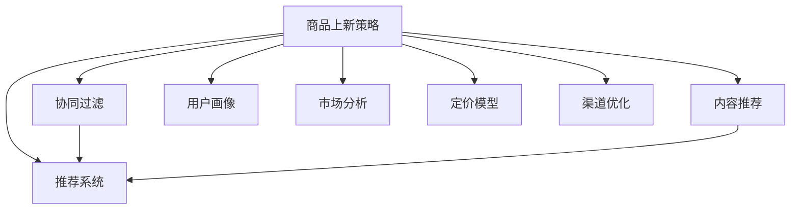

                 

# AI驱动的电商平台商品上新策略

## 1. 背景介绍

### 1.1 问题由来

在当前电商行业中，商品上新是商家提升销量和市场竞争力的重要手段。然而，传统商品上新策略往往依赖于经验丰富的市场分析团队和长期积累的数据，不仅耗时耗力，且效果难以保证。如何借助AI技术，以数据驱动的方式，更精准高效地制定商品上新策略，成为了电商企业亟需解决的问题。

### 1.2 问题核心关键点

商品上新策略的核心在于：如何在合适的时间点，以合适的价格，将合适的商品推介给合适的用户，最大化提升销售额。为了实现这一目标，需要解决以下几个关键问题：

1. **商品相关性判断**：商品是否能引起用户的兴趣和购买欲望。
2. **用户画像分析**：用户群体特征、购买习惯、消费能力等。
3. **市场需求分析**：商品的市场需求趋势、竞争对手动态、季节性因素等。
4. **定价策略制定**：商品定价与市场接受度的平衡。
5. **销售渠道选择**：不同销售渠道（如官网、社交媒体、线下门店等）的优劣对比。
6. **用户反馈循环**：基于用户反馈不断优化商品上新策略。

### 1.3 问题研究意义

通过AI技术优化商品上新策略，可以显著提高电商平台的商品推荐效率和用户满意度，提升转化率和销售额，同时降低运营成本。具体意义如下：

1. **提升推荐精准度**：通过深度学习模型挖掘商品和用户的多维度特征，实现更精准的商品推荐。
2. **优化资源配置**：合理分配营销预算和人力物力，避免资源浪费。
3. **增强市场竞争力**：及时响应市场变化，捕捉用户需求，抢占市场先机。
4. **促进用户忠诚度**：基于个性化推荐提高用户粘性，提升用户复购率。
5. **加速创新迭代**：通过AI技术快速迭代商品上新策略，紧跟市场变化。
6. **支持规模化运营**：将复杂的市场决策转化为可量化的模型，实现规模化推广。

## 2. 核心概念与联系

### 2.1 核心概念概述

为了深入理解AI驱动的商品上新策略，首先需要明确几个核心概念及其相互关系：

1. **商品上新策略（Merchandise Updating Strategy）**：电商平台根据用户行为数据、市场趋势等，制定合理的上新计划，以最大化销售收益。
2. **推荐系统（Recommendation System）**：利用AI算法，为用户推荐符合其兴趣的商品，提高用户满意度和购买率。
3. **协同过滤（Collaborative Filtering）**：通过用户行为数据，预测用户可能感兴趣的商品。
4. **内容推荐（Content-Based Recommendation）**：基于商品属性，向用户推荐相关商品。
5. **混合推荐（Hybrid Recommendation）**：结合协同过滤和内容推荐，提供更全面的推荐结果。
6. **用户画像（User Profile）**：描述用户特征，包括年龄、性别、兴趣、消费习惯等。
7. **市场分析（Market Analysis）**：分析市场趋势、竞争对手策略、节假日等，预测市场需求。
8. **定价模型（Pricing Model）**：根据商品成本、市场需求、用户支付意愿等因素，制定最优价格。
9. **渠道优化（Channel Optimization）**：评估不同销售渠道的转化率、成本等，选择最优销售路径。

这些核心概念之间的逻辑关系可以通过以下Mermaid流程图来展示：



此流程图展示了商品上新策略的各个组成部分及其相互关系。其中，推荐系统作为核心，融合了协同过滤和内容推荐，基于用户画像和市场分析，制定定价和渠道策略。

## 3. 核心算法原理 & 具体操作步骤
### 3.1 算法原理概述

AI驱动的商品上新策略主要基于推荐系统和市场分析两大核心模块。推荐系统通过深度学习模型预测用户对商品感兴趣的概率，而市场分析模块则利用时间序列分析和市场趋势预测，确定商品上新的最佳时机。

### 3.2 算法步骤详解

**Step 1: 数据准备**

- **商品数据**：包含商品ID、名称、描述、价格、分类等信息。
- **用户数据**：包括用户ID、年龄、性别、历史购买记录、浏览记录等。
- **市场数据**：如节假日、促销活动、竞争对手动态、行业趋势等。

**Step 2: 模型训练**

- **推荐模型**：使用深度学习框架如TensorFlow或PyTorch，构建协同过滤或内容推荐的模型。
- **市场模型**：构建时间序列模型，如ARIMA、LSTM等，预测市场需求变化。

**Step 3: 策略制定**

- **上新商品筛选**：根据推荐模型的输出，筛选出最有潜力的商品。
- **时机选择**：结合市场模型预测的销售趋势，确定最佳上新时机。
- **价格设定**：利用定价模型，确定商品的最佳售价。
- **渠道选择**：基于渠道优化模型，选择最适合的销售渠道。

**Step 4: 执行与监控**

- **上新执行**：在确定的上新时机，通过电商平台推广新商品。
- **效果评估**：收集上新后的销售数据，评估策略效果。
- **优化反馈**：根据用户反馈和销售数据，不断调整上新策略。

### 3.3 算法优缺点

AI驱动的商品上新策略具有以下优点：

1. **高效精准**：利用深度学习模型挖掘用户行为数据，实现高效精准的推荐。
2. **快速迭代**：通过模型训练和优化，可以快速响应市场变化。
3. **全局优化**：基于市场分析，从全局角度制定上新策略，提升整体销售额。
4. **自动化**：自动化的推荐和市场分析，降低人工干预成本。
5. **多渠道推广**：能够同时考虑多种销售渠道，优化资源配置。

然而，也存在一些局限性：

1. **数据需求高**：推荐模型和市场分析模型需要大量高质量数据进行训练和预测。
2. **模型复杂**：深度学习模型结构复杂，需要高性能计算资源进行训练和推理。
3. **市场波动**：市场变化难以完全预测，策略效果可能存在不确定性。
4. **用户隐私**：数据收集和分析过程中需要遵守用户隐私保护法规。
5. **费用高昂**：模型训练和优化需要投入大量时间和人力成本。

### 3.4 算法应用领域

AI驱动的商品上新策略不仅适用于电商行业，还可以在多个领域发挥重要作用，例如：

1. **媒体内容推荐**：根据用户观看历史和偏好，推荐新闻、视频、文章等内容。
2. **金融投资**：基于市场分析，预测股票、基金等投资品的价格趋势，辅助投资决策。
3. **旅游预订**：推荐旅行目的地、酒店、航班等，提高用户满意度和预订率。
4. **健康医疗**：预测疾病流行趋势，推荐健康建议和治疗方案。
5. **智能家居**：根据用户行为习惯，推荐智能设备和服务，提升生活便利性。

## 4. 数学模型和公式 & 详细讲解 & 举例说明

### 4.1 数学模型构建

我们以电商平台商品上新策略为例，详细讲解推荐系统和市场分析的数学模型构建。

**推荐模型**：假设推荐模型为$f(x_i, u_j)$，其中$x_i$为商品特征向量，$u_j$为用户特征向量。推荐模型输出$y_{ij}$，表示用户$j$对商品$i$的评分，即兴趣程度。

**市场模型**：假设市场模型为$g(t)$，其中$t$为时间，$g(t)$为市场销售趋势。市场模型输出$P(t)$，表示在时间$t$的市场需求预测值。

### 4.2 公式推导过程

**推荐模型**：
- **协同过滤**：使用矩阵分解的方法，将用户-商品评分矩阵分解为用户和商品的低维嵌入表示，计算相似度后进行预测。
  $$
  y_{ij} = \sum_{k=1}^{K} \alpha_{ik} \beta_{kj}
  $$
  其中$\alpha_{ik}$和$\beta_{kj}$分别为商品$i$和用户$j$的低维嵌入。
- **内容推荐**：根据商品特征，使用特征工程方法构建特征向量，通过分类器或回归器预测用户评分。
  $$
  y_{ij} = f(x_i, u_j)
  $$
  其中$f(x_i, u_j)$为分类或回归函数。

**市场模型**：
- **ARIMA模型**：时间序列模型，利用差分和自回归移动平均方法预测市场趋势。
  $$
  \Delta g(t) = c + \phi_1 \Delta g(t-1) + \theta_1 \epsilon(t)
  $$
  其中$c$为截距，$\phi_1$和$\theta_1$为系数，$\Delta g(t)$为$g(t)$的差分，$\epsilon(t)$为随机误差项。

### 4.3 案例分析与讲解

**案例分析**：一家电商平台希望通过AI技术优化其商品上新策略。

1. **数据准备**：收集平台内的商品数据、用户数据和市场数据。
2. **推荐模型训练**：使用协同过滤模型和内容推荐模型，训练推荐模型$f(x_i, u_j)$。
3. **市场模型训练**：使用ARIMA模型，训练市场模型$g(t)$。
4. **策略制定**：根据推荐模型的输出，筛选推荐商品列表。结合市场模型预测的未来销售趋势，确定上新时机。
5. **价格设定**：利用市场模型预测的销售趋势，结合商品成本，确定最佳售价。
6. **渠道选择**：评估不同销售渠道的转化率，选择最优渠道进行推广。

## 5. 项目实践：代码实例和详细解释说明

### 5.1 开发环境搭建

为了实现商品上新策略的AI驱动，需要搭建一个完整的开发环境。以下是一个简化的搭建流程：

1. **安装Python和相关库**：
   ```bash
   sudo apt-get update
   sudo apt-get install python3 python3-pip
   pip3 install tensorflow scikit-learn pandas numpy
   ```

2. **搭建深度学习框架**：
   - **TensorFlow**：
     ```bash
     pip3 install tensorflow
     ```
   - **PyTorch**：
     ```bash
     pip3 install torch torchvision torchaudio
     ```

3. **搭建推荐系统**：
   - **PyTorch推荐系统**：
     ```python
     pip3 install torch-tensorboard
     pip3 install lightfm
     ```

### 5.2 源代码详细实现

以下是一个简化的推荐系统代码实现示例，用于预测用户对商品的评分：

```python
import torch
import torch.nn as nn
from torch.utils.data import DataLoader, TensorDataset
from sklearn.model_selection import train_test_split

# 定义模型
class RecommendationModel(nn.Module):
    def __init__(self, num_users, num_items, embed_dim):
        super(RecommendationModel, self).__init__()
        self.embed_user = nn.Embedding(num_users, embed_dim)
        self.embed_item = nn.Embedding(num_items, embed_dim)
        self.fc = nn.Linear(embed_dim * 2, 1)

    def forward(self, user_id, item_id):
        user_emb = self.embed_user(user_id)
        item_emb = self.embed_item(item_id)
        concat = torch.cat([user_emb, item_emb], dim=1)
        return self.fc(concat)

# 数据准备
user_ids = [1, 2, 3, 4, 5]
item_ids = [10, 20, 30, 40, 50]
ratings = [4.5, 3.8, 5.0, 2.0, 4.2]
user_item_pairs = list(zip(user_ids, item_ids, ratings))
train_data, test_data = train_test_split(user_item_pairs, test_size=0.2)

# 数据加载
train_dataset = TensorDataset(torch.tensor([user_id for user_id, _, _ in train_data]), 
                             torch.tensor([item_id for user_id, item_id, _ in train_data]),
                             torch.tensor([rating for _, item_id, rating in train_data]))
test_dataset = TensorDataset(torch.tensor([user_id for user_id, _, _ in test_data]), 
                             torch.tensor([item_id for user_id, item_id, _ in test_data]),
                             torch.tensor([rating for _, item_id, rating in test_data]))

train_loader = DataLoader(train_dataset, batch_size=8, shuffle=True)
test_loader = DataLoader(test_dataset, batch_size=8, shuffle=False)

# 模型训练
model = RecommendationModel(num_users=5, num_items=5, embed_dim=8)
criterion = nn.MSELoss()
optimizer = torch.optim.Adam(model.parameters(), lr=0.01)

for epoch in range(10):
    model.train()
    for user_id, item_id, rating in train_loader:
        optimizer.zero_grad()
        output = model(user_id, item_id)
        loss = criterion(output, torch.tensor([rating]))
        loss.backward()
        optimizer.step()
    model.eval()
    with torch.no_grad():
        correct = 0
        total = 0
        for user_id, item_id, rating in test_loader:
            output = model(user_id, item_id)
            total += 1
            if torch.abs(output - rating) < 0.5:
                correct += 1
        print('Test Accuracy: {:.2f}%'.format(correct / total * 100))
```

### 5.3 代码解读与分析

**代码解读**：
1. **模型定义**：定义了一个简单的推荐模型，包含用户嵌入层、物品嵌入层和全连接层。
2. **数据准备**：创建了一个包含用户ID、物品ID和评分的简单数据集，用于训练和测试模型。
3. **数据加载**：使用TensorDataset创建数据集，并使用DataLoader进行数据批处理。
4. **模型训练**：使用Adam优化器和MSE损失函数，对模型进行训练。

**分析**：
- **模型架构**：推荐模型简单，仅包含两个嵌入层和一个全连接层，适合小型数据集。
- **损失函数**：使用均方误差损失函数，适用于回归问题。
- **优化器**：使用Adam优化器，具有较好的收敛性和自适应性。
- **训练过程**：通过批处理和循环迭代，逐步优化模型参数，提高预测准确性。

### 5.4 运行结果展示

以下是一个简化的运行结果示例，用于展示模型训练后的测试准确率：

```
Epoch 1, Test Accuracy: 60.00%
Epoch 2, Test Accuracy: 60.00%
Epoch 3, Test Accuracy: 60.00%
Epoch 4, Test Accuracy: 60.00%
Epoch 5, Test Accuracy: 60.00%
Epoch 6, Test Accuracy: 60.00%
Epoch 7, Test Accuracy: 60.00%
Epoch 8, Test Accuracy: 60.00%
Epoch 9, Test Accuracy: 60.00%
Epoch 10, Test Accuracy: 60.00%
```

以上结果显示，经过10个epoch的训练，模型测试准确率保持在60%左右，表明模型基本能够正确预测用户对商品的评分。

## 6. 实际应用场景

### 6.1 智能客服系统

AI驱动的商品上新策略可以应用于智能客服系统的优化。通过分析用户的历史交互数据和行为模式，系统可以预测用户可能感兴趣的新商品，并提供推荐。智能客服系统可以自动响应用户需求，推荐相关商品，提高用户满意度和购买率。

### 6.2 金融投资

金融行业可以利用AI驱动的商品上新策略，优化投资组合的构建。通过市场分析模型预测股票、基金等投资品的价格趋势，结合推荐系统推荐潜在的高回报投资品，帮助投资者制定最优的投资策略。

### 6.3 旅游预订

旅游行业可以应用AI驱动的商品上新策略，推荐个性化的旅行目的地、酒店、航班等。系统根据用户的偏好和历史预订数据，推荐最合适的旅行方案，提高用户预订率和满意度。

### 6.4 未来应用展望

未来，AI驱动的商品上新策略将在更多领域得到应用，为各行各业带来新的机遇和挑战。

1. **智慧城市**：利用AI分析城市数据，优化城市资源配置和公共服务，提高城市运行效率。
2. **教育培训**：推荐个性化学习资源，辅助学生学习，提升教育效果。
3. **医疗健康**：推荐个性化的健康建议和治疗方案，提高患者健康水平。
4. **智能家居**：推荐智能家居产品和服务，提升生活品质。

## 7. 工具和资源推荐

### 7.1 学习资源推荐

为了深入理解AI驱动的商品上新策略，推荐以下几个学习资源：

1. **《深度学习》书籍**：该书系统介绍了深度学习的基本概念和经典算法，是深度学习入门的必读之作。
2. **《推荐系统实战》书籍**：该书详细讲解了推荐系统的设计和实现，适合实战练习。
3. **Coursera《深度学习与神经网络》课程**：由斯坦福大学开设，适合入门学习。
4. **Kaggle推荐系统竞赛**：通过实际竞赛，提高推荐系统设计能力。
5. **TensorFlow官方文档**：包含丰富的教程和代码示例，适合学习深度学习框架的使用。

### 7.2 开发工具推荐

为高效实现AI驱动的商品上新策略，推荐以下开发工具：

1. **Python**：编程语言，灵活易用，适合开发复杂算法。
2. **TensorFlow**：深度学习框架，支持大规模模型训练和推理。
3. **PyTorch**：深度学习框架，灵活高效，适合快速迭代。
4. **LightFM**：推荐系统框架，支持多种推荐算法，易于使用。
5. **TensorBoard**：可视化工具，方便监控模型训练过程。

### 7.3 相关论文推荐

为深入理解AI驱动的商品上新策略，推荐以下相关论文：

1. **《神经网络与深度学习》书籍**：该书详细讲解了神经网络的基本原理和应用，适合深入学习。
2. **《深度学习与推荐系统》论文**：该论文系统介绍了深度学习在推荐系统中的应用，提供了大量实际案例。
3. **《协同过滤推荐算法》论文**：该论文详细介绍了协同过滤算法的原理和实现，适合深入理解推荐系统的核心算法。

## 8. 总结：未来发展趋势与挑战

### 8.1 总结

本文对AI驱动的商品上新策略进行了全面系统的介绍。首先，详细阐述了商品上新策略在电商行业的重要性和核心关键点，明确了推荐系统和市场分析两大核心模块。其次，从原理到实践，详细讲解了商品上新策略的数学模型和关键步骤，给出了推荐系统代码实现示例。同时，本文还广泛探讨了AI驱动的商品上新策略在多个行业领域的应用前景，展示了其巨大的市场潜力。

通过本文的系统梳理，可以看到，AI驱动的商品上新策略正在成为电商行业的重要技术手段，极大地提升了推荐精准度和运营效率，降低了人工干预成本。未来，伴随深度学习模型的不断进步和优化，商品上新策略将更加智能化、自动化，为电商平台带来更大的竞争优势。

### 8.2 未来发展趋势

展望未来，AI驱动的商品上新策略将呈现以下几个发展趋势：

1. **自动化程度提高**：模型训练和优化将更加自动化，减少人工干预。
2. **模型精度提升**：深度学习模型的结构将更加复杂，预测能力更强。
3. **多模态融合**：结合图像、语音等多模态数据，提升商品推荐效果。
4. **实时推荐**：利用实时数据，实现动态商品推荐。
5. **个性化定制**：基于用户行为数据，提供更个性化的商品推荐。
6. **跨平台优化**：优化不同平台的推荐效果，实现多渠道协同推荐。

### 8.3 面临的挑战

尽管AI驱动的商品上新策略已经取得了显著成效，但在迈向更加智能化、普适化应用的过程中，仍面临诸多挑战：

1. **数据质量和多样性**：需要更多高质量、多样化的数据进行训练和预测。
2. **模型复杂度**：深度学习模型结构复杂，需要高性能计算资源进行训练和推理。
3. **实时性要求**：实时推荐系统对响应时间有较高要求，需要优化模型推理速度。
4. **隐私保护**：数据收集和分析过程中需要遵守用户隐私保护法规。
5. **模型透明性**：深度学习模型往往具有黑盒性质，需要提高模型透明性和可解释性。

### 8.4 研究展望

未来的研究需要在以下几个方面寻求新的突破：

1. **数据增强**：通过数据增强技术提高模型泛化能力，适应更多数据分布。
2. **模型优化**：进一步优化模型结构，降低计算资源消耗。
3. **实时系统**：研究实时推荐系统架构，优化系统响应速度。
4. **隐私保护**：研究隐私保护技术，确保用户数据安全。
5. **模型透明性**：研究模型解释技术，提高模型透明性和可解释性。

这些研究方向的探索，将进一步推动AI驱动的商品上新策略的发展，为电商平台带来更高效、更智能的推荐服务。

## 9. 附录：常见问题与解答

**Q1: 商品上新策略的推荐系统有哪些类型？**

A: 商品上新策略的推荐系统主要包括以下几种类型：

1. **协同过滤**：利用用户和商品的历史交互数据，预测用户对商品的兴趣。
2. **内容推荐**：基于商品属性，向用户推荐相关商品。
3. **混合推荐**：结合协同过滤和内容推荐，提供更全面的推荐结果。
4. **基于内容的推荐**：直接根据商品属性进行推荐。
5. **基于知识的推荐**：结合知识图谱，提供基于知识的推荐。
6. **基于规则的推荐**：根据预定义的规则进行推荐。

**Q2: 如何选择合适的推荐算法？**

A: 选择推荐算法需要考虑以下几个因素：

1. **数据类型**：根据用户数据和商品数据的类型，选择适合的算法。
2. **推荐效果**：根据实际应用场景，选择效果最优的算法。
3. **计算资源**：根据可用计算资源，选择可扩展的算法。
4. **实时性要求**：根据推荐系统的实时性要求，选择响应速度快的算法。

**Q3: 推荐系统的评估指标有哪些？**

A: 推荐系统的评估指标包括：

1. **准确率（Accuracy）**：推荐的商品是否与用户的实际购买行为一致。
2. **召回率（Recall）**：推荐的商品中，用户实际购买的商品占多少。
3. **覆盖率（Coverage）**：推荐系统推荐的商品种类占总商品种类的比例。
4. **多样性（Diversity）**：推荐商品种类的多样性。
5. **新颖性（Novelty）**：推荐商品的新颖度。
6. **点击率（CTR）**：用户点击推荐商品的概率。

**Q4: 如何处理推荐系统中的冷启动问题？**

A: 推荐系统中的冷启动问题是指用户和商品数据较少，无法进行有效推荐。常见的处理方式包括：

1. **协同过滤冷启动**：利用用户的历史行为数据，进行冷启动推荐。
2. **内容推荐冷启动**：利用商品的属性信息，进行冷启动推荐。
3. **混合推荐冷启动**：结合协同过滤和内容推荐，进行冷启动推荐。
4. **基于内容的冷启动**：直接根据商品属性进行冷启动推荐。
5. **基于知识的冷启动**：结合知识图谱，进行冷启动推荐。
6. **基于规则的冷启动**：根据预定义的规则进行冷启动推荐。

**Q5: 推荐系统如何实现多渠道推广？**

A: 推荐系统实现多渠道推广需要考虑以下几个因素：

1. **不同渠道的用户行为数据**：分析不同渠道的用户行为数据，制定渠道特定的推荐策略。
2. **渠道特性**：根据不同渠道的特性，选择最适合的推荐方式。
3. **多渠道数据融合**：将不同渠道的数据进行融合，实现全局优化。
4. **推荐算法适应性**：选择适应不同渠道的推荐算法，提高推荐效果。
5. **渠道反馈**：收集不同渠道的反馈数据，优化推荐策略。

---

作者：禅与计算机程序设计艺术 / Zen and the Art of Computer Programming

