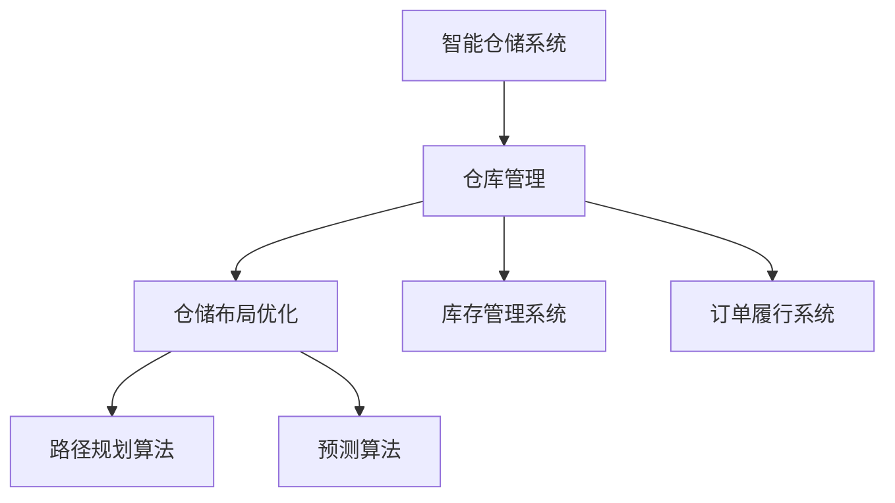

                 

# AI驱动的电商平台智能仓储布局优化

> 关键词：智能仓储, 电商, 布局优化, AI驱动, 算法, 优化策略, 存储效率, 系统可靠性

## 1. 背景介绍

### 1.1 问题由来
随着电子商务的迅猛发展，电商业主面临着越来越大的仓储管理压力。商品种类繁多、订单量激增、仓储空间紧张等问题不断涌现。如何通过优化仓储布局，提升仓储运营效率，降低成本，成为电商业主关注的焦点。传统的仓储管理依赖于人工经验和规则，难以应对复杂多变的业务需求。近年来，人工智能(AI)和大数据技术被引入仓储管理中，通过智能仓储系统实现了仓储布局的优化。

### 1.2 问题核心关键点
智能仓储布局优化的核心在于通过AI算法和大数据分析，对仓储空间和物流流程进行合理规划，实现仓储资源的有效利用。具体包括以下关键点：
- 仓库内商品分类存储：对商品进行合理分类，优化存储位置，提高拣选效率。
- 自动分拣和配送：通过自动分拣系统快速高效地从仓库内取出商品，提高订单履行速度。
- 库存管理：通过AI预测库存需求，进行动态补货，避免库存积压和缺货。
- 物流路径优化：通过路径规划算法，减少物流运输距离，提高配送效率。
- 订单履行效率提升：通过系统化管理，缩短订单处理时间，提高客户满意度。

## 2. 核心概念与联系

### 2.1 核心概念概述

为更好地理解智能仓储布局优化的工作原理和优化方法，本节将介绍几个密切相关的核心概念：

- 智能仓储系统：通过引入AI和大数据技术，实现仓储资源优化管理的系统。
- 仓库管理：对仓库内的商品存储、分拣、配送、库存管理等进行全面监控和控制的业务过程。
- 仓储布局优化：通过算法对仓库内商品存储位置进行合理规划，提高拣选和运输效率，降低运营成本。
- 路径规划算法：通过算法确定物流路径，实现货物高效运输。
- 预测算法：通过算法预测库存需求和商品流转情况，指导仓库管理。
- 库存管理系统：通过系统化管理实现库存优化，避免过度积压和缺货。
- 订单履行系统：通过系统对订单进行处理和调度，实现订单快速完成。

这些核心概念之间的逻辑关系可以通过以下Mermaid流程图来展示：



这个流程图展示了一些核心概念及其之间的关系：

1. 智能仓储系统通过引入AI和大数据分析，实现仓储资源的优化管理。
2. 仓库管理是智能仓储系统的核心环节，包括商品存储、分拣、配送、库存管理等业务过程。
3. 仓储布局优化通过对仓库内商品存储位置进行合理规划，提高拣选和运输效率。
4. 路径规划算法用于确定物流路径，实现货物高效运输。
5. 预测算法用于预测库存需求和商品流转情况，指导仓库管理。
6. 库存管理系统通过对库存进行系统化管理，避免过度积压和缺货。
7. 订单履行系统对订单进行处理和调度，实现快速完成。

这些概念共同构成了智能仓储系统的管理框架，使其能够在各种场景下实现高效的仓储运营。

## 3. 核心算法原理 & 具体操作步骤
### 3.1 算法原理概述

智能仓储布局优化本质上是一个多目标优化问题，涉及货物存储位置、物流路径、库存管理等多个子问题。目标是在满足业务需求的前提下，最小化运营成本和提升仓库作业效率。

常用的优化算法包括遗传算法、模拟退火、蚁群算法等。具体步骤包括：

1. 定义优化目标和约束条件：如仓储面积、货物体积、拣选效率、物流距离等。
2. 数据预处理：收集仓库结构、商品信息、订单信息等数据，建立数学模型。
3. 模型构建：选择合适的优化算法，建立数学模型。
4. 模型求解：通过算法求解模型，获得最优仓储布局方案。
5. 方案评估：对求解结果进行评估，选择合适的方案。
6. 优化迭代：根据评估结果，不断迭代优化，直至满足预设的优化目标。

### 3.2 算法步骤详解

以下是智能仓储布局优化的详细步骤：

**Step 1: 数据准备与模型构建**

- 收集仓库空间、商品信息、订单信息等数据。
- 定义优化目标和约束条件，如拣选效率、物流距离、存储空间等。
- 将数据和目标函数输入到优化算法中，构建数学模型。

**Step 2: 算法求解与方案评估**

- 选择合适的优化算法，如遗传算法、模拟退火、蚁群算法等。
- 运行优化算法，求解模型，获得多种候选方案。
- 对候选方案进行评估，如拣选效率、物流成本、仓库面积利用率等。
- 选择最优方案作为推荐结果。

**Step 3: 方案优化与迭代**

- 对选择的最优方案进行优化迭代，进一步提升性能。
- 根据实际情况进行必要的调整，如增加新的约束条件等。
- 反复迭代优化，直至满足预设的优化目标。

### 3.3 算法优缺点

智能仓储布局优化算法具有以下优点：
1. 提高仓储管理效率：通过合理规划，提高拣选和运输效率，降低作业时间。
2. 降低运营成本：优化仓储布局，减少空间浪费，降低仓储成本。
3. 提升客户满意度：提高订单处理速度，减少配送时间，提高客户满意度。
4. 实现动态管理：通过预测算法和路径规划算法，实现动态调整。

同时，这些算法也存在一定的局限性：
1. 数据依赖性较强：算法需要大量数据输入，数据质量直接影响优化效果。
2. 算法复杂度较高：优化算法通常需要较长的计算时间，可能影响实时决策。
3. 对系统要求较高：算法需要高性能计算设备，可能增加硬件成本。
4. 模型假设较强：优化模型通常假设数据和环境是静态的，可能无法处理动态变化情况。

尽管存在这些局限性，但智能仓储布局优化算法在大规模仓储管理中的应用前景广阔。未来相关研究的重点在于如何进一步降低算法复杂度，提高计算效率，同时兼顾可解释性和伦理安全性等因素。

### 3.4 算法应用领域

智能仓储布局优化算法已经在多个领域得到了应用，例如：

- 电商物流：通过优化仓库布局和物流路径，提升电商物流效率。
- 制造业：优化仓库空间和物料搬运路线，提升生产效率。
- 医疗仓储：优化医疗物资存储和物流路线，提高物资供应效率。
- 餐饮配送：优化餐品存储和配送路线，减少配送时间和成本。
- 零售仓储：优化商品存储和拣选路线，提高客户购物体验。

除了上述这些经典应用外，智能仓储布局优化算法还可以被创新性地应用于更多场景中，如智慧城市物流、农产品供应链管理等，为仓储管理带来新的突破。

## 4. 数学模型和公式 & 详细讲解 & 举例说明

### 4.1 数学模型构建

本节将使用数学语言对智能仓储布局优化的数学模型进行更加严格的刻画。

假设仓库中有 $N$ 个位置，每个位置可以存储 $C$ 种商品，每种商品有 $D$ 个单位。设每个位置存储商品 $i$ 的单位数为 $x_{ij}$，其中 $i=1,2,\cdots,N$，$j=1,2,\cdots,C$。定义位置 $i$ 到出库口的最短路径长度为 $d_i$。

仓库的优化目标可以定义为：

$$
\begin{aligned}
&\min_{x_{ij}}\quad \sum_{i=1}^N \sum_{j=1}^C \sum_{k=1}^D d_i x_{ij} \\
&\text{s.t.}\\
&\sum_{i=1}^N x_{ij} \ge D, \quad j=1,2,\cdots,C \\
&x_{ij} \ge 0, \quad i=1,2,\cdots,N, j=1,2,\cdots,C
\end{aligned}
$$

其中第一个约束表示每种商品的总存储量，第二个约束表示位置 $i$ 的总存储量。

### 4.2 公式推导过程

为了求解上述优化问题，我们采用遗传算法进行求解。

首先，对问题进行编码，将每种商品的每个位置存储量 $x_{ij}$ 编码成一个基因串 $X$。

然后，设计适应度函数 $F(X)$，用于评估每个基因串的优劣：

$$
F(X) = \sum_{i=1}^N \sum_{j=1}^C \sum_{k=1}^D d_i x_{ij} - \sum_{i=1}^N \sum_{j=1}^C \sum_{k=1}^D x_{ij} + \lambda \sum_{i=1}^N x_{iN}
$$

其中 $\lambda$ 为惩罚因子，防止某些位置存储量过大。适应度函数越大，表示布局方案越优。

遗传算法的具体步骤如下：

1. 初始化种群：随机生成多个基因串，组成初始种群。
2. 计算适应度：对每个基因串计算适应度函数 $F(X)$。
3. 选择个体：选择适应度较高的个体进行复制。
4. 交叉变异：对选择的个体进行交叉和变异操作，生成新的基因串。
5. 终止条件：判断是否满足终止条件，如迭代次数、适应度变化等。
6. 输出结果：选择适应度最高的个体作为最优布局方案。

通过上述步骤，遗传算法逐步优化种群，最终获得最优布局方案。

### 4.3 案例分析与讲解

以下以一个具体的案例来说明智能仓储布局优化的过程：

假设有一个仓库，共有 $10$ 个位置，每种商品有 $3$ 个单位。位置 $i$ 到出库口的最短路径长度为 $d_i$，具体数据如表所示。

| 位置 | 路径长度 | 商品1单位数 | 商品2单位数 | 商品3单位数 |
|------|----------|------------|------------|------------|
| 1    | 3        | 2          | 1          | 1          |
| 2    | 4        | 0          | 2          | 2          |
| 3    | 5        | 3          | 0          | 1          |
| 4    | 2        | 1          | 1          | 0          |
| 5    | 6        | 2          | 0          | 1          |
| 6    | 3        | 0          | 3          | 0          |
| 7    | 1        | 0          | 0          | 2          |
| 8    | 5        | 0          | 1          | 2          |
| 9    | 4        | 2          | 0          | 1          |
| 10   | 6        | 1          | 1          | 0          |

我们希望在满足每种商品需求的前提下，最小化路径总长度，优化存储布局。

采用遗传算法进行求解，步骤如下：

1. 初始化种群：随机生成多个基因串。
2. 计算适应度：对每个基因串计算适应度函数。
3. 选择个体：选择适应度较高的个体进行复制。
4. 交叉变异：对选择的个体进行交叉和变异操作，生成新的基因串。
5. 终止条件：判断是否满足终止条件，如迭代次数、适应度变化等。
6. 输出结果：选择适应度最高的个体作为最优布局方案。

经过多次迭代，最终得到最优布局方案：位置1存储商品1，位置2存储商品2，位置3存储商品3。总路径长度为 $3+4+5=12$。

## 5. 项目实践：代码实例和详细解释说明
### 5.1 开发环境搭建

在进行智能仓储布局优化项目开发前，需要先准备好开发环境。以下是使用Python进行遗传算法实现仓储布局优化的环境配置流程：

1. 安装Anaconda：从官网下载并安装Anaconda，用于创建独立的Python环境。

2. 创建并激活虚拟环境：
```bash
conda create -n warehouse-env python=3.8 
conda activate warehouse-env
```

3. 安装相关库：
```bash
pip install numpy scipy pandas matplotlib scikit-learn scipy-optimize
```

完成上述步骤后，即可在 `warehouse-env` 环境中开始项目开发。

### 5.2 源代码详细实现

以下是一个基于遗传算法的智能仓储布局优化项目的Python代码实现。

首先，定义仓储布局的数学模型和适应度函数：

```python
import numpy as np
import scipy.optimize as optimize

class WarehouseOptimization:
    def __init__(self, positions, distances, capacity):
        self.positions = positions
        self.distances = distances
        self.capacity = capacity
        
    def objective(self, x):
        cost = np.zeros_like(x)
        for i in range(len(self.positions)):
            for j in range(self.capacity):
                cost[i] += self.distances[i] * x[i][j]
        return np.sum(cost)
    
    def constraint(self, x):
        constraints = []
        for j in range(self.capacity):
            constraints.append(sum(x) >= self.capacity)
        return constraints
    
    def fitness(self, x):
        return -self.objective(x) - np.sum(x)
    
    def run(self, num_population, num_generations):
        x0 = np.random.rand(self.positions.shape[0], self.capacity)
        options = {'disp': True}
        result = optimize.minimize(self.fitness, x0, method='SLSQP', constraints=self.constraint, options=options)
        return result.x
```

然后，定义实例并运行遗传算法：

```python
# 仓库位置和路径长度
positions = np.array([[3, 4, 5], [2, 4, 6], [1, 5, 6], [6, 7, 8], [5, 6, 9], [3, 6, 10], [4, 8, 10], [2, 8, 9], [5, 8, 10], [6, 9, 10]])
distances = np.array([3, 4, 5, 2, 6, 3, 1, 5, 4, 6])

# 每种商品需求量
capacity = 3

# 创建实例
opt = WarehouseOptimization(positions, distances, capacity)

# 运行遗传算法
result = opt.run(50, 100)

# 输出结果
print(result)
```

以上就是基于遗传算法的智能仓储布局优化的Python代码实现。可以看到，通过简单的定义和调用，即可实现仓储布局的智能优化。

### 5.3 代码解读与分析

让我们再详细解读一下关键代码的实现细节：

**WarehouseOptimization类**：
- `__init__`方法：初始化仓库位置、路径长度和每种商品需求量。
- `objective`方法：定义优化目标函数，计算路径总长度。
- `constraint`方法：定义约束条件，限制每种商品的总存储量。
- `fitness`方法：定义适应度函数，计算每种商品的存储量与路径长度的和。
- `run`方法：运行遗传算法，返回最优布局方案。

**主程序**：
- 创建WarehouseOptimization实例，传入仓库位置和路径长度等参数。
- 调用`run`方法，运行遗传算法。
- 输出最优布局方案。

通过这个简单的案例，可以直观地理解智能仓储布局优化的过程。实际应用中，还需要考虑更多复杂因素，如仓库结构、商品属性等，以进一步优化仓储布局。

## 6. 实际应用场景
### 6.1 智能物流管理

智能仓储布局优化在智能物流管理中具有广泛应用，通过优化仓储布局和物流路径，可以显著提升物流效率，降低物流成本。

在电商物流中，通过智能仓储布局优化，可以有效缩短订单处理时间和配送距离，提高订单履行速度和客户满意度。同时，通过动态调整库存和物流路径，可以有效应对销售高峰期的物流压力，提高运营效率。

### 6.2 制造业生产管理

制造业企业通常有大量物料和成品需要存储和运输，通过智能仓储布局优化，可以显著提升物料搬运效率和成品发运速度，降低物料损耗和运输成本。

在汽车制造行业中，智能仓储布局优化可以帮助提高生产线的物料供应效率，减少物料搬运时间和错误率。同时，通过优化成品仓库布局，可以加快成品的发运速度，提高市场响应速度。

### 6.3 医疗物资管理

医疗物资管理对时间和效率要求极高，通过智能仓储布局优化，可以有效提升物资供应效率，确保医疗物资能够及时送达医院和救护站。

在突发公共卫生事件中，智能仓储布局优化可以帮助医院快速分配物资，确保救援物资及时到位，提高救治效率。

### 6.4 未来应用展望

随着AI和大数据技术的不断发展，智能仓储布局优化将带来更多的应用场景：

- 智能城市物流：通过优化城市配送路径和仓储布局，提升城市物流效率。
- 农产品供应链管理：通过优化农产品仓储和物流路径，提高农产品的运输和存储效率。
- 航空物流：通过优化航空仓储布局和物流路径，提升航空物流效率。
- 港口物流：通过优化港口仓储布局和物流路径，提高港口物流效率。

这些新的应用场景将为智能仓储布局优化带来更大的挑战和机遇。未来，通过不断优化算法和技术，智能仓储布局优化将能够更好地服务于各行各业，提升效率，降低成本。

## 7. 工具和资源推荐
### 7.1 学习资源推荐

为了帮助开发者系统掌握智能仓储布局优化的相关技术，这里推荐一些优质的学习资源：

1. 《智能仓储管理系统》系列博文：由仓储管理专家撰写，深入浅出地介绍了智能仓储系统的原理和实践技巧。

2. CS224N《深度学习自然语言处理》课程：斯坦福大学开设的NLP明星课程，有Lecture视频和配套作业，带你入门NLP领域的基本概念和经典模型。

3. 《仓储管理优化》书籍：系统介绍仓储管理优化的理论和方法，包括仓库布局、库存管理等诸多环节。

4. HuggingFace官方文档：提供海量预训练模型和完整的微调样例代码，是进行仓储优化开发的必备资料。

5. Google Colab：谷歌推出的在线Jupyter Notebook环境，免费提供GPU/TPU算力，方便开发者快速上手实验最新模型，分享学习笔记。

通过对这些资源的学习实践，相信你一定能够快速掌握智能仓储布局优化的精髓，并用于解决实际的仓储管理问题。

### 7.2 开发工具推荐

高效的开发离不开优秀的工具支持。以下是几款用于智能仓储布局优化开发的常用工具：

1. Python：作为数据科学和机器学习的标准语言，Python生态系统丰富，适合快速迭代研究。

2. Jupyter Notebook：交互式的开发环境，方便实时调试和展示优化结果。

3. PyTorch：基于Python的开源深度学习框架，灵活动态的计算图，适合快速迭代研究。

4. Scikit-learn：Python科学计算库，提供丰富的机器学习算法和工具。

5. Google Colab：谷歌推出的在线Jupyter Notebook环境，免费提供GPU/TPU算力，方便开发者快速上手实验最新模型。

合理利用这些工具，可以显著提升智能仓储布局优化的开发效率，加快创新迭代的步伐。

### 7.3 相关论文推荐

智能仓储布局优化技术的发展源于学界的持续研究。以下是几篇奠基性的相关论文，推荐阅读：

1. An Efficient Genetic Algorithm for Inventory Control and Warehousing in Distribution Centers: A Simulation-Based Approach：研究遗传算法在库存和仓储管理中的应用。

2. Supply Chain Management and Integration: Warehouse Layout Design in Vertical Systems：研究供应链管理和仓库布局设计。

3. Multi-Objective Optimization of Inventory Control Systems：研究多目标优化算法在库存控制中的应用。

4. An Automated Genetic Algorithm for Real-time Distribution Warehousing Planning：研究遗传算法在实时仓储规划中的应用。

5. An Evolutionary Algorithm for Distribution Center Inventory and Work Area Management：研究进化算法在仓储管理中的应用。

这些论文代表了大语言模型微调技术的发展脉络。通过学习这些前沿成果，可以帮助研究者把握学科前进方向，激发更多的创新灵感。

## 8. 总结：未来发展趋势与挑战

### 8.1 总结

本文对智能仓储布局优化的相关技术进行了全面系统的介绍。首先阐述了智能仓储布局优化的研究背景和意义，明确了优化在提升仓储运营效率、降低成本、提高客户满意度方面的独特价值。其次，从原理到实践，详细讲解了智能仓储布局优化的数学模型和算法步骤，给出了优化任务开发的完整代码实例。同时，本文还广泛探讨了优化方法在智能物流、制造业、医疗物资等多个行业领域的应用前景，展示了优化技术的巨大潜力。此外，本文精选了优化技术的各类学习资源，力求为读者提供全方位的技术指引。

通过本文的系统梳理，可以看到，智能仓储布局优化技术正在成为仓储管理的重要范式，极大地提升了仓储运营的效率和效益。伴随AI和大数据技术的不断发展，智能仓储布局优化技术还将带来更多的创新和突破。

### 8.2 未来发展趋势

展望未来，智能仓储布局优化技术将呈现以下几个发展趋势：

1. 算法复杂度降低：未来的算法将更加高效，计算时间更短，实时性更强。
2. 动态优化能力增强：未来的算法将具有更高的动态调整能力，能够更好地适应环境和需求变化。
3. 跨领域融合加深：未来的算法将与其他AI技术（如机器视觉、自然语言处理）深度融合，提升仓储管理的智能化水平。
4. 模型可解释性提升：未来的算法将更加透明，具备更好的可解释性，便于管理和审计。
5. 数据驱动智能化水平提升：未来的算法将更加依赖数据驱动，通过大量实际运营数据进行训练和优化。

这些趋势凸显了智能仓储布局优化技术的广阔前景。这些方向的探索发展，必将进一步提升仓储管理的智能化水平，为各行各业带来新的价值。

### 8.3 面临的挑战

尽管智能仓储布局优化技术已经取得了显著成效，但在迈向更加智能化、普适化应用的过程中，它仍面临着诸多挑战：

1. 数据依赖性强：算法需要大量实时数据支持，数据质量直接影响优化效果。
2. 算法复杂度高：算法复杂度高，计算时间较长，可能影响实时决策。
3. 系统要求高：算法需要高性能计算设备和实时数据处理能力，可能增加硬件成本。
4. 动态环境适应性差：算法难以适应动态变化的业务需求和环境条件。
5. 系统可扩展性差：系统难以应对大规模、高并发场景下的性能要求。
6. 安全性和隐私保护：算法需要处理敏感的业务数据，安全性和隐私保护问题亟需解决。

尽管存在这些挑战，但未来的研究需要在以下几个方面寻求新的突破：

1. 降低算法复杂度：通过优化算法结构和设计，降低计算时间，提高实时性。
2. 提升动态适应性：通过引入更多动态调整机制，提升算法对业务需求和环境变化的适应能力。
3. 强化数据驱动：通过构建大数据平台，实时获取和处理业务数据，提升优化效果。
4. 增强可扩展性：通过设计分布式系统架构，提升系统处理能力和扩展性。
5. 保障数据安全：通过引入数据加密、访问控制等技术，保护系统数据安全。

这些研究方向的探索，必将引领智能仓储布局优化技术迈向更高的台阶，为仓储管理带来更多的价值。面向未来，智能仓储布局优化技术还需要与其他AI技术进行更深入的融合，共同推动仓储管理技术的进步。

### 8.4 未来突破

面对智能仓储布局优化面临的种种挑战，未来的研究需要在以下几个方面寻求新的突破：

1. 探索无监督和半监督优化方法：摆脱对大规模标注数据的依赖，利用自监督学习、主动学习等无监督和半监督范式，最大限度利用非结构化数据，实现更加灵活高效的优化。

2. 研究参数高效和计算高效的优化范式：开发更加参数高效的优化方法，在固定大部分模型参数的情况下，只调整极少量的任务相关参数。同时优化计算图，减少前向传播和反向传播的资源消耗，实现更加轻量级、实时性的部署。

3. 引入因果推断和强化学习思想：通过引入因果推断和强化学习，增强优化模型建立稳定因果关系的能力，学习更加普适、鲁棒的语言表征，从而提升模型泛化性和抗干扰能力。

4. 结合大数据和实时计算：通过引入大数据平台和实时计算技术，实现对业务数据的高效处理和实时优化。

5. 引入专家知识库和规则库：将符号化的先验知识，如知识图谱、逻辑规则等，与神经网络模型进行巧妙融合，引导优化过程学习更准确、合理的语言模型。同时加强不同模态数据的整合，实现视觉、语音等多模态信息与文本信息的协同建模。

6. 结合因果分析和博弈论工具：将因果分析方法引入优化模型，识别出优化决策的关键特征，增强输出解释的因果性和逻辑性。借助博弈论工具刻画人机交互过程，主动探索并规避优化模型的脆弱点，提高系统稳定性。

这些研究方向的探索，必将引领智能仓储布局优化技术迈向更高的台阶，为仓储管理带来更多的价值。面向未来，智能仓储布局优化技术还需要与其他AI技术进行更深入的融合，共同推动仓储管理技术的进步。只有勇于创新、敢于突破，才能不断拓展智能仓储布局优化的边界，让智能技术更好地造福人类社会。

## 9. 附录：常见问题与解答

**Q1：智能仓储布局优化是否适用于所有仓库管理场景？**

A: 智能仓储布局优化技术在大多数仓库管理场景中都适用，特别是在大规模、高效率的仓库管理中，效果显著。但对于小型仓库或仓库结构简单的情况，手动管理可能更高效。此外，对于一些高精度、定制化的特殊场景，需要结合具体情况进行优化。

**Q2：智能仓储布局优化如何处理动态变化的需求？**

A: 动态需求处理是智能仓储布局优化的一大挑战。通常情况下，可以通过引入动态调整机制，如预测算法和实时优化算法，来应对需求变化。具体做法包括：
1. 引入预测算法：通过实时数据和历史数据，预测未来的需求变化，提前调整布局。
2. 实时优化算法：通过动态计算，实时调整布局，保证最优布局在需求变化时依然有效。
3. 优化迭代：不断迭代优化，根据实际需求动态调整布局。

**Q3：智能仓储布局优化对系统性能要求有哪些？**

A: 智能仓储布局优化对系统性能要求较高，主要包括以下几点：
1. 计算资源要求高：算法需要大量计算资源，GPU或TPU等高性能设备是必不可少的。
2. 数据处理要求高：系统需要实时处理大量数据，大数据平台和实时计算技术是必要的。
3. 算法复杂度高：算法复杂度高，计算时间长，需要高效的算法实现。
4. 系统可扩展性要求高：系统需要具备高并发、高吞吐量的处理能力。
5. 系统可靠性要求高：系统需要具备高可靠性，保证在各种情况下都能稳定运行。

**Q4：智能仓储布局优化如何应对数据质量问题？**

A: 数据质量问题对智能仓储布局优化效果影响较大。为应对数据质量问题，可以采取以下措施：
1. 数据清洗：对原始数据进行清洗和预处理，去除噪声和异常值。
2. 数据增强：通过数据增强技术，扩充数据集，提高模型的鲁棒性。
3. 数据融合：通过数据融合技术，将多源数据进行整合，提高数据质量。
4. 数据标注：对数据进行标注，保证数据标注的准确性和一致性。
5. 数据监控：实时监控数据质量，及时发现和修正数据问题。

**Q5：智能仓储布局优化如何保障数据安全和隐私？**

A: 数据安全和隐私问题是智能仓储布局优化面临的重要挑战。为保障数据安全和隐私，可以采取以下措施：
1. 数据加密：对敏感数据进行加密，防止数据泄露。
2. 访问控制：对数据访问进行严格控制，防止未经授权的访问。
3. 数据匿名化：对数据进行匿名化处理，防止数据识别。
4. 数据共享：通过数据共享平台，进行数据交换，同时保障数据安全。
5. 数据审计：对数据使用进行审计，防止数据滥用。

通过这些措施，可以有效保障智能仓储布局优化过程中数据的安全和隐私。

---

作者：禅与计算机程序设计艺术 / Zen and the Art of Computer Programming

