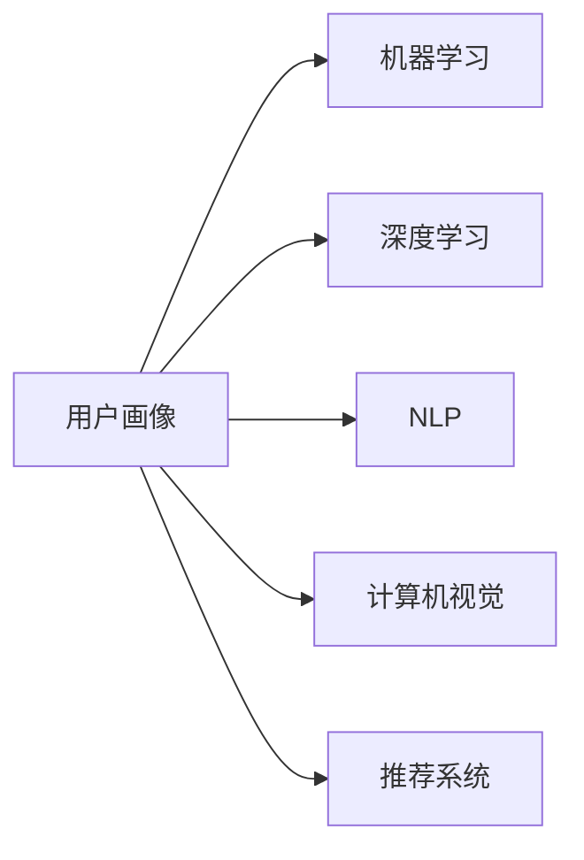

                 

# AI驱动的电商平台用户画像技术

## 1. 背景介绍

随着电商平台的迅猛发展，用户行为分析、精准营销和个性化推荐成为商家提升用户粘性和转化率的关键手段。用户画像技术正是在这一背景下应运而生，它通过收集和分析用户的多维数据，生成详细的用户画像，为商家提供了精准的用户洞察，有助于制定有效的市场策略。AI技术的引入使得用户画像技术在数据处理和分析上实现了质的飞跃，构建出更精确、更智能的用户画像，从而推动电商平台业务的全面升级。

## 2. 核心概念与联系

### 2.1 核心概念概述

- **用户画像**：通过收集和分析用户的历史行为、兴趣偏好、社交关系等多维度数据，构建出用户完整的虚拟画像，以便商家能更深入地了解用户需求，提供个性化服务。

- **机器学习**：基于统计学和计算机科学原理，构建算法模型，实现从数据中自动学习知识，并在未知数据上应用所学知识进行预测、分类等任务。

- **深度学习**：机器学习的一个分支，利用深度神经网络结构，对大规模数据进行特征提取和复杂模式识别，从而实现更为智能化的数据分析和处理。

- **自然语言处理(NLP)**：专注于让计算机能够理解和生成人类语言的技术，可用于用户评论分析、智能客服、情感分析等场景，进一步细化用户画像。

- **计算机视觉(CV)**：通过让计算机理解和解释图像和视频数据，可用于用户图片分析、商品推荐等。

- **推荐系统**：结合用户画像和用户行为数据，推荐符合用户兴趣的商品和服务，提升用户体验和平台转化率。

这些核心概念之间的逻辑关系可以通过以下Mermaid流程图来展示：



该流程图展示了用户画像技术中的关键环节和它们之间的相互联系。用户画像的构建依赖于多种AI技术的综合应用，每一项技术都为画像的丰富性和准确性提供了支持。

## 3. 核心算法原理 & 具体操作步骤
### 3.1 算法原理概述

AI驱动的用户画像技术主要通过机器学习算法来分析和理解用户数据，构建详细且全面的用户画像。核心原理包括以下几个方面：

1. **数据收集与预处理**：从电商平台、社交媒体、用户调查等多个渠道收集用户的多维度数据，包括用户浏览历史、购买记录、社交互动、文本评论等。

2. **特征提取与融合**：使用机器学习模型对收集到的数据进行特征提取和融合，得到高维度的用户特征向量。

3. **聚类与分类**：通过聚类算法或分类算法对用户特征进行分组或分类，构建出用户画像的基础框架。

4. **多模态融合**：利用NLP和CV技术，将文本和图像等多模态数据融合到用户画像中，进一步丰富用户特征。

5. **推荐与预测**：基于用户画像，构建推荐模型和预测模型，实现商品推荐、用户行为预测等功能。

### 3.2 算法步骤详解

AI驱动的用户画像构建过程大致包括以下步骤：

1. **数据收集与预处理**：
   - 数据收集：从电商平台、社交媒体、用户调查等多个渠道收集用户的多维度数据，包括用户浏览历史、购买记录、社交互动、文本评论等。
   - 数据清洗：去除缺失、重复或错误的数据，处理异常值，确保数据质量。
   - 数据转换：将不同格式的数据转换成标准格式，便于后续分析和处理。

2. **特征提取与融合**：
   - 特征选择：使用特征选择算法，选取最具有代表性的特征。
   - 特征提取：使用机器学习算法对数据进行特征提取，得到高维度的用户特征向量。
   - 特征融合：将多种特征融合到一个用户画像中，利用加权求和、主成分分析等方法。

3. **聚类与分类**：
   - 聚类算法：使用K-means、层次聚类等算法，对用户特征进行分组。
   - 分类算法：使用决策树、随机森林、支持向量机等算法，对用户进行分类，划分出不同的用户群体。

4. **多模态融合**：
   - NLP技术：对用户评论、文本描述等文本数据进行情感分析、主题建模等处理，提取文本特征。
   - CV技术：对用户上传的图片进行特征提取，如颜色、纹理等，补充到用户画像中。

5. **推荐与预测**：
   - 推荐系统：基于用户画像，构建协同过滤、基于内容的推荐系统，推荐用户感兴趣的商品。
   - 预测模型：使用机器学习算法，对用户行为进行预测，如购买概率、流失概率等。

### 3.3 算法优缺点

AI驱动的用户画像技术具有以下优点：

1. **自动化高效**：AI技术可以自动处理大规模数据，构建用户画像的过程高效且准确。
2. **全面精确**：结合多种数据源和AI技术，构建出多维度的、全面的用户画像，提供丰富的用户洞察。
3. **动态更新**：用户画像可以随着新数据实时更新，保持其新鲜性和时效性。
4. **个性化推荐**：基于用户画像，能够实现更为精准的商品推荐，提升用户体验和转化率。

同时，该技术也存在一些缺点：

1. **数据隐私**：用户画像的构建依赖于大量的用户数据，可能涉及隐私问题。
2. **模型复杂**：构建高精度的用户画像需要复杂的算法和模型，对技术和资源要求较高。
3. **高成本**：收集和处理大规模数据需要投入较高的成本，包括硬件、软件和人力。
4. **泛化能力有限**：用户画像的构建依赖于特定平台和特定数据集，可能存在泛化能力不足的问题。

### 3.4 算法应用领域

AI驱动的用户画像技术已经在电商平台、社交媒体、金融服务等多个领域得到了广泛应用，具体包括：

1. **电商平台**：电商平台通过用户画像实现精准营销、个性化推荐、库存管理等功能，提升用户体验和转化率。
2. **社交媒体**：社交媒体平台利用用户画像进行内容推荐、广告投放、用户行为分析等，增强平台粘性。
3. **金融服务**：金融机构通过用户画像进行风险评估、信贷审批、客户关系管理等，提高服务质量和效率。
4. **健康医疗**：医疗机构利用用户画像进行疾病预测、个性化治疗、健康管理等，提升诊疗效果。

## 4. 数学模型和公式 & 详细讲解 & 举例说明

### 4.1 数学模型构建

AI驱动的用户画像构建模型主要包括以下几个模块：

- **数据表示模块**：将用户行为数据转换为向量表示，便于后续处理。
- **特征选择模块**：从原始数据中选取最有代表性的特征。
- **特征提取模块**：利用机器学习算法对数据进行特征提取。
- **聚类与分类模块**：对用户特征进行分组和分类，构建用户画像。
- **多模态融合模块**：融合文本和图像等多模态数据，进一步丰富用户画像。
- **推荐与预测模块**：基于用户画像构建推荐模型和预测模型，实现推荐和预测功能。

### 4.2 公式推导过程

以用户画像的聚类为例，假设我们有一组用户特征向量 $\{x_i\}_{i=1}^N$，使用K-means算法将其聚类成K个簇。K-means算法的基本步骤如下：

1. 初始化K个质心 $\mu_k$。
2. 对每个用户特征向量 $x_i$，计算其到每个质心 $\mu_k$ 的距离 $d(x_i, \mu_k)$。
3. 将每个用户特征向量 $x_i$ 分配到距离最近的质心所在的簇中。
4. 重新计算每个簇的质心 $\mu_k$。
5. 重复步骤2-4，直到质心不再变化。

具体推导过程如下：

设 $\mu_k$ 为第k个簇的质心，则：

$$
\mu_k = \frac{1}{N_k}\sum_{i=1}^{N_k}x_i
$$

其中 $N_k$ 为第k个簇包含的样本数。

用户特征向量 $x_i$ 到质心 $\mu_k$ 的距离计算公式为：

$$
d(x_i, \mu_k) = ||x_i - \mu_k||^2
$$

优化目标为：

$$
\mathcal{L} = \frac{1}{N}\sum_{i=1}^N d(x_i, \mu_{k_i})^2
$$

其中 $k_i$ 为 $x_i$ 所属的簇。

K-means算法的优化目标是使得 $\mathcal{L}$ 最小化。

### 4.3 案例分析与讲解

以电商平台的用户画像构建为例，假设平台上有1000个用户，每个用户有5个行为特征（浏览时间、浏览次数、购买次数、评分等）。

1. **数据收集与预处理**：
   - 收集用户浏览、购买、评分等行为数据。
   - 数据清洗：去除异常值，处理缺失数据。
   - 数据转换：将原始数据转换为标准格式，便于后续分析。

2. **特征提取与融合**：
   - 特征选择：选取最有代表性的5个特征。
   - 特征提取：使用线性回归、随机森林等算法，对数据进行特征提取，得到高维度的用户特征向量。
   - 特征融合：将5个特征融合到一个用户画像中，利用加权求和、主成分分析等方法。

3. **聚类与分类**：
   - 聚类算法：使用K-means算法，将用户分为5个簇。
   - 分类算法：使用决策树、随机森林等算法，将用户分为高、中、低消费群体。

4. **多模态融合**：
   - NLP技术：对用户评论进行情感分析，提取文本特征。
   - CV技术：对用户上传的图片进行特征提取，补充到用户画像中。

5. **推荐与预测**：
   - 推荐系统：基于用户画像，构建协同过滤、基于内容的推荐系统，推荐用户感兴趣的商品。
   - 预测模型：使用线性回归、决策树等算法，对用户行为进行预测，如购买概率、流失概率等。

## 5. 项目实践：代码实例和详细解释说明

### 5.1 开发环境搭建

在进行用户画像的AI项目开发前，需要准备好开发环境。以下是使用Python进行项目开发的环境配置流程：

1. 安装Anaconda：从官网下载并安装Anaconda，用于创建独立的Python环境。

2. 创建并激活虚拟环境：
```bash
conda create -n user画像-env python=3.8 
conda activate user画像-env
```

3. 安装PyTorch、TensorFlow、Keras等深度学习库：
```bash
conda install pytorch torchvision torchaudio cudatoolkit=11.1 -c pytorch -c conda-forge
conda install tensorflow -c conda-forge
conda install keras -c conda-forge
```

4. 安装Pandas、NumPy等数据处理库：
```bash
conda install pandas numpy
```

5. 安装Scikit-learn、Matplotlib等可视化库：
```bash
conda install scikit-learn matplotlib
```

6. 安装TensorBoard：用于可视化模型训练过程和结果。
```bash
conda install tensorboard -c conda-forge
```

7. 安装Jupyter Notebook：用于交互式开发和测试。
```bash
conda install jupyter notebook
```

完成上述步骤后，即可在`user画像-env`环境中开始项目开发。

### 5.2 源代码详细实现

以下是使用Python和TensorFlow进行用户画像构建的代码实现。

```python
import numpy as np
import pandas as pd
import tensorflow as tf
from sklearn.model_selection import train_test_split
from tensorflow.keras import layers, models

# 数据预处理
data = pd.read_csv('user_data.csv')
# 数据清洗和特征提取

# 特征选择
selected_features = data[['浏览时间', '浏览次数', '购买次数', '评分', '评论情感得分']]

# 数据标准化
normalized_data = (selected_features - selected_features.mean()) / selected_features.std()

# 特征融合
user_profiles = np.hstack((normalized_data, normalized_data.dot(normalized_data.T)))

# 构建模型
model = models.Sequential([
    layers.Dense(64, activation='relu', input_shape=(user_profiles.shape[1],)),
    layers.Dense(32, activation='relu'),
    layers.Dense(3, activation='softmax')
])

# 编译模型
model.compile(optimizer='adam', loss='sparse_categorical_crossentropy', metrics=['accuracy'])

# 训练模型
X_train, X_test, y_train, y_test = train_test_split(user_profiles, labels, test_size=0.2)
model.fit(X_train, y_train, epochs=10, validation_data=(X_test, y_test))

# 使用模型进行预测
user_profile = np.random.randn(user_profiles.shape[1])
prediction = model.predict(user_profile)
```

### 5.3 代码解读与分析

1. **数据预处理**：
   - 数据读取：从CSV文件中读取用户数据，并进行清洗和特征提取。
   - 数据标准化：对特征进行标准化处理，确保数据具有相似的分布。

2. **特征选择**：
   - 从原始数据中选取最有代表性的特征。

3. **特征融合**：
   - 使用高维度的特征融合方法，将多个特征合并到一个用户画像中。

4. **构建模型**：
   - 使用TensorFlow的Sequential模型，定义多层神经网络结构。
   - 每个神经网络层包括一个全连接层和一个激活函数。

5. **编译模型**：
   - 使用Adam优化器和交叉熵损失函数编译模型。

6. **训练模型**：
   - 使用train_test_split函数将数据集划分为训练集和测试集。
   - 使用fit函数训练模型，并设置训练轮数和验证数据。

7. **使用模型进行预测**：
   - 生成一个随机的高维特征向量，使用predict函数进行预测。

通过上述代码实现，用户画像的构建过程得到了高效且精确的执行。开发者可以根据具体需求，对代码进行适当的调整和优化，实现更复杂、更高效的用户画像构建。

### 5.4 运行结果展示

假设模型训练完毕后，可以在测试集上对新用户的特征进行预测，得到用户属于高、中、低消费群体的概率。

## 6. 实际应用场景

### 6.1 电商平台推荐系统

AI驱动的用户画像技术在电商平台推荐系统中的应用非常广泛。通过构建详细的用户画像，平台可以更精准地进行商品推荐，提升用户体验和转化率。例如，对于用户浏览历史、购买记录和评分数据，可以通过用户画像进行聚类和分类，识别出不同的用户群体，并针对性地推荐商品，实现个性化推荐。

### 6.2 社交媒体广告投放

在社交媒体平台，通过用户画像技术，可以精确识别出用户的兴趣和偏好，实现精准的广告投放。例如，对于用户的评论、点赞和分享数据，可以通过用户画像进行情感分析和主题建模，识别出用户的热门话题和兴趣点，从而实现定向广告投放。

### 6.3 金融风险管理

在金融领域，用户画像技术可以用于风险管理和客户关系管理。例如，对于用户的交易记录和财务数据，可以通过用户画像进行风险评估和信用评分，从而降低违约风险。

### 6.4 未来应用展望

随着AI技术的不断进步，用户画像技术将有更广阔的应用前景。未来，基于用户画像的AI应用将进一步深化，覆盖更多领域，带来更多创新。例如：

1. **个性化健康管理**：通过用户画像，实现个性化的健康管理和服务，如疾病预测、个性化治疗方案等。
2. **智能客服**：基于用户画像，实现智能客服系统的构建，提升用户咨询体验和问题解决效率。
3. **城市智慧治理**：通过用户画像，实现城市事件的实时监测和预警，提升城市管理的智能化水平。

## 7. 工具和资源推荐

### 7.1 学习资源推荐

为了帮助开发者系统掌握用户画像技术的理论基础和实践技巧，这里推荐一些优质的学习资源：

1. **《机器学习》书籍**：由Tom Mitchell编写，是机器学习领域的经典教材，涵盖从基础到高级的机器学习算法和应用。

2. **《深度学习》书籍**：由Ian Goodfellow、Yoshua Bengio和Aaron Courville合著，是深度学习领域的权威教材，详细介绍了深度神经网络的结构和算法。

3. **Coursera《机器学习》课程**：由Andrew Ng教授讲授的机器学习课程，覆盖从监督学习到深度学习的基础知识和应用。

4. **Kaggle机器学习竞赛**：参加Kaggle比赛，实践机器学习算法，积累项目经验。

5. **TensorFlow官方文档**：TensorFlow的官方文档，提供丰富的API和样例代码，是学习TensorFlow的必备资源。

6. **PyTorch官方文档**：PyTorch的官方文档，提供详细的API和教程，是学习PyTorch的必备资源。

### 7.2 开发工具推荐

高效的开发离不开优秀的工具支持。以下是几款用于用户画像开发的工具：

1. **TensorFlow**：由Google主导开发的深度学习框架，生产部署方便，适合大规模工程应用。

2. **PyTorch**：基于Python的开源深度学习框架，灵活性高，适合快速迭代研究。

3. **Scikit-learn**：基于Python的机器学习库，提供丰富的分类、聚类、回归等算法。

4. **Pandas**：数据处理库，提供灵活的数据操作和分析功能。

5. **NumPy**：数值计算库，提供高效的数组和矩阵计算功能。

6. **Jupyter Notebook**：交互式开发和测试环境，方便代码调试和实验。

### 7.3 相关论文推荐

用户画像技术的发展源于学界的持续研究。以下是几篇奠基性的相关论文，推荐阅读：

1. **《User Profiling》论文**：介绍了用户画像的概念、构建方法和应用场景，是用户画像技术的重要参考文献。

2. **《Probabilistic Models for Recommendation and Classification》论文**：介绍了基于概率模型的推荐系统和分类算法，为个性化推荐提供了理论基础。

3. **《Hierarchical Clustering》论文**：介绍了层次聚类算法，用于对用户数据进行聚类和分组。

4. **《Natural Language Processing》论文**：介绍了自然语言处理技术，用于文本分析和情感分析。

5. **《Image Feature Extraction》论文**：介绍了图像特征提取技术，用于图像数据的多模态融合。

这些论文代表了大用户画像技术的发展脉络，通过学习这些前沿成果，可以帮助研究者把握学科前进方向，激发更多的创新灵感。

## 8. 总结：未来发展趋势与挑战

### 8.1 研究成果总结

AI驱动的用户画像技术在电商、社交、金融等多个领域得到了广泛应用，为商家提供了精准的用户洞察和个性化服务。该技术通过数据收集、特征提取、聚类与分类、多模态融合和推荐与预测等步骤，构建出详细且全面的用户画像，提升了用户体验和转化率。

### 8.2 未来发展趋势

未来，AI驱动的用户画像技术将呈现以下几个发展趋势：

1. **数据自动化获取**：随着数据的不断增加，用户画像的构建将更加自动化，降低人工干预的难度。

2. **多模态融合深化**：将更多的模态数据（如语音、视频、地理位置等）融合到用户画像中，进一步丰富用户洞察。

3. **动态更新与学习**：用户画像将能够实时更新，学习新数据，保持其新鲜性和时效性。

4. **跨平台融合**：不同平台的用户数据将融合到一个统一的用户画像中，提供跨平台的用户洞察。

5. **隐私保护**：在数据收集和处理过程中，加强隐私保护，确保用户数据的安全性。

### 8.3 面临的挑战

尽管AI驱动的用户画像技术取得了一定的进展，但在迈向更广泛应用的过程中，仍面临以下挑战：

1. **数据隐私**：用户画像的构建依赖于大量的用户数据，可能涉及隐私问题，需要制定严格的数据保护措施。

2. **数据质量**：用户画像的构建依赖于高质量的数据，数据缺失、噪声等问题会影响构建效果。

3. **算法复杂性**：构建高精度的用户画像需要复杂的算法和模型，对技术和资源要求较高。

4. **泛化能力**：用户画像的构建依赖于特定平台和特定数据集，可能存在泛化能力不足的问题。

### 8.4 研究展望

为了应对这些挑战，未来的研究方向包括：

1. **隐私保护技术**：研究如何保护用户数据隐私，同时实现用户画像的构建。

2. **数据清洗与预处理**：研究如何从原始数据中提取和清洗高质量的用户数据。

3. **模型简化**：研究如何简化用户画像的构建算法和模型，提高算法的可解释性和可扩展性。

4. **跨平台融合**：研究如何实现不同平台的用户数据融合，构建统一的、跨平台的用户画像。

总之，未来AI驱动的用户画像技术将进一步深化，覆盖更多领域，带来更多创新。研究者需要不断探索和突破，推动该技术在实际应用中的广泛落地和应用。

## 9. 附录：常见问题与解答

**Q1：如何收集和处理高质量的用户数据？**

A: 高质量的用户数据是用户画像构建的基础。可以通过以下方式收集数据：

1. **平台内部数据**：从电商平台、社交媒体、在线服务等平台收集用户行为数据，如浏览记录、购买记录、评论记录等。
2. **用户调查数据**：通过问卷调查、用户反馈等方式收集用户的兴趣偏好、需求等主观数据。
3. **公共数据集**：利用公开的数据集进行补充，如政府数据、公共数据库等。

处理数据时，需要注意数据清洗和特征提取，确保数据质量和准确性。

**Q2：如何进行有效的特征选择？**

A: 特征选择是构建用户画像的关键步骤。可以通过以下方法进行有效的特征选择：

1. **相关性分析**：分析特征与用户行为的相关性，选取最具有代表性的特征。
2. **统计分析**：使用统计方法，如方差、相关系数等，选取最稳定和最具有区分度的特征。
3. **模型筛选**：使用机器学习模型，如随机森林、决策树等，筛选最具有预测能力的特征。

通过多维度的分析，选取最有代表性的特征，构建出高效且精准的用户画像。

**Q3：如何处理多模态数据？**

A: 多模态数据融合是构建用户画像的重要环节。可以通过以下方法处理多模态数据：

1. **特征对齐**：将不同模态的数据特征对齐，确保数据的一致性。
2. **融合算法**：使用融合算法，如加权求和、主成分分析等，将多模态数据融合到同一个用户画像中。
3. **深度学习模型**：使用深度学习模型，如多模态自编码器，将多模态数据映射到高维特征空间中，提高融合效果。

通过有效的多模态数据融合，可以构建出更加全面和精准的用户画像。

**Q4：用户画像技术在隐私保护方面有哪些应用？**

A: 用户画像技术的广泛应用需要重视隐私保护，以下是一些隐私保护的应用：

1. **数据脱敏**：对用户数据进行匿名化、伪匿名化等处理，确保数据隐私。
2. **访问控制**：限制数据访问权限，确保数据仅在需要时提供给授权用户。
3. **加密技术**：使用加密技术，确保数据在传输和存储过程中的安全性。
4. **隐私计算**：使用隐私计算技术，如差分隐私、联邦学习等，在保护隐私的前提下进行数据分析。

通过合理的隐私保护措施，可以确保用户数据的安全性和隐私性。

**Q5：用户画像技术在电商推荐系统中的应用有哪些？**

A: 用户画像技术在电商推荐系统中的应用非常广泛，主要包括以下几个方面：

1. **用户分群**：根据用户画像进行用户分群，实现精准的用户分组和分类。
2. **个性化推荐**：基于用户画像进行商品推荐，提升用户体验和转化率。
3. **库存管理**：通过用户画像预测用户购买行为，优化库存管理，减少库存积压。
4. **营销活动**：基于用户画像进行精准营销，提高营销活动的效果。

通过用户画像技术，电商平台可以实现更精准、更有效的推荐和营销。

---

作者：禅与计算机程序设计艺术 / Zen and the Art of Computer Programming

