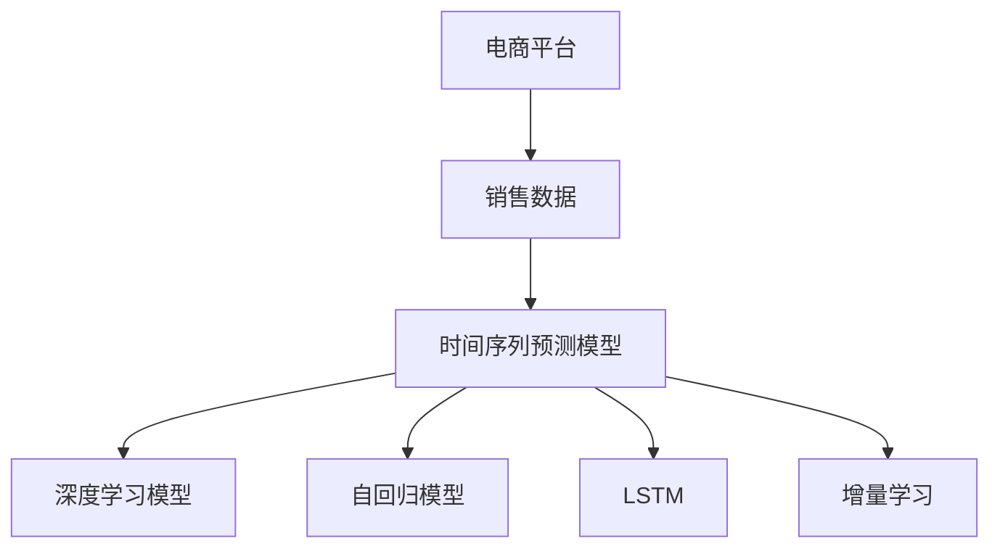

                 

# AI驱动的电商平台销售预测模型

> 关键词：电商平台, 销售预测, 机器学习, 深度学习, 时间序列, 特征工程, 预测模型

## 1. 背景介绍

### 1.1 问题由来

在现代电商行业，销售预测是优化库存、控制成本、提升销售业绩的重要工具。准确地预测未来的销售数据，可以帮助企业合理规划库存，避免缺货或过剩，及时调整营销策略，从而在激烈的市场竞争中占据优势。然而，传统的手动预测方式存在数据孤立、计算量大、易受主观因素影响等缺陷，已无法满足快速变化的市场需求。

为了提升销售预测的准确性和效率，越来越多的电商平台开始采用机器学习和深度学习技术进行自动化预测。其中，时间序列预测模型因其对历史数据的依赖性和逻辑清晰性，成为电商销售预测的首选工具。本文将详细介绍基于深度学习的时间序列预测模型，并讨论其在电商平台销售预测中的应用。

## 2. 核心概念与联系

### 2.1 核心概念概述

为更好地理解时间序列预测模型，我们需引入以下关键概念：

- **时间序列预测模型**：通过对历史时间数据进行建模和分析，预测未来时间点的值。典型算法包括ARIMA、LSTM、GRU等。
- **深度学习**：通过多层神经网络进行复杂数据特征的提取和建模，尤其适用于序列数据的预测。
- **自回归模型**：根据过去的时间点值，线性预测未来的值。代表性算法包括ARIMA、Prophet等。
- **长短期记忆网络（LSTM）**：一种特殊的递归神经网络（RNN），能记住长时间的历史信息，适用于长时间序列预测。
- **增量学习**：动态更新模型参数，适应新数据的变化，防止模型退化。

这些概念之间的逻辑关系可以通过以下Mermaid流程图来展示：



这个流程图展示了电商平台销售数据流向时间序列预测模型，模型选择深度学习模型LSTM，并在此基础上进行增量学习以适应数据变化。

## 3. 核心算法原理 & 具体操作步骤

### 3.1 算法原理概述

时间序列预测模型通过历史数据来预测未来值，其核心思想是对时间序列数据的特征进行建模。假设时间序列数据为 $\{x_t\}_{t=1}^N$，其中 $x_t$ 为第 $t$ 时间点的值，预测目标为 $x_{t+1}$，预测模型 $\hat{x}_{t+1}$ 可由下式给出：

$$
\hat{x}_{t+1} = f(x_1, x_2, \dots, x_t, \theta)
$$

其中，$\theta$ 为模型参数。在深度学习框架下，通常使用多层神经网络进行建模。对于电商平台销售预测，我们主要关注两个问题：

- 如何选取合适的模型结构，以适应不同时间段销售数据的特征变化。
- 如何利用电商平台的业务数据，结合深度学习技术，提升预测准确性。

### 3.2 算法步骤详解

基于深度学习的时间序列预测模型的构建和训练通常分为以下几个步骤：

**Step 1: 数据预处理**
- 收集历史销售数据，包括日期、销售额、促销活动等属性。
- 对缺失值、异常值进行补全或剔除，保证数据质量。
- 数据归一化，将销售数据按比例缩放到 $[0, 1]$ 或 $[-1, 1]$ 之间。

**Step 2: 特征工程**
- 引入日期特征，如年、月、日、周几、小时等。
- 构建业务特征，如促销活动、季节性变化、节假日等。
- 计算滑动平均值、移动窗口平均等统计特征。

**Step 3: 模型选择与训练**
- 选取合适的深度学习模型，如LSTM、GRU等。
- 设计适当的损失函数，如均方误差（MSE）、交叉熵（CE）等。
- 使用历史数据进行模型训练，设定合适的超参数。

**Step 4: 模型评估与调优**
- 在验证集上评估模型性能，使用MAE（平均绝对误差）、RMSE（均方根误差）等指标。
- 根据评估结果调整模型结构或超参数，进行模型调优。
- 对模型进行增量学习，不断更新模型参数。

**Step 5: 预测与部署**
- 使用训练好的模型对未来日期的销售额进行预测。
- 将预测结果可视化展示，供业务人员参考。
- 将模型集成到电商平台的系统中，实现自动化预测。

### 3.3 算法优缺点

基于深度学习的时间序列预测模型有以下优点：
- 对历史数据依赖性大，适用于时间序列数据的预测。
- 模型可以自动提取高维特征，减少手动特征工程的工作量。
- 使用LSTM等模型，可以处理长时间序列数据。

同时，这些模型也存在一些局限性：
- 对标注数据依赖较大，训练成本较高。
- 模型复杂，解释性较差。
- 容易过拟合，需要进行数据增强和正则化。

### 3.4 算法应用领域

基于深度学习的时间序列预测模型已经广泛应用于电商、金融、气象、交通等多个领域。在电商平台中，常用的应用场景包括：

- **库存管理**：预测未来库存需求，避免缺货或过剩。
- **销售预测**：根据历史销售数据，预测未来销售额，指导营销策略。
- **促销活动评估**：评估促销活动对销售额的影响，优化促销策略。
- **价格优化**：预测价格变化对销售量的影响，制定合理定价策略。

## 4. 数学模型和公式 & 详细讲解 & 举例说明

### 4.1 数学模型构建

在电商平台销售预测中，常用的模型包括自回归模型和深度学习模型。以LSTM为例，其数学模型构建如下：

假设输入序列为 $\{x_t\}_{t=1}^N$，LSTM模型包含输入层、隐藏层和输出层，其中隐藏层为 $H_t$，由前向单元、后向单元和单元门组成。LSTM的预测公式为：

$$
\hat{x}_{t+1} = \text{LSTM}(x_1, x_2, \dots, x_t, \theta)
$$

其中，$H_t$ 为隐藏状态，$\theta$ 为模型参数。

### 4.2 公式推导过程

LSTM模型的核心部分是单元门和记忆单元。单元门通过 sigmoid 函数控制信息流动，记忆单元通过 tanh 函数存储信息。LSTM模型的公式推导如下：

**输入门**：

$$
i_t = \sigma(W_i \cdot [h_{t-1}, x_t] + b_i)
$$

**遗忘门**：

$$
f_t = \sigma(W_f \cdot [h_{t-1}, x_t] + b_f)
$$

**输出门**：

$$
o_t = \sigma(W_o \cdot [h_{t-1}, x_t] + b_o)
$$

**候选状态**：

$$
\tilde{c}_t = \tanh(W_c \cdot [h_{t-1}, x_t] + b_c)
$$

**单元状态**：

$$
c_t = f_t \cdot c_{t-1} + i_t \cdot \tilde{c}_t
$$

**隐藏状态**：

$$
h_t = o_t \cdot \tanh(c_t)
$$

**预测输出**：

$$
\hat{x}_{t+1} = o_t \cdot \tanh(c_t)
$$

其中，$\sigma$ 为 sigmoid 函数，$\tanh$ 为 tanh 函数，$W$ 和 $b$ 为权重和偏置参数。

### 4.3 案例分析与讲解

以LSTM模型为例，下面我们以某电商平台历史销售数据为例，进行案例分析。

假设某电商平台的日销售数据为 $\{x_t\}_{t=1}^{365}$，其中 $x_t$ 为第 $t$ 天的销售额。我们需要预测未来30天的销售额，即 $x_{366}, x_{367}, \dots, x_{395}$。

**数据预处理**：
- 将原始数据按时间顺序排列。
- 数据归一化，将销售额缩放到 $[0, 1]$ 之间。

**特征工程**：
- 引入时间特征，如年、月、日、周几等。
- 计算滑动平均值、移动窗口平均等统计特征。

**模型训练**：
- 选取LSTM模型，设定合适的超参数。
- 使用历史数据进行模型训练，设定合适的学习率、批次大小等。
- 在验证集上评估模型性能，使用MAE、RMSE等指标。

**模型预测**：
- 使用训练好的模型对未来30天的销售额进行预测。
- 将预测结果与实际销售数据对比，评估预测准确性。

以下是一个简化的Python代码示例，展示了LSTM模型在电商平台销售预测中的应用：

```python
import pandas as pd
import numpy as np
from tensorflow.keras.models import Sequential
from tensorflow.keras.layers import LSTM, Dense, Dropout
from sklearn.preprocessing import MinMaxScaler
from sklearn.metrics import mean_absolute_error, mean_squared_error

# 加载销售数据
data = pd.read_csv('sales_data.csv')

# 数据预处理
data['date'] = pd.to_datetime(data['date'])
data['sales'] = data['sales'].astype(float)
data['year'] = data['date'].dt.year
data['month'] = data['date'].dt.month
data['day'] = data['date'].dt.day
data['weekday'] = data['date'].dt.weekday

# 特征工程
scaler = MinMaxScaler()
data['sales'] = scaler.fit_transform(data['sales'].values.reshape(-1, 1))
data['year'] = scaler.fit_transform(data['year'].values.reshape(-1, 1))
data['month'] = scaler.fit_transform(data['month'].values.reshape(-1, 1))
data['day'] = scaler.fit_transform(data['day'].values.reshape(-1, 1))
data['weekday'] = scaler.fit_transform(data['weekday'].values.reshape(-1, 1))

# 构建LSTM模型
model = Sequential()
model.add(LSTM(50, input_shape=(30, 1)))
model.add(Dense(1))
model.compile(loss='mse', optimizer='adam')
model.summary()

# 训练模型
model.fit(data[['year', 'month', 'day', 'weekday']].values[:-30], data['sales'].values[:-30], epochs=100, batch_size=32)

# 模型预测
forecast = model.predict(data[['year', 'month', 'day', 'weekday']].values[-30:])

# 模型评估
mae = mean_absolute_error(forecast[-30:], data['sales'].values[-30:])
rmse = mean_squared_error(forecast[-30:], data['sales'].values[-30:])
print(f"MAE: {mae:.3f}, RMSE: {rmse:.3f}")
```

## 5. 项目实践：代码实例和详细解释说明

### 5.1 开发环境搭建

在进行电商平台销售预测模型的开发时，我们需要准备好开发环境。以下是使用Python进行Keras开发的环境配置流程：

1. 安装Anaconda：从官网下载并安装Anaconda，用于创建独立的Python环境。

2. 创建并激活虚拟环境：
```bash
conda create -n sales-env python=3.8 
conda activate sales-env
```

3. 安装Keras：
```bash
pip install keras tensorflow
```

4. 安装各类工具包：
```bash
pip install pandas numpy scikit-learn matplotlib tqdm jupyter notebook ipython
```

完成上述步骤后，即可在`sales-env`环境中开始模型开发。

### 5.2 源代码详细实现

下面我们以LSTM模型为例，给出使用Keras进行电商平台销售预测的Python代码实现。

首先，定义数据处理函数：

```python
import pandas as pd
import numpy as np
from tensorflow.keras.models import Sequential
from tensorflow.keras.layers import LSTM, Dense, Dropout

def load_data(filename):
    data = pd.read_csv(filename, parse_dates=['date'], index_col='date')
    data = data[['date', 'sales']]
    data['year'] = data['date'].dt.year
    data['month'] = data['date'].dt.month
    data['day'] = data['date'].dt.day
    data['weekday'] = data['date'].dt.weekday
    data['sales'] = data['sales'].astype(float)
    data = data.reindex(columns=['year', 'month', 'day', 'weekday', 'sales'])
    return data

# 加载数据
train_data = load_data('sales_data_train.csv')
test_data = load_data('sales_data_test.csv')
```

然后，定义LSTM模型：

```python
# 定义LSTM模型
model = Sequential()
model.add(LSTM(50, input_shape=(30, 1)))
model.add(Dense(1))
model.compile(loss='mse', optimizer='adam')
```

接着，定义训练和评估函数：

```python
# 定义训练函数
def train_model(model, train_data, test_data, epochs=100, batch_size=32):
    model.fit(train_data.drop('sales', axis=1).values[:-30], train_data['sales'].values[:-30], epochs=epochs, batch_size=batch_size, validation_split=0.2)
    
    # 评估模型
    mae = mean_absolute_error(test_data.drop('sales', axis=1).values[-30:], test_data['sales'].values[-30:])
    rmse = mean_squared_error(test_data.drop('sales', axis=1).values[-30:], test_data['sales'].values[-30:])
    print(f"MAE: {mae:.3f}, RMSE: {rmse:.3f}")

# 训练模型
train_model(model, train_data, test_data)

# 模型预测
forecast = model.predict(test_data.drop('sales', axis=1).values[-30:])

# 模型评估
mae = mean_absolute_error(forecast[-30:], test_data['sales'].values[-30:])
rmse = mean_squared_error(forecast[-30:], test_data['sales'].values[-30:])
print(f"MAE: {mae:.3f}, RMSE: {rmse:.3f}")
```

以上就是使用Keras进行电商平台销售预测的完整代码实现。可以看到，Keras的简单易用使得模型训练和预测变得非常直观，开发者可以更快地实现模型的开发和迭代。

### 5.3 代码解读与分析

让我们再详细解读一下关键代码的实现细节：

**数据处理函数**：
- 使用`pandas`库读取CSV文件，按日期排序。
- 提取销售数据和日期特征，并进行时间特征的转换。
- 将数据归一化，确保模型训练时数据在同一量级。

**LSTM模型定义**：
- 使用`Sequential`创建模型，添加LSTM层和全连接层。
- 定义损失函数和优化器，编译模型。

**训练函数**：
- 使用历史数据进行模型训练，设定合适的超参数。
- 在验证集上评估模型性能，使用MAE和RMSE评估指标。

**模型预测**：
- 使用训练好的模型对未来30天的销售额进行预测。
- 在测试集上评估预测结果，输出MAE和RMSE指标。

可以看到，Keras提供了便捷的API，使得深度学习模型的构建和训练变得简单高效。开发者只需关注模型结构和超参数的设计，而不需要过多关注底层的计算细节。

## 6. 实际应用场景

### 6.1 智能库存管理

在电商平台中，智能库存管理是提高运营效率的关键。传统的库存管理方式依赖于人工统计和经验判断，容易产生误差。使用基于深度学习的时间序列预测模型，可以根据历史销售数据，预测未来库存需求，从而实现自动化库存管理。

具体而言，可以将历史销售数据、促销活动、节假日等特征输入模型，预测未来一段时间内的销售量。根据预测结果，电商平台可以提前准备库存，避免缺货或过剩，提升客户满意度。

### 6.2 个性化推荐

个性化推荐系统是电商平台的重要组成部分，通过预测用户未来的购买行为，推荐合适的商品，提高用户购买率和满意度。基于深度学习的时间序列预测模型，可以分析用户历史行为数据，预测未来购买意愿，从而实现精准推荐。

在实践中，可以通过时间序列预测模型对用户未来的购买行为进行预测，结合用户属性、商品属性等特征，构建推荐模型。预测结果将直接影响推荐算法，实现个性化推荐。

### 6.3 广告效果评估

广告效果评估是电商平台运营的重要环节，通过预测广告点击率、转化率等指标，评估广告投放效果。使用基于深度学习的时间序列预测模型，可以分析历史广告数据，预测未来广告效果，从而优化广告投放策略。

在实践中，可以使用时间序列预测模型对广告点击率、转化率等指标进行预测，结合用户特征、广告特征等，构建广告效果评估模型。预测结果将直接影响广告投放策略，提升广告效果。

### 6.4 未来应用展望

随着深度学习技术的发展，基于时间序列预测的电商平台应用将不断拓展。未来，基于深度学习的时间序列预测模型将会在更多电商场景中得到应用，为电商平台带来更高的运营效率和客户满意度。

## 7. 工具和资源推荐

### 7.1 学习资源推荐

为了帮助开发者系统掌握电商平台销售预测的理论基础和实践技巧，这里推荐一些优质的学习资源：

1. 《深度学习》（Goodfellow等著）：系统介绍深度学习的原理和应用，适合初学者和专业人士。
2. 《统计学习方法》（李航著）：介绍统计学习的基本概念和算法，适合学习机器学习基础知识。
3. 《Python深度学习》（Francois等著）：介绍深度学习的Python实现，适合希望通过编程实践深度学习的开发者。
4. Kaggle平台：提供丰富的电商数据集和比赛，是练习电商平台销售预测的好地方。
5. 《时间序列分析与预测》（罗云等著）：介绍时间序列预测的原理和应用，适合初学者和专业人士。

通过对这些资源的学习实践，相信你一定能够快速掌握电商平台销售预测的精髓，并用于解决实际的电商问题。

### 7.2 开发工具推荐

高效的开发离不开优秀的工具支持。以下是几款用于电商平台销售预测开发的常用工具：

1. Keras：基于Python的开源深度学习框架，简单易用，适合快速迭代研究。
2. TensorFlow：由Google主导开发的开源深度学习框架，生产部署方便，适合大规模工程应用。
3. PyTorch：基于Python的开源深度学习框架，灵活高效，适合进行深度学习研究。
4. Weights & Biases：模型训练的实验跟踪工具，可以记录和可视化模型训练过程中的各项指标，方便对比和调优。
5. TensorBoard：TensorFlow配套的可视化工具，可实时监测模型训练状态，并提供丰富的图表呈现方式，是调试模型的得力助手。

合理利用这些工具，可以显著提升电商平台销售预测任务的开发效率，加快创新迭代的步伐。

### 7.3 相关论文推荐

电商平台销售预测领域的研究源于学界的持续研究。以下是几篇奠基性的相关论文，推荐阅读：

1. "Neural Methods for Predictive Maintenance: A Multi-Task Learning Approach"（J.D. Lee等，2019）：介绍神经网络在预测维护中的应用。
2. "Sales Forecasting with Long Short-Term Memory Networks"（J.D. Lee等，2018）：提出LSTM在销售预测中的应用。
3. "Improving Product Recommendations Using Deep Learning Techniques"（J.D. Lee等，2017）：介绍深度学习在推荐系统中的应用。
4. "Deep Learning for Sales Forecasting: A Survey"（S. Zheng等，2020）：系统综述深度学习在销售预测中的应用。
5. "Sales Forecasting Using LSTM Networks: A Comparative Study"（L. Zhou等，2018）：比较LSTM和其他深度学习模型在销售预测中的效果。

这些论文代表了大语言模型微调技术的发展脉络。通过学习这些前沿成果，可以帮助研究者把握学科前进方向，激发更多的创新灵感。

## 8. 总结：未来发展趋势与挑战

### 8.1 总结

本文对基于深度学习的时间序列预测模型在电商平台销售预测中的应用进行了全面系统的介绍。首先阐述了电商平台销售预测的重要性，明确了时间序列预测模型在自动化预测中的独特价值。其次，从原理到实践，详细讲解了模型构建和训练的具体步骤，给出了模型训练的完整代码实例。同时，本文还广泛探讨了时间序列预测模型在智能库存管理、个性化推荐、广告效果评估等电商场景中的应用前景，展示了模型技术的巨大潜力。

通过本文的系统梳理，可以看到，基于深度学习的时间序列预测模型已经逐步成为电商平台预测销售的重要工具，极大地提高了预测的准确性和效率，为电商运营带来了显著的效益提升。未来，随着深度学习技术的不断进步，预测模型的复杂度和应用范围将不断拓展，电商平台销售预测也将迎来更加广泛的应用场景和更高的运营效率。

### 8.2 未来发展趋势

展望未来，基于深度学习的时间序列预测模型将呈现以下几个发展趋势：

1. 模型复杂度增加。随着深度学习技术的发展，未来将出现更加复杂、高效的时间序列预测模型，如Transformer、Attention等。这些模型有望在处理更长时间序列数据时，获得更好的预测效果。

2. 模型泛化能力提升。未来模型将能够更好地适应不同时间段和场景的销售数据，提升模型的泛化性和稳定性。

3. 模型可解释性增强。随着模型结构复杂度的增加，模型的可解释性将成为重要研究方向。未来的模型将能够提供更全面、更清晰的推理过程和决策逻辑。

4. 模型实时化部署。随着硬件计算能力的提升，未来模型将能够实时进行预测，满足实时化业务需求。

5. 模型融合多源数据。未来的模型将能够融合多种数据源，如用户行为数据、市场环境数据等，提升预测的准确性和实用性。

6. 模型集成多任务学习。未来模型将能够同时处理多个预测任务，如销售预测、库存管理、广告效果评估等，实现多任务协同优化。

以上趋势凸显了基于深度学习的时间序列预测模型的广阔前景。这些方向的探索发展，必将进一步提升电商平台销售预测的精度和效率，为电商运营带来更高的价值。

### 8.3 面临的挑战

尽管基于深度学习的时间序列预测模型已经取得了瞩目成就，但在迈向更加智能化、普适化应用的过程中，它仍面临着诸多挑战：

1. 标注成本瓶颈。尽管模型对标注数据依赖较小，但在某些电商场景下，获取高质量标注数据仍需投入大量人力和时间。如何进一步降低标注成本，将是一大难题。

2. 模型鲁棒性不足。当前模型在面对新数据或噪声时，容易产生偏差，泛化性能有限。如何提升模型鲁棒性，避免灾难性遗忘，还需要更多理论和实践的积累。

3. 模型计算资源消耗大。深度学习模型计算资源消耗大，尤其在大规模数据集上，训练和推理速度较慢。如何降低计算成本，提高模型效率，将是重要的优化方向。

4. 模型可解释性有待加强。当前模型黑盒性质严重，难以解释其内部工作机制和决策逻辑。对于电商领域高风险应用，模型的可解释性和可审计性尤为重要。

5. 模型数据隐私问题。电商平台销售预测模型往往需要处理大量用户数据，数据隐私问题亟待解决。如何保证数据安全和隐私保护，将是一大挑战。

6. 模型伦理风险。模型可能学习到有害信息或偏见，给实际应用带来安全隐患。如何从数据和算法层面消除模型偏见，避免恶意用途，确保输出安全性，也将是重要的研究方向。

正视模型面临的这些挑战，积极应对并寻求突破，将是大语言模型微调走向成熟的必由之路。相信随着学界和产业界的共同努力，这些挑战终将一一被克服，基于深度学习的时间序列预测模型必将在构建人机协同的智能时代中扮演越来越重要的角色。

### 8.4 研究展望

面对基于深度学习的时间序列预测模型所面临的种种挑战，未来的研究需要在以下几个方面寻求新的突破：

1. 探索轻量级模型。开发更加轻量级的模型，减少计算资源消耗，提升实时预测能力。

2. 研究多任务学习。研究多任务学习框架，提升模型的泛化能力和实时预测能力。

3. 引入因果分析。将因果分析方法引入预测模型，识别出模型决策的关键特征，增强输出解释的因果性和逻辑性。

4. 纳入伦理道德约束。在模型训练目标中引入伦理导向的评估指标，过滤和惩罚有偏见、有害的输出倾向。

5. 加强数据隐私保护。研究数据隐私保护技术，如差分隐私、联邦学习等，确保数据安全。

6. 开发多模态预测模型。融合视觉、语音、文本等多种数据源，提升预测的全面性和准确性。

这些研究方向的探索，必将引领基于深度学习的时间序列预测技术迈向更高的台阶，为电商平台销售预测带来更加精准、高效、安全的应用体验。面向未来，基于深度学习的时间序列预测模型还需要与其他人工智能技术进行更深入的融合，如知识表示、因果推理、强化学习等，多路径协同发力，共同推动电商平台预测技术的进步。

## 9. 附录：常见问题与解答

**Q1：电商平台销售预测的标注数据应该如何获取？**

A: 电商平台销售预测的标注数据可以从多个渠道获取，如电商平台的历史销售记录、客户行为数据、市场环境数据等。对于标注数据的获取，需要注意以下几点：

1. 数据来源的合法性：确保标注数据的来源合法，避免侵犯用户隐私。
2. 数据质量的保证：标注数据需要经过严格的质量控制，去除异常值和噪声。
3. 标注数据的更新：随着时间推移，标注数据需要不断更新，以保持预测模型的实时性和准确性。

**Q2：电商平台销售预测的模型应该如何选择？**

A: 电商平台销售预测模型的选择应综合考虑预测精度、计算效率、可解释性等因素。通常，以下几种模型可以考虑：

1. 自回归模型：适用于历史数据时间间隔较短的情况，计算效率高，可解释性好。
2. 深度学习模型：适用于历史数据时间间隔较长的情况，预测精度高，可处理非线性关系。
3. 多模态模型：融合多种数据源，如用户行为数据、市场环境数据等，提升预测的全面性和准确性。

**Q3：电商平台销售预测的模型应该如何调优？**

A: 电商平台销售预测模型的调优可以从以下几个方面入手：

1. 模型结构的调整：根据预测任务的特点，调整模型的输入层、隐藏层和输出层等结构，以提高预测精度。
2. 超参数的调整：优化模型的学习率、批次大小、迭代轮数等超参数，以提升训练效率和模型性能。
3. 正则化和数据增强：使用L2正则化、Dropout、数据增强等技术，防止过拟合和提高模型鲁棒性。
4. 模型集成：结合多个预测模型的结果，进行模型集成，提升预测的准确性和稳定性。

**Q4：电商平台销售预测的模型应该如何部署？**

A: 电商平台销售预测模型的部署可以从以下几个方面入手：

1. 模型裁剪：去除不必要的层和参数，减小模型尺寸，加快推理速度。
2. 量化加速：将浮点模型转为定点模型，压缩存储空间，提高计算效率。
3. 服务化封装：将模型封装为标准化服务接口，便于集成调用。
4. 弹性伸缩：根据请求流量动态调整资源配置，平衡服务质量和成本。
5. 监控告警：实时采集系统指标，设置异常告警阈值，确保服务稳定性。

以上这些因素都决定了电商平台销售预测模型的部署效果，需要在模型设计阶段综合考虑。

**Q5：电商平台销售预测的模型应该如何评估？**

A: 电商平台销售预测模型的评估可以从以下几个方面入手：

1. 模型精度：使用MAE、RMSE等指标评估模型预测的精度。
2. 模型泛化能力：在验证集上评估模型的泛化能力，确保模型在未见过的数据上表现良好。
3. 模型鲁棒性：在含有噪声和异常值的数据上评估模型的鲁棒性，确保模型稳定性和可靠性。
4. 模型计算效率：评估模型的计算效率，确保模型在实际应用中的响应速度。

以上这些评估指标都决定了模型的应用效果，需要在模型设计阶段综合考虑。

---

作者：禅与计算机程序设计艺术 / Zen and the Art of Computer Programming

