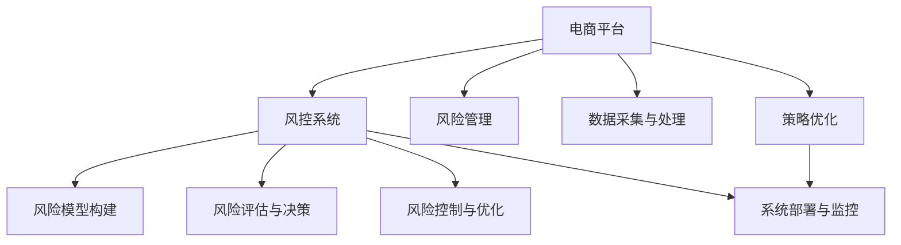

                 

# AI驱动的电商平台风控系统设计

> 关键词：电商平台，风控系统，风险管理，人工智能，机器学习，数据驱动，策略优化，模型构建，系统架构

## 1. 背景介绍

### 1.1 问题由来
随着电子商务的快速发展，电商平台的用户数量和交易规模迅速扩大，但随之而来的交易风险也日益增多。假冒伪劣商品、欺诈交易、账号盗用等问题严重威胁到电商平台的运营安全和用户权益。因此，构建一套高效、全面的风控系统成为电商平台必不可少的重要环节。

传统的风控系统依赖于规则引擎和人工审核，存在效率低、误判率高等问题。而人工智能技术，特别是机器学习和深度学习，为电商平台提供了更先进的风控解决方案。通过数据驱动的模型训练和智能决策，风控系统能够更快速、精准地识别和应对各类风险。

### 1.2 问题核心关键点
在AI驱动的电商平台风控系统中，核心问题是如何在大规模交易数据中，高效识别和预测潜在的风险事件，并采取相应的风险控制措施。具体包括以下几个关键点：

- 数据采集与处理：收集电商平台的大量交易数据，并进行预处理，确保数据质量和一致性。
- 风险模型构建：训练多个机器学习模型，如分类器、回归器、聚类器等，用于识别和预测风险事件。
- 风险评估与决策：根据模型预测结果，进行多维度风险评估，并自动决定是否采取拦截、告警等措施。
- 风险控制与优化：设计有效的风险控制策略，并在系统运行过程中不断优化，以提升系统的精准度和效率。
- 系统部署与监控：将模型和规则嵌入到电商平台的交易流程中，进行实时风险监测与控制，并通过监控手段保障系统的稳定性和鲁棒性。

通过解决上述问题，电商平台的风控系统可以显著提升其交易安全性，保障用户权益，降低欺诈损失，优化用户体验。

## 2. 核心概念与联系

### 2.1 核心概念概述

为更好地理解AI驱动的电商平台风控系统，本节将介绍几个密切相关的核心概念：

- **电商平台**：指通过互联网平台进行商品交易的电子化零售商。电商平台通常包括B2B、B2C、C2C等多种类型，常见的有淘宝、京东、亚马逊等。
- **风控系统**：指电商平台用于防范和应对交易风险的系统，包括但不限于假冒伪劣商品检测、欺诈交易识别、账号盗用防护等。
- **风险管理**：指电商平台通过各种手段，对交易过程中可能出现的风险进行识别、评估、控制和监控的过程。
- **人工智能**：指使用计算机模拟人类智能行为的技术，包括机器学习、深度学习、自然语言处理等，旨在解决复杂的、非结构化的问题。
- **机器学习**：指通过数据训练模型，使其能够自动学习和改进的一种方法。在风控系统中，常用的模型包括分类器、回归器、聚类器等。
- **深度学习**：指利用神经网络进行深度特征提取和复杂关系建模的一种技术。在风控系统中，常用的深度学习模型包括卷积神经网络、循环神经网络等。
- **数据驱动**：指通过大量交易数据的分析，驱动风险管理决策的过程。在风控系统中，数据驱动的模型训练是核心。
- **策略优化**：指在风控系统中，根据模型预测结果，动态调整和优化风险控制策略的过程。策略优化是提升系统精准度和效率的关键。

这些核心概念之间的逻辑关系可以通过以下Mermaid流程图来展示：



这个流程图展示了点到面的风控系统逻辑架构，体现了数据处理、模型训练、风险评估、策略优化等多个环节之间的关联性。

## 3. 核心算法原理 & 具体操作步骤
### 3.1 算法原理概述

AI驱动的电商平台风控系统，主要基于数据驱动的机器学习模型，对交易数据进行实时风险识别和评估。其核心算法流程包括以下几个关键步骤：

1. **数据采集与处理**：收集电商平台的交易数据，并进行清洗、归一化、特征工程等预处理操作。
2. **风险模型构建**：训练多个机器学习模型，如分类器、回归器、聚类器等，用于识别和预测风险事件。
3. **风险评估与决策**：根据模型预测结果，进行多维度风险评估，并自动决定是否采取拦截、告警等措施。
4. **风险控制与优化**：设计有效的风险控制策略，并在系统运行过程中不断优化，以提升系统的精准度和效率。
5. **系统部署与监控**：将模型和规则嵌入到电商平台的交易流程中，进行实时风险监测与控制，并通过监控手段保障系统的稳定性和鲁棒性。

### 3.2 算法步骤详解

**Step 1: 数据采集与处理**

数据采集是风控系统的第一步，电商平台需定期收集交易数据，包括但不限于用户ID、商品ID、订单金额、交易时间、交易设备、交易地点等。数据采集完成后，需进行以下预处理步骤：

1. **数据清洗**：去除异常值、空值、重复值等无效数据，确保数据质量。
2. **特征提取**：从原始数据中提取有意义的特征，如订单金额、交易地点、交易时间等。
3. **归一化与标准化**：对特征进行归一化或标准化处理，确保不同特征值域一致。
4. **特征工程**：通过数据转换、组合、降维等技术，构建更加适合模型的特征。

**Step 2: 风险模型构建**

风险模型构建是风控系统的核心环节。常见的风险模型包括分类器、回归器、聚类器等。这里以分类器为例，介绍模型构建的基本流程：

1. **模型选择**：根据任务类型选择合适的分类模型，如逻辑回归、支持向量机、随机森林、深度神经网络等。
2. **数据划分**：将数据集划分为训练集、验证集和测试集。
3. **模型训练**：在训练集上训练模型，调整模型参数以最小化损失函数。
4. **模型评估**：在验证集上评估模型性能，如准确率、召回率、F1分数等。
5. **模型调优**：根据评估结果调整模型参数，进行交叉验证等操作，提升模型性能。
6. **模型部署**：将训练好的模型部署到电商平台的交易系统中，进行实时风险预测。

**Step 3: 风险评估与决策**

风险评估与决策是风控系统的关键步骤，涉及风险事件的识别和分类。具体流程如下：

1. **特征输入**：将交易数据输入风险模型，计算模型预测结果。
2. **风险评估**：根据预测结果，进行多维度风险评估，如交易金额、用户行为、交易设备等。
3. **决策制定**：根据风险评估结果，决定是否采取拦截、告警等措施，如低风险放行、高风险拦截等。
4. **反馈机制**：将决策结果反馈到交易系统中，进行后续处理，如订单取消、账户冻结等。

**Step 4: 风险控制与优化**

风险控制与优化是风控系统的动态调整环节，涉及模型参数的优化和策略的调整。具体流程如下：

1. **模型监控**：实时监控模型的性能指标，如精度、召回率、误判率等。
2. **策略优化**：根据监控结果，动态调整和优化风险控制策略，如调整拦截阈值、优化拦截规则等。
3. **模型更新**：定期重新训练模型，使用新数据进行模型更新，提升模型性能。
4. **系统优化**：通过系统优化技术，如模型压缩、算法优化等，提升系统的效率和稳定性。

**Step 5: 系统部署与监控**

系统部署与监控是风控系统的关键环节，涉及模型的实时部署和系统监控。具体流程如下：

1. **模型嵌入**：将训练好的模型嵌入到电商平台的交易系统中，进行实时风险预测。
2. **监控机制**：建立系统的监控机制，实时采集系统指标，如响应时间、吞吐量等。
3. **异常检测**：根据监控指标，设置异常告警阈值，及时发现和处理系统异常。
4. **系统优化**：根据监控结果，优化系统资源配置，如增加服务器、调整负载均衡等。

### 3.3 算法优缺点

AI驱动的电商平台风控系统具有以下优点：

1. **高效性**：基于数据驱动的机器学习模型，能够快速识别和预测风险事件，提升风险控制效率。
2. **准确性**：通过大量交易数据的训练，模型具有较高的准确性和泛化能力。
3. **自适应性**：能够根据交易数据的变化，动态调整和优化模型，适应不同的交易场景。
4. **自动化**：通过自动化决策流程，减少人工干预，提高风险控制的时效性和一致性。

同时，该系统也存在一些缺点：

1. **数据依赖**：模型性能高度依赖于交易数据的丰富性和质量，数据不足或数据质量问题可能导致误判或漏判。
2. **模型复杂性**：构建和训练多个机器学习模型，可能增加系统的复杂性，影响系统部署和维护。
3. **隐私风险**：收集和处理大量交易数据，涉及用户隐私和数据安全问题。
4. **误判风险**：模型预测结果可能存在误判，如误拦截合法交易、误放行风险交易等，需进行多维度风险评估和策略优化。

尽管存在这些缺点，但AI驱动的电商平台风控系统在提高交易安全性和用户体验方面具有显著优势，是电商平台风险管理的重要手段。

### 3.4 算法应用领域

AI驱动的电商平台风控系统，已经在多个领域得到了广泛应用，例如：

- 假冒伪劣商品检测：通过训练分类器，对交易数据进行分类，识别假冒伪劣商品。
- 欺诈交易识别：通过训练分类器，对交易数据进行风险评估，识别欺诈交易。
- 账号盗用防护：通过训练聚类器，对用户行为进行聚类，检测异常账号行为。
- 交易行为分析：通过训练回归器，对交易数据进行预测，分析用户交易行为。
- 价格欺诈检测：通过训练分类器，对商品价格进行分类，检测价格欺诈行为。
- 物流异常监控：通过训练异常检测模型，监控物流状态，防范物流欺诈。

除了上述这些经典应用外，AI驱动的电商平台风控系统还可以进一步拓展到更多场景中，如信用评分、订单自动化处理等，为电商平台提供更全面的风险管理服务。

## 4. 数学模型和公式 & 详细讲解
### 4.1 数学模型构建

在AI驱动的电商平台风控系统中，常用的数学模型包括分类模型和回归模型。这里以分类模型为例，介绍其数学模型构建过程。

假设电商平台有 $N$ 笔交易，每笔交易有 $D$ 个特征 $X_1,X_2,...,X_D$，以及对应的交易状态 $Y$。交易状态 $Y$ 可以分为高风险交易和低风险交易两类。分类模型的目标是学习一个函数 $f(X)$，使得 $f(X)$ 能够正确预测交易状态 $Y$。

常用的分类模型有线性回归、逻辑回归、支持向量机、随机森林、深度神经网络等。这里以逻辑回归模型为例，介绍其数学模型构建过程。

逻辑回归模型的数学模型为：

$$
P(Y=1|X) = \sigma(\theta^TX + b)
$$

其中，$\theta$ 为模型的权重向量，$b$ 为偏置项，$\sigma$ 为 sigmoid 函数。模型目标是最小化损失函数：

$$
L(\theta,b) = -\frac{1}{N}\sum_{i=1}^N [y_i\log P(Y=1|X) + (1-y_i)\log P(Y=0|X)]
$$

通过梯度下降等优化算法，最小化损失函数，更新模型参数 $\theta$ 和 $b$。

### 4.2 公式推导过程

以逻辑回归模型为例，推导其参数更新公式。

假设训练集为 $D=\{(x_i,y_i)\}_{i=1}^N$，其中 $x_i \in R^D$，$y_i \in \{0,1\}$。模型的目标是最小化交叉熵损失函数：

$$
L(\theta,b) = -\frac{1}{N}\sum_{i=1}^N [y_i\log P(Y=1|X) + (1-y_i)\log P(Y=0|X)]
$$

根据链式法则，损失函数对参数 $\theta_k$ 的梯度为：

$$
\frac{\partial L(\theta,b)}{\partial \theta_k} = -\frac{1}{N}\sum_{i=1}^N \frac{\partial L(\theta,b)}{\partial P(Y=1|X)}\frac{\partial P(Y=1|X)}{\partial \theta_k}
$$

将 $P(Y=1|X) = \sigma(\theta^TX + b)$ 代入，得：

$$
\frac{\partial L(\theta,b)}{\partial \theta_k} = -\frac{1}{N}\sum_{i=1}^N (y_i - P(Y=1|X))x_{ik}\sigma(\theta^TX + b)[1 - \sigma(\theta^TX + b)]
$$

通过梯度下降等优化算法，更新模型参数 $\theta$ 和 $b$：

$$
\theta \leftarrow \theta - \eta \nabla_{\theta}L(\theta,b) - \eta\lambda\theta
$$

其中 $\eta$ 为学习率，$\lambda$ 为正则化系数。

### 4.3 案例分析与讲解

以电商平台欺诈交易检测为例，介绍逻辑回归模型的应用。

假设电商平台有 $N=1000$ 笔交易，每笔交易有 $D=10$ 个特征 $X_1,...,X_{10}$，以及对应的交易状态 $Y$。通过收集和标注数据，构建逻辑回归模型进行欺诈交易检测。

模型训练过程中，假设学习率为 $\eta=0.01$，正则化系数为 $\lambda=0.01$。使用梯度下降算法进行模型训练，得到模型参数 $\theta$ 和 $b$。

在测试集上，使用模型进行欺诈交易预测。计算模型在测试集上的准确率、召回率和 F1 分数，评估模型性能。

通过不断优化模型参数和调整超参数，提升模型性能，最终在实际应用中实时预测电商平台的交易状态，进行风险控制。

## 5. 项目实践：代码实例和详细解释说明
### 5.1 开发环境搭建

在进行项目实践前，我们需要准备好开发环境。以下是使用Python进行Scikit-learn开发的环境配置流程：

1. 安装Anaconda：从官网下载并安装Anaconda，用于创建独立的Python环境。

2. 创建并激活虚拟环境：
```bash
conda create -n sklearn-env python=3.8 
conda activate sklearn-env
```

3. 安装Scikit-learn：
```bash
conda install scikit-learn
```

4. 安装各类工具包：
```bash
pip install numpy pandas scikit-learn matplotlib tqdm jupyter notebook ipython
```

完成上述步骤后，即可在`sklearn-env`环境中开始项目实践。

### 5.2 源代码详细实现

这里以电商平台欺诈交易检测为例，给出使用Scikit-learn对逻辑回归模型进行训练的Python代码实现。

首先，定义训练集和测试集：

```python
from sklearn.model_selection import train_test_split
from sklearn.metrics import accuracy_score, recall_score, f1_score

X = # 特征矩阵
y = # 目标向量

X_train, X_test, y_train, y_test = train_test_split(X, y, test_size=0.2, random_state=42)
```

然后，定义逻辑回归模型并进行训练：

```python
from sklearn.linear_model import LogisticRegression

model = LogisticRegression(C=1e-4, penalty='l2', solver='lbfgs', max_iter=1000)

model.fit(X_train, y_train)
```

接着，在测试集上评估模型性能：

```python
y_pred = model.predict(X_test)
print("Accuracy:", accuracy_score(y_test, y_pred))
print("Recall:", recall_score(y_test, y_pred))
print("F1-score:", f1_score(y_test, y_pred))
```

最后，使用训练好的模型进行实时风险预测：

```python
new_transaction = # 新的交易数据
y_score = model.predict_proba(new_transaction)
if y_score[0][1] > 0.5:
    print("High risk transaction")
else:
    print("Low risk transaction")
```

以上就是使用Scikit-learn进行电商平台欺诈交易检测的完整代码实现。可以看到，Scikit-learn的封装使得模型训练和评估变得简洁高效。

### 5.3 代码解读与分析

让我们再详细解读一下关键代码的实现细节：

**train_test_split函数**：
- 用于将数据集划分为训练集和测试集。

**LogisticRegression类**：
- 定义逻辑回归模型，并进行参数调整，如正则化系数、损失函数等。

**fit方法**：
- 在训练集上训练逻辑回归模型，调整模型参数以最小化损失函数。

**predict方法**：
- 在测试集上预测模型结果，评估模型性能。

**predict_proba方法**：
- 预测新交易数据的风险概率，进行风险评估。

通过Scikit-learn的封装，开发者可以轻松地使用逻辑回归模型进行电商平台的欺诈交易检测。当然，在工业级的系统实现中，还需要考虑更多因素，如模型的保存和部署、超参数的自动搜索、更灵活的任务适配层等。但核心的模型训练和评估流程基本与此类似。

## 6. 实际应用场景
### 6.1 智能客服系统

基于AI驱动的电商平台风控系统，可以广泛应用于智能客服系统的构建。传统客服往往需要配备大量人力，高峰期响应缓慢，且一致性和专业性难以保证。而使用风控系统，可以实时监测交易风险，识别潜在欺诈行为，自动拦截可疑交易，提升客服效率和质量。

在技术实现上，可以收集企业内部的历史客服对话记录，将问题和最佳答复构建成监督数据，在此基础上对风控模型进行微调。微调后的风控模型能够自动理解用户意图，匹配最合适的答复模板，进行智能客服。对于用户提出的新问题，还可以接入检索系统实时搜索相关内容，动态组织生成答复。如此构建的智能客服系统，能大幅提升客服响应速度和准确性，提升用户体验。

### 6.2 金融舆情监测

金融机构需要实时监测市场舆论动向，以便及时应对负面信息传播，规避金融风险。传统的人工监测方式成本高、效率低，难以应对网络时代海量信息爆发的挑战。基于风控系统的文本分类和情感分析技术，为金融舆情监测提供了新的解决方案。

具体而言，可以收集金融领域相关的新闻、报道、评论等文本数据，并对其进行主题标注和情感标注。在此基础上对风控模型进行微调，使其能够自动判断文本属于何种主题，情感倾向是正面、中性还是负面。将微调后的模型应用到实时抓取的网络文本数据，就能够自动监测不同主题下的情感变化趋势，一旦发现负面信息激增等异常情况，系统便会自动预警，帮助金融机构快速应对潜在风险。

### 6.3 个性化推荐系统

当前的推荐系统往往只依赖用户的历史行为数据进行物品推荐，无法深入理解用户的真实兴趣偏好。基于风控系统的推荐模型，可以更好地挖掘用户行为背后的语义信息，从而提供更精准、多样的推荐内容。

在实践中，可以收集用户浏览、点击、评论、分享等行为数据，提取和用户交互的物品标题、描述、标签等文本内容。将文本内容作为模型输入，用户的后续行为（如是否点击、购买等）作为监督信号，在此基础上微调风控模型。微调后的模型能够从文本内容中准确把握用户的兴趣点。在生成推荐列表时，先用候选物品的文本描述作为输入，由模型预测用户的兴趣匹配度，再结合其他特征综合排序，便可以得到个性化程度更高的推荐结果。

### 6.4 未来应用展望

随着风控技术的不断发展，其在更多领域得到应用，为传统行业带来变革性影响。

在智慧医疗领域，基于风控系统的医疗问答、病历分析、药物研发等应用将提升医疗服务的智能化水平，辅助医生诊疗，加速新药开发进程。

在智能教育领域，风控系统可应用于作业批改、学情分析、知识推荐等方面，因材施教，促进教育公平，提高教学质量。

在智慧城市治理中，风控系统可应用于城市事件监测、舆情分析、应急指挥等环节，提高城市管理的自动化和智能化水平，构建更安全、高效的未来城市。

此外，在企业生产、社会治理、文娱传媒等众多领域，基于风控技术的人工智能应用也将不断涌现，为经济社会发展注入新的动力。相信随着技术的日益成熟，风控方法将成为人工智能落地应用的重要手段，推动人工智能技术在垂直行业的规模化落地。

## 7. 工具和资源推荐
### 7.1 学习资源推荐

为了帮助开发者系统掌握风控技术的理论基础和实践技巧，这里推荐一些优质的学习资源：

1. 《深度学习基础》系列博文：由深度学习专家撰写，深入浅出地介绍了深度学习的基础理论和实践方法，涵盖图像、文本、语音等多种模态。

2. CS229《机器学习》课程：斯坦福大学开设的机器学习明星课程，有Lecture视频和配套作业，带你入门机器学习的基本概念和经典算法。

3. 《Python机器学习》书籍：通过实践案例，系统介绍了使用Python进行机器学习开发的技术和方法。

4. Kaggle竞赛平台：全球最大的数据科学竞赛平台，提供丰富的数据集和问题挑战，提升你的实践能力和创新思维。

5. GitHub开源项目：通过学习开源项目，了解业界领先的风控系统实现和应用案例。

通过对这些资源的学习实践，相信你一定能够快速掌握风控技术的精髓，并用于解决实际的NLP问题。

### 7.2 开发工具推荐

高效的开发离不开优秀的工具支持。以下是几款用于风控系统开发的常用工具：

1. Python：数据科学和机器学习的通用语言，有着丰富的库和框架支持。

2. Scikit-learn：Python中最流行的机器学习库，提供了简单易用的接口，支持各种机器学习算法。

3. TensorFlow：由Google主导开发的深度学习框架，生产部署方便，支持GPU加速。

4. PyTorch：由Facebook主导的深度学习框架，灵活性高，支持动态图计算。

5. Weights & Biases：模型训练的实验跟踪工具，可以记录和可视化模型训练过程中的各项指标，方便对比和调优。

6. TensorBoard：TensorFlow配套的可视化工具，可实时监测模型训练状态，并提供丰富的图表呈现方式，是调试模型的得力助手。

合理利用这些工具，可以显著提升风控系统的开发效率，加快创新迭代的步伐。

### 7.3 相关论文推荐

风控技术的快速发展得益于学界的持续研究。以下是几篇奠基性的相关论文，推荐阅读：

1. Adversarial Machine Learning：通过对抗样本训练，增强模型的鲁棒性和泛化能力，防范恶意攻击。

2. Online Learning for Counterfactual Risk Estimation：提出在线学习算法，动态更新模型参数，提升风险评估的实时性。

3. Generative Adversarial Nets（GAN）：通过生成对抗网络，生成大量合成数据，提高模型的训练效率和性能。

4. Random Forests：介绍随机森林算法，用于处理大规模数据和复杂特征，提高模型的准确性和鲁棒性。

5. Neural Collaborative Filtering：介绍基于神经网络的协同过滤算法，用于推荐系统的建模和预测。

这些论文代表了大规模风控技术的最新进展，通过学习这些前沿成果，可以帮助研究者把握学科前进方向，激发更多的创新灵感。

## 8. 总结：未来发展趋势与挑战

### 8.1 总结

本文对AI驱动的电商平台风控系统进行了全面系统的介绍。首先阐述了电商平台的交易风险问题，明确了风控系统的核心目标和关键问题。其次，从原理到实践，详细讲解了风控系统的数学模型和核心算法流程，给出了风控任务开发的完整代码实例。同时，本文还广泛探讨了风控系统在智能客服、金融舆情、个性化推荐等多个领域的应用前景，展示了风控技术的巨大潜力。此外，本文精选了风控技术的各类学习资源，力求为读者提供全方位的技术指引。

通过本文的系统梳理，可以看到，风控技术在提升电商平台交易安全性、保障用户权益、降低欺诈损失、优化用户体验方面具有显著优势。AI驱动的电商平台风控系统，通过数据驱动的机器学习模型，能够高效、准确地识别和预测风险事件，是电商平台风险管理的重要手段。

### 8.2 未来发展趋势

展望未来，风控技术将呈现以下几个发展趋势：

1. **模型多样化**：除了传统的分类模型和回归模型，未来将涌现更多复杂多样的模型，如深度神经网络、生成对抗网络等，提升模型的复杂度和表达能力。

2. **数据融合**：未来的风控系统将不仅仅依赖于电商平台的数据，还将融合外部数据源，如社交媒体、金融数据等，构建更全面的风险管理模型。

3. **自动化决策**：通过自动化决策流程，减少人工干预，提高风险控制的时效性和一致性。自动化决策也将推动风控技术的普及和应用。

4. **实时化监控**：未来的风控系统将实现实时数据采集、实时模型训练和实时决策，提升系统的实时性和响应速度。

5. **多模态融合**：未来的风控系统将引入多模态数据融合技术，如文本、图像、语音等，构建更全面的风险管理模型。

6. **联邦学习**：通过联邦学习技术，在保护用户隐私的前提下，构建跨平台的风控模型，提升模型的泛化能力和数据利用效率。

以上趋势凸显了风控技术的广阔前景。这些方向的探索发展，必将进一步提升风控系统的性能和应用范围，为电商平台带来更全面的风险管理能力。

### 8.3 面临的挑战

尽管风控技术已经取得了显著进展，但在迈向更加智能化、普适化应用的过程中，仍面临诸多挑战：

1. **数据隐私和安全**：风控系统涉及大量用户交易数据，如何保护用户隐私和数据安全，防止数据泄露和滥用，将是重要的研究方向。

2. **模型复杂性**：风控模型需要处理大规模数据和复杂特征，模型的构建和训练过程较为复杂，如何简化模型结构，提高训练效率，是亟需解决的问题。

3. **模型泛化能力**：风控模型需要具备良好的泛化能力，避免对新数据的过拟合和泛化能力不足的问题，提升模型的鲁棒性和稳定性。

4. **实时性要求**：风控系统需要实现实时数据采集和实时决策，这对系统的计算能力和数据处理能力提出了更高的要求。

5. **多模态融合**：风控系统需要融合多模态数据，如文本、图像、语音等，如何进行有效的数据融合和特征提取，是未来的研究重点。

6. **联邦学习**：跨平台的风控模型需要满足联邦学习的要求，如何在保护隐私的前提下，构建高质量的风控模型，也是重要的研究方向。

这些挑战需要在技术、数据、工程等多个维度进行协同创新，才能推动风控技术的不断进步。唯有不断探索和突破，才能使风控技术在电商平台中发挥更大的价值。

### 8.4 研究展望

面向未来，风控技术需要在以下几个方面进行深入研究和突破：

1. **多模态融合**：通过引入多模态数据融合技术，提升风控模型的复杂度和表达能力，构建更全面的风险管理模型。

2. **自动化决策**：通过自动化决策流程，减少人工干预，提高风险控制的时效性和一致性。

3. **实时化监控**：通过实时数据采集和实时决策，提升风控系统的实时性和响应速度。

4. **联邦学习**：通过联邦学习技术，构建跨平台的风控模型，提升模型的泛化能力和数据利用效率。

5. **模型优化**：通过模型优化技术，简化模型结构，提高训练效率和模型泛化能力。

6. **隐私保护**：通过隐私保护技术，保护用户隐私和数据安全，防止数据泄露和滥用。

这些研究方向将引领风控技术的未来发展，为电商平台带来更全面、更智能的风险管理能力。

## 9. 附录：常见问题与解答

**Q1：风控系统如何解决假冒伪劣商品检测问题？**

A: 风控系统通过训练分类器，对交易数据进行分类，识别假冒伪劣商品。具体步骤如下：

1. 收集电商平台的交易数据，包括商品ID、交易时间、交易金额等。
2. 通过标注数据，构建训练集和测试集。
3. 训练逻辑回归、支持向量机、随机森林等分类器，用于分类判断商品是否为假冒伪劣商品。
4. 在测试集上评估模型性能，优化模型参数。
5. 使用训练好的模型进行实时风险预测，自动拦截可疑交易。

**Q2：风控系统如何防范交易欺诈？**

A: 风控系统通过训练分类器，对交易数据进行分类，识别欺诈交易。具体步骤如下：

1. 收集电商平台的交易数据，包括用户ID、交易金额、交易时间等。
2. 通过标注数据，构建训练集和测试集。
3. 训练逻辑回归、支持向量机、随机森林等分类器，用于分类判断交易是否为欺诈。
4. 在测试集上评估模型性能，优化模型参数。
5. 使用训练好的模型进行实时风险预测，自动拦截可疑交易。

**Q3：风控系统如何进行用户行为分析？**

A: 风控系统通过训练聚类器，对用户行为进行聚类，检测异常账号行为。具体步骤如下：

1. 收集电商平台的交易数据，包括用户ID、交易金额、交易时间等。
2. 通过标注数据，构建训练集和测试集。
3. 训练K-means、DBSCAN等聚类器，用于对用户行为进行聚类。
4. 在测试集上评估模型性能，优化模型参数。
5. 使用训练好的模型进行实时风险预测，自动拦截异常账号行为。

**Q4：风控系统如何检测价格欺诈？**

A: 风控系统通过训练分类器，对商品价格进行分类，检测价格欺诈行为。具体步骤如下：

1. 收集电商平台的交易数据，包括商品ID、交易金额、交易时间等。
2. 通过标注数据，构建训练集和测试集。
3. 训练逻辑回归、支持向量机、随机森林等分类器，用于分类判断商品是否为价格欺诈。
4. 在测试集上评估模型性能，优化模型参数。
5. 使用训练好的模型进行实时风险预测，自动拦截价格欺诈行为。

**Q5：风控系统如何进行物流异常监控？**

A: 风控系统通过训练异常检测模型，监控物流状态，防范物流欺诈。具体步骤如下：

1. 收集电商平台的物流数据，包括物流ID、发货时间、送达时间等。
2. 通过标注数据，构建训练集和测试集。
3. 训练K-means、DBSCAN等异常检测模型，用于检测物流状态异常。
4. 在测试集上评估模型性能，优化模型参数。
5. 使用训练好的模型进行实时风险预测，自动拦截物流欺诈行为。

**Q6：风控系统如何构建个性化推荐系统？**

A: 风控系统通过训练推荐模型，对用户行为进行预测，生成个性化推荐结果。具体步骤如下：

1. 收集电商平台的交易数据，包括用户ID、交易金额、交易时间等。
2. 通过标注数据，构建训练集和测试集。
3. 训练逻辑回归、支持向量机、随机森林等分类器，用于分类判断用户行为。
4. 在测试集上评估模型性能，优化模型参数。
5. 使用训练好的模型进行实时风险预测，自动生成个性化推荐结果。

通过本文的系统梳理，可以看到，风控系统在提升电商平台交易安全性、保障用户权益、降低欺诈损失、优化用户体验方面具有显著优势。随着技术的不断进步，风控系统将在更多领域得到应用，为传统行业带来变革性影响。相信随着技术的日益成熟，风控方法将成为电商平台风险管理的重要手段，推动电商平台向更加智能化、普适化方向发展。

