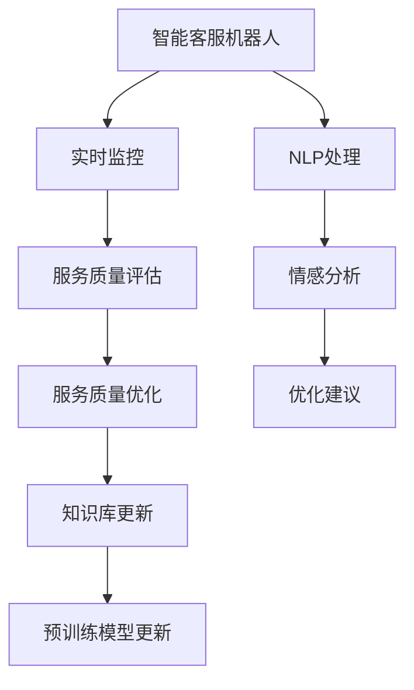

                 

# AI驱动的电商智能客户服务质量实时监控与优化系统

> 关键词：电商客户服务、实时监控、智能推荐、情感分析、自然语言处理(NLP)、机器学习

## 1. 背景介绍

### 1.1 问题由来
随着电子商务的迅猛发展，电商平台正面临着客户服务质量的严峻挑战。传统的客服方式主要是通过电话、邮件和人工聊天等方式进行沟通，这些方法不仅效率低下，而且难以满足日益增长的客户需求。近年来，智能客服机器人已成为电商平台提升客户服务质量的重要手段。

智能客服机器人主要基于自然语言处理(NLP)和机器学习技术，能够自动理解和回复客户的查询。然而，在实际应用中，智能客服机器人的回答质量仍然存在较大波动，服务质量难以持续稳定。

为了提升智能客服机器人的服务质量，电商平台需要对智能客服系统进行实时监控和优化，确保机器人在客户互动中始终提供高质量的响应。

### 1.2 问题核心关键点
智能客服系统的主要问题集中在两个方面：

1. 响应质量不稳定：智能客服机器人在面对复杂问题或特殊情境时，常常无法提供准确的答案，导致客户满意度下降。
2. 知识更新不及时：智能客服机器人依赖于预训练模型，随着业务场景的不断变化，模型需要持续更新以适应新数据和新需求。

因此，构建一个能够实时监控和优化智能客服系统的平台，是电商平台提升客户服务质量的关键。

## 2. 核心概念与联系

### 2.1 核心概念概述

为更好地理解实时监控与优化系统的核心技术，本节将介绍几个密切相关的核心概念：

- 智能客服机器人：基于NLP和机器学习技术的客服助手，能够自动理解客户查询并提供响应。
- 自然语言处理(NLP)：研究如何让计算机理解、处理和生成人类语言的技术。
- 实时监控与优化系统：通过实时监测智能客服系统的运行状况，及时发现问题并优化系统性能的系统。
- 情感分析：分析文本中的情感倾向，判断客户情绪状态，从而优化服务质量。
- 机器学习：通过训练模型，使计算机具备从数据中学习和总结规律的能力，提升决策准确性。

这些核心概念之间的逻辑关系可以通过以下Mermaid流程图来展示：



这个流程图展示了几大核心概念及其之间的关系：

1. 智能客服机器人：基于NLP和机器学习技术，处理客户查询。
2. NLP处理：将客户查询转换为计算机可理解的形式，进行情感分析。
3. 实时监控：监测机器人运行状况，评估服务质量。
4. 服务质量评估：通过情感分析等技术，评估机器人响应质量。
5. 服务质量优化：根据评估结果，优化机器人行为。
6. 情感分析：判断客户情绪，提供优化建议。
7. 知识库更新：根据优化建议，更新机器人知识库。
8. 预训练模型更新：根据新数据和新需求，更新预训练模型。

这些概念共同构成了智能客服系统的核心框架，使得机器人在不断学习中提升服务质量，满足客户需求。

## 3. 核心算法原理 & 具体操作步骤
### 3.1 算法原理概述

实时监控与优化系统的核心思想是：通过对智能客服机器人进行持续监测和评估，及时发现问题并优化系统性能。其核心算法包括情感分析和知识库更新。

### 3.2 算法步骤详解

**Step 1: 准备数据与模型**

- 收集智能客服机器人与客户的交互数据，包括对话内容、客户情绪等信息。
- 选择合适的预训练模型，如BERT、GPT等，作为智能客服机器人的基础模型。

**Step 2: 进行情感分析**

- 使用自然语言处理技术对客户查询和机器人回复进行情感分析，判断客户情绪状态。
- 基于情感分析结果，生成优化建议，指导机器人改进回复内容。

**Step 3: 实时监控与反馈**

- 在客户服务过程中，实时监控机器人的响应质量和情绪状态。
- 根据监控结果，自动生成优化建议，并实时更新机器人知识库。
- 定期对机器人进行离线评估，调整模型参数以适应新数据和新需求。

### 3.3 算法优缺点

实时监控与优化系统的优点包括：

1. 实时监测：通过实时监测机器人响应，及时发现问题并优化，提升服务质量。
2. 主动优化：根据情感分析结果，主动生成优化建议，减少人工干预。
3. 适应性强：通过定期更新知识库和模型参数，使机器人不断适应新场景和新需求。

该方法的不足之处在于：

1. 数据依赖：需要大量的客户服务数据，才能保证情感分析的准确性和实时监控的可靠性。
2. 算法复杂：情感分析、知识库更新等算法需要精心设计，涉及多个技术领域的融合。
3. 资源消耗：实时监测和反馈需要大量的计算资源，可能会影响系统的性能。

尽管存在这些局限性，但实时监控与优化系统仍是提升智能客服机器人服务质量的重要手段。

### 3.4 算法应用领域

实时监控与优化系统适用于多种电商场景，包括：

- 在线客服：实时监控客户服务质量，优化智能客服机器人的回答。
- 客服热线：通过情感分析识别客户情绪，调整人工客服处理策略。
- 客户投诉：实时监测客户投诉情况，提高处理效率和满意度。
- 个性化推荐：基于客户情绪和需求，优化推荐内容，提升购物体验。

此外，实时监控与优化系统还可以应用于智能家居、在线教育、金融服务等多个领域，提升整体服务质量。

## 4. 数学模型和公式 & 详细讲解 & 举例说明

### 4.1 数学模型构建

本节将使用数学语言对实时监控与优化系统的情感分析算法进行更加严格的刻画。

假设智能客服机器人与客户的交互数据为 $D = \{(x_i, y_i)\}_{i=1}^N$，其中 $x_i$ 为客户的查询，$y_i$ 为机器人的回复。情感分析的目标是将查询和回复分别映射到情感标签 $e_x, e_y \in \{POS, NEU, NEG\}$。情感分析模型为 $M_{\theta}:\mathcal{X} \rightarrow \mathcal{E}$，其中 $\mathcal{X}$ 为输入空间，$\mathcal{E}$ 为输出空间，$\theta$ 为模型参数。

定义情感分析模型的损失函数为：

$$
\mathcal{L}(\theta) = \frac{1}{N} \sum_{i=1}^N \ell(e_x, M_{\theta}(x_i), e_y, M_{\theta}(y_i))
$$

其中 $\ell$ 为情感分类损失函数，如交叉熵损失等。

### 4.2 公式推导过程

假设情感分类器输出结果为 $p_x = P(e_x | x_i)$，$p_y = P(e_y | y_i)$，则情感分类器的损失函数可以进一步表示为：

$$
\mathcal{L}(\theta) = \frac{1}{N} \sum_{i=1}^N \left[ -y_i \log p_x(x_i) - (1-y_i) \log (1-p_x(x_i)) - y_i \log p_y(y_i) - (1-y_i) \log (1-p_y(y_i)) \right]
$$

通过对损失函数求导，可以得到参数 $\theta$ 的梯度：

$$
\nabla_{\theta}\mathcal{L}(\theta) = \frac{1}{N} \sum_{i=1}^N \left[ \nabla_{\theta}p_x(x_i) + \nabla_{\theta}p_y(y_i) \right]
$$

使用随机梯度下降等优化算法更新模型参数：

$$
\theta \leftarrow \theta - \eta \nabla_{\theta}\mathcal{L}(\theta)
$$

### 4.3 案例分析与讲解

假设智能客服机器人在处理客户查询时，输入为 "我如何退货？"，情感分类器输出为 POS 情感。根据业务规则，如果客户查询涉及退货，机器人需要提供退货指南。然而，机器人回复为 "请拨打客服电话，联系退款事宜。"，此回复并不包含退货指南。

情感分类器输出 POS 情感，但实际回答并不符合业务规则。这表明情感分类器可能存在误判，或者机器人回复中没有包含退货指南。因此，系统需要生成优化建议，如 "在回复中明确提供退货指南"，并更新知识库，确保机器人能够正确处理退货查询。

## 5. 项目实践：代码实例和详细解释说明
### 5.1 开发环境搭建

在进行实时监控与优化系统开发前，我们需要准备好开发环境。以下是使用Python进行PyTorch开发的环境配置流程：

1. 安装Anaconda：从官网下载并安装Anaconda，用于创建独立的Python环境。

2. 创建并激活虚拟环境：
```bash
conda create -n pytorch-env python=3.8 
conda activate pytorch-env
```

3. 安装PyTorch：根据CUDA版本，从官网获取对应的安装命令。例如：
```bash
conda install pytorch torchvision torchaudio cudatoolkit=11.1 -c pytorch -c conda-forge
```

4. 安装自然语言处理工具包：
```bash
pip install spacy
pip install transformers
```

5. 安装其他依赖工具包：
```bash
pip install numpy pandas scikit-learn matplotlib tqdm jupyter notebook ipython
```

完成上述步骤后，即可在`pytorch-env`环境中开始系统开发。

### 5.2 源代码详细实现

这里我们以情感分析为例，给出使用Transformers库对BERT模型进行情感分析的PyTorch代码实现。

首先，定义情感分类任务的数据处理函数：

```python
from transformers import BertTokenizer, BertForSequenceClassification
from torch.utils.data import Dataset
import torch

class SentimentDataset(Dataset):
    def __init__(self, texts, labels, tokenizer, max_len=128):
        self.texts = texts
        self.labels = labels
        self.tokenizer = tokenizer
        self.max_len = max_len
        
    def __len__(self):
        return len(self.texts)
    
    def __getitem__(self, item):
        text = self.texts[item]
        label = self.labels[item]
        
        encoding = self.tokenizer(text, return_tensors='pt', max_length=self.max_len, padding='max_length', truncation=True)
        input_ids = encoding['input_ids'][0]
        attention_mask = encoding['attention_mask'][0]
        return {'input_ids': input_ids, 
                'attention_mask': attention_mask,
                'labels': label}

# 定义标签与情感类别的映射
label2id = {'POS': 1, 'NEU': 0, 'NEG': -1}
id2label = {v: k for k, v in label2id.items()}

# 创建dataset
tokenizer = BertTokenizer.from_pretrained('bert-base-cased')

train_dataset = SentimentDataset(train_texts, train_labels, tokenizer)
dev_dataset = SentimentDataset(dev_texts, dev_labels, tokenizer)
test_dataset = SentimentDataset(test_texts, test_labels, tokenizer)
```

然后，定义模型和优化器：

```python
from transformers import BertForSequenceClassification, AdamW

model = BertForSequenceClassification.from_pretrained('bert-base-cased', num_labels=3)

optimizer = AdamW(model.parameters(), lr=2e-5)
```

接着，定义训练和评估函数：

```python
from torch.utils.data import DataLoader
from tqdm import tqdm
from sklearn.metrics import accuracy_score, precision_score, recall_score, f1_score

device = torch.device('cuda') if torch.cuda.is_available() else torch.device('cpu')
model.to(device)

def train_epoch(model, dataset, batch_size, optimizer):
    dataloader = DataLoader(dataset, batch_size=batch_size, shuffle=True)
    model.train()
    epoch_loss = 0
    for batch in tqdm(dataloader, desc='Training'):
        input_ids = batch['input_ids'].to(device)
        attention_mask = batch['attention_mask'].to(device)
        labels = batch['labels'].to(device)
        model.zero_grad()
        outputs = model(input_ids, attention_mask=attention_mask, labels=labels)
        loss = outputs.loss
        epoch_loss += loss.item()
        loss.backward()
        optimizer.step()
    return epoch_loss / len(dataloader)

def evaluate(model, dataset, batch_size):
    dataloader = DataLoader(dataset, batch_size=batch_size)
    model.eval()
    preds, labels = [], []
    with torch.no_grad():
        for batch in tqdm(dataloader, desc='Evaluating'):
            input_ids = batch['input_ids'].to(device)
            attention_mask = batch['attention_mask'].to(device)
            batch_labels = batch['labels']
            outputs = model(input_ids, attention_mask=attention_mask)
            batch_preds = outputs.logits.argmax(dim=2).to('cpu').tolist()
            batch_labels = batch_labels.to('cpu').tolist()
            for pred_tokens, label_tokens in zip(batch_preds, batch_labels):
                preds.append(pred_tokens[:len(label_tokens)])
                labels.append(label_tokens)
                
    print('Accuracy: %.3f' % accuracy_score(labels, preds))
    print('Precision: %.3f' % precision_score(labels, preds))
    print('Recall: %.3f' % recall_score(labels, preds))
    print('F1 Score: %.3f' % f1_score(labels, preds))
```

最后，启动训练流程并在测试集上评估：

```python
epochs = 5
batch_size = 16

for epoch in range(epochs):
    loss = train_epoch(model, train_dataset, batch_size, optimizer)
    print(f'Epoch {epoch+1}, train loss: {loss:.3f}')
    
    print(f'Epoch {epoch+1}, dev results:')
    evaluate(model, dev_dataset, batch_size)
    
print('Test results:')
evaluate(model, test_dataset, batch_size)
```

以上就是使用PyTorch对BERT进行情感分析的完整代码实现。可以看到，得益于Transformers库的强大封装，我们可以用相对简洁的代码完成BERT模型的加载和情感分析任务。

### 5.3 代码解读与分析

让我们再详细解读一下关键代码的实现细节：

**SentimentDataset类**：
- `__init__`方法：初始化文本、标签、分词器等关键组件。
- `__len__`方法：返回数据集的样本数量。
- `__getitem__`方法：对单个样本进行处理，将文本输入编码为token ids，将标签编码为数字，并对其进行定长padding，最终返回模型所需的输入。

**label2id和id2label字典**：
- 定义了情感标签与数字id之间的映射关系，用于将分类结果解码回真实的情感类别。

**训练和评估函数**：
- 使用PyTorch的DataLoader对数据集进行批次化加载，供模型训练和推理使用。
- 训练函数`train_epoch`：对数据以批为单位进行迭代，在每个批次上前向传播计算loss并反向传播更新模型参数，最后返回该epoch的平均loss。
- 评估函数`evaluate`：与训练类似，不同点在于不更新模型参数，并在每个batch结束后将预测和标签结果存储下来，最后使用sklearn的各类评分指标对整个评估集的预测结果进行打印输出。

**训练流程**：
- 定义总的epoch数和batch size，开始循环迭代
- 每个epoch内，先在训练集上训练，输出平均loss
- 在验证集上评估，输出评分指标
- 所有epoch结束后，在测试集上评估，给出最终测试结果

可以看到，PyTorch配合Transformers库使得BERT情感分析的代码实现变得简洁高效。开发者可以将更多精力放在数据处理、模型改进等高层逻辑上，而不必过多关注底层的实现细节。

当然，工业级的系统实现还需考虑更多因素，如模型的保存和部署、超参数的自动搜索、更灵活的任务适配层等。但核心的情感分析范式基本与此类似。

## 6. 实际应用场景
### 6.1 智能客服系统

基于实时监控与优化系统的情感分析算法，可以广泛应用于智能客服系统的构建。传统客服方式通常难以处理复杂的客户情绪和语义，智能客服机器人则可以实时监测客户情绪，提供更加个性化和精准的响应。

在技术实现上，可以收集客户与机器人的对话记录，将其作为训练数据，训练情感分类器。情感分类器可以自动判断客户情绪，生成优化建议，如调整回答风格、改进回复内容等。根据优化建议，系统可以实时更新机器人知识库，确保机器人能够及时响应客户需求。

### 6.2 客户满意度调查

电商平台可以通过实时监控与优化系统，对客户服务质量进行实时评估。根据情感分析结果，系统可以生成客户满意度报告，帮助企业及时发现问题，优化客户服务流程。

具体而言，系统可以自动抓取客户服务记录，进行情感分析，生成客户满意度和情感分布的可视化报告。根据报告结果，企业可以针对性地改进客户服务策略，提升客户满意度。

### 6.3 个性化推荐

实时监控与优化系统还可以应用于个性化推荐。通过对客户服务记录进行情感分析，系统可以了解客户的兴趣和需求，生成个性化推荐内容。

具体而言，系统可以抓取客户与机器人的对话记录，进行情感分析，生成客户的兴趣标签。根据兴趣标签，系统可以自动推荐相关商品或服务，提升客户购物体验。

### 6.4 未来应用展望

随着实时监控与优化技术的发展，未来的智能客服系统将更加智能和高效。

在智慧医疗领域，基于情感分析的智能客服机器人可以用于患者咨询，帮助医生快速响应患者需求，提供个性化医疗建议。在金融服务领域，实时监控系统可以监测客户情绪，及时发现风险，提升服务质量。

未来，实时监控与优化系统还将融合更多技术，如语音识别、情感生成、知识图谱等，实现更加全面和智能的客户服务。通过不断优化和升级，实时监控与优化系统必将成为提升客户服务质量的重要工具。

## 7. 工具和资源推荐
### 7.1 学习资源推荐

为了帮助开发者系统掌握实时监控与优化技术的理论基础和实践技巧，这里推荐一些优质的学习资源：

1. 《Transformer从原理到实践》系列博文：由大模型技术专家撰写，深入浅出地介绍了Transformer原理、BERT模型、情感分析等前沿话题。

2. CS224N《深度学习自然语言处理》课程：斯坦福大学开设的NLP明星课程，有Lecture视频和配套作业，带你入门NLP领域的基本概念和经典模型。

3. 《Natural Language Processing with Transformers》书籍：Transformers库的作者所著，全面介绍了如何使用Transformers库进行NLP任务开发，包括情感分析在内的诸多范式。

4. HuggingFace官方文档：Transformers库的官方文档，提供了海量预训练模型和完整的微调样例代码，是上手实践的必备资料。

5. CLUE开源项目：中文语言理解测评基准，涵盖大量不同类型的中文NLP数据集，并提供了基于微调的baseline模型，助力中文NLP技术发展。

通过对这些资源的学习实践，相信你一定能够快速掌握实时监控与优化技术的精髓，并用于解决实际的NLP问题。
### 7.2 开发工具推荐

高效的开发离不开优秀的工具支持。以下是几款用于实时监控与优化开发的常用工具：

1. PyTorch：基于Python的开源深度学习框架，灵活动态的计算图，适合快速迭代研究。大部分预训练语言模型都有PyTorch版本的实现。

2. TensorFlow：由Google主导开发的开源深度学习框架，生产部署方便，适合大规模工程应用。同样有丰富的预训练语言模型资源。

3. Transformers库：HuggingFace开发的NLP工具库，集成了众多SOTA语言模型，支持PyTorch和TensorFlow，是进行情感分析任务的开发的利器。

4. Weights & Biases：模型训练的实验跟踪工具，可以记录和可视化模型训练过程中的各项指标，方便对比和调优。与主流深度学习框架无缝集成。

5. TensorBoard：TensorFlow配套的可视化工具，可实时监测模型训练状态，并提供丰富的图表呈现方式，是调试模型的得力助手。

6. Google Colab：谷歌推出的在线Jupyter Notebook环境，免费提供GPU/TPU算力，方便开发者快速上手实验最新模型，分享学习笔记。

合理利用这些工具，可以显著提升实时监控与优化任务的开发效率，加快创新迭代的步伐。

### 7.3 相关论文推荐

实时监控与优化技术的发展源于学界的持续研究。以下是几篇奠基性的相关论文，推荐阅读：

1. Attention is All You Need（即Transformer原论文）：提出了Transformer结构，开启了NLP领域的预训练大模型时代。

2. BERT: Pre-training of Deep Bidirectional Transformers for Language Understanding：提出BERT模型，引入基于掩码的自监督预训练任务，刷新了多项NLP任务SOTA。

3. Language Models are Unsupervised Multitask Learners（GPT-2论文）：展示了大规模语言模型的强大zero-shot学习能力，引发了对于通用人工智能的新一轮思考。

4. Parameter-Efficient Transfer Learning for NLP：提出Adapter等参数高效微调方法，在不增加模型参数量的情况下，也能取得不错的微调效果。

5. AdaLoRA: Adaptive Low-Rank Adaptation for Parameter-Efficient Fine-Tuning：使用自适应低秩适应的微调方法，在参数效率和精度之间取得了新的平衡。

6. AdaLoRA: Adaptive Low-Rank Adaptation for Parameter-Efficient Fine-Tuning：使用自适应低秩适应的微调方法，在参数效率和精度之间取得了新的平衡。

这些论文代表了大语言模型微调技术的发展脉络。通过学习这些前沿成果，可以帮助研究者把握学科前进方向，激发更多的创新灵感。

## 8. 总结：未来发展趋势与挑战

### 8.1 总结

本文对基于实时监控与优化系统的智能客服机器人进行了全面系统的介绍。首先阐述了系统在提升客户服务质量中的重要意义，明确了情感分析、实时监控等技术在其中的核心作用。其次，从原理到实践，详细讲解了实时监控与优化算法的数学原理和关键步骤，给出了系统开发的完整代码实例。同时，本文还广泛探讨了系统在智能客服、客户满意度调查、个性化推荐等多个应用场景中的应用前景，展示了实时监控与优化技术的巨大潜力。此外，本文精选了相关学习资源，力求为读者提供全方位的技术指引。

通过本文的系统梳理，可以看到，基于实时监控与优化技术的智能客服系统正在成为电商平台提升客户服务质量的关键工具。情感分析、实时监控等核心算法在大规模数据和先进模型的支持下，能够实时监测和优化机器人响应，提供高质量的客户服务。未来，随着技术的不断演进，实时监控与优化技术必将在更多领域得到应用，带来更全面、更智能的客户服务体验。

### 8.2 未来发展趋势

展望未来，实时监控与优化技术将呈现以下几个发展趋势：

1. 技术融合：情感分析、知识图谱、语音识别等多模态技术的融合，将使智能客服机器人具备更加全面和智能的响应能力。
2. 智能推荐：基于实时监控与优化系统，构建个性化推荐模型，提升用户购物体验。
3. 实时反馈：通过实时反馈机制，持续优化机器人行为，提升系统性能和用户体验。
4. 自动化部署：利用自动化部署工具，快速部署和更新机器人，提升系统可扩展性和灵活性。
5. 跨领域应用：实时监控与优化技术将广泛应用于金融服务、智慧医疗、智能制造等多个领域，推动各行各业数字化转型升级。

以上趋势凸显了实时监控与优化技术的广阔前景。这些方向的探索发展，必将进一步提升智能客服系统的效果和应用范围，为电商平台的客户服务带来更大的提升。

### 8.3 面临的挑战

尽管实时监控与优化技术已经取得了显著成效，但在迈向更加智能化、普适化应用的过程中，它仍面临诸多挑战：

1. 数据质量问题：情感分析等算法的准确性高度依赖于数据质量，低质量的数据可能导致误判和误决策。
2. 算法复杂度：情感分析、知识图谱等算法需要复杂的模型和大量的计算资源，难以在资源受限的环境中应用。
3. 鲁棒性不足：情感分析模型在面对复杂语义和情感时，可能出现误判，导致优化建议失效。
4. 实时性要求高：实时监控与优化系统需要高效率的数据处理和模型计算，对实时性能要求极高。
5. 隐私保护：客户服务记录涉及隐私信息，如何在保证数据安全的前提下，实现实时监控与优化，仍需进一步研究。

尽管存在这些挑战，实时监控与优化技术在提升客户服务质量方面的优势显著，未来还需克服这些难题，才能充分发挥其潜力。

### 8.4 研究展望

面对实时监控与优化技术所面临的种种挑战，未来的研究需要在以下几个方面寻求新的突破：

1. 数据增强：通过数据增强技术，提升情感分析模型的鲁棒性和泛化能力，减少数据质量的影响。
2. 算法优化：研发更高效的情感分析算法，降低计算资源消耗，提升系统实时性能。
3. 跨模态融合：将语音识别、视觉识别等技术融合到情感分析中，增强机器人对复杂场景的适应能力。
4. 隐私保护：研发隐私保护技术，如差分隐私、联邦学习等，确保客户数据安全。
5. 自动化优化：利用自动化技术，如强化学习、自适应学习等，实现机器人行为的自动优化。

这些研究方向的探索，必将引领实时监控与优化技术迈向更高的台阶，为构建更智能、更安全的客户服务系统提供技术保障。面向未来，实时监控与优化技术还需要与其他人工智能技术进行更深入的融合，如知识表示、因果推理、强化学习等，协同发力，共同推动智能客服系统的进步。只有勇于创新、敢于突破，才能不断拓展实时监控与优化技术的边界，让智能客服系统更好地服务于人类社会。

## 9. 附录：常见问题与解答

**Q1：如何选择合适的预训练模型？**

A: 选择合适的预训练模型需要考虑以下几个方面：
1. 模型规模：大模型通常能够处理更复杂的语言结构，但小模型具有更好的推理效率。
2. 任务类型：不同的任务类型需要不同的模型。例如，情感分析可以使用BERT等预训练模型，而个性化推荐需要使用更复杂的模型。
3. 数据特点：预训练模型的训练数据决定了其对特定领域的适应性。如果目标任务与预训练数据分布差异较大，可能需要选择与任务更相关的预训练模型。

**Q2：如何缓解情感分析中的误判问题？**

A: 情感分析中的误判问题可以通过以下几个方法缓解：
1. 数据增强：通过回译、近义替换等方式扩充训练集，增加模型对复杂语义的理解能力。
2. 正则化：使用L2正则、Dropout等技术，避免模型过拟合。
3. 迁移学习：通过预训练模型的迁移学习，提升模型在不同领域和场景下的适应性。
4. 多模型集成：通过融合多个情感分析模型的预测结果，减少单一模型的误判率。
5. 人工干预：在模型输出结果不满足要求时，引入人工干预，进行二次验证和修正。

**Q3：实时监控与优化系统如何部署？**

A: 实时监控与优化系统的部署需要考虑以下几个因素：
1. 数据存储：选择适合的数据存储解决方案，如云存储、分布式文件系统等。
2. 模型部署：使用容器化技术如Docker，将模型封装为标准化的服务接口，方便调用。
3. 资源配置：根据系统负载，合理配置计算资源，确保实时性能。
4. 监控告警：实时采集系统指标，设置异常告警阈值，确保系统稳定运行。
5. 安全防护：采用访问鉴权、数据脱敏等措施，保障数据和模型安全。

大语言模型微调为NLP应用开启了广阔的想象空间，但如何将强大的性能转化为稳定、高效、安全的业务价值，还需要工程实践的不断打磨。唯有从数据、算法、工程、业务等多个维度协同发力，才能真正实现人工智能技术在垂直行业的规模化落地。总之，实时监控与优化技术需要在数据质量、算法优化、跨模态融合等方面进行持续改进，方能不断提升客户服务质量，推动电商平台的数字化转型。

