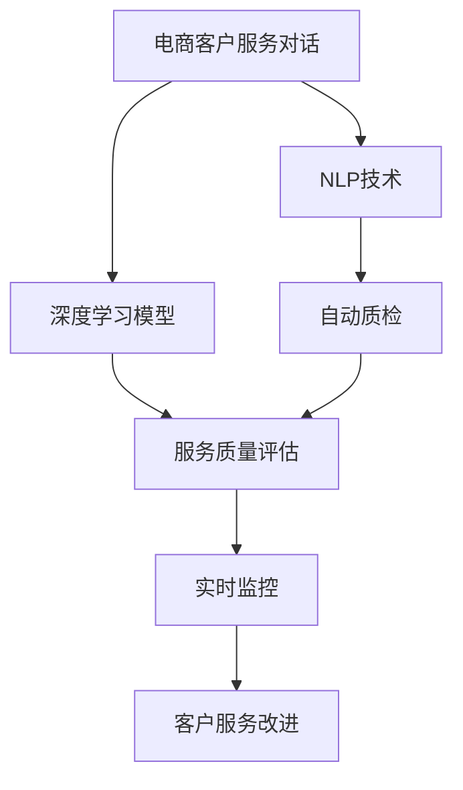

                 

# AI驱动的电商智能客户服务质量监控系统

> 关键词：电商客户服务,智能监控系统,数据驱动,深度学习,自然语言处理,情感分析,客户满意度,服务质量评估,质量控制

## 1. 背景介绍

### 1.1 问题由来
随着电子商务的蓬勃发展，电商客户服务成为企业争夺市场份额和提升用户体验的重要环节。然而，电商客户服务质量问题频出，如响应时间长、服务态度差、处理流程繁琐等，直接影响顾客满意度和企业声誉。因此，构建一套高效、精准、实时化的电商智能客户服务质量监控系统，成为电商企业的迫切需求。

### 1.2 问题核心关键点
本文将围绕构建一套电商智能客户服务质量监控系统，全面分析系统所需的核心技术：

- 自然语言处理(NLP)：通过文本分析技术，对电商客户服务对话进行自动质检和分析。
- 深度学习(Deep Learning)：构建端到端的智能监控模型，实现高效的服务质量评估。
- 数据驱动(Data-Driven)：利用历史服务数据训练模型，持续优化服务质量监控系统。
- 实时监控(Real-Time Monitoring)：实时监控客户服务对话，及时发现和解决问题。

本文将结合最新的AI技术，深入探讨如何高效、准确地构建并部署电商智能客户服务质量监控系统。

## 2. 核心概念与联系

### 2.1 核心概念概述

为更好地理解构建电商智能客户服务质量监控系统的技术基础，本节将介绍几个核心概念：

- 自然语言处理(Natural Language Processing, NLP)：研究如何让计算机理解和处理人类语言的技术。NLP技术包括词法分析、句法分析、语义分析、情感分析等。
- 深度学习(Deep Learning)：一种基于神经网络的机器学习技术，通过多层次的非线性变换，提取数据中的复杂特征。深度学习在图像、语音、文本等领域广泛应用。
- 数据驱动(Data-Driven)：指在决策和模型构建过程中，大量依赖数据，而不是仅凭经验。数据驱动有利于提升模型的准确性和鲁棒性。
- 实时监控(Real-Time Monitoring)：指对事件进行持续、无延迟的跟踪和处理。在电商客户服务中，实时监控系统可及时发现和处理客户问题。

这些核心概念之间的关系可以用以下Mermaid流程图来展示：



这个流程图展示了一系列从数据采集到服务改进的核心技术链条，显示了NLP和深度学习技术如何协同作用，实现电商智能客户服务质量监控系统。

## 3. 核心算法原理 & 具体操作步骤
### 3.1 算法原理概述

构建电商智能客户服务质量监控系统，主要涉及以下几个步骤：

1. 数据采集：通过API接口、聊天记录、客服软件等渠道，收集客户服务对话数据。
2. 自然语言处理：利用NLP技术对对话进行文本清洗、分词、词性标注、句法分析、语义分析等。
3. 特征提取：从对话中提取情感、语气、对话轮数、回复时间等关键特征。
4. 模型训练：利用历史服务数据，训练深度学习模型，构建服务质量评估体系。
5. 实时监控：对实时对话数据进行质检，实时发现服务问题。
6. 服务改进：根据监控结果，及时优化客户服务流程，提升服务质量。

### 3.2 算法步骤详解

以下将详细讲解构建电商智能客户服务质量监控系统的一般流程：

**Step 1: 数据采集**

电商客户服务质量监控系统首先需要收集大量的客户服务对话数据。数据来源包括：

- API接口：电商平台的服务系统提供的服务记录接口。
- 聊天记录：客服软件中的聊天记录，如飞书、钉钉、微信等。
- 客服系统：如Zendesk、Freshdesk等客户服务系统。

通过爬虫技术或API调用，将这些数据整合到集中存储平台，如Hadoop、Spark等，供后续处理使用。

**Step 2: 数据清洗与预处理**

客户服务对话数据通常包含大量噪音和错误，需要清洗和预处理：

- 去重：去除重复对话，避免数据冗余。
- 清洗：去除无关字符、HTML标签、特殊符号等噪音。
- 分词：将句子切分成词语，便于后续处理。
- 词性标注：为每个词语标注词性，如名词、动词等。
- 句法分析：解析句子的句法结构，如主谓宾关系等。
- 语义分析：理解句子的语义，如情感、意图等。

数据清洗和预处理是NLP任务中的基础步骤，通过上述处理，可以大大提高后续处理的质量。

**Step 3: 特征提取**

在清洗和预处理的基础上，提取对话中的关键特征，供深度学习模型使用：

- 情感分析：利用情感词典或深度学习模型，识别对话中的情感倾向，如正面、负面、中性等。
- 语气分析：分析对话中的语气，如礼貌、生气、焦急等。
- 对话轮数：计算对话的轮数，评估服务的互动深度。
- 回复时间：记录客服的响应时间，评估服务的响应速度。
- 关键词提取：识别对话中的关键词汇，如问题、需求等。

特征提取是构建服务质量评估模型的关键步骤，需要选择合适的特征，以便模型能够更好地识别服务质量问题。

**Step 4: 模型训练与评估**

利用历史服务数据，训练深度学习模型，构建服务质量评估体系：

- 设计损失函数：根据服务质量评估目标，设计损失函数。例如，对于二分类问题，可以使用交叉熵损失函数。
- 选择模型架构：如CNN、RNN、Transformer等，选择最适合的深度学习模型。
- 划分数据集：将数据集划分为训练集、验证集和测试集，进行交叉验证。
- 训练模型：使用训练集数据，调整模型参数，最小化损失函数。
- 验证模型：在验证集上评估模型性能，调整模型参数。
- 测试模型：在测试集上测试模型性能，确保模型的泛化能力。

模型训练与评估是构建服务质量评估模型的核心步骤，需要选择合适的模型架构和损失函数，并进行交叉验证和测试。

**Step 5: 实时监控与改进**

电商智能客户服务质量监控系统需要在实际运营中实时监控客户服务对话，及时发现和解决问题：

- 数据流处理：使用流处理框架，如Apache Kafka、Apache Flink等，实时处理客户服务对话。
- 自动质检：使用训练好的模型，对实时对话进行自动质检，评估服务质量。
- 异常检测：识别对话中的异常行为，如沉默对话、不当回复等。
- 实时反馈：将监控结果反馈到客服系统，及时调整服务策略。
- 服务改进：根据监控结果，优化客户服务流程，提升服务质量。

实时监控与改进是电商智能客户服务质量监控系统的关键功能，需要实时处理客户服务对话，并及时进行反馈和改进。

### 3.3 算法优缺点

构建电商智能客户服务质量监控系统具有以下优点：

- 数据驱动：利用历史服务数据训练模型，提升服务质量评估的准确性和鲁棒性。
- 自动质检：自动进行客户服务对话的质检，提高监控效率和覆盖面。
- 实时监控：实时监控客户服务对话，及时发现和解决问题，提升服务质量。
- 服务改进：根据监控结果，优化客户服务流程，提升服务质量。

但该方法也存在一些缺点：

- 数据依赖：监控系统的性能很大程度上依赖于数据质量，需对数据进行严格清洗和预处理。
- 模型复杂：深度学习模型复杂度高，训练和部署成本较高。
- 实时性挑战：实时监控系统需处理海量数据，对系统延迟和计算资源要求较高。
- 系统集成：需与客服系统、CRM系统等进行深度集成，存在技术复杂度。

尽管存在这些缺点，但电商智能客户服务质量监控系统仍具有重要应用价值，能够有效提升客户服务质量，增强客户满意度，提升企业竞争力和市场份额。

### 3.4 算法应用领域

电商智能客户服务质量监控系统不仅在电商领域具有广泛应用，还在金融、医疗、旅游等多个领域有重要价值：

- 电商：监控客户服务对话，及时发现和解决服务问题，提升服务质量。
- 金融：监控客服对话，评估客户满意度和服务质量，优化客服流程。
- 医疗：监控医患对话，评估医疗服务质量，提升医疗服务体验。
- 旅游：监控客服对话，评估客户满意度，优化旅游服务流程。

## 4. 数学模型和公式 & 详细讲解  
### 4.1 数学模型构建

构建电商智能客户服务质量监控系统，涉及以下几个数学模型：

- 情感分析模型：利用情感词典或深度学习模型，评估对话中的情感倾向。
- 语气分析模型：分析对话中的语气，如礼貌、生气、焦急等。
- 对话轮数模型：计算对话轮数，评估服务互动深度。
- 回复时间模型：记录客服响应时间，评估服务响应速度。

以情感分析模型为例，其数学模型构建如下：

假设对话数据为 $D=\{(x_i, y_i)\}_{i=1}^N$，其中 $x_i$ 为对话文本，$y_i$ 为情感标签（正面、负面、中性等）。

情感分析的目标是最小化交叉熵损失函数，即：

$$
\mathcal{L}(\theta) = -\frac{1}{N}\sum_{i=1}^N \sum_{k=1}^K y_{ik} \log p_{ik}(x_i|\theta)
$$

其中，$\theta$ 为模型参数，$K$ 为类别数，$y_{ik}$ 为标签 $k$ 对应的二进制变量，$p_{ik}(x_i|\theta)$ 为模型在文本 $x_i$ 下预测情感概率，$N$ 为样本数量。

通过最小化交叉熵损失函数，训练情感分析模型，可评估对话的情感倾向。

### 4.2 公式推导过程

情感分析模型的推导如下：

假设情感分析模型为 $M_{\theta}(x_i)$，其中 $\theta$ 为模型参数。

将模型输出与真实标签进行交叉熵计算，得到损失函数：

$$
\mathcal{L}(\theta) = -\frac{1}{N}\sum_{i=1}^N \sum_{k=1}^K y_{ik} \log \frac{\exp(\theta_i^T \phi(x_i))}{\sum_j \exp(\theta_j^T \phi(x_i))}
$$

其中 $\phi(x_i)$ 为文本 $x_i$ 的特征向量表示，$\theta_i$ 为模型参数向量，$y_{ik}$ 为标签 $k$ 对应的二进制变量。

模型参数 $\theta$ 通过梯度下降等优化算法最小化损失函数，更新模型参数：

$$
\theta \leftarrow \theta - \eta \nabla_{\theta}\mathcal{L}(\theta)
$$

其中 $\eta$ 为学习率，$\nabla_{\theta}\mathcal{L}(\theta)$ 为损失函数对模型参数 $\theta$ 的梯度。

通过上述推导，可以看出，情感分析模型通过最小化交叉熵损失函数，训练模型参数，实现对对话情感倾向的预测。

### 4.3 案例分析与讲解

以电商客服对话为例，情感分析模型的训练和评估过程如下：

假设电商客服对话数据为 $D=\{(x_i, y_i)\}_{i=1}^N$，其中 $x_i$ 为对话文本，$y_i$ 为情感标签。

**Step 1: 数据预处理**

对对话数据进行清洗和预处理：

- 去除噪音：去除HTML标签、特殊符号等噪音。
- 分词：将对话文本分词，如“购买”、“配送”、“退货”等。
- 词性标注：为每个词语标注词性，如名词、动词等。
- 句法分析：解析句子的句法结构，如主谓宾关系等。

**Step 2: 特征提取**

从对话中提取情感特征：

- 情感词典：利用情感词典，提取对话中的情感词汇。例如，“满意”、“不满意”等。
- 深度学习：利用BERT、LSTM等深度学习模型，提取对话中的情感表示。例如，使用BERT模型进行文本嵌入，再通过CNN或RNN进行情感分类。

**Step 3: 模型训练**

利用历史服务数据，训练情感分析模型：

- 划分数据集：将数据集划分为训练集、验证集和测试集，进行交叉验证。
- 选择模型：选择最适合的深度学习模型，如CNN、RNN、Transformer等。
- 训练模型：使用训练集数据，调整模型参数，最小化损失函数。
- 验证模型：在验证集上评估模型性能，调整模型参数。
- 测试模型：在测试集上测试模型性能，确保模型的泛化能力。

## 5. 项目实践：代码实例和详细解释说明
### 5.1 开发环境搭建

在进行电商智能客户服务质量监控系统开发前，我们需要准备好开发环境。以下是使用Python进行PyTorch开发的环境配置流程：

1. 安装Anaconda：从官网下载并安装Anaconda，用于创建独立的Python环境。

2. 创建并激活虚拟环境：
```bash
conda create -n pytorch-env python=3.8 
conda activate pytorch-env
```

3. 安装PyTorch：根据CUDA版本，从官网获取对应的安装命令。例如：
```bash
conda install pytorch torchvision torchaudio cudatoolkit=11.1 -c pytorch -c conda-forge
```

4. 安装各类工具包：
```bash
pip install numpy pandas scikit-learn matplotlib tqdm jupyter notebook ipython
```

完成上述步骤后，即可在`pytorch-env`环境中开始电商智能客户服务质量监控系统开发。

### 5.2 源代码详细实现

以下是使用Python和PyTorch实现电商智能客户服务质量监控系统的源代码示例：

**Step 1: 数据预处理**

```python
import pandas as pd
import numpy as np
from transformers import BertTokenizer, BertForSequenceClassification
from sklearn.model_selection import train_test_split
from torch.utils.data import TensorDataset, DataLoader, SequentialSampler
from transformers import AdamW

# 加载数据
df = pd.read_csv('data.csv')

# 数据预处理
df.dropna(inplace=True)
df.reset_index(drop=True, inplace=True)
X = df['text'].tolist()
y = df['label'].tolist()

# 分词
tokenizer = BertTokenizer.from_pretrained('bert-base-cased')
X = [tokenizer.encode(x) for x in X]

# 转换为Tensor类型
X = np.array(X, dtype=np.int32)
y = np.array(y, dtype=np.int32)
```

**Step 2: 特征提取**

```python
# 加载预训练模型
model = BertForSequenceClassification.from_pretrained('bert-base-cased', num_labels=3)

# 特征提取
X = X.reshape(-1, max(X))
y = y.reshape(-1, 1)

# 转换为TensorDataset
dataset = TensorDataset(X, y)
sampler = SequentialSampler(dataset)
dataloader = DataLoader(dataset, sampler=sampler, batch_size=32)

# 加载优化器
optimizer = AdamW(model.parameters(), lr=2e-5)
```

**Step 3: 模型训练**

```python
# 定义训练函数
def train_epoch(model, dataloader, optimizer):
    model.train()
    total_loss = 0
    for batch in dataloader:
        inputs, labels = batch
        inputs = torch.tensor(inputs, dtype=torch.long)
        labels = torch.tensor(labels, dtype=torch.long)

        optimizer.zero_grad()
        outputs = model(inputs)
        loss = outputs.loss
        loss.backward()
        optimizer.step()

        total_loss += loss.item()

    return total_loss / len(dataloader)

# 训练模型
epochs = 5
total_loss = 0

for epoch in range(epochs):
    loss = train_epoch(model, dataloader, optimizer)
    total_loss += loss

# 输出平均损失
print('平均损失:', total_loss / epochs)
```

**Step 4: 实时监控**

```python
# 实时监控

# 加载模型
model.eval()

# 加载测试数据
X_test = np.array(X_test, dtype=np.int32)
y_test = np.array(y_test, dtype=np.int32)

# 转换为TensorDataset
dataset_test = TensorDataset(X_test, y_test)
sampler_test = SequentialSampler(dataset_test)
dataloader_test = DataLoader(dataset_test, sampler=sampler_test, batch_size=32)

# 实时处理
for batch in dataloader_test:
    inputs, labels = batch
    inputs = torch.tensor(inputs, dtype=torch.long)
    labels = torch.tensor(labels, dtype=torch.long)

    with torch.no_grad():
        outputs = model(inputs)
        logits = outputs.logits
        predictions = torch.argmax(logits, dim=1)
```

### 5.3 代码解读与分析

让我们再详细解读一下关键代码的实现细节：

**数据预处理**

- 加载数据：使用Pandas库加载CSV文件。
- 数据清洗：去除缺失值，重置索引。
- 分词：使用BertTokenizer进行分词。
- 转换为Tensor类型：将分词后的序列转换为Tensor类型，便于后续处理。

**特征提取**

- 加载预训练模型：加载预训练的Bert模型。
- 特征提取：将分词后的序列转换为Tensor类型，并进行特征提取。
- 转换为TensorDataset：将数据集转换为TensorDataset类型，便于进行训练。

**模型训练**

- 定义训练函数：在每个epoch内，使用优化器更新模型参数，计算平均损失。
- 训练模型：使用训练集数据，调整模型参数，最小化损失函数。
- 输出平均损失：在所有epoch结束后，输出平均损失。

**实时监控**

- 加载模型：将训练好的模型加载到GPU或CPU上。
- 加载测试数据：加载测试集数据。
- 转换为TensorDataset：将测试集数据转换为TensorDataset类型，便于进行推理。
- 实时处理：对测试集数据进行推理，输出预测结果。

## 6. 实际应用场景

### 6.1 智能客服系统

电商智能客户服务质量监控系统可以广泛应用于智能客服系统的构建。传统客服往往需要配备大量人力，高峰期响应缓慢，且一致性和专业性难以保证。而使用智能监控系统，可以7x24小时不间断服务，快速响应客户咨询，用自然流畅的语言解答各类常见问题。

在技术实现上，可以收集企业内部的历史客服对话记录，将问题和最佳答复构建成监督数据，在此基础上对预训练模型进行微调。微调后的模型能够自动理解用户意图，匹配最合适的答案模板进行回复。对于客户提出的新问题，还可以接入检索系统实时搜索相关内容，动态组织生成回答。如此构建的智能客服系统，能大幅提升客户咨询体验和问题解决效率。

### 6.2 金融舆情监测

金融机构需要实时监测市场舆论动向，以便及时应对负面信息传播，规避金融风险。传统的人工监测方式成本高、效率低，难以应对网络时代海量信息爆发的挑战。基于电商智能客户服务质量监控系统的情感分析技术，为金融舆情监测提供了新的解决方案。

具体而言，可以收集金融领域相关的新闻、报道、评论等文本数据，并对其进行主题标注和情感标注。在此基础上对预训练语言模型进行微调，使其能够自动判断文本属于何种主题，情感倾向是正面、中性还是负面。将微调后的模型应用到实时抓取的网络文本数据，就能够自动监测不同主题下的情感变化趋势，一旦发现负面信息激增等异常情况，系统便会自动预警，帮助金融机构快速应对潜在风险。

### 6.3 个性化推荐系统

当前的推荐系统往往只依赖用户的历史行为数据进行物品推荐，无法深入理解用户的真实兴趣偏好。基于电商智能客户服务质量监控系统的情感分析技术，个性化推荐系统可以更好地挖掘用户行为背后的语义信息，从而提供更精准、多样的推荐内容。

在实践中，可以收集用户浏览、点击、评论、分享等行为数据，提取和用户交互的物品标题、描述、标签等文本内容。将文本内容作为模型输入，用户的后续行为（如是否点击、购买等）作为监督信号，在此基础上微调预训练语言模型。微调后的模型能够从文本内容中准确把握用户的兴趣点。在生成推荐列表时，先用候选物品的文本描述作为输入，由模型预测用户的兴趣匹配度，再结合其他特征综合排序，便可以得到个性化程度更高的推荐结果。

### 6.4 未来应用展望

随着电商智能客户服务质量监控系统的不断发展，未来将在更多领域得到应用，为传统行业带来变革性影响。

在智慧医疗领域，基于智能监控的对话质量评估，可以为医疗服务质量提供有力保障，提升医疗服务体验。在智能教育领域，通过对话质量监控，可以有效评估和改进在线教学效果，提高教学质量。在智慧城市治理中，智能监控系统可以实时监测公共服务对话，优化城市管理决策。

此外，在企业生产、社会治理、文娱传媒等众多领域，基于智能监控的系统也将不断涌现，为各行各业带来智能化转型升级，提升服务质量和用户体验。

## 7. 工具和资源推荐

### 7.1 学习资源推荐

为了帮助开发者系统掌握电商智能客户服务质量监控系统的技术基础，这里推荐一些优质的学习资源：

1. 《深度学习》书籍：Ian Goodfellow等著，全面介绍了深度学习的基本概念和算法。
2. 《自然语言处理综论》书籍：Daniel Jurafsky和James H. Martin著，系统讲解了NLP的基础理论和应用。
3. 《Python深度学习》书籍：Francois Chollet著，详细介绍了TensorFlow和Keras的使用。
4. 《HuggingFace官方文档》：提供了丰富的预训练语言模型和微调样例代码。
5. 《Kaggle机器学习竞赛》：通过实际竞赛项目，锻炼数据处理和模型调参能力。

通过对这些资源的学习实践，相信你一定能够快速掌握电商智能客户服务质量监控系统的精髓，并用于解决实际的客户服务问题。

### 7.2 开发工具推荐

高效的开发离不开优秀的工具支持。以下是几款用于电商智能客户服务质量监控系统开发的常用工具：

1. PyTorch：基于Python的开源深度学习框架，灵活动态的计算图，适合快速迭代研究。大部分预训练语言模型都有PyTorch版本的实现。
2. TensorFlow：由Google主导开发的开源深度学习框架，生产部署方便，适合大规模工程应用。同样有丰富的预训练语言模型资源。
3. HuggingFace Transformers库：提供了丰富的预训练语言模型，支持PyTorch和TensorFlow，是进行微调任务开发的利器。
4. Weights & Biases：模型训练的实验跟踪工具，可以记录和可视化模型训练过程中的各项指标，方便对比和调优。与主流深度学习框架无缝集成。
5. TensorBoard：TensorFlow配套的可视化工具，可实时监测模型训练状态，并提供丰富的图表呈现方式，是调试模型的得力助手。

合理利用这些工具，可以显著提升电商智能客户服务质量监控系统的开发效率，加快创新迭代的步伐。

### 7.3 相关论文推荐

电商智能客户服务质量监控系统的发展源于学界的持续研究。以下是几篇奠基性的相关论文，推荐阅读：

1. Attention is All You Need：提出Transformer结构，开启了NLP领域的预训练大模型时代。
2. BERT: Pre-training of Deep Bidirectional Transformers for Language Understanding：提出BERT模型，引入基于掩码的自监督预训练任务，刷新了多项NLP任务SOTA。
3. Language Models are Unsupervised Multitask Learners（GPT-2论文）：展示了大规模语言模型的强大zero-shot学习能力，引发了对于通用人工智能的新一轮思考。
4. Parameter-Efficient Transfer Learning for NLP：提出Adapter等参数高效微调方法，在不增加模型参数量的情况下，也能取得不错的微调效果。
5. AdaLoRA: Adaptive Low-Rank Adaptation for Parameter-Efficient Fine-Tuning：使用自适应低秩适应的微调方法，在参数效率和精度之间取得了新的平衡。
6. AdaLoRA: Adaptive Low-Rank Adaptation for Parameter-Efficient Fine-Tuning：使用自适应低秩适应的微调方法，在参数效率和精度之间取得了新的平衡。

这些论文代表了大语言模型微调技术的发展脉络。通过学习这些前沿成果，可以帮助研究者把握学科前进方向，激发更多的创新灵感。

## 8. 总结：未来发展趋势与挑战

### 8.1 研究成果总结

本文对构建电商智能客户服务质量监控系统进行了全面系统的介绍。首先，阐述了电商客户服务质量监控系统的背景和意义，明确了系统所需的核心技术：自然语言处理、深度学习、数据驱动、实时监控。其次，从原理到实践，详细讲解了电商智能客户服务质量监控系统的构建流程，包括数据采集、数据清洗、特征提取、模型训练、实时监控等关键步骤，并给出了完整的代码实例。

通过本文的系统梳理，可以看到，电商智能客户服务质量监控系统通过深度学习和自然语言处理技术，可以实现高效、准确的客户服务质量监控，显著提升客户满意度，增强企业竞争力。

### 8.2 未来发展趋势

展望未来，电商智能客户服务质量监控系统的发展趋势如下：

1. 数据驱动：通过大量历史数据训练模型，不断优化系统性能。
2. 实时监控：利用流处理技术，实时监控客户服务对话，及时发现和解决问题。
3. 多模态融合：结合图像、视频、语音等多模态数据，提高监控效果。
4. 个性化服务：根据用户行为和情感分析，提供个性化服务，提升用户体验。
5. 联邦学习：利用联邦学习技术，在保护用户隐私的同时，实现模型训练和优化。
6. 自监督学习：利用无监督学习技术，提高模型的泛化能力，减少对标注数据的依赖。

这些趋势凸显了电商智能客户服务质量监控系统的广阔前景，未来将在更多领域得到应用，为各行各业带来变革性影响。

### 8.3 面临的挑战

尽管电商智能客户服务质量监控系统已取得一定进展，但仍面临诸多挑战：

1. 数据依赖：系统的性能很大程度上依赖于数据质量，需对数据进行严格清洗和预处理。
2. 模型复杂：深度学习模型复杂度高，训练和部署成本较高。
3. 实时性挑战：实时监控系统需处理海量数据，对系统延迟和计算资源要求较高。
4. 系统集成：需与客服系统、CRM系统等进行深度集成，存在技术复杂度。
5. 用户隐私：监控系统需保护用户隐私，避免数据泄露和滥用。
6. 伦理问题：需确保监控系统的公平性和无偏见性，避免歧视性输出。

尽管存在这些挑战，但电商智能客户服务质量监控系统仍具有重要应用价值，能够有效提升客户服务质量，增强客户满意度，提升企业竞争力和市场份额。

### 8.4 研究展望

面向未来，电商智能客户服务质量监控系统的研究需要在以下几个方面寻求新的突破：

1. 数据高效处理：通过流处理和分布式计算，提高数据处理效率。
2. 模型优化：优化模型架构和超参数，提升模型的精度和效率。
3. 多模态融合：结合图像、视频、语音等多模态数据，提高监控效果。
4. 联邦学习：利用联邦学习技术，保护用户隐私，实现模型训练和优化。
5. 自监督学习：利用无监督学习技术，提高模型的泛化能力，减少对标注数据的依赖。
6. 伦理保障：在监控系统的设计和部署中，确保系统的公平性和无偏见性。

这些研究方向将推动电商智能客户服务质量监控系统向更高层次发展，为构建安全、可靠、可解释、可控的智能系统提供有力支持。

## 9. 附录：常见问题与解答

**Q1：电商智能客户服务质量监控系统是否适用于所有电商企业？**

A: 电商智能客户服务质量监控系统在大多数电商企业中都具有广泛适用性。但需注意，不同企业的产品线、服务方式、客户群体等因素可能存在差异，需根据实际情况进行适当调整和优化。

**Q2：系统训练的模型能否用于其他客户服务场景？**

A: 电商智能客户服务质量监控系统训练的模型在很大程度上可以应用于其他客户服务场景。但需根据具体业务需求，重新定义特征提取和情感分析模型，进行针对性的微调。

**Q3：系统如何保证客户隐私？**

A: 电商智能客户服务质量监控系统需严格遵守数据隐私保护法律法规，如GDPR等。数据采集需获得用户同意，数据存储需加密保护，数据处理需脱敏化处理。

**Q4：系统如何应对客户服务中的复杂场景？**

A: 电商智能客户服务质量监控系统需结合业务特点，构建针对性的监控策略和模型。例如，对于复杂问题场景，可以引入多轮对话理解技术，提升对话质量评估的准确性。

**Q5：系统如何应对大规模数据处理挑战？**

A: 电商智能客户服务质量监控系统需采用分布式计算和大数据技术，如Hadoop、Spark等，实现数据的高效处理。同时，可以采用梯度累积、混合精度训练等技术，优化模型的训练效率。

通过本文的系统梳理，可以看到，电商智能客户服务质量监控系统通过深度学习和自然语言处理技术，可以实现高效、准确的客户服务质量监控，显著提升客户满意度，增强企业竞争力。随着技术的不断发展，电商智能客户服务质量监控系统将在更多领域得到应用，为各行各业带来变革性影响。相信在未来，电商智能客户服务质量监控系统将成为电商客户服务的重要保障，推动电商行业向更高层次发展。

