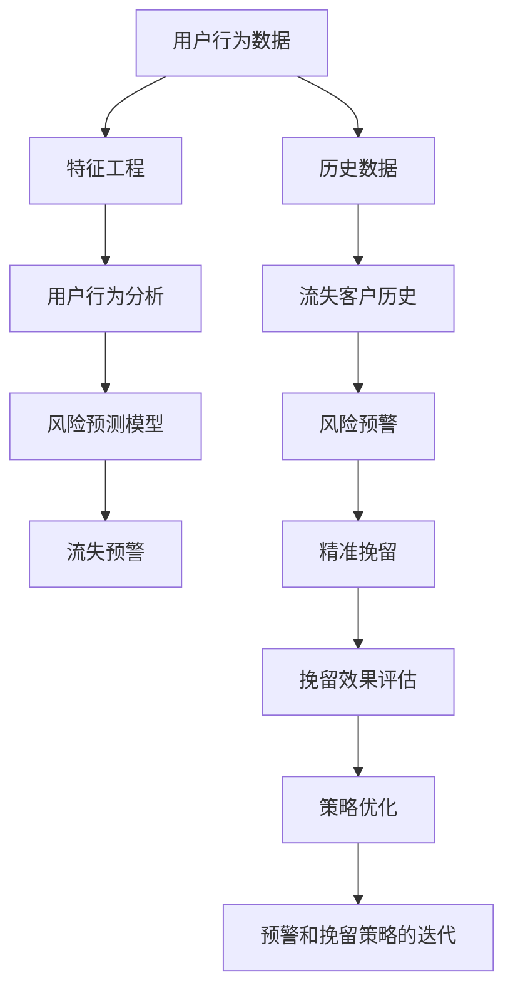

                 

# AI驱动的电商智能客户流失预警与精准挽留系统

> 关键词：客户流失预警,精准挽留系统,人工智能,电商,用户行为分析,推荐系统

## 1. 背景介绍

### 1.1 问题由来

电商行业的竞争日益激烈，客户流失问题日益严峻。根据一项调查，在线零售平台的用户流失率普遍在30%以上。客户流失不仅影响企业的营收，还丧失了重获潜在客户的二次销售机会，增加了营销成本。因此，如何通过客户行为分析，预测客户流失风险，并实施精准挽留策略，成为了电商企业亟需解决的重要问题。

### 1.2 问题核心关键点

本文聚焦于电商行业中的客户流失预警与精准挽留问题，并提出了基于人工智能的解决方案。

核心问题在于：
- 如何利用客户历史行为数据，高效预测客户流失风险？
- 如何在客户流失前及时预警，并采取精准挽留措施？
- 如何量化挽留效果，评价挽留策略的性能？

这些问题涉及客户行为建模、风险预警和精准营销三个方面，需要在多个环节进行协作优化。

## 2. 核心概念与联系

### 2.1 核心概念概述

为了更好地理解AI驱动的客户流失预警与精准挽留系统，我们需要先介绍几个关键概念：

- **客户流失预测（Customer Churn Prediction）**：通过分析客户的长期行为特征，预测其在未来一段时间内流失的可能性。
- **精准挽留（Precision Retention）**：针对高流失风险客户，设计个性化的挽留策略，以降低流失率。
- **用户行为分析（User Behavior Analysis）**：利用数据挖掘和机器学习技术，理解用户的行为模式和需求变化。
- **推荐系统（Recommendation System）**：根据用户兴趣和行为，实时推荐个性化商品或服务，提升用户满意度和留存率。

这些概念之间相互联系，共同构成了客户流失预警与精准挽留的核心框架。

### 2.2 核心概念原理和架构的 Mermaid 流程图



这个流程图展示了从用户行为数据到流失预警和精准挽留的整个流程：

1. 收集用户行为数据，并进行特征工程，提取出对流失预测有帮助的特征。
2. 利用用户行为分析技术，理解用户需求和行为模式。
3. 在历史数据和行为分析的基础上，训练风险预测模型，预测客户流失风险。
4. 根据风险预测结果，进行流失预警。
5. 针对预警的高流失客户，实施个性化精准挽留策略。
6. 评估挽留策略的效果，并优化策略，迭代预警和挽留流程。

## 3. 核心算法原理 & 具体操作步骤

### 3.1 算法原理概述

AI驱动的客户流失预警与精准挽留系统主要基于机器学习和数据挖掘技术，通过以下步骤实现：

1. **数据预处理与特征工程**：对原始用户行为数据进行清洗、标准化和特征提取，提取出对流失预测有用的特征。
2. **风险预测模型构建**：基于预处理后的数据，构建各种风险预测模型，如逻辑回归、随机森林、深度学习等。
3. **流失预警与精准挽留策略设计**：根据预测结果，设计流失预警机制和精准挽留策略，包括个性化推荐、优惠券发放等。
4. **预警效果评估与策略优化**：利用评估指标，如召回率、精确率、流失率等，对预警和挽留效果进行评估，并迭代优化策略。

### 3.2 算法步骤详解

**Step 1: 数据预处理与特征工程**

1. 数据清洗：去除缺失值、异常值，确保数据的完整性和一致性。
2. 特征标准化：将不同量纲的特征转化为标准正态分布，便于后续模型处理。
3. 特征选择与提取：通过相关性分析、主成分分析（PCA）等方法，选择对流失预测有帮助的特征。
4. 特征构建：将用户的基本信息、行为数据等转化为对流失预测有帮助的格式。

**Step 2: 风险预测模型构建**

1. 数据划分：将数据划分为训练集、验证集和测试集。
2. 模型选择：选择适当的模型，如逻辑回归、决策树、随机森林、支持向量机（SVM）、梯度提升树（GBDT）、深度学习模型等。
3. 模型训练：在训练集上训练模型，并使用验证集进行调参，选择最优模型。
4. 模型评估：在测试集上评估模型的性能，确保模型泛化能力。

**Step 3: 流失预警与精准挽留策略设计**

1. 风险评分计算：根据模型预测结果，计算每位用户的风险评分。
2. 预警阈值设置：根据历史数据，确定流失预警的阈值，设置哪些用户为高风险客户。
3. 精准挽留策略设计：针对高风险客户，设计个性化的挽留策略，如优惠券、个性化推荐等。
4. 挽留效果评估：评估挽留策略的效果，如挽留率、客户回访率、生命周期价值（LTV）等。

**Step 4: 预警效果评估与策略优化**

1. 预警效果评估：利用召回率、精确率等指标评估预警的效果。
2. 策略优化：根据评估结果，优化预警和挽留策略，迭代流程。

### 3.3 算法优缺点

基于机器学习的客户流失预警与精准挽留系统有以下优点：

- **高效预测**：机器学习模型可以高效地处理大量数据，预测客户流失风险。
- **实时预警**：通过实时监测用户行为数据，及时预警高流失风险客户。
- **精准挽留**：根据高风险客户的特征和行为，设计个性化挽留策略，提升挽留效果。
- **动态优化**：通过不断评估和优化策略，适应市场和用户的变化，提高系统性能。

但同时，该方法也存在一些局限：

- **数据依赖**：预测模型依赖于高质量的数据，数据的获取和处理成本较高。
- **模型复杂**：复杂的模型需要较多的计算资源和时间，对技术要求较高。
- **隐私风险**：处理用户行为数据时需要注意隐私保护，避免数据泄露。

尽管存在这些局限，但机器学习模型在客户流失预警与精准挽留中仍具有显著的优势，可以有效地提升电商企业的客户留存率和生命周期价值。

### 3.4 算法应用领域

基于机器学习的客户流失预警与精准挽留系统已经在电商、金融、电信等多个领域得到广泛应用，并取得了显著的效果。

- **电商**：通过用户行为分析，预测客户流失风险，并设计个性化推荐策略，提升客户留存率。
- **金融**：利用客户交易和行为数据，预测高风险客户，设计精准挽留策略，降低坏账率。
- **电信**：通过客户通话和网络使用行为，预测流失风险，并提供个性化服务，提高客户满意度。

## 4. 数学模型和公式 & 详细讲解 & 举例说明

### 4.1 数学模型构建

我们以逻辑回归模型为例，介绍客户流失预测的数学模型构建。

假设客户流失风险的预测变量为 $X = [X_1, X_2, ..., X_n]$，其中 $X_i$ 表示第 $i$ 个特征。令 $y$ 为二元变量，表示客户是否流失， $y=1$ 表示流失， $y=0$ 表示未流失。

逻辑回归模型的预测函数为：

$$
P(y|X) = \frac{e^{w^TX + b}}{1 + e^{w^TX + b}}
$$

其中 $w$ 和 $b$ 为模型参数，需要根据训练数据进行拟合。

### 4.2 公式推导过程

1. 构建损失函数：使用二元交叉熵损失函数来评估模型预测结果与真实标签之间的差距。
2. 求梯度：使用梯度下降算法求解模型参数 $w$ 和 $b$。
3. 更新参数：根据梯度信息更新模型参数，使其逐渐逼近最优解。

具体推导如下：

**损失函数**：
$$
L(w,b) = -\frac{1}{N}\sum_{i=1}^N(y_i \log P(y_i|X_i) + (1-y_i)\log(1-P(y_i|X_i)))
$$

**梯度**：
$$
\frac{\partial L(w,b)}{\partial w_j} = \frac{1}{N}\sum_{i=1}^N(x_{i,j}P(y_i|X_i) - (1-y_i)(1-P(y_i|X_i)))
$$

**模型更新**：
$$
w \leftarrow w - \eta \frac{\partial L(w,b)}{\partial w}, \quad b \leftarrow b - \eta \frac{\partial L(w,b)}{\partial b}
$$

其中 $\eta$ 为学习率，$x_{i,j}$ 为第 $i$ 个样本的第 $j$ 个特征。

### 4.3 案例分析与讲解

假设我们有一家在线零售平台，有如下用户行为数据：

| 用户ID | 购买次数 | 浏览时长 | 下单金额 | 评价评分 | 是否流失 |
| --- | --- | --- | --- | --- | --- |
| A | 10 | 300 | 1000 | 4.5 | 0 |
| B | 5 | 100 | 500 | 3.0 | 1 |
| C | 20 | 500 | 2000 | 4.8 | 0 |
| ... | ... | ... | ... | ... | ... |

我们假设流失与否的预测变量为 $X=[X_1, X_2, X_3, X_4]$，其中 $X_1$ 表示购买次数，$X_2$ 表示浏览时长，$X_3$ 表示下单金额，$X_4$ 表示评价评分。我们可以将这些数据输入逻辑回归模型，训练得到最优模型参数 $w$ 和 $b$，最终得到每个用户的风险评分。

## 5. 项目实践：代码实例和详细解释说明

### 5.1 开发环境搭建

在进行客户流失预警与精准挽留系统的开发前，我们需要准备好开发环境。以下是使用Python进行PyTorch开发的环境配置流程：

1. 安装Anaconda：从官网下载并安装Anaconda，用于创建独立的Python环境。

2. 创建并激活虚拟环境：
```bash
conda create -n ecommerce_env python=3.8 
conda activate ecommerce_env
```

3. 安装PyTorch：根据CUDA版本，从官网获取对应的安装命令。例如：
```bash
conda install pytorch torchvision torchaudio cudatoolkit=11.1 -c pytorch -c conda-forge
```

4. 安装Pandas、NumPy、Scikit-learn等工具包：
```bash
pip install pandas numpy scikit-learn tqdm
```

5. 安装相关库：
```bash
pip install eli5 catboost joblib xgboost
```

6. 安装HuggingFace Transformers库：
```bash
pip install transformers
```

完成上述步骤后，即可在`ecommerce_env`环境中开始项目开发。

### 5.2 源代码详细实现

下面我们以客户流失预测和精准挽留为例，给出使用PyTorch和Scikit-learn进行开发的代码实现。

首先，我们导入相关库并加载数据：

```python
import pandas as pd
import numpy as np
from sklearn.model_selection import train_test_split
from sklearn.linear_model import LogisticRegression
from sklearn.metrics import confusion_matrix, classification_report
import torch
from torch import nn
from torch.utils.data import TensorDataset, DataLoader

# 加载数据
data = pd.read_csv('customer_data.csv')
```

接着，我们进行数据预处理与特征工程：

```python
# 特征选择与构建
features = ['purchase_times', 'browsing_duration', 'shopping_amount', 'review_score']
X = data[features].values
y = data['churn'].values

# 标准化特征
X = (X - X.mean()) / X.std()

# 划分数据集
X_train, X_test, y_train, y_test = train_test_split(X, y, test_size=0.3, random_state=42)

# 构建TensorDataset
train_dataset = TensorDataset(torch.tensor(X_train), torch.tensor(y_train))
test_dataset = TensorDataset(torch.tensor(X_test), torch.tensor(y_test))
```

然后，我们定义逻辑回归模型并进行训练：

```python
class LogisticRegressionModel(nn.Module):
    def __init__(self, input_size, output_size):
        super(LogisticRegressionModel, self).__init__()
        self.linear = nn.Linear(input_size, output_size)

    def forward(self, x):
        y_pred = self.linear(x)
        return torch.sigmoid(y_pred)

# 初始化模型
model = LogisticRegressionModel(input_size=X_train.shape[1], output_size=1)

# 定义损失函数和优化器
loss_fn = nn.BCELoss()
optimizer = torch.optim.Adam(model.parameters(), lr=0.01)

# 训练模型
for epoch in range(100):
    model.train()
    optimizer.zero_grad()
    y_pred = model(X_train)
    loss = loss_fn(y_pred, y_train)
    loss.backward()
    optimizer.step()

# 评估模型
model.eval()
y_pred = model(X_test)
y_pred = (y_pred > 0.5).long()
accuracy = (y_pred == y_test).float().mean()
print('Accuracy:', accuracy.item())
```

最后，我们设计预警与挽留策略并进行评估：

```python
from sklearn.metrics import roc_auc_score
from sklearn.ensemble import RandomForestClassifier

# 定义随机森林模型
clf = RandomForestClassifier()

# 训练模型
clf.fit(X_train, y_train)

# 预测风险评分
y_pred = clf.predict_proba(X_train)[:, 1]
print('AUC:', roc_auc_score(y_train, y_pred))

# 预警阈值设置
threshold = 0.8

# 预警高风险客户
high_risk_customers = np.where(y_pred > threshold)[0]

# 设计个性化挽留策略
# 如优惠券、个性化推荐等

# 评估预警效果
tp, fp, tn, fn = confusion_matrix(y_test, y_pred > threshold).ravel()
print('Confusion Matrix:', (tp, fp, tn, fn))
print('Precision:', (tp / (tp + fp)).item())
print('Recall:', (tp / (tp + fn)).item())
```

以上就是使用PyTorch和Scikit-learn进行客户流失预警与精准挽留的完整代码实现。可以看到，基于机器学习的预测模型能够高效地预测客户流失风险，并指导企业采取精准的挽留措施，提升客户留存率。

### 5.3 代码解读与分析

以下是关键代码的解读与分析：

**数据预处理**：
- 使用Pandas库读取CSV数据，并进行特征选择和标准化。
- 使用Scikit-learn库的train_test_split函数划分数据集。

**模型构建**：
- 定义逻辑回归模型，使用PyTorch库实现。
- 定义损失函数和优化器，使用Adam算法进行模型训练。

**预警与挽留策略设计**：
- 使用RandomForestClassifier进行模型训练，预测风险评分。
- 设置预警阈值，识别高风险客户。
- 设计个性化挽留策略，如优惠券、个性化推荐等。

**预警效果评估**：
- 使用Scikit-learn库的confusion_matrix函数计算混淆矩阵，评估预警效果。
- 计算精度和召回率，评估预警效果。

## 6. 实际应用场景

### 6.1 电商行业应用

在电商行业，客户流失预警与精准挽留系统可以帮助企业及时识别高流失风险客户，并提供个性化推荐和优惠，降低流失率，提升客户留存率和复购率。具体应用场景包括：

- **客户分类与预警**：根据客户的历史行为数据，将客户分为高、中、低流失风险三类，并通过预警系统及时通知相关人员。
- **个性化推荐与优惠券**：对高流失风险客户，提供个性化商品推荐和优惠券，提升客户满意度和留存率。
- **流失客户分析**：对流失客户进行详细分析，找出流失原因，优化产品和服务，提升整体客户体验。

### 6.2 金融行业应用

在金融行业，客户流失预警与精准挽留系统可以帮助银行、保险公司等金融机构识别高风险客户，并提供针对性服务，降低坏账率，提升客户满意度和忠诚度。具体应用场景包括：

- **信用评分与预警**：根据客户的信用历史和行为数据，预测客户违约风险，并及时预警。
- **客户服务与支持**：对高风险客户，提供更频繁的客户服务与支持，提升客户体验和满意度。
- **产品优化与营销**：根据客户流失原因，优化金融产品和服务，并设计针对性的营销策略，提升客户留存率。

### 6.3 电信行业应用

在电信行业，客户流失预警与精准挽留系统可以帮助电信运营商识别高流失风险用户，并提供个性化服务和优惠，降低流失率，提升用户满意度和忠诚度。具体应用场景包括：

- **通话行为分析**：根据用户的通话行为数据，预测流失风险，并及时预警。
- **网络服务优化**：对高流失风险用户，提供更优质的网络服务，提升用户满意度。
- **增值服务推荐**：根据用户的行为数据，推荐个性化增值服务，提升用户粘性和留存率。

### 6.4 未来应用展望

随着数据科学和人工智能技术的不断发展，客户流失预警与精准挽留系统将在更多领域得到应用，并带来新的创新和突破：

- **多模态数据融合**：结合用户行为数据、社交媒体数据、地理位置数据等，进行多模态数据融合，提升预测和预警的准确性。
- **深度学习模型**：采用深度学习模型如CNN、RNN、Transformer等，提升模型的预测能力和泛化能力。
- **实时预警与实时分析**：通过实时监测用户行为数据，实现实时预警和分析，及时采取挽留措施。
- **个性化推荐与内容生成**：利用自然语言处理技术，生成个性化的推荐文本，提升用户体验和满意度。

## 7. 工具和资源推荐

### 7.1 学习资源推荐

为了帮助开发者系统掌握客户流失预警与精准挽留技术的理论基础和实践技巧，这里推荐一些优质的学习资源：

1. 《机器学习》（周志华）：全面介绍机器学习的基本概念和经典算法，是机器学习领域必读之书。
2. 《深度学习》（Ian Goodfellow）：深度学习领域的经典教材，涵盖深度学习的基本原理和应用案例。
3. 《Python数据科学手册》（Jake VanderPlas）：介绍了Python在数据科学和机器学习中的应用，包括Pandas、NumPy、Scikit-learn等库的使用。
4. Kaggle：提供丰富的机器学习竞赛和数据集，是学习和实践机器学习的绝佳平台。
5. GitHub：GitHub上有很多优秀的机器学习项目和代码，可以学习和借鉴。

### 7.2 开发工具推荐

高效的开发离不开优秀的工具支持。以下是几款用于客户流失预警与精准挽留开发的常用工具：

1. PyTorch：基于Python的开源深度学习框架，灵活动态的计算图，适合快速迭代研究。大部分预训练语言模型都有PyTorch版本的实现。
2. TensorFlow：由Google主导开发的开源深度学习框架，生产部署方便，适合大规模工程应用。
3. Scikit-learn：Python中的机器学习库，提供简单易用的机器学习算法和工具。
4. Pandas：Python中的数据处理库，支持数据清洗、标准化、特征工程等。
5. Jupyter Notebook：轻量级的开发工具，支持代码编辑、代码运行和数据展示，适合进行交互式学习和开发。

### 7.3 相关论文推荐

客户流失预警与精准挽留技术的发展源于学界的持续研究。以下是几篇奠基性的相关论文，推荐阅读：

1. "Customer Churn Prediction Using Machine Learning: A Review"：综述了多种机器学习模型在客户流失预测中的应用效果。
2. "Predicting Customer Churn: A Data Mining Approach"：利用分类算法和关联规则挖掘客户流失原因。
3. "Deep Learning for Customer Churn Prediction"：使用深度学习模型进行客户流失预测，提升了预测精度。
4. "Social Media Sentiment Analysis for Customer Churn Prediction"：利用社交媒体情感分析预测客户流失风险。
5. "Personalized Recommendations for Customer Retention"：利用推荐系统提升客户留存率，设计个性化推荐策略。

这些论文代表了大数据挖掘和机器学习在客户流失预测与精准挽留领域的发展脉络。通过学习这些前沿成果，可以帮助研究者把握学科前进方向，激发更多的创新灵感。

## 8. 总结：未来发展趋势与挑战

### 8.1 研究成果总结

本文对客户流失预警与精准挽留系统进行了全面系统的介绍。首先阐述了客户流失预警与精准挽留问题的重要性，明确了预测和挽留策略设计的关键点。其次，从原理到实践，详细讲解了机器学习模型在客户流失预警与精准挽留中的应用，给出了完整的代码实现。同时，本文还广泛探讨了系统在电商、金融、电信等多个领域的应用前景，展示了系统的巨大潜力。此外，本文精选了相关学习资源和工具，力求为读者提供全方位的技术指引。

通过本文的系统梳理，可以看到，客户流失预警与精准挽留系统已经成为了电商、金融等行业的重要技术手段，提升了客户留存率和生命周期价值。未来，伴随数据科学和人工智能技术的不断发展，系统将能够更好地处理复杂多变的数据，实现更加精准的预警和挽留。

### 8.2 未来发展趋势

展望未来，客户流失预警与精准挽留系统将呈现以下几个发展趋势：

1. **数据融合与多模态分析**：利用多模态数据进行融合分析，提升预测和预警的准确性。
2. **深度学习模型**：采用深度学习模型提升模型的预测能力和泛化能力，提升预警和挽留效果。
3. **实时预警与实时分析**：通过实时监测用户行为数据，实现实时预警和分析，及时采取挽留措施。
4. **个性化推荐与内容生成**：利用自然语言处理技术，生成个性化的推荐文本，提升用户体验和满意度。
5. **动态优化与自适应学习**：利用在线学习算法，根据用户行为和反馈实时优化模型，提升系统的自适应能力。
6. **解释性与公平性**：提升模型的可解释性和公平性，确保模型决策的透明性和公正性。

这些趋势凸显了客户流失预警与精准挽留系统的广阔前景，推动其在更多行业和场景中的应用。

### 8.3 面临的挑战

尽管客户流失预警与精准挽留系统已经取得了显著的成果，但在迈向更加智能化、普适化应用的过程中，仍面临诸多挑战：

1. **数据获取与处理**：高质量的数据获取和处理成本较高，尤其是在多模态数据融合的情况下。
2. **模型复杂性**：深度学习模型的计算资源和时间消耗较大，对技术要求较高。
3. **隐私与安全性**：处理用户行为数据时需要注意隐私保护和数据安全性，避免数据泄露。
4. **可解释性与透明性**：模型决策过程需要可解释性和透明性，避免"黑箱"系统。
5. **公平性与偏见**：模型的公平性与偏见问题需要重视，避免对特定群体的歧视。

这些挑战需要在未来的研究中不断解决，才能实现客户流失预警与精准挽留系统的广泛应用。

### 8.4 研究展望

面对客户流失预警与精准挽留系统所面临的挑战，未来的研究需要在以下几个方面寻求新的突破：

1. **多模态数据融合与智能感知**：结合用户行为数据、社交媒体数据、地理位置数据等，进行多模态数据融合，提升预测和预警的准确性。
2. **自适应学习与实时优化**：利用在线学习算法，根据用户行为和反馈实时优化模型，提升系统的自适应能力。
3. **深度学习模型与强化学习**：结合深度学习和强化学习技术，提升模型的预测能力和决策能力。
4. **可解释性与透明性**：提升模型的可解释性和透明性，确保模型决策的透明性和公正性。
5. **公平性与偏见**：优化模型的公平性与偏见问题，避免对特定群体的歧视。

这些研究方向的研究突破，必将推动客户流失预警与精准挽留系统的应用范围和效果，为电商、金融、电信等行业带来新的发展机遇。

## 9. 附录：常见问题与解答

**Q1：如何选择合适的机器学习模型？**

A: 选择机器学习模型需要考虑以下几个方面：
1. 数据量与特征维度：数据量较小、特征维度较低时，选择线性模型如逻辑回归、线性回归等。数据量较大、特征维度较高时，选择树模型如随机森林、梯度提升树等。
2. 模型复杂度：模型复杂度较高时，如深度学习模型，需要更多计算资源和时间。模型复杂度较低时，如线性模型，计算资源和时间消耗较少。
3. 预测精度与计算成本：需要在精度和成本之间进行权衡，选择最优模型。

**Q2：如何处理缺失数据和异常值？**

A: 处理缺失数据和异常值的方法包括：
1. 删除缺失值：删除缺失值较多的样本，或删除缺失值较多的特征。
2. 填补缺失值：使用均值、中位数、众数等填补缺失值，或使用插值法进行填充。
3. 异常值处理：使用统计方法如Z-score、IQR等识别和处理异常值。

**Q3：如何评估模型的性能？**

A: 模型性能评估的方法包括：
1. 准确率（Accuracy）：预测正确的样本数占总样本数的比例。
2. 精确率（Precision）：预测为正类的样本中，实际为正类的比例。
3. 召回率（Recall）：实际为正类的样本中，被预测为正类的比例。
4. F1值：精确率和召回率的调和平均数，综合评估模型性能。
5. ROC曲线：绘制真正率与假正率之间的关系曲线，评估模型的分类性能。

**Q4：如何设计个性化的挽留策略？**

A: 设计个性化挽留策略需要考虑以下几个方面：
1. 客户细分：根据客户的属性、行为、历史交易记录等进行细分，识别不同客户群体的特征。
2. 产品推荐：根据客户的兴趣和行为，推荐个性化商品或服务。
3. 优惠券发放：设计个性化优惠券，提高客户响应率和转化率。
4. 个性化内容：根据客户的行为和兴趣，生成个性化的推荐文本或视频，提升用户体验。

**Q5：如何评估挽留策略的效果？**

A: 评估挽留策略的效果需要考虑以下几个指标：
1. 流失率（Churn Rate）：流失客户的比例。
2. 回访率（Return Rate）：回访客户的比例。
3. 生命周期价值（Lifetime Value, LTV）：客户在其生命周期内的总消费价值。
4. 客户满意度（Customer Satisfaction, CSAT）：客户对产品或服务的满意度。
5. 客户净推荐值（Net Promoter Score, NPS）：客户推荐意愿的指标。

这些指标可以帮助企业全面评估挽留策略的效果，并优化策略，提升客户留存率。

---

作者：禅与计算机程序设计艺术 / Zen and the Art of Computer Programming

