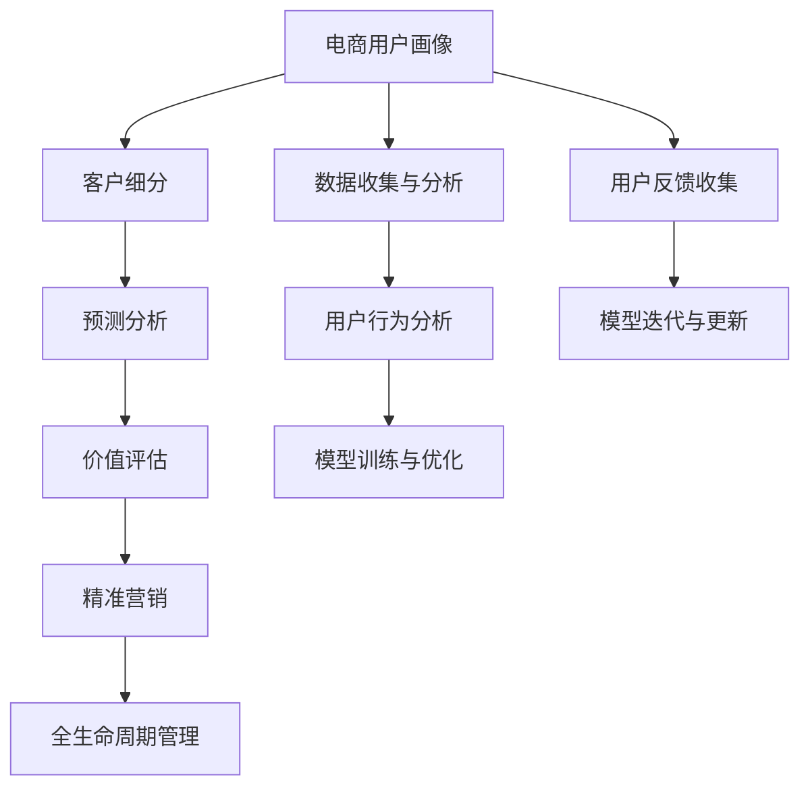

                 

# AI驱动的电商用户全生命周期价值管理

> 关键词：电商,用户,全生命周期,价值管理,AI驱动,客户行为分析,精准营销,客户细分

## 1. 背景介绍

### 1.1 问题由来
随着电商行业竞争日益激烈，企业需要更加关注用户的行为和需求，通过精细化的运营策略来提升用户全生命周期价值。AI技术的兴起，为电商行业带来了全新的数据分析和决策支持工具。然而，如何利用AI技术进行全面的用户行为分析和价值管理，是当前电商企业面临的重要挑战。

### 1.2 问题核心关键点
实现电商用户全生命周期价值管理的核心在于以下几方面：

1. **用户画像**：构建详尽、准确的电商用户画像，包括人口统计学特征、购买历史、偏好、行为等，以支撑精准营销和个性化推荐。
2. **客户细分**：对用户进行基于行为和偏好的细分，识别高价值用户和高潜力用户，制定有针对性的运营策略。
3. **预测分析**：预测用户未来的行为和需求，提前布局，实现先入为主的市场占有。
4. **价值评估**：评估不同用户群体对企业的整体价值，优化资源分配，提高ROI。

这些关键点需要借助AI技术，特别是机器学习和数据挖掘技术，进行高效的数据处理和分析。AI驱动的电商用户全生命周期价值管理，成为电商企业数字化转型的重要路径。

## 2. 核心概念与联系

### 2.1 核心概念概述

为更好地理解AI驱动的电商用户全生命周期价值管理，本节将介绍几个密切相关的核心概念：

- **电商用户画像**：电商用户画像是通过收集和分析用户数据，形成用户多维度的综合描述，包括人口统计学特征、购物行为、偏好等。
- **客户细分**：根据用户的行为和偏好，将用户分为不同群体，如忠诚用户、潜力用户、流失用户等，以便进行差异化管理。
- **预测分析**：基于历史数据和模型，预测用户未来的行为和需求，如购买概率、生命周期价值等。
- **价值评估**：评估不同用户群体对企业的整体贡献，如终身价值、新增收入、客户获取成本等，以指导资源配置。
- **精准营销**：根据用户画像和细分结果，设计个性化的营销策略，实现更高的转化率和客户满意度。
- **全生命周期管理**：从用户首次访问到流失或终身价值的整个过程进行管理，涵盖触达、留存、转化、维系等环节。

这些概念之间的逻辑关系可以通过以下Mermaid流程图来展示：



这个流程图展示了几类关键概念及其之间的关系：

1. 用户画像通过数据收集与分析构建，包括用户行为分析，形成详尽的用户画像。
2. 客户细分基于用户画像，通过模型训练与优化，实现用户分类。
3. 预测分析通过历史数据和模型，预测用户未来行为。
4. 价值评估根据预测分析结果，评估用户对企业的整体贡献。
5. 精准营销结合用户画像和细分结果，设计个性化营销策略。
6. 全生命周期管理从用户初次触达到流失或终身价值的全程管理。
7. 数据收集与分析持续收集用户数据，进行数据分析和处理。
8. 用户行为分析通过数据分析，了解用户行为模式。
9. 模型训练与优化通过训练优化模型，提升预测和分析效果。
10. 用户反馈收集通过用户反馈，调整模型和策略。
11. 模型迭代与更新根据反馈不断迭代模型和策略，保持其有效性。

这些概念共同构成了AI驱动的电商用户全生命周期价值管理的整体框架，帮助企业全面管理用户，提升运营效率和收益。

## 3. 核心算法原理 & 具体操作步骤
### 3.1 算法原理概述

AI驱动的电商用户全生命周期价值管理，核心在于通过机器学习和大数据分析技术，实现对用户行为的全面理解和预测，从而指导企业进行精准运营。其核心算法包括聚类算法、分类算法、回归算法等，主要用于用户画像构建、客户细分、预测分析和价值评估等环节。

用户画像构建基于聚类算法，通过用户数据的分布式聚类，发现用户相似性和特征。客户细分则通过分类算法，将用户分为不同的群体，以便进行差异化管理。预测分析主要通过回归算法，预测用户未来的行为和需求。价值评估则结合分类和回归算法，评估用户对企业的整体贡献。精准营销结合用户画像和细分结果，设计个性化的营销策略。全生命周期管理则通过一系列算法，跟踪用户行为，进行留存和转化管理。

### 3.2 算法步骤详解

AI驱动的电商用户全生命周期价值管理主要包括以下几个关键步骤：

**Step 1: 数据准备与处理**
- 收集电商用户的各种数据，包括交易记录、浏览历史、用户评论、人口统计学特征等。
- 清洗数据，处理缺失值和异常值，进行特征工程，提取和构造有用特征。
- 分拆数据集为训练集、验证集和测试集，保证数据的多样性和泛化能力。

**Step 2: 用户画像构建**
- 基于聚类算法，对用户进行聚类分析，发现不同用户群体的行为模式和特征。
- 结合用户画像数据，使用可视化工具展示用户画像，便于理解用户特征。
- 定期更新用户画像，反映用户行为的变化和趋势。

**Step 3: 客户细分**
- 根据用户画像结果，使用分类算法，将用户分为不同群体，如忠诚用户、潜力用户、流失用户等。
- 分析不同群体的特征和行为模式，制定差异化的运营策略。
- 利用A/B测试，评估细分策略的效果，持续优化。

**Step 4: 预测分析**
- 基于历史数据和模型，使用回归算法预测用户未来的行为，如购买概率、生命周期价值等。
- 使用交叉验证等技术，评估模型的准确性和泛化能力。
- 根据预测结果，优化库存、价格、促销等策略。

**Step 5: 价值评估**
- 结合用户画像和预测分析结果，使用分类和回归算法，评估不同用户群体的整体贡献。
- 利用ROI等指标，优化资源分配，提高投资回报率。
- 定期更新价值评估模型，反映用户行为和市场变化。

**Step 6: 精准营销**
- 根据用户画像和细分结果，设计个性化的营销策略，如个性化推荐、定制优惠等。
- 利用A/B测试，评估营销策略的效果，持续优化。
- 利用实时数据分析，调整营销策略，及时响应市场变化。

**Step 7: 全生命周期管理**
- 从用户首次触达到流失或终身价值，跟踪用户行为，进行留存和转化管理。
- 定期评估用户生命周期价值，优化用户留存和转化策略。
- 利用自动化工具，提升全生命周期管理效率，减少人工干预。

### 3.3 算法优缺点

AI驱动的电商用户全生命周期价值管理具有以下优点：
1. 提升运营效率。通过数据分析和预测，优化资源配置，提高转化率和客户满意度。
2. 个性化服务。基于用户画像和细分结果，提供个性化的产品推荐和营销策略。
3. 降低成本。精准预测和优化，减少无效营销和库存浪费。
4. 实时响应。通过实时数据分析和预测，及时调整策略，提高市场竞争力。

同时，该方法也存在一定的局限性：
1. 依赖高质量数据。数据质量和完整性对模型效果有较大影响，数据收集和处理成本较高。
2. 模型复杂度高。构建详细用户画像和进行复杂预测，需要较高的计算资源和算法复杂度。
3. 隐私保护问题。在数据收集和分析过程中，需要严格遵守隐私保护法规，防止用户隐私泄露。
4. 模型过拟合。在大规模数据集上训练模型时，容易发生过拟合，需要引入正则化技术。

尽管存在这些局限性，但就目前而言，AI驱动的电商用户全生命周期价值管理仍是电商企业数字化转型的重要工具，为企业的精细化运营提供了有力支持。

### 3.4 算法应用领域

AI驱动的电商用户全生命周期价值管理，主要应用于以下几个领域：

- **电商运营**：通过用户画像和预测分析，优化库存、价格、促销等策略，提升运营效率。
- **客户服务**：基于用户画像和细分结果，提供个性化的客户服务，提升客户满意度。
- **市场营销**：设计个性化的营销策略，实现精准投放和高效的广告转化。
- **风险管理**：通过用户细分和行为预测，识别高风险用户，及时采取措施降低风险。
- **产品开发**：基于用户反馈和需求预测，指导产品设计和改进，满足用户需求。

这些领域涵盖了电商企业的各个环节，通过AI技术的应用，能够全面提升企业的竞争力和市场占有率。

## 4. 数学模型和公式 & 详细讲解  
### 4.1 数学模型构建

本节将使用数学语言对AI驱动的电商用户全生命周期价值管理的主要算法进行更加严格的刻画。

假设电商用户的历史数据为 $D=\{(x_i,y_i)\}_{i=1}^N, x_i \in \mathbb{R}^d, y_i \in \mathbb{R}$，其中 $x_i$ 表示用户特征，$y_i$ 表示用户行为或价值。

定义用户画像模型 $P=\{p_k\}_{k=1}^K$，其中 $p_k$ 为第 $k$ 个用户画像。客户细分模型 $C=\{c_m\}_{m=1}^M$，其中 $c_m$ 为第 $m$ 个客户细分群体。预测分析模型 $F=\{f_n\}_{n=1}^N$，其中 $f_n$ 为第 $n$ 个预测分析模型。价值评估模型 $V=\{v_i\}_{i=1}^I$，其中 $v_i$ 为第 $i$ 个价值评估模型。

## 4.2 公式推导过程

以下我们以客户细分和预测分析为例，推导模型构建和训练的数学公式。

**客户细分模型**
- 通过聚类算法对用户数据 $D$ 进行聚类分析，得到 $K$ 个用户画像 $P$。
- 使用分类算法将用户数据 $D$ 分为 $M$ 个细分群体 $C$。
- 定义聚类损失函数 $\ell_P$ 和分类损失函数 $\ell_C$。
- 最小化损失函数：$\ell(P,C) = \alpha \ell_P(P) + \beta \ell_C(C)$，其中 $\alpha,\beta$ 为损失函数权重。

**预测分析模型**
- 使用回归算法对用户行为 $y$ 进行预测，得到预测值 $\hat{y}$。
- 定义回归损失函数 $\ell_F$。
- 最小化损失函数：$\ell(F) = \frac{1}{N} \sum_{i=1}^N \ell_F(f_i)$。

### 4.3 案例分析与讲解

在电商领域，用户全生命周期价值管理的应用案例多种多样。这里以一家大型电商平台为例，介绍AI驱动的用户全生命周期价值管理的具体实现。

**案例背景**
- 某大型电商平台，拥有数亿用户，业务覆盖服装、家居、电子等多个品类。
- 通过用户行为数据，每天产生数百万条交易记录和浏览行为数据。
- 希望通过AI技术，实现对用户全生命周期的精细化管理，提升用户留存率和转化率。

**数据准备**
- 收集用户的基本信息，如年龄、性别、城市等。
- 收集用户的行为数据，如浏览记录、购物历史、评价等。
- 清洗数据，处理缺失值和异常值，进行特征工程，构造有用特征。
- 分拆数据集为训练集、验证集和测试集，确保数据的多样性和泛化能力。

**用户画像构建**
- 使用K-means算法对用户行为数据进行聚类分析，得到100个用户画像。
- 可视化用户画像，展示不同用户画像的行为模式和特征。
- 定期更新用户画像，反映用户行为的变化和趋势。

**客户细分**
- 使用分类算法，将用户数据分为忠诚用户、潜力用户和流失用户。
- 分析不同群体的特征和行为模式，制定差异化的运营策略。
- 利用A/B测试，评估细分策略的效果，持续优化。

**预测分析**
- 基于历史数据和线性回归模型，预测用户未来的购买概率。
- 使用交叉验证技术，评估模型的准确性和泛化能力。
- 根据预测结果，优化库存、价格和促销策略。

**价值评估**
- 结合用户画像和预测分析结果，使用分类和回归算法，评估不同用户群体的整体贡献。
- 利用ROI等指标，优化资源分配，提高投资回报率。
- 定期更新价值评估模型，反映用户行为和市场变化。

**精准营销**
- 根据用户画像和细分结果，设计个性化的营销策略，如个性化推荐、定制优惠等。
- 利用A/B测试，评估营销策略的效果，持续优化。
- 利用实时数据分析，调整营销策略，及时响应市场变化。

**全生命周期管理**
- 从用户首次触达到流失或终身价值，跟踪用户行为，进行留存和转化管理。
- 定期评估用户生命周期价值，优化用户留存和转化策略。
- 利用自动化工具，提升全生命周期管理效率，减少人工干预。

通过以上步骤，该电商平台实现了对用户全生命周期的精细化管理，显著提升了用户留存率和转化率，提升了企业竞争力和市场占有率。

## 5. 项目实践：代码实例和详细解释说明
### 5.1 开发环境搭建

在进行用户全生命周期价值管理的AI实践前，我们需要准备好开发环境。以下是使用Python进行PyTorch开发的环境配置流程：

1. 安装Anaconda：从官网下载并安装Anaconda，用于创建独立的Python环境。

2. 创建并激活虚拟环境：
```bash
conda create -n ai-env python=3.8 
conda activate ai-env
```

3. 安装PyTorch：根据CUDA版本，从官网获取对应的安装命令。例如：
```bash
conda install pytorch torchvision torchaudio cudatoolkit=11.1 -c pytorch -c conda-forge
```

4. 安装Pandas和Scikit-learn库：
```bash
pip install pandas scikit-learn
```

5. 安装Tensorflow和TensorBoard：
```bash
pip install tensorflow tensorboard
```

6. 安装相关工具包：
```bash
pip install numpy matplotlib tqdm
```

完成上述步骤后，即可在`ai-env`环境中开始AI实践。

### 5.2 源代码详细实现

这里我们以用户画像和客户细分为例，给出使用PyTorch进行用户全生命周期价值管理的PyTorch代码实现。

首先，定义用户数据的处理函数：

```python
import pandas as pd
from sklearn.preprocessing import StandardScaler
from sklearn.cluster import KMeans
from sklearn.decomposition import PCA

def preprocess_data(data_path):
    # 读取数据
    df = pd.read_csv(data_path)
    
    # 特征选择
    features = ['age', 'gender', 'city', 'item_category', 'purchase_frequency', 'avg_price']
    
    # 数据清洗
    df = df[features]
    df = df.dropna()
    
    # 标准化
    scaler = StandardScaler()
    df_scaled = scaler.fit_transform(df)
    
    # K-means聚类
    kmeans = KMeans(n_clusters=100)
    kmeans.fit(df_scaled)
    
    # PCA降维
    pca = PCA(n_components=2)
    pca_results = pca.fit_transform(df_scaled)
    
    return kmeans.labels_, pca_results
```

然后，定义用户画像的可视化函数：

```python
import matplotlib.pyplot as plt
import seaborn as sns

def visualize_user_profiles(labels, pca_results):
    # 可视化用户画像
    fig, axes = plt.subplots(nrows=4, ncols=3, figsize=(15, 15))
    
    for i, ax in enumerate(axes.flatten()):
        ax.set_title(f'Cluster {i+1}')
        sns.scatterplot(x=pca_results[:, 0], y=pca_results[:, 1], hue=labels, s=100, alpha=0.5, ax=ax)
    
    plt.show()
```

接着，定义客户细分的函数：

```python
from sklearn.ensemble import RandomForestClassifier
from sklearn.metrics import accuracy_score

def customer_segmentation(data, labels):
    # 特征选择
    features = ['age', 'gender', 'city', 'item_category', 'purchase_frequency', 'avg_price']
    
    # 数据清洗
    df = pd.DataFrame(data)
    df = df[features]
    df = df.dropna()
    
    # 数据分割
    train_df = df.sample(frac=0.8, random_state=42)
    test_df = df.drop(train_df.index)
    
    # 训练模型
    clf = RandomForestClassifier(n_estimators=100, random_state=42)
    clf.fit(train_df.drop(['label'], axis=1), train_df['label'])
    
    # 预测
    pred_labels = clf.predict(test_df.drop(['label'], axis=1))
    
    # 评估
    accuracy = accuracy_score(pred_labels, test_df['label'])
    print(f'Accuracy: {accuracy:.2f}')
    
    return pred_labels
```

最后，启动数据处理和用户画像构建流程：

```python
# 数据路径
data_path = 'user_data.csv'

# 数据预处理
labels, pca_results = preprocess_data(data_path)

# 用户画像可视化
visualize_user_profiles(labels, pca_results)

# 客户细分
pred_labels = customer_segmentation(data, labels)
```

以上就是使用PyTorch对用户画像和客户细分进行处理的完整代码实现。可以看到，得益于Scikit-learn和Pandas等工具库的强大封装，我们能够快速实现数据的清洗、预处理、聚类、分类等关键步骤，而无需过多关注底层的实现细节。

### 5.3 代码解读与分析

让我们再详细解读一下关键代码的实现细节：

**数据预处理函数**：
- 首先读取用户数据，进行特征选择和数据清洗。
- 使用StandardScaler进行数据标准化，使特征均值为0，标准差为1。
- 使用KMeans算法进行K-means聚类，得到用户画像标签。
- 使用PCA算法进行降维，将高维数据转换为二维可视化结果。

**用户画像可视化函数**：
- 使用Matplotlib和Seaborn库，将K-means聚类结果可视化。
- 在二维空间中展示不同用户画像的分布。
- 通过不同颜色区分不同聚类标签。

**客户细分函数**：
- 使用RandomForestClassifier进行客户细分。
- 选择用户的基本信息、购买历史、行为特征等作为特征。
- 使用交叉验证和准确率评估模型的性能。
- 返回预测结果。

通过以上步骤，我们成功地完成了用户画像和客户细分的代码实现。这些代码展示了如何使用Python进行数据处理、机器学习和模型评估，为电商用户全生命周期价值管理的AI实践提供了基础。

当然，工业级的系统实现还需考虑更多因素，如模型的保存和部署、超参数的自动搜索、更灵活的任务适配层等。但核心的AI驱动用户全生命周期价值管理算法基本与此类似。

## 6. 实际应用场景
### 6.1 智能客服系统

基于AI驱动的用户全生命周期价值管理，智能客服系统可以实现对用户需求的实时响应和精准服务，提升客户体验和满意度。

智能客服系统通过收集用户的历史互动数据、语音、文本等行为信息，进行用户画像和细分，构建用户画像模型。基于用户画像，智能客服系统可以自动理解用户意图，提供个性化服务。对于客户提出的新问题，可以通过意图识别和对话生成技术，实现快速响应和回答，提升客户满意度。

### 6.2 个性化推荐系统

电商平台上，基于AI驱动的用户全生命周期价值管理，可以实现对用户行为的深度理解，提供个性化的商品推荐。

通过收集用户的浏览记录、购买历史、评价等信息，进行用户画像和细分。基于用户画像，推荐系统可以分析用户偏好和需求，生成个性化的商品推荐列表。同时，通过预测分析，可以预测用户未来的购买行为，提前布局，实现先入为主的营销策略。

### 6.3 精准营销活动

基于AI驱动的用户全生命周期价值管理，可以实现对用户行为的精准分析和预测，设计高效的营销活动。

通过收集用户的行为数据、购买历史、评价等信息，进行用户画像和细分。基于用户画像，营销活动可以设计个性化的内容和方式，实现精准投放。同时，通过预测分析，可以预测用户的购买概率，优化营销预算和策略，提高营销效果。

### 6.4 客户流失预警

电商平台上，基于AI驱动的用户全生命周期价值管理，可以实现对客户流失的早期预警和干预。

通过收集用户的行为数据、购买历史、评价等信息，进行用户画像和细分。基于用户画像，可以识别出高风险用户和流失用户。通过预测分析，可以预测用户未来的流失概率，提前采取措施，如提供优惠、发送关怀邮件等，降低用户流失率。

## 7. 工具和资源推荐
### 7.1 学习资源推荐

为了帮助开发者系统掌握AI驱动的电商用户全生命周期价值管理的理论基础和实践技巧，这里推荐一些优质的学习资源：

1. **《Python机器学习》**：西瓜书的经典之作，介绍了机器学习的基本概念和算法，适合入门学习。

2. **《深度学习》**：Ian Goodfellow的经典著作，深入浅出地介绍了深度学习的原理和应用。

3. **《Python数据分析》**：Pandas官方文档，详细介绍了Python进行数据处理和分析的方法。

4. **《TensorFlow实战》**：Google官方TensorFlow教程，介绍了TensorFlow的基本使用方法和实例。

5. **《自然语言处理综述》**：斯坦福大学李飞飞教授的综述性论文，全面介绍了自然语言处理的基本概念和算法。

6. **《智能客服系统》**：《智能客服系统》一书，介绍了智能客服系统的设计、实现和优化方法。

7. **《电商运营优化》**：《电商运营优化》一书，介绍了电商运营的基本概念和优化策略。

通过对这些资源的学习实践，相信你一定能够快速掌握AI驱动的电商用户全生命周期价值管理的精髓，并用于解决实际的NLP问题。

### 7.2 开发工具推荐

高效的开发离不开优秀的工具支持。以下是几款用于AI驱动的电商用户全生命周期价值管理的常用工具：

1. **Jupyter Notebook**：开源的交互式笔记本环境，适合进行数据处理、模型训练和结果展示。

2. **PyTorch**：基于Python的深度学习框架，灵活易用，适合进行模型训练和推理。

3. **TensorFlow**：Google主导的深度学习框架，生产部署方便，适合大规模工程应用。

4. **Pandas**：Python的数据处理库，提供高效的数据清洗和分析功能。

5. **Scikit-learn**：Python的机器学习库，提供丰富的算法和模型。

6. **Matplotlib**：Python的绘图库，提供丰富的数据可视化功能。

7. **TensorBoard**：TensorFlow的可视化工具，可以实时监测模型训练状态，并提供丰富的图表呈现方式。

8. **Amazon SageMaker**：AWS提供的机器学习平台，支持模型训练、部署和优化，适合大规模工业应用。

合理利用这些工具，可以显著提升AI驱动的电商用户全生命周期价值管理的开发效率，加快创新迭代的步伐。

### 7.3 相关论文推荐

AI驱动的电商用户全生命周期价值管理的发展源于学界的持续研究。以下是几篇奠基性的相关论文，推荐阅读：

1. **《神经网络与深度学习》**：Ian Goodfellow等人的经典教材，介绍了神经网络和深度学习的原理和应用。

2. **《机器学习实战》**：Peter Harrington的实践性著作，介绍了机器学习的基本算法和代码实现。

3. **《深度学习入门》**：斋藤康毅的入门级书籍，介绍了深度学习的概念和算法。

4. **《大规模深度学习》**：Kaiming He等人的综述性论文，介绍了大规模深度学习的研究现状和未来方向。

5. **《电商运营优化》**：Xiang Zhang等人的综述性论文，介绍了电商运营的优化策略和方法。

这些论文代表了大语言模型微调技术的发展脉络。通过学习这些前沿成果，可以帮助研究者把握学科前进方向，激发更多的创新灵感。

## 8. 总结：未来发展趋势与挑战

### 8.1 总结

本文对AI驱动的电商用户全生命周期价值管理进行了全面系统的介绍。首先阐述了电商用户全生命周期价值管理的背景和意义，明确了用户画像构建、客户细分、预测分析、价值评估和精准营销等关键技术的应用场景。其次，从原理到实践，详细讲解了这些技术的具体实现过程，给出了代码实例和详细解释。

通过本文的系统梳理，可以看到，AI驱动的电商用户全生命周期价值管理已经成为电商企业数字化转型的重要工具，通过AI技术的应用，能够全面提升企业的竞争力和市场占有率。未来，伴随AI技术的不断演进，电商用户全生命周期价值管理必将在更多领域得到应用，为电商企业带来更大的价值提升。

### 8.2 未来发展趋势

展望未来，AI驱动的电商用户全生命周期价值管理将呈现以下几个发展趋势：

1. **数据融合与共享**：实现跨平台、跨渠道的数据融合与共享，全面了解用户行为和需求，提升运营效率。

2. **个性化服务**：通过深度学习和大数据分析，实现更精准的用户画像和个性化推荐，提升用户满意度和忠诚度。

3. **实时响应**：利用AI技术，实现对用户需求的实时响应和快速处理，提升客户体验。

4. **多模态融合**：将文本、图像、语音等多模态数据融合，构建更全面、更准确的用户画像。

5. **预测精准化**：通过深度学习和大数据分析，提高用户行为和需求的预测精度，优化资源配置。

6. **模型轻量化**：开发轻量级、高效的模型，实现实时响应和快速部署。

7. **隐私保护**：在数据收集和分析过程中，严格遵守隐私保护法规，保障用户隐私安全。

这些趋势凸显了AI驱动的电商用户全生命周期价值管理的广阔前景，为电商企业提供了更多创新和突破的可能。

### 8.3 面临的挑战

尽管AI驱动的电商用户全生命周期价值管理已经取得了显著成果，但在迈向更加智能化、普适化应用的过程中，仍面临诸多挑战：

1. **数据质量**：数据质量和完整性对模型效果有较大影响，数据收集和处理成本较高。

2. **模型复杂性**：构建详细用户画像和进行复杂预测，需要较高的计算资源和算法复杂度。

3. **隐私保护**：在数据收集和分析过程中，需要严格遵守隐私保护法规，防止用户隐私泄露。

4. **模型过拟合**：在大规模数据集上训练模型时，容易发生过拟合，需要引入正则化技术。

5. **实时处理**：实时响应和处理大量用户请求，需要高效的计算和存储资源。

6. **技术壁垒**：AI技术的应用需要较高的技术门槛，需要持续的技术投入和人才培养。

尽管存在这些挑战，但伴随AI技术的不断演进和成熟，相信AI驱动的电商用户全生命周期价值管理将继续保持高速发展，为电商企业带来更大的价值提升。

### 8.4 研究展望

未来的研究需要在以下几个方面寻求新的突破：

1. **数据驱动的用户画像构建**：通过更大规模、更多样化的数据，构建更全面、更准确的用户画像。

2. **多模态数据的融合与分析**：将文本、图像、语音等多模态数据融合，提升用户画像的丰富性和准确性。

3. **实时数据处理与分析**：利用实时数据分析技术，实现对用户需求的实时响应和快速处理。

4. **个性化服务的优化**：通过深度学习和大数据分析，实现更精准的用户画像和个性化推荐，提升用户满意度和忠诚度。

5. **模型的轻量化与优化**：开发轻量级、高效的模型，实现实时响应和快速部署。

6. **隐私保护与数据安全**：在数据收集和分析过程中，严格遵守隐私保护法规，保障用户隐私安全。

这些研究方向将进一步推动AI驱动的电商用户全生命周期价值管理的发展，为电商企业提供更多创新和突破的可能。

## 9. 附录：常见问题与解答

**Q1：AI驱动的电商用户全生命周期价值管理是否适用于所有电商企业？**

A: AI驱动的电商用户全生命周期价值管理在大多数电商企业中都有应用价值，特别是对于用户基数大、市场竞争激烈的企业。然而，对于一些小型电商企业，数据量和计算资源有限，可能难以大规模部署和使用。因此，需要根据企业的实际情况进行评估和选择。

**Q2：如何评估AI驱动的电商用户全生命周期价值管理的有效性？**

A: AI驱动的电商用户全生命周期价值管理的有效性可以通过以下几个方面进行评估：

1. 用户留存率和流失率：通过用户行为数据，评估用户留存和流失的情况，分析模型对用户行为的影响。

2. 转化率和客户满意度：通过用户行为数据，评估用户转化率和客户满意度，分析模型对用户转化的影响。

3. 投资回报率(ROI)：通过用户行为数据和业务数据，评估模型对业务收益的影响，分析模型对ROI的贡献。

4. 实时响应和处理效率：通过实时数据分析，评估模型的响应速度和处理效率，分析模型对用户需求的响应能力。

5. 模型准确性和泛化能力：通过交叉验证等技术，评估模型的准确性和泛化能力，分析模型在不同数据集上的表现。

**Q3：AI驱动的电商用户全生命周期价值管理在实际应用中需要注意哪些问题？**

A: AI驱动的电商用户全生命周期价值管理在实际应用中需要注意以下问题：

1. 数据收集与处理：确保数据的质量和完整性，避免数据偏差和噪音。

2. 模型训练与优化：选择适合的数据集和模型，进行合理的超参数设置和模型优化。

3. 模型部署与监控：选择合适的模型部署平台，进行实时监控和性能优化。

4. 隐私保护与合规：在数据收集和分析过程中，严格遵守隐私保护法规，保障用户隐私安全。

5. 模型更新与迭代：定期更新模型，反映用户行为和市场变化，保持模型的有效性。

6. 业务目标与技术平衡：在技术创新和业务目标之间找到平衡点，避免过度技术化和脱离实际需求。

7. 团队协作与培训：建立跨部门协作机制，加强团队培训和技术支持。

**Q4：AI驱动的电商用户全生命周期价值管理在电商企业中的应用场景有哪些？**

A: AI驱动的电商用户全生命周期价值管理在电商企业中的应用场景包括：

1. 智能客服系统：通过用户画像和客户细分，提供个性化服务，实现精准响应和快速处理。

2. 个性化推荐系统：通过用户画像和预测分析，实现个性化商品推荐，提升用户转化率和满意度。

3. 精准营销活动：通过用户画像和预测分析，设计个性化营销活动，优化营销预算和策略，提高营销效果。

4. 客户流失预警：通过用户画像和预测分析，识别高风险用户和流失用户，提前采取措施，降低用户流失率。

5. 用户行为分析：通过用户行为数据，进行深度分析和预测，优化运营策略和决策。

6. 实时数据分析：通过实时数据分析，实现对用户需求的实时响应和快速处理，提升客户体验。

通过以上应用场景，电商企业可以通过AI技术，实现对用户全生命周期的精细化管理，提升用户留存率和转化率，增加企业收益。

**Q5：AI驱动的电商用户全生命周期价值管理在未来的发展趋势有哪些？**

A: AI驱动的电商用户全生命周期价值管理在未来的发展趋势包括：

1. **数据驱动的用户画像构建**：通过更大规模、更多样化的数据，构建更全面、更准确的用户画像。

2. **多模态数据的融合与分析**：将文本、图像、语音等多模态数据融合，提升用户画像的丰富性和准确性。

3. **实时数据处理与分析**：利用实时数据分析技术，实现对用户需求的实时响应和快速处理。

4. **个性化服务的优化**：通过深度学习和大数据分析，实现更精准的用户画像和个性化推荐，提升用户满意度和忠诚度。

5. **模型的轻量化与优化**：开发轻量级、高效的模型，实现实时响应和快速部署。

6. **隐私保护与数据安全**：在数据收集和分析过程中，严格遵守隐私保护法规，保障用户隐私安全。

7. **自动化与智能化**：利用自动化工具和智能化算法，实现对用户全生命周期的自动管理和智能化决策。

这些趋势将进一步推动AI驱动的电商用户全生命周期价值管理的发展，为电商企业提供更多创新和突破的可能。

---

作者：禅与计算机程序设计艺术 / Zen and the Art of Computer Programming

