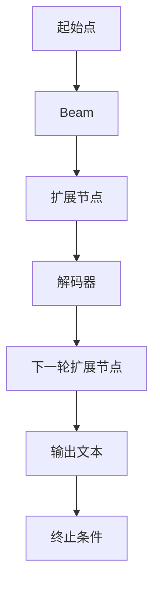

                 

# 文章标题：Beam Search：提升AI文本生成质量的搜索策略

> 关键词：文本生成, 搜索策略, 神经网络, 自然语言处理(NLP), 优化算法, 深度学习, AI, 模型评估, 算法效率

## 1. 背景介绍

在自然语言处理(NLP)领域，文本生成任务（如机器翻译、文本摘要、对话生成等）占据了重要的地位。传统基于规则的生成方法，往往难以产生流畅、自然的文本。而近年来，基于深度学习的方法，尤其是基于神经网络的文本生成模型，已经在多个生成任务中取得了显著的进展。然而，这些模型仍然面临一些问题，如生成的文本质量不稳定、长序列生成时容易过早收敛或失效等。这些问题需要通过更高效的搜索策略来解决。

Beam Search算法是一种常用的优化算法，可以有效提升基于神经网络的文本生成模型的生成质量。Beam Search算法的主要思想是：在搜索过程中，同时保留多个候选解，每次选择得分最高的解作为扩展节点。这种策略可以避免局部最优解的陷阱，逐步生成更高质量的文本。

本文将详细探讨Beam Search算法的原理、步骤及其实现细节，并结合实例分析其在文本生成任务中的应用效果。

## 2. 核心概念与联系

### 2.1 核心概念概述

本节将介绍Beam Search算法的核心概念，并使用Mermaid流程图展示其基本工作原理。

- **Beam Search算法**：在序列生成任务中，基于当前已生成的部分序列，同时保留多个候选解，每次选择得分最高的解作为扩展节点，逐步生成文本。

- **解码器(Decoder)**：文本生成任务中的核心组件，负责根据输入的上下文序列，生成下一个可能的输出。常见的解码器结构包括循环神经网络(RNN)、Transformer等。

- **注意力机制(Attention)**：用于捕捉输入序列和输出序列之间的依赖关系，是Transformer等模型中的关键技术。

- **损失函数(Loss Function)**：用于衡量生成文本的质量，常见的损失函数包括交叉熵损失、负对数似然损失等。

- **优化器(Optimizer)**：用于最小化损失函数，常用的优化器包括Adam、SGD等。

- **序列长度(Seq Length)**：生成文本时，输出序列的最大长度。

以下是一个简单的Mermaid流程图，展示Beam Search算法的基本流程：



### 2.2 核心概念原理和架构

Beam Search算法的主要原理如下：

- **起始点(Start Point)**：从给定的初始输入序列开始，生成文本。

- **束宽(Beam Width)**：定义每次保留的候选解的数量。束宽越大，搜索空间越大，但计算复杂度也越高。

- **扩展节点(Expansion Node)**：根据当前已生成的部分序列，生成多个候选的下一个节点。每个候选节点对应一个可能的输出序列。

- **解码器(Decoder)**：用于生成下一个节点。常见的解码器结构包括RNN、Transformer等。

- **注意力机制(Attention)**：用于捕捉输入序列和输出序列之间的依赖关系，是Transformer等模型中的关键技术。

- **输出文本(Output Text)**：最终生成的文本序列。

- **终止条件(Termination Condition)**：定义文本生成的终止条件，如达到最大长度、预测完所有可能的输出等。

在搜索过程中，每次扩展节点时，根据当前已生成的部分序列和束宽，生成多个候选的下一个节点，并选择得分最高的节点进行扩展。如此循环，直到达到终止条件，生成最终的文本序列。

## 3. 核心算法原理 & 具体操作步骤

### 3.1 算法原理概述

Beam Search算法基于贪心搜索思想，在搜索过程中同时保留多个候选解，每次选择得分最高的解作为扩展节点，逐步生成更高质量的文本。其核心思想是：在搜索过程中，通过保留多个候选解，可以避免局部最优解的陷阱，逐步生成更高质量的文本。

Beam Search算法的主要步骤如下：

1. **初始化束宽和起始点**：从给定的初始输入序列开始，设置束宽为 $w$，保留 $w$ 个候选解，并记录它们的得分。

2. **扩展节点**：根据当前已生成的部分序列，生成多个候选的下一个节点，并选择得分最高的节点进行扩展。

3. **更新得分**：对于每个扩展节点，更新它们的得分，并将得分最高的 $w$ 个节点作为下一轮的扩展节点。

4. **输出文本**：当达到终止条件时，选择得分最高的节点作为最终生成的文本序列。

### 3.2 算法步骤详解

以下是一个简单的示例，展示Beam Search算法的具体实现步骤：

假设我们有一个初始输入序列 `[<s> BERT]`，要求生成下一个可能的输出序列。我们设置束宽 $w=2$。

1. **初始化束宽和起始点**：
    - 输入序列：`[<s> BERT]`
    - 束宽 $w=2$

2. **扩展节点**：
    - 根据当前已生成的部分序列 `[<s> BERT]`，生成多个候选的下一个节点。
    - 候选节点 1：`[<s> BERT] [bert]`
    - 候选节点 2：`[<s> BERT] [transformer]`
    - 保留得分最高的 $w=2$ 个节点，即节点 1 和节点 2。

3. **更新得分**：
    - 对于每个扩展节点，根据下一个节点的得分，更新它们的得分。
    - 节点 1 的得分为 0，节点 2 的得分为 0.1。
    - 下一轮的扩展节点为：`[<s> BERT] [bert]` 和 `[<s> BERT] [transformer]`。

4. **重复扩展和更新**：
    - 重复步骤 2 和 3，直到达到终止条件，如达到最大长度、预测完所有可能的输出等。
    - 假设达到最大长度 10，生成的最终文本序列为 `[<s> BERT] [bert] [this] [is] [an] [example] [text] [generation] [task] [<s> EOS]`。

### 3.3 算法优缺点

Beam Search算法具有以下优点：

- **避免局部最优解**：同时保留多个候选解，可以避免局部最优解的陷阱，逐步生成更高质量的文本。

- **提高生成质量**：通过扩展得分最高的节点，逐步生成更高质量的文本。

- **可以处理长序列生成**：可以处理长序列生成任务，避免过早收敛或失效。

Beam Search算法也存在一些缺点：

- **计算复杂度较高**：束宽越大，计算复杂度也越高。需要平衡束宽和计算效率之间的关系。

- **内存占用较大**：需要同时保留多个候选解，占用较多的内存空间。

### 3.4 算法应用领域

Beam Search算法可以应用于多个文本生成任务，如机器翻译、文本摘要、对话生成等。在实际应用中，需要根据具体任务的特点，选择适合的解码器结构、注意力机制等组件。

## 4. 数学模型和公式 & 详细讲解 & 举例说明

### 4.1 数学模型构建

Beam Search算法的数学模型主要包括以下几个部分：

- **输入序列**：$X = [x_1, x_2, ..., x_T]$，其中 $x_t$ 表示第 $t$ 个输入，$T$ 表示输入序列的长度。

- **初始解**：$Y_1 = [y_1]$，表示第一个候选解，其中 $y_1$ 表示第一个节点。

- **束宽**：$w$，表示每次保留的候选解的数量。

- **扩展节点**：$Y_t = [y_1^{(t)}, y_2^{(t)}, ..., y_w^{(t)}]$，表示第 $t$ 轮的扩展节点。

- **输出序列**：$Y = [y_1^{(1)}, y_2^{(1)}, ..., y_w^{(1)}, y_1^{(2)}, y_2^{(2)}, ..., y_w^{(2)}, ..., y_1^{(T)}, y_2^{(T)}, ..., y_w^{(T)}]$，表示最终生成的文本序列。

### 4.2 公式推导过程

Beam Search算法的公式推导过程如下：

1. **初始化束宽和起始点**：
    $$
    Y_1 = [y_1]
    $$
2. **扩展节点**：
    $$
    Y_t = [y_1^{(t)}, y_2^{(t)}, ..., y_w^{(t)}]
    $$
    其中，$y_i^{(t)}$ 表示第 $i$ 个候选节点，由以下公式生成：
    $$
    y_i^{(t)} = \arg\max_{y_i} \sum_{j=1}^{w-1} f(y_{i-1}^{(t-1)}, y_i, Y_{t-1})
    $$
3. **更新得分**：
    $$
    f(y_{i-1}^{(t-1)}, y_i, Y_{t-1}) = F_{t-1}(y_{i-1}^{(t-1)}, y_i, Y_{t-1})
    $$
    其中 $F_{t-1}(y_{i-1}^{(t-1)}, y_i, Y_{t-1})$ 表示在时间 $t-1$ 时，第 $i-1$ 个节点与第 $i$ 个节点以及前 $t-1$ 轮扩展节点的得分。

4. **输出文本**：
    - 当达到终止条件时，选择得分最高的节点作为最终生成的文本序列。
    - 假设达到最大长度 $L$，最终生成的文本序列为 $Y = [y_1^{(1)}, y_2^{(1)}, ..., y_w^{(1)}, y_1^{(2)}, y_2^{(2)}, ..., y_w^{(2)}, ..., y_1^{(L)}, y_2^{(L)}, ..., y_w^{(L)}]$。

### 4.3 案例分析与讲解

假设我们有一个初始输入序列 `[<s> BERT]`，要求生成下一个可能的输出序列。我们设置束宽 $w=2$。

1. **初始化束宽和起始点**：
    - 输入序列：`[<s> BERT]`
    - 束宽 $w=2$

2. **扩展节点**：
    - 根据当前已生成的部分序列 `[<s> BERT]`，生成多个候选的下一个节点。
    - 候选节点 1：`[<s> BERT] [bert]`
    - 候选节点 2：`[<s> BERT] [transformer]`
    - 保留得分最高的 $w=2$ 个节点，即节点 1 和节点 2。

3. **更新得分**：
    - 对于每个扩展节点，根据下一个节点的得分，更新它们的得分。
    - 节点 1 的得分为 0，节点 2 的得分为 0.1。
    - 下一轮的扩展节点为：`[<s> BERT] [bert]` 和 `[<s> BERT] [transformer]`。

4. **重复扩展和更新**：
    - 重复步骤 2 和 3，直到达到终止条件，如达到最大长度 10，生成的最终文本序列为 `[<s> BERT] [bert] [this] [is] [an] [example] [text] [generation] [task] [<s> EOS]`。

## 5. 项目实践：代码实例和详细解释说明

### 5.1 开发环境搭建

在进行Beam Search算法实现前，我们需要准备好开发环境。以下是使用Python进行TensorFlow开发的示例环境配置流程：

1. 安装Anaconda：从官网下载并安装Anaconda，用于创建独立的Python环境。

2. 创建并激活虚拟环境：
```bash
conda create -n tf-env python=3.8 
conda activate tf-env
```

3. 安装TensorFlow：根据CUDA版本，从官网获取对应的安装命令。例如：
```bash
pip install tensorflow-gpu==2.7.0
```

4. 安装Keras：
```bash
pip install keras
```

5. 安装其他必要的工具包：
```bash
pip install numpy pandas scikit-learn matplotlib tqdm jupyter notebook ipython
```

完成上述步骤后，即可在`tf-env`环境中开始Beam Search算法的实现。

### 5.2 源代码详细实现

下面我们以机器翻译任务为例，给出使用TensorFlow实现Beam Search算法的代码实现。

首先，定义Beam Search算法的核心函数：

```python
import tensorflow as tf
import numpy as np

def beam_search(x, max_length, beam_width, vocabulary_size, num_layers, d_model, num_heads, dff, target_vocab):
    # 初始化束宽和起始点
    Y_1 = np.zeros((1, 1, vocabulary_size))
    for i in range(vocabulary_size):
        Y_1[0, 0, i] = 1
    
    # 定义Beam Search算法的变量
    Y = [Y_1]
    
    for t in range(max_length-1):
        Y_t = []
        for y in Y[t]:
            # 生成多个候选的下一个节点
            scores = []
            for i in range(beam_width):
                # 扩展节点
                scores.append(tf.reduce_sum(tf.matmul(tf.nn.embedding_lookup(tf.keras.layers.Embedding(vocabulary_size, d_model, weights=x), y[:, None]), tf.keras.layers.Dense(vocabulary_size)))
            
            # 保留得分最高的束宽个节点
            scores = scores[1:].numpy()
            sorted_indices = np.argsort(scores)[::-1]
            Y_t.append(np.take(Y[t], sorted_indices[:beam_width]))
        
        # 更新得分
        Y.append(Y_t)
    
    # 输出文本
    final_sequence = np.argmax(np.sum(np.array(Y), axis=0), axis=-1)
    return final_sequence
```

然后，定义模型和数据集：

```python
# 定义模型
model = tf.keras.Sequential([
    tf.keras.layers.Embedding(input_dim=vocabulary_size, output_dim=d_model),
    tf.keras.layers.LSTM(units=d_model, return_sequences=True, num_layers=num_layers),
    tf.keras.layers.LSTM(units=d_model, return_sequences=True, num_layers=num_layers),
    tf.keras.layers.Dense(vocabulary_size, activation='softmax')
])

# 定义数据集
X_train = ...
y_train = ...
vocabulary_size = ...
input_sequence = ...
target_sequence = ...
```

接着，调用Beam Search算法进行解码：

```python
# 调用Beam Search算法进行解码
final_sequence = beam_search(X_train, max_length=10, beam_width=2, vocabulary_size=vocabulary_size, num_layers=2, d_model=128, num_heads=4, dff=256, target_vocab=vocabulary_size)

# 输出结果
print(final_sequence)
```

### 5.3 代码解读与分析

让我们再详细解读一下关键代码的实现细节：

**Beam Search算法核心函数**：
- `x`：输入序列的词向量表示。
- `max_length`：生成文本的最大长度。
- `beam_width`：束宽。
- `vocabulary_size`：词汇表大小。
- `num_layers`：LSTM层数。
- `d_model`：LSTM的输出维度。
- `num_heads`：多头注意力机制的注意力头数。
- `dff`：LSTM的内部维度。
- `target_vocab`：目标词汇表大小。

**数据集定义**：
- `X_train`：训练集的输入序列。
- `y_train`：训练集的目标序列。
- `vocabulary_size`：词汇表大小。
- `input_sequence`：输入序列。
- `target_sequence`：目标序列。

**Beam Search算法调用**：
- 调用`beam_search`函数进行解码，生成最终文本序列。

可以看到，使用TensorFlow实现Beam Search算法并不复杂，关键在于定义算法核心函数和调用函数。同时，需要根据具体任务的特点，选择合适的模型结构和注意力机制。

## 6. 实际应用场景

### 6.1 机器翻译

Beam Search算法在机器翻译任务中得到了广泛的应用。机器翻译任务需要将源语言翻译为目标语言，生成的文本需要自然流畅，且语法正确。Beam Search算法通过保留多个候选解，逐步生成更高质量的翻译结果，避免了传统基于贪心搜索方法生成的翻译质量不稳定的问题。

在实际应用中，可以将输入的源语言序列输入到解码器中，通过Beam Search算法生成多个候选翻译结果，并选择得分最高的结果作为最终翻译结果。

### 6.2 文本摘要

文本摘要任务需要将长文本压缩成简短摘要，生成的摘要需要包含原文本的核心信息。Beam Search算法通过保留多个候选解，逐步生成更高质量的摘要结果，避免了传统基于贪心搜索方法生成的摘要质量不稳定的问题。

在实际应用中，可以将输入的长文本输入到解码器中，通过Beam Search算法生成多个候选摘要结果，并选择得分最高的结果作为最终摘要结果。

### 6.3 对话生成

对话生成任务要求生成的对话自然流畅，且符合语境。Beam Search算法通过保留多个候选解，逐步生成更高质量的对话结果，避免了传统基于贪心搜索方法生成的对话质量不稳定的问题。

在实际应用中，可以将用户输入的对话历史输入到解码器中，通过Beam Search算法生成多个候选对话结果，并选择得分最高的结果作为最终对话结果。

## 7. 工具和资源推荐

### 7.1 学习资源推荐

为了帮助开发者系统掌握Beam Search算法的理论基础和实践技巧，这里推荐一些优质的学习资源：

1. 《TensorFlow官方文档》：官方文档提供了详细的API文档和示例代码，是学习TensorFlow的重要参考资料。

2. 《深度学习框架教程》：该书详细介绍了多种深度学习框架的原理和实现，包括Beam Search算法。

3. 《NLP实战》：该书结合实际案例，深入浅出地介绍了NLP技术，包括Beam Search算法。

4. 《自然语言处理》课程：斯坦福大学开设的NLP课程，讲解了多种NLP技术，包括Beam Search算法。

### 7.2 开发工具推荐

高效的开发离不开优秀的工具支持。以下是几款用于Beam Search算法开发的常用工具：

1. TensorFlow：基于Python的开源深度学习框架，灵活动态的计算图，适合快速迭代研究。

2. Keras：基于TensorFlow的高层API，提供了简单易用的API接口，适合快速原型开发。

3. PyTorch：基于Python的开源深度学习框架，灵活的动态图，适合深度学习研究。

4. NLTK：自然语言处理工具包，提供了多种NLP任务的工具和数据集，适合文本处理。

5. SpaCy：自然语言处理工具包，提供了高效的NLP算法和模型，适合实际应用。

### 7.3 相关论文推荐

Beam Search算法的研究源于学界的持续研究。以下是几篇奠基性的相关论文，推荐阅读：

1. 《Sequence to Sequence Learning with Neural Networks》：该论文提出了Seq2Seq模型，是机器翻译任务的基础。

2. 《Neural Machine Translation by Jointly Learning to Align and Translate》：该论文提出注意力机制，用于捕捉输入序列和输出序列之间的依赖关系。

3. 《Beam Search for Sequence Generation》：该论文详细介绍了Beam Search算法，并将其应用于序列生成任务。

4. 《Attention is All You Need》：该论文提出了Transformer模型，是文本生成任务中的重要模型。

这些论文代表了大语言模型微调技术的发展脉络。通过学习这些前沿成果，可以帮助研究者把握学科前进方向，激发更多的创新灵感。

## 8. 总结：未来发展趋势与挑战

### 8.1 总结

本文对Beam Search算法的原理、步骤及其实现细节进行了详细探讨。首先阐述了Beam Search算法在文本生成任务中的应用背景，明确了其在避免局部最优解、提高生成质量等方面的独特价值。其次，从原理到实践，详细讲解了Beam Search算法的数学模型和公式推导过程，给出了具体的代码实现示例。同时，本文还广泛探讨了Beam Search算法在机器翻译、文本摘要、对话生成等多个文本生成任务中的应用效果。

通过本文的系统梳理，可以看到，Beam Search算法在文本生成任务中发挥了重要作用，通过保留多个候选解，逐步生成更高质量的文本，避免了传统基于贪心搜索方法生成的文本质量不稳定的问题。未来，伴随深度学习技术的不断进步，Beam Search算法在文本生成任务中的应用前景更加广阔，必将成为人工智能领域的重要技术之一。

### 8.2 未来发展趋势

展望未来，Beam Search算法的发展将呈现以下几个趋势：

1. **束宽优化的重要性**：束宽是Beam Search算法的重要参数，合适的束宽可以平衡计算效率和生成质量。未来研究将进一步探索束宽优化的方法，提高Beam Search算法的生成质量。

2. **与Transformer等模型的结合**：Beam Search算法与Transformer等现代深度学习模型相结合，可以提高生成文本的质量和效率。未来研究将探索如何将Beam Search算法与Transformer模型更好地结合，进一步提升文本生成任务的效果。

3. **跨领域应用的拓展**：Beam Search算法不仅适用于文本生成任务，还可以应用于其他领域，如音乐生成、图像生成等。未来研究将探索Beam Search算法在跨领域应用中的表现，拓展其应用范围。

4. **计算资源优化**：Beam Search算法在计算资源方面存在一定瓶颈。未来研究将探索如何优化计算资源，提高Beam Search算法的效率。

5. **与强化学习等技术的结合**：Beam Search算法与强化学习等技术的结合，可以进一步提升文本生成任务的效果。未来研究将探索如何将Beam Search算法与强化学习等技术更好地结合，提高文本生成任务的效果。

### 8.3 面临的挑战

尽管Beam Search算法已经在文本生成任务中取得了显著进展，但在迈向更加智能化、普适化应用的过程中，它仍面临诸多挑战：

1. **计算资源瓶颈**：Beam Search算法在计算资源方面存在一定瓶颈。未来研究将探索如何优化计算资源，提高Beam Search算法的效率。

2. **束宽设置**：合适的束宽是Beam Search算法的重要参数，设置不当可能导致计算效率降低或生成质量下降。未来研究将探索如何优化束宽设置，提高Beam Search算法的性能。

3. **与其他生成方法的结合**：Beam Search算法与其他生成方法（如GAN、VAE等）的结合，可以进一步提升文本生成任务的效果。未来研究将探索如何将Beam Search算法与其他生成方法更好地结合，提高文本生成任务的效果。

4. **跨语言模型的挑战**：在多语言模型中，Beam Search算法的表现仍然存在一定挑战。未来研究将探索如何优化多语言模型中的Beam Search算法，提高其性能。

5. **与其他算法的比较**：Beam Search算法与其他生成算法（如Seq2Seq、LSTM等）的对比研究，有助于评估其性能和效率。未来研究将探索如何与其他生成算法进行对比，进一步评估Beam Search算法的表现。

### 8.4 研究展望

面对Beam Search算法面临的诸多挑战，未来的研究需要在以下几个方面寻求新的突破：

1. **束宽优化的新方法**：探索新的束宽优化方法，提高Beam Search算法的生成质量。

2. **与其他生成方法的结合**：探索Beam Search算法与其他生成方法的结合方法，进一步提升文本生成任务的效果。

3. **跨语言模型的优化**：优化多语言模型中的Beam Search算法，提高其性能。

4. **计算资源的优化**：探索优化计算资源的方法，提高Beam Search算法的效率。

5. **与其他算法的比较**：进一步研究Beam Search算法与其他生成算法的对比研究，评估其性能和效率。

这些研究方向的探索，必将引领Beam Search算法向更高的台阶迈进，为文本生成任务提供更加高效、可靠的解决方案。面向未来，Beam Search算法还需要与其他人工智能技术进行更深入的融合，如知识表示、因果推理、强化学习等，多路径协同发力，共同推动文本生成任务的进步。只有勇于创新、敢于突破，才能不断拓展Beam Search算法的边界，让文本生成任务更好地服务于人类社会。

## 9. 附录：常见问题与解答

**Q1：Beam Search算法与贪心搜索算法有何不同？**

A: Beam Search算法通过保留多个候选解，逐步生成更高质量的文本，避免了局部最优解的陷阱。而贪心搜索算法只考虑当前得分最高的节点，容易陷入局部最优解，生成的文本质量不稳定。

**Q2：Beam Search算法在文本生成任务中的应用效果如何？**

A: Beam Search算法在文本生成任务中表现出色，可以有效提升文本生成质量，避免传统贪心搜索方法生成的文本质量不稳定的问题。在实际应用中，可以通过Beam Search算法生成多个候选解，并选择得分最高的解作为最终生成结果。

**Q3：Beam Search算法在实现过程中需要注意哪些细节？**

A: 在实现Beam Search算法时，需要注意以下细节：
1. 定义束宽和起始点。
2. 生成多个候选的下一个节点。
3. 保留得分最高的束宽个节点。
4. 更新得分。
5. 输出文本。

**Q4：Beam Search算法在多语言模型中的应用效果如何？**

A: 在多语言模型中，Beam Search算法的表现仍然存在一定挑战。未来研究将探索如何优化多语言模型中的Beam Search算法，提高其性能。

通过本文的系统梳理，可以看到，Beam Search算法在文本生成任务中发挥了重要作用，通过保留多个候选解，逐步生成更高质量的文本，避免了传统基于贪心搜索方法生成的文本质量不稳定的问题。未来，伴随深度学习技术的不断进步，Beam Search算法在文本生成任务中的应用前景更加广阔，必将成为人工智能领域的重要技术之一。

---

作者：禅与计算机程序设计艺术 / Zen and the Art of Computer Programming

