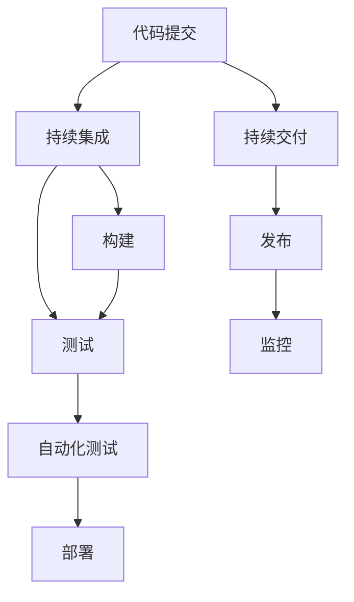

                 

# CI/CD管道：自动化软件交付流程

## 1. 背景介绍

随着软件开发和交付流程的复杂度不断提升，持续集成（Continuous Integration, CI）和持续交付（Continuous Delivery, CD）的概念逐渐成为软件开发实践中的标准流程。CI/CD管道（Pipeline）作为自动化软件交付流程的关键组成部分，它将开发、测试、部署等环节紧密结合，确保了软件的快速、稳定和高质量交付。在快速变化的数字化时代，CI/CD管道已成为软件开发团队不可或缺的一部分。

## 2. 核心概念与联系

### 2.1 核心概念概述

CI/CD管道的核心概念主要包括以下几个方面：

- **持续集成（CI）**：通过自动化地构建、测试和集成代码，持续监控代码质量，及早发现和修复问题。
- **持续交付（CD）**：在开发过程中，通过自动化测试和部署流程，快速且可靠地将软件交付给用户或生产环境。
- **自动化测试**：通过编写测试用例，自动运行测试套件，确保代码的正确性和稳定性。
- **版本控制（Version Control）**：记录代码的变更历史，支持分支、合并、回滚等操作。
- **构建（Build）**：通过编译、打包等步骤，生成可执行或可部署的制品。
- **部署（Deployment）**：将制品自动部署到目标环境，进行发布和运行。
- **管道（Pipeline）**：通过一系列有序的自动化任务，组成可重复执行的流程。

### 2.2 核心概念原理和架构的 Mermaid 流程图



这个流程图展示了CI/CD管道的整体流程：

1. 开发者通过代码提交到版本控制系统。
2. 代码提交触发CI流程，自动构建和测试代码。
3. 如果构建和测试成功，进入CD流程，自动部署到目标环境。
4. 部署后的软件进入监控环节，持续监控其运行状态。

## 3. 核心算法原理 & 具体操作步骤

### 3.1 算法原理概述

CI/CD管道是基于流水线（Pipeline）和自动化（Automation）的思想实现的。其核心算法原理是，通过将软件开发流程划分为多个独立的自动化任务，每个任务执行特定的操作，并通过管道将它们串联起来，形成一个连续的自动化流程。

管道的执行过程如下：

1. **触发器（Trigger）**：当代码被提交到版本控制系统时，触发器识别出新的代码变更，并启动整个管道流程。
2. **构建（Build）**：构建任务负责编译源代码，生成可执行文件或打包生成的二进制文件。
3. **测试（Test）**：测试任务包括单元测试、集成测试、端到端测试等，确保代码质量符合预期。
4. **部署（Deploy）**：部署任务负责将构建和测试通过的制品部署到目标环境。
5. **监控（Monitoring）**：监控任务在制品部署后，持续监测其运行状态和性能，确保系统稳定。

### 3.2 算法步骤详解

#### 3.2.1 构建

构建任务通常包括以下几个步骤：

1. **拉取代码**：从版本控制系统中拉取最新代码。
2. **编译**：编译源代码，生成可执行文件或二进制文件。
3. **打包**：将编译后的文件打包成可部署的制品。

#### 3.2.2 测试

测试任务包括编写和运行测试用例，检查代码的健壮性和可靠性。测试用例可以涵盖单元测试、集成测试和端到端测试等不同层次。测试过程中，需要确保测试数据、测试环境和测试工具的一致性。

#### 3.2.3 部署

部署任务是将经过测试的制品部署到目标环境。部署过程需要确保目标环境的状态符合预期，如数据库、缓存、网络配置等。部署完成后，需要验证部署后的应用程序是否能够正常运行。

#### 3.2.4 监控

监控任务在制品部署后持续运行，监控其性能、资源使用和异常情况。监控工具可以包括日志分析、性能监控、错误跟踪等。

### 3.3 算法优缺点

#### 3.3.1 优点

1. **提高效率**：通过自动化流程，减少了手动操作，提高了开发和部署的效率。
2. **提高质量**：自动化测试和持续集成能够及早发现和修复问题，提高代码质量。
3. **加速交付**：自动化流程使得软件能够快速、稳定地交付给用户或生产环境。
4. **增强可控性**：通过版本控制和流水线管理，对每个环节的状态和输出有更清晰的掌控。

#### 3.3.2 缺点

1. **复杂度较高**：构建和部署的自动化流程需要设计和管理，对于复杂的应用系统，难度较大。
2. **需要投入资源**：自动化工具和基础设施的搭建和维护需要一定的投入。
3. **对变更管理要求高**：任何代码变更都可能影响构建和部署，需要高效的变更管理机制。

### 3.4 算法应用领域

CI/CD管道在软件开发的各个环节都有广泛应用：

- **软件开发**：从代码编写、构建、测试到部署，每个环节都可以自动化。
- **运维管理**：监控部署后的软件运行状态，及时发现和修复问题。
- **持续改进**：通过持续反馈和迭代，不断优化软件质量和交付速度。

## 4. 数学模型和公式 & 详细讲解 & 举例说明

### 4.1 数学模型构建

CI/CD管道的数学模型可以表示为一系列的任务流程和依赖关系。每个任务都有输入和输出，以及执行的条件和执行的步骤。任务的执行顺序和依赖关系构成了整个管道的结构。

例如，下面的数学模型描述了基本的CI/CD管道流程：

- 输入：代码变更
- 输出：经过构建、测试和部署的制品
- 条件：代码变更触发构建任务
- 执行：构建成功触发测试任务，测试成功触发部署任务，部署成功触发监控任务

### 4.2 公式推导过程

以构建任务为例，假设代码提交触发了构建任务，构建过程包括编译和打包两个步骤，数学模型可以表示为：

$$
构建(\text{代码变更}) = 编译(\text{代码}) + 打包(\text{编译结果})
$$

其中，编译和打包是构建任务的子任务，输出为编译结果和打包后的制品。

### 4.3 案例分析与讲解

考虑一个电商应用的CI/CD管道，具体流程如下：

1. **代码提交**：开发者通过Git提交代码变更。
2. **持续集成**：CI服务器拉取代码，构建应用，执行单元测试和集成测试。
3. **持续交付**：通过CI流水线，将测试通过的制品部署到 staging 环境。
4. **监控**：部署后的应用进入监控，监测其性能和运行状态。

例如，在持续集成的过程中，CI服务器可以自动拉取代码变更，并执行以下步骤：

- 拉取最新的代码变更。
- 执行编译命令，生成可执行文件。
- 执行单元测试，检查代码质量。
- 执行集成测试，检查各模块的交互。

## 5. 项目实践：代码实例和详细解释说明

### 5.1 开发环境搭建

在开始CI/CD管道的实践之前，需要搭建一个开发环境。以下是使用Jenkins进行CI/CD管道的搭建流程：

1. **安装Jenkins**：从官网下载Jenkins，并根据操作系统进行安装。
2. **配置环境**：设置Jenkins的JVM参数、系统环境变量等。
3. **安装插件**：根据需求安装必要的插件，如Maven、Gradle等。
4. **配置源代码管理**：在Jenkins中配置Git仓库信息，设置源代码管理工具。

### 5.2 源代码详细实现

以下是一个使用Jenkins和Docker进行CI/CD管道的示例代码：

```yaml
# Jenkinsfile

pipeline {
    agent none
    stages {
        stage('构建') {
            steps {
                sh 'docker build -t my-app .'
            }
        }
        stage('测试') {
            steps {
                sh 'docker run --rm my-app /run_test.sh'
            }
        }
        stage('部署') {
            steps {
                sh 'docker run --rm -d my-app'
            }
        }
        stage('监控') {
            steps {
                script {
                    def container = docker.container(containerId: 'my-app')
                    container.log()
                }
            }
        }
    }
}
```

### 5.3 代码解读与分析

- **构建阶段**：使用Docker构建应用，生成可执行文件。
- **测试阶段**：在Docker容器中运行测试脚本，检查代码质量。
- **部署阶段**：在Docker容器中运行应用，并进行部署。
- **监控阶段**：在Docker容器中运行监控脚本，检查应用状态。

### 5.4 运行结果展示

通过Jenkins和Docker搭建的CI/CD管道，可以实现自动化构建、测试、部署和监控，提高了软件开发效率，减少了人为操作带来的错误。

## 6. 实际应用场景

### 6.1 软件开发

在软件开发过程中，CI/CD管道可以自动化处理代码构建、测试、部署等环节，确保了软件质量和交付速度。

例如，GitHub的GitHub Actions自动执行代码构建、测试和部署，将软件开发流程自动化，提升了开发效率和代码质量。

### 6.2 运维管理

CI/CD管道在运维管理中也有广泛应用。例如，Kubernetes使用Helm图表进行CI/CD配置，自动化部署和管理容器化应用，提高了运维效率。

### 6.3 持续改进

通过持续集成和持续交付，CI/CD管道可以快速迭代开发和部署，实现持续改进。例如，Amazon的持续交付平台CodePipeline，通过自动化流程，加速了软件迭代和发布。

### 6.4 未来应用展望

未来，CI/CD管道将更加智能化和自动化。通过引入AI技术，自动优化构建和部署流程，提高效率和质量。同时，DevOps和SRE的融合将进一步提升软件交付的可靠性和稳定性。

## 7. 工具和资源推荐

### 7.1 学习资源推荐

1. **《持续集成与持续部署：构建高质量软件交付管道》**：介绍CI/CD管道的核心概念和实现方法，适合初学者入门。
2. **《DevOps实践指南》**：介绍了DevOps的各个实践环节，包括CI/CD、自动化测试、容器化部署等。
3. **《Jenkins权威指南》**：详细介绍了Jenkins的使用和配置，适合Jenkins用户参考。
4. **《Kubernetes权威指南》**：介绍Kubernetes的配置和部署，适合容器化应用的开发者。

### 7.2 开发工具推荐

1. **Jenkins**：开源的自动化构建工具，支持多种插件和集成。
2. **GitHub Actions**：GitHub提供的CI/CD服务，支持GitHub和外部仓库的自动化流程。
3. **Jenkins Pipeline**：Jenkins的Pipeline插件，支持构建、测试、部署等自动化任务。
4. **Kubernetes**：容器编排平台，支持自动化部署和管理容器化应用。

### 7.3 相关论文推荐

1. **《Continuous Integration for Agile Software Development》**：介绍CI/CD管道的概念和实现方法，适合了解基础理论。
2. **《Jenkins: The Definitive Guide》**：详细介绍了Jenkins的使用和最佳实践，适合Jenkins用户参考。
3. **《Kubernetes: Up and Running》**：介绍Kubernetes的安装和配置，适合Kubernetes用户参考。

## 8. 总结：未来发展趋势与挑战

### 8.1 研究成果总结

本文介绍了CI/CD管道的核心概念、算法原理和操作步骤，并通过Jenkins和Docker的示例代码展示了具体的实现过程。

### 8.2 未来发展趋势

1. **智能化**：引入AI技术，自动优化构建和部署流程。
2. **自动化**：进一步提升自动化程度，减少手动操作。
3. **云原生**：云原生架构的推广，将加速CI/CD管道的部署和扩展。
4. **DevOps与SRE融合**：DevOps和SRE的融合将提升软件交付的可靠性和稳定性。

### 8.3 面临的挑战

1. **复杂度**：构建和部署的自动化流程需要设计和管理，对于复杂的应用系统，难度较大。
2. **资源投入**：自动化工具和基础设施的搭建和维护需要一定的投入。
3. **变更管理**：任何代码变更都可能影响构建和部署，需要高效的变更管理机制。

### 8.4 研究展望

1. **跨平台集成**：实现跨平台的CI/CD管道，支持多种开发环境和工具的集成。
2. **代码智能分析**：引入静态和动态代码分析技术，提高代码质量和自动化程度。
3. **多环境协同**：实现多环境协同构建和部署，提升系统的灵活性和可扩展性。

## 9. 附录：常见问题与解答

**Q1：如何选择合适的CI/CD工具？**

A: 选择合适的CI/CD工具需要考虑以下几个方面：
1. **功能和插件**：选择功能丰富、插件支持广泛的工具。
2. **易用性和扩展性**：选择易于使用、扩展性好的工具，方便定制和扩展。
3. **集成能力**：选择支持多种集成方式（如Git、Docker、Kubernetes等）的工具。
4. **社区支持**：选择有活跃社区支持的工具，方便获取帮助和解决方案。

**Q2：如何设计高效的CI/CD流程？**

A: 设计高效的CI/CD流程需要考虑以下几个方面：
1. **任务划分**：将整个流程划分为多个独立的自动化任务，每个任务执行特定的操作。
2. **任务依赖**：定义任务的依赖关系，确保任务执行的顺序和依赖。
3. **反馈机制**：引入反馈机制，及时发现和修复问题。
4. **自动化测试**：编写和运行测试用例，检查代码的健壮性和可靠性。
5. **监控和报警**：持续监测系统运行状态，及时发现和修复问题。

**Q3：如何优化CI/CD管道的性能？**

A: 优化CI/CD管道的性能需要考虑以下几个方面：
1. **并行处理**：通过并行处理任务，提高构建和测试的效率。
2. **缓存机制**：引入缓存机制，减少重复计算和构建。
3. **任务优化**：优化任务的执行顺序和依赖关系，减少任务间的等待时间。
4. **资源管理**：合理分配和管理资源，提高系统的稳定性和可扩展性。

**Q4：如何保证CI/CD管道的安全？**

A: 保证CI/CD管道的安全需要考虑以下几个方面：
1. **权限管理**：严格控制CI/CD工具的权限，确保只有授权用户可以执行任务。
2. **代码审查**：对代码变更进行严格审查，防止注入恶意代码。
3. **日志审计**：记录和审计CI/CD管道的操作日志，及时发现和修复安全漏洞。

**Q5：如何扩展CI/CD管道的功能？**

A: 扩展CI/CD管道的功能需要考虑以下几个方面：
1. **扩展插件**：安装和使用扩展插件，增加CI/CD管道的功能。
2. **定制脚本**：编写和执行定制脚本，实现特定的功能。
3. **自动化配置**：使用配置管理工具，自动化配置CI/CD管道。
4. **集成其他工具**：集成其他工具（如Jenkins、GitLab CI等），扩展CI/CD管道的功能。

---

作者：禅与计算机程序设计艺术 / Zen and the Art of Computer Programming

