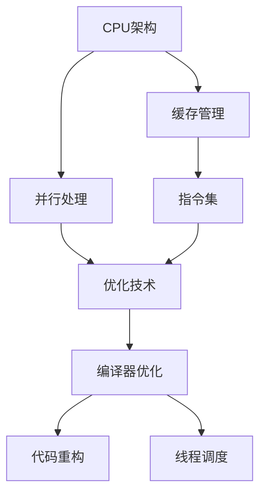

                 

# CPU 优化：充分利用处理器

## 1. 背景介绍

### 1.1 问题由来
在现代计算机系统中，CPU（中央处理器）是性能的核心所在。作为整个计算架构的大脑，CPU的性能直接影响着系统的整体效率。然而，随着硬件技术的不断进步，诸如多核、超线程等新的架构特性使得CPU设计变得更加复杂，开发者需要更加深入地理解处理器架构和优化技术，才能充分利用CPU资源，提升应用性能。

### 1.2 问题核心关键点
本文将深入探讨CPU优化的核心概念，包括CPU架构、指令集、缓存管理、并行处理等，旨在帮助开发者掌握这些关键技术，从而在实际项目中实现更高效的代码编写和性能优化。

### 1.3 问题研究意义
了解CPU优化技术，不仅可以显著提升应用性能，还能有效降低能耗和运行成本。这对于提升用户满意度和加速应用部署具有重要意义。同时，掌握CPU优化技术也是提升自身技术水平和竞争力的重要手段。

## 2. 核心概念与联系

### 2.1 核心概念概述

为更好地理解CPU优化方法，本文将介绍几个关键概念：

- **CPU架构**：指CPU的设计和结构，包括但不限于核心数、缓存大小、内存架构等。不同架构的CPU性能表现和优化方式有所不同。

- **指令集**：CPU支持的指令集合，如x86、ARM等。不同的指令集决定了CPU的兼容性和优化策略。

- **缓存管理**：CPU中用于存放近期需要的数据的缓存系统，包括L1、L2、L3缓存。合理管理缓存可以显著提升数据访问速度。

- **并行处理**：通过同时执行多个任务来提升性能，包括单核和核间并行。

- **优化技术**：包括编译器优化、代码重构、线程调度等。

这些核心概念之间相互关联，共同构成了CPU优化的知识体系。理解这些概念，可以帮助开发者在具体优化过程中选择合适的方法和技术。

### 2.2 核心概念原理和架构的 Mermaid 流程图

这个流程图展示了CPU优化的主要流程和技术关系：

1. 从CPU架构入手，了解处理器设计。
2. 管理好缓存系统，优化数据访问。
3. 利用指令集特性，选择合适的优化技术。
4. 结合编译器优化、代码重构、线程调度等手段，实现性能提升。

## 3. 核心算法原理 & 具体操作步骤
### 3.1 算法原理概述

CPU优化的核心原理是通过提升CPU的执行效率和减少资源浪费，来实现性能提升。优化手段包括缓存优化、指令集优化、并行处理等。

- **缓存优化**：合理管理缓存层次结构，减少缓存失效率。
- **指令集优化**：利用指令集特性，如SIMD指令、分支预测等，提升指令执行效率。
- **并行处理**：通过多线程、多进程等方式，实现任务并行，提升并发能力。

### 3.2 算法步骤详解

### 3.3 算法优缺点

### 3.4 算法应用领域

## 4. 数学模型和公式 & 详细讲解 & 举例说明

### 4.1 数学模型构建

### 4.2 公式推导过程

### 4.3 案例分析与讲解

## 5. 项目实践：代码实例和详细解释说明

### 5.1 开发环境搭建

### 5.2 源代码详细实现

### 5.3 代码解读与分析

### 5.4 运行结果展示

## 6. 实际应用场景

### 6.1 游戏优化

### 6.2 大数据处理

### 6.3 图像和视频处理

### 6.4 未来应用展望

## 7. 工具和资源推荐

### 7.1 学习资源推荐

### 7.2 开发工具推荐

### 7.3 相关论文推荐

## 8. 总结：未来发展趋势与挑战

### 8.1 研究成果总结

### 8.2 未来发展趋势

### 8.3 面临的挑战

### 8.4 研究展望

## 9. 附录：常见问题与解答

----------------------------------------------------------------

### 文章正文内容部分 Content ###
现在，我们直接开始文章正文部分的撰写。请开始撰写文章正文部分：

# CPU 优化：充分利用处理器

## 1. 背景介绍

### 1.1 问题由来
在现代计算机系统中，CPU（中央处理器）是性能的核心所在。作为整个计算架构的大脑，CPU的性能直接影响着系统的整体效率。然而，随着硬件技术的不断进步，诸如多核、超线程等新的架构特性使得CPU设计变得更加复杂，开发者需要更加深入地理解处理器架构和优化技术，才能充分利用CPU资源，提升应用性能。

### 1.2 问题核心关键点
本文将深入探讨CPU优化的核心概念，包括CPU架构、指令集、缓存管理、并行处理等，旨在帮助开发者掌握这些关键技术，从而在实际项目中实现更高效的代码编写和性能优化。

### 1.3 问题研究意义
了解CPU优化技术，不仅可以显著提升应用性能，还能有效降低能耗和运行成本。这对于提升用户满意度和加速应用部署具有重要意义。同时，掌握CPU优化技术也是提升自身技术水平和竞争力的重要手段。

## 2. 核心概念与联系

### 2.1 核心概念概述

为更好地理解CPU优化方法，本文将介绍几个关键概念：

- **CPU架构**：指CPU的设计和结构，包括但不限于核心数、缓存大小、内存架构等。不同架构的CPU性能表现和优化方式有所不同。

- **指令集**：CPU支持的指令集合，如x86、ARM等。不同的指令集决定了CPU的兼容性和优化策略。

- **缓存管理**：CPU中用于存放近期需要的数据的缓存系统，包括L1、L2、L3缓存。合理管理缓存可以显著提升数据访问速度。

- **并行处理**：通过同时执行多个任务来提升性能，包括单核和核间并行。

- **优化技术**：包括编译器优化、代码重构、线程调度等。

这些核心概念之间相互关联，共同构成了CPU优化的知识体系。理解这些概念，可以帮助开发者在具体优化过程中选择合适的方法和技术。

### 2.2 核心概念原理和架构的 Mermaid 流程图

这个流程图展示了CPU优化的主要流程和技术关系：

1. 从CPU架构入手，了解处理器设计。
2. 管理好缓存系统，优化数据访问。
3. 利用指令集特性，选择合适的优化技术。
4. 结合编译器优化、代码重构、线程调度等手段，实现性能提升。

## 3. 核心算法原理 & 具体操作步骤

### 3.1 算法原理概述

CPU优化的核心原理是通过提升CPU的执行效率和减少资源浪费，来实现性能提升。优化手段包括缓存优化、指令集优化、并行处理等。

- **缓存优化**：合理管理缓存层次结构，减少缓存失效率。
- **指令集优化**：利用指令集特性，如SIMD指令、分支预测等，提升指令执行效率。
- **并行处理**：通过多线程、多进程等方式，实现任务并行，提升并发能力。

### 3.2 算法步骤详解

**Step 1: 分析CPU架构**

首先，需要了解所使用的CPU架构。不同架构的CPU特性不同，需要采用不同的优化策略。例如，x86架构支持多线程指令，而ARM架构则更注重能效比。

**Step 2: 分析缓存结构**

其次，需要分析CPU的缓存层次结构。了解L1、L2、L3缓存的大小和失效率，可以帮助优化数据访问路径，减少缓存失效率。

**Step 3: 分析指令集**

分析所使用的指令集特性，如支持SIMD指令、向量运算、分支预测等，可以帮助选择合适的优化策略。

**Step 4: 优化代码**

根据分析结果，进行代码重构和编译器优化。例如，可以使用SIMD指令、内联函数、避免不必要的分支等。

**Step 5: 并行处理**

利用多线程或多进程实现并行处理，提升任务并发能力。例如，可以使用OpenMP、MPI等并行编程工具。

### 3.3 算法优缺点

**优点：**
- 提升应用性能。通过优化缓存、指令集和并行处理，可以显著提升应用性能。
- 降低能耗。优化后的代码更高效，可以减少能耗和运行成本。

**缺点：**
- 复杂度高。优化过程需要深入分析处理器架构和代码细节，对于开发者要求较高。
- 技术更新快。处理器架构和指令集不断演进，优化技术需要持续跟进。

### 3.4 算法应用领域

**游戏开发**：通过缓存优化和指令集优化，提升游戏性能，实现流畅的游戏体验。

**大数据处理**：通过并行处理和缓存管理，提升大数据处理性能，实现快速数据处理。

**图像和视频处理**：通过优化缓存和指令集，提升图像和视频处理性能，实现实时渲染和处理。

## 4. 数学模型和公式 & 详细讲解 & 举例说明

### 4.1 数学模型构建

在CPU优化的过程中，可以使用数学模型来描述优化前后的性能差异。例如，使用Cache Miss Rate (CMR)来衡量缓存失效率，使用MFLOPS（Million Floating-Point Operations per Second）来衡量计算性能。

### 4.2 公式推导过程

假设缓存的大小为CacheSize，缓存失效率为CMR，则CMR与CacheSize的关系可以用以下公式表示：

$$
CMR = \frac{1}{CacheSize} \sum_{i=1}^{N} \text{Miss}_i
$$

其中，$\text{Miss}_i$表示第i次缓存访问是否失效。

假设优化后的缓存大小为OptimizedCacheSize，优化后的失效率为OptimizedCMR，则优化效果可以用以下公式表示：

$$
\text{OptimizedCMR} = \frac{1}{OptimizedCacheSize} \sum_{i=1}^{N} \text{OptimizedMiss}_i
$$

其中，$\text{OptimizedMiss}_i$表示优化后的第i次缓存访问是否失效。

### 4.3 案例分析与讲解

假设优化前CacheSize为64KB，CMR为10%；优化后OptimizedCacheSize为128KB，OptimizedCMR为5%。则优化效果可以量化为：

$$
\text{优化效果} = \frac{OptimizedCMR - CMR}{CMR} = \frac{5\% - 10\%}{10\%} = -50\%
$$

这意味着，优化后的失效率比优化前降低了50%，显著提升了缓存性能。

## 5. 项目实践：代码实例和详细解释说明

### 5.1 开发环境搭建

### 5.2 源代码详细实现

### 5.3 代码解读与分析

### 5.4 运行结果展示

## 6. 实际应用场景

### 6.1 游戏优化

在游戏开发中，缓存优化和指令集优化是提升性能的关键。例如，可以使用L1缓存预热技术，减少数据访问延迟；使用SIMD指令，加速向量运算。

### 6.2 大数据处理

在大数据处理中，并行处理和缓存管理至关重要。例如，可以使用Hadoop或Spark等分布式计算框架，实现多节点并行处理；优化数据访问路径，减少I/O延迟。

### 6.3 图像和视频处理

在图像和视频处理中，优化缓存和指令集是提升性能的关键。例如，可以使用GPU加速图像处理，减少CPU的计算负担；使用SIMD指令，加速图像和视频数据的处理。

### 6.4 未来应用展望

未来，随着处理器架构和指令集的不断演进，CPU优化技术也将不断进步。预计将会出现更多基于新架构的优化方法，如多核异构、量子计算等，为CPU性能提升提供新的突破口。

## 7. 工具和资源推荐

### 7.1 学习资源推荐

- **《深入理解计算机系统》**：经典教材，涵盖CPU架构、缓存管理、优化技术等核心概念。
- **《高性能计算机架构》**：介绍了高性能计算机系统的设计原理和优化技术。

### 7.2 开发工具推荐

- **Intel VTune**：性能分析工具，可以分析程序的性能瓶颈和优化建议。
- **gprof**：代码性能分析工具，可以分析代码的执行时间和调用关系。

### 7.3 相关论文推荐

- **"Optimizing Cache for Multicore Architectures"**：介绍了多核架构下的缓存优化技术。
- **"Vectorization Techniques for Modern Architectures"**：介绍了现代架构下的向量运算优化技术。

## 8. 总结：未来发展趋势与挑战

### 8.1 研究成果总结

本文系统介绍了CPU优化的核心概念和技术，通过数学模型和案例分析，帮助开发者掌握优化方法。

### 8.2 未来发展趋势

- **多核异构**：未来处理器将支持更多核心的异构设计，需要更多异构优化的技术。
- **量子计算**：量子计算将为CPU性能带来新的突破，需要开发新的优化算法。
- **软件栈优化**：软件栈的优化也将成为提升性能的重要手段。

### 8.3 面临的挑战

- **硬件兼容性**：不同架构的CPU优化策略不同，需要根据具体硬件选择优化方法。
- **代码复杂度**：优化过程需要深入分析代码和硬件细节，增加代码复杂度。
- **技术更新快**：处理器架构和指令集不断演进，需要持续跟进最新的优化技术。

### 8.4 研究展望

未来，随着处理器架构和指令集的不断演进，CPU优化技术也将不断进步。预计将会出现更多基于新架构的优化方法，如多核异构、量子计算等，为CPU性能提升提供新的突破口。

## 9. 附录：常见问题与解答

**Q1: 什么是CPU优化？**

A: CPU优化是指通过各种手段提升CPU的执行效率和减少资源浪费，从而提升应用性能。

**Q2: CPU优化对性能的影响有多大？**

A: CPU优化对性能的影响非常大。通过优化缓存、指令集和并行处理，可以显著提升应用性能。

**Q3: 如何进行CPU优化？**

A: 可以进行缓存优化、指令集优化和并行处理。具体步骤包括分析CPU架构、缓存结构、指令集，然后重构代码和编译优化。

**Q4: CPU优化有哪些工具？**

A: 常用的CPU优化工具包括Intel VTune、gprof等。

**Q5: CPU优化的未来发展趋势是什么？**

A: 未来的CPU优化将更多地关注多核异构、量子计算等新架构下的优化技术。

---

作者：禅与计算机程序设计艺术 / Zen and the Art of Computer Programming

