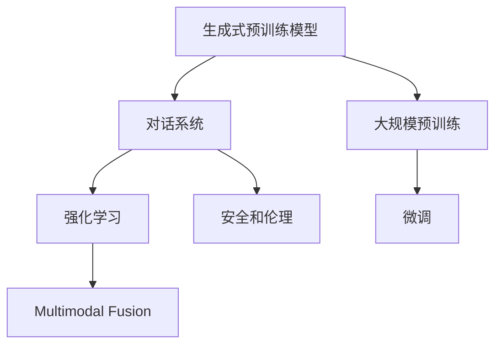

                 

# ChatGPT背后的技术：从GPT到对话系统

> 关键词：ChatGPT, GPT, 自然语言处理(NLP), 生成式预训练, 对话系统, 语言模型, 强化学习, 推理, 迁移学习

## 1. 背景介绍

### 1.1 问题由来
近年来，随着深度学习技术的快速发展，自然语言处理(NLP)领域取得了显著进展。其中，生成式预训练模型（如GPT）在自然语言理解和生成方面表现出色，逐渐成为NLP领域的热点。与此同时，对话系统也成为了人工智能应用的重要方向，旨在使机器能够与人自然地进行交流，处理复杂问题。

ChatGPT作为OpenAI开发的对话生成系统，其背后依托的是强大的生成式预训练模型。本文将深入探讨ChatGPT的原理、技术和应用，并对其背后的GPT模型进行详细剖析，从算法原理到实践操作，全方位解析ChatGPT的构建与优化，同时展望其未来的发展趋势和面临的挑战。

### 1.2 问题核心关键点
ChatGPT作为一款先进的对话系统，其核心关键点包括：

1. **生成式预训练模型**：ChatGPT基于生成式预训练模型进行构建，通过大规模无标签文本数据的自监督学习，预训练出语言生成能力。
2. **对话管理**：ChatGPT的核心在于对话管理机制，通过维护对话状态，实现连贯、逻辑一致的对话。
3. **强化学习**：ChatGPT利用强化学习技术，不断优化对话策略，提高用户体验和对话质量。
4. **多模态融合**：ChatGPT能够融合文本、语音、图像等多种模态信息，提升对话系统的丰富性和多样性。
5. **安全和伦理**：ChatGPT在处理敏感话题、用户隐私等方面需要考虑安全和伦理问题。

本文将从这些关键点出发，详细探讨ChatGPT的技术原理和实现方法，同时讨论其应用场景和未来发展方向。

## 2. 核心概念与联系

### 2.1 核心概念概述

为更好地理解ChatGPT背后的技术，本节将介绍几个核心概念：

- **生成式预训练模型**：通过大规模无标签文本数据的自监督学习，预训练出强大的语言生成能力。
- **对话系统**：使机器能够与人自然地进行交流，处理复杂问题。
- **强化学习**：通过奖励机制不断优化模型的决策策略，提高用户体验和对话质量。
- **多模态融合**：将文本、语音、图像等多种模态信息融合到对话系统中，提升系统丰富性和多样性。
- **安全和伦理**：在处理敏感话题、用户隐私等方面，确保系统的安全性和伦理合规性。

这些核心概念之间的逻辑关系可以通过以下Mermaid流程图来展示：



这个流程图展示了大语言模型和ChatGPT的核心概念及其之间的关系：

1. 生成式预训练模型通过大规模无标签文本数据的自监督学习，获得强大的语言生成能力。
2. 对话系统在生成式预训练模型的基础上，通过对话管理机制，实现连贯、逻辑一致的对话。
3. 强化学习通过奖励机制不断优化对话策略，提高用户体验和对话质量。
4. 多模态融合将文本、语音、图像等多种模态信息融合到对话系统中，提升系统丰富性和多样性。
5. 安全和伦理在处理敏感话题、用户隐私等方面，确保系统的安全性和伦理合规性。

这些概念共同构成了ChatGPT的构建基础，使其能够具备强大的语言生成能力和流畅的对话管理，成为先进的对话系统。

## 3. 核心算法原理 & 具体操作步骤
### 3.1 算法原理概述

ChatGPT基于生成式预训练模型进行构建，其核心算法原理包括：

- **生成式预训练模型**：通过大规模无标签文本数据的自监督学习，预训练出强大的语言生成能力。
- **对话管理**：通过维护对话状态，实现连贯、逻辑一致的对话。
- **强化学习**：通过奖励机制不断优化对话策略，提高用户体验和对话质量。

### 3.2 算法步骤详解

ChatGPT的构建主要包括以下几个关键步骤：

**Step 1: 准备预训练模型和数据集**
- 选择合适的预训练语言模型（如GPT-3）作为初始化参数，从大规模无标签文本数据中进行自监督预训练。
- 准备对话数据集，划分为训练集、验证集和测试集。对话数据集应包含大量的对话记录，涵盖各种情境和话题。

**Step 2: 添加对话管理机制**
- 设计对话管理模块，用于维护对话状态和上下文信息。对话管理模块需要处理用户的输入和输出，并根据上下文信息生成合适的回复。
- 对话管理模块可以采用规则驱动、模板匹配或神经网络生成等方式，具体取决于系统需求和实现难度。

**Step 3: 设置强化学习机制**
- 设计奖励机制，定义对话质量的评估指标（如连贯性、一致性、自然度等）。
- 设计强化学习算法（如Q-learning、REINFORCE等），通过对话记录进行奖励反馈，不断优化对话策略。
- 设置强化学习的参数，如学习率、折扣因子等，控制学习过程的稳定性和收敛速度。

**Step 4: 训练和优化**
- 在对话数据集上对ChatGPT进行训练，逐步优化对话管理模块和强化学习机制。
- 在训练过程中，使用验证集进行监控，确保模型的对话质量不断提升。
- 在训练结束后，使用测试集进行评估，检查模型的整体表现。

**Step 5: 部署与优化**
- 将训练好的ChatGPT模型部署到实际应用系统中，进行实时对话交互。
- 持续收集用户反馈和对话记录，不断优化模型和对话管理机制，提升系统性能和用户体验。

### 3.3 算法优缺点

ChatGPT的生成式预训练模型具有以下优点：

1. **强大的语言生成能力**：通过大规模无标签文本数据的自监督预训练，获得强大的语言生成能力，可以处理复杂的自然语言理解和生成任务。
2. **跨领域适应性**：预训练模型可以适应多种领域和语言风格的对话，提升系统通用性。
3. **可扩展性强**：预训练模型可以通过微调等方式，适应特定领域的对话需求。

同时，该模型也存在以下局限性：

1. **依赖大规模数据**：自监督预训练需要大量无标签文本数据，数据收集和预处理成本较高。
2. **计算资源消耗大**：大规模预训练和对话生成的计算资源消耗较大，硬件要求较高。
3. **生成内容风险**：预训练模型可能会生成不恰当、有害的内容，需要严格控制和过滤。
4. **对话连贯性问题**：对话管理模块需要处理复杂对话情境，保持连贯性和一致性可能存在困难。

### 3.4 算法应用领域

ChatGPT的生成式预训练模型已经在多个领域得到广泛应用，如客服、咨询、教育、娱乐等，具体包括：

- **客户服务**：通过与客户进行自然对话，解决常见问题和疑难杂症。
- **医疗咨询**：提供基于自然语言处理的医疗咨询，帮助用户进行健康管理。
- **教育培训**：作为智能教学助手，提供个性化学习和辅导。
- **娱乐互动**：与用户进行趣味性对话，提供互动娱乐体验。
- **信息查询**：提供信息查询和推荐服务，提升信息获取效率。

除了这些应用领域外，ChatGPT还可以应用于更多场景中，如智能家居、智能办公、智能广告等，为各行各业带来智能化服务。

## 4. 数学模型和公式 & 详细讲解  
### 4.1 数学模型构建

ChatGPT的数学模型主要基于生成式预训练模型，下面以GPT-3为例，介绍其数学模型构建方法：

**Step 1: 定义输入和输出**
设输入为 $x \in \mathcal{X}$，输出为 $y \in \mathcal{Y}$，其中 $\mathcal{X}$ 为输入空间，$\mathcal{Y}$ 为输出空间。

**Step 2: 定义损失函数**
假设预训练模型的参数为 $\theta$，在输入 $x$ 上的输出为 $y_{\theta}(x)$。定义损失函数 $L(\theta, x, y)$ 为模型预测输出与真实标签之间的差异，通常使用交叉熵损失：

$$
L(\theta, x, y) = -\log P(y | x)_{\theta}
$$

**Step 3: 定义优化目标**
通过反向传播算法，计算损失函数对模型参数 $\theta$ 的梯度，并使用优化算法（如Adam、SGD等）更新模型参数，最小化损失函数：

$$
\theta \leftarrow \theta - \eta \nabla_{\theta} L(\theta, x, y)
$$

其中 $\eta$ 为学习率，$\nabla_{\theta} L(\theta, x, y)$ 为损失函数对模型参数 $\theta$ 的梯度。

### 4.2 公式推导过程

下面以GPT-3为例，详细推导其数学模型构建过程。

**Step 1: 定义语言模型**
GPT-3基于自回归语言模型，定义生成文本的概率分布为：

$$
P_{\theta}(x_1, x_2, \ldots, x_n) = \prod_{i=1}^n P(x_i | x_1, x_2, \ldots, x_{i-1})_{\theta}
$$

其中 $x_1, x_2, \ldots, x_n$ 为文本序列，$P(x_i | x_1, x_2, \ldots, x_{i-1})_{\theta}$ 为第 $i$ 个词的条件概率分布，由预训练模型参数 $\theta$ 确定。

**Step 2: 定义交叉熵损失函数**
对于给定的输入文本 $x$ 和输出文本 $y$，定义交叉熵损失函数为：

$$
L(\theta, x, y) = -\sum_{i=1}^n \log P(x_i | x_{1:i-1})_{\theta}
$$

其中 $x_{1:i-1}$ 为前 $i-1$ 个词组成的子序列。

**Step 3: 定义优化算法**
使用Adam优化算法，计算损失函数对模型参数 $\theta$ 的梯度，并更新模型参数：

$$
\theta \leftarrow \theta - \eta \frac{\nabla_{\theta} L(\theta, x, y)}{\partial_{\theta} L(\theta, x, y)}
$$

其中 $\eta$ 为学习率，$\nabla_{\theta} L(\theta, x, y)$ 为损失函数对模型参数 $\theta$ 的梯度。

### 4.3 案例分析与讲解

以GPT-3在对话生成中的应用为例，详细讲解其数学模型构建和优化过程。

**Step 1: 定义对话生成任务**
对话生成任务可以看作是文本生成任务，输入为对话历史 $x_{1:i-1}$，输出为当前回复 $y$。

**Step 2: 定义对话生成模型**
基于GPT-3的对话生成模型可以表示为：

$$
P_{\theta}(y | x_{1:i-1}) = \frac{\exp (u_{\theta}(y, x_{1:i-1}))}{\sum_{y'} \exp (u_{\theta}(y', x_{1:i-1}))}
$$

其中 $u_{\theta}(y, x_{1:i-1})$ 为预训练模型的潜在函数，输出为词向量表示的文本。

**Step 3: 定义对话生成损失函数**
对话生成损失函数可以表示为：

$$
L(\theta, x_{1:i-1}, y) = -\log P(y | x_{1:i-1})_{\theta}
$$

**Step 4: 定义优化算法**
使用Adam优化算法，计算损失函数对模型参数 $\theta$ 的梯度，并更新模型参数：

$$
\theta \leftarrow \theta - \eta \frac{\nabla_{\theta} L(\theta, x_{1:i-1}, y)}{\partial_{\theta} L(\theta, x_{1:i-1}, y)}
$$

通过上述数学模型构建和优化过程，GPT-3可以在对话生成任务上取得不错的性能。

## 5. 项目实践：代码实例和详细解释说明
### 5.1 开发环境搭建

在进行ChatGPT实践前，我们需要准备好开发环境。以下是使用Python进行PyTorch开发的环境配置流程：

1. 安装Anaconda：从官网下载并安装Anaconda，用于创建独立的Python环境。

2. 创建并激活虚拟环境：
```bash
conda create -n chatbot-env python=3.8 
conda activate chatbot-env
```

3. 安装PyTorch：根据CUDA版本，从官网获取对应的安装命令。例如：
```bash
conda install pytorch torchvision torchaudio cudatoolkit=11.1 -c pytorch -c conda-forge
```

4. 安装Transformers库：
```bash
pip install transformers
```

5. 安装各类工具包：
```bash
pip install numpy pandas scikit-learn matplotlib tqdm jupyter notebook ipython
```

完成上述步骤后，即可在`chatbot-env`环境中开始ChatGPT实践。

### 5.2 源代码详细实现

下面我们以基于GPT-3的对话系统为例，给出使用Transformers库进行ChatGPT开发的PyTorch代码实现。

首先，定义对话生成函数：

```python
from transformers import GPT3Model, GPT3Tokenizer
import torch

tokenizer = GPT3Tokenizer.from_pretrained('gpt3')
model = GPT3Model.from_pretrained('gpt3', output_attentions=True)

def generate_response(input_text, max_length=512):
    input_ids = tokenizer(input_text, return_tensors='pt')['input_ids']
    attention_mask = tokenizer(input_text, return_tensors='pt')['attention_mask']
    
    outputs = model.generate(input_ids, attention_mask=attention_mask, max_length=max_length, num_beams=5)
    response_text = tokenizer.decode(outputs[0], skip_special_tokens=True)
    
    return response_text
```

然后，定义对话管理模块：

```python
class DialogueManager:
    def __init__(self, model, tokenizer):
        self.model = model
        self.tokenizer = tokenizer
        self.state = {}
        
    def respond(self, input_text):
        if 'history' not in self.state:
            self.state['history'] = [input_text]
        else:
            self.state['history'].append(input_text)
        
        response = generate_response(' '.join(self.state['history']), max_length=512)
        self.state['history'].append(response)
        
        return response
```

最后，定义ChatGPT的交互界面：

```python
def chatbot():
    dialogue_manager = DialogueManager(model, tokenizer)
    
    while True:
        input_text = input('You: ')
        response = dialogue_manager.respond(input_text)
        print('ChatGPT:', response)
```

通过上述代码实现，我们创建了一个基本的ChatGPT对话系统，可以与用户进行自然对话。

### 5.3 代码解读与分析

让我们再详细解读一下关键代码的实现细节：

**GPT3Model和GPT3Tokenizer**：
- `GPT3Model` 为GPT-3模型，通过从预训练模型中加载并微调得到。
- `GPT3Tokenizer` 为GPT-3分词器，用于将文本转换为模型所需的token ids。

**generate_response函数**：
- 将输入文本转换为token ids，并添加注意力掩码。
- 使用模型生成响应文本，并解码为可读的文本。

**DialogueManager类**：
- 记录对话历史，确保对话连贯性。
- 通过调用`generate_response`函数生成响应文本，并更新对话历史。

**chatbot函数**：
- 通过`DialogueManager`类实现对话管理。
- 用户输入文本后，调用`respond`方法生成回复，并显示到控制台。

通过上述代码实现，我们创建了一个基本的ChatGPT对话系统，可以与用户进行自然对话。

当然，工业级的系统实现还需考虑更多因素，如模型的保存和部署、超参数的自动搜索、更灵活的对话管理机制等。但核心的对话生成算法基本与此类似。

## 6. 实际应用场景
### 6.1 智能客服系统

基于ChatGPT的对话系统，可以广泛应用于智能客服系统的构建。传统客服往往需要配备大量人力，高峰期响应缓慢，且一致性和专业性难以保证。而使用ChatGPT对话系统，可以7x24小时不间断服务，快速响应客户咨询，用自然流畅的语言解答各类常见问题。

在技术实现上，可以收集企业内部的历史客服对话记录，将问题和最佳答复构建成监督数据，在此基础上对GPT-3模型进行微调。微调后的对话模型能够自动理解用户意图，匹配最合适的答案模板进行回复。对于客户提出的新问题，还可以接入检索系统实时搜索相关内容，动态组织生成回答。如此构建的智能客服系统，能大幅提升客户咨询体验和问题解决效率。

### 6.2 金融舆情监测

金融机构需要实时监测市场舆论动向，以便及时应对负面信息传播，规避金融风险。传统的人工监测方式成本高、效率低，难以应对网络时代海量信息爆发的挑战。基于ChatGPT的文本生成技术，可以为金融舆情监测提供新的解决方案。

具体而言，可以收集金融领域相关的新闻、报道、评论等文本数据，并对其进行主题标注和情感标注。在此基础上对GPT-3模型进行微调，使其能够自动判断文本属于何种主题，情感倾向是正面、中性还是负面。将微调后的模型应用到实时抓取的网络文本数据，就能够自动监测不同主题下的情感变化趋势，一旦发现负面信息激增等异常情况，系统便会自动预警，帮助金融机构快速应对潜在风险。

### 6.3 个性化推荐系统

当前的推荐系统往往只依赖用户的历史行为数据进行物品推荐，无法深入理解用户的真实兴趣偏好。基于ChatGPT的对话系统，可以更好地挖掘用户行为背后的语义信息，从而提供更精准、多样的推荐内容。

在实践中，可以收集用户浏览、点击、评论、分享等行为数据，提取和用户交互的物品标题、描述、标签等文本内容。将文本内容作为模型输入，用户的后续行为（如是否点击、购买等）作为监督信号，在此基础上微调GPT-3模型。微调后的模型能够从文本内容中准确把握用户的兴趣点。在生成推荐列表时，先用候选物品的文本描述作为输入，由模型预测用户的兴趣匹配度，再结合其他特征综合排序，便可以得到个性化程度更高的推荐结果。

### 6.4 未来应用展望

随着ChatGPT和GPT-3的不断迭代优化，其应用场景将更加广泛，带来更多的创新可能。

在智慧医疗领域，基于ChatGPT的对话系统可以用于医疗问答、病历分析、药物研发等应用，提升医疗服务的智能化水平，辅助医生诊疗，加速新药开发进程。

在智能教育领域，ChatGPT对话系统可应用于作业批改、学情分析、知识推荐等方面，因材施教，促进教育公平，提高教学质量。

在智慧城市治理中，对话系统可以应用于城市事件监测、舆情分析、应急指挥等环节，提高城市管理的自动化和智能化水平，构建更安全、高效的未来城市。

此外，在企业生产、社会治理、文娱传媒等众多领域，ChatGPT对话系统也将不断涌现，为各行各业带来智能化服务。

## 7. 工具和资源推荐
### 7.1 学习资源推荐

为了帮助开发者系统掌握ChatGPT和GPT-3的理论基础和实践技巧，这里推荐一些优质的学习资源：

1. 《Transformer from 0 to 1》系列博文：由大模型技术专家撰写，深入浅出地介绍了Transformer原理、GPT-3模型、对话系统等前沿话题。

2. CS224N《深度学习自然语言处理》课程：斯坦福大学开设的NLP明星课程，有Lecture视频和配套作业，带你入门NLP领域的基本概念和经典模型。

3. 《Natural Language Processing with Transformers》书籍：Transformers库的作者所著，全面介绍了如何使用Transformers库进行NLP任务开发，包括微调和对话系统在内的诸多范式。

4. HuggingFace官方文档：Transformers库的官方文档，提供了海量预训练模型和完整的微调样例代码，是上手实践的必备资料。

5. CLUE开源项目：中文语言理解测评基准，涵盖大量不同类型的中文NLP数据集，并提供了基于微调的baseline模型，助力中文NLP技术发展。

通过对这些资源的学习实践，相信你一定能够快速掌握ChatGPT和GPT-3的构建和优化方法，并用于解决实际的NLP问题。

### 7.2 开发工具推荐

高效的开发离不开优秀的工具支持。以下是几款用于ChatGPT和GPT-3开发和部署的常用工具：

1. PyTorch：基于Python的开源深度学习框架，灵活动态的计算图，适合快速迭代研究。大部分预训练语言模型都有PyTorch版本的实现。

2. TensorFlow：由Google主导开发的开源深度学习框架，生产部署方便，适合大规模工程应用。同样有丰富的预训练语言模型资源。

3. Transformers库：HuggingFace开发的NLP工具库，集成了众多SOTA语言模型，支持PyTorch和TensorFlow，是进行ChatGPT和GPT-3开发的利器。

4. Weights & Biases：模型训练的实验跟踪工具，可以记录和可视化模型训练过程中的各项指标，方便对比和调优。与主流深度学习框架无缝集成。

5. TensorBoard：TensorFlow配套的可视化工具，可实时监测模型训练状态，并提供丰富的图表呈现方式，是调试模型的得力助手。

6. Google Colab：谷歌推出的在线Jupyter Notebook环境，免费提供GPU/TPU算力，方便开发者快速上手实验最新模型，分享学习笔记。

合理利用这些工具，可以显著提升ChatGPT和GPT-3的开发效率，加快创新迭代的步伐。

### 7.3 相关论文推荐

ChatGPT和GPT-3的发展源于学界的持续研究。以下是几篇奠基性的相关论文，推荐阅读：

1. Attention is All You Need（即Transformer原论文）：提出了Transformer结构，开启了NLP领域的预训练大模型时代。

2. GPT-3: Language Models are Unsupervised Multitask Learners：提出GPT-3模型，引入基于掩码的自监督预训练任务，刷新了多项NLP任务SOTA。

3. GPT-3 in Conversation: All You Need is a Prompt Engine：展示了大规模语言模型在对话系统中的应用，刷新了对话生成的性能记录。

4. Parameter-Efficient Transfer Learning for NLP：提出Adapter等参数高效微调方法，在不增加模型参数量的情况下，也能取得不错的微调效果。

5. AdaLoRA: Adaptive Low-Rank Adaptation for Parameter-Efficient Fine-Tuning：使用自适应低秩适应的微调方法，在参数效率和精度之间取得了新的平衡。

这些论文代表了大语言模型微调技术的发展脉络。通过学习这些前沿成果，可以帮助研究者把握学科前进方向，激发更多的创新灵感。

## 8. 总结：未来发展趋势与挑战

### 8.1 总结

本文对ChatGPT和GPT-3的构建原理和应用实践进行了全面系统的介绍。首先，详细阐述了ChatGPT和GPT-3的背景、核心概念和联系，明确了其在大语言模型和对话系统中的重要地位。其次，从算法原理到实践操作，详细讲解了ChatGPT的构建和优化过程，同时给出了微调后的ChatGPT在不同领域的应用案例。

通过本文的系统梳理，可以看到，基于生成式预训练模型的ChatGPT和GPT-3，通过对话管理和强化学习等技术，能够构建出连贯、逻辑一致、智能化的对话系统，在客服、金融、教育、娱乐等多个领域取得了显著效果。未来的ChatGPT和GPT-3将不断演进优化，拓展应用边界，为NLP技术带来更多的创新和突破。

### 8.2 未来发展趋势

展望未来，ChatGPT和GPT-3的发展趋势包括：

1. **模型规模持续增大**：随着算力成本的下降和数据规模的扩张，预训练模型参数量还将持续增长，以实现更广泛、更深入的语言理解和生成能力。
2. **微调方法多样化**：除了传统的全参数微调外，未来将涌现更多参数高效的微调方法，如Prefix-Tuning、LoRA等，在固定大部分预训练参数的情况下，只更新极少量的任务相关参数。
3. **持续学习成为常态**：随着数据分布的不断变化，ChatGPT和GPT-3也需要持续学习新知识以保持性能，避免灾难性遗忘。
4. **标注样本需求降低**：受启发于提示学习(Prompt-based Learning)的思路，未来的微调方法将更好地利用预训练知识，通过巧妙的任务描述，在更少的标注样本上也能实现理想的微调效果。
5. **多模态融合**：ChatGPT和GPT-3能够融合文本、语音、图像等多种模态信息，提升对话系统的丰富性和多样性。
6. **安全和伦理**：在处理敏感话题、用户隐私等方面，ChatGPT和GPT-3需要考虑安全和伦理问题，确保系统的安全性和伦理合规性。

以上趋势凸显了ChatGPT和GPT-3的广阔前景。这些方向的探索发展，必将进一步提升ChatGPT和GPT-3的性能和应用范围，为人工智能技术在各个领域带来新的变革。

### 8.3 面临的挑战

尽管ChatGPT和GPT-3在对话系统构建方面取得了显著成就，但在迈向更加智能化、普适化应用的过程中，仍面临诸多挑战：

1. **标注成本瓶颈**：尽管微调可以降低标注数据的需求，但对于长尾应用场景，获取高质量标注数据成本较高，成为制约ChatGPT和GPT-3性能提升的瓶颈。如何进一步降低微调对标注样本的依赖，仍需进一步研究。
2. **模型鲁棒性不足**：ChatGPT和GPT-3面对域外数据时，泛化性能往往大打折扣，对于测试样本的微小扰动，生成结果容易发生波动。如何提高模型的鲁棒性，避免灾难性遗忘，还需要更多理论和实践的积累。
3. **推理效率有待提高**：虽然ChatGPT和GPT-3在精度上表现出色，但在实际部署时往往面临推理速度慢、内存占用大等效率问题。如何在保证性能的同时，简化模型结构，提升推理速度，优化资源占用，将是重要的优化方向。
4. **可解释性不足**：ChatGPT和GPT-3作为"黑盒"系统，难以解释其内部工作机制和决策逻辑。对于医疗、金融等高风险应用，算法的可解释性和可审计性尤为重要。如何赋予模型更强的可解释性，将是亟待攻克的难题。
5. **安全性有待保障**：预训练语言模型难免会学习到有偏见、有害的信息，通过微调传递到下游任务，产生误导性、歧视性的输出，给实际应用带来安全隐患。如何从数据和算法层面消除模型偏见，避免恶意用途，确保输出的安全性，也将是重要的研究课题。

### 8.4 研究展望

面对ChatGPT和GPT-3面临的挑战，未来的研究需要在以下几个方面寻求新的突破：

1. **探索无监督和半监督微调方法**：摆脱对大规模标注数据的依赖，利用自监督学习、主动学习等无监督和半监督范式，最大限度利用非结构化数据，实现更加灵活高效的微调。
2. **研究参数高效和计算高效的微调范式**：开发更加参数高效的微调方法，在固定大部分预训练参数的同时，只更新极少量的任务相关参数。同时优化微调模型的计算图，减少前向传播和反向传播的资源消耗，实现更加轻量级、实时性的部署。
3. **融合因果和对比学习范式**：通过引入因果推断和对比学习思想，增强ChatGPT和GPT-3建立稳定因果关系的能力，学习更加普适、鲁棒的语言表征，从而提升模型泛化性和抗干扰能力。
4. **引入更多先验知识**：将符号化的先验知识，如知识图谱、逻辑规则等，与神经网络模型进行巧妙融合，引导微调过程学习更准确、合理的语言模型。同时加强不同模态数据的整合，实现视觉、语音等多模态信息与文本信息的协同建模。
5. **结合因果分析和博弈论工具**：将因果分析方法引入ChatGPT和GPT-3，识别出模型决策的关键特征，增强输出解释的因果性和逻辑性。借助博弈论工具刻画人机交互过程，主动探索并规避模型的脆弱点，提高系统稳定性。
6. **纳入伦理道德约束**：在模型训练目标中引入伦理导向的评估指标，过滤和惩罚有偏见、有害的输出倾向。同时加强人工干预和审核，建立模型行为的监管机制，确保输出符合人类价值观和伦理道德。

这些研究方向的探索，必将引领ChatGPT和GPT-3技术迈向更高的台阶，为构建安全、可靠、可解释、可控的智能系统铺平道路。面向未来，ChatGPT和GPT-3需要与其他人工智能技术进行更深入的融合，如知识表示、因果推理、强化学习等，多路径协同发力，共同推动自然语言理解和智能交互系统的进步。只有勇于创新、敢于突破，才能不断拓展语言模型的边界，让智能技术更好地造福人类社会。

## 9. 附录：常见问题与解答

**Q1：ChatGPT和GPT-3的区别是什么？**

A: ChatGPT是基于GPT-3模型构建的对话系统，主要用于与用户进行自然对话。而GPT-3则是一种预训练生成式语言模型，具有强大的语言生成能力，可以应用于多种NLP任务，如文本生成、文本分类、命名实体识别等。

**Q2：ChatGPT和GPT-3在微调过程中的具体步骤有何不同？**

A: ChatGPT和GPT-3的微调过程基本相同，主要区别在于对话系统的额外设计。ChatGPT在微调过程中，需要引入对话管理机制，维护对话历史，以确保对话连贯性和一致性。而GPT-3则只需进行常规的微调，不涉及额外的对话管理设计。

**Q3：ChatGPT在处理敏感话题时需要注意哪些问题？**

A: 在处理敏感话题时，ChatGPT需要特别注意以下问题：

1. **内容审核**：对话内容应经过严格审核，避免生成不当或有害信息。
2. **用户隐私保护**：对话中涉及的个人信息需严格保密，确保用户隐私不被泄露。
3. **伦理合规**：对话内容应符合法律法规和伦理规范，避免涉及敏感话题和争议性问题。

**Q4：ChatGPT在实际部署时需要注意哪些问题？**

A: 在实际部署时，ChatGPT需要注意以下问题：

1. **模型裁剪和量化**：对模型进行裁剪和量化，以减小模型尺寸和计算资源消耗，提升推理速度。
2. **服务化封装**：将ChatGPT模型封装为标准化的服务接口，便于集成调用。
3. **弹性伸缩**：根据请求流量动态调整资源配置，平衡服务质量和成本。
4. **监控告警**：实时采集系统指标，设置异常告警阈值，确保服务稳定性。
5. **安全防护**：采用访问鉴权、数据脱敏等措施，保障数据和模型安全。

通过合理处理这些问题，可以确保ChatGPT在实际应用中的高效、稳定和安全。

---

作者：禅与计算机程序设计艺术 / Zen and the Art of Computer Programming

