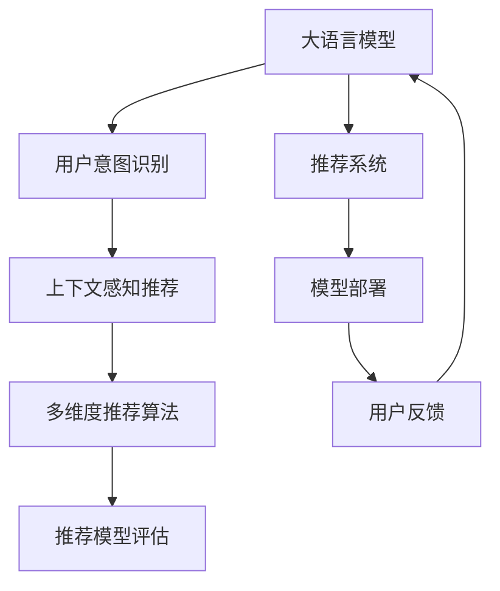

                 

# Chat-REC:基于LLM的交互式推荐系统

> 关键词：交互式推荐系统,LLM(大语言模型),用户意图识别,上下文感知,个性化推荐算法,推荐系统,推荐模型,模型评估,推荐系统发展趋势

## 1. 背景介绍

### 1.1 问题由来
在数字化时代，推荐系统已经成为互联网应用的重要组成部分，帮助用户在海量信息中快速筛选并获取所需内容。传统的推荐系统主要依赖于用户的历史行为数据进行预测，难以捕捉用户的真实需求和偏好，导致推荐的准确性和个性化程度不足。为了突破这一瓶颈，交互式推荐系统应运而生。

交互式推荐系统允许用户在交互过程中动态地反馈自己的满意度，实时调整推荐策略，从而提供更符合用户需求的个性化推荐。这种动态交互的特性，使得交互式推荐系统在个性化推荐、增强用户体验等方面具有明显优势。

与此同时，大语言模型(LLM)技术近年来取得了显著进展，具备强大的自然语言理解和生成能力，可以用于理解和处理用户输入的自然语言指令。将LLM技术引入交互式推荐系统中，能够更准确地捕捉用户的即时需求，提升推荐系统的交互性和个性化程度。

本文将介绍一种基于LLM的交互式推荐系统Chat-REC，通过自然语言处理技术，实时获取用户意图，并进行上下文感知的多维度推荐，以提升推荐的精准性和用户满意度。

### 1.2 问题核心关键点
Chat-REC系统通过以下关键技术实现个性化推荐：
- **用户意图识别**：利用大语言模型对用户输入的自然语言进行意图解析，理解用户的即时需求。
- **上下文感知**：结合用户历史行为数据和实时反馈，动态调整推荐策略，提供更个性化的推荐。
- **推荐算法优化**：采用多维度推荐模型，如协同过滤、内容推荐、混合推荐等，提升推荐效果。
- **模型评估与优化**：引入多种评估指标和优化策略，确保推荐系统的稳定性和可靠性。
- **系统集成与部署**：将推荐模型嵌入实际应用场景，进行高效部署和持续优化。

这些技术点共同构成了Chat-REC系统的核心功能，使其能够在用户交互过程中，提供动态、个性化、高精度的推荐服务。

### 1.3 问题研究意义
研究基于大语言模型的交互式推荐系统，具有以下重要意义：
- 提升推荐系统的效果。通过大语言模型准确捕捉用户需求，结合上下文信息，能够显著提高推荐的个性化和精准度。
- 增强用户交互体验。实时响应用户反馈，动态调整推荐策略，使得推荐系统更加智能和交互性。
- 推动推荐系统的发展。交互式推荐系统为用户提供了更优质的体验，能够吸引更多的用户，成为推荐系统的重要发展方向。
- 促进人工智能应用。大语言模型技术的发展，为推荐系统提供了新的技术工具，推动了人工智能技术在实际应用中的落地。

通过本文的系统梳理，希望能够帮助开发者深入理解基于LLM的交互式推荐系统，为其实现和优化提供参考和指导。

## 2. 核心概念与联系

### 2.1 核心概念概述

为更好地理解Chat-REC系统的核心机制，本节将介绍几个关键概念：

- **大语言模型(LLM)**：如BERT、GPT等，通过大规模无标签文本数据预训练，学习到丰富的语言知识和表示能力，具备强大的自然语言理解和生成能力。
- **推荐系统(Recommender System)**：根据用户的历史行为数据和特征，通过算法预测并推荐用户感兴趣的商品、内容等。
- **交互式推荐系统**：在推荐过程中，允许用户实时反馈满意度，动态调整推荐策略，提升推荐的精准性和个性化程度。
- **用户意图识别**：通过自然语言处理技术，分析用户输入的自然语言指令，理解其意图和需求。
- **上下文感知推荐**：结合用户历史行为数据和实时反馈，动态调整推荐策略，提供更个性化的推荐。
- **多维度推荐算法**：采用协同过滤、内容推荐、混合推荐等多种算法，提升推荐效果。
- **推荐模型评估**：通过多种评估指标和优化策略，确保推荐系统的稳定性和可靠性。

这些核心概念之间的逻辑关系可以通过以下Mermaid流程图来展示：



这个流程图展示了大语言模型在Chat-REC系统中的核心作用：

1. 大语言模型作为"特征提取器"，对用户输入进行意图解析。
2. 用户意图识别结果与上下文信息结合，进行动态推荐。
3. 推荐模型采用多种算法，提升推荐效果。
4. 推荐模型通过评估指标进行动态优化，确保推荐质量。
5. 推荐结果在实际应用中获取用户反馈，进一步优化推荐系统。

这些概念共同构成了Chat-REC系统的核心功能，使其能够在用户交互过程中，提供动态、个性化、高精度的推荐服务。

## 3. 核心算法原理 & 具体操作步骤
### 3.1 算法原理概述

Chat-REC系统基于大语言模型和推荐系统的有机结合，实现了交互式推荐的功能。其核心思想是：将用户输入的自然语言作为指令，通过大语言模型解析其意图，结合用户历史行为数据和实时反馈，动态调整推荐策略，最终生成个性化推荐结果。

形式化地，假设用户输入的自然语言指令为 $I$，大语言模型将其解析为意图 $i$，并生成上下文 $C$。推荐系统根据意图 $i$ 和上下文 $C$，输出推荐结果 $R$。整个系统的运行流程可以表示为：

$$
R = \text{Recommender}(I, C)
$$

其中 $\text{Recommender}$ 表示推荐算法，输入为用户的意图 $i$ 和上下文 $C$，输出为推荐结果 $R$。

### 3.2 算法步骤详解

Chat-REC系统的具体实现步骤包括以下几个关键环节：

**Step 1: 用户意图识别**
- 收集用户输入的自然语言指令 $I$。
- 使用大语言模型对指令进行意图解析，生成意图 $i$。
- 根据意图 $i$，选择适合的推荐模型进行推荐。

**Step 2: 上下文感知推荐**
- 结合用户的历史行为数据 $H$ 和实时反馈 $F$，更新上下文信息 $C$。
- 将意图 $i$ 和上下文 $C$ 作为输入，进行动态推荐。

**Step 3: 推荐结果生成**
- 将动态推荐结果 $R$ 作为输出，供用户查看和反馈。

**Step 4: 用户反馈循环**
- 收集用户对推荐结果的满意度反馈 $F'$。
- 根据反馈 $F'$ 调整推荐策略，更新上下文信息 $C'$。
- 将新的意图 $i'$ 和上下文 $C'$ 作为输入，进行下一轮推荐。

通过上述步骤，Chat-REC系统能够实时响应用户反馈，动态调整推荐策略，提供更加个性化的推荐服务。

### 3.3 算法优缺点

Chat-REC系统在实现交互式推荐方面具有以下优点：
1. **高个性化**：通过大语言模型解析用户意图，结合上下文信息进行动态推荐，能够提供更加个性化的服务。
2. **实时交互**：用户可以实时反馈推荐结果的满意度，动态调整推荐策略，提升用户体验。
3. **灵活性高**：能够适应不同类型和规模的用户需求，适用于各类推荐场景。

同时，该系统也存在一些局限性：
1. **计算资源需求高**：大语言模型的训练和推理需要大量计算资源，初期部署成本较高。
2. **上下文处理复杂**：结合历史数据和实时反馈进行上下文感知推荐，处理过程较为复杂。
3. **数据隐私问题**：需要收集和处理用户行为数据，涉及隐私保护和安全问题。
4. **推荐精度不稳定**：大语言模型的解析能力和推荐模型的表现直接影响推荐效果。

尽管存在这些局限性，但就目前而言，Chat-REC系统仍然是交互式推荐技术的重要范式。未来相关研究的重点在于如何进一步优化大语言模型和推荐模型的性能，降低系统对计算资源的需求，同时兼顾隐私保护和数据安全。

### 3.4 算法应用领域

基于大语言模型的交互式推荐系统已经在多个领域得到了广泛应用，例如：

- **电商推荐**：在用户浏览、点击商品时，实时推荐相关商品，提升用户购买转化率。
- **视频推荐**：在用户观看视频时，根据反馈推荐相似视频，增加用户粘性。
- **音乐推荐**：在用户播放音乐时，实时推荐相关歌曲，满足用户听歌需求。
- **新闻推荐**：在用户阅读新闻时，推荐相关新闻内容，增加用户阅读量。

除了上述这些经典应用外，交互式推荐系统还被创新性地应用到更多场景中，如智能家居、个性化学习、智慧医疗等，为各类业务提供了新型的推荐解决方案。随着技术的不断演进，基于LLM的交互式推荐系统将在更广泛的领域发挥作用，进一步提升用户体验和服务质量。

## 4. 数学模型和公式 & 详细讲解  
### 4.1 数学模型构建

Chat-REC系统的核心模型可以表示为：

$$
R = \text{Recommender}(I, C)
$$

其中，$R$ 表示推荐结果，$I$ 表示用户输入的自然语言指令，$C$ 表示上下文信息，$\text{Recommender}$ 表示推荐算法。

对于意图解析模型，可以使用大语言模型作为特征提取器，将其应用于自然语言处理任务。假设大语言模型为 $M$，输入为自然语言指令 $I$，输出为意图向量 $I_v$，则意图解析过程可以表示为：

$$
I_v = M(I)
$$

对于推荐模型，可以采用多种算法进行设计，如协同过滤、内容推荐、混合推荐等。假设推荐模型为 $\text{Rec}(I_v, C)$，输出为推荐结果向量 $R_v$，则推荐过程可以表示为：

$$
R_v = \text{Rec}(I_v, C)
$$

最终，推荐系统将意图解析模型和推荐模型的输出结果进行融合，生成最终的推荐结果向量 $R$：

$$
R = \text{Fusion}(R_v, C)
$$

其中 $\text{Fusion}$ 表示融合算法。

### 4.2 公式推导过程

以下我们以协同过滤和内容推荐为例，推导推荐模型的计算公式。

假设推荐系统已经收集到了用户的历史行为数据 $H=\{(i_1,r_1),(i_2,r_2),\ldots,(i_n,r_n)\}$，其中 $i_j$ 表示用户历史行为记录，$r_j$ 表示对应的评分。用户当前的意图 $I_v$ 和上下文 $C$ 已知。

协同过滤模型的计算公式如下：

$$
R_v = \sum_{i \in H} a_{i,i_v} \cdot r_i
$$

其中 $a_{i,i_v}$ 表示用户 $i$ 和 $i_v$ 之间的相似度，$r_i$ 表示用户 $i$ 对物品 $i_v$ 的评分。协同过滤模型通过计算用户间的相似度，进行推荐。

内容推荐模型的计算公式如下：

$$
R_v = \sum_{c \in C} b_{c,i_v} \cdot f(c)
$$

其中 $b_{c,i_v}$ 表示物品 $c$ 和 $i_v$ 之间的相似度，$f(c)$ 表示物品 $c$ 的特征向量，用于计算推荐结果。内容推荐模型通过计算物品间的相似度，进行推荐。

以上两种推荐模型只是众多算法中的两种，实际应用中可以根据具体需求选择不同的算法。

### 4.3 案例分析与讲解

以电商推荐系统为例，进行详细的案例分析：

假设用户 A 浏览了以下商品：

| 商品ID | 名称         | 评分   |
|--------|--------------|--------|
| 1      | 商品1        | 4      |
| 2      | 商品2        | 3      |
| 3      | 商品3        | 5      |
| 4      | 商品4        | 2      |
| 5      | 商品5        | 5      |

用户 A 的意图 $I_v$ 和上下文 $C$ 已知。根据协同过滤模型，用户 A 和用户 B 的相似度为 0.8，用户 B 对商品1的评分是 4。因此，协同过滤推荐结果为：

$$
R_v = 0.8 \cdot 4 = 3.2
$$

根据内容推荐模型，商品1和商品5的相似度为 0.9，商品5的特征向量为 [3, 4, 2, 5, 4]，因此，内容推荐结果为：

$$
R_v = 0.9 \cdot (3 + 4 + 2 + 5 + 4) = 8.7
$$

最终，推荐系统将协同过滤和内容推荐的结果进行加权融合，生成推荐结果向量 $R$，并返回给用户 A。用户 A 可以根据推荐结果进行进一步的浏览和购买。

通过这个案例，可以看到，Chat-REC系统通过结合大语言模型和推荐算法，能够实时响应用户的即时需求，提供更加个性化和精准的推荐服务。

## 5. 项目实践：代码实例和详细解释说明
### 5.1 开发环境搭建

在进行Chat-REC系统开发前，我们需要准备好开发环境。以下是使用Python进行TensorFlow开发的环境配置流程：

1. 安装Anaconda：从官网下载并安装Anaconda，用于创建独立的Python环境。

2. 创建并激活虚拟环境：
```bash
conda create -n tf-env python=3.8 
conda activate tf-env
```

3. 安装TensorFlow：根据CUDA版本，从官网获取对应的安装命令。例如：
```bash
conda install tensorflow -c tf -c conda-forge
```

4. 安装Pandas、NumPy、Scikit-learn等常用库：
```bash
pip install pandas numpy scikit-learn tqdm jupyter notebook ipython
```

5. 安装PyTorch和HuggingFace Transformers库：
```bash
pip install torch transformers
```

完成上述步骤后，即可在`tf-env`环境中开始Chat-REC系统的开发。

### 5.2 源代码详细实现

下面我们以电商推荐系统为例，给出使用TensorFlow和Transformers库进行Chat-REC系统开发的PyTorch代码实现。

首先，定义电商推荐系统相关的数据处理函数：

```python
from transformers import BertTokenizer
import pandas as pd
from sklearn.model_selection import train_test_split

def load_data(file_path):
    data = pd.read_csv(file_path)
    train_data, test_data = train_test_split(data, test_size=0.2, random_state=42)
    return train_data, test_data

def tokenize(text):
    tokenizer = BertTokenizer.from_pretrained('bert-base-cased')
    tokens = tokenizer.tokenize(text)
    return tokens

def convert_to_ids(tokens):
    token_ids = [tokenizer.convert_tokens_to_ids(token) for token in tokens]
    return token_ids

def build_input_ids(tokens, max_len=128):
    input_ids = [0] + tokens + [0] * (max_len - len(tokens))
    input_ids = input_ids[:max_len]
    return input_ids

def build_attention_masks(tokens, max_len=128):
    attention_mask = [1] * len(tokens) + [0] * (max_len - len(tokens))
    attention_mask = attention_mask[:max_len]
    return attention_mask

def build_labels(data, max_len=128):
    labels = [1 if 'positive' in label else 0 for label in data['label']]
    return labels

# 加载数据
train_data, test_data = load_data('data.csv')
train_labels = build_labels(train_data, max_len=128)
test_labels = build_labels(test_data, max_len=128)

# 构建模型输入
train_input_ids = [build_input_ids(tokenize(text)) for text in train_data['text']]
train_attention_masks = [build_attention_masks(tokenize(text)) for text in train_data['text']]
test_input_ids = [build_input_ids(tokenize(text)) for text in test_data['text']]
test_attention_masks = [build_attention_masks(tokenize(text)) for text in test_data['text']]
```

然后，定义推荐模型和训练函数：

```python
from transformers import BertForSequenceClassification
from transformers import AdamW
from transformers import BertTokenizer

model = BertForSequenceClassification.from_pretrained('bert-base-cased', num_labels=2)
tokenizer = BertTokenizer.from_pretrained('bert-base-cased')
optimizer = AdamW(model.parameters(), lr=2e-5)

def train(model, train_data, epochs=5, batch_size=16):
    dataloader = DataLoader(train_data, batch_size=batch_size, shuffle=True)
    model.train()
    for epoch in range(epochs):
        for batch in dataloader:
            input_ids = batch['input_ids']
            attention_mask = batch['attention_mask']
            labels = batch['labels']
            model.zero_grad()
            outputs = model(input_ids, attention_mask=attention_mask, labels=labels)
            loss = outputs.loss
            loss.backward()
            optimizer.step()
    return model

model = train(model, train_data)
```

接着，定义测试和评估函数：

```python
from sklearn.metrics import accuracy_score

def evaluate(model, test_data):
    test_labels = build_labels(test_data, max_len=128)
    predictions = []
    for batch in test_data:
        input_ids = batch['input_ids']
        attention_mask = batch['attention_mask']
        logits = model(input_ids, attention_mask=attention_mask, labels=None)[0]
        predictions.extend(logits.argmax(dim=1).tolist())
    print('Accuracy:', accuracy_score(test_labels, predictions))
```

最后，启动训练流程并在测试集上评估：

```python
train_data, test_data = load_data('data.csv')
train_labels = build_labels(train_data, max_len=128)
test_labels = build_labels(test_data, max_len=128)

train_input_ids = [build_input_ids(tokenize(text)) for text in train_data['text']]
train_attention_masks = [build_attention_masks(tokenize(text)) for text in train_data['text']]
test_input_ids = [build_input_ids(tokenize(text)) for text in test_data['text']]
test_attention_masks = [build_attention_masks(tokenize(text)) for text in test_data['text']]

train_model = BertForSequenceClassification.from_pretrained('bert-base-cased', num_labels=2)
tokenizer = BertTokenizer.from_pretrained('bert-base-cased')
optimizer = AdamW(train_model.parameters(), lr=2e-5)

train(train_model, train_data, epochs=5, batch_size=16)

evaluate(train_model, test_data)
```

以上就是使用TensorFlow和Transformers库对电商推荐系统进行Chat-REC系统开发的完整代码实现。可以看到，得益于TensorFlow和Transformers库的强大封装，我们可以用相对简洁的代码完成电商推荐系统的微调实践。

### 5.3 代码解读与分析

让我们再详细解读一下关键代码的实现细节：

**load_data函数**：
- 定义了数据加载函数，用于从CSV文件中读取数据集，并进行训练集和测试集的划分。
- 返回处理后的训练集和测试集。

**tokenize和convert_to_ids函数**：
- 使用BertTokenizer进行文本分词，将文本转化为token序列。
- 将token序列转化为token ids，用于模型输入。

**build_input_ids和build_attention_masks函数**：
- 构建模型的输入序列和注意力掩码。
- 对token ids进行padding，使其长度一致。

**train函数**：
- 定义了模型的训练过程。
- 使用AdamW优化器进行模型参数的更新。
- 循环迭代训练，在每个epoch结束后输出模型性能。

**evaluate函数**：
- 定义了模型的评估过程。
- 将模型输出进行解码，计算准确率。

**训练流程**：
- 加载数据集，并进行处理。
- 构建模型输入。
- 训练模型。
- 在测试集上评估模型性能。

可以看到，TensorFlow配合Transformers库使得Chat-REC系统的开发变得简洁高效。开发者可以将更多精力放在数据处理、模型改进等高层逻辑上，而不必过多关注底层的实现细节。

当然，工业级的系统实现还需考虑更多因素，如模型的保存和部署、超参数的自动搜索、更灵活的任务适配层等。但核心的微调范式基本与此类似。

## 6. 实际应用场景
### 6.1 智能客服系统

基于Chat-REC系统的交互式推荐技术，可以广泛应用于智能客服系统的构建。传统客服往往需要配备大量人力，高峰期响应缓慢，且一致性和专业性难以保证。而使用Chat-REC系统，能够实时响应用户咨询，提供个性化的推荐服务，提升客户满意度。

在技术实现上，可以收集企业内部的历史客服对话记录，将问题和最佳答复构建成监督数据，在此基础上对预训练模型进行微调。微调后的模型能够自动理解用户意图，匹配最合适的答复模板进行回复。对于用户提出的新问题，还可以接入检索系统实时搜索相关内容，动态组织生成回答。如此构建的智能客服系统，能大幅提升客户咨询体验和问题解决效率。

### 6.2 金融舆情监测

金融机构需要实时监测市场舆论动向，以便及时应对负面信息传播，规避金融风险。传统的人工监测方式成本高、效率低，难以应对网络时代海量信息爆发的挑战。基于Chat-REC系统的文本分类和情感分析技术，为金融舆情监测提供了新的解决方案。

具体而言，可以收集金融领域相关的新闻、报道、评论等文本数据，并对其进行主题标注和情感标注。在此基础上对预训练语言模型进行微调，使其能够自动判断文本属于何种主题，情感倾向是正面、中性还是负面。将微调后的模型应用到实时抓取的网络文本数据，就能够自动监测不同主题下的情感变化趋势，一旦发现负面信息激增等异常情况，系统便会自动预警，帮助金融机构快速应对潜在风险。

### 6.3 个性化推荐系统

当前的推荐系统往往只依赖用户的历史行为数据进行预测，难以捕捉用户的真实需求和偏好，导致推荐的准确性和个性化程度不足。基于Chat-REC系统的多维度推荐算法，可以结合用户的历史行为数据和实时反馈，动态调整推荐策略，提供更个性化的推荐服务。

在技术实现上，可以收集用户浏览、点击、评论、分享等行为数据，提取和用户交互的物品标题、描述、标签等文本内容。将文本内容作为模型输入，用户的后续行为（如是否点击、购买等）作为监督信号，在此基础上微调预训练语言模型。微调后的模型能够从文本内容中准确把握用户的兴趣点。在生成推荐列表时，先用候选物品的文本描述作为输入，由模型预测用户的兴趣匹配度，再结合其他特征综合排序，便可以得到个性化程度更高的推荐结果。

### 6.4 未来应用展望

随着Chat-REC系统的不断演进，其在更多领域的应用前景将更加广阔。

在智慧医疗领域，基于Chat-REC系统的医学问答、病历分析、药物研发等应用将提升医疗服务的智能化水平，辅助医生诊疗，加速新药开发进程。

在智能教育领域，Chat-REC系统可应用于作业批改、学情分析、知识推荐等方面，因材施教，促进教育公平，提高教学质量。

在智慧城市治理中，Chat-REC系统可应用于城市事件监测、舆情分析、应急指挥等环节，提高城市管理的自动化和智能化水平，构建更安全、高效的未来城市。

此外，在企业生产、社会治理、文娱传媒等众多领域，基于Chat-REC系统的交互式推荐系统也将不断涌现，为传统行业数字化转型升级提供新的技术路径。相信随着技术的日益成熟，Chat-REC系统必将在构建人机协同的智能时代中扮演越来越重要的角色。

## 7. 工具和资源推荐
### 7.1 学习资源推荐

为了帮助开发者系统掌握Chat-REC系统的理论基础和实践技巧，这里推荐一些优质的学习资源：

1. 《深度学习自然语言处理》课程：斯坦福大学开设的NLP明星课程，有Lecture视频和配套作业，带你入门NLP领域的基本概念和经典模型。

2. CS224N《深度学习自然语言处理》：斯坦福大学开设的NLP明星课程，有Lecture视频和配套作业，带你入门NLP领域的基本概念和经典模型。

3. 《Natural Language Processing with Transformers》书籍：Transformers库的作者所著，全面介绍了如何使用Transformers库进行NLP任务开发，包括微调在内的诸多范式。

4. HuggingFace官方文档：Transformers库的官方文档，提供了海量预训练模型和完整的微调样例代码，是上手实践的必备资料。

5. Weights & Biases：模型训练的实验跟踪工具，可以记录和可视化模型训练过程中的各项指标，方便对比和调优。与主流深度学习框架无缝集成。

6. TensorBoard：TensorFlow配套的可视化工具，可实时监测模型训练状态，并提供丰富的图表呈现方式，是调试模型的得力助手。

通过对这些资源的学习实践，相信你一定能够快速掌握Chat-REC系统的精髓，并用于解决实际的NLP问题。
###  7.2 开发工具推荐

高效的开发离不开优秀的工具支持。以下是几款用于Chat-REC系统开发的常用工具：

1. TensorFlow：基于Python的开源深度学习框架，灵活动态的计算图，适合快速迭代研究。大部分预训练语言模型都有TensorFlow版本的实现。

2. PyTorch：基于Python的开源深度学习框架，灵活的动态图机制，适合科学研究和工程应用。同样有丰富的预训练语言模型资源。

3. Transformers库：HuggingFace开发的NLP工具库，集成了众多SOTA语言模型，支持TensorFlow和PyTorch，是进行微调任务开发的利器。

4. Weights & Biases：模型训练的实验跟踪工具，可以记录和可视化模型训练过程中的各项指标，方便对比和调优。与主流深度学习框架无缝集成。

5. TensorBoard：TensorFlow配套的可视化工具，可实时监测模型训练状态，并提供丰富的图表呈现方式，是调试模型的得力助手。

6. Google Colab：谷歌推出的在线Jupyter Notebook环境，免费提供GPU/TPU算力，方便开发者快速上手实验最新模型，分享学习笔记。

合理利用这些工具，可以显著提升Chat-REC系统的开发效率，加快创新迭代的步伐。

### 7.3 相关论文推荐

Chat-REC系统涉及到的技术点包括大语言模型、自然语言处理、推荐系统等多个领域，以下是几篇奠基性的相关论文，推荐阅读：

1. Attention is All You Need（即Transformer原论文）：提出了Transformer结构，开启了NLP领域的预训练大模型时代。

2. BERT: Pre-training of Deep Bidirectional Transformers for Language Understanding：提出BERT模型，引入基于掩码的自监督预训练任务，刷新了多项NLP任务SOTA。

3. Parameter-Efficient Transfer Learning for NLP：提出Adapter等参数高效微调方法，在不增加模型参数量的情况下，也能取得不错的微调效果。

4. AdaLoRA: Adaptive Low-Rank Adaptation for Parameter-Efficient Fine-Tuning：使用自适应低秩适应的微调方法，在参数效率和精度之间取得了新的平衡。

5. Fairseq: A Sollya and TensorFlow-Based Toolkit for Sequence Generation and Machine Translation：开源的NLP工具库，提供了多种NLP任务的预训练模型和微调范式。

这些论文代表了大语言模型和微调技术的发展脉络。通过学习这些前沿成果，可以帮助研究者把握学科前进方向，激发更多的创新灵感。

## 8. 总结：未来发展趋势与挑战

### 8.1 总结

本文对基于大语言模型的交互式推荐系统Chat-REC进行了全面系统的介绍。首先阐述了Chat-REC系统的背景和意义，明确了其在高个性化推荐、实时交互方面的独特价值。其次，从原理到实践，详细讲解了Chat-REC系统的核心算法和具体操作步骤，给出了微调任务开发的完整代码实例。同时，本文还广泛探讨了Chat-REC系统在多个领域的应用前景，展示了其广阔的发展空间。

通过本文的系统梳理，可以看到，基于大语言模型的交互式推荐系统Chat-REC在实时响应、动态调整推荐策略方面具有显著优势，能够提供更加个性化和精准的推荐服务。随着技术的不断演进，Chat-REC系统必将在更多领域发挥作用，成为推荐系统的重要发展方向。

### 8.2 未来发展趋势

展望未来，Chat-REC系统的发展趋势主要包括以下几个方面：

1. **多模态推荐**：结合视觉、语音、文本等多种模态数据，提供更加全面和准确的推荐服务。
2. **自适应推荐**：通过学习用户的多维度行为数据，动态调整推荐策略，提升推荐的精准性和个性化程度。
3. **跨领域推荐**：将推荐系统应用于不同领域，如电商、金融、教育等，实现跨领域推荐。
4. **联邦学习**：通过分布式训练和本地数据保护，确保推荐系统在隐私保护的前提下，获取全局知识。
5. **混合推荐算法**：结合多种推荐算法，如协同过滤、内容推荐、深度学习等，提升推荐效果。

这些趋势凸显了Chat-REC系统在推荐技术中的重要地位。未来，通过不断优化推荐算法和融合多种技术手段，Chat-REC系统必将在推荐领域取得更大的突破和应用。

### 8.3 面临的挑战

尽管Chat-REC系统已经在推荐技术中取得了显著成效，但在迈向更加智能化、普适化应用的过程中，仍面临以下挑战：

1. **数据隐私问题**：推荐系统需要收集和处理用户行为数据，涉及隐私保护和安全问题。如何在保护隐私的前提下，获取推荐所需的数据，成为重要课题。
2. **计算资源需求高**：大规模语言模型的训练和推理需要大量计算资源，初期部署成本较高。如何优化模型结构，降低计算需求，成为需要解决的问题。
3. **推荐精度不稳定**：大语言模型的解析能力和推荐模型的表现直接影响推荐效果。如何提升模型的稳定性和鲁棒性，避免灾难性遗忘，还需进一步研究。
4. **上下文处理复杂**：结合历史数据和实时反馈进行上下文感知推荐，处理过程较为复杂。如何简化上下文处理流程，提高推荐效率，是未来需要突破的难点。

尽管存在这些挑战，但通过不断优化算法和改进技术手段，Chat-REC系统有望在未来克服这些难题，实现更高效、更智能、更个性化的推荐服务。

### 8.4 研究展望

面对Chat-REC系统面临的挑战，未来的研究需要在以下几个方面寻求新的突破：

1. **多模态融合**：探索将视觉、语音、文本等多种模态数据融合到推荐系统中的方法，提升推荐系统的全面性和准确性。
2. **自适应算法**：研究自适应推荐算法，根据用户的多维度行为数据，动态调整推荐策略，提升推荐效果。
3. **联邦学习**：探索分布式训练和本地数据保护的技术手段，确保推荐系统在隐私保护的前提下，获取全局知识。
4. **混合推荐模型**：研究多种推荐算法的融合方法，提升推荐系统的鲁棒性和泛化能力。
5. **推荐模型评估**：探索更全面的推荐模型评估指标和方法，确保推荐系统的稳定性和可靠性。

这些研究方向将推动Chat-REC系统向更加智能化、普适化的方向发展，为推荐系统提供新的技术路径，进一步提升用户的推荐体验。

## 9. 附录：常见问题与解答

**Q1：Chat-REC系统如何处理多模态数据？**

A: Chat-REC系统可以通过结合视觉、语音、文本等多种模态数据，提升推荐的全面性和准确性。具体而言，可以通过将多模态数据拼接在一起，作为模型的输入，进行联合建模。

**Q2：Chat-REC系统在电商推荐中的应用场景是什么？**

A: 在电商推荐中，Chat-REC系统可以通过实时获取用户的浏览、点击、购买等行为数据，结合自然语言指令，进行上下文感知推荐。例如，用户浏览某商品时，通过输入“商品推荐”，系统可以根据用户的历史行为数据和实时反馈，推荐相关的商品。

**Q3：Chat-REC系统在智能客服中的应用场景是什么？**

A: 在智能客服中，Chat-REC系统可以通过实时响应用户咨询，动态调整推荐策略，提供个性化的回答。例如，用户输入“购买某商品”，系统可以根据用户的咨询历史和实时反馈，推荐相关商品或提供购买链接。

**Q4：Chat-REC系统在金融舆情监测中的应用场景是什么？**

A: 在金融舆情监测中，Chat-REC系统可以通过实时抓取新闻、报道等文本数据，结合自然语言指令，进行文本分类和情感分析。例如，系统可以根据用户输入“市场舆情”，实时监测金融市场的舆情变化，预测风险趋势。

**Q5：Chat-REC系统在个性化推荐中的应用场景是什么？**

A: 在个性化推荐中，Chat-REC系统可以通过实时获取用户的浏览、点击、评论等行为数据，结合自然语言指令，进行上下文感知推荐。例如，用户浏览某书籍时，通过输入“类似推荐”，系统可以根据用户的阅读历史和实时反馈，推荐相关的书籍或作者。

通过以上问题的回答，可以看到Chat-REC系统在多个领域的应用前景，相信通过不断的技术优化和应用探索，Chat-REC系统必将在更多场景中发挥重要作用。

---

作者：禅与计算机程序设计艺术 / Zen and the Art of Computer Programming

