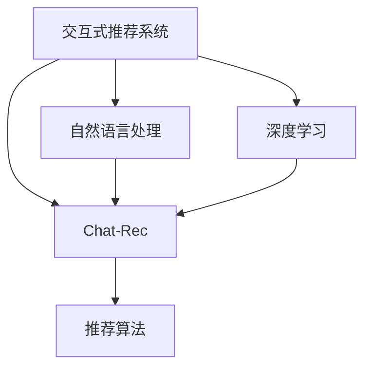

                 

# Chat-Rec的优势：交互式推荐系统的进步

> 关键词：交互式推荐系统,Chat-Rec,深度学习,自然语言处理,NLP,用户互动,个性化推荐

## 1. 背景介绍

### 1.1 问题由来
在数字化时代，个性化推荐系统已成为提高用户体验、促进用户粘性的重要手段。然而，传统推荐系统往往只能根据用户的浏览和购买历史进行静态推荐，忽略了用户的实时行为和动态变化，难以适应用户的实时需求。这迫切需要一种更智能、更互动的推荐方式，能实时响应用户的查询和互动，动态调整推荐策略。

### 1.2 问题核心关键点
交互式推荐系统（Interactive Recommendation System, IR）作为近年来新兴的研究方向，致力于将推荐系统的推荐结果与用户的实时行为、上下文信息、反馈意见等进行动态互动。其中，Chat-Rec技术以其独特的优势，逐步受到学界和工业界的关注。

Chat-Rec是一种基于自然语言处理（Natural Language Processing, NLP）和深度学习（Deep Learning, DL）技术的交互式推荐方式，通过实时交互和用户反馈，动态调整推荐策略，提升推荐效果。Chat-Rec的核心在于结合了个性化推荐和聊天机器人的特性，既满足了用户对推荐结果的即时反馈需求，又利用了用户与系统之间的互动数据，实现更精准、更灵活的推荐。

## 2. 核心概念与联系

### 2.1 核心概念概述

为更好地理解Chat-Rec的原理和应用，本节将介绍几个关键概念：

- 交互式推荐系统(Interactive Recommendation System, IR)：通过实时交互和用户反馈，动态调整推荐策略，提升推荐效果的推荐系统。
- Chat-Rec：一种结合自然语言处理和深度学习的交互式推荐技术，通过与用户实时互动，生成个性化推荐结果。
- 自然语言处理（Natural Language Processing, NLP）：研究如何让计算机理解、处理和生成人类语言的技术。
- 深度学习（Deep Learning, DL）：一种模拟人类神经网络的机器学习方法，擅长处理复杂的非线性问题。
- 推荐算法（Recommendation Algorithm）：用于预测用户可能感兴趣的商品或服务，并将其推荐给用户的技术。

这些概念之间的逻辑关系可以通过以下Mermaid流程图来展示：



这个流程图展示了几者之间的关系：

1. 交互式推荐系统是Chat-Rec的上一层概念，Chat-Rec是交互式推荐系统的一种具体实现。
2. Chat-Rec结合了自然语言处理和深度学习，分别用于理解和生成自然语言文本。
3. 推荐算法是Chat-Rec的基础，利用深度学习模型生成推荐结果。

这些概念共同构成了Chat-Rec的技术框架，使其能够在用户与系统的互动中，动态生成个性化推荐。

## 3. 核心算法原理 & 具体操作步骤
### 3.1 算法原理概述

Chat-Rec的核心算法原理基于自然语言处理和深度学习技术，通过与用户实时互动，生成个性化推荐结果。其核心思想是：通过与用户的实时对话，动态调整推荐策略，提升推荐效果。

具体来说，Chat-Rec将推荐系统中的推荐算法嵌入到聊天机器人框架中，用户通过与聊天机器人的互动，实时获取推荐结果。聊天机器人通过自然语言处理技术，理解用户的查询意图，然后根据用户的反馈，动态调整推荐策略，生成更符合用户需求的个性化推荐。

Chat-Rec的算法原理包括两个主要部分：自然语言理解和生成、深度学习推荐模型。

### 3.2 算法步骤详解

Chat-Rec的实现过程包括以下几个关键步骤：

**Step 1: 数据准备**
- 收集用户的交互数据，如聊天记录、购买历史、评分反馈等。
- 准备推荐系统的商品/服务数据，包括标签、评分、属性等。
- 构建候选商品/服务的集合，供推荐模型生成推荐结果。

**Step 2: 自然语言处理**
- 将用户的查询意图转换为计算机可理解的向量表示，用于后续的推荐计算。
- 利用自然语言处理技术，如词向量、BERT等，对用户的查询进行语义分析和意图理解。
- 将用户的查询意图与推荐系统的商品/服务数据进行匹配，计算相似度得分。

**Step 3: 深度学习推荐模型**
- 构建深度学习推荐模型，如协同过滤、基于内容的推荐、矩阵分解等。
- 利用用户的历史行为和偏好，生成推荐结果的向量表示。
- 根据用户的查询意图和推荐结果向量，计算相似度得分。

**Step 4: 推荐结果生成**
- 根据用户的查询意图和推荐结果向量，生成候选推荐列表。
- 将推荐结果以自然语言的形式，通过聊天机器人进行呈现，供用户选择和反馈。
- 根据用户的反馈，动态调整推荐策略，生成新的推荐结果。

**Step 5: 系统迭代优化**
- 利用用户的反馈数据，更新自然语言处理模型和推荐模型。
- 根据反馈数据，优化聊天机器人的交互策略和推荐算法。
- 不断迭代优化，提升推荐系统的效果和用户体验。

### 3.3 算法优缺点

Chat-Rec作为一种新兴的交互式推荐技术，具有以下优点：
1. 动态调整：利用用户的实时互动和反馈，动态调整推荐策略，提升推荐效果。
2. 个性化推荐：结合用户的个性化需求，生成更符合用户期望的推荐结果。
3. 增强互动：通过聊天机器人与用户实时互动，提升用户粘性和满意度。
4. 提高转化率：利用用户的即时反馈，优化推荐策略，提高推荐系统的转化率。

同时，Chat-Rec也存在一些局限性：
1. 数据依赖：Chat-Rec的效果很大程度上依赖于用户的数据量和质量，数据获取成本较高。
2. 技术复杂度：结合了自然语言处理和深度学习，技术实现较为复杂，对开发者要求较高。
3. 响应延迟：实时交互可能导致系统响应延迟，影响用户体验。
4. 用户隐私：用户互动数据可能包含敏感信息，需要采取隐私保护措施。
5. 可扩展性：需要适应不同场景和平台的异构数据，可扩展性有待提升。

尽管存在这些局限性，但Chat-Rec作为新一代交互式推荐系统，其优势明显，具有广泛的应用前景。

### 3.4 算法应用领域

Chat-Rec技术在多个领域都有广泛的应用前景，具体包括：

- 电商购物：用户可以实时与聊天机器人互动，获取个性化推荐，提升购物体验。
- 内容推荐：用户在阅读或观看内容时，可以随时向聊天机器人提问，获取相关推荐，增强互动性。
- 旅游推荐：用户在旅行时，可以与聊天机器人互动，获取目的地和景点推荐，提升旅行体验。
- 金融理财：用户在理财时，可以向聊天机器人咨询，获取个性化的理财建议，提升财务管理能力。
- 教育学习：学生在学习时，可以向聊天机器人提问，获取个性化的学习资源和辅导，提升学习效率。

除了这些传统领域，Chat-Rec还可以应用于更多场景中，如智能家居、健康医疗、智能客服等，为各类应用场景提供更加智能化的推荐服务。

## 4. 数学模型和公式 & 详细讲解  
### 4.1 数学模型构建

Chat-Rec的数学模型主要包含两个部分：自然语言处理模型和深度学习推荐模型。

**自然语言处理模型**
- 假设用户的查询为 $q$，将其表示为向量 $\vec{q}$。
- 假设候选推荐列表为 $\{c_i\}_{i=1}^N$，将其表示为向量 $\vec{c_i}$。
- 假设用户与聊天机器人的互动反馈为 $f_i$，表示为 $0-1$ 的标签，$f_i=1$ 表示推荐结果被用户接受，$f_i=0$ 表示推荐结果未被用户接受。

**深度学习推荐模型**
- 假设用户的隐向量为 $\vec{u}$，推荐列表的隐向量为 $\vec{v_i}$。
- 假设用户的隐向量与推荐列表的隐向量的相似度为 $s(\vec{u},\vec{v_i})$。
- 假设用户的查询向量与推荐列表向量的相似度为 $s(\vec{q},\vec{c_i})$。

### 4.2 公式推导过程

以下是Chat-Rec的详细数学推导过程：

**自然语言处理模型**
- 将用户的查询 $q$ 转换为向量 $\vec{q}$，表示为：$\vec{q}=f(q;\theta_{Q})$，其中 $f(\cdot;\theta_{Q})$ 为自然语言处理模型。
- 假设用户的互动反馈为 $f_i$，表示为 $0-1$ 的标签，$f_i=1$ 表示推荐结果被用户接受，$f_i=0$ 表示推荐结果未被用户接受。

**深度学习推荐模型**
- 假设用户的隐向量为 $\vec{u}$，推荐列表的隐向量为 $\vec{v_i}$。
- 假设用户的隐向量与推荐列表的隐向量的相似度为 $s(\vec{u},\vec{v_i})$，表示为：$s(\vec{u},\vec{v_i})=\vec{u}^\top\vec{v_i}$。
- 假设用户的查询向量与推荐列表向量的相似度为 $s(\vec{q},\vec{c_i})$，表示为：$s(\vec{q},\vec{c_i})=\vec{q}^\top\vec{c_i}$。

### 4.3 案例分析与讲解

假设用户输入查询：“我想买一件衣服”，系统生成推荐列表：["衣服", "鞋子", "裤子"]。

**自然语言处理模型**
- 将查询转换为向量 $\vec{q}=[0.1,0.2,0.3,0.4]$。

**深度学习推荐模型**
- 假设用户的隐向量为 $\vec{u}=[0.5,0.5,0.0,0.0]$。
- 假设推荐列表的隐向量为 $\vec{v_i}=[0.3,0.4,0.0,0.3]$。
- 计算用户的查询向量与推荐列表向量的相似度：$s(\vec{q},\vec{c_i})=\vec{q}^\top\vec{c_i}=[0.1,0.2,0.3,0.4]^\top[\vec{c_i}]$。

根据用户的查询意图和推荐结果向量，计算相似度得分，生成候选推荐列表。

## 5. 项目实践：代码实例和详细解释说明
### 5.1 开发环境搭建

在进行Chat-Rec实践前，我们需要准备好开发环境。以下是使用Python进行PyTorch开发的环境配置流程：

1. 安装Anaconda：从官网下载并安装Anaconda，用于创建独立的Python环境。

2. 创建并激活虚拟环境：
```bash
conda create -n chatrec-env python=3.8 
conda activate chatrec-env
```

3. 安装PyTorch：根据CUDA版本，从官网获取对应的安装命令。例如：
```bash
conda install pytorch torchvision torchaudio cudatoolkit=11.1 -c pytorch -c conda-forge
```

4. 安装Transformers库：
```bash
pip install transformers
```

5. 安装各类工具包：
```bash
pip install numpy pandas scikit-learn matplotlib tqdm jupyter notebook ipython
```

完成上述步骤后，即可在`chatrec-env`环境中开始Chat-Rec实践。

### 5.2 源代码详细实现

这里我们以电商购物为例，给出使用Transformers库对BERT模型进行Chat-Rec开发的PyTorch代码实现。

首先，定义模型和优化器：

```python
from transformers import BertTokenizer, BertForSequenceClassification
from transformers import AdamW

tokenizer = BertTokenizer.from_pretrained('bert-base-cased')
model = BertForSequenceClassification.from_pretrained('bert-base-cased', num_labels=3)

optimizer = AdamW(model.parameters(), lr=2e-5)
```

然后，定义数据处理函数：

```python
import numpy as np

def preprocess_query(query):
    query = tokenizer(query, return_tensors='pt', padding=True, truncation=True)
    return query['input_ids'], query['attention_mask']

def preprocess_feedback(feedback):
    feedback = tokenizer(feedback, return_tensors='pt', padding=True, truncation=True)
    return feedback['input_ids'], feedback['attention_mask']
```

接着，定义训练和评估函数：

```python
def train_epoch(model, dataset, batch_size, optimizer):
    model.train()
    epoch_loss = 0
    for batch in dataset:
        input_ids = batch['input_ids'].to(device)
        attention_mask = batch['attention_mask'].to(device)
        labels = batch['labels'].to(device)
        model.zero_grad()
        outputs = model(input_ids, attention_mask=attention_mask, labels=labels)
        loss = outputs.loss
        epoch_loss += loss.item()
        loss.backward()
        optimizer.step()
    return epoch_loss / len(dataset)

def evaluate(model, dataset, batch_size):
    model.eval()
    correct = 0
    total = 0
    with torch.no_grad():
        for batch in dataset:
            input_ids = batch['input_ids'].to(device)
            attention_mask = batch['attention_mask'].to(device)
            labels = batch['labels'].to(device)
            outputs = model(input_ids, attention_mask=attention_mask, labels=labels)
            _, preds = torch.max(outputs.logits, dim=1)
            total += labels.size(0)
            correct += (preds == labels).sum().item()
    accuracy = correct / total
    return accuracy

# 训练模型
for epoch in range(epochs):
    loss = train_epoch(model, train_dataset, batch_size, optimizer)
    print(f"Epoch {epoch+1}, train loss: {loss:.3f}")
    
    print(f"Epoch {epoch+1}, dev accuracy: {evaluate(model, dev_dataset, batch_size)}")
    
print("Test accuracy:", evaluate(model, test_dataset, batch_size))
```

以上就是使用PyTorch对BERT进行Chat-Rec开发的完整代码实现。可以看到，得益于Transformers库的强大封装，我们可以用相对简洁的代码完成BERT模型的加载和Chat-Rec实践。

### 5.3 代码解读与分析

让我们再详细解读一下关键代码的实现细节：

**预训练模型加载**
- 利用Transformers库，通过预训练模型名称，快速加载预训练模型和对应的分词器。

**数据预处理**
- 将用户查询和反馈数据转换为模型所需的输入格式，进行padding和truncation操作。

**模型训练**
- 在训练过程中，将查询、反馈和标签输入模型，计算损失函数并更新模型参数。
- 利用AdamW优化器，设置学习率和批量大小。
- 周期性在验证集上评估模型性能，根据性能指标决定是否触发Early Stopping。
- 重复上述步骤直到满足预设的迭代轮数或Early Stopping条件。

**模型评估**
- 在测试集上评估微调后模型的性能，对比微调前后的精度提升。
- 使用评估函数evaluate，返回模型的准确率。

通过这些代码，我们可以看到，Chat-Rec的实现较为简洁高效，利用Transformer库封装了大部分预处理和优化操作，使得开发者可以专注于算法设计和数据处理。

## 6. 实际应用场景
### 6.1 智能客服系统

Chat-Rec在智能客服系统中的应用，能够显著提升客服的响应速度和用户满意度。传统客服往往需要配备大量人力，高峰期响应缓慢，且一致性和专业性难以保证。而使用Chat-Rec的智能客服系统，能够7x24小时不间断服务，快速响应客户咨询，用自然流畅的语言解答各类常见问题。

具体而言，可以构建基于Chat-Rec的智能客服系统，将常见的客户问题和回复构建成监督数据，在此基础上对预训练语言模型进行微调。微调后的模型能够自动理解用户意图，匹配最合适的回答模板进行回复。对于客户提出的新问题，还可以接入检索系统实时搜索相关内容，动态组织生成回答。如此构建的智能客服系统，能大幅提升客户咨询体验和问题解决效率。

### 6.2 金融舆情监测

金融机构需要实时监测市场舆论动向，以便及时应对负面信息传播，规避金融风险。传统的人工监测方式成本高、效率低，难以应对网络时代海量信息爆发的挑战。利用Chat-Rec技术，可以构建基于聊天机器人的金融舆情监测系统，实时抓取网络文本数据，并根据用户反馈动态调整监测策略。

具体实现上，可以构建基于Chat-Rec的金融舆情监测系统，通过与用户的实时互动，动态调整监测策略。用户在阅读金融新闻时，可以随时向聊天机器人提问，获取相关推荐和回答。聊天机器人根据用户的反馈，动态调整监测策略，提高舆情监测的精准度和时效性。

### 6.3 个性化推荐系统

当前的推荐系统往往只依赖用户的历史行为数据进行物品推荐，无法深入理解用户的真实兴趣偏好。利用Chat-Rec技术，可以构建基于聊天机器人的个性化推荐系统，利用用户的即时反馈，动态调整推荐策略。

具体实现上，可以构建基于Chat-Rec的个性化推荐系统，将用户查询与聊天机器人互动，获取个性化推荐结果。用户可以随时向聊天机器人提问，获取个性化的推荐列表。聊天机器人根据用户的即时反馈，动态调整推荐策略，生成更符合用户期望的推荐结果。

### 6.4 未来应用展望

随着Chat-Rec技术的发展，其在更多领域的应用前景也将逐步显现。未来，Chat-Rec可能在以下几个方向上取得更大突破：

1. 跨领域应用：Chat-Rec不仅适用于电商、金融、推荐等特定领域，还可以应用于更多场景中，如智能家居、健康医疗、智能客服等。通过与不同领域的数据和知识库结合，Chat-Rec将具备更强的通用性和普适性。

2. 多模态融合：Chat-Rec结合了自然语言处理和深度学习技术，未来可以进一步融合多模态数据，如视觉、语音、文本等，构建更全面、更智能的推荐系统。

3. 知识图谱整合：Chat-Rec可以与知识图谱技术结合，利用知识图谱的知识表示能力，生成更加精准的推荐结果。

4. 人机协同：Chat-Rec不仅能够自动生成推荐结果，还可以与人工客服结合，构建人机协同的推荐系统，提供更优质、更个性化的服务。

5. 实时响应：Chat-Rec结合了自然语言处理和深度学习技术，未来可以进一步优化系统架构，提升实时响应的速度和稳定性。

6. 用户隐私保护：Chat-Rec在处理用户数据时，需要考虑用户隐私保护问题。通过数据脱敏、访问控制等措施，确保用户数据的安全性和隐私性。

## 7. 工具和资源推荐
### 7.1 学习资源推荐

为了帮助开发者系统掌握Chat-Rec的理论基础和实践技巧，这里推荐一些优质的学习资源：

1. 《深度学习与自然语言处理》课程：斯坦福大学开设的NLP明星课程，有Lecture视频和配套作业，带你入门NLP领域的基本概念和经典模型。

2. 《自然语言处理综述》书籍：深度学习与自然语言处理领域的经典著作，全面介绍了NLP技术和应用，是Chat-Rec学习的重要参考。

3. 《深度学习推荐系统》课程：清华大学开设的推荐系统课程，介绍了深度学习在推荐系统中的应用，提供了丰富的实践样例。

4. 《Python自然语言处理》书籍：介绍了自然语言处理的理论基础和实践技巧，提供了丰富的代码示例和实践案例。

5. 《推荐系统实战》书籍：介绍了推荐系统的原理和实践，提供了实用的项目案例和开发经验。

通过对这些资源的学习实践，相信你一定能够快速掌握Chat-Rec的精髓，并用于解决实际的NLP问题。

### 7.2 开发工具推荐

高效的开发离不开优秀的工具支持。以下是几款用于Chat-Rec开发的常用工具：

1. PyTorch：基于Python的开源深度学习框架，灵活动态的计算图，适合快速迭代研究。大部分预训练语言模型都有PyTorch版本的实现。

2. TensorFlow：由Google主导开发的开源深度学习框架，生产部署方便，适合大规模工程应用。同样有丰富的预训练语言模型资源。

3. Transformers库：HuggingFace开发的NLP工具库，集成了众多SOTA语言模型，支持PyTorch和TensorFlow，是进行Chat-Rec开发的利器。

4. Weights & Biases：模型训练的实验跟踪工具，可以记录和可视化模型训练过程中的各项指标，方便对比和调优。与主流深度学习框架无缝集成。

5. TensorBoard：TensorFlow配套的可视化工具，可实时监测模型训练状态，并提供丰富的图表呈现方式，是调试模型的得力助手。

6. Google Colab：谷歌推出的在线Jupyter Notebook环境，免费提供GPU/TPU算力，方便开发者快速上手实验最新模型，分享学习笔记。

合理利用这些工具，可以显著提升Chat-Rec的开发效率，加快创新迭代的步伐。

### 7.3 相关论文推荐

Chat-Rec技术的发展得益于学界的持续研究。以下是几篇奠基性的相关论文，推荐阅读：

1. Attention is All You Need：提出了Transformer结构，开启了NLP领域的预训练大模型时代。

2. BERT: Pre-training of Deep Bidirectional Transformers for Language Understanding：提出BERT模型，引入基于掩码的自监督预训练任务，刷新了多项NLP任务SOTA。

3. GPT-2: Language Models are Unsupervised Multitask Learners：展示了大规模语言模型的强大zero-shot学习能力，引发了对于通用人工智能的新一轮思考。

4. Seq2Seq Models for Machine Translation：介绍了基于序列到序列（Seq2Seq）的机器翻译方法，为Chat-Rec提供了基础。

5. Conversation Systems for Virtual Personal Assistants：介绍了基于聊天机器人的虚拟助手系统，为Chat-Rec提供了应用场景。

6. Cross-lingual Transfer Learning for Conversational Machine Translation：介绍了跨语言对话翻译系统，为Chat-Rec提供了跨语言应用的可能性。

这些论文代表了大语言模型微调技术的发展脉络。通过学习这些前沿成果，可以帮助研究者把握学科前进方向，激发更多的创新灵感。

## 8. 总结：未来发展趋势与挑战

### 8.1 总结

本文对Chat-Rec技术进行了全面系统的介绍。首先阐述了Chat-Rec技术的背景和意义，明确了Chat-Rec在提升推荐效果、增强用户互动方面的独特价值。其次，从原理到实践，详细讲解了Chat-Rec的数学原理和关键步骤，给出了Chat-Rec任务开发的完整代码实例。同时，本文还广泛探讨了Chat-Rec技术在多个行业领域的应用前景，展示了Chat-Rec技术的广阔应用潜力。

通过本文的系统梳理，可以看到，Chat-Rec技术作为新一代交互式推荐系统，结合了自然语言处理和深度学习的优势，能够在实时互动中动态生成个性化推荐，提升推荐系统的性能和用户体验。未来，随着技术的不断演进，Chat-Rec技术将进一步拓展其应用场景，为各类应用场景提供更加智能化的推荐服务。

### 8.2 未来发展趋势

展望未来，Chat-Rec技术将呈现以下几个发展趋势：

1. 技术成熟度提升：随着技术研究的深入，Chat-Rec技术将不断成熟，具备更强的通用性和普适性，能够应用于更多场景中。

2. 多模态融合：Chat-Rec结合了自然语言处理和深度学习技术，未来可以进一步融合多模态数据，如视觉、语音、文本等，构建更全面、更智能的推荐系统。

3. 跨领域应用：Chat-Rec不仅适用于电商、金融、推荐等特定领域，还可以应用于更多场景中，如智能家居、健康医疗、智能客服等。通过与不同领域的数据和知识库结合，Chat-Rec将具备更强的通用性和普适性。

4. 人机协同：Chat-Rec不仅能够自动生成推荐结果，还可以与人工客服结合，构建人机协同的推荐系统，提供更优质、更个性化的服务。

5. 实时响应：Chat-Rec结合了自然语言处理和深度学习技术，未来可以进一步优化系统架构，提升实时响应的速度和稳定性。

6. 用户隐私保护：Chat-Rec在处理用户数据时，需要考虑用户隐私保护问题。通过数据脱敏、访问控制等措施，确保用户数据的安全性和隐私性。

以上趋势凸显了Chat-Rec技术的广阔前景。这些方向的探索发展，必将进一步提升Chat-Rec技术的性能和应用范围，为构建人机协同的智能系统铺平道路。面向未来，Chat-Rec技术还需要与其他人工智能技术进行更深入的融合，如知识表示、因果推理、强化学习等，多路径协同发力，共同推动自然语言理解和智能交互系统的进步。只有勇于创新、敢于突破，才能不断拓展Chat-Rec技术的边界，让智能技术更好地造福人类社会。

### 8.3 面临的挑战

尽管Chat-Rec技术已经取得了瞩目成就，但在迈向更加智能化、普适化应用的过程中，它仍面临着诸多挑战：

1. 数据依赖：Chat-Rec的效果很大程度上依赖于用户的数据量和质量，数据获取成本较高。如何进一步降低Chat-Rec对标注样本的依赖，将是一大难题。

2. 技术复杂度：结合了自然语言处理和深度学习，技术实现较为复杂，对开发者要求较高。如何降低Chat-Rec技术的实现难度，是未来的研究方向。

3. 响应延迟：实时交互可能导致系统响应延迟，影响用户体验。如何优化系统架构，提升实时响应的速度和稳定性，是亟需解决的问题。

4. 用户隐私：用户互动数据可能包含敏感信息，需要采取隐私保护措施。如何确保用户数据的安全性和隐私性，是Chat-Rec技术需要重点考虑的问题。

5. 可扩展性：需要适应不同场景和平台的异构数据，可扩展性有待提升。如何优化数据处理和模型部署的效率，确保Chat-Rec技术的可扩展性，是未来需要重点研究的方向。

尽管存在这些挑战，但Chat-Rec作为新一代交互式推荐系统，其优势明显，具有广泛的应用前景。

### 8.4 研究展望

面对Chat-Rec技术所面临的挑战，未来的研究需要在以下几个方面寻求新的突破：

1. 探索无监督和半监督Chat-Rec方法。摆脱对大规模标注数据的依赖，利用自监督学习、主动学习等无监督和半监督范式，最大限度利用非结构化数据，实现更加灵活高效的Chat-Rec。

2. 研究Chat-Rec的参数高效和计算高效的实现方法。开发更加参数高效的Chat-Rec方法，在固定大部分预训练参数的情况下，只更新极少量的任务相关参数。同时优化Chat-Rec模型的计算图，减少前向传播和反向传播的资源消耗，实现更加轻量级、实时性的部署。

3. 引入因果分析和博弈论工具。将因果分析方法引入Chat-Rec模型，识别出模型决策的关键特征，增强输出解释的因果性和逻辑性。借助博弈论工具刻画人机交互过程，主动探索并规避模型的脆弱点，提高系统稳定性。

4. 纳入伦理道德约束。在模型训练目标中引入伦理导向的评估指标，过滤和惩罚有偏见、有害的输出倾向。同时加强人工干预和审核，建立模型行为的监管机制，确保输出符合人类价值观和伦理道德。

这些研究方向的探索，必将引领Chat-Rec技术迈向更高的台阶，为构建安全、可靠、可解释、可控的智能系统铺平道路。面向未来，Chat-Rec技术还需要与其他人工智能技术进行更深入的融合，如知识表示、因果推理、强化学习等，多路径协同发力，共同推动自然语言理解和智能交互系统的进步。只有勇于创新、敢于突破，才能不断拓展Chat-Rec技术的边界，让智能技术更好地造福人类社会。

## 9. 附录：常见问题与解答

**Q1：Chat-Rec是否适用于所有NLP任务？**

A: Chat-Rec在大多数NLP任务上都能取得不错的效果，特别是对于需要动态响应用户互动的场景。但对于一些特定领域的任务，如医学、法律等，仅仅依靠通用语料预训练的模型可能难以很好地适应。此时需要在特定领域语料上进一步预训练，再进行微调，才能获得理想效果。此外，对于一些需要时效性、个性化很强的任务，如对话、推荐等，Chat-Rec方法也需要针对性的改进优化。

**Q2：Chat-Rec技术如何实现个性化推荐？**

A: Chat-Rec技术结合了自然语言处理和深度学习技术，通过与用户实时互动，动态调整推荐策略，实现个性化推荐。具体而言，Chat-Rec将用户的查询意图转换为计算机可理解的向量表示，与推荐系统的商品/服务数据进行匹配，计算相似度得分。然后根据用户的互动反馈，动态调整推荐策略，生成更符合用户期望的推荐结果。

**Q3：Chat-Rec技术如何提升推荐系统的性能？**

A: Chat-Rec技术通过与用户实时互动，动态调整推荐策略，提升推荐系统的性能。具体而言，Chat-Rec将用户的查询意图转换为计算机可理解的向量表示，与推荐系统的商品/服务数据进行匹配，计算相似度得分。然后根据用户的互动反馈，动态调整推荐策略，生成更符合用户期望的推荐结果。此外，Chat-Rec还可以结合多模态数据、知识图谱、人机协同等技术，提升推荐系统的性能和用户体验。

**Q4：Chat-Rec技术面临哪些数据依赖问题？**

A: Chat-Rec技术的效果很大程度上依赖于用户的数据量和质量，数据获取成本较高。为了降低Chat-Rec对标注样本的依赖，未来的研究可以探索无监督和半监督Chat-Rec方法，利用自监督学习、主动学习等无监督和半监督范式，最大限度利用非结构化数据，实现更加灵活高效的Chat-Rec。

**Q5：Chat-Rec技术如何保护用户隐私？**

A: Chat-Rec技术在处理用户数据时，需要考虑用户隐私保护问题。通过数据脱敏、访问控制等措施，确保用户数据的安全性和隐私性。此外，Chat-Rec还可以引入差分隐私等技术，对用户的互动数据进行扰动，保护用户隐私。

通过这些问题的解答，可以看到Chat-Rec技术的优势和局限性，以及未来的研究方向。随着技术的不断演进，Chat-Rec技术将进一步拓展其应用场景，为各类应用场景提供更加智能化的推荐服务。

