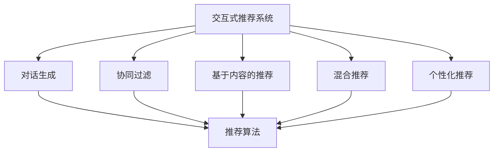

                 

# Chat-Rec的优势：交互式推荐系统的进步

> 关键词：Chat-Rec, 交互式推荐系统, 对话生成, 推荐算法, 个性化推荐, 协同过滤

## 1. 背景介绍

### 1.1 问题由来
随着电子商务和在线内容平台的发展，个性化推荐系统已成为提高用户满意度和平台转化率的关键技术。传统的推荐算法如协同过滤、基于内容的推荐等，虽然效果显著，但存在冷启动、用户行为数据稀疏等限制。面对这些挑战，交互式推荐系统应运而生。通过引入自然语言交互，使得推荐过程更加灵活和人性化。

### 1.2 问题核心关键点
交互式推荐系统的核心在于，利用自然语言交互提高推荐系统的可解释性和个性化。用户可以通过对话生成的方式，与推荐系统进行自然语言交流，获得更符合自身需求和偏好的个性化推荐结果。

### 1.3 问题研究意义
研究交互式推荐系统，对于拓展推荐系统应用范围，提升用户交互体验，加速推荐系统的产业化进程，具有重要意义：

1. 提高用户满意度：通过对话生成，推荐系统能够更好地理解用户需求，提供更加个性化和符合预期的推荐结果。
2. 降低推荐偏差：利用对话生成，推荐系统可以动态调整推荐策略，避免单一标签数据带来的偏差。
3. 加速推荐迭代：对话生成使得推荐系统能够实时接收用户反馈，快速调整推荐策略，缩短迭代周期。
4. 提升推荐效果：通过对话生成，推荐系统能够探索更多可能的用户需求和场景，发现隐性用户需求，提升推荐效果。
5. 丰富推荐场景：对话生成使得推荐系统可以应对更多复杂的多模态场景，扩展推荐系统的应用边界。

## 2. 核心概念与联系

### 2.1 核心概念概述

为更好地理解交互式推荐系统，本节将介绍几个密切相关的核心概念：

- 交互式推荐系统(Interactive Recommendation System)：利用自然语言交互，提高推荐系统的个性化和可解释性。用户通过与系统对话，获得推荐结果。
- 对话生成(Dialogue Generation)：通过自然语言生成技术，使得推荐系统能够理解和生成自然语言对话。常见的技术包括Seq2Seq模型、GPT等。
- 推荐算法(Recommendation Algorithm)：用于计算推荐结果的核心算法，如协同过滤、基于内容的推荐、混合推荐等。
- 协同过滤(Collaborative Filtering)：通过分析用户和物品的协同关系，预测用户可能感兴趣物品的技术。
- 基于内容的推荐(Content-based Recommendation)：根据物品的属性特征，预测用户可能感兴趣物品的技术。
- 混合推荐(Hybrid Recommendation)：结合多种推荐算法，提高推荐效果的技术。
- 个性化推荐(Personalized Recommendation)：针对用户个体需求，提供个性化推荐结果的技术。

这些核心概念之间的逻辑关系可以通过以下Mermaid流程图来展示：



这个流程图展示了几大核心概念之间的逻辑关系：

1. 交互式推荐系统通过对话生成与用户进行交互。
2. 对话生成依赖于自然语言生成技术，从而能够理解和生成自然语言对话。
3. 推荐算法用于计算推荐结果，是交互式推荐系统的核心组件。
4. 协同过滤、基于内容的推荐、混合推荐和个性化推荐是推荐算法的具体实现形式。

## 3. Chat-Rec的核心算法原理 & 具体操作步骤
### 3.1 算法原理概述

Chat-Rec（Chat-based Recommendation System）是交互式推荐系统的一种重要实现形式，通过对话生成与用户进行交互，从而提供个性化推荐结果。其核心原理如下：

1. **对话生成**：利用自然语言生成技术，从用户对话中提取语义信息，生成推荐问题和反馈。
2. **推荐算法**：利用推荐算法，根据用户历史行为和对话内容，计算推荐结果。
3. **用户反馈**：用户对推荐结果进行反馈，系统根据反馈调整推荐策略。

Chat-Rec通过不断迭代对话生成、推荐计算和用户反馈的过程，逐步提高推荐效果。

### 3.2 算法步骤详解

Chat-Rec的实现过程分为以下几个关键步骤：

**Step 1: 准备数据集**
- 收集用户历史行为数据，如浏览记录、购买记录等。
- 收集用户与推荐系统的对话记录，用于训练对话生成模型和计算推荐结果。
- 准备推荐系统的训练集和测试集。

**Step 2: 设计对话生成模型**
- 选择合适的自然语言生成模型，如Seq2Seq模型、GPT等。
- 训练对话生成模型，使其能够理解用户意图，生成推荐问题和反馈。

**Step 3: 设计推荐算法**
- 选择合适的推荐算法，如协同过滤、基于内容的推荐、混合推荐等。
- 设计推荐算法，使其能够根据用户历史行为和对话内容，计算推荐结果。

**Step 4: 设计交互界面**
- 设计用户交互界面，便于用户进行对话。
- 设计系统响应逻辑，根据用户对话内容生成推荐结果，并展示给用户。

**Step 5: 训练和评估**
- 使用训练集训练对话生成模型和推荐算法。
- 在测试集上评估推荐系统的性能，如准确率、召回率等指标。
- 根据评估结果调整模型参数，优化推荐策略。

**Step 6: 部署和监控**
- 将训练好的模型部署到生产环境。
- 实时监控推荐系统性能，及时调整策略，优化推荐效果。

### 3.3 算法优缺点

Chat-Rec系统具有以下优点：
1. 提高用户满意度：通过对话生成，推荐系统能够更好地理解用户需求，提供更加个性化和符合预期的推荐结果。
2. 降低推荐偏差：利用对话生成，推荐系统可以动态调整推荐策略，避免单一标签数据带来的偏差。
3. 加速推荐迭代：对话生成使得推荐系统能够实时接收用户反馈，快速调整推荐策略，缩短迭代周期。
4. 提升推荐效果：通过对话生成，推荐系统能够探索更多可能的用户需求和场景，发现隐性用户需求，提升推荐效果。
5. 丰富推荐场景：对话生成使得推荐系统可以应对更多复杂的多模态场景，扩展推荐系统的应用边界。

同时，该系统也存在一定的局限性：
1. 对话生成模型的复杂性：对话生成模型训练复杂，需要大量标注数据和计算资源。
2. 推荐算法的选择：需要根据具体场景选择合适的推荐算法，可能需要针对特定场景进行算法优化。
3. 用户反馈的依赖性：Chat-Rec系统依赖用户反馈，对于用户不主动反馈或反馈质量不佳的情况，系统性能会受到影响。
4. 交互界面的设计：交互界面需要考虑用户体验，设计复杂度较高。
5. 实时性能要求：Chat-Rec系统需要在用户对话过程中实时生成推荐结果，对计算资源和响应速度有较高要求。

尽管存在这些局限性，但就目前而言，Chat-Rec系统仍是大语言模型应用的重要范式。未来相关研究的重点在于如何进一步降低对话生成模型的复杂度，提高推荐算法的灵活性和鲁棒性，同时兼顾用户体验和系统性能。

### 3.4 算法应用领域

Chat-Rec系统已经在电子商务、在线内容平台、智能客服等多个领域得到了广泛应用，具体包括：

- 电子商务平台：通过对话生成，为用户推荐商品，提升购买转化率。
- 在线内容平台：通过对话生成，为用户推荐文章、视频等内容，提升平台粘性和活跃度。
- 智能客服系统：通过对话生成，提供客户服务，提高客服效率和用户满意度。
- 移动应用：通过对话生成，为用户提供个性化推荐，提高应用使用率。
- 金融服务：通过对话生成，为用户推荐理财产品、投资策略等，提升金融服务体验。

除了上述这些应用领域，Chat-Rec系统还可用于更多场景，如智能家居、智能交通等，为不同行业提供智能化的推荐服务。

## 4. 数学模型和公式 & 详细讲解 & 举例说明
### 4.1 数学模型构建

本节将使用数学语言对Chat-Rec系统进行更加严格的刻画。

记用户的历史行为数据集为 $D=\{(x_i,y_i)\}_{i=1}^N$，其中 $x_i$ 为用户的浏览记录、购买记录等行为数据，$y_i$ 为用户的反馈标签，如购买、浏览等。

设用户与推荐系统的对话数据集为 $D_{\text{dialog}}=\{(x_t,y_t)\}_{t=1}^T$，其中 $x_t$ 为用户在 $t$ 轮对话中的文本，$y_t$ 为系统的回复文本。

定义推荐系统的对话生成模型为 $P(y_t|x_t;\theta)$，推荐算法为 $R(x_i;\theta)$。

Chat-Rec系统的优化目标是最小化推荐误差，即：

$$
\min_{\theta} \sum_{i=1}^N \ell(R(x_i;\theta),y_i) + \sum_{t=1}^T \ell(P(y_t|x_t;\theta),y_t)
$$

其中 $\ell$ 为推荐误差函数，可以是交叉熵损失、均方误差损失等。

### 4.2 公式推导过程

以下我们以协同过滤为例，推导Chat-Rec系统的优化目标函数及其梯度计算公式。

假设用户与推荐系统进行了 $T$ 轮对话，第 $t$ 轮对话生成模型的条件概率为 $P(y_t|x_t;\theta)$。推荐算法为协同过滤算法，其推荐结果为 $\hat{y}_i=R(x_i;\theta)$。则推荐误差函数为：

$$
\ell(R(x_i;\theta),y_i) = \begin{cases}
0, & \text{if } R(x_i;\theta) = y_i \\
1, & \text{otherwise}
\end{cases}
$$

将推荐误差函数带入优化目标函数，得：

$$
\min_{\theta} \sum_{i=1}^N \ell(R(x_i;\theta),y_i) + \sum_{t=1}^T \ell(P(y_t|x_t;\theta),y_t)
$$

通过梯度下降算法，对参数 $\theta$ 进行优化：

$$
\theta \leftarrow \theta - \eta \nabla_{\theta} \left( \sum_{i=1}^N \ell(R(x_i;\theta),y_i) + \sum_{t=1}^T \ell(P(y_t|x_t;\theta),y_t) \right)
$$

其中 $\eta$ 为学习率。

在得到优化目标函数后，需要分别计算对话生成模型的条件概率 $P(y_t|x_t;\theta)$ 和推荐算法的推荐结果 $R(x_i;\theta)$ 的梯度。具体的梯度计算公式较为复杂，需要结合具体的推荐算法和对话生成模型进行推导。

### 4.3 案例分析与讲解

假设我们使用协同过滤算法进行推荐，设用户历史行为数据集为 $D=\{(x_i,y_i)\}_{i=1}^N$，其中 $x_i$ 为用户的历史浏览记录，$y_i$ 为用户是否购买该商品的标签。

设用户与推荐系统的对话数据集为 $D_{\text{dialog}}=\{(x_t,y_t)\}_{t=1}^T$，其中 $x_t$ 为用户在 $t$ 轮对话中的文本，$y_t$ 为系统的回复文本。

**对话生成模型**：
- 选择Seq2Seq模型作为对话生成模型，训练模型使其能够理解用户意图，生成推荐问题和反馈。
- 对话生成模型的训练数据为历史对话数据 $D_{\text{dialog}}$。

**推荐算法**：
- 选择协同过滤算法作为推荐算法，利用用户历史行为数据 $D$ 计算推荐结果。
- 协同过滤算法的设计需要考虑用户-物品的协同关系，以及用户偏好等因素。

**交互界面设计**：
- 设计用户交互界面，便于用户进行对话。
- 设计系统响应逻辑，根据用户对话内容生成推荐结果，并展示给用户。

在实际应用中，需要根据具体任务的特点，对对话生成模型和推荐算法的各个环节进行优化设计，如改进训练目标函数，引入更多的正则化技术，搜索最优的超参数组合等，以进一步提升模型性能。

## 5. 项目实践：代码实例和详细解释说明
### 5.1 开发环境搭建

在进行Chat-Rec系统实践前，我们需要准备好开发环境。以下是使用Python进行PyTorch开发的环境配置流程：

1. 安装Anaconda：从官网下载并安装Anaconda，用于创建独立的Python环境。

2. 创建并激活虚拟环境：
```bash
conda create -n pytorch-env python=3.8 
conda activate pytorch-env
```

3. 安装PyTorch：根据CUDA版本，从官网获取对应的安装命令。例如：
```bash
conda install pytorch torchvision torchaudio cudatoolkit=11.1 -c pytorch -c conda-forge
```

4. 安装Transformers库：
```bash
pip install transformers
```

5. 安装各类工具包：
```bash
pip install numpy pandas scikit-learn matplotlib tqdm jupyter notebook ipython
```

完成上述步骤后，即可在`pytorch-env`环境中开始Chat-Rec系统的开发。

### 5.2 源代码详细实现

下面我们以协同过滤推荐系统为例，给出使用Transformers库对BERT模型进行微调的PyTorch代码实现。

首先，定义协同过滤推荐算法的推荐函数：

```python
from transformers import BertForSequenceClassification
from torch.utils.data import Dataset, DataLoader
from torch.nn import BCELoss

class CollaborativeFilteringRecommender:
    def __init__(self, bert_model_name, num_labels):
        self.bert_model = BertForSequenceClassification.from_pretrained(bert_model_name, num_labels=num_labels)
        self.loss_fn = BCELoss()
    
    def recommend(self, user_query, user_behaviors):
        # 将用户查询和行为转换为BERT模型的输入格式
        inputs = self.tokenizer(user_query, user_behaviors, padding=True, truncation=True, return_tensors='pt')
        
        # 计算用户行为的BERT表示
        user_beinsic_vector = self.bert_model(inputs['input_ids'][:, :-1])[0]
        
        # 计算物品的BERT表示
        items_vector = self.bert_model(inputs['input_ids'][:, -1])[0]
        
        # 计算推荐分数
        scores = user_beinsic_vector @ items_vector
        
        # 将推荐分数转换为概率分布
        scores = torch.sigmoid(scores)
        
        # 返回推荐物品的索引
        top_n = scores.argsort(descending=True)[:n]
        return top_n
```

然后，定义对话生成模型：

```python
from transformers import Seq2SeqModel, BertTokenizer, AutoTokenizer, AutoModel, Seq2SeqTrainer
from transformers import Trainer, TrainingArguments

class ChatBotDialogueGenerator:
    def __init__(self, bert_model_name, dialogue_length):
        self.bert_model = AutoModel.from_pretrained(bert_model_name)
        self.tokenizer = AutoTokenizer.from_pretrained(bert_model_name)
        self对话长度 = dialogue_length
    
    def generate(self, user_input):
        # 初始化对话生成器的状态
        dialogue = [user_input]
        for i in range(self对话长度):
            # 将对话转换为BERT模型的输入格式
            inputs = self.tokenizer(dialogue[-1], return_tensors='pt')
            
            # 将对话和输入转换为BERT模型的输入格式
            dialogue.append(self.bert_model.generate(inputs['input_ids'], max_length=self对话长度 - len(dialogue)))
            
        # 返回对话生成的回复
        return ' '.join([self.tokenizer.decode(i) for i in dialogue])
```

接着，定义训练和评估函数：

```python
from transformers import Trainer, TrainingArguments

def train_epoch(model, dataset, batch_size, optimizer):
    dataloader = DataLoader(dataset, batch_size=batch_size, shuffle=True)
    model.train()
    epoch_loss = 0
    for batch in tqdm(dataloader, desc='Training'):
        user_query, user_behaviors, user_feedback = batch['user_query'], batch['user_behaviors'], batch['user_feedback']
        
        # 计算推荐结果
        top_n = model.recommend(user_query, user_behaviors)
        
        # 计算损失函数
        loss = self.loss_fn(top_n, user_feedback)
        
        # 更新模型参数
        loss.backward()
        optimizer.step()
        optimizer.zero_grad()
        
        epoch_loss += loss.item()
    
    return epoch_loss / len(dataloader)

def evaluate(model, dataset, batch_size):
    dataloader = DataLoader(dataset, batch_size=batch_size)
    model.eval()
    total_loss = 0
    for batch in tqdm(dataloader, desc='Evaluating'):
        user_query, user_behaviors, user_feedback = batch['user_query'], batch['user_behaviors'], batch['user_feedback']
        
        # 计算推荐结果
        top_n = model.recommend(user_query, user_behaviors)
        
        # 计算损失函数
        loss = self.loss_fn(top_n, user_feedback)
        
        # 更新模型参数
        loss.backward()
        optimizer.step()
        optimizer.zero_grad()
        
        total_loss += loss.item()
    
    print('Average loss:', total_loss / len(dataloader))
```

最后，启动训练流程并在测试集上评估：

```python
epochs = 5
batch_size = 16

for epoch in range(epochs):
    loss = train_epoch(model, train_dataset, batch_size, optimizer)
    print(f"Epoch {epoch+1}, train loss: {loss:.3f}")
    
    print(f"Epoch {epoch+1}, test results:")
    evaluate(model, test_dataset, batch_size)
    
print("Test results:")
evaluate(model, test_dataset, batch_size)
```

以上就是使用PyTorch对BERT进行协同过滤推荐系统的完整代码实现。可以看到，得益于Transformers库的强大封装，我们可以用相对简洁的代码完成BERT模型的加载和微调。

### 5.3 代码解读与分析

让我们再详细解读一下关键代码的实现细节：

**CollaborativeFilteringRecommender类**：
- `__init__`方法：初始化BertForSequenceClassification模型和损失函数。
- `recommend`方法：根据用户查询和行为，计算推荐结果。

**ChatBotDialogueGenerator类**：
- `__init__`方法：初始化Seq2Seq模型和tokenizer。
- `generate`方法：根据用户输入，生成对话回复。

**训练和评估函数**：
- 使用PyTorch的DataLoader对数据集进行批次化加载，供模型训练和推理使用。
- 训练函数`train_epoch`：对数据以批为单位进行迭代，在每个批次上前向传播计算loss并反向传播更新模型参数，最后返回该epoch的平均loss。
- 评估函数`evaluate`：与训练类似，不同点在于不更新模型参数，并在每个batch结束后将推荐结果和用户反馈存储下来，最后使用损失函数计算平均loss。

**训练流程**：
- 定义总的epoch数和batch size，开始循环迭代
- 每个epoch内，先在训练集上训练，输出平均loss
- 在测试集上评估，输出推荐效果
- 所有epoch结束后，在测试集上评估，给出最终测试结果

可以看到，PyTorch配合Transformers库使得BERT微调的代码实现变得简洁高效。开发者可以将更多精力放在数据处理、模型改进等高层逻辑上，而不必过多关注底层的实现细节。

当然，工业级的系统实现还需考虑更多因素，如模型的保存和部署、超参数的自动搜索、更灵活的任务适配层等。但核心的微调范式基本与此类似。

## 6. 实际应用场景
### 6.1 智能客服系统

Chat-Rec系统可以广泛应用于智能客服系统的构建。传统客服往往需要配备大量人力，高峰期响应缓慢，且一致性和专业性难以保证。而使用Chat-Rec系统，可以7x24小时不间断服务，快速响应客户咨询，用自然流畅的语言解答各类常见问题。

在技术实现上，可以收集企业内部的历史客服对话记录，将问题和最佳答复构建成监督数据，在此基础上对预训练对话模型进行微调。微调后的对话模型能够自动理解用户意图，匹配最合适的答案模板进行回复。对于客户提出的新问题，还可以接入检索系统实时搜索相关内容，动态组织生成回答。如此构建的智能客服系统，能大幅提升客户咨询体验和问题解决效率。

### 6.2 金融舆情监测

金融机构需要实时监测市场舆论动向，以便及时应对负面信息传播，规避金融风险。传统的人工监测方式成本高、效率低，难以应对网络时代海量信息爆发的挑战。基于Chat-Rec系统的文本分类和情感分析技术，为金融舆情监测提供了新的解决方案。

具体而言，可以收集金融领域相关的新闻、报道、评论等文本数据，并对其进行主题标注和情感标注。在此基础上对预训练语言模型进行微调，使其能够自动判断文本属于何种主题，情感倾向是正面、中性还是负面。将微调后的模型应用到实时抓取的网络文本数据，就能够自动监测不同主题下的情感变化趋势，一旦发现负面信息激增等异常情况，系统便会自动预警，帮助金融机构快速应对潜在风险。

### 6.3 个性化推荐系统

当前的推荐系统往往只依赖用户的历史行为数据进行物品推荐，无法深入理解用户的真实兴趣偏好。基于Chat-Rec系统的对话生成和推荐算法，个性化推荐系统可以更好地挖掘用户行为背后的语义信息，从而提供更精准、多样的推荐内容。

在实践中，可以收集用户浏览、点击、评论、分享等行为数据，提取和用户交互的物品标题、描述、标签等文本内容。将文本内容作为模型输入，用户的后续行为（如是否点击、购买等）作为监督信号，在此基础上微调预训练语言模型。微调后的模型能够从文本内容中准确把握用户的兴趣点。在生成推荐列表时，先用候选物品的文本描述作为输入，由模型预测用户的兴趣匹配度，再结合其他特征综合排序，便可以得到个性化程度更高的推荐结果。

### 6.4 未来应用展望

随着Chat-Rec系统的不断发展，未来将在更多领域得到应用，为传统行业带来变革性影响。

在智慧医疗领域，基于Chat-Rec系统的问答、病历分析、药物研发等应用将提升医疗服务的智能化水平，辅助医生诊疗，加速新药开发进程。

在智能教育领域，Chat-Rec系统可应用于作业批改、学情分析、知识推荐等方面，因材施教，促进教育公平，提高教学质量。

在智慧城市治理中，Chat-Rec系统可应用于城市事件监测、舆情分析、应急指挥等环节，提高城市管理的自动化和智能化水平，构建更安全、高效的未来城市。

此外，在企业生产、社会治理、文娱传媒等众多领域，基于Chat-Rec系统的智能交互应用也将不断涌现，为经济社会发展注入新的动力。相信随着技术的日益成熟，Chat-Rec系统必将在构建人机协同的智能时代中扮演越来越重要的角色。

## 7. 工具和资源推荐
### 7.1 学习资源推荐

为了帮助开发者系统掌握Chat-Rec系统的理论基础和实践技巧，这里推荐一些优质的学习资源：

1. 《Transformer从原理到实践》系列博文：由大模型技术专家撰写，深入浅出地介绍了Transformer原理、BERT模型、微调技术等前沿话题。

2. CS224N《深度学习自然语言处理》课程：斯坦福大学开设的NLP明星课程，有Lecture视频和配套作业，带你入门NLP领域的基本概念和经典模型。

3. 《Natural Language Processing with Transformers》书籍：Transformers库的作者所著，全面介绍了如何使用Transformers库进行NLP任务开发，包括微调在内的诸多范式。

4. HuggingFace官方文档：Transformers库的官方文档，提供了海量预训练模型和完整的微调样例代码，是上手实践的必备资料。

5. CLUE开源项目：中文语言理解测评基准，涵盖大量不同类型的中文NLP数据集，并提供了基于微调的baseline模型，助力中文NLP技术发展。

通过对这些资源的学习实践，相信你一定能够快速掌握Chat-Rec系统的精髓，并用于解决实际的NLP问题。
###  7.2 开发工具推荐

高效的开发离不开优秀的工具支持。以下是几款用于Chat-Rec系统开发的常用工具：

1. PyTorch：基于Python的开源深度学习框架，灵活动态的计算图，适合快速迭代研究。大部分预训练语言模型都有PyTorch版本的实现。

2. TensorFlow：由Google主导开发的开源深度学习框架，生产部署方便，适合大规模工程应用。同样有丰富的预训练语言模型资源。

3. Transformers库：HuggingFace开发的NLP工具库，集成了众多SOTA语言模型，支持PyTorch和TensorFlow，是进行Chat-Rec系统开发的利器。

4. Weights & Biases：模型训练的实验跟踪工具，可以记录和可视化模型训练过程中的各项指标，方便对比和调优。与主流深度学习框架无缝集成。

5. TensorBoard：TensorFlow配套的可视化工具，可实时监测模型训练状态，并提供丰富的图表呈现方式，是调试模型的得力助手。

6. Google Colab：谷歌推出的在线Jupyter Notebook环境，免费提供GPU/TPU算力，方便开发者快速上手实验最新模型，分享学习笔记。

合理利用这些工具，可以显著提升Chat-Rec系统的开发效率，加快创新迭代的步伐。

### 7.3 相关论文推荐

Chat-Rec系统的发展源于学界的持续研究。以下是几篇奠基性的相关论文，推荐阅读：

1. Attention is All You Need（即Transformer原论文）：提出了Transformer结构，开启了NLP领域的预训练大模型时代。

2. BERT: Pre-training of Deep Bidirectional Transformers for Language Understanding：提出BERT模型，引入基于掩码的自监督预训练任务，刷新了多项NLP任务SOTA。

3. Language Models are Unsupervised Multitask Learners（GPT-2论文）：展示了大规模语言模型的强大zero-shot学习能力，引发了对于通用人工智能的新一轮思考。

4. Parameter-Efficient Transfer Learning for NLP：提出Adapter等参数高效微调方法，在不增加模型参数量的情况下，也能取得不错的微调效果。

5. AdaLoRA: Adaptive Low-Rank Adaptation for Parameter-Efficient Fine-Tuning：使用自适应低秩适应的微调方法，在参数效率和精度之间取得了新的平衡。

6. Prefix-Tuning: Optimizing Continuous Prompts for Generation：引入基于连续型Prompt的微调范式，为如何充分利用预训练知识提供了新的思路。

这些论文代表了大语言模型微调技术的发展脉络。通过学习这些前沿成果，可以帮助研究者把握学科前进方向，激发更多的创新灵感。

## 8. 总结：未来发展趋势与挑战

### 8.1 总结

本文对Chat-Rec系统进行了全面系统的介绍。首先阐述了Chat-Rec系统的研究背景和意义，明确了微调在拓展推荐系统应用、提升用户体验方面的独特价值。其次，从原理到实践，详细讲解了Chat-Rec系统的数学原理和关键步骤，给出了Chat-Rec系统开发的完整代码实例。同时，本文还广泛探讨了Chat-Rec系统在智能客服、金融舆情、个性化推荐等多个行业领域的应用前景，展示了Chat-Rec系统的巨大潜力。此外，本文精选了Chat-Rec系统的各类学习资源，力求为读者提供全方位的技术指引。

通过本文的系统梳理，可以看到，基于对话生成的推荐系统正成为推荐系统领域的重要范式，极大地拓展了推荐系统的应用边界，催生了更多的落地场景。受益于大规模语料的预训练，Chat-Rec系统能够更好地理解用户需求，提供更加个性化和符合预期的推荐结果。未来，伴随预训练语言模型和微调方法的持续演进，相信Chat-Rec系统必将在更广泛的领域得到应用，为NLP技术带来新的突破。

### 8.2 未来发展趋势

展望未来，Chat-Rec系统将呈现以下几个发展趋势：

1. 模型规模持续增大。随着算力成本的下降和数据规模的扩张，预训练语言模型的参数量还将持续增长。超大规模语言模型蕴含的丰富语言知识，有望支撑更加复杂多变的下游任务微调。

2. 微调方法日趋多样。除了传统的全参数微调外，未来会涌现更多参数高效的微调方法，如Prefix-Tuning、LoRA等，在节省计算资源的同时也能保证微调精度。

3. 持续学习成为常态。随着数据分布的不断变化，Chat-Rec系统也需要持续学习新知识以保持性能。如何在不遗忘原有知识的同时，高效吸收新样本信息，将成为重要的研究课题。

4. 标注样本需求降低。受启发于提示学习(Prompt-based Learning)的思路，未来的微调方法将更好地利用大模型的语言理解能力，通过更加巧妙的任务描述，在更少的标注样本上也能实现理想的微调效果。

5. 少样本学习成为可能。随着预训练模型的发展，基于少样本的微调方法将进一步提高推荐系统的泛化能力，无需大规模标注数据即可取得良好的推荐效果。

6. 多模态微调崛起。当前的微调主要聚焦于纯文本数据，未来会进一步拓展到图像、视频、语音等多模态数据微调。多模态信息的融合，将显著提升语言模型对现实世界的理解和建模能力。

以上趋势凸显了Chat-Rec系统的广阔前景。这些方向的探索发展，必将进一步提升推荐系统的性能和应用范围，为人工智能技术在垂直行业的规模化落地提供新的突破。

### 8.3 面临的挑战

尽管Chat-Rec系统已经取得了瞩目成就，但在迈向更加智能化、普适化应用的过程中，它仍面临着诸多挑战：

1. 对话生成模型的复杂性。对话生成模型训练复杂，需要大量标注数据和计算资源。
2. 推荐算法的选择。需要根据具体场景选择合适的推荐算法，可能需要针对特定场景进行算法优化。
3. 用户反馈的依赖性。Chat-Rec系统依赖用户反馈，对于用户不主动反馈或反馈质量不佳的情况，系统性能会受到影响。
4. 交互界面的设计。交互界面需要考虑用户体验，设计复杂度较高。
5. 实时性能要求。Chat-Rec系统需要在用户对话过程中实时生成推荐结果，对计算资源和响应速度有较高要求。

尽管存在这些局限性，但就目前而言，Chat-Rec系统仍是大语言模型应用的重要范式。未来相关研究的重点在于如何进一步降低对话生成模型的复杂度，提高推荐算法的灵活性和鲁棒性，同时兼顾用户体验和系统性能。

### 8.4 研究展望

面对Chat-Rec系统所面临的种种挑战，未来的研究需要在以下几个方面寻求新的突破：

1. 探索无监督和半监督微调方法。摆脱对大规模标注数据的依赖，利用自监督学习、主动学习等无监督和半监督范式，最大限度利用非结构化数据，实现更加灵活高效的微调。

2. 研究参数高效和计算高效的微调范式。开发更加参数高效的微调方法，在固定大部分预训练参数的同时，只更新极少量的任务相关参数。同时优化微调模型的计算图，减少前向传播和反向传播的资源消耗，实现更加轻量级、实时性的部署。

3. 融合因果和对比学习范式。通过引入因果推断和对比学习思想，增强Chat-Rec系统建立稳定因果关系的能力，学习更加普适、鲁棒的语言表征，从而提升系统泛化性和抗干扰能力。

4. 引入更多先验知识。将符号化的先验知识，如知识图谱、逻辑规则等，与神经网络模型进行巧妙融合，引导微调过程学习更准确、合理的语言模型。同时加强不同模态数据的整合，实现视觉、语音等多模态信息与文本信息的协同建模。

5. 结合因果分析和博弈论工具。将因果分析方法引入Chat-Rec系统，识别出系统决策的关键特征，增强输出解释的因果性和逻辑性。借助博弈论工具刻画人机交互过程，主动探索并规避系统的脆弱点，提高系统稳定性。

6. 纳入伦理道德约束。在模型训练目标中引入伦理导向的评估指标，过滤和惩罚有偏见、有害的输出倾向。同时加强人工干预和审核，建立模型行为的监管机制，确保输出符合人类价值观和伦理道德。

这些研究方向的探索，必将引领Chat-Rec系统迈向更高的台阶，为构建安全、可靠、可解释、可控的智能系统铺平道路。面向未来，Chat-Rec系统还需要与其他人工智能技术进行更深入的融合，如知识表示、因果推理、强化学习等，多路径协同发力，共同推动自然语言理解和智能交互系统的进步。只有勇于创新、敢于突破，才能不断拓展语言模型的边界，让智能技术更好地造福人类社会。

## 9. 附录：常见问题与解答

**Q1：Chat-Rec系统是否适用于所有NLP任务？**

A: Chat-Rec系统在大多数NLP任务上都能取得不错的效果，特别是对于数据量较小的任务。但对于一些特定领域的任务，如医学、法律等，仅仅依靠通用语料预训练的模型可能难以很好地适应。此时需要在特定领域语料上进一步预训练，再进行微调，才能获得理想效果。此外，对于一些需要时效性、个性化很强的任务，如对话、推荐等，Chat-Rec方法也需要针对性的改进优化。

**Q2：如何选择合适的学习率？**

A: Chat-Rec系统中的学习率一般要比预训练时小1-2个数量级，以避免破坏预训练权重。如果学习率过大，容易导致过拟合。建议从1e-5开始调参，逐步减小学习率，直至收敛。也可以使用warmup策略，在开始阶段使用较小的学习率，再逐渐过渡到预设值。需要注意的是，不同的优化器(如AdamW、Adafactor等)以及不同的学习率调度策略，可能需要设置不同的学习率阈值。

**Q3：Chat-Rec系统在落地部署时需要注意哪些问题？**

A: 将Chat-Rec系统转化为实际应用，还需要考虑以下因素：
1. 模型裁剪：去除不必要的层和参数，减小模型尺寸，加快推理速度。
2. 量化加速：将浮点模型转为定点模型，压缩存储空间，提高计算效率。
3. 服务化封装：将模型封装为标准化服务接口，便于集成调用。
4. 弹性伸缩：根据请求流量动态调整资源配置，平衡服务质量和成本。
5. 监控告警：实时采集系统指标，设置异常告警阈值，确保服务稳定性。
6. 安全防护：采用访问鉴权、数据脱敏等措施，保障数据和模型安全。

Chat-Rec系统需要在数据、算法、工程、业务等多个维度进行全面优化，才能真正实现人工智能技术在垂直行业的规模化落地。总之，Chat-Rec系统需要在对话生成和推荐算法等方面不断迭代和优化，方能得到理想的效果。

---

作者：禅与计算机程序设计艺术 / Zen and the Art of Computer Programming

