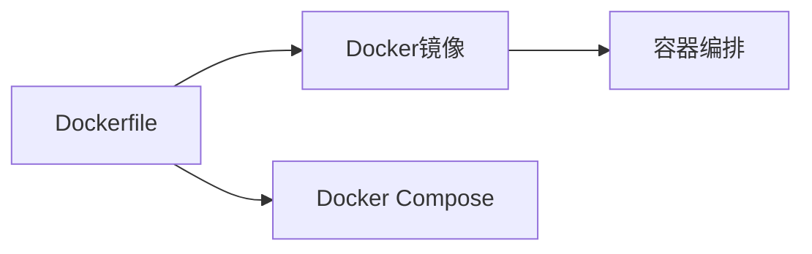

                 

# Docker容器化部署实战

容器化是现代软件开发和部署的重要趋势，它能够提供更高效、更可移植的解决方案，同时降低环境依赖和运维成本。Docker作为容器化的代表工具，因其强大的隔离性、易用性和跨平台兼容性，成为容器化实践中的首选。本文将从Docker基础概念出发，逐步深入探讨Docker容器化部署的实战技巧，帮助开发者高效构建和部署可靠的软件应用。

## 1. 背景介绍

### 1.1 问题由来

在软件开发和运维过程中，环境依赖和配置管理一直是棘手的问题。传统的方式是将应用程序及其依赖项打包为可移植的包，但这依然存在版本冲突、兼容性等问题。容器化通过创建独立、轻量级的环境，有效解决了这些问题。Docker作为容器化的代表工具，提供了简单、易用的容器编排和管理解决方案。

### 1.2 问题核心关键点

容器化部署的核心关键点包括以下几个方面：

- **环境隔离**：每个容器都是一个独立运行的空间，不受宿主机影响，确保了应用程序的稳定性和一致性。
- **轻量级**：容器启动速度快，资源占用少，能够快速创建和销毁。
- **跨平台兼容性**：容器和其依赖项在多个平台上运行时，表现一致，减少了跨环境部署的风险。
- **易用性**：通过Dockerfile和Docker Compose等工具，容器化部署变得简单直观。

这些关键点使得容器化部署成为现代软件开发的标准实践。

### 1.3 问题研究意义

容器化部署的广泛应用，对软件工程和运维带来了深远的影响：

- **提高部署效率**：通过容器化，应用程序和其依赖项的打包和部署变得简单快捷，大幅提升了开发和部署效率。
- **降低环境复杂度**：容器化隔离了环境，减少了环境配置和管理的复杂度，降低了运维成本。
- **提升应用稳定性**：容器的隔离特性和可移植性，使得应用在不同的环境中表现一致，提高了系统的稳定性和可靠性。
- **推动微服务架构**：容器化天然支持微服务架构，有助于构建松耦合、高可扩展的系统。
- **加速云计算转型**：容器化成为云计算平台的标准部署方式，推动了应用向云平台的快速迁移。

## 2. 核心概念与联系

### 2.1 核心概念概述

为了更好地理解Docker容器化部署，需要掌握以下核心概念：

- **Docker容器**：Docker容器是运行在一个隔离环境中，包含应用程序及其依赖项的可移植单元。
- **Docker镜像**：Docker镜像是一个只读的容器定义，包含了容器的配置、依赖项和应用程序代码。
- **Dockerfile**：Dockerfile是一个文本文件，定义了构建Docker镜像的步骤和指令。
- **Docker Compose**：Docker Compose是一个工具，用于定义和运行多个Docker容器的编排和依赖关系。
- **容器编排**：容器编排是指通过工具自动化管理容器的创建、启动、扩展和销毁过程。

这些概念构成了Docker容器化部署的基础框架。

### 2.2 核心概念原理和架构的 Mermaid 流程图



该图展示了Docker容器化部署的核心流程：通过Dockerfile构建Docker镜像，再使用Docker Compose定义和管理多个容器的编排关系，最终实现容器的自动化部署和管理。

## 3. 核心算法原理 & 具体操作步骤

### 3.1 算法原理概述

Docker容器化部署的核心算法原理包括以下几个方面：

- **容器定义和构建**：通过Dockerfile定义容器的配置和构建步骤，最终生成Docker镜像。
- **容器编排和部署**：使用Docker Compose定义容器间的依赖关系，实现容器编排和管理。
- **容器运行时管理**：使用Docker引擎管理容器的生命周期，包括创建、启动、扩展和销毁。

### 3.2 算法步骤详解

#### 3.2.1 容器定义和构建

构建Docker镜像的第一步是通过Dockerfile定义容器配置。Dockerfile是一个文本文件，包含了构建容器的指令和步骤。例如，以下是一个简单的Dockerfile，用于构建一个运行Nginx服务器的Docker镜像：

```Dockerfile
# 使用官方Nginx镜像作为基础镜像
FROM nginx:latest

# 在容器中安装Node.js
RUN apt-get update && apt-get install -y nodejs

# 将Nginx的默认端口映射到宿主机
EXPOSE 80

# 在Nginx的根目录下添加Node.js应用程序
COPY nginx.conf /etc/nginx/nginx.conf
COPY index.html /usr/share/nginx/html/index.html

# 设置Node.js应用程序为默认网页
CMD ["nginx", "-g", "daemon off;"]
```

然后，执行以下命令构建Docker镜像：

```bash
docker build -t nginx-web .
```

#### 3.2.2 容器编排和部署

构建好Docker镜像后，就可以使用Docker Compose进行容器编排和部署。Docker Compose通过定义和运行多个容器的编排关系，实现容器的自动化管理。例如，以下是一个简单的Docker Compose文件，用于定义和运行多个容器：

```yaml
version: '3.7'
services:
  nginx:
    image: nginx-web
    ports:
      - "80:80"
  database:
    image: mysql:latest
    environment:
      MYSQL_ROOT_PASSWORD: mypassword
volumes:
  mysql-data:
    driver: local
    source: ./database
    target: /data/mysql
```

执行以下命令启动Docker Compose文件：

```bash
docker-compose up
```

Docker Compose将自动创建和启动Nginx和MySQL容器，并设置容器间的依赖关系。

### 3.3 算法优缺点

#### 3.3.1 优点

- **跨平台兼容性**：Docker容器可以在不同的操作系统和硬件平台上运行，确保了应用的跨平台兼容性。
- **环境隔离**：每个容器都是独立运行的环境，确保了应用程序的稳定性和一致性。
- **轻量级**：容器启动速度快，资源占用少，能够快速创建和销毁。
- **易用性**：通过Dockerfile和Docker Compose，容器化部署变得简单直观。

#### 3.3.2 缺点

- **复杂性**：对于大规模的微服务架构，容器编排和管理变得复杂，需要更多的运维工作。
- **学习成本**：Docker和容器化技术的入门门槛较高，需要一定的学习成本。
- **性能开销**：容器虽然轻量级，但在某些情况下，可能存在一定的性能开销。

### 3.4 算法应用领域

Docker容器化部署已经在多个领域得到了广泛应用，包括但不限于：

- **Web应用部署**：通过Docker容器化部署Web应用，可以快速创建和扩展Web服务器和数据库。
- **微服务架构**：Docker天然支持微服务架构，能够轻松管理多个微服务的容器编排和通信。
- **云原生应用**：Docker和Kubernetes等容器编排工具是云原生应用的重要组成部分，推动了云原生应用的快速发展和部署。
- **开发和测试环境**：Docker可以用于创建轻量级的开发和测试环境，减少了环境配置和管理的复杂度。
- **自动化运维**：Docker和容器编排工具可以自动化管理容器的创建、扩展和销毁，提高了运维效率。

## 4. 数学模型和公式 & 详细讲解 & 举例说明

### 4.1 数学模型构建

在Docker容器化部署中，数学模型主要用于容器的编排和调度。Docker Swarm是一个开源的容器编排和调度工具，使用数学模型来优化容器资源的分配和管理。Docker Swarm使用Docker引擎，通过定义集群、节点和服务，实现容器的自动化管理。

### 4.2 公式推导过程

Docker Swarm的调度算法基于拉普拉斯分布（Laplace Distribution），用于计算节点的可用性和负载均衡。具体公式如下：

$$
P(n) = \frac{1}{2}e^{-n/\mu}
$$

其中，$P(n)$ 是节点$n$的概率，$\mu$ 是拉普拉斯分布的参数，表示节点响应时间。

Docker Swarm通过计算每个节点的$P(n)$，选择最可能的节点进行容器调度。该算法能够有效优化容器资源的分配，确保容器的均衡负载和可用性。

### 4.3 案例分析与讲解

以下是一个简单的案例，展示如何使用Docker Swarm进行容器的自动化调度：

假设有一个包含两个节点的Docker Swarm集群，节点A和节点B的响应时间分别为10毫秒和15毫秒。容器服务$S_1$和$S_2$分别调度到节点A和节点B。

根据拉普拉斯分布的公式，节点A的$P(n)$为：

$$
P(A) = \frac{1}{2}e^{-10/15} = \frac{1}{2}e^{-0.667}
$$

节点B的$P(n)$为：

$$
P(B) = \frac{1}{2}e^{-15/15} = \frac{1}{2}e^{-1}
$$

因为节点A的$P(n)$较大，所以容器服务$S_1$被调度到节点A，容器服务$S_2$被调度到节点B。

## 5. 项目实践：代码实例和详细解释说明

### 5.1 开发环境搭建

在进行Docker容器化部署实践前，需要准备好开发环境。以下是使用Docker构建开发环境的流程：

1. **安装Docker**：从官网下载并安装Docker引擎和Docker Compose。
2. **准备开发文件**：将应用程序代码和依赖项放到一个文件夹中，例如`app/`。
3. **编写Dockerfile**：在`app/`目录下创建Dockerfile文件，定义容器的构建步骤。
4. **构建Docker镜像**：执行以下命令构建Docker镜像：

```bash
docker build -t app .
```

5. **编写Docker Compose文件**：在项目根目录下创建`docker-compose.yml`文件，定义容器的编排和依赖关系。
6. **启动容器**：执行以下命令启动容器：

```bash
docker-compose up
```

### 5.2 源代码详细实现

以下是一个简单的Dockerfile和Docker Compose文件，用于构建和运行一个简单的Web应用程序：

**Dockerfile**：

```Dockerfile
# 使用官方Node.js镜像作为基础镜像
FROM node:latest

# 安装Node.js和npm
RUN apt-get update && apt-get install -y nodejs npm

# 将应用程序代码复制到容器中
COPY . /app

# 安装应用程序依赖项
WORKDIR /app
RUN npm install

# 设置应用程序为默认网页
CMD ["npm", "start"]
```

**Docker Compose文件**：

```yaml
version: '3.7'
services:
  app:
    build: .
    ports:
      - "3000:3000"
    environment:
      NODE_ENV: development
    volumes:
      - .:/app
```

### 5.3 代码解读与分析

让我们再详细解读一下关键代码的实现细节：

**Dockerfile**：
- `FROM node:latest`：指定使用官方的Node.js镜像作为基础镜像。
- `RUN apt-get update && apt-get install -y nodejs npm`：在容器中安装Node.js和npm，确保能够运行JavaScript应用程序。
- `COPY . /app`：将应用程序代码复制到容器的`/app`目录下。
- `WORKDIR /app`：设置容器的默认工作目录为`/app`。
- `RUN npm install`：在容器中安装应用程序依赖项。
- `CMD ["npm", "start"]`：设置容器的启动命令为`npm start`。

**Docker Compose文件**：
- `version: '3.7'`：指定Docker Compose文件的版本。
- `services:`：定义Docker服务。
- `app:`：定义应用程序服务，`build: .`表示从当前目录构建镜像，`ports:`将容器的3000端口映射到宿主机的3000端口，`environment:`设置环境变量，`volumes:`将宿主机的当前目录挂载到容器的`/app`目录下。

### 5.4 运行结果展示

启动Docker Compose后，可以访问宿主机的3000端口，看到Web应用程序运行正常。例如，在浏览器中访问`http://localhost:3000`，可以看到应用程序的欢迎页面。

## 6. 实际应用场景

### 6.1 Web应用部署

Docker容器化部署可以广泛应用于Web应用部署。通过Docker容器，Web应用及其依赖项能够快速打包和部署到多个服务器，确保了应用程序的稳定性和一致性。例如，可以使用Docker容器化部署WordPress网站，确保网站在不同服务器上的表现一致。

### 6.2 微服务架构

Docker容器化部署天然支持微服务架构，能够轻松管理多个微服务的容器编排和通信。例如，可以使用Docker容器化部署一个包含多个微服务的电商系统，确保每个微服务能够在独立的环境中运行，同时方便微服务的扩展和更新。

### 6.3 云原生应用

Docker和容器编排工具是云原生应用的重要组成部分，推动了云原生应用的快速发展和部署。例如，可以使用Docker Swarm和Kubernetes管理云原生应用的容器编排和调度，确保应用的可靠性和可扩展性。

### 6.4 开发和测试环境

Docker容器化部署可以用于创建轻量级的开发和测试环境，减少了环境配置和管理的复杂度。例如，可以使用Docker容器化部署一个包含多个测试容器的开发环境，方便开发者进行单元测试和集成测试。

### 6.5 自动化运维

Docker容器化部署和容器编排工具可以自动化管理容器的创建、扩展和销毁，提高了运维效率。例如，可以使用Docker Swarm和Kubernetes管理容器的自动伸缩和故障恢复，确保应用的持续可用性。

## 7. 工具和资源推荐

### 7.1 学习资源推荐

为了帮助开发者系统掌握Docker容器化部署的理论基础和实践技巧，这里推荐一些优质的学习资源：

1. **《Docker实战》**：一本系统介绍Docker容器化部署的经典书籍，适合初学者入门。
2. **Docker官方文档**：Docker官方文档提供了详细的API和操作指南，是学习Docker的必备资源。
3. **Docker Swarm官方文档**：Docker Swarm官方文档介绍了Docker Swarm的功能和使用方法，是学习和实践Docker Swarm的必备资源。
4. **Docker Compose官方文档**：Docker Compose官方文档提供了详细的Docker Compose使用方法和示例，适合实战练习。
5. **《Kubernetes实战》**：Kubernetes是容器编排的重要工具，本书介绍了Kubernetes的基础知识和实际应用案例。

通过对这些资源的学习实践，相信你一定能够快速掌握Docker容器化部署的精髓，并用于解决实际的开发和运维问题。

### 7.2 开发工具推荐

以下是几款用于Docker容器化部署开发的常用工具：

1. **Docker Engine**：Docker引擎是Docker容器化的核心组件，负责容器的创建、启动、停止和销毁。
2. **Docker Compose**：Docker Compose是Docker容器的编排和管理工具，能够方便地定义和运行多个容器的编排关系。
3. **Docker Swarm**：Docker Swarm是Docker容器编排和调度工具，能够管理和优化多个节点的容器资源分配。
4. **Kubernetes**：Kubernetes是开源的容器编排工具，支持跨集群的管理和调度，广泛应用于云原生应用部署。
5. **Helm**：Helm是Kubernetes的包管理和应用编排工具，能够快速部署和管理复杂的Kubernetes应用。

合理利用这些工具，可以显著提升Docker容器化部署的开发效率，加快创新迭代的步伐。

### 7.3 相关论文推荐

Docker容器化部署的研究不断取得新的进展，以下是几篇奠基性的相关论文，推荐阅读：

1. **《Docker: The Unified Linux Kernel Container》**：Docker的创始人对其技术背景和设计理念进行了详细介绍。
2. **《The Swarm》**：Docker Swarm的设计和实现细节，介绍了Swarm集群和节点管理机制。
3. **《Docker Compose》**：Docker Compose的介绍和使用方法，提供了丰富的实战示例。
4. **《Kubernetes: A Polyglot Platform for Modular Distributed Systems》**：Kubernetes的设计理念和实现机制，介绍了Kubernetes集群和节点管理机制。

这些论文代表了大容器化部署技术的发展脉络，通过学习这些前沿成果，可以帮助研究者把握学科前进方向，激发更多的创新灵感。

## 8. 总结：未来发展趋势与挑战

### 8.1 总结

本文对Docker容器化部署的方法进行了全面系统的介绍。从Docker基础概念出发，逐步深入探讨Docker容器化部署的实战技巧，帮助开发者高效构建和部署可靠的软件应用。通过Dockerfile和Docker Compose等工具，容器化部署变得简单直观。合理利用这些工具，可以显著提升Docker容器化部署的开发效率，加快创新迭代的步伐。

通过本文的系统梳理，可以看到，Docker容器化部署已经成为现代软件开发和运维的标准实践。容器化技术通过隔离和抽象资源，简化了环境配置和运维管理，极大地提高了开发和部署效率。未来，伴随容器化技术的持续演进，必将进一步提升软件系统的稳定性和可扩展性，为软件开发和运维带来更大的便捷。

### 8.2 未来发展趋势

展望未来，Docker容器化部署技术将呈现以下几个发展趋势：

1. **容器编排工具的改进**：容器编排工具如Docker Swarm和Kubernetes将不断改进，提供更丰富的功能和更好的用户体验。
2. **容器镜像的标准化**：容器镜像的标准化和互操作性将不断提升，降低容器部署和管理的复杂度。
3. **微服务架构的普及**：微服务架构将成为容器化部署的主流，推动应用向云原生方向发展。
4. **容器网络的优化**：容器网络技术如CNI（Container Network Interface）将不断改进，提供更高效的网络通信和隔离机制。
5. **容器安全性的提升**：容器安全和隔离机制将不断提升，确保容器的可靠性和安全性。

这些趋势凸显了Docker容器化部署技术的广阔前景，未来将为软件开发和运维带来更多便捷和高效。

### 8.3 面临的挑战

尽管Docker容器化部署技术已经取得了瞩目成就，但在迈向更加智能化、普适化应用的过程中，它仍面临着诸多挑战：

1. **容器编排的复杂性**：对于大规模的微服务架构，容器编排和管理变得复杂，需要更多的运维工作。
2. **学习成本**：Docker和容器化技术的入门门槛较高，需要一定的学习成本。
3. **性能开销**：容器虽然轻量级，但在某些情况下，可能存在一定的性能开销。
4. **容器镜像的管理和分发**：容器镜像的管理和分发变得复杂，需要更多的管理和优化工作。
5. **容器安全性和隔离性**：容器安全性和隔离机制需要不断提升，确保容器的可靠性和安全性。

这些挑战需要开发者和运维人员共同努力，不断优化和改进Docker容器化部署实践，确保应用的稳定性和安全性。

### 8.4 研究展望

面对Docker容器化部署所面临的挑战，未来的研究需要在以下几个方面寻求新的突破：

1. **容器编排的自动化**：开发更自动化、智能化的容器编排工具，降低运维成本，提高部署效率。
2. **容器镜像的压缩和优化**：开发更高效的容器镜像压缩和优化技术，降低镜像大小和分发成本。
3. **容器网络的优化**：研究更高效的容器网络技术，提升容器间的通信和隔离性能。
4. **容器安全性的增强**：研究和应用更强大的容器安全机制，确保容器的可靠性和安全性。
5. **容器化的可移植性**：研究跨平台容器化技术，确保容器在多个操作系统和硬件平台上的兼容性和可移植性。

这些研究方向的探索发展，必将引领Docker容器化部署技术迈向更高的台阶，为软件开发和运维带来更大的便捷。相信随着学界和产业界的共同努力，这些挑战终将一一被克服，Docker容器化部署必将在构建人机协同的智能时代中扮演越来越重要的角色。

## 9. 附录：常见问题与解答

**Q1：Docker容器化部署是否适用于所有应用？**

A: Docker容器化部署适用于大多数应用，但并非所有应用都适合容器化。例如，一些高并发、高IO的应用（如数据库、缓存等），容器化部署的性能可能不如直接部署。此外，一些应用对底层资源有特定的需求，也不适合容器化部署。因此，在应用容器化部署前，需要进行充分的评估和优化。

**Q2：如何进行Docker容器的性能优化？**

A: 容器性能优化可以从多个方面入手：
1. 合理配置资源限制，如CPU、内存、磁盘等，避免资源浪费和争抢。
2. 使用缓存和预加载技术，减少应用启动和运行时的I/O开销。
3. 使用容器网络优化技术，提升容器间的通信性能。
4. 使用容器镜像优化技术，减少镜像大小和分发成本。
5. 使用容器安全机制，确保容器的可靠性和安全性。

**Q3：如何处理容器之间的依赖关系？**

A: 容器之间的依赖关系可以通过Docker Compose和Kubernetes等工具进行管理。具体步骤如下：
1. 在Docker Compose文件中定义容器服务，设置依赖关系。
2. 使用`--link`或`--network`等参数，将容器连接起来，确保容器之间的通信和数据共享。
3. 在Kubernetes中，使用Deployment和Service等对象，定义容器服务和依赖关系。
4. 使用`--kind`和`--name`等参数，将容器连接起来，确保容器之间的通信和数据共享。

**Q4：Docker Swarm和Kubernetes的区别是什么？**

A: Docker Swarm和Kubernetes都是容器编排工具，但它们有以下区别：
1. Docker Swarm是Docker自带的容器编排工具，而Kubernetes是一个独立的开源项目。
2. Docker Swarm适用于较小的集群，而Kubernetes适用于大规模的云原生应用。
3. Docker Swarm的编排功能相对简单，而Kubernetes提供了更丰富的编排和管理功能。
4. Docker Swarm更适合开发者入门，而Kubernetes更适合生产环境中的容器化部署和管理。

通过合理选择容器编排工具，可以更好地满足应用的需求和环境要求。

---

作者：禅与计算机程序设计艺术 / Zen and the Art of Computer Programming

