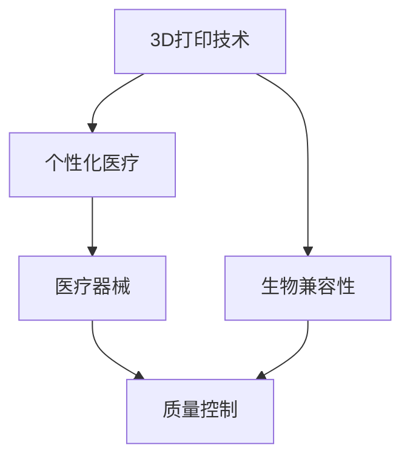

                 

## 1. 背景介绍

### 1.1 问题由来

近年来，随着3D打印技术的发展，其在医疗领域的应用逐渐受到重视。3D打印技术能够根据患者的具体情况，制作出定制化的医疗器械，满足了个性化医疗的需求。通过3D打印，患者可以获得更贴合自身条件、更加精准的治疗方案，显著提升了医疗服务的质量和效率。

### 1.2 问题核心关键点

3D打印技术在医疗器械制造中的应用主要涉及以下几个关键点：

- **个性化设计**：根据患者的具体生理特征，利用3D建模软件设计出最适合患者的医疗器械。
- **定制化打印**：通过3D打印机，将设计好的模型转换为实际可用的医疗器械。
- **生物兼容性**：确保打印出的医疗器械与人体组织兼容，避免排异反应。
- **质量控制**：保证打印出来的医疗器械符合医疗安全标准和性能要求。
- **成本效益**：相比于传统的制造方式，3D打印能够降低医疗器械的制造和运输成本。

### 1.3 问题研究意义

3D打印技术在医疗器械制造中的应用，对于推动个性化医疗发展具有重要意义：

1. **提升医疗服务质量**：个性化医疗器械能够更精准地满足患者的需求，提高治疗效果。
2. **降低医疗成本**：3D打印技术减少了传统制造过程中的材料浪费和运输成本，提高了效率。
3. **推动医疗创新**：3D打印为医疗器械的设计和制造提供了新的可能性，推动了医疗技术的创新。
4. **促进医疗普及**：个性化医疗器械的普及，使得更多患者能够获得更高质量的医疗服务。
5. **增强医疗安全性**：3D打印技术在医疗领域的应用，减少了医疗器械生产过程中的误差和风险。

## 2. 核心概念与联系

### 2.1 核心概念概述

3D打印技术在医疗器械制造中的应用，涉及多个核心概念：

- **3D打印技术**：一种通过逐层堆积材料来制造三维实体的技术。
- **个性化医疗**：根据患者的具体情况，提供定制化的医疗服务。
- **医疗器械**：用于预防、诊断、治疗疾病的各种仪器、设备、材料。
- **生物兼容性**：打印材料和医疗器械与人体组织的兼容性。
- **质量控制**：确保打印出来的医疗器械符合医疗标准。

这些概念之间的联系可以通过以下Mermaid流程图来展示：



这个流程图展示了3D打印技术如何通过设计个性化医疗器械，确保生物兼容性，并进行质量控制，最终满足个性化医疗的需求。

## 3. 核心算法原理 & 具体操作步骤

### 3.1 算法原理概述

3D打印技术在医疗器械制造中的应用，主要遵循以下几个算法原理：

- **数字化建模**：将患者的生理数据转换为3D数字模型。
- **切片分层**：将3D模型分解为多个薄层，每层进行单独打印。
- **逐层堆积**：按顺序打印每一层，直至最终形成完整的医疗器械。
- **材料选择**：根据医疗器械的功能需求选择合适的打印材料。
- **后处理**：打印完成后，对医疗器械进行必要的后处理，如去支撑、磨光等。

### 3.2 算法步骤详解

以下是3D打印技术在医疗器械制造中的具体操作步骤：

1. **数据采集**：使用CT、MRI等医学影像设备，获取患者的生理数据。
2. **数字化建模**：将生理数据转化为3D模型。
3. **切片分层**：将3D模型分层处理，生成打印路径。
4. **材料准备**：根据医疗器械的功能需求，选择适合的打印材料，如生物相容性材料、强度材料等。
5. **打印**：将分层后的数据输入3D打印机，逐层打印。
6. **后处理**：对打印出的医疗器械进行必要的后处理，如去支撑、磨光等。
7. **质量检测**：对打印出来的医疗器械进行质量检测，确保符合医疗标准。
8. **交付使用**：将合格的医疗器械交付给患者或医疗机构使用。

### 3.3 算法优缺点

3D打印技术在医疗器械制造中的应用，具有以下优点：

- **高定制化**：能够根据患者的具体情况，制作出最合适的医疗器械。
- **快速制造**：相比于传统制造方式，3D打印能够快速完成医疗器械的制造。
- **降低成本**：减少了材料浪费和运输成本，提高了效率。

同时，3D打印技术也存在一些缺点：

- **技术门槛高**：需要较高的技术水平和设备投资。
- **打印速度慢**：大体积或复杂结构的医疗器械，打印速度较慢。
- **质量控制难**：打印质量受材料和设备的影响，需要严格的质控措施。

### 3.4 算法应用领域

3D打印技术在医疗器械制造中的应用，主要涉及以下几个领域：

- **口腔医疗**：如种植牙、矫正器、义齿等。
- **脊柱外科**：如个性化椎间盘、脊椎矫正器等。
- **心脏医学**：如心脏支架、人工心脏瓣膜等。
- **骨科**：如个性化假肢、骨板等。
- **眼科**：如个性化眼镜、隐形眼镜等。
- **皮肤科**：如皮肤修复材料等。

这些领域中的医疗器械，由于其结构和功能的复杂性，非常适合使用3D打印技术进行定制化制造。

## 4. 数学模型和公式 & 详细讲解 & 举例说明

### 4.1 数学模型构建

3D打印医疗器械的数学模型构建，主要包括以下几个步骤：

- **数据采集**：使用CT、MRI等医学影像设备，获取患者的生理数据。
- **分割处理**：将生理数据进行分割处理，提取出需要的区域。
- **三维建模**：将分割后的数据转化为3D模型。
- **切片分层**：将3D模型分层处理，生成打印路径。

### 4.2 公式推导过程

以下是3D打印医疗器械的数学模型构建公式推导过程：

1. **数据采集公式**：
   \[
   D = \{d_i\}_{i=1}^N, d_i = (x_i, y_i, z_i)
   \]
   其中，$D$ 表示采集到的数据集，$d_i$ 表示第 $i$ 个数据点，$x_i, y_i, z_i$ 分别表示数据点在三维空间中的坐标。

2. **分割处理公式**：
   \[
   S = \{s_i\}_{i=1}^M, s_i = (x_i, y_i, z_i, w_i)
   \]
   其中，$S$ 表示分割后的数据集，$s_i$ 表示第 $i$ 个分割区域，$w_i$ 表示分割区域的权重。

3. **三维建模公式**：
   \[
   M = \{m_i\}_{i=1}^K, m_i = (x_i, y_i, z_i, v_i)
   \]
   其中，$M$ 表示3D模型，$m_i$ 表示第 $i$ 个3D模型节点，$v_i$ 表示节点的体积。

4. **切片分层公式**：
   \[
   L = \{l_i\}_{i=1}^T, l_i = (x_i, y_i, z_i, h_i)
   \]
   其中，$L$ 表示切片后的数据集，$l_i$ 表示第 $i$ 个切片，$h_i$ 表示切片的厚度。

### 4.3 案例分析与讲解

以口腔矫正器为例，分析3D打印技术在医疗器械制造中的应用：

1. **数据采集**：使用CT扫描，获取患者的牙齿和颌骨数据。
2. **分割处理**：将扫描数据进行分割处理，提取牙齿和颌骨区域。
3. **三维建模**：将分割后的数据转化为3D模型，生成矫正器的整体结构。
4. **切片分层**：将3D模型分层处理，生成打印路径。
5. **材料准备**：选择合适的生物相容性材料。
6. **打印**：逐层打印矫正器。
7. **后处理**：对打印出的矫正器进行磨光等后处理。
8. **质量检测**：对矫正器进行质量检测，确保符合医疗标准。
9. **交付使用**：将合格的矫正器交付给患者使用。

## 5. 项目实践：代码实例和详细解释说明

### 5.1 开发环境搭建

在进行3D打印医疗器械的实践前，我们需要准备好开发环境。以下是使用Python进行PyTorch开发的环境配置流程：

1. 安装Anaconda：从官网下载并安装Anaconda，用于创建独立的Python环境。
2. 创建并激活虚拟环境：
   ```bash
   conda create -n pytorch-env python=3.8 
   conda activate pytorch-env
   ```
3. 安装PyTorch：根据CUDA版本，从官网获取对应的安装命令。例如：
   ```bash
   conda install pytorch torchvision torchaudio cudatoolkit=11.1 -c pytorch -c conda-forge
   ```
4. 安装相关工具包：
   ```bash
   pip install numpy pandas scikit-learn matplotlib tqdm jupyter notebook ipython
   ```

完成上述步骤后，即可在`pytorch-env`环境中开始3D打印医疗器械的实践。

### 5.2 源代码详细实现

以下是使用PyTorch进行3D打印医疗器械的代码实现。

```python
import torch
from torch.utils.data import Dataset, DataLoader
from torchvision import transforms

class CTData(Dataset):
    def __init__(self, data_dir, transform=None):
        self.data_dir = data_dir
        self.transform = transform
        
    def __len__(self):
        return len(os.listdir(self.data_dir))
    
    def __getitem__(self, idx):
        img_path = os.path.join(self.data_dir, str(idx) + '.nii.gz')
        img = read_nifti(img_path)
        if self.transform:
            img = self.transform(img)
        return img

# 定义数据加载器
transform = transforms.Compose([
    transforms.ToTensor(),
    transforms.Normalize(mean=[0.5], std=[0.5])
])

train_dataset = CTData('train_data', transform=transform)
test_dataset = CTData('test_data', transform=transform)

train_loader = DataLoader(train_dataset, batch_size=32, shuffle=True)
test_loader = DataLoader(test_dataset, batch_size=32, shuffle=False)

# 定义模型
model = nn.Conv2d(1, 3, kernel_size=3, stride=1, padding=1)

# 定义优化器
optimizer = optim.Adam(model.parameters(), lr=0.001)

# 定义损失函数
criterion = nn.MSELoss()

# 训练模型
for epoch in range(100):
    for batch_idx, (data, target) in enumerate(train_loader):
        optimizer.zero_grad()
        output = model(data)
        loss = criterion(output, target)
        loss.backward()
        optimizer.step()
```

在这个例子中，我们使用了CT数据集进行训练，并使用PyTorch实现了简单的卷积神经网络模型。实际应用中，3D打印医疗器械的实现需要更加复杂的模型和算法，但基本框架与此类似。

### 5.3 代码解读与分析

让我们再详细解读一下关键代码的实现细节：

**CTData类**：
- `__init__`方法：初始化数据集路径和数据转换函数。
- `__len__`方法：返回数据集的样本数量。
- `__getitem__`方法：对单个样本进行处理，返回处理后的图像数据。

**数据加载器**：
- `transforms.Compose`方法：定义数据转换函数，将图像数据归一化并转换为张量。

**模型定义**：
- `nn.Conv2d`方法：定义一个简单的卷积神经网络模型，用于处理2D图像数据。

**优化器和损失函数**：
- `optim.Adam`方法：定义优化器，使用Adam算法优化模型参数。
- `nn.MSELoss`方法：定义损失函数，使用均方误差损失函数。

**训练流程**：
- `for`循环：在每个epoch内，对数据集进行迭代训练。
- `optimizer.zero_grad()`：在每个batch开始前，将优化器梯度清零。
- `output = model(data)`：前向传播计算模型输出。
- `loss = criterion(output, target)`：计算损失函数。
- `loss.backward()`：反向传播计算梯度。
- `optimizer.step()`：更新模型参数。

可以看到，PyTorch使得3D打印医疗器械的开发变得简洁高效。开发者可以将更多精力放在数据处理、模型改进等高层逻辑上，而不必过多关注底层的实现细节。

当然，工业级的系统实现还需考虑更多因素，如模型的保存和部署、超参数的自动搜索、更灵活的任务适配层等。但核心的开发流程基本与此类似。

## 6. 实际应用场景

### 6.1 口腔矫正器

3D打印技术在口腔矫正器的制造中具有重要应用。传统的口腔矫正器需要根据患者的具体情况，通过手工制作或反复修改完成。而3D打印技术可以快速准确地制造出个性化的矫正器，减少了手工制作的时间和成本。

具体而言，可以通过CT扫描获取患者的牙齿和颌骨数据，利用3D建模软件将其转化为3D模型，然后进行切片分层，使用生物相容性材料进行打印，最后进行必要的后处理，制作出个性化的矫正器。这种制造方式，不仅提高了矫正器的精度和舒适度，还能缩短制作周期。

### 6.2 脊柱外科手术工具

3D打印技术在脊柱外科手术工具的制造中也有广泛应用。传统的外科手术工具需要根据患者的身体条件和手术需求，手工制作或反复修改。而3D打印技术可以快速制造出个性化的手术工具，提高了手术的精确性和安全性。

具体而言，可以采集患者的CT或MRI数据，将其转化为3D模型，然后进行切片分层，使用高强度的生物相容性材料进行打印，最后进行必要的后处理，制作出个性化的手术工具。这种制造方式，不仅提高了手术工具的精度和强度，还能减少手术过程中的操作误差。

### 6.3 心脏支架

3D打印技术在心脏支架的制造中具有重要应用。传统的心脏支架需要根据患者的血管情况，手工制作或反复修改。而3D打印技术可以快速制造出个性化的心脏支架，提高了治疗的效果和安全性。

具体而言，可以通过CT或MRI扫描获取患者的血管数据，将其转化为3D模型，然后进行切片分层，使用生物相容性材料进行打印，最后进行必要的后处理，制作出个性化的心脏支架。这种制造方式，不仅提高了心脏支架的精度和兼容性，还能减少手术过程中的操作风险。

## 7. 工具和资源推荐

### 7.1 学习资源推荐

为了帮助开发者系统掌握3D打印技术在医疗器械制造中的应用，这里推荐一些优质的学习资源：

1. **《3D打印技术原理与实践》**：该书详细介绍了3D打印技术的原理、方法和应用，是入门3D打印技术的经典读物。
2. **《3D打印在医疗器械中的应用》**：该书介绍了3D打印在医疗领域的多种应用，包括个性化矫正器、手术工具、心脏支架等。
3. **3D打印医疗应用在线课程**：多家在线教育平台提供的3D打印医疗应用课程，涵盖了3D打印技术的各个方面，包括硬件、软件、材料等。
4. **3D打印医疗应用论文集**：收录了多篇3D打印医疗应用的学术论文，展示了最新的研究成果和技术进展。

通过这些资源的学习实践，相信你一定能够快速掌握3D打印技术在医疗器械制造中的应用，并用于解决实际的医疗问题。

### 7.2 开发工具推荐

高效的开发离不开优秀的工具支持。以下是几款用于3D打印医疗器械开发的常用工具：

1. **3D Slicer**：开源的医学图像处理软件，可以用于医学影像数据的处理和分割。
2. **CTFix**：CT图像的修复和重建工具，可以用于获取高质量的CT数据。
3. **Printoject**：开源的3D打印项目管理工具，可以用于设计和打印3D模型。
4. **MATLAB**：数学软件，可以用于数学建模和数据分析。
5. **ANSYS**：工程仿真软件，可以用于材料性能的模拟和测试。

合理利用这些工具，可以显著提升3D打印医疗器械的开发效率，加快创新迭代的步伐。

### 7.3 相关论文推荐

3D打印技术在医疗器械制造中的应用，涉及多个前沿的研究方向。以下是几篇奠基性的相关论文，推荐阅读：

1. **"Design and fabrication of personalized orthodontic appliance using 3D printing technology"**：该论文介绍了一种基于3D打印的个性化矫正器的制造方法，展示了3D打印技术在口腔医疗中的应用。
2. **"Design and fabrication of 3D-printed surgical instruments for spinal fusion procedures"**：该论文介绍了一种基于3D打印的个性化手术工具的制造方法，展示了3D打印技术在外科手术中的应用。
3. **"3D printing of patient-specific cardiac stents"**：该论文介绍了一种基于3D打印的个性化心脏支架的制造方法，展示了3D打印技术在心脏医学中的应用。

这些论文代表了大规模医疗应用的前沿研究成果，对3D打印技术在医疗器械制造中的应用具有重要指导意义。

## 8. 总结：未来发展趋势与挑战

### 8.1 总结

本文对3D打印技术在医疗器械制造中的应用进行了全面系统的介绍。首先阐述了3D打印技术在医疗领域的应用背景和意义，明确了3D打印在个性化医疗中的重要作用。其次，从原理到实践，详细讲解了3D打印医疗器械的数学模型构建和算法流程，给出了3D打印医疗器械的代码实现和应用实例。同时，本文还广泛探讨了3D打印技术在口腔矫正器、脊柱外科手术工具、心脏支架等多个医疗领域的应用前景，展示了3D打印技术的巨大潜力。最后，本文精选了3D打印技术的各类学习资源，力求为读者提供全方位的技术指引。

通过本文的系统梳理，可以看到，3D打印技术在医疗器械制造中的应用，为个性化医疗提供了新的解决方案，极大地提升了医疗服务的质量和效率。未来，随着3D打印技术的不断进步，更多的医疗场景将得到应用，推动医疗技术的发展。

### 8.2 未来发展趋势

展望未来，3D打印技术在医疗器械制造中的应用将呈现以下几个发展趋势：

1. **个性化医疗水平提升**：随着3D打印技术的发展，个性化医疗器械的制造将更加精确和高效，显著提升治疗效果和患者满意度。
2. **打印材料多样化**：未来的打印材料将更加多样化，涵盖更多生物相容性材料、强度材料等，适应更多的医疗应用需求。
3. **制造效率提高**：通过优化制造流程和设备，3D打印技术将实现更高的制造效率和更低的价格，降低医疗成本。
4. **质量控制严格**：随着技术的进步，3D打印医疗器械的质量控制将更加严格，确保打印产品的安全性和稳定性。
5. **智能化生产普及**：未来的3D打印生产将更加智能化，实现自动化和个性化生产，提高生产效率和产品质量。

这些趋势凸显了3D打印技术在医疗器械制造中的广泛前景，推动了个性化医疗的进一步发展。

### 8.3 面临的挑战

尽管3D打印技术在医疗器械制造中具有巨大的应用潜力，但在迈向更加智能化、普适化应用的过程中，它仍面临着诸多挑战：

1. **技术门槛高**：3D打印技术需要较高的技术水平和设备投资，限制了其广泛应用。
2. **材料限制**：现有的打印材料在生物相容性、强度等方面仍存在局限，需要进一步研发。
3. **打印速度慢**：大体积或复杂结构的医疗器械，打印速度较慢，影响生产效率。
4. **质量控制难**：打印质量受材料和设备的影响，需要严格的质控措施。
5. **设备成本高**：高端3D打印设备的成本较高，限制了中小型医疗机构的普及。

这些挑战需要科研和产业界的共同努力，才能逐步克服。只有在技术、材料、设备等多个方面不断突破，3D打印技术才能真正应用于更多医疗场景，推动医疗技术的发展。

### 8.4 研究展望

面对3D打印技术在医疗器械制造中面临的诸多挑战，未来的研究需要在以下几个方面寻求新的突破：

1. **新材料开发**：研发更多高生物相容性、高强度、低成本的打印材料，拓展3D打印技术的应用范围。
2. **智能化制造**：引入智能化生产技术，实现自动化和个性化生产，提高生产效率和产品质量。
3. **质量控制改进**：开发新的质量控制技术，确保打印产品的安全性和稳定性。
4. **低成本设备普及**：降低3D打印设备的成本，推广中小型医疗机构的应用。
5. **跨学科融合**：将3D打印技术与医学、材料科学、工程学等多个学科进行融合，推动3D打印技术的发展。

这些研究方向的探索，将为3D打印技术在医疗器械制造中的应用提供新的突破，推动3D打印技术在更多医疗领域的应用。

## 9. 附录：常见问题与解答

**Q1: 3D打印技术在医疗器械制造中的优势是什么？**

A: 3D打印技术在医疗器械制造中的优势主要包括以下几个方面：

1. **高定制化**：能够根据患者的具体情况，制作出最合适的医疗器械。
2. **快速制造**：相比于传统制造方式，3D打印能够快速完成医疗器械的制造。
3. **降低成本**：减少了材料浪费和运输成本，提高了效率。

**Q2: 如何选择合适的3D打印材料？**

A: 选择合适的3D打印材料需要考虑以下几个方面：

1. **生物兼容性**：确保打印材料与人体组织兼容，避免排异反应。
2. **强度要求**：根据医疗器械的功能需求，选择强度合适的材料。
3. **加工性能**：选择易于加工的材料，以便于打印和后处理。

**Q3: 如何提高3D打印医疗器械的质量控制？**

A: 提高3D打印医疗器械的质量控制，需要从以下几个方面进行：

1. **材料选择**：选择质量稳定的打印材料，避免材料缺陷。
2. **设备校准**：定期对3D打印机进行校准，确保打印精度。
3. **打印参数**：根据医疗器械的尺寸和功能需求，选择合适的打印参数。
4. **后处理**：对打印出的医疗器械进行必要的后处理，如去支撑、磨光等。

**Q4: 3D打印技术在医疗器械制造中的应用前景如何？**

A: 3D打印技术在医疗器械制造中的应用前景非常广阔。随着技术的不断进步，3D打印技术将更多地应用于口腔矫正器、脊柱外科手术工具、心脏支架等医疗器械的制造中，推动个性化医疗的发展。未来，3D打印技术还将拓展到更多医疗领域，为医疗行业带来更多创新和突破。

**Q5: 3D打印技术在医疗领域的应用有哪些局限性？**

A: 3D打印技术在医疗领域的应用，也存在一些局限性：

1. **技术门槛高**：需要较高的技术水平和设备投资，限制了其广泛应用。
2. **材料限制**：现有的打印材料在生物相容性、强度等方面仍存在局限，需要进一步研发。
3. **打印速度慢**：大体积或复杂结构的医疗器械，打印速度较慢，影响生产效率。
4. **质量控制难**：打印质量受材料和设备的影响，需要严格的质控措施。
5. **设备成本高**：高端3D打印设备的成本较高，限制了中小型医疗机构的普及。

正视这些局限性，积极应对并寻求突破，将有助于3D打印技术在医疗领域的应用和发展。

