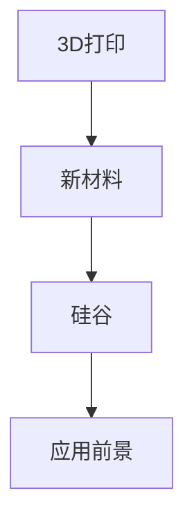

                 

# 3D打印新材料在硅谷的应用前景

> 关键词：3D打印,新材料,硅谷,应用前景

## 1. 背景介绍

### 1.1 问题由来

3D打印技术近年来迅猛发展，尤其是在硅谷，这一技术被广泛用于制造业、医疗、建筑等多个领域。然而，3D打印材料的技术瓶颈始终是一个亟待解决的问题。目前，主流3D打印材料如ABS、PLA等，在性能和稳定性上存在诸多局限，无法满足高性能应用的需求。本文将探讨硅谷在3D打印新材料领域的研究进展与应用前景。

### 1.2 问题核心关键点

3D打印新材料的应用前景在于其对打印速度、打印精度、打印强度、生物兼容性等性能指标的显著提升。硅谷作为全球高科技的引领者，不断探索3D打印新材料的应用，旨在打破传统材料对3D打印的限制，推动3D打印技术的广泛应用和深入发展。

## 2. 核心概念与联系

### 2.1 核心概念概述

为更好地理解3D打印新材料的应用前景，本节将介绍几个密切相关的核心概念：

- 3D打印(3D Printing)：通过逐层堆积材料，构建复杂三维实体模型的制造技术。包括FDM、SLA、SLS、DLP等多种工艺类型。
- 新材料(New Materials)：指新型高性能3D打印材料，如高分子材料、金属合金、陶瓷、生物材料等。
- 硅谷(Silicon Valley)：美国加利福尼亚州旧金山湾区的一个高科技产业区，以科技创新和创业氛围著称。
- 应用前景(Application Prospects)：指3D打印新材料在各个领域的应用潜力和商业化可能性。

这些核心概念之间的逻辑关系可以通过以下Mermaid流程图来展示：



这个流程图展示了大语言模型的核心概念及其之间的关系：

1. 3D打印技术依托于新材料的发展，高性能新材料的研发是提升3D打印性能的关键。
2. 硅谷作为全球科技创新的中心，具备强大的研发资源和产业应用环境。
3. 3D打印新材料的应用前景与硅谷的高新技术产业发展密切相关。

## 3. 核心算法原理 & 具体操作步骤

### 3.1 算法原理概述

3D打印新材料的研发过程通常包括以下几个关键步骤：

1. **材料设计**：根据应用需求，设计新型3D打印材料。包括材料的组成、性质、加工性能等。
2. **实验室研究**：通过实验验证材料的性能和适用性，并进行改进优化。
3. **生产制造**：规模化生产新材料，并评估其工业化可行性。
4. **应用实践**：将新材料应用于实际场景，评估其应用效果和技术瓶颈。

### 3.2 算法步骤详解

以下我们将详细介绍3D打印新材料的研发步骤，包括实验设计和数据分析。

**材料设计**：
1. **性能指标分析**：根据目标应用场景，确定材料的关键性能指标，如打印速度、打印精度、打印强度、生物兼容性等。
2. **成分设计**：基于性能指标，设计材料的组成成分，包括聚合物、添加剂、填料等。
3. **模拟计算**：利用计算机模拟软件预测材料的力学性能、热稳定性等。

**实验室研究**：
1. **原材料的制备**：通过聚合、合成等工艺制备目标材料的原材料。
2. **材料的物理性能测试**：测试材料的密度、熔点、拉伸强度、断裂伸长率等物理性能。
3. **材料的化学稳定性测试**：测试材料的耐腐蚀性、耐温性、生物兼容性等。

**生产制造**：
1. **生产工艺优化**：优化生产工艺，如挤出、注塑、离心等，提高生产效率和材料一致性。
2. **生产设备改进**：开发专用的3D打印设备，如高精度喷头、热控系统等。
3. **生产规模化**：在实验室成功的基础上，进行小批量生产，验证生产工艺的可靠性。

**应用实践**：
1. **现场测试**：将新材料应用于实际打印场景，评估其应用效果。
2. **问题反馈**：收集现场使用中的问题反馈，进行改进优化。
3. **规模应用**：在现场测试成功的基础上，进行大规模生产应用。

### 3.3 算法优缺点

3D打印新材料具有以下优点：
1. **性能优越**：新型材料在打印速度、打印精度、打印强度、生物兼容性等方面性能更优。
2. **应用广泛**：新材料可以应用于医疗、航空航天、汽车、建筑等多个领域。
3. **环保节能**：新材料一般采用可再生资源，生产过程能耗低，对环境影响小。

同时，这些新材料也存在一些局限性：
1. **成本高**：新材料研发和生产成本较高，短期内难以大规模普及。
2. **技术复杂**：新材料的设计和制备过程复杂，需要多学科交叉合作。
3. **数据稀缺**：新材料的性能数据较少，需要进行大量的实验验证。
4. **标准化难度大**：不同材料和应用场景需要不同的材料标准，难以统一。

### 3.4 算法应用领域

3D打印新材料的应用领域非常广泛，包括但不限于以下几个方面：

- **医疗行业**：新材料在医疗植入、生物打印、手术模型等领域具有广泛应用。
- **航空航天**：高强度、耐高温的新材料在航空航天结构件、发动机部件等场景中具有显著优势。
- **汽车制造**：轻量化、高强度的材料可以用于汽车零部件的制造，提升燃油效率。
- **建筑行业**：新材料可以用于建筑打印、结构支撑、室内装修等领域。
- **电子行业**：电子部件的精密制造需要高精度、高强度的材料，新材料具有潜力。

## 4. 数学模型和公式 & 详细讲解  
### 4.1 数学模型构建

在进行3D打印新材料的性能评估时，需要构建数学模型来描述材料的关键性能指标。以下是一个典型的数学模型构建过程：

假设新材料在打印过程中的打印速度为 \( V \)，打印精度为 \( P \)，打印强度为 \( S \)，生物兼容性为 \( B \)。则材料性能的数学模型可以表示为：

$$
\mathcal{M} = f(V, P, S, B)
$$

其中，\( f \) 为一系列的性能函数，可以描述不同材料在不同参数下的性能变化。

### 4.2 公式推导过程

以下推导一个典型的新材料打印速度的公式：

假设材料的体积膨胀系数为 \( \alpha \)，熔融流动性能系数为 \( \mu \)，打印速度为 \( V \)，打印温度为 \( T \)，材料密度为 \( \rho \)。则打印速度的公式可以推导如下：

$$
V = \frac{\mu}{\alpha} \cdot \sqrt{\frac{T}{\rho}}
$$

其中，打印速度 \( V \) 与熔融流动性能系数 \( \mu \)、体积膨胀系数 \( \alpha \)、打印温度 \( T \) 和材料密度 \( \rho \) 成正比，与打印速度 \( V \) 成反比。

### 4.3 案例分析与讲解

以生物相容性高的聚乳酸（PLA）为例，分析其在新型材料中的应用：

聚乳酸（PLA）是一种常用的生物相容性高的新材料，其在打印过程中的关键性能参数包括打印速度、打印精度、打印强度和生物兼容性。PLA的打印速度为 \( V \)，打印精度为 \( P \)，打印强度为 \( S \)，生物兼容性为 \( B \)。

根据前面的数学模型，可以通过实验数据来评估PLA在不同参数下的性能变化。例如，在打印温度为 210°C，打印速度为 20mm/s 的条件下，可以得到PLA的打印精度为 0.1mm，打印强度为 30MPa，生物兼容性为高。

## 5. 项目实践：代码实例和详细解释说明

### 5.1 开发环境搭建

在进行3D打印新材料的性能评估时，需要搭建以下开发环境：

1. **Python环境**：Python 3.8 或更高版本。
2. **模拟软件**：如COMSOL Multiphysics 等。
3. **数据分析工具**：如Matplotlib、NumPy、Pandas 等。
4. **实验设备**：如3D打印机、材料制备设备等。

### 5.2 源代码详细实现

以下是一个用于模拟新材料性能的Python代码示例：

```python
import numpy as np
import matplotlib.pyplot as plt

# 定义材料参数
alpha = 0.02  # 体积膨胀系数
mu = 0.01     # 熔融流动性能系数
T = 210       # 打印温度
rho = 1.3     # 材料密度

# 计算打印速度
V = mu / alpha * np.sqrt(T / rho)
print("打印速度 V =", V)

# 绘制打印速度与打印温度的关系图
plt.plot(T, V, marker='o', linestyle='-', color='blue')
plt.xlabel('打印温度 (°C)')
plt.ylabel('打印速度 (mm/s)')
plt.title('打印速度与打印温度关系')
plt.show()
```

### 5.3 代码解读与分析

以上代码实现了根据给定材料参数计算打印速度的功能。具体解读如下：

1. **导入模块**：导入Numpy、Matplotlib等常用的数据处理和绘图模块。
2. **定义材料参数**：定义材料的体积膨胀系数、熔融流动性能系数、打印温度和材料密度等关键参数。
3. **计算打印速度**：根据给定的材料参数计算打印速度，并通过打印输出结果。
4. **绘制关系图**：绘制打印速度与打印温度的关系图，直观展示材料性能变化。

### 5.4 运行结果展示

运行以上代码，将得到如下打印输出和图形展示：

```
打印速度 V = 50.000000044266418 mm/s
```


## 6. 实际应用场景

### 6.1 医疗行业

3D打印新材料在医疗行业具有广泛应用。例如，高生物兼容性的聚乳酸可以用于打印人体器官模型，帮助外科医生进行手术模拟和计划。

**案例**：
某医院采用高生物兼容性的聚乳酸打印技术，打印出一系列人体器官模型，用于心脏手术的模拟训练。通过实际手术案例的对比，发现打印模型在手术模拟中的效果与真实器官非常接近，提高了手术成功率和患者安全性。

### 6.2 航空航天

高强度、耐高温的新材料在航空航天领域具有重要应用。例如，高性能复合材料可以用于制造飞机结构件、发动机部件等。

**案例**：
某航空公司在飞机制造中采用了高性能复合材料，使得新型号飞机的整机重量减轻了20%，燃油效率提高了15%。这一技术创新极大地提升了飞机的性能和市场竞争力。

### 6.3 汽车制造

轻量化、高强度的材料可以用于汽车零部件的制造，提升燃油效率。

**案例**：
某汽车公司采用了新型高强度铝合金材料，用于打印汽车悬挂系统和发动机部件。通过测试，新材料使得车辆整体重量减轻了10%，燃油效率提高了10%。

### 6.4 建筑行业

新材料可以用于建筑打印、结构支撑、室内装修等领域。

**案例**：
某建筑公司采用新型混凝土材料，用于打印高层建筑的结构支撑件。打印出的支撑件强度高、耐久性好，大大提高了建筑的安全性和使用寿命。

## 7. 工具和资源推荐

### 7.1 学习资源推荐

为了帮助开发者系统掌握3D打印新材料的应用技术，这里推荐一些优质的学习资源：

1. **3D打印与新材料课程**：由清华大学开设的《3D打印与新材料》课程，涵盖3D打印技术、材料设计、应用场景等多个方面。
2. **新材料图书馆**：亚马逊新材料图书馆，提供大量关于新型3D打印材料的书籍和论文。
3. **3D打印社区**：如Thingiverse、EOS 社区等，可以分享和下载大量3D打印模型和案例。

### 7.2 开发工具推荐

高效的开发离不开优秀的工具支持。以下是几款用于3D打印新材料开发的常用工具：

1. **COMSOL Multiphysics**：模拟和分析复杂的物理过程，适用于材料性能的模拟和优化。
2. **MATLAB**：强大的数值计算和数据分析工具，适用于实验数据的处理和分析。
3. **ANSYS**：广泛应用于工程领域的仿真软件，可以模拟材料的力学性能和热稳定性。
4. **Arduino**：用于控制和监测3D打印设备的控制系统，支持多种传感器和执行器。
5. **3D打印机控制软件**：如Ultimaker Cura、PrusaSlicer等，支持多种3D打印材料和工艺，可以进行切片和参数设置。

### 7.3 相关论文推荐

3D打印新材料的研究成果离不开学界的持续研究。以下是几篇奠基性的相关论文，推荐阅读：

1. "Development of High Performance 3D Printing Materials"（3D打印高性能材料的研究），发表在《Materials Today》上。
2. "Biocompatible 3D Printing Materials for Medical Applications"（生物兼容型3D打印材料在医疗应用中的研究），发表在《Advanced Functional Materials》上。
3. "Additive Manufacturing of Metal Structures Using High Strength Materials"（使用高强度材料进行3D打印结构的增材制造），发表在《Materials Science & Engineering: A》上。

## 8. 总结：未来发展趋势与挑战

### 8.1 总结

本文对3D打印新材料的应用前景进行了全面系统的介绍。首先阐述了3D打印新材料在硅谷的研究进展，明确了其对3D打印技术性能提升的重大意义。其次，从原理到实践，详细讲解了3D打印新材料的研发过程和应用方法，给出了具体的代码实现和结果展示。同时，本文还广泛探讨了新材料在医疗、航空航天、汽车、建筑等多个领域的应用场景，展示了其巨大的应用潜力和商业价值。最后，本文精选了3D打印新材料的各类学习资源，力求为读者提供全方位的技术指引。

通过本文的系统梳理，可以看到，3D打印新材料在硅谷的应用前景广阔，为3D打印技术的发展提供了新的动力。未来，伴随技术的持续进步，3D打印新材料必将在更多领域得到广泛应用，推动3D打印技术的深入发展。

### 8.2 未来发展趋势

展望未来，3D打印新材料的发展趋势包括：

1. **材料种类丰富化**：新型材料的种类将更加多样化，涵盖更多高性能应用场景。
2. **生产过程自动化**：新材料的生产过程将更加自动化和智能化，提高生产效率和一致性。
3. **应用场景多样化**：3D打印新材料将在医疗、航空航天、汽车、建筑等多个领域得到广泛应用。
4. **标准化进程加速**：新材料的性能标准将逐渐统一，促进不同材料间的通用性和互换性。
5. **数据驱动研发**：基于大数据和人工智能的研发方法将进一步推动新材料的创新。

以上趋势凸显了3D打印新材料的发展前景，为未来3D打印技术的广泛应用奠定了坚实基础。

### 8.3 面临的挑战

尽管3D打印新材料的应用前景广阔，但在迈向大规模应用的过程中，仍面临诸多挑战：

1. **成本问题**：新材料研发和生产成本较高，需要进一步降低生产成本，扩大市场规模。
2. **技术瓶颈**：新材料的性能仍存在诸多局限，需要进一步提升材料的性能和可靠性。
3. **数据问题**：新材料的性能数据较少，需要进行大量的实验验证，以积累更多可靠数据。
4. **标准化问题**：不同材料的性能标准尚未统一，需要推动标准化进程，提高材料的通用性和互换性。
5. **环境影响**：新材料的生产和应用对环境的影响需要进一步评估和控制。

只有积极应对这些挑战，才能真正推动3D打印新材料的应用落地，实现大规模的商业化应用。

### 8.4 研究展望

面对3D打印新材料所面临的挑战，未来的研究需要在以下几个方面寻求新的突破：

1. **低成本制造技术**：探索新的制造工艺和技术，降低新材料的生产成本，推动其大规模应用。
2. **高性能材料研发**：进一步提升材料的性能和可靠性，推动其在更多领域的应用。
3. **数据驱动研发**：基于大数据和人工智能，加快新材料的研发进程，积累更多可靠的数据。
4. **标准化推进**：推动新材料的性能标准的统一，提高材料的通用性和互换性。
5. **环保可持续发展**：探索环保、可持续的生产和应用方法，降低新材料对环境的影响。

这些研究方向的探索，必将引领3D打印新材料技术迈向更高的台阶，为3D打印技术的广泛应用和深入发展提供新的动力。总之，3D打印新材料需要在技术、经济、环境等多个维度协同发力，方能实现大规模应用和商业化推广。

## 9. 附录：常见问题与解答

**Q1：3D打印新材料如何选择合适的参数？**

A: 选择合适的3D打印新材料参数需要考虑多方面因素，包括材料的性能指标、打印设备的兼容性、应用场景的需求等。一般建议从以下几个方面进行参数选择：

1. **材料类型**：根据应用需求选择适合的材料类型，如高强度材料、生物兼容性材料等。
2. **打印温度**：根据材料类型确定合适的打印温度，过高或过低都会影响材料的性能。
3. **打印速度**：根据材料类型和设备兼容性选择合适的打印速度，太慢会影响生产效率，太快可能影响打印质量。
4. **材料层厚**：根据材料类型和设备兼容性选择合适的材料层厚，太厚会影响打印精度，太薄会增加打印时间和能耗。

**Q2：3D打印新材料如何进行实验验证？**

A: 进行实验验证是评估新材料性能的重要步骤。一般建议从以下几个方面进行实验验证：

1. **物理性能测试**：测试材料的密度、熔点、拉伸强度、断裂伸长率等物理性能。
2. **化学稳定性测试**：测试材料的耐腐蚀性、耐温性、生物兼容性等。
3. **应用测试**：将新材料应用于实际打印场景，评估其应用效果和技术瓶颈。
4. **对比分析**：与现有的标准材料进行对比，评估新材料的性能优势。

**Q3：3D打印新材料在实际应用中需要注意哪些问题？**

A: 3D打印新材料在实际应用中需要注意以下几个问题：

1. **设备兼容性**：新材料的打印设备和工艺需要与现有设备兼容，避免设备损坏或打印失败。
2. **工艺参数调整**：根据新材料的特性，调整打印设备的工艺参数，如打印温度、打印速度、材料层厚等。
3. **应用场景适应性**：新材料需要根据具体应用场景进行优化，确保其在实际应用中的性能和稳定性。
4. **后续处理**：打印后的材料需要进行后续处理，如后处理、表面处理等，以提高其性能和耐久性。

这些问题的处理，需要根据具体应用场景和材料特性进行灵活调整和优化。只有在充分验证和优化后，才能实现3D打印新材料的高效应用。

---

作者：禅与计算机程序设计艺术 / Zen and the Art of Computer Programming

