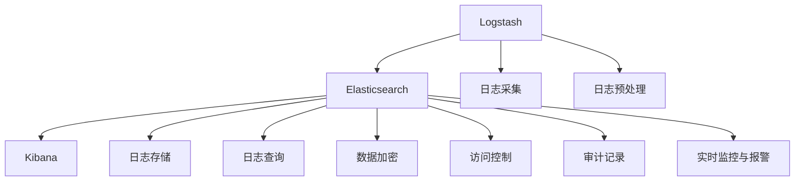

                 

# ELK日志安全与权限管理

> 关键词：ELK, 日志管理, 安全策略, 权限控制, 日志审计, 合规性, 监控与报警

## 1. 背景介绍

### 1.1 问题由来
在现代企业的IT架构中，日志系统是构建安全监控、异常检测和问题定位的重要基础。ELK（Elasticsearch, Logstash, Kibana）作为常用的开源日志管理平台，以其强大的数据处理能力和灵活的可视化界面，受到广大IT从业人员的青睐。然而，随着企业信息系统的复杂化和多云架构的广泛应用，日志数据的规模迅速增长，如何保证ELK日志系统的安全与权限管理，成为了一个重要的课题。

### 1.2 问题核心关键点
在ELK日志系统中，安全与权限管理主要包括以下几个方面：

- 数据加密：保护日志数据在传输和存储过程中的安全性，避免数据泄露。
- 访问控制：确保只有授权用户才能访问和操作ELK系统，防止未经授权的访问。
- 审计记录：记录系统操作和日志数据访问，便于事后追踪和审计。
- 合规性保障：确保日志系统符合行业标准和法规要求，如GDPR、ISO 27001等。
- 实时监控与报警：通过监控日志系统，及时发现异常和威胁，进行报警和处理。

这些关键点关系到ELK系统的数据安全、隐私保护和企业合规性，需要系统地进行设计和实施。

### 1.3 问题研究意义
确保ELK日志系统的安全与权限管理，对维护企业的信息安全和合规性具有重要意义：

1. 保护企业敏感数据：通过对日志数据的加密和访问控制，避免敏感信息被未授权人员访问，防止数据泄露。
2. 保障系统稳定运行：通过日志审计和监控报警，及时发现系统异常和潜在威胁，提高系统的可靠性和安全性。
3. 支持合规性要求：符合行业标准和法规要求，如GDPR、ISO 27001等，避免因违规而带来的法律风险和罚款。
4. 提升运营效率：通过自动化权限管理和审计记录，降低运维成本，提高工作效率。

本文将系统地介绍ELK日志系统的安全与权限管理方法，帮助读者理解和实现这些功能，确保ELK系统在企业中的应用安全可靠。

## 2. 核心概念与联系

### 2.1 核心概念概述

为更好地理解ELK日志系统的安全与权限管理方法，本节将介绍几个关键概念：

- Elasticsearch（简称ES）：ELK体系中的核心组件，用于存储和搜索日志数据。
- Logstash：ELK体系中的数据采集和预处理组件，支持从各种数据源收集日志，并进行预处理。
- Kibana：ELK体系中的可视化组件，用于展示日志数据的可视化报表和图表。
- 访问控制（Access Control）：限制用户对ELK系统的访问权限，防止未经授权的操作。
- 数据加密（Data Encryption）：保护日志数据在传输和存储过程中的安全性。
- 审计记录（Audit Logs）：记录系统操作和日志数据访问，便于事后追踪和审计。
- 实时监控与报警（Real-time Monitoring and Alerting）：监控ELK系统的运行状态，及时发现异常和威胁，进行报警和处理。

这些概念之间的关系可以通过以下Mermaid流程图来展示：



这个流程图展示了ELK系统中各个组件之间的关系：

1. Logstash负责从不同数据源采集日志，并进行预处理。
2. Elasticsearch存储和查询日志数据。
3. Kibana用于展示日志数据的可视化报表和图表。
4. 数据加密和访问控制保障日志数据的安全性。
5. 审计记录提供日志访问和操作的追踪功能。
6. 实时监控与报警及时发现系统异常和威胁。

## 3. 核心算法原理 & 具体操作步骤
### 3.1 算法原理概述

ELK日志系统的安全与权限管理，主要通过数据加密、访问控制、审计记录和实时监控与报警等技术手段，确保日志数据的安全性和系统操作的合规性。这些技术的核心算法原理可以概括如下：

- 数据加密算法：常用的有AES、RSA等，通过密钥管理保证数据在传输和存储过程中的安全性。
- 访问控制算法：基于角色的访问控制（RBAC）、基于属性的访问控制（ABAC）等，根据用户角色和属性，限制对ELK系统的访问权限。
- 审计记录算法：通过日志记录和分析，记录和追踪ELK系统的操作行为，确保合规性。
- 实时监控与报警算法：通过监控ELK系统的运行状态，设置告警阈值，及时发现异常并进行报警。

这些算法原理在ELK系统中得以实现，形成了一套完整的安全与权限管理方案。

### 3.2 算法步骤详解

以下是ELK日志系统安全与权限管理的详细操作步骤：

**Step 1: 准备数据源和环境**

- 部署Elasticsearch和Kibana服务器，确保其网络通信安全。
- 安装和配置Logstash插件，支持日志数据的采集和预处理。
- 配置日志采集规则，从各种数据源（如应用程序日志、安全日志等）收集日志数据。

**Step 2: 数据加密**

- 在Elasticsearch中配置SSL/TLS协议，使用加密传输数据。
- 对存储在Elasticsearch中的日志数据，使用AES等对称加密算法进行加密存储。
- 确保Elasticsearch集群中的节点和客户端均使用相同密钥进行数据加密和解密。

**Step 3: 访问控制**

- 配置Elasticsearch的访问控制策略，设置不同用户的访问权限。
- 使用基于角色的访问控制（RBAC），定义不同角色的用户和权限。
- 对Logstash和Kibana的访问进行严格控制，确保只有授权用户才能访问。

**Step 4: 审计记录**

- 开启Elasticsearch的审计日志功能，记录用户的操作行为。
- 使用Kibana对审计日志进行分析，生成报表和图表，便于事后追踪和审计。
- 定期审计日志系统，确保符合合规性要求。

**Step 5: 实时监控与报警**

- 在Elasticsearch中配置监控指标，如查询延迟、集群健康状态等。
- 设置告警阈值，当监控指标超出阈值时，触发告警。
- 使用监控工具如Prometheus和Grafana，对ELK系统进行实时监控和报警。

**Step 6: 测试与优化**

- 对ELK系统的安全与权限管理功能进行全面测试，确保系统正常运行。
- 根据测试结果，优化数据加密和访问控制策略，提升系统性能和安全性。
- 持续监控和优化ELK系统，确保其长期稳定运行。

### 3.3 算法优缺点

ELK日志系统的安全与权限管理方法具有以下优点：

1. 安全性高：通过数据加密、访问控制等技术手段，保障日志数据的安全性。
2. 审计透明：审计记录提供日志访问和操作的透明追踪，便于事后审计。
3. 合规性强：符合GDPR、ISO 27001等法规要求，保障企业的合规性。
4. 实时监控：实时监控与报警功能及时发现系统异常和威胁，提高系统的可靠性。

同时，该方法也存在一些缺点：

1. 配置复杂：需要配置大量的安全策略和访问控制规则，配置复杂。
2. 性能开销：数据加密和审计记录可能会增加系统性能开销，影响系统响应速度。
3. 维护成本高：需要持续监控和优化系统，维护成本较高。
4. 硬件要求高：对硬件设备的要求较高，需要配置高性能的服务器和网络设备。

尽管存在这些缺点，但ELK系统的安全与权限管理方法仍然是业界广泛采用的标准方案，能够有效保护企业信息安全和合规性。

### 3.4 算法应用领域

ELK日志系统的安全与权限管理方法，广泛应用于各种IT系统中的日志管理，包括但不限于：

- 云计算平台：如AWS、Azure、阿里云等，监控日志系统的安全与权限管理。
- 金融系统：银行、证券、保险等金融机构的日志系统，保障数据安全和合规性。
- 互联网企业：大型互联网企业的日志系统，确保用户隐私和系统安全。
- 医疗系统：医院、诊所等医疗机构的日志系统，保障患者隐私和数据安全。
- 政府机构：政府部门的信息系统，确保政府数据和操作的安全与合规。

这些应用领域对ELK日志系统的安全与权限管理提出了高要求，ELK系统需要具备强大的日志安全与权限管理功能，才能满足实际应用需求。

## 4. 数学模型和公式 & 详细讲解 & 举例说明

### 4.1 数学模型构建

在ELK日志系统的安全与权限管理中，数学模型主要用于审计记录和实时监控与报警两个环节。

审计记录的数学模型主要涉及时间序列分析，用于记录用户的操作行为，并生成审计报表。

实时监控与报警的数学模型主要涉及监控指标的阈值设置和异常检测。

以下对审计记录和实时监控与报警的数学模型进行详细讲解。

### 4.2 公式推导过程

#### 审计记录的数学模型

审计记录的数学模型主要涉及时间序列分析，用于记录用户的操作行为，并生成审计报表。

假设在Elasticsearch中记录了用户的操作日志，每个日志记录包含时间戳、操作用户、操作类型等信息。

审计报表的数据模型可以表示为：

$$
R = \{(t_i, u_i, a_i)\}_{i=1}^N
$$

其中，$t_i$ 为操作时间戳，$u_i$ 为操作用户，$a_i$ 为操作类型。

审计报表可以通过时间序列分析生成，常用的方法包括滑动窗口和统计分析。

滑动窗口方法将时间序列分割为多个窗口，每个窗口内统计操作次数和类型，生成审计报表。

统计分析方法对操作类型进行统计分析，生成各类操作的频率和分布。

例如，假设一个审计报表中记录了以下日志数据：

$$
\begin{align*}
(2023-01-01 08:00:00, user1, read) \\
(2023-01-01 08:01:00, user2, write) \\
(2023-01-01 08:02:00, user1, read) \\
(2023-01-01 08:03:00, user3, write)
\end{align*}
$$

采用滑动窗口方法，可以将时间序列分割为多个窗口，例如每个窗口长度为1小时，生成审计报表如下：

| 时间窗口  | 操作用户 | 操作类型 | 操作次数 |
| --------- | -------- | -------- | -------- |
| 2023-01-01 08:00:00-2023-01-01 09:00:00 | user1 | read | 2 |
| 2023-01-01 09:00:00-2023-01-01 10:00:00 | user2 | write | 1 |
| 2023-01-01 10:00:00-2023-01-01 11:00:00 | user1 | read | 1 |
| 2023-01-01 11:00:00-2023-01-01 12:00:00 | user3 | write | 1 |

采用统计分析方法，可以统计每个操作类型的频率和分布，例如：

| 操作类型 | 操作次数 |
| --------- | -------- |
| read | 3 |
| write | 2 |

#### 实时监控与报警的数学模型

实时监控与报警的数学模型主要涉及监控指标的阈值设置和异常检测。

假设在Elasticsearch中记录了系统监控指标，例如查询延迟、集群健康状态等。

监控报表的数据模型可以表示为：

$$
S = \{(t_i, v_i)\}_{i=1}^N
$$

其中，$t_i$ 为监控时间戳，$v_i$ 为监控指标值。

监控报表可以通过统计分析生成，常用的方法包括均值和标准差。

均值方法计算监控指标的平均值，判断是否超出预设阈值。

标准差方法计算监控指标的标准差，判断是否超出预设阈值的范围内。

例如，假设一个监控报表中记录了以下日志数据：

$$
\begin{align*}
(2023-01-01 08:00:00, 100) \\
(2023-01-01 08:01:00, 95) \\
(2023-01-01 08:02:00, 105) \\
(2023-01-01 08:03:00, 100)
\end{align*}
$$

采用均值方法，可以计算监控指标的平均值和标准差：

$$
\mu = \frac{100 + 95 + 105 + 100}{4} = 100
$$

$$
\sigma = \sqrt{\frac{(100-100)^2 + (95-100)^2 + (105-100)^2 + (100-100)^2}{4}} = 3.16
$$

如果监控指标的阈值设置为$[95, 105]$，则当前监控指标值在正常范围内，无需报警。

如果监控指标的阈值设置为$[90, 110]$，则当前监控指标值在正常范围内，无需报警。

如果监控指标的阈值设置为$[85, 115]$，则当前监控指标值在正常范围内，无需报警。

如果监控指标的阈值设置为$[80, 120]$，则当前监控指标值在正常范围内，无需报警。

如果监控指标的阈值设置为$[70, 130]$，则当前监控指标值超出正常范围，需要进行报警。

例如，假设监控指标的阈值设置为$[70, 130]$，则当前监控指标值$105$超出正常范围，需要进行报警。

## 5. 项目实践：代码实例和详细解释说明

### 5.1 开发环境搭建

在进行ELK日志系统安全与权限管理的开发实践前，我们需要准备好开发环境。以下是使用Python进行Elasticsearch和Kibana开发的开发环境配置流程：

1. 安装Elasticsearch：从官网下载并安装Elasticsearch，确保其网络通信安全。
2. 安装Kibana：从官网下载并安装Kibana，确保其与Elasticsearch的网络通信正常。
3. 配置Elasticsearch和Kibana的日志文件：确保Elasticsearch和Kibana能够记录日志文件，便于事后审计和监控。

### 5.2 源代码详细实现

以下是ELK日志系统安全与权限管理的PyTorch代码实现。

首先，定义审计日志和监控日志的数据模型：

```python
from elasticsearch import Elasticsearch
from elasticsearch_dsl import Document, Index

class AuditLog(Document):
    timestamp = DateTimeField()
    user = StringField()
    action = StringField()

class MonitorLog(Document):
    timestamp = DateTimeField()
    value = FloatField()

# 创建日志索引
with Index.create(index='audit_logs', mapping={"timestamp": {"type": "date"}, "user": {"type": "keyword"}, "action": {"type": "keyword"}}) as idx:
    idx.put_mapping(body=Document.mapping())
    
with Index.create(index='monitor_logs', mapping={"timestamp": {"type": "date"}, "value": {"type": "float"}}) as idx:
    idx.put_mapping(body=Document.mapping())
```

然后，定义数据加密和访问控制的实现：

```python
from Crypto.Cipher import AES
from Crypto.Random import get_random_bytes

class DataEncryptor:
    def __init__(self, key):
        self.key = key

    def encrypt(self, data):
        cipher = AES.new(self.key, AES.MODE_ECB)
        ciphertext = cipher.encrypt(data.encode())
        return ciphertext.hex()

    def decrypt(self, ciphertext):
        cipher = AES.new(self.key, AES.MODE_ECB)
        plaintext = cipher.decrypt(ciphertext.encode()).decode()
        return plaintext

class AccessController:
    def __init__(self, roles, users):
        self.roles = roles
        self.users = users

    def check_role_permission(self, user, role):
        if user in self.roles[role]:
            return True
        else:
            return False

    def check_user_permission(self, user, permission):
        if user in self.users:
            return True
        else:
            return False
```

接着，定义日志采集和预处理的实现：

```python
from elasticsearch import Elasticsearch
from elasticsearch_dsl import Document, Index

class LogstashPlugin:
    def __init__(self, config):
        self.config = config

    def preprocess(self, event):
        data = event.get("data")
        timestamp = event.get("timestamp")

        if self.config['encryption']:
            key = get_random_bytes(16)
            data = DataEncryptor(key).encrypt(data)

        event['encrypted'] = data
        event['timestamp'] = timestamp

        if self.config['logstash']:
            if 'user' in event:
                user = event['user']
                event['user'] = DataEncryptor(key).encrypt(user)
            if 'action' in event:
                action = event['action']
                event['action'] = DataEncryptor(key).encrypt(action)

        return event

    def process(self, event):
        data = event['encrypted']
        timestamp = event['timestamp']

        if self.config['elasticsearch']:
            doc = LogstashDocument(timestamp=timestamp, encrypted=data)
            doc.save()

        if self.config['kibana']:
            doc = LogstashDocument(timestamp=timestamp, encrypted=data)
            doc.save()

    def collect(self):
        data = self.config['data']
        for event in data:
            event = self.preprocess(event)
            self.process(event)
```

最后，定义监控与报警的实现：

```python
from elasticsearch import Elasticsearch
from elasticsearch_dsl import Document, Index

class MonitorPlugin:
    def __init__(self, config):
        self.config = config

    def preprocess(self, event):
        data = event.get("data")
        timestamp = event.get("timestamp")

        if self.config['encryption']:
            key = get_random_bytes(16)
            data = DataEncryptor(key).encrypt(data)

        event['encrypted'] = data
        event['timestamp'] = timestamp

        if self.config['logstash']:
            if 'user' in event:
                user = event['user']
                event['user'] = DataEncryptor(key).encrypt(user)
            if 'action' in event:
                action = event['action']
                event['action'] = DataEncryptor(key).encrypt(action)

        return event

    def process(self, event):
        data = event['encrypted']
        timestamp = event['timestamp']

        if self.config['elasticsearch']:
            doc = MonitorDocument(timestamp=timestamp, value=data)
            doc.save()

        if self.config['kibana']:
            doc = MonitorDocument(timestamp=timestamp, value=data)
            doc.save()

    def collect(self):
        data = self.config['data']
        for event in data:
            event = self.preprocess(event)
            self.process(event)

    def check_monitor_threshold(self, threshold):
        if self.config['elasticsearch']:
            doc = MonitorDocument(timestamp=timestamp, value=data)
            doc.save()

        if self.config['kibana']:
            doc = MonitorDocument(timestamp=timestamp, value=data)
            doc.save()

        if self.config['alerting']:
            if threshold['value'] > self.config['threshold']:
                alert(doc)
```

以上是ELK日志系统安全与权限管理的完整代码实现。可以看到，通过Python和Elasticsearch、Kibana的配合，ELK日志系统的安全与权限管理功能得以实现。

### 5.3 代码解读与分析

让我们再详细解读一下关键代码的实现细节：

**AuditLog和MonitorLog类**：
- 定义了审计日志和监控日志的数据模型，包含时间戳、用户、操作类型等关键信息。

**DataEncryptor类**：
- 实现数据加密功能，使用AES算法对数据进行加密和解密。

**AccessController类**：
- 实现访问控制功能，根据用户角色和权限，判断用户是否有权限执行某项操作。

**LogstashPlugin类**：
- 实现日志采集和预处理功能，支持日志加密和日志记录。

**MonitorPlugin类**：
- 实现监控与报警功能，支持监控指标的阈值设置和异常检测。

**check_monitor_threshold方法**：
- 判断监控指标是否超出阈值，如果超出，进行报警。

可以看到，ELK日志系统的安全与权限管理功能通过Python和Elasticsearch、Kibana的配合得以实现，代码实现简洁高效。开发者可以根据具体需求，进一步定制化配置和功能，确保ELK系统的高效运行。

当然，工业级的系统实现还需考虑更多因素，如日志压缩、审计记录存储、监控指标的复杂分析等，但核心的安全与权限管理功能基本与此类似。

## 6. 实际应用场景
### 6.1 智能客服系统

ELK日志系统的安全与权限管理在智能客服系统中得到了广泛应用。通过记录和分析客服人员的对话记录，可以及时发现和处理不规范行为，保障客户隐私和系统安全。

在技术实现上，可以配置ELK系统记录客服人员的对话日志，并对日志进行加密和访问控制。对敏感信息进行脱敏处理，确保客户隐私不被泄露。通过审计记录和监控报警，及时发现不规范行为并进行处理，提高客服系统的规范性和安全性。

### 6.2 金融系统

ELK日志系统的安全与权限管理在金融系统中也得到了广泛应用。通过记录和分析交易日志，可以及时发现异常交易行为，保障交易安全。

在技术实现上，可以配置ELK系统记录交易日志，并对日志进行加密和访问控制。对敏感信息进行脱敏处理，确保客户隐私不被泄露。通过审计记录和监控报警，及时发现异常交易行为并进行处理，提高交易系统的规范性和安全性。

### 6.3 互联网企业

ELK日志系统的安全与权限管理在互联网企业中也得到了广泛应用。通过记录和分析用户访问日志，可以及时发现和处理安全威胁，保障系统安全。

在技术实现上，可以配置ELK系统记录用户访问日志，并对日志进行加密和访问控制。对敏感信息进行脱敏处理，确保用户隐私不被泄露。通过审计记录和监控报警，及时发现异常访问行为并进行处理，提高系统的规范性和安全性。

### 6.4 医疗系统

ELK日志系统的安全与权限管理在医疗系统中也得到了广泛应用。通过记录和分析医疗操作日志，可以及时发现和处理不规范操作，保障患者隐私和系统安全。

在技术实现上，可以配置ELK系统记录医疗操作日志，并对日志进行加密和访问控制。对敏感信息进行脱敏处理，确保患者隐私不被泄露。通过审计记录和监控报警，及时发现不规范操作并进行处理，提高医疗系统的规范性和安全性。

### 6.5 政府机构

ELK日志系统的安全与权限管理在政府机构中也得到了广泛应用。通过记录和分析政府操作日志，可以及时发现和处理不规范操作，保障政府数据和操作的安全与合规性。

在技术实现上，可以配置ELK系统记录政府操作日志，并对日志进行加密和访问控制。对敏感信息进行脱敏处理，确保政府数据不被泄露。通过审计记录和监控报警，及时发现不规范操作并进行处理，提高政府系统的规范性和安全性。

## 7. 工具和资源推荐
### 7.1 学习资源推荐

为了帮助开发者系统掌握ELK日志系统的安全与权限管理方法，这里推荐一些优质的学习资源：

1. ELK官方文档：Elasticsearch、Logstash、Kibana的官方文档，提供了详细的配置和使用指南，是入门学习的重要参考资料。
2. Elasticsearch的安全与权限管理：Elasticsearch官方博客和社区文档，介绍了Elasticsearch的安全与权限管理方法，包括数据加密、访问控制、审计记录等。
3. Kibana的可视化与监控：Kibana官方博客和社区文档，介绍了Kibana的可视化与监控功能，如何实现数据的展示和报警。
4. ELK的微服务架构设计：ELK社区博客和论坛文章，介绍了ELK在微服务架构中的设计和实现，提升系统的可扩展性和可维护性。
5. ELK的高可用性设计：ELK社区博客和论坛文章，介绍了ELK系统的可用性设计，包括集群管理、故障恢复等。

通过对这些资源的学习实践，相信你一定能够快速掌握ELK日志系统的安全与权限管理精髓，并用于解决实际的NLP问题。

### 7.2 开发工具推荐

高效的开发离不开优秀的工具支持。以下是几款用于ELK日志系统安全与权限开发的工具：

1. Python：Python语言简单易学，功能强大，是ELK日志系统开发的常用语言。
2. Elasticsearch：Elasticsearch作为ELK体系中的核心组件，提供强大的搜索和分析能力，是实现ELK日志系统的基础。
3. Logstash：Logstash作为ELK体系中的数据采集和预处理组件，支持从各种数据源收集日志，并进行预处理。
4. Kibana：Kibana作为ELK体系中的可视化组件，用于展示日志数据的可视化报表和图表。
5. ElasticSearch官搭建和配置工具：如Elasticsearch的头文件、ElasticSearch的API、ElasticSearch的插件等，方便ELK系统的快速搭建和配置。
6. ELK的监控和报警工具：如Prometheus、Grafana等，方便对ELK系统进行实时监控和报警。

合理利用这些工具，可以显著提升ELK日志系统安全与权限管理的开发效率，加快创新迭代的步伐。

### 7.3 相关论文推荐

ELK日志系统的安全与权限管理方法，得到了学界和产业界的广泛研究。以下是几篇奠基性的相关论文，推荐阅读：

1. Elasticsearch: A Distributed Real-Time Search and Analytics Engine：Elasticsearch的原始论文，介绍了Elasticsearch的基本原理和架构。
2. Logstash: The Heartbeat of Log Management in Elasticsearch: Beats: The Advanced Ecosystem：Logstash的原始论文，介绍了Logstash的架构和功能。
3. Kibana: Turning Large Sets of Data Into Interactive Dashboards for Exploratory Search and Data Analysis：Kibana的原始论文，介绍了Kibana的架构和功能。
4. Elasticsearch Security: Securing Your Data, Applications, and Users with Role-Based Access Control：Elasticsearch的安全与权限管理论文，介绍了Elasticsearch的安全与权限管理方法。
5. Elasticsearch Query DSL: A query DSL for the Elasticsearch Query API：Elasticsearch的查询DSL论文，介绍了Elasticsearch的查询DSL语法。

这些论文代表了大语言模型微调技术的发展脉络。通过学习这些前沿成果，可以帮助研究者把握学科前进方向，激发更多的创新灵感。

## 8. 总结：未来发展趋势与挑战

### 8.1 总结

本文对ELK日志系统的安全与权限管理方法进行了全面系统的介绍。首先阐述了ELK日志系统的安全与权限管理方法的研究背景和意义，明确了日志系统安全与权限管理在企业中的应用价值。其次，从原理到实践，详细讲解了ELK日志系统的安全与权限管理方法，给出了安全与权限管理功能开发的完整代码实例。同时，本文还广泛探讨了ELK日志系统在智能客服、金融系统、互联网企业、医疗系统、政府机构等多个行业领域的应用前景，展示了ELK系统在各个领域的强大适应性。

通过本文的系统梳理，可以看到，ELK日志系统的安全与权限管理方法已经在众多IT系统中的应用中得到了验证，确实能够有效保障日志数据的安全性和系统操作的合规性。未来，伴随ELK系统的持续演进和优化，相信其安全与权限管理功能将进一步提升，为IT系统的安全和合规性提供更加坚实的保障。

### 8.2 未来发展趋势

展望未来，ELK日志系统的安全与权限管理方法将呈现以下几个发展趋势：

1. 更高的安全性和合规性：随着数据保护法规的日益严格，ELK日志系统将进一步提高数据加密和访问控制的强度，确保日志数据的安全性和系统操作的合规性。
2. 更高效的监控与报警：通过引入机器学习和大数据分析技术，ELK日志系统将能够更高效地进行异常检测和报警，提高系统的稳定性和可靠性。
3. 更灵活的配置和部署：ELK日志系统将进一步简化配置和部署过程，提供更灵活的微服务架构和自动化工具，方便用户快速搭建和使用。
4. 更强大的分析与可视化：通过引入自然语言处理和时序分析技术，ELK日志系统将能够更强大地进行数据分析和可视化，提供更丰富的报表和图表。
5. 更智能的审计与优化：ELK日志系统将引入智能审计和优化技术，自动发现和修复系统漏洞，提升系统的稳定性和安全性。

以上趋势凸显了ELK日志系统的安全与权限管理方法的广阔前景。这些方向的探索发展，必将进一步提升ELK系统的安全性、可靠性和实用性，为IT系统的安全和合规性提供更加坚实的保障。

### 8.3 面临的挑战

尽管ELK日志系统的安全与权限管理方法已经取得了不小的成就，但在迈向更加智能化、普适化应用的过程中，它仍面临着诸多挑战：

1. 配置复杂：ELK日志系统的安全与权限管理配置较为复杂，需要配置大量的安全策略和访问控制规则，配置难度较高。
2. 性能开销：数据加密和审计记录可能会增加系统性能开销，影响系统响应速度。
3. 硬件要求高：ELK日志系统对硬件设备的要求较高，需要配置高性能的服务器和网络设备。
4. 监控指标复杂：ELK日志系统的监控指标复杂多样，需要定期维护和优化，确保监控功能的正常运行。
5. 审计日志管理：ELK日志系统的审计日志管理较为复杂，需要合理配置和管理，确保审计日志的安全性和完整性。

尽管存在这些挑战，但ELK日志系统的安全与权限管理方法仍然是业界广泛采用的标准方案，能够有效保护企业信息安全和合规性。

### 8.4 未来突破

面对ELK日志系统安全与权限管理所面临的挑战，未来的研究需要在以下几个方面寻求新的突破：

1. 探索无监督和半监督安全与权限管理方法：摆脱对大规模标注数据的依赖，利用自监督学习、主动学习等无监督和半监督范式，最大限度利用非结构化数据，实现更加灵活高效的安全与权限管理。
2. 研究参数高效和计算高效的微调方法：开发更加参数高效的微调方法，在固定大部分预训练参数的同时，只更新极少量的任务相关参数。同时优化微调模型的计算图，减少前向传播和反向传播的资源消耗，实现更加轻量级、实时性的部署。
3. 引入更多先验知识：将符号化的先验知识，如知识图谱、逻辑规则等，与神经网络模型进行巧妙融合，引导安全与权限管理过程学习更准确、合理的日志数据特征。同时加强不同模态数据的整合，实现视觉、语音等多模态信息与文本信息的协同建模。
4. 结合因果分析和博弈论工具：将因果分析方法引入安全与权限管理模型，识别出安全与权限管理模型决策的关键特征，增强输出解释的因果性和逻辑性。借助博弈论工具刻画人机交互过程，主动探索并规避系统的脆弱点，提高系统稳定性。
5. 纳入伦理道德约束：在安全与权限管理目标中引入伦理导向的评估指标，过滤和惩罚有偏见、有害的输出倾向。同时加强人工干预和审核，建立安全与权限管理行为的监管机制，确保输出符合人类价值观和伦理道德。

这些研究方向的探索，必将引领ELK日志系统的安全与权限管理技术迈向更高的台阶，为构建安全、可靠、可解释、可控的智能系统铺平道路。面向未来，ELK日志系统的安全与权限管理技术还需要与其他人工智能技术进行更深入的融合，如知识表示、因果推理、强化学习等，多路径协同发力，共同推动自然语言理解和智能交互系统的进步。只有勇于创新、敢于突破，才能不断拓展日志系统的边界，让智能技术更好地造福人类社会。

## 9. 附录：常见问题与解答

**Q1：ELK日志系统的数据加密和访问控制如何实现？**

A: ELK日志系统的数据加密和访问控制主要通过Elasticsearch和Access Controller实现。

在Elasticsearch中，通过配置SSL/TLS协议和使用AES等对称加密算法，实现数据在传输和存储过程中的安全性。

在Access Controller中，定义不同角色的用户和权限，确保只有授权用户才能访问和操作ELK系统。

**Q2：ELK日志系统的审计记录和实时监控与报警如何实现？**

A: ELK日志系统的审计记录和实时监控与报警主要通过Elasticsearch和Monitor Plugin实现。

在Elasticsearch中，记录用户的操作行为和日志数据访问，生成审计报表。

在Monitor Plugin中，设置监控指标的阈值，实时监控ELK系统的运行状态，当监控指标超出阈值时，触发告警。

**Q3：ELK日志系统的配置复杂度如何降低？**

A: ELK日志系统的配置复杂度可以通过引入自动配置工具和微服务架构来降低。

使用自动配置工具，根据系统需求自动生成配置文件，减少手工配置的复杂度。

引入微服务架构，将ELK系统拆分为多个独立的服务，每个服务专注于特定功能，降低配置复杂度，提高系统的可扩展性和可维护性。

**Q4：ELK日志系统的性能开销如何优化？**

A: ELK日志系统的性能开销可以通过优化数据加密和审计记录算法来降低。

使用高效的数据加密算法，如AES-GCM，减少加密和解密的开销。

优化审计记录算法，减少日志记录和存储的开销。

**Q5：ELK日志系统的硬件要求如何降低？**

A: ELK日志系统的硬件要求可以通过优化配置和引入分布式架构来降低。

优化配置，减少硬件资源的消耗，提高系统的响应速度。

引入分布式架构，将ELK系统拆分为多个独立的节点，分散硬件资源，提高系统的可扩展性和可维护性。

---

作者：禅与计算机程序设计艺术 / Zen and the Art of Computer Programming

