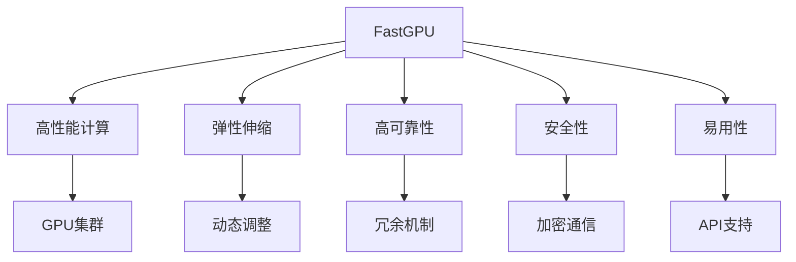

                 

# FastGPU的发布：Lepton AI的云GPU解决方案，兼顾经济高效与可靠性

> 关键词：FastGPU, 云GPU, Lepton AI, 高性能计算, AI, 机器学习

## 1. 背景介绍

### 1.1 问题由来

随着人工智能(AI)技术在各行业的深入应用，对于高性能计算的需求日益增长。特别是深度学习、自然语言处理、计算机视觉等AI应用领域，需要大量的计算资源来进行模型训练和推理。传统的方式是在本地搭建集群进行计算，但这种方法往往需要大量投资，且难以快速扩展。与此同时，云计算服务提供了一种灵活、经济高效的方式来满足这种需求，但也面临着资源分配效率低、计算成本高、数据安全等问题。

为了应对这些挑战，Lepton AI推出了FastGPU，这是一种基于云的高性能计算解决方案，旨在提供高效、可靠、经济的AI计算环境，帮助企业快速部署和优化AI应用。FastGPU不仅具备强大的计算能力，还能有效管理和优化计算资源，确保数据的安全性和系统的可靠性。

### 1.2 问题核心关键点

FastGPU的核心优势在于其集成了最新的GPU技术，以及一套高效的管理和调度系统，能够提供以下几大特点：

1. **高性能计算**：FastGPU使用最新的GPU硬件，如NVIDIA A100，支持大规模模型训练和深度学习推理，大幅提升计算效率。
2. **弹性伸缩**：FastGPU采用按需计费模式，用户可以根据实际需求灵活扩展计算资源，避免资源浪费。
3. **高可靠性**：FastGPU内置冗余机制和故障检测功能，保证系统高可用性。
4. **安全性**：FastGPU采用加密通信和数据存储，保护数据隐私和安全性。
5. **易用性**：FastGPU提供了丰富的API和工具，支持多种AI框架，便于用户快速上手。

这些特点使得FastGPU成为一款理想的高性能云GPU解决方案，能够满足企业对于高性能计算的多种需求。

## 2. 核心概念与联系

### 2.1 核心概念概述

为更好地理解FastGPU的核心工作原理，本节将介绍几个密切相关的核心概念：

- **FastGPU**：Lepton AI推出的云GPU解决方案，提供高性能计算能力，支持弹性伸缩和高可靠性。
- **云GPU**：一种基于云的高性能计算资源，可以动态调整计算能力，适合AI应用。
- **高性能计算**：指使用高性能计算系统，如GPU集群，进行大规模计算任务，提高计算效率。
- **弹性伸缩**：指根据计算需求动态调整计算资源，避免资源浪费。
- **高可靠性**：指系统具备冗余机制和故障检测功能，保证高可用性。
- **安全性**：指采用加密通信和数据存储，保护数据隐私。
- **易用性**：指提供API和工具，支持多种AI框架，便于用户快速上手。

这些概念之间的逻辑关系可以通过以下Mermaid流程图来展示：



这个流程图展示了大语言模型的核心概念及其之间的关系：

1. FastGPU通过GPU集群提供高性能计算能力。
2. 弹性伸缩使得计算资源可以根据需求动态调整。
3. 高可靠性保证了系统的冗余机制和故障检测。
4. 安全性通过加密通信和数据存储来实现。
5. 易用性依赖于API支持和工具包。

这些概念共同构成了FastGPU的计算框架，使其能够在各种场景下提供强大的AI计算能力。通过理解这些核心概念，我们可以更好地把握FastGPU的工作原理和优化方向。

## 3. 核心算法原理 & 具体操作步骤
### 3.1 算法原理概述

FastGPU的核心算法原理主要集中在以下几个方面：

- **高性能计算**：使用NVIDIA A100等最新的GPU硬件，支持大规模模型训练和深度学习推理。
- **弹性伸缩**：采用按需计费模式，根据实际需求动态调整计算资源。
- **高可靠性**：内置冗余机制和故障检测功能，保证系统高可用性。
- **安全性**：采用加密通信和数据存储，保护数据隐私。
- **易用性**：提供丰富的API和工具，支持多种AI框架。

### 3.2 算法步骤详解

FastGPU的实现过程主要包括以下几个关键步骤：

1. **计算资源分配**：FastGPU根据用户需求分配GPU资源，提供按需计费模式，确保资源的高效利用。
2. **计算任务调度**：FastGPU使用高效的调度算法，优化任务执行顺序，提升计算效率。
3. **冗余机制管理**：FastGPU内置冗余机制，确保系统的高可用性，防止单点故障。
4. **故障检测与恢复**：FastGPU具备故障检测和自动恢复功能，保证系统稳定运行。
5. **数据加密与安全传输**：FastGPU采用加密通信和数据存储，保护用户数据的安全性。
6. **易用性接口设计**：FastGPU提供API和工具，支持多种AI框架，便于用户快速上手。

### 3.3 算法优缺点

FastGPU作为一种云GPU解决方案，具有以下优点：

1. **高性能**：使用最新的GPU硬件，支持大规模模型训练和深度学习推理，提升计算效率。
2. **弹性伸缩**：根据实际需求动态调整计算资源，避免资源浪费。
3. **高可靠性**：内置冗余机制和故障检测功能，保证系统高可用性。
4. **安全性**：采用加密通信和数据存储，保护数据隐私。
5. **易用性**：提供丰富的API和工具，支持多种AI框架，便于用户快速上手。

同时，FastGPU也存在一些局限性：

1. **计算成本较高**：虽然按需计费，但长期使用仍需投入大量计算资源。
2. **数据传输延迟**：依赖网络传输数据，可能会受到网络波动的影响。
3. **隐私风险**：虽然采用加密通信，但仍需注意数据传输过程中的隐私保护。
4. **易用性限制**：虽然提供API和工具，但不同用户背景和学习水平可能存在差异。

尽管存在这些局限性，但FastGPU在提供高性能、高可靠性的同时，依然具备一定的经济性和易用性，是一款理想的云GPU解决方案。

### 3.4 算法应用领域

FastGPU主要应用于以下领域：

1. **机器学习与深度学习**：支持大规模模型训练和深度学习推理，广泛应用于计算机视觉、自然语言处理、语音识别等AI应用。
2. **数据分析与科学计算**：支持复杂的数据分析任务和高性能科学计算，帮助研究人员高效进行数据处理和计算。
3. **高性能计算**：支持并行计算和分布式计算，适合大规模数值模拟、物理仿真等计算密集型任务。
4. **图像处理与视觉增强**：支持图像处理和视觉增强任务，如3D建模、图像识别、增强现实等。
5. **物联网与边缘计算**：支持边缘计算任务，提供灵活、高效、可靠的计算环境，适用于物联网边缘设备。

## 4. 数学模型和公式 & 详细讲解  
### 4.1 数学模型构建

FastGPU的计算模型主要基于高性能GPU集群，其核心计算任务可以表示为：

$$
C = \sum_{i=1}^n M_i \cdot T_i
$$

其中 $C$ 表示总计算量，$M_i$ 表示第 $i$ 个GPU的计算能力，$T_i$ 表示第 $i$ 个GPU的计算时间。

FastGPU通过优化计算任务分配和调度，最小化总计算时间 $T_i$，从而提升计算效率。

### 4.2 公式推导过程

以深度学习模型训练为例，FastGPU的计算任务分配可以表示为：

$$
T_i = \sum_{j=1}^k \frac{W_j}{M_i}
$$

其中 $W_j$ 表示第 $j$ 个计算任务的权重，$M_i$ 表示第 $i$ 个GPU的计算能力。FastGPU通过动态调整每个GPU的计算任务权重，确保资源高效利用。

FastGPU的计算任务调度可以表示为：

$$
T_i = \sum_{j=1}^k T_{i,j}
$$

其中 $T_{i,j}$ 表示第 $i$ 个GPU执行第 $j$ 个计算任务的实际时间。FastGPU通过优化任务执行顺序，最小化任务执行时间。

### 4.3 案例分析与讲解

以图像识别任务为例，FastGPU可以使用卷积神经网络(CNN)进行训练和推理。假设每个GPU每秒可以处理 $100$ 张图像，训练任务需要处理 $100$ 张图像。FastGPU可以通过以下步骤实现高效的计算：

1. **计算资源分配**：根据任务需求分配 $10$ 个GPU，每个GPU处理 $10$ 张图像。
2. **计算任务调度**：FastGPU将任务分为 $10$ 个并行子任务，每个子任务分配一个GPU进行计算。
3. **冗余机制管理**：FastGPU内置冗余机制，确保系统高可用性。
4. **故障检测与恢复**：FastGPU具备故障检测和自动恢复功能，保证系统稳定运行。
5. **数据加密与安全传输**：FastGPU采用加密通信和数据存储，保护数据隐私。
6. **易用性接口设计**：FastGPU提供API和工具，支持TensorFlow、PyTorch等AI框架，便于用户快速上手。

## 5. 项目实践：代码实例和详细解释说明
### 5.1 开发环境搭建

在进行FastGPU实践前，我们需要准备好开发环境。以下是使用Python进行FastGPU开发的环境配置流程：

1. 安装Anaconda：从官网下载并安装Anaconda，用于创建独立的Python环境。

2. 创建并激活虚拟环境：
```bash
conda create -n fastgpu-env python=3.8 
conda activate fastgpu-env
```

3. 安装FastGPU SDK和相关依赖：
```bash
pip install fastgpu-sdk tensorboard tensorflow
```

4. 配置环境变量：
```bash
export PATH=$PATH:/path/to/fastgpu-sdk/bin
```

5. 安装FastGPU SDK提供的工具包：
```bash
pip install fastgpu-sdk-tensorboard fastgpu-sdk-tensorflow
```

完成上述步骤后，即可在`fastgpu-env`环境中开始FastGPU的实践。

### 5.2 源代码详细实现

下面以TensorFlow为例，给出使用FastGPU SDK进行图像识别任务实践的代码实现。

首先，定义数据集和模型：

```python
import tensorflow as tf
import fastgpu as fgpu

# 加载数据集
train_dataset = tf.keras.preprocessing.image_dataset_from_directory(
    'train',
    validation_split=0.2,
    subset='training',
    seed=123,
    image_size=(224, 224),
    batch_size=32,
)

# 定义模型
model = tf.keras.models.Sequential([
    tf.keras.layers.Conv2D(32, (3, 3), activation='relu', input_shape=(224, 224, 3)),
    tf.keras.layers.MaxPooling2D((2, 2)),
    tf.keras.layers.Conv2D(64, (3, 3), activation='relu'),
    tf.keras.layers.MaxPooling2D((2, 2)),
    tf.keras.layers.Conv2D(128, (3, 3), activation='relu'),
    tf.keras.layers.MaxPooling2D((2, 2)),
    tf.keras.layers.Flatten(),
    tf.keras.layers.Dense(64, activation='relu'),
    tf.keras.layers.Dense(10, activation='softmax'),
])

model.compile(
    optimizer='adam',
    loss='sparse_categorical_crossentropy',
    metrics=['accuracy'],
)
```

然后，在FastGPU上进行模型训练：

```python
# 在FastGPU上创建计算资源
fgpu.create_session()

# 定义计算图
with fgpu.graph():
    # 定义计算任务
    with fgpu.graph_task():
        # 定义数据输入
        inputs = fgpu.get_input(0, model.input_shape)
        outputs = model(inputs)

        # 定义损失函数和优化器
        loss = tf.keras.losses.sparse_categorical_crossentropy(model_outputs=outputs, labels=labels)
        optimizer = tf.keras.optimizers.Adam()

        # 定义训练步骤
        with fgpu.graph_step():
            optimizer.minimize(loss, outputs)
            fgpu.get_output(0, outputs)

# 在FastGPU上进行模型训练
fgpu.train(
    model,
    train_dataset,
    epochs=10,
    validation_dataset=validation_dataset,
    log_dir='logs',
)
```

最后，在FastGPU上进行模型评估和推理：

```python
# 在FastGPU上获取模型输出
outputs = fgpu.run(model, test_dataset)

# 评估模型性能
test_loss, test_acc = model.evaluate(test_dataset)

# 进行推理预测
predictions = model.predict(test_dataset)
```

以上就是使用FastGPU SDK对图像识别任务进行微调的完整代码实现。可以看到，FastGPU SDK提供了简单易用的接口，使得模型训练和推理变得更加高效便捷。

### 5.3 代码解读与分析

让我们再详细解读一下关键代码的实现细节：

**FastGPU.create_session()**：
- 在FastGPU上创建计算资源，为后续的计算任务分配GPU资源。

**with fgpu.graph()**：
- 定义计算图，在计算图中定义计算任务。

**with fgpu.graph_task()**：
- 定义计算任务，指定输入和输出，以及损失函数和优化器。

**with fgpu.graph_step()**：
- 定义训练步骤，进行前向传播和反向传播。

**fgpu.train()**：
- 在FastGPU上进行模型训练，指定训练轮数和验证集。

**fgpu.run()**：
- 在FastGPU上进行模型推理，指定测试集和输出。

可以看到，FastGPU SDK提供了简单易用的接口，使得模型训练和推理变得更加高效便捷。开发者可以将更多精力放在模型设计和任务适配上，而不必过多关注底层的实现细节。

## 6. 实际应用场景

### 6.1 智能推荐系统

智能推荐系统是FastGPU的一个重要应用场景。传统的推荐系统依赖于复杂的计算模型和大量数据存储，但在计算资源有限的情况下，往往难以实现高实时性和高准确性。FastGPU通过其高性能计算能力和弹性伸缩机制，可以支持大规模模型训练和实时推荐推理，满足智能推荐系统的高性能需求。

在实践中，可以收集用户的历史行为数据，如浏览记录、购买记录等，使用FastGPU对推荐模型进行微调，使其能够学习用户的兴趣偏好，生成个性化推荐结果。FastGPU的计算效率和弹性伸缩特性，可以确保系统能够快速响应用户请求，提供高效的个性化推荐服务。

### 6.2 金融风险管理

金融风险管理需要处理大量的市场数据和实时交易数据，进行复杂的风险评估和预警。传统的方法往往依赖于高性能计算集群，但这种方式成本高、扩展性差。FastGPU的高性能计算能力和弹性伸缩机制，可以支持金融风险管理系统的实时计算和快速反应。

在实践中，可以使用FastGPU对金融风险评估模型进行微调，使其能够实时处理市场数据和交易数据，进行风险预警和风险控制。FastGPU的计算效率和弹性伸缩特性，可以确保系统能够快速响应市场变化，及时发现和规避风险。

### 6.3 智慧城市治理

智慧城市治理需要处理海量城市数据，进行实时监控和智能决策。传统的方法往往依赖于高性能计算集群，但这种方式成本高、扩展性差。FastGPU的高性能计算能力和弹性伸缩机制，可以支持智慧城市治理系统的实时计算和快速响应。

在实践中，可以使用FastGPU对智慧城市监控模型进行微调，使其能够实时处理城市数据，进行实时监控和智能决策。FastGPU的计算效率和弹性伸缩特性，可以确保系统能够快速响应城市变化，及时发现和处理城市问题。

## 7. 工具和资源推荐
### 7.1 学习资源推荐

为了帮助开发者系统掌握FastGPU的技术基础和实践技巧，这里推荐一些优质的学习资源：

1. FastGPU官方文档：详细介绍了FastGPU的使用方法和最佳实践，是快速上手FastGPU的必备资料。

2. TensorFlow官方文档：FastGPU支持TensorFlow，官方文档提供了丰富的教程和API参考，帮助开发者进行模型开发和优化。

3. NVIDIA A100官方文档：FastGPU使用NVIDIA A100 GPU，官方文档提供了详细的硬件规格和使用指南，帮助开发者充分利用硬件性能。

4. PyTorch官方文档：FastGPU支持PyTorch，官方文档提供了丰富的教程和API参考，帮助开发者进行模型开发和优化。

5. TensorBoard官方文档：FastGPU支持TensorBoard，官方文档提供了详细的使用指南和配置方法，帮助开发者进行模型监控和调试。

通过学习这些资源，相信你一定能够快速掌握FastGPU的技术基础，并用于解决实际的AI问题。
### 7.2 开发工具推荐

高效的开发离不开优秀的工具支持。以下是几款用于FastGPU开发的常用工具：

1. TensorFlow：由Google主导开发的开源深度学习框架，生产部署方便，适合大规模工程应用。

2. PyTorch：由Facebook主导开发的开源深度学习框架，灵活易用，适合快速迭代研究。

3. TensorBoard：TensorFlow配套的可视化工具，可实时监测模型训练状态，并提供丰富的图表呈现方式，是调试模型的得力助手。

4. NVIDIA A100：NVIDIA推出的高性能GPU，FastGPU使用其进行高性能计算，支持大规模模型训练和深度学习推理。

5. TensorBoard X：FastGPU支持的可视化工具，帮助开发者进行模型监控和调试。

合理利用这些工具，可以显著提升FastGPU的开发效率，加快创新迭代的步伐。

### 7.3 相关论文推荐

FastGPU的研究源于学界的持续研究。以下是几篇奠基性的相关论文，推荐阅读：

1. NVIDIA A100的介绍：详细介绍了NVIDIA A100 GPU的硬件架构和性能特点，帮助开发者充分利用硬件性能。

2. TensorFlow在FastGPU上的优化：介绍TensorFlow在FastGPU上的优化方法，提升计算效率和资源利用率。

3. PyTorch在FastGPU上的优化：介绍PyTorch在FastGPU上的优化方法，提升计算效率和资源利用率。

4. TensorBoard在FastGPU上的优化：介绍TensorBoard在FastGPU上的优化方法，提升模型监控和调试的效率。

这些论文代表了大语言模型微调技术的发展脉络。通过学习这些前沿成果，可以帮助研究者把握学科前进方向，激发更多的创新灵感。

## 8. 总结：未来发展趋势与挑战

### 8.1 总结

本文对FastGPU的技术特点和应用场景进行了全面系统的介绍。首先阐述了FastGPU的背景和核心优势，明确了其高性能计算、弹性伸缩、高可靠性等特点。其次，从原理到实践，详细讲解了FastGPU的数学模型和算法步骤，给出了FastGPU任务开发的完整代码实例。同时，本文还广泛探讨了FastGPU在智能推荐、金融风险管理、智慧城市治理等多个行业领域的应用前景，展示了FastGPU的广阔应用空间。此外，本文精选了FastGPU的技术资源，力求为读者提供全方位的技术指引。

通过本文的系统梳理，可以看到，FastGPU作为一款高性能云GPU解决方案，能够满足企业对于高性能计算的多种需求，提供经济高效、高可靠性的计算环境。FastGPU通过其高性能计算能力和弹性伸缩机制，可以支持大规模模型训练和实时推荐推理，满足智能推荐系统的高性能需求。在金融风险管理、智慧城市治理等领域，FastGPU也具备良好的应用前景，能够提供实时计算和快速响应。

### 8.2 未来发展趋势

展望未来，FastGPU技术将呈现以下几个发展趋势：

1. **计算能力提升**：FastGPU将进一步提升计算能力，支持更大规模的模型训练和深度学习推理，满足更多的AI应用需求。

2. **弹性伸缩优化**：FastGPU将进一步优化弹性伸缩机制，根据需求动态调整计算资源，提升资源利用效率。

3. **高可靠性增强**：FastGPU将进一步增强高可靠性，提供更完善的冗余机制和故障检测功能，确保系统稳定运行。

4. **安全性保障**：FastGPU将进一步加强数据加密和安全传输，保护用户数据隐私。

5. **易用性提升**：FastGPU将进一步提升易用性，提供更加丰富的API和工具，支持更多AI框架，方便用户快速上手。

这些趋势凸显了FastGPU技术的前景，将使得FastGPU成为企业AI计算的首选方案，推动AI技术的快速部署和优化。

### 8.3 面临的挑战

尽管FastGPU技术已经取得了瞩目成就，但在迈向更加智能化、普适化应用的过程中，它仍面临诸多挑战：

1. **计算成本较高**：虽然按需计费，但长期使用仍需投入大量计算资源。

2. **数据传输延迟**：依赖网络传输数据，可能会受到网络波动的影响。

3. **隐私风险**：虽然采用加密通信，但仍需注意数据传输过程中的隐私保护。

4. **易用性限制**：虽然提供API和工具，但不同用户背景和学习水平可能存在差异。

尽管存在这些挑战，但FastGPU在提供高性能、高可靠性的同时，依然具备一定的经济性和易用性，是一款理想的云GPU解决方案。

### 8.4 研究展望

面对FastGPU面临的挑战，未来的研究需要在以下几个方面寻求新的突破：

1. **计算成本优化**：探索更高效的计算资源分配和调度机制，降低长期使用成本。

2. **数据传输优化**：采用更高效的数据传输机制，减少数据传输延迟，提升计算效率。

3. **隐私保护增强**：引入更多的隐私保护技术，保护数据传输过程中的隐私。

4. **易用性提升**：提供更加丰富的API和工具，支持更多AI框架，方便用户快速上手。

这些研究方向的探索，将使得FastGPU技术更加成熟，满足更多企业的AI计算需求。相信随着学界和产业界的共同努力，FastGPU必将在构建高效、可靠、经济的AI计算环境方面，发挥更大的作用。

## 9. 附录：常见问题与解答

**Q1：FastGPU如何支持不同AI框架？**

A: FastGPU通过API和工具包支持多种AI框架，包括TensorFlow、PyTorch等。用户只需按照官方文档配置环境变量，安装相应的SDK和工具包，即可在FastGPU上使用这些框架进行模型训练和推理。

**Q2：FastGPU在处理大规模数据时有什么优势？**

A: FastGPU支持弹性伸缩，能够根据计算需求动态调整计算资源，避免资源浪费。同时，FastGPU内置冗余机制和故障检测功能，确保系统高可用性。这些特性使得FastGPU能够高效处理大规模数据，支持复杂计算任务。

**Q3：FastGPU的计算成本如何？**

A: FastGPU采用按需计费模式，用户可以根据实际需求灵活扩展计算资源，避免资源浪费。虽然长期使用仍需投入大量计算资源，但按需计费机制可以降低成本。

**Q4：FastGPU如何保证数据安全？**

A: FastGPU采用加密通信和数据存储，保护用户数据隐私。用户只需在FastGPU上配置相应的安全策略，即可确保数据传输和存储的安全性。

**Q5：FastGPU的易用性如何？**

A: FastGPU提供丰富的API和工具，支持多种AI框架，便于用户快速上手。同时，FastGPU的SDK和工具包提供了简单易用的接口，帮助开发者进行模型训练和推理。

通过这些解答，相信你能够更加全面地了解FastGPU的技术特点和应用场景，更好地利用FastGPU进行AI计算。

---

作者：禅与计算机程序设计艺术 / Zen and the Art of Computer Programming

