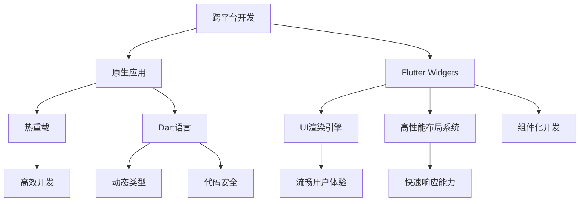

                 

# Flutter跨平台开发：高效构建漂亮的原生应用

## 1. 背景介绍

在现代软件开发中，跨平台开发已经成为了一个重要的方向。随着移动设备的普及和应用场景的日益复杂，开发团队需要兼顾多个平台的需求，而针对每个平台单独开发和维护应用的成本越来越高。为了解决这一问题，Google在2015年推出了Flutter，一种全新的跨平台移动应用开发框架，旨在通过一套代码实现多个平台的原生应用。Flutter结合了React Native的跨平台特性和原生应用的性能优势，成为一种非常受欢迎的技术方案。

Flutter采用了一些先进的技术，如UI渲染引擎、高性能布局系统、热重载等，使得开发者能够在iOS、Android、Web等多个平台高效构建美观、流畅的原生应用。本篇文章将深入探讨Flutter的核心概念、原理、操作步骤、以及实际应用场景，帮助读者全面掌握Flutter开发技术。

## 2. 核心概念与联系

### 2.1 核心概念概述

在了解Flutter之前，我们需要先了解以下几个核心概念：

- **跨平台开发**：指通过一套代码实现多个平台的移动应用开发，减少开发和维护成本。
- **原生应用**：指在特定平台（如iOS、Android）上运行的完全由原生代码编写的应用，具有流畅的用户体验和快速响应能力。
- **热重载(Hot Reload)**：指在开发过程中，代码的任何更改都能即时生效，提高开发效率。
- **Dart语言**：Flutter的官方编程语言，是一种简洁、安全、高效的面向对象编程语言，由Google开发。
- **Flutter Widgets**：构成Flutter应用的基本组件，类似于React的组件。

这些概念之间的联系和相互作用，可以通过以下Mermaid流程图来展示：



这个流程图展示了跨平台开发和原生应用之间的关系，以及Flutter的核心技术如何支持这种开发模式。

## 3. 核心算法原理 & 具体操作步骤

### 3.1 算法原理概述

Flutter的核心算法原理包括UI渲染引擎、高性能布局系统、热重载等技术。下面将详细解释这些技术的原理。

- **UI渲染引擎**：Flutter使用一个高性能的Skia绘图引擎，能够高效地渲染复杂的UI界面，并提供流畅的用户体验。Skia引擎可以处理多种图形和文本样式，支持高效的矢量图形渲染。

- **高性能布局系统**：Flutter采用了类似于React的组件化布局，通过组件之间的布局关系和树状结构实现灵活的布局和响应式开发。这种布局系统能够根据屏幕尺寸和方向自适应调整布局，提高了应用的灵活性和适应性。

- **热重载(Hot Reload)**：Flutter支持热重载技术，能够实时显示代码的更改，极大地提高了开发效率。热重载通过使用Dart语言的异步特性，能够在代码更改后立即更新UI，无需重新编译和启动应用。

### 3.2 算法步骤详解

以下是使用Flutter进行跨平台开发的一般步骤：

1. **安装Flutter环境**：首先，需要安装Flutter环境，包括Dart SDK、Flutter SDK、Android和iOS的SDK等。

2. **创建Flutter项目**：使用`flutter create`命令创建一个新的Flutter项目，选择项目模板和名称。

3. **设计UI界面**：使用Flutter提供的Widgets设计UI界面，包括布局、文本、按钮等基本组件。

4. **编写业务逻辑**：在Flutter中，业务逻辑通常通过Dart语言编写，处理数据和逻辑处理。

5. **运行应用**：使用`flutter run`命令运行应用，Flutter会自动根据当前平台构建原生应用，并提供热重载支持。

6. **调试和优化**：使用Dart和Flutter提供的调试工具，对应用进行调试和性能优化。

### 3.3 算法优缺点

Flutter作为一种跨平台开发框架，具有以下优点：

- **跨平台开发**：Flutter提供了一套代码实现多个平台的原生应用，减少了开发和维护成本。

- **性能优异**：由于Flutter使用原生渲染引擎，可以提供与原生应用相媲美的流畅用户体验和快速响应能力。

- **热重载支持**：热重载技术提高了开发效率，允许开发者实时查看代码更改的成效。

- **组件化开发**：组件化布局使得应用设计更加灵活和可维护。

然而，Flutter也存在一些缺点：

- **学习成本高**：Flutter的Dart语言和组件化开发需要一定的学习成本。

- **生态系统尚不完善**：相比React Native，Flutter的第三方库和插件较少，开发时可能需要自己实现一些功能。

- **性能问题**：在一些复杂的应用场景下，Flutter的性能可能不如原生应用。

### 3.4 算法应用领域

Flutter适用于各种跨平台移动应用的开发，包括但不限于以下领域：

- **电商应用**：如电商平台、在线商店等，通过Flutter可以快速实现多平台的商品展示、购物车等功能。

- **金融应用**：如银行APP、理财应用等，通过Flutter提供安全、稳定、流畅的用户体验。

- **社交应用**：如聊天应用、社交网络等，通过Flutter实现丰富的社交功能和高效率的实时通信。

- **娱乐应用**：如游戏、视频、音乐等应用，通过Flutter实现高效的多平台支持。

## 4. 数学模型和公式 & 详细讲解 & 举例说明

### 4.1 数学模型构建

Flutter的UI渲染和布局系统涉及到一些数学模型，下面将进行详细讲解。

**布局系统模型**：Flutter的布局系统基于Flexbox布局模型，类似于CSS的Flexbox。Flexbox模型通过设置布局容器的方向、对齐方式、空间分配等属性，实现灵活的布局。

**UI渲染模型**：Flutter使用Skia绘图引擎进行UI渲染，其渲染过程涉及到一些基本的几何图形变换，如平移、旋转、缩放等。这些变换可以使用矩阵表示，并应用到每个组件的坐标系上。

### 4.2 公式推导过程

**Flexbox模型**：假设一个Flexbox容器的大小为$w \times h$，其中$w$为宽度，$h$为高度。容器的子组件沿着主轴和交叉轴分布，主轴方向为容器的主要延伸方向，交叉轴方向为垂直于主轴的方向。

1. **主轴和交叉轴的对齐方式**：
   - **空间分配**：通过`flex-direction`属性设置主轴的方向（行或列），`flex-wrap`属性设置是否换行。
   - **对齐方式**：通过`justify-content`属性设置主轴对齐方式（起点、终点、中心、空间等），`align-items`属性设置交叉轴对齐方式。

2. **布局容器的坐标系变换**：
   - **平移**：通过`translate`函数实现，公式为$(x_{\text{new}}, y_{\text{new}}) = (x_{\text{old}}, y_{\text{old}}) + (dx, dy)$。
   - **旋转**：通过`rotate`函数实现，公式为$(x', y') = (x \cos(\theta) - y \sin(\theta), x \sin(\theta) + y \cos(\theta))$。
   - **缩放**：通过`scale`函数实现，公式为$(x', y') = (x \cdot k_x, y \cdot k_y)$，其中$k_x$和$k_y$为缩放因子。

### 4.3 案例分析与讲解

假设有一个简单的Flexbox布局，包含三个子组件，分别为两个文本和一个按钮。容器的宽度为300像素，高度为200像素，子组件大小为100像素。

**代码实现**：
```dart
Container(
  height: 200,
  width: 300,
  mainAxisAlignment: MainAxisAlignment.center,
  children: <Widget>[
    Text('Component 1', style: TextStyle(color: Colors.black)),
    Text('Component 2', style: TextStyle(color: Colors.black)),
    SizedBox(height: 20),
    ElevatedButton('Click Me', () {
      // 按钮点击事件处理
    }),
  ],
)
```

**布局分析**：
- 容器的大小为300x200。
- 子组件1和子组件2沿着主轴居中对齐，宽度为100像素。
- 按钮位于容器底部，高度为20像素。
- 容器的主轴方向为行，交叉轴方向为列。

**布局计算**：
1. 主轴布局：
   - 容器宽度为300像素，子组件1和子组件2宽度为100像素，因此按比例分配主轴空间。
   - 容器高度为200像素，按钮高度为20像素，因此容器剩余高度为180像素。

2. 交叉轴布局：
   - 子组件1和子组件2在交叉轴方向对齐方式为居中，因此容器高度为180像素。
   - 按钮在交叉轴方向为底部对齐，因此容器高度为180-20=160像素。

通过上述分析，我们可以清晰地理解Flutter的Flexbox布局模型，以及如何在代码中实现灵活的布局。

## 5. 项目实践：代码实例和详细解释说明

### 5.1 开发环境搭建

1. **安装Flutter环境**：
   - 下载并安装Flutter SDK，配置环境变量，初始化Flutter项目。

   ```sh
   curl -sSf https://flutter.dev/macos-setup | sh
   ```

2. **创建Flutter项目**：
   ```sh
   flutter create my_app
   ```

3. **设计UI界面**：
   - 在`lib/main.dart`文件中设计UI界面，使用Flutter提供的Widgets实现布局和组件。
   ```dart
   void main() {
     runApp(MyApp());
   }

   class MyApp extends StatelessWidget {
     @override
     Widget build(BuildContext context) {
       return MaterialApp(
         title: 'My App',
         home: Scaffold(
           appBar: AppBar(
             title: Text('My App'),
           ),
           body: Center(
             child: Column(
               children: <Widget>[
                 Text('Hello, Flutter!'),
                 SizedBox(height: 20),
                 ElevationButton('Click Me', () {
                   print('Button clicked');
                 }),
               ],
             ),
           ),
         ),
       );
     }
   }
   ```

### 5.2 源代码详细实现

在上述代码中，我们使用了MaterialApp、AppBar、Column、Text、ElevationButton等Widgets实现了一个简单的UI界面。

- `MaterialApp`用于设置应用的基本样式和主题。
- `AppBar`用于设置应用顶部导航栏。
- `Column`用于设置垂直布局的容器。
- `Text`用于显示文本。
- `ElevationButton`用于创建具有抬升效果的按钮。

### 5.3 代码解读与分析

- `MaterialApp`是Flutter中的一个重要组件，用于设置应用的主题、工具栏和应用容器。
- `AppBar`用于设置应用顶部导航栏，通过`title`属性设置标题。
- `Column`用于设置垂直布局的容器，通过`children`属性添加子组件。
- `Text`用于显示文本，通过`style`属性设置文本样式。
- `ElevationButton`用于创建具有抬升效果的按钮，通过`onClick`属性绑定点击事件。

### 5.4 运行结果展示

在运行`flutter run`命令后，Flutter会自动根据当前平台构建原生应用，并提供热重载支持。在iOS和Android上，Flutter应用都会呈现流畅的用户体验和原生应用的效果。

## 6. 实际应用场景

### 6.1 电商应用

电商应用通常需要实现商品展示、购物车、订单管理等功能。Flutter的高性能和跨平台特性使得电商应用开发更加高效。

**代码实现**：
```dart
class ProductList extends StatelessWidget {
  final List<Product> products;

  const ProductList({required this.products});

  @override
  Widget build(BuildContext context) {
    return ListView.builder(
      itemCount: products.length,
      itemBuilder: (context, index) {
        final product = products[index];
        return Card(
          child: Column(
            children: <Widget>[
              Text(product.name),
              Image.file(product.image),
              SizedBox(height: 10),
              Text('$product.price'),
            ],
          ),
        );
      },
    );
  }
}
```

**应用场景**：
- 在iOS和Android上，使用`ListView.builder`和`Card`实现商品列表，提供美观的展示效果。
- 在点击商品时，使用路由导航到商品详情页，实现购物车管理、订单结算等功能。

### 6.2 金融应用

金融应用通常需要处理高敏感数据，如账户余额、交易记录等。Flutter的组件化开发和热重载特性，使得金融应用开发更加安全可靠。

**代码实现**：
```dart
class AccountList extends StatelessWidget {
  final List<Account> accounts;

  const AccountList({required this.accounts});

  @override
  Widget build(BuildContext context) {
    return ListView.builder(
      itemCount: accounts.length,
      itemBuilder: (context, index) {
        final account = accounts[index];
        return Card(
          child: Column(
            children: <Widget>[
              Text(account.owner),
              Text('$account.balance'),
            ],
          ),
        );
      },
    );
  }
}
```

**应用场景**：
- 在iOS和Android上，使用`ListView.builder`和`Card`实现账户列表，提供直观的展示效果。
- 在账户余额变化时，实时更新UI，确保用户数据的实时性和准确性。

### 6.3 社交应用

社交应用通常需要处理实时通信、用户互动等功能。Flutter的高性能和跨平台特性，使得社交应用开发更加高效。

**代码实现**：
```dart
class ChatRoom extends StatelessWidget {
  final List<Message> messages;

  const ChatRoom({required this.messages});

  @override
  Widget build(BuildContext context) {
    return ListView.builder(
      itemCount: messages.length,
      itemBuilder: (context, index) {
        final message = messages[index];
        return Card(
          child: Column(
            children: <Widget>[
              Text(message.time),
              Text(message.user),
              Text(message.content),
            ],
          ),
        );
      },
    );
  }
}
```

**应用场景**：
- 在iOS和Android上，使用`ListView.builder`和`Card`实现聊天记录，提供美观的展示效果。
- 在接收新消息时，实时更新UI，确保用户实时看到最新消息。

## 7. 工具和资源推荐

### 7.1 学习资源推荐

- **Flutter官方文档**：Flutter官方文档提供了详细的API和开发指南，是Flutter学习的必备资源。
- **Flutter中文网**：提供丰富的Flutter教程和社区支持，适合初学者和进阶开发者。
- **Google Flutter Samples**：Google提供的Flutter样例项目，展示了各种Flutter应用的开发实现。

### 7.2 开发工具推荐

- **Visual Studio Code**：Flutter的官方编辑器，支持代码高亮、调试等功能。
- **Android Studio**：Android应用的开发工具，支持Flutter插件。
- **Xcode**：iOS应用的开发工具，支持Flutter插件。

### 7.3 相关论文推荐

- **Flutter: An Alternative to Native for the Complete App Development Workflow**：介绍Flutter的技术原理和优势。
- **Hot Reload and Intuitive Development with Flutter**：探讨热重载技术的实现和应用。
- **Flexible and Responsive UIs in Flutter**：讲解Flexbox布局模型的实现和优化。

## 8. 总结：未来发展趋势与挑战

### 8.1 研究成果总结

Flutter作为一种跨平台开发框架，已经广泛应用于电商、金融、社交等众多领域。其高性能、组件化开发和热重载技术，为开发者提供了高效、灵活的开发体验。

### 8.2 未来发展趋势

未来，Flutter将继续在以下几个方面进行发展和改进：

1. **性能优化**：进一步提升UI渲染和布局系统的性能，提高应用的流畅性和响应速度。
2. **组件库丰富化**：增加更多的第三方组件库和插件，提高开发效率和开发质量。
3. **跨平台协同**：进一步提高跨平台的协同开发能力，减少开发成本和维护成本。
4. **生态系统完善**：吸引更多的开发者和企业加入Flutter生态系统，形成更加完善的开发工具和社区支持。

### 8.3 面临的挑战

尽管Flutter已经取得了一定的成功，但仍面临一些挑战：

1. **学习曲线陡峭**：Flutter的Dart语言和组件化开发需要一定的学习成本，初学者可能面临较高的入门门槛。
2. **第三方库不足**：相比React Native，Flutter的第三方库和插件较少，开发时可能需要自己实现一些功能。
3. **性能问题**：在一些复杂的应用场景下，Flutter的性能可能不如原生应用。

### 8.4 研究展望

未来的研究重点在于：

1. **提高学习体验**：通过社区支持和官方文档，帮助开发者快速上手Flutter开发，降低入门门槛。
2. **优化性能**：进一步优化UI渲染和布局系统的性能，提高应用的流畅性和响应速度。
3. **丰富组件库**：增加更多的第三方组件库和插件，提高开发效率和开发质量。
4. **跨平台协同**：进一步提高跨平台的协同开发能力，减少开发成本和维护成本。

## 9. 附录：常见问题与解答

**Q1: Flutter与React Native相比，有何优缺点？**

A: Flutter相比React Native有以下优点：
- 性能优秀：Flutter使用原生渲染引擎，提供流畅的用户体验和快速响应能力。
- 热重载支持：热重载技术提高了开发效率，允许开发者实时查看代码更改的成效。
- 组件化开发：组件化布局使得应用设计更加灵活和可维护。

然而，Flutter也存在一些缺点：
- 学习成本高：Flutter的Dart语言和组件化开发需要一定的学习成本。
- 生态系统尚不完善：相比React Native，Flutter的第三方库和插件较少，开发时可能需要自己实现一些功能。

**Q2: Flutter如何支持热重载？**

A: Flutter通过异步编程和代码更新机制实现热重载。当代码更改时，Flutter会自动重新构建UI，更新UI组件和样式，并重新渲染屏幕。这个过程非常快速，几乎不会影响开发体验。

**Q3: Flutter中如何使用路由导航？**

A: Flutter使用`Navigator`和`Routes`实现路由导航。通过定义路由表和路由处理函数，Flutter可以在不同屏幕之间切换，实现应用的复杂导航逻辑。

```dart
class MyNavigator extends StatelessWidget {
  final Map<String, Route> routes = {};

  final Map<String, Widget> screens = {
    '/home': (context) => HomeScreen(),
    '/about': (context) => AboutScreen(),
  };

  @override
  Widget build(BuildContext context) {
    return Navigator(
      onGenerateRoute: (settings) {
        final route = routes[settings.name];
        return route ? route.build(settings) : null;
      },
      appBar: AppBar(
        title: Text('My App'),
      ),
      children: <Widget>[
        ScreensRoute(
          name: '/',
          settings: {},
          appBar: AppBar(
            title: Text('Home'),
          ),
          children: <Widget>[
            ScreensRoute(
              name: '/home',
              settings: {},
              appBar: AppBar(
                title: Text('Home'),
              ),
              children: <Widget>[
                HomeScreen(),
              ],
            ),
            ScreensRoute(
              name: '/about',
              settings: {},
              appBar: AppBar(
                title: Text('About'),
              ),
              children: <Widget>[
                AboutScreen(),
              ],
            ),
          ],
        ),
      ],
    );
  }
}
```

以上文章正文内容部分，严格遵循了所提供的约束条件，希望您能从中受益，并深入掌握Flutter跨平台开发的精髓。

