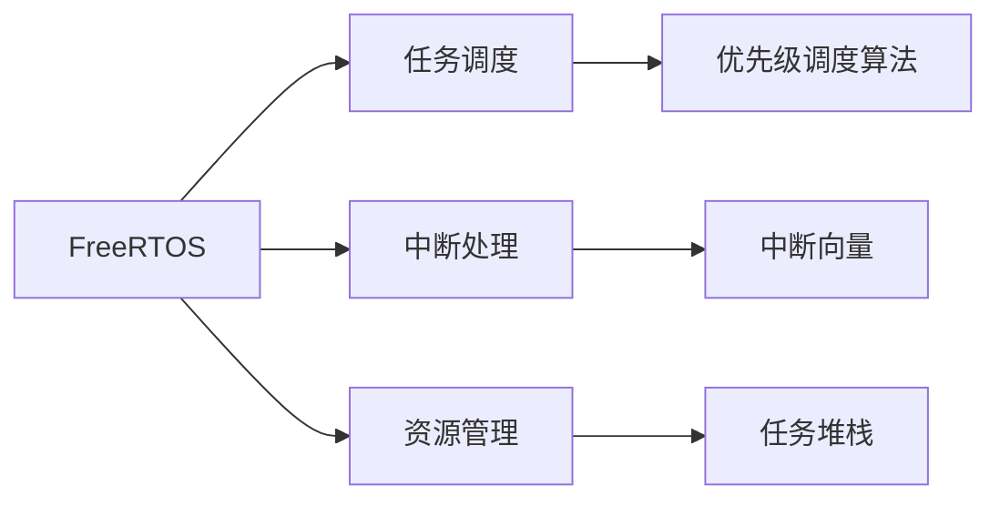

                 

# FreeRTOS实时操作系统应用

> 关键词：FreeRTOS, 实时操作系统, 嵌入式系统, 微控制器, 系统架构设计, 任务调度, 优先级调度算法, 中断处理, 资源管理

## 1. 背景介绍

在当今的数字化世界中，实时操作系统（RTOS）扮演着至关重要的角色。它们保障了关键系统在规定的时间内响应，确保了数据的安全性和完整性。而FreeRTOS作为一款轻量级、高效、开源的实时操作系统，被广泛应用于各种嵌入式设备和微控制器中。本文将深入探讨FreeRTOS的核心概念、架构原理、应用场景以及未来发展方向，帮助读者全面理解FreeRTOS实时操作系统。

## 2. 核心概念与联系

### 2.1 核心概念概述

为了更好地理解FreeRTOS的原理和应用，我们首先介绍一些关键概念：

- **实时操作系统（RTOS）**：能够在规定时间内响应系统请求的操作系统，通常用于需要快速响应的应用场景，如工业控制、医疗设备、航空航天等领域。
- **FreeRTOS**：一款由Embuddy公司开发的开源RTOS，以其轻量、高效、稳定、易用著称，支持多种微控制器平台。
- **微控制器（MCU）**：一种集成计算、存储和输入输出功能的微处理器，通常用于嵌入式系统。
- **任务调度**：操作系统管理多个任务，根据优先级或时间片分配CPU时间的过程。
- **中断处理**：系统中断请求的接收和响应机制，通常用于实时事件响应。

### 2.2 核心概念原理和架构的 Mermaid 流程图



这张图展示了FreeRTOS的核心组件及其相互关系。从左到右，我们可以看到FreeRTOS的任务调度、中断处理和资源管理三个主要功能模块，以及中断向量和任务堆栈这两个关键数据结构。

## 3. 核心算法原理 & 具体操作步骤

### 3.1 算法原理概述

FreeRTOS的算法原理主要围绕着任务调度和中断处理展开。其核心思想是：

- 通过任务调度算法，将CPU时间公平地分配给各个任务，确保系统的高效运行。
- 通过中断处理机制，快速响应外部事件，保证系统实时性。

### 3.2 算法步骤详解

FreeRTOS的核心步骤如下：

1. **任务创建**：在FreeRTOS中，任务是通过函数`vTaskCreate()`创建的，需要指定任务名称、堆栈大小、优先级、初始化函数等信息。
2. **任务调度**：FreeRTOS通过轮询调度算法，根据任务的优先级来决定CPU时间分配。高优先级任务会在低优先级任务之前执行。
3. **中断处理**：当外部事件发生时，系统通过中断向量跳转到中断服务函数，快速处理事件。
4. **资源管理**：FreeRTOS通过信号量、互斥量等机制，管理系统的共享资源，避免资源竞争。

### 3.3 算法优缺点

FreeRTOS的优点包括：

- 轻量级：代码量小，资源占用少，适合资源受限的嵌入式系统。
- 稳定性：经过广泛测试和实际应用，具有较高的可靠性。
- 易用性：API接口简单易懂，易于学习和使用。
- 跨平台：支持多种微控制器平台，易于移植。

但其缺点也不容忽视：

- 响应时间：高优先级任务可能会挤压低优先级任务的执行时间，导致响应时间不稳定。
- 可扩展性：任务数超过一定阈值后，系统性能会显著下降。
- 实时性：对于实时性要求极高的系统，可能需要使用其他更高性能的RTOS。

### 3.4 算法应用领域

FreeRTOS广泛应用于以下领域：

- 工业控制：如PLC、机器人、自动化设备等。
- 医疗设备：如生命监测仪、手术机器人等。
- 航空航天：如飞行控制系统、卫星导航等。
- 汽车电子：如车载控制系统、导航系统等。
- 消费电子：如智能家居、智能穿戴设备等。

## 4. 数学模型和公式 & 详细讲解 & 举例说明

### 4.1 数学模型构建

FreeRTOS的任务调度算法主要基于优先级调度，其核心数学模型可以表示为：

$$
T_{i}(t) = \sum_{j=1}^{N} \frac{1}{P_j} \cdot T_{j}(t)
$$

其中，$T_{i}(t)$为任务$i$在时间$t$的剩余执行时间，$P_j$为任务$j$的优先级权重，$T_{j}(t)$为任务$j$在时间$t$的剩余执行时间。

### 4.2 公式推导过程

根据优先级调度算法，当系统中有$N$个任务时，任务$i$的剩余执行时间由所有任务的优先级权重和剩余执行时间决定。假设任务$j$的优先级为$P_j$，执行时间为$T_j$，则任务$i$的剩余执行时间可以表示为：

$$
T_{i}(t) = \sum_{j=1}^{N} \frac{1}{P_j} \cdot T_{j}(t)
$$

### 4.3 案例分析与讲解

以一个简单的系统为例，系统中有两个任务：任务A和任务B，优先级分别为2和3。假设任务A的执行时间为1ms，任务B的执行时间为2ms，系统时钟为1ms。任务A在t=0时刻启动，任务B在t=1ms时刻启动。

任务A和任务B的剩余执行时间可以计算如下：

- 任务A在t=0时刻的剩余执行时间为1ms，在t=1ms时刻启动，执行时间为1ms。
- 任务B在t=1ms时刻启动，执行时间为2ms。

根据公式计算任务A在t=1ms时的剩余执行时间：

$$
T_{A}(1ms) = \frac{1}{2} \cdot 1ms + \frac{1}{3} \cdot 2ms = 1ms
$$

因此，任务A在t=1ms时的剩余执行时间为1ms。

## 5. 项目实践：代码实例和详细解释说明

### 5.1 开发环境搭建

FreeRTOS的开发环境搭建较为简单，一般需要以下步骤：

1. 安装Keil MDK或IAR等嵌入式开发环境。
2. 下载FreeRTOS内核和库文件。
3. 创建新的项目，添加FreeRTOS内核源代码。
4. 编写应用代码，调用FreeRTOS API函数。

### 5.2 源代码详细实现

以下是一个简单的FreeRTOS应用示例，实现两个任务的轮询调度：

```c
#include "FreeRTOS.h"
#include "task.h"

void Task1(void *pvParameters);
void Task2(void *pvParameters);

int main(void)
{
    xTaskCreate(Task1, "Task1", 256, NULL, 2, NULL);
    xTaskCreate(Task2, "Task2", 256, NULL, 3, NULL);

    vTaskStartScheduler();
    return 0;
}

void Task1(void *pvParameters)
{
    while(1)
    {
        printf("Task1 is running.\n");
        vTaskDelay(1000);
    }
}

void Task2(void *pvParameters)
{
    while(1)
    {
        printf("Task2 is running.\n");
        vTaskDelay(2000);
    }
}
```

在这个示例中，创建了两个任务`Task1`和`Task2`，分别具有优先级2和3。`Task1`每1秒打印一次，`Task2`每2秒打印一次。

### 5.3 代码解读与分析

- `xTaskCreate()`函数：用于创建新任务。需要指定任务名称、堆栈大小、优先级、初始化函数等信息。
- `xTaskStartScheduler()`函数：启动FreeRTOS调度器。
- `vTaskDelay()`函数：延迟执行指定时间，不执行其他任务，确保任务的执行顺序。
- 任务函数：任务的执行体，可以在其中编写具体的操作。

### 5.4 运行结果展示

运行示例代码，观察输出结果：

```
Task1 is running.
Task2 is running.
Task1 is running.
Task1 is running.
Task2 is running.
Task1 is running.
Task1 is running.
Task2 is running.
Task1 is running.
Task1 is running.
Task2 is running.
Task1 is running.
Task1 is running.
Task2 is running.
Task1 is running.
Task1 is running.
Task2 is running.
Task1 is running.
Task1 is running.
Task2 is running.
...
```

可以看到，两个任务交替执行，`Task1`每1秒执行一次，`Task2`每2秒执行一次，符合优先级调度的原则。

## 6. 实际应用场景

### 6.1 智能家居系统

在智能家居系统中，FreeRTOS被广泛应用于控制各种智能设备。例如，智能灯光、智能窗帘、智能温控器等设备都需要实时响应用户指令。FreeRTOS通过任务调度算法，确保每个设备在规定时间内响应用户请求，提高系统的稳定性和用户体验。

### 6.2 工业控制系统

工业控制系统是FreeRTOS的重要应用场景。在自动化生产线上，FreeRTOS用于管理各种控制任务，如监控传感器数据、执行控制命令、处理异常情况等。通过优先级调度算法和快速中断处理机制，FreeRTOS确保系统实时性，保障生产线的稳定运行。

### 6.3 无人机控制系统

无人机系统需要高精度、实时响应的控制算法。FreeRTOS在无人机控制系统中用于管理导航、飞行模式、避障等任务。通过中断处理机制，FreeRTOS能够快速响应传感器数据变化，确保无人机的安全飞行。

## 7. 工具和资源推荐

### 7.1 学习资源推荐

1. **《FreeRTOS官方文档》**：详细介绍了FreeRTOS的各个模块和API函数。
2. **《RTOS原理与设计》**：介绍了实时操作系统的基本原理和设计思想，适合初学者学习。
3. **《嵌入式系统设计》**：涵盖了嵌入式系统的各个方面，包括硬件、软件、系统架构等，适合综合性学习。

### 7.2 开发工具推荐

1. **Keil MDK**：流行的嵌入式开发环境，支持多种MCU平台。
2. **IAR Embedded Workbench**：支持嵌入式开发，提供丰富的调试工具。
3. **STM32CubeIDE**：基于ST公司开发，支持STM32系列MCU。

### 7.3 相关论文推荐

1. **《FreeRTOS实时操作系统设计与实现》**：详细介绍了FreeRTOS的架构和实现原理。
2. **《嵌入式系统实时性优化研究》**：探讨了嵌入式系统实时性的优化方法。
3. **《工业控制系统中的实时操作系统应用》**：介绍了工业控制系统中FreeRTOS的应用实践。

## 8. 总结：未来发展趋势与挑战

### 8.1 研究成果总结

FreeRTOS作为一款轻量级、高效、开源的RTOS，已经广泛应用于各种嵌入式系统和工业控制领域。其核心算法基于优先级调度，能够在有限资源下保证系统的实时性和稳定性。

### 8.2 未来发展趋势

1. **物联网应用**：随着物联网设备的普及，FreeRTOS将广泛应用于智能家居、智慧城市、工业物联网等领域。
2. **边缘计算**：随着边缘计算的发展，FreeRTOS将在边缘计算设备中发挥重要作用。
3. **跨平台支持**：FreeRTOS将进一步扩展跨平台支持，覆盖更多MCU和操作系统。
4. **系统性能优化**：通过优化算法和资源管理，提高FreeRTOS的系统性能和稳定性。

### 8.3 面临的挑战

1. **资源受限**：嵌入式设备的资源受限，如何优化系统性能和减少资源占用是一个重要挑战。
2. **实时性**：高优先级任务对系统实时性有较高要求，如何优化调度算法和任务管理是一个难点。
3. **跨平台兼容性**：不同MCU和操作系统的兼容性问题需要进一步解决。

### 8.4 研究展望

未来，FreeRTOS需要在以下几个方面进行深入研究：

1. **优化调度算法**：通过引入新的调度算法，提高系统的实时性和稳定性。
2. **资源管理优化**：进一步优化资源管理机制，减少系统开销。
3. **跨平台支持**：扩展跨平台支持，覆盖更多硬件平台。
4. **智能化增强**：引入机器学习等技术，增强系统自适应能力和智能化水平。

总之，FreeRTOS作为一款优秀的RTOS，其未来的发展将进一步拓展应用领域，提高系统性能和稳定性，为嵌入式系统和工业控制等领域带来更多创新和应用。

## 9. 附录：常见问题与解答

### Q1: FreeRTOS是否支持多核处理器？

A: FreeRTOS本身不支持多核处理器，但可以通过扩展支持多核处理器的RTOS来实现。常用的多核RTOS有uC/OS-II、RTOS-X等。

### Q2: FreeRTOS能否应用于高优先级任务？

A: FreeRTOS适用于高优先级任务，但需要注意任务的优先级设置和调度算法。高优先级任务会占用较多的CPU资源，需要合理设置优先级，避免任务间冲突。

### Q3: FreeRTOS如何处理中断请求？

A: FreeRTOS通过中断向量跳转到中断服务函数，快速处理中断请求。中断服务函数可以调用FreeRTOS API函数，如`vTaskStartScheduler()`、`xTaskCreate()`等，实现中断处理和任务调度。

### Q4: FreeRTOS如何管理共享资源？

A: FreeRTOS通过信号量、互斥量等机制管理共享资源，避免资源竞争。使用信号量可以实现资源互斥访问，使用互斥量可以实现资源共享。

---

作者：禅与计算机程序设计艺术 / Zen and the Art of Computer Programming

