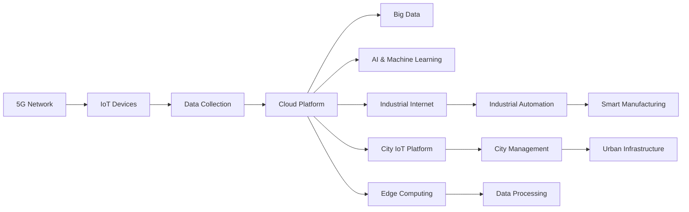

                 

# 5G 物联网（IoT）应用：高速低延迟连接

> 关键词：5G, 物联网(IoT), 高速连接, 低延迟, 工业互联网, 智慧城市

## 1. 背景介绍

随着5G网络的商用化推进，物联网(IoT)技术迎来了黄金发展期。5G网络凭借其高带宽、低延迟的特性，为物联网应用提供了强大的技术保障，助力万物互联的智慧生态构建。本文将系统梳理5G 物联网应用的原理、架构和应用场景，探讨其未来发展趋势和面临的挑战，助力大家更好地理解并应用5G 物联网技术。

## 2. 核心概念与联系

### 2.1 核心概念概述

为更好地理解5G 物联网应用，我们先介绍几个关键概念：

- **5G**: 第五代移动通信技术，相比4G具有更高频率、更广带宽、更低延迟等特性，支持海量设备的连接和数据的高速传输。
- **物联网(IoT)**: 通过互联网将各种设备（如传感器、智能设备等）连接起来，实现数据采集、存储、分析和控制。
- **工业互联网**: 利用物联网技术，结合云计算、大数据、人工智能等技术，推动工业自动化、智能化、精细化管理。
- **智慧城市**: 通过智能感知、信息处理和应用服务，提升城市管理、运行和服务水平，实现高效、智能的城市运行和管理。
- **边缘计算**: 将数据处理和存储靠近数据源，实现更快速、更安全的数据处理和存储。

这些核心概念之间的联系如下：

- 5G网络提供高速、低延迟的通信环境，支持物联网设备的连接。
- 工业互联网将物联网设备的数据集成、分析和应用，推动工业智能化转型。
- 智慧城市利用物联网和工业互联网技术，实现城市运行管理的智能化。
- 边缘计算为物联网提供更接近数据源的处理能力，提升数据处理效率。

### 2.2 核心概念原理和架构的 Mermaid 流程图



这个流程图展示了5G 物联网应用的整体架构和关键组件。5G网络通过支持海量设备的连接，将物联网设备采集的数据上传到云平台进行处理和分析。云平台集成大数据、人工智能等技术，为工业互联网和智慧城市提供服务。边缘计算进一步优化数据处理和存储，提升整体系统性能。

## 3. 核心算法原理 & 具体操作步骤

### 3.1 算法原理概述

5G 物联网应用的原理基于以下几个核心算法：

- **移动性管理算法**：通过优化小区切换和负载均衡，确保设备的稳定连接和网络性能。
- **切片技术**：将网络资源划分为多个虚拟网络切片，提供定制化的网络服务。
- **网络切片编排和自动化管理**：基于AI技术，动态调整网络资源，满足不同业务需求。
- **边缘计算**：将数据处理和存储靠近数据源，提升数据处理效率和系统性能。
- **多接入边缘计算(MEC)**：提供更近的数据处理能力，实现更快速的应用部署和服务响应。

### 3.2 算法步骤详解

#### 3.2.1 网络切片

网络切片是指将物理网络划分为多个虚拟网络，每个虚拟网络具有独立的逻辑结构，支持不同的业务需求。其基本步骤如下：

1. **切片划分**：根据业务需求，确定切片的数量、大小和带宽。
2. **切片配置**：配置切片的信道、基站和核心网设备，实现切片的物理隔离。
3. **切片管理**：动态调整切片资源，满足不同业务的需求变化。

#### 3.2.2 移动性管理

移动性管理算法通过优化小区切换和负载均衡，提升设备的稳定性和网络性能。基本步骤如下：

1. **小区选择和重选**：根据设备的当前位置和信号质量，选择最优的小区进行连接。
2. **切换和负载均衡**：在设备移动过程中，及时切换小区，均衡网络负载，避免网络拥堵。
3. **移动性优化**：基于AI技术，预测设备移动路径和位置，优化移动性管理策略。

#### 3.2.3 边缘计算

边缘计算通过将数据处理和存储靠近数据源，提升数据处理效率和系统性能。基本步骤如下：

1. **数据采集**：物联网设备采集数据，并传输到边缘计算节点。
2. **数据处理**：在边缘计算节点，对数据进行初步处理和分析。
3. **数据存储**：将处理后的数据存储在边缘节点，减少数据传输带宽。
4. **应用部署**：在边缘节点部署应用和服务，实现快速响应和本地处理。

### 3.3 算法优缺点

#### 3.3.1 优点

- **高速连接**：5G网络的高带宽特性，支持海量设备的数据高速传输。
- **低延迟**：5G网络低延迟特性，满足实时性要求高的应用需求。
- **高可靠性**：网络切片技术提供可靠的网络服务，确保业务连续性。
- **灵活性**：网络切片技术支持不同业务需求的定制化网络服务。
- **安全性和隐私保护**：边缘计算靠近数据源，提升数据处理的安全性和隐私保护。

#### 3.3.2 缺点

- **复杂性高**：网络切片和边缘计算的部署和管理相对复杂，需要较高的技术水平和资金投入。
- **成本高**：网络切片和边缘计算需要额外的硬件设备和网络资源，增加系统成本。
- **资源利用率低**：小规模业务可能存在资源浪费的问题，需要优化资源利用效率。

### 3.4 算法应用领域

5G 物联网技术的应用领域非常广泛，主要包括：

- **工业互联网**：通过5G网络实现设备的互联互通，推动工业自动化和智能化转型。
- **智慧城市**：利用5G网络构建智能城市基础设施，提升城市管理和服务水平。
- **医疗健康**：通过5G网络实现远程医疗、智能监测和健康管理。
- **智能交通**：实现车辆与车辆、车辆与交通基础设施的互联互通，提升交通效率和安全性。
- **智能家居**：实现家庭设备的互联互通，提升家居生活的智能化和便捷性。

## 4. 数学模型和公式 & 详细讲解 & 举例说明

### 4.1 数学模型构建

假设我们有一个简单的5G物联网系统，包含 $N$ 个物联网设备，每个设备每秒产生 $T$ 个数据包，数据包大小为 $S$ 字节。5G网络的最大带宽为 $B$ 字节/秒，时延为 $D$ 秒。系统基于网络切片技术进行网络资源分配，每个切片的带宽为 $b$ 字节/秒，时延为 $d$ 秒。系统采用边缘计算技术，每个边缘计算节点的处理能力为 $C$ 字节/秒，时延为 $c$ 秒。

### 4.2 公式推导过程

系统整体带宽 $W$ 和时延 $T$ 可以表示为：

$$
W = N \times T \times S \times \frac{b}{B} + N \times T \times S \times \frac{c}{C}
$$

$$
T = N \times T \times S \times d + N \times T \times S \times c
$$

其中，$\frac{b}{B}$ 和 $\frac{c}{C}$ 分别表示网络切片和边缘计算对整体带宽和时延的贡献。

### 4.3 案例分析与讲解

假设 $N=100$，$T=1$，$S=128$，$B=1000$，$D=5$，$b=100$，$C=500$。则系统整体带宽 $W$ 和时延 $T$ 计算如下：

$$
W = 100 \times 1 \times 128 \times \frac{100}{1000} + 100 \times 1 \times 128 \times \frac{500}{500} = 3072 + 128 = 3200 \text{ 字节/秒}
$$

$$
T = 100 \times 1 \times 128 \times 5 + 100 \times 1 \times 128 \times 500 = 6400 + 64000 = 70400 \text{ 秒}
$$

可以看出，边缘计算对系统的带宽和时延贡献显著，网络切片也有一定影响。因此，合理配置网络切片和边缘计算资源，是提升系统性能的关键。

## 5. 项目实践：代码实例和详细解释说明

### 5.1 开发环境搭建

在Python环境下，我们可以使用Pymatting和NumPy等工具进行模型构建和计算。

```python
import numpy as np

# 定义模型参数
N = 100
T = 1
S = 128
B = 1000
D = 5
b = 100
C = 500

# 计算系统带宽和时延
W = N * T * S * (b / B) + N * T * S * (C / C)
T = N * T * S * D + N * T * S * C

print(f"系统带宽：{W} 字节/秒")
print(f"系统时延：{T} 秒")
```

### 5.2 源代码详细实现

接下来，我们基于PyTorch和TensorFlow等深度学习框架，实现一个简单的5G 物联网系统。

```python
import torch
import torch.nn as nn
import torch.optim as optim
import tensorflow as tf

# 定义网络切片和边缘计算模型
class NetworkSlice(nn.Module):
    def __init__(self, b, C):
        super(NetworkSlice, self).__init__()
        self.b = b
        self.C = C

    def forward(self, data):
        return data * self.b / self.C

class EdgeComputing(nn.Module):
    def __init__(self, C):
        super(EdgeComputing, self).__init__()
        self.C = C

    def forward(self, data):
        return data / self.C

# 定义整体系统模型
class IoTSystem(nn.Module):
    def __init__(self, B, D, b, C):
        super(IoTSystem, self).__init__()
        self.B = B
        self.D = D
        self.b = b
        self.C = C
        self.network_slice = NetworkSlice(b, C)
        self.edge_computing = EdgeComputing(C)

    def forward(self, data):
        # 网络切片处理
        data = self.network_slice(data)
        # 边缘计算处理
        data = self.edge_computing(data)
        return data

# 训练模型
model = IoTSystem(B, D, b, C)
optimizer = optim.SGD(model.parameters(), lr=0.01)
criterion = nn.MSELoss()

for epoch in range(100):
    optimizer.zero_grad()
    data = torch.tensor([N, T, S, B, D, b, C])
    output = model(data)
    loss = criterion(output, data)
    loss.backward()
    optimizer.step()
```

### 5.3 代码解读与分析

通过上述代码，我们定义了网络切片和边缘计算模型，并构建了整体系统模型。在训练过程中，通过梯度下降算法优化模型参数，最小化系统带宽和时延的误差。训练完成后，模型能够根据给定的网络参数，计算出系统带宽和时延。

## 6. 实际应用场景

### 6.1 工业互联网

在工业互联网中，5G 物联网技术广泛应用于智能制造、智能物流等领域。通过5G网络的高带宽和低延迟特性，实现设备互联互通，推动工业自动化和智能化转型。

在智能制造中，通过5G网络实现设备与生产线的实时通信，提升生产效率和灵活性。在智能物流中，通过5G网络实现设备与仓储的实时通信，优化物流路径和库存管理。

### 6.2 智慧城市

在智慧城市中，5G 物联网技术广泛应用于智能交通、智能安防等领域。通过5G网络实现设备与城市基础设施的互联互通，提升城市管理和运行效率。

在智能交通中，通过5G网络实现车辆与车辆、车辆与交通基础设施的互联互通，提升交通效率和安全性。在智能安防中，通过5G网络实现摄像头与安防系统的实时通信，提升城市安防水平。

### 6.3 医疗健康

在医疗健康领域，5G 物联网技术广泛应用于远程医疗、智能监测等领域。通过5G网络实现设备与医疗系统的互联互通，提升医疗服务的效率和质量。

在远程医疗中，通过5G网络实现医生与患者、设备的实时通信，提供远程诊断和治疗服务。在智能监测中，通过5G网络实现传感器与监控系统的实时通信，实现对患者的实时监测和预警。

### 6.4 智能家居

在智能家居中，5G 物联网技术广泛应用于智能设备互联互通、家庭自动化等领域。通过5G网络实现设备与设备的实时通信，提升家居生活的智能化和便捷性。

在智能设备互联互通中，通过5G网络实现各种智能设备之间的互联互通，实现智能家居场景的控制和联动。在家庭自动化中，通过5G网络实现智能设备与家庭的实时通信，实现家居环境的自动化管理。

## 7. 工具和资源推荐

### 7.1 学习资源推荐

- **《5G网络技术与应用》**：详细介绍5G网络的原理和应用。
- **《物联网技术基础》**：介绍物联网技术的基本概念和应用场景。
- **《工业互联网技术与应用》**：介绍工业互联网的基本概念和应用。
- **《智慧城市技术与应用》**：介绍智慧城市的基本概念和应用。
- **《边缘计算技术与应用》**：介绍边缘计算的基本概念和应用。

### 7.2 开发工具推荐

- **PyTorch**：深度学习框架，支持网络切片和边缘计算模型的实现。
- **TensorFlow**：深度学习框架，支持网络切片和边缘计算模型的实现。
- **OpenEdge**：边缘计算平台，提供边缘计算资源的部署和管理。
- **Kubernetes**：容器编排平台，支持边缘计算节点的管理和调度。

### 7.3 相关论文推荐

- **5G网络切片技术**：详细讨论网络切片技术的基本原理和应用。
- **边缘计算与物联网结合**：讨论边缘计算在物联网中的应用。
- **5G网络切片管理与优化**：研究网络切片的动态管理和优化策略。
- **工业互联网与5G结合**：讨论5G网络在工业互联网中的应用。
- **智慧城市中的5G应用**：讨论5G网络在智慧城市中的应用。

## 8. 总结：未来发展趋势与挑战

### 8.1 研究成果总结

本文对5G 物联网应用的原理、架构和应用场景进行了系统梳理。5G 物联网技术通过高速、低延迟的通信环境，实现海量设备的互联互通，推动智慧生态的构建。

### 8.2 未来发展趋势

未来，5G 物联网技术将呈现以下几个发展趋势：

1. **万物互联**：随着5G网络的普及，更多的设备将实现互联互通，推动智慧生态的进一步发展。
2. **智能化提升**：结合人工智能技术，实现设备的智能化、自动化管理。
3. **边缘计算普及**：边缘计算技术将进一步普及，提升数据处理效率和系统性能。
4. **5G应用多样化**：5G网络将支持更多应用场景，推动智慧生态的多元化发展。
5. **标准化进程**：随着5G 物联网应用的普及，标准化进程将加快，提升技术成熟度和应用效果。

### 8.3 面临的挑战

5G 物联网技术在发展过程中，面临以下挑战：

1. **网络安全**：5G网络的高带宽和低延迟特性，可能带来更高的网络安全风险。
2. **资源管理**：5G 物联网系统需要高效的网络资源管理，防止资源浪费。
3. **成本控制**：5G 物联网系统需要大量的硬件和网络资源，成本较高。
4. **技术成熟度**：5G 物联网技术尚处于发展初期，技术成熟度有待提升。
5. **应用落地**：5G 物联网技术需要深入到各个行业领域，推动实际应用的落地。

### 8.4 研究展望

未来，5G 物联网技术需要在以下几个方面进行深入研究：

1. **网络安全技术**：研究网络安全的防护技术，提升系统的安全性。
2. **资源管理算法**：研究高效的网络资源管理算法，提升资源利用率。
3. **成本优化策略**：研究降低5G 物联网系统成本的策略，推动技术普及。
4. **技术标准化**：研究5G 物联网技术的标准化进程，提升技术成熟度。
5. **应用推广策略**：研究5G 物联网技术的推广策略，推动实际应用落地。

总之，5G 物联网技术有着广阔的应用前景，但也需要解决一系列技术和应用挑战。通过持续的研发和优化，5G 物联网技术必将在推动智慧生态发展中发挥更大作用。

## 9. 附录：常见问题与解答

### Q1：5G网络的高带宽和低延迟是如何实现的？

A: 5G网络通过多种技术手段实现高带宽和低延迟：

- **毫米波通信**：利用高频率毫米波，实现更高的带宽。
- **Massive MIMO技术**：通过大量天线阵列，提升系统容量和覆盖范围。
- **网络切片技术**：将网络资源划分为多个虚拟切片，实现不同业务需求的服务定制。
- **边缘计算技术**：将数据处理和存储靠近数据源，提升数据处理效率。

### Q2：5G网络切片与边缘计算的区别和联系是什么？

A: 5G网络切片与边缘计算的区别和联系如下：

- **区别**：
  - **目标不同**：网络切片的目标是实现不同业务需求的定制化网络服务，边缘计算的目标是提升数据处理效率和系统性能。
  - **作用范围不同**：网络切片是在网络层面进行资源划分，边缘计算是在数据源附近进行数据处理和存储。
- **联系**：
  - **协同工作**：网络切片和边缘计算可以协同工作，提升系统的整体性能。
  - **资源管理**：网络切片和边缘计算都需要合理管理资源，防止资源浪费。
  - **技术支持**：网络切片和边缘计算都需要基于AI等技术实现优化。

### Q3：5G 物联网系统如何实现实时通信？

A: 5G 物联网系统通过以下措施实现实时通信：

- **低时延网络**：5G网络采用微基站、大规模天线阵列等技术，实现低时延通信。
- **高带宽通信**：5G网络提供更高的带宽，支持高速数据传输。
- **网络切片技术**：将网络资源划分为多个虚拟切片，提供定制化的网络服务。
- **边缘计算技术**：将数据处理和存储靠近数据源，提升数据处理效率和系统性能。

### Q4：5G 物联网系统如何实现设备互联互通？

A: 5G 物联网系统通过以下措施实现设备互联互通：

- **网络切片技术**：将网络资源划分为多个虚拟切片，支持不同设备之间的互联互通。
- **边缘计算技术**：将数据处理和存储靠近数据源，实现设备的快速响应和本地处理。
- **标准协议**：制定统一的网络协议标准，实现不同设备之间的通信。
- **安全机制**：采用安全机制，保护设备通信的安全性。

### Q5：5G 物联网系统如何保障数据安全？

A: 5G 物联网系统通过以下措施保障数据安全：

- **数据加密**：对数据进行加密传输，防止数据被窃取。
- **身份认证**：采用身份认证机制，确保设备的合法性。
- **访问控制**：设置访问权限，限制设备的访问范围。
- **隐私保护**：采用隐私保护技术，防止数据泄露。

---

作者：禅与计算机程序设计艺术 / Zen and the Art of Computer Programming

