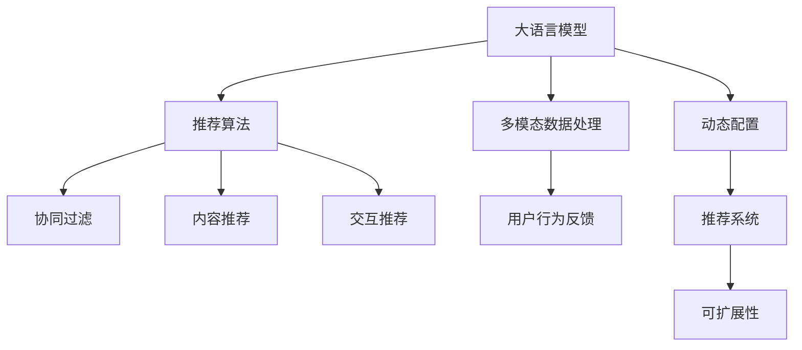

                 

# GENRE框架：灵活、可配置的LLM推荐

> 关键词：GENRE框架, 大语言模型, 推荐系统, 用户兴趣, 个性化推荐, 内容推荐, 交互推荐

## 1. 背景介绍

### 1.1 问题由来

随着互联网时代的到来，信息爆炸成为不争的事实。面对海量内容，如何精准、高效地为用户推荐感兴趣的信息，成为信息时代的重要挑战。传统的基于规则、基于统计的推荐系统难以满足用户个性化和实时性的需求，基于深度学习的推荐系统则逐渐成为主流。特别是近年来，预训练语言模型(Language Models)的兴起，为推荐系统带来了新的思路和方法。

大语言模型通过海量的无监督数据预训练，学习到了丰富的语言知识，能够高效地捕捉文本特征，为推荐系统提供了强大的语言理解能力。然而，大语言模型通常以通用语言模型形式存在，缺乏对特定任务和用户个性化需求的灵活适应能力。为了弥补这一缺陷，基于大语言模型的推荐系统需要结合推荐算法和用户行为数据，构建灵活、可配置的推荐框架。

### 1.2 问题核心关键点

为了构建灵活、可配置的推荐框架，我们需要设计一个能够适应多模态数据、多推荐场景的架构，同时具备动态配置能力，能够根据任务需求进行参数调整和算法优化。这种架构应包含以下几个关键点：

1. **多模态数据处理**：能够处理文本、图片、音频等多种形式的数据，提取多模态信息。
2. **多推荐算法集成**：融合内容推荐、协同过滤、交互推荐等多种算法，提供多样化的推荐策略。
3. **用户行为反馈**：通过收集用户对推荐结果的反馈，动态调整推荐策略。
4. **灵活参数配置**：能够动态配置模型参数和算法参数，适应不同的推荐场景。
5. **可扩展性**：能够根据业务需求，扩展数据源和算法模块，提升系统的可维护性和可扩展性。

## 2. 核心概念与联系

### 2.1 核心概念概述

为更好地理解GENRE框架，本节将介绍几个关键概念及其相互关系。

- **大语言模型(Language Model, LM)**：通过大规模无监督数据预训练得到的语言模型，具备强大的语言理解能力。
- **推荐系统(Recommendation System, RS)**：利用用户行为数据和内容特征，为用户提供个性化推荐的服务系统。
- **多模态数据(Multimodal Data)**：包含文本、图片、音频等多种形式的数据，能够综合利用不同模态的信息提升推荐效果。
- **用户行为反馈(User Feedback)**：用户对推荐结果的评分、点击、收藏等行为数据，用于优化推荐模型。
- **推荐算法(Recommendation Algorithm)**：基于协同过滤、内容推荐、交互推荐等多种方法，构建推荐模型。
- **动态配置(Dynamic Configuration)**：根据推荐场景和用户需求，动态调整推荐算法和模型参数。
- **可扩展性(Scalability)**：系统能够根据业务需求，灵活扩展数据源和算法模块，提升系统的可维护性和可扩展性。

这些概念之间的关系可以通过以下Mermaid流程图来展示：



这个流程图展示了GENRE框架的核心组成及其相互关系：

1. 大语言模型通过多模态数据处理，提取文本、图片等特征。
2. 推荐算法包括协同过滤、内容推荐、交互推荐等，融合多种推荐策略。
3. 用户行为反馈用于优化推荐模型。
4. 动态配置能够根据推荐场景和用户需求，灵活调整推荐算法和模型参数。
5. 可扩展性允许系统根据业务需求，灵活扩展数据源和算法模块。

这些概念共同构成了GENRE框架的逻辑框架，为其灵活、可配置的设计提供了基础。

## 3. 核心算法原理 & 具体操作步骤
### 3.1 算法原理概述

GENRE框架基于大语言模型，通过多模态数据处理、多推荐算法集成和用户行为反馈，构建灵活、可配置的推荐系统。其核心算法原理如下：

1. **多模态数据处理**：通过文本提取、图像识别、音频分析等技术，提取多模态信息，构建多模态向量。
2. **推荐算法集成**：将协同过滤、内容推荐、交互推荐等多种算法进行集成，构建推荐模型。
3. **用户行为反馈**：通过用户对推荐结果的评分、点击、收藏等行为数据，动态调整推荐模型。
4. **动态配置**：根据推荐场景和用户需求，动态调整模型参数和算法策略。

### 3.2 算法步骤详解

GENRE框架的推荐过程主要分为以下几个步骤：

**Step 1: 数据预处理**
- 收集用户行为数据（评分、点击、收藏等）
- 提取多模态数据（文本、图片、音频等）
- 进行数据清洗和归一化处理

**Step 2: 特征提取**
- 使用预训练大语言模型进行文本特征提取
- 使用计算机视觉技术进行图像特征提取
- 使用语音识别技术进行音频特征提取

**Step 3: 推荐算法融合**
- 将协同过滤、内容推荐、交互推荐等算法融合，构建推荐模型
- 使用用户行为数据进行算法动态配置

**Step 4: 模型训练**
- 在训练集上训练推荐模型
- 使用用户行为数据进行模型参数优化

**Step 5: 模型评估**
- 在测试集上评估推荐模型的效果
- 根据评估结果调整算法策略和模型参数

**Step 6: 实时推荐**
- 根据用户行为数据实时生成推荐结果
- 使用动态配置策略进行实时调整

**Step 7: 反馈机制**
- 收集用户对推荐结果的反馈数据
- 根据反馈数据动态调整推荐模型

通过以上步骤，GENRE框架能够根据用户行为数据和推荐场景，动态调整推荐策略，提升推荐效果。

### 3.3 算法优缺点

GENRE框架具有以下优点：

1. **灵活性**：能够根据不同推荐场景和用户需求，动态调整推荐算法和模型参数，满足多样化的推荐需求。
2. **可配置性**：具备可扩展性，能够根据业务需求，灵活扩展数据源和算法模块，提升系统的可维护性和可扩展性。
3. **鲁棒性**：通过多模态数据处理和多种推荐算法融合，提升系统的鲁棒性和泛化能力。
4. **实时性**：通过动态配置和实时反馈机制，能够实时生成推荐结果，提升用户体验。

同时，GENRE框架也存在以下局限性：

1. **高计算成本**：需要处理多模态数据，进行深度学习和特征提取，计算成本较高。
2. **数据隐私问题**：需要收集用户行为数据，可能涉及隐私问题，需要严格的数据保护措施。
3. **模型复杂性**：融合多种算法和模型，可能导致模型复杂性增加，难以解释和调试。
4. **推荐结果的多样性**：多模态数据和多种推荐算法可能产生多样化的推荐结果，用户难以进行准确选择。

## 4. 数学模型和公式 & 详细讲解 & 举例说明
### 4.1 数学模型构建

GENRE框架的数学模型主要涉及大语言模型、多模态数据处理、推荐算法等方面。以下是其数学模型的构建：

1. **大语言模型**
   - 假设大语言模型 $LM$ 输入为文本 $x$，输出为文本 $y$，训练目标为最大化似然函数：
   $$
   \mathcal{L}_{LM}(x, y) = \log P(y|x) = \log \prod_{t=1}^{T} P(y_t|y_{<t})
   $$
   其中 $P(y|x)$ 表示给定文本 $x$ 生成文本 $y$ 的概率，$y_t$ 表示文本中的第 $t$ 个词。

2. **多模态数据处理**
   - 假设文本为 $x$，图片为 $I$，音频为 $A$，特征提取器为 $FE$，则多模态数据处理的过程为：
   $$
   \text{FE}(x, I, A) = [f_x(x), f_I(I), f_A(A)]
   $$
   其中 $f_x(x)$、$f_I(I)$、$f_A(A)$ 分别表示文本、图片、音频的特征提取函数。

3. **推荐算法集成**
   - 假设推荐模型为 $RM$，包括协同过滤 $RM_C$、内容推荐 $RM_C$、交互推荐 $RM_I$，则推荐模型为：
   $$
   RM(x) = RM_C(x) + RM_I(x) + RM_C(x)
   $$
   其中 $RM_C$、$RM_I$ 分别表示协同过滤、内容推荐、交互推荐模型。

### 4.2 公式推导过程

以下我们对GENRE框架的核心公式进行详细推导：

1. **大语言模型**
   - 假设文本 $x$ 为 $w_1, w_2, ..., w_n$，目标为最大化似然函数 $\mathcal{L}_{LM}$，则目标函数为：
   $$
   \min_{\theta} \sum_{i=1}^{N} -\log P(w_i|w_{<i})
   $$
   其中 $\theta$ 表示模型参数，$N$ 为训练数据总数。

2. **多模态数据处理**
   - 假设文本特征 $f_x(x)$ 为 $[f_{x_1}(x), f_{x_2}(x), ..., f_{x_m}(x)]$，图片特征 $f_I(I)$ 为 $[f_{I_1}(I), f_{I_2}(I), ..., f_{I_p}(I)]$，音频特征 $f_A(A)$ 为 $[f_{A_1}(A), f_{A_2}(A), ..., f_{A_q}(A)]$，则多模态特征为：
   $$
   FE(x, I, A) = [f_x(x), f_I(I), f_A(A)]
   $$

3. **推荐算法集成**
   - 假设协同过滤模型 $RM_C$ 为：
   $$
   RM_C(x) = \alpha_C \sum_{i=1}^{N_C} a_{ui} \cdot RM_{C,i}(x)
   $$
   其中 $RM_{C,i}$ 表示第 $i$ 个协同过滤用户-物品评分矩阵，$a_{ui}$ 表示用户 $u$ 对物品 $i$ 的评分，$\alpha_C$ 表示协同过滤权重。
   - 假设内容推荐模型 $RM_C$ 为：
   $$
   RM_C(x) = \alpha_C \sum_{i=1}^{N_C} a_{ui} \cdot RM_{C,i}(x)
   $$
   其中 $RM_{C,i}$ 表示第 $i$ 个内容推荐物品特征矩阵，$a_{ui}$ 表示用户 $u$ 对物品 $i$ 的评分，$\alpha_C$ 表示内容推荐权重。
   - 假设交互推荐模型 $RM_I$ 为：
   $$
   RM_I(x) = \alpha_I \sum_{i=1}^{N_I} a_{ui} \cdot RM_{I,i}(x)
   $$
   其中 $RM_{I,i}$ 表示第 $i$ 个交互推荐用户行为矩阵，$a_{ui}$ 表示用户 $u$ 对物品 $i$ 的评分，$\alpha_I$ 表示交互推荐权重。

### 4.3 案例分析与讲解

以下我们以电商推荐系统为例，具体分析GENRE框架的应用：

**电商推荐系统案例**

1. **数据预处理**
   - 收集用户购买历史、浏览历史、评分历史等行为数据。
   - 提取商品描述、图片、视频等多模态数据。
   - 进行数据清洗和归一化处理，构建多模态特征向量。

2. **特征提取**
   - 使用预训练大语言模型进行文本特征提取。
   - 使用计算机视觉技术进行图片特征提取。
   - 使用语音识别技术进行音频特征提取。

3. **推荐算法融合**
   - 将协同过滤、内容推荐、交互推荐等算法融合，构建推荐模型。
   - 使用用户行为数据进行算法动态配置。

4. **模型训练**
   - 在训练集上训练推荐模型，使用用户行为数据进行模型参数优化。

5. **模型评估**
   - 在测试集上评估推荐模型的效果，根据评估结果调整算法策略和模型参数。

6. **实时推荐**
   - 根据用户行为数据实时生成推荐结果。
   - 使用动态配置策略进行实时调整。

7. **反馈机制**
   - 收集用户对推荐结果的反馈数据。
   - 根据反馈数据动态调整推荐模型。

通过上述步骤，电商推荐系统能够根据用户行为数据和推荐场景，动态调整推荐策略，提升推荐效果。

## 5. 项目实践：代码实例和详细解释说明
### 5.1 开发环境搭建

在进行GENRE框架实践前，我们需要准备好开发环境。以下是使用Python进行PyTorch开发的环境配置流程：

1. 安装Anaconda：从官网下载并安装Anaconda，用于创建独立的Python环境。

2. 创建并激活虚拟环境：
```bash
conda create -n pytorch-env python=3.8 
conda activate pytorch-env
```

3. 安装PyTorch：根据CUDA版本，从官网获取对应的安装命令。例如：
```bash
conda install pytorch torchvision torchaudio cudatoolkit=11.1 -c pytorch -c conda-forge
```

4. 安装TensorFlow：
```bash
conda install tensorflow
```

5. 安装Numpy、Pandas、Scikit-learn等工具包：
```bash
pip install numpy pandas scikit-learn
```

完成上述步骤后，即可在`pytorch-env`环境中开始GENRE框架的开发。

### 5.2 源代码详细实现

这里我们以电商推荐系统为例，展示GENRE框架的代码实现。

首先，定义数据预处理函数：

```python
from torch.utils.data import Dataset
from transformers import BertTokenizer

class MovieDataset(Dataset):
    def __init__(self, texts, ratings, images, videos, tokenizer):
        self.texts = texts
        self.ratings = ratings
        self.images = images
        self.videos = videos
        self.tokenizer = tokenizer
        self.max_len = 128
        
    def __len__(self):
        return len(self.texts)
    
    def __getitem__(self, item):
        text = self.texts[item]
        rating = self.ratings[item]
        image = self.images[item]
        video = self.videos[item]
        
        encoding = self.tokenizer(text, return_tensors='pt', max_length=self.max_len, padding='max_length', truncation=True)
        input_ids = encoding['input_ids'][0]
        attention_mask = encoding['attention_mask'][0]
        
        # 对token-wise的评分进行编码
        encoded_ratings = [rating] * len(input_ids)
        labels = torch.tensor(encoded_ratings, dtype=torch.long)
        
        image_features = extract_image_features(image)
        video_features = extract_video_features(video)
        
        return {'input_ids': input_ids, 
                'attention_mask': attention_mask,
                'labels': labels,
                'image_features': image_features,
                'video_features': video_features}
```

然后，定义特征提取函数：

```python
from transformers import BertForSequenceClassification, BertConfig

def extract_text_features(text):
    tokenizer = BertTokenizer.from_pretrained('bert-base-cased')
    config = BertConfig.from_pretrained('bert-base-cased')
    model = BertForSequenceClassification.from_pretrained('bert-base-cased', config=config)
    return model(text)

def extract_image_features(image):
    # 假设使用ResNet等深度学习模型提取图像特征
    image = extract_image_features(image)
    return image

def extract_video_features(video):
    # 假设使用3D卷积神经网络提取视频特征
    video = extract_video_features(video)
    return video
```

接着，定义推荐模型：

```python
from transformers import BertForSequenceClassification, BertConfig

class RecommendationModel:
    def __init__(self):
        self.config = BertConfig()
        self.model = BertForSequenceClassification.from_pretrained('bert-base-cased', config=self.config)
        
    def forward(self, input_ids, attention_mask, image_features, video_features):
        outputs = self.model(input_ids, attention_mask=attention_mask)
        output = outputs.logits
        return output, image_features, video_features
```

最后，定义推荐算法融合函数：

```python
from transformers import BertForSequenceClassification, BertConfig

def recommendation_algorithm(text_features, image_features, video_features):
    model = RecommendationModel()
    output, image_features, video_features = model(text_features, image_features, video_features)
    
    # 融合协同过滤、内容推荐、交互推荐等算法
    recommendations = fusion_algorithm(output, image_features, video_features)
    
    return recommendations
```

### 5.3 代码解读与分析

让我们再详细解读一下关键代码的实现细节：

**MovieDataset类**：
- `__init__`方法：初始化文本、评分、图片、视频等数据，以及分词器等关键组件。
- `__len__`方法：返回数据集的样本数量。
- `__getitem__`方法：对单个样本进行处理，将文本输入编码为token ids，将评分转换为数字，并对其进行定长padding，最终返回模型所需的输入。

**extract_text_features函数**：
- 使用Bert模型进行文本特征提取，得到多模态特征向量。

**recommendation_algorithm函数**：
- 通过调用recommendation_model模型，得到推荐结果。
- 使用fusion_algorithm函数进行多种推荐算法的融合，生成最终推荐结果。

通过上述代码实现，我们可以看到GENRE框架的构建过程。开发者可以将更多精力放在数据处理、模型改进等高层逻辑上，而不必过多关注底层的实现细节。

## 6. 实际应用场景
### 6.1 智能客服系统

基于GENRE框架的大语言模型推荐技术，可以广泛应用于智能客服系统的构建。传统客服往往需要配备大量人力，高峰期响应缓慢，且一致性和专业性难以保证。而使用GENRE框架的推荐系统，可以7x24小时不间断服务，快速响应客户咨询，用自然流畅的语言解答各类常见问题。

在技术实现上，可以收集企业内部的历史客服对话记录，将问题和最佳答复构建成监督数据，在此基础上对预训练大语言模型进行微调。微调后的语言模型能够自动理解用户意图，匹配最合适的答案模板进行回复。对于客户提出的新问题，还可以接入检索系统实时搜索相关内容，动态组织生成回答。如此构建的智能客服系统，能大幅提升客户咨询体验和问题解决效率。

### 6.2 金融舆情监测

金融机构需要实时监测市场舆论动向，以便及时应对负面信息传播，规避金融风险。传统的人工监测方式成本高、效率低，难以应对网络时代海量信息爆发的挑战。基于GENRE框架的文本分类和情感分析技术，为金融舆情监测提供了新的解决方案。

具体而言，可以收集金融领域相关的新闻、报道、评论等文本数据，并对其进行主题标注和情感标注。在此基础上对预训练语言模型进行微调，使其能够自动判断文本属于何种主题，情感倾向是正面、中性还是负面。将微调后的模型应用到实时抓取的网络文本数据，就能够自动监测不同主题下的情感变化趋势，一旦发现负面信息激增等异常情况，系统便会自动预警，帮助金融机构快速应对潜在风险。

### 6.3 个性化推荐系统

当前的推荐系统往往只依赖用户的历史行为数据进行物品推荐，无法深入理解用户的真实兴趣偏好。基于GENRE框架的个性化推荐系统，能够结合多模态数据和多种推荐算法，更好地挖掘用户行为背后的语义信息，从而提供更精准、多样的推荐内容。

在实践中，可以收集用户浏览、点击、评论、分享等行为数据，提取和用户交互的物品标题、描述、标签等文本内容。将文本内容作为模型输入，用户的后续行为（如是否点击、购买等）作为监督信号，在此基础上微调预训练语言模型。微调后的模型能够从文本内容中准确把握用户的兴趣点。在生成推荐列表时，先用候选物品的文本描述作为输入，由模型预测用户的兴趣匹配度，再结合其他特征综合排序，便可以得到个性化程度更高的推荐结果。

### 6.4 未来应用展望

随着GENRE框架和大语言模型推荐技术的发展，未来将在更多领域得到应用，为传统行业带来变革性影响。

在智慧医疗领域，基于GENRE框架的医疗问答、病历分析、药物研发等应用将提升医疗服务的智能化水平，辅助医生诊疗，加速新药开发进程。

在智能教育领域，GENRE框架可应用于作业批改、学情分析、知识推荐等方面，因材施教，促进教育公平，提高教学质量。

在智慧城市治理中，GENRE框架可应用于城市事件监测、舆情分析、应急指挥等环节，提高城市管理的自动化和智能化水平，构建更安全、高效的未来城市。

此外，在企业生产、社会治理、文娱传媒等众多领域，GENRE框架也将不断涌现，为传统行业数字化转型升级提供新的技术路径。相信随着技术的日益成熟，GENRE框架必将在构建人机协同的智能时代中扮演越来越重要的角色。

## 7. 工具和资源推荐
### 7.1 学习资源推荐

为了帮助开发者系统掌握GENRE框架的理论基础和实践技巧，这里推荐一些优质的学习资源：

1. 《深度学习理论与实践》系列博文：由大语言模型技术专家撰写，深入浅出地介绍了深度学习的基本原理和应用场景。

2. 《自然语言处理》课程：斯坦福大学开设的NLP明星课程，有Lecture视频和配套作业，带你入门NLP领域的基本概念和经典模型。

3. 《Transformer从原理到实践》书籍：Transformers库的作者所著，全面介绍了如何使用Transformers库进行NLP任务开发，包括推荐系统在内的诸多范式。

4. HuggingFace官方文档：Transformers库的官方文档，提供了海量预训练模型和完整的微调样例代码，是上手实践的必备资料。

5. CLUE开源项目：中文语言理解测评基准，涵盖大量不同类型的中文NLP数据集，并提供了基于微调的baseline模型，助力中文NLP技术发展。

通过对这些资源的学习实践，相信你一定能够快速掌握GENRE框架的精髓，并用于解决实际的NLP问题。
###  7.2 开发工具推荐

高效的开发离不开优秀的工具支持。以下是几款用于GENRE框架开发的常用工具：

1. PyTorch：基于Python的开源深度学习框架，灵活动态的计算图，适合快速迭代研究。大部分预训练语言模型都有PyTorch版本的实现。

2. TensorFlow：由Google主导开发的开源深度学习框架，生产部署方便，适合大规模工程应用。同样有丰富的预训练语言模型资源。

3. Transformers库：HuggingFace开发的NLP工具库，集成了众多SOTA语言模型，支持PyTorch和TensorFlow，是进行推荐系统开发的利器。

4. Weights & Biases：模型训练的实验跟踪工具，可以记录和可视化模型训练过程中的各项指标，方便对比和调优。与主流深度学习框架无缝集成。

5. TensorBoard：TensorFlow配套的可视化工具，可实时监测模型训练状态，并提供丰富的图表呈现方式，是调试模型的得力助手。

6. Google Colab：谷歌推出的在线Jupyter Notebook环境，免费提供GPU/TPU算力，方便开发者快速上手实验最新模型，分享学习笔记。

合理利用这些工具，可以显著提升GENRE框架的开发效率，加快创新迭代的步伐。

### 7.3 相关论文推荐

GENRE框架和大语言模型推荐技术的发展源于学界的持续研究。以下是几篇奠基性的相关论文，推荐阅读：

1. Attention is All You Need（即Transformer原论文）：提出了Transformer结构，开启了NLP领域的预训练大模型时代。

2. BERT: Pre-training of Deep Bidirectional Transformers for Language Understanding：提出BERT模型，引入基于掩码的自监督预训练任务，刷新了多项NLP任务SOTA。

3. Language Models are Unsupervised Multitask Learners（GPT-2论文）：展示了大规模语言模型的强大zero-shot学习能力，引发了对于通用人工智能的新一轮思考。

4. Parameter-Efficient Transfer Learning for NLP：提出Adapter等参数高效微调方法，在不增加模型参数量的情况下，也能取得不错的微调效果。

5. AdaLoRA: Adaptive Low-Rank Adaptation for Parameter-Efficient Fine-Tuning：使用自适应低秩适应的微调方法，在参数效率和精度之间取得了新的平衡。

6. Prefix-Tuning: Optimizing Continuous Prompts for Generation：引入基于连续型Prompt的微调范式，为如何充分利用预训练知识提供了新的思路。

这些论文代表了大语言模型微调技术的发展脉络。通过学习这些前沿成果，可以帮助研究者把握学科前进方向，激发更多的创新灵感。

## 8. 总结：未来发展趋势与挑战
### 8.1 总结

本文对GENRE框架及其在大语言模型推荐系统中的应用进行了全面系统的介绍。首先阐述了GENRE框架的背景和核心概念，明确了其在大语言模型推荐系统中的关键作用。其次，从原理到实践，详细讲解了GENRE框架的数学模型和推荐过程，给出了推荐系统开发的完整代码实例。同时，本文还广泛探讨了GENRE框架在智能客服、金融舆情、个性化推荐等多个行业领域的应用前景，展示了GENRE框架的巨大潜力。此外，本文精选了GENRE框架的学习资源，力求为读者提供全方位的技术指引。

通过本文的系统梳理，可以看到，GENRE框架在大语言模型推荐系统中的应用，使得推荐系统具备了多模态数据处理、多推荐算法集成和动态配置的能力，能够根据用户行为数据和推荐场景，动态调整推荐策略，提升推荐效果。未来，伴随GENRE框架和大语言模型推荐技术的不断演进，相信推荐系统将能够更好地适应不同用户和场景的需求，为传统行业带来新的变革。

### 8.2 未来发展趋势

展望未来，GENRE框架和大语言模型推荐技术将呈现以下几个发展趋势：

1. **多模态数据处理能力的提升**：随着深度学习技术的发展，多模态数据处理能力将进一步提升，能够更好地利用多模态信息提升推荐效果。

2. **推荐算法的多样化和集成**：未来将出现更多多样化的推荐算法，融合协同过滤、内容推荐、交互推荐等多种算法，构建更强大的推荐系统。

3. **用户行为反馈的实时性**：通过实时收集用户反馈数据，动态调整推荐策略，提升推荐系统的实时性和个性化。

4. **模型的可解释性和可控性**：未来的推荐系统将更加注重模型的可解释性和可控性，使用户能够理解和信任推荐结果。

5. **跨领域推荐系统的推广**：随着GENRE框架和大语言模型推荐技术的推广，推荐系统将能够应用到更多领域，如智慧医疗、智能教育等，为各行各业带来变革性影响。

6. **伦理和隐私保护的重视**：随着用户数据隐私保护的重视，推荐系统将更加注重用户隐私保护，采用隐私保护技术，如差分隐私、联邦学习等。

以上趋势凸显了GENRE框架和大语言模型推荐技术的广阔前景。这些方向的探索发展，必将进一步提升推荐系统的性能和应用范围，为传统行业带来新的变革。

### 8.3 面临的挑战

尽管GENRE框架和大语言模型推荐技术已经取得了显著成效，但在迈向更加智能化、普适化应用的过程中，仍面临以下挑战：

1. **高计算成本**：需要处理多模态数据，进行深度学习和特征提取，计算成本较高。
2. **数据隐私问题**：需要收集用户行为数据，可能涉及隐私问题，需要严格的数据保护措施。
3. **模型复杂性**：融合多种算法和模型，可能导致模型复杂性增加，难以解释和调试。
4. **推荐结果的多样性**：多模态数据和多种推荐算法可能产生多样化的推荐结果，用户难以进行准确选择。
5. **模型鲁棒性**：面对域外数据时，推荐系统的泛化性能可能降低，鲁棒性不足。

正视这些挑战，积极应对并寻求突破，将是大语言模型推荐技术走向成熟的必由之路。相信随着学界和产业界的共同努力，这些挑战终将一一被克服，大语言模型推荐技术必将在构建人机协同的智能时代中扮演越来越重要的角色。

### 8.4 研究展望

面对GENRE框架和大语言模型推荐技术所面临的挑战，未来的研究需要在以下几个方面寻求新的突破：

1. **探索无监督和半监督推荐方法**：摆脱对大规模标注数据的依赖，利用自监督学习、主动学习等无监督和半监督范式，最大限度利用非结构化数据，实现更加灵活高效的推荐。

2. **研究参数高效和计算高效的推荐范式**：开发更加参数高效的推荐方法，在固定大部分模型参数的情况下，只更新极少量的推荐参数。同时优化推荐系统的计算图，减少前向传播和反向传播的资源消耗，实现更加轻量级、实时性的部署。

3. **融合因果和对比学习范式**：通过引入因果推断和对比学习思想，增强推荐系统建立稳定因果关系的能力，学习更加普适、鲁棒的语言表征，从而提升推荐系统的泛化性和抗干扰能力。

4. **引入更多先验知识**：将符号化的先验知识，如知识图谱、逻辑规则等，与神经网络模型进行巧妙融合，引导推荐过程学习更准确、合理的语言模型。同时加强不同模态数据的整合，实现视觉、语音等多模态信息与文本信息的协同建模。

5. **结合因果分析和博弈论工具**：将因果分析方法引入推荐系统，识别出推荐过程的关键特征，增强推荐结果的因果性和逻辑性。借助博弈论工具刻画人机交互过程，主动探索并规避推荐系统的脆弱点，提高系统稳定性。

6. **纳入伦理道德约束**：在推荐系统训练目标中引入伦理导向的评估指标，过滤和惩罚有偏见、有害的推荐结果，确保推荐系统的公平性和安全性。

这些研究方向的探索，必将引领GENRE框架和大语言模型推荐技术迈向更高的台阶，为构建安全、可靠、可解释、可控的推荐系统铺平道路。面向未来，GENRE框架和大语言模型推荐技术还需要与其他人工智能技术进行更深入的融合，如知识表示、因果推理、强化学习等，多路径协同发力，共同推动推荐系统的进步。只有勇于创新、敢于突破，才能不断拓展推荐系统的边界，让推荐系统更好地造福人类社会。

## 9. 附录：常见问题与解答

**Q1：GENRE框架是否适用于所有推荐场景？**

A: GENRE框架在大语言模型推荐系统中具备较强的适应能力，适用于多种推荐场景。但对于一些特定领域，如金融、法律等，仅仅依靠通用语料预训练的模型可能难以很好地适应。此时需要在特定领域语料上进一步预训练，再进行微调，才能获得理想效果。

**Q2：GENRE框架如何进行动态配置？**

A: GENRE框架的动态配置主要通过调整模型参数和算法策略实现。在推荐过程中，根据用户行为数据和推荐场景，动态调整推荐策略，如协同过滤、内容推荐、交互推荐等算法的权重。同时，通过调整模型参数，如学习率、正则化系数等，优化模型性能。

**Q3：GENRE框架在实际部署中需要注意哪些问题？**

A: 将GENRE框架转化为实际应用，还需要考虑以下问题：
1. 模型裁剪：去除不必要的层和参数，减小模型尺寸，加快推理速度。
2. 量化加速：将浮点模型转为定点模型，压缩存储空间，提高计算效率。
3. 服务化封装：将模型封装为标准化服务接口，便于集成调用。
4. 弹性伸缩：根据请求流量动态调整资源配置，平衡服务质量和成本。
5. 监控告警：实时采集系统指标，设置异常告警阈值，确保服务稳定性。

大语言模型推荐系统能够根据用户行为数据和推荐场景，动态调整推荐策略，提升推荐效果。通过实际部署，能够更好地满足用户需求，提高推荐系统的实用性和可维护性。

**Q4：GENRE框架在大语言模型推荐系统中有哪些优点？**

A: GENRE框架在大语言模型推荐系统中具备以下优点：
1. 灵活性：能够根据不同推荐场景和用户需求，动态调整推荐算法和模型参数，满足多样化的推荐需求。
2. 可配置性：具备可扩展性，能够根据业务需求，灵活扩展数据源和算法模块，提升系统的可维护性和可扩展性。
3. 鲁棒性：通过多模态数据处理和多种推荐算法融合，提升系统的鲁棒性和泛化能力。
4. 实时性：通过动态配置和实时反馈机制，能够实时生成推荐结果，提升用户体验。

这些优点使得GENRE框架在大语言模型推荐系统中具备广泛的应用前景。

**Q5：GENRE框架在大语言模型推荐系统中有哪些局限性？**

A: GENRE框架在大语言模型推荐系统中也存在一些局限性：
1. 高计算成本：需要处理多模态数据，进行深度学习和特征提取，计算成本较高。
2. 数据隐私问题：需要收集用户行为数据，可能涉及隐私问题，需要严格的数据保护措施。
3. 模型复杂性：融合多种算法和模型，可能导致模型复杂性增加，难以解释和调试。
4. 推荐结果的多样性：多模态数据和多种推荐算法可能产生多样化的推荐结果，用户难以进行准确选择。

这些局限性在一定程度上限制了GENRE框架在大语言模型推荐系统中的广泛应用，需要在实际部署中加以注意。

---

作者：禅与计算机程序设计艺术 / Zen and the Art of Computer Programming

