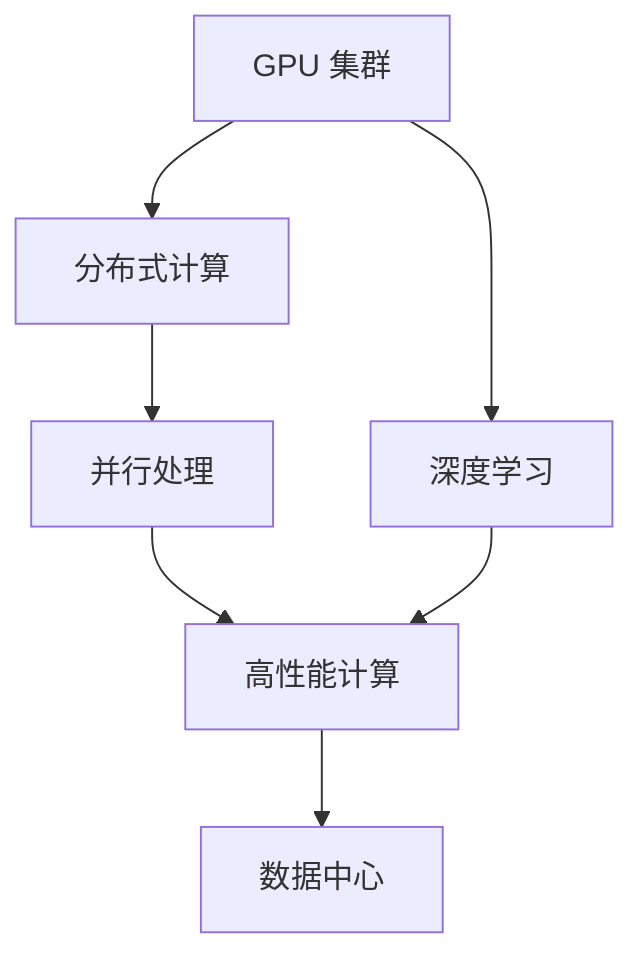

                 

# GPU 集群和分布式计算

> 关键词：GPU 集群, 分布式计算, 并行处理, 深度学习, 高性能计算, 大数据, 数据中心

## 1. 背景介绍

在现代高性能计算领域，随着数据规模和计算复杂度的不断增加，单台机器已经无法满足计算需求。分布式计算和GPU集群技术的出现，为大规模数据处理和深度学习任务提供了高效、可扩展的解决方案。特别是在深度学习领域，GPU集群技术已经成为不可或缺的重要工具。

### 1.1 分布式计算的发展

分布式计算是指通过多个计算节点的协同工作，实现对大规模计算任务的并行处理。从最早的批处理系统如Hadoop，到目前主流的分布式深度学习框架如TensorFlow和PyTorch，分布式计算技术已经广泛应用于数据处理、机器学习、科学计算等多个领域。

### 1.2 GPU 集群技术的应用

GPU 集群（Graphics Processing Unit Cluster）技术基于GPU的并行计算能力，通过将计算任务分解成多个子任务，分配给多个GPU节点并行处理，显著提升了计算效率和性能。GPU集群在深度学习、数据科学、科学计算等领域得到了广泛应用，是现代高性能计算的核心技术之一。

## 2. 核心概念与联系

### 2.1 核心概念概述

为更好地理解GPU集群和分布式计算，本节将介绍几个关键概念：

- GPU 集群（GPU Cluster）：由多个GPU节点组成的计算集群，能够实现高效并行计算。
- 分布式计算（Distributed Computing）：将计算任务分散到多个计算节点上并行处理，以实现大规模计算任务的高效执行。
- 并行处理（Parallel Processing）：将计算任务分解为多个子任务，并行处理以提升计算速度。
- 深度学习（Deep Learning）：基于多层神经网络结构的机器学习技术，需要大规模计算资源支持。
- 高性能计算（High-Performance Computing, HPC）：涉及高性能计算硬件和软件架构，支持复杂科学计算任务。
- 数据中心（Data Center）：由多个计算节点组成的中心化设施，用于大规模数据处理和存储。

这些概念之间通过如下Mermaid流程图展示了它们之间的关系：



该图展示了GPU集群、分布式计算、并行处理、深度学习、高性能计算和数据中心之间的关系，并指出了GPU集群在深度学习和分布式计算中的关键作用。

## 3. 核心算法原理 & 具体操作步骤
### 3.1 算法原理概述

GPU集群和分布式计算的算法原理基于并行处理和任务调度。具体来说，分布式计算系统将大规模计算任务分解为多个子任务，分配给多个计算节点并行处理，并通过任务调度和数据同步机制，确保各个节点协同工作，最终得到计算结果。

在GPU集群中，每个节点包含多个GPU设备，能够实现高度并行化的计算。GPU集群通过优化任务调度和数据传输，使数据在不同节点之间高效传输，避免瓶颈，从而实现计算任务的加速。

### 3.2 算法步骤详解

GPU集群和分布式计算的核心步骤包括任务分解、节点调度、数据传输和结果聚合。以下是对这些步骤的详细说明：

**Step 1: 任务分解**
将大规模计算任务分解为多个子任务。子任务的大小和类型应根据GPU集群的具体配置进行调整，以充分利用集群资源，避免资源浪费。

**Step 2: 节点调度**
根据任务的计算需求和节点资源分配，动态调整任务的调度策略，将任务分配给最合适的计算节点。调度算法可以基于节点资源利用率、任务执行时间等因素进行优化。

**Step 3: 数据传输**
在任务执行过程中，计算节点之间需要进行大量的数据传输。为了提高数据传输效率，可以使用高效的数据传输协议（如Gloo、MPI等），并通过数据缓存和异步传输等技术，减少数据传输的开销。

**Step 4: 结果聚合**
每个计算节点完成任务后，需要将结果汇总，并返回给主节点。结果聚合过程应尽可能减少数据传输量，以降低通信开销。

### 3.3 算法优缺点

分布式计算和GPU集群技术的优点包括：
1. 高效并行计算：通过多节点协同处理，显著提升计算效率。
2. 高扩展性：能够轻松扩展计算资源，适应不同规模的计算任务。
3. 高容错性：单个节点故障不会影响整体系统的正常运行。
4. 灵活性：支持多种计算模型和编程框架，如TensorFlow、PyTorch等。

同时，这些技术也存在一些缺点：
1. 系统复杂性高：分布式系统需要考虑节点调度、数据同步、容错处理等问题，设计和运维复杂度较高。
2. 通信开销大：数据传输和节点通信会产生额外的开销，可能影响系统性能。
3. 资源利用率低：小任务和资源利用率低的节点可能导致资源浪费。

### 3.4 算法应用领域

分布式计算和GPU集群技术在多个领域得到了广泛应用，以下是几个典型的应用场景：

- **深度学习**：深度学习模型需要大量计算资源进行训练和推理，GPU集群能够提供高效的并行计算能力。
- **大数据处理**：大规模数据集的处理和分析需要高效并行的计算能力，分布式计算系统能够轻松处理。
- **科学计算**：复杂的科学计算任务需要高性能计算资源，GPU集群提供了强大的计算能力支持。
- **云计算**：云计算平台如AWS、Google Cloud等都采用了分布式计算和GPU集群技术，支持大规模计算任务。

## 4. 数学模型和公式 & 详细讲解 & 举例说明

### 4.1 数学模型构建

在分布式计算和GPU集群中，数据分割和任务调度的过程可以通过数学模型进行建模。以TensorFlow分布式训练为例，假设有一个深度学习模型 $M_{\theta}$，其中 $\theta$ 为模型参数。将数据集 $D=\{(x_i, y_i)\}_{i=1}^N$ 分割为 $m$ 个子数据集 $D_1, D_2, \ldots, D_m$，每个子数据集 $D_j$ 分配给一个计算节点。假设每个计算节点包含 $n_j$ 个GPU设备，则整个GPU集群的计算能力可以表示为：

$$
C_{\text{GPU}} = \sum_{j=1}^m n_j C_{\text{GPU}}^j
$$

其中 $C_{\text{GPU}}^j$ 表示第 $j$ 个节点的计算能力。

### 4.2 公式推导过程

假设深度学习模型的训练时间为 $T_{\text{train}}$，单个节点的训练时间为 $T_{\text{train}}^j$。则整个GPU集群的训练时间 $T_{\text{train}}^{\text{GPU}}$ 可以表示为：

$$
T_{\text{train}}^{\text{GPU}} = \sum_{j=1}^m \frac{n_j T_{\text{train}}^j}{C_{\text{GPU}}}
$$

为了优化训练时间，需要合理分配数据和任务，使得每个节点的计算负载均衡。假设每个子数据集的大小为 $S_i$，则每个节点的训练时间可以表示为：

$$
T_{\text{train}}^j = \frac{1}{n_j} \sum_{i=1}^N S_i
$$

将上式代入 $T_{\text{train}}^{\text{GPU}}$ 的公式中，可以进一步推导出整个GPU集群的训练时间：

$$
T_{\text{train}}^{\text{GPU}} = \frac{1}{C_{\text{GPU}}} \sum_{i=1}^N S_i
$$

即整个GPU集群的训练时间与单节点训练时间无关，仅与数据集大小和GPU集群计算能力有关。

### 4.3 案例分析与讲解

以下以一个简单的示例来说明GPU集群和分布式计算的实际应用。假设有一个包含100个训练样本的深度学习模型，需要将其训练时间从30分钟降低到10分钟。

**Step 1: 任务分解**
将100个训练样本分割为5个子数据集，每个子数据集包含20个样本。

**Step 2: 节点调度**
分配5个计算节点，每个节点包含4个GPU设备，则整个GPU集群的计算能力为 $5 \times 4 = 20$ GPU设备。

**Step 3: 数据传输**
每个节点接收20个样本，每个样本大小为1MB。则每个节点需要传输的数据量为 $20 \times 1MB = 20MB$。

**Step 4: 结果聚合**
每个节点处理完20个样本后，需要将结果汇总。假设每个节点的处理速度为1MB/s，则每个节点的处理时间为20MB / 1MB/s = 20s。因此，整个GPU集群的处理时间为 $20 \times 5 = 100s$。

## 5. 项目实践：代码实例和详细解释说明

### 5.1 开发环境搭建

在开始实际项目之前，需要准备和配置GPU集群和分布式计算的环境。以下是常用的开发环境搭建步骤：

1. **选择分布式计算框架**：TensorFlow、PyTorch、Spark等框架支持分布式计算，选择适合的项目框架。
2. **安装分布式计算工具**：安装Gloo、MPI等分布式计算工具，用于节点间通信和数据传输。
3. **安装GPU驱动和CUDA**：在计算节点上安装GPU驱动和CUDA，支持GPU并行计算。
4. **配置集群管理工具**：安装Kubernetes、Mesos等集群管理工具，用于节点调度和管理。
5. **设置数据存储和访问**：配置数据存储和访问方式，如使用Hadoop、S3等云存储服务。

### 5.2 源代码详细实现

以下是一个使用TensorFlow进行分布式训练的示例代码：

```python
import tensorflow as tf
import tensorflow_datasets as tfds

# 加载数据集
train_dataset, test_dataset = tfds.load('mnist', split=['train', 'test'], as_supervised=True)

# 定义模型
model = tf.keras.Sequential([
    tf.keras.layers.Flatten(input_shape=(28, 28)),
    tf.keras.layers.Dense(128, activation='relu'),
    tf.keras.layers.Dense(10)
])

# 定义分布式策略
strategy = tf.distribute.MirroredStrategy()

# 在分布式环境中进行训练
with strategy.scope():
    model.compile(optimizer=tf.keras.optimizers.Adam(learning_rate=0.001),
                  loss=tf.keras.losses.SparseCategoricalCrossentropy(from_logits=True),
                  metrics=[tf.keras.metrics.SparseCategoricalAccuracy()])

    model.fit(train_dataset.batch(32),
              validation_data=test_dataset.batch(32),
              epochs=10)

# 在分布式环境中进行推理
predictions = model.predict(test_dataset.batch(32))
```

在上述代码中，使用了TensorFlow的`tf.distribute.MirroredStrategy`实现分布式训练。将训练数据集和测试数据集分别批量为32，然后在分布式环境中进行训练和推理。

### 5.3 代码解读与分析

在上述代码中，`tf.distribute.MirroredStrategy`用于将计算任务分配给多个GPU节点并行处理。`model.compile`和`model.fit`方法在分布式环境中进行训练，自动优化资源分配和数据传输。在分布式环境中进行推理时，`predict`方法返回每个节点的预测结果，并使用`tf.gather`方法将其汇总。

## 6. 实际应用场景

### 6.1 数据中心管理

数据中心是企业处理大规模数据和计算任务的核心设施。GPU集群和分布式计算技术在大数据中心中得到了广泛应用，用于提高数据处理和计算效率。

**应用场景**：
- 数据存储和备份：使用分布式文件系统（如Hadoop、Ceph等）存储海量数据，提高数据访问速度和容错能力。
- 数据分析和处理：使用分布式计算框架（如Spark、Flink等）处理大规模数据集，支持大数据分析任务。
- 云计算服务：构建云平台，提供GPU计算资源和分布式计算服务，支持各种计算任务。

### 6.2 深度学习研究

深度学习模型需要大量计算资源进行训练和推理，GPU集群和分布式计算技术是深度学习研究的重要工具。

**应用场景**：
- 大规模模型训练：使用GPU集群加速深度学习模型的训练过程，提高模型精度和效率。
- 模型推理和部署：使用分布式计算框架部署深度学习模型，支持大规模推理任务。
- 模型优化和调优：通过分布式训练和调优工具，优化深度学习模型的性能。

### 6.3 科学研究计算

科学研究计算需要高性能计算资源支持，GPU集群和分布式计算技术提供了强大的计算能力。

**应用场景**：
- 分子动力学模拟：使用GPU集群加速分子动力学模拟计算，研究生物分子结构和功能。
- 气候模型模拟：使用分布式计算框架模拟气候变化，支持气候科学研究。
- 天体物理模拟：使用GPU集群模拟天体物理过程，研究宇宙结构和演化。

## 7. 工具和资源推荐

### 7.1 学习资源推荐

为了帮助开发者掌握GPU集群和分布式计算技术，以下是一些优秀的学习资源：

1. **《分布式系统设计与实现》**：详细讲解分布式系统设计原理和实现技术，适合初学者入门。
2. **《TensorFlow分布式计算教程》**：TensorFlow官方提供的分布式计算教程，涵盖GPU集群和分布式计算的实战案例。
3. **《Spark编程实战》**：详细讲解Spark框架的分布式计算原理和应用实践，适合Spark用户。
4. **《高性能计算与GPU加速》**：讲解GPU集群和分布式计算技术的实际应用案例，适合实际项目开发。

### 7.2 开发工具推荐

以下是一些常用的GPU集群和分布式计算开发工具：

1. **TensorFlow**：支持分布式计算和GPU加速，是深度学习领域的核心工具。
2. **PyTorch**：支持分布式计算和GPU加速，具有良好的灵活性和易用性。
3. **Spark**：支持分布式计算和大数据处理，是数据科学领域的核心工具。
4. **MPI**：支持消息传递接口，实现节点间通信和数据传输，是分布式计算的标准接口。
5. **Gloo**：支持高性能通信协议，支持分布式计算和GPU集群中的数据传输。

### 7.3 相关论文推荐

以下是几篇关于GPU集群和分布式计算的经典论文，值得深入研究：

1. **《A Survey of Distributed Deep Learning》**：综述了分布式深度学习的研究现状和应用实践，适合深度学习开发者。
2. **《GPU-Accelerated Machine Learning with TensorFlow》**：讲解了使用TensorFlow进行GPU加速和分布式计算的技术细节，适合TensorFlow用户。
3. **《Efficient Distributed Deep Learning using Data-Parallelism》**：介绍了分布式深度学习的原理和实现方法，适合深度学习研究者。
4. **《Distributed Deep Learning in Practice》**：介绍分布式深度学习的实际应用案例，适合实际项目开发者。

## 8. 总结：未来发展趋势与挑战

### 8.1 研究成果总结

GPU集群和分布式计算技术在深度学习、大数据处理、科学研究计算等领域得到了广泛应用。通过分布式计算和GPU集群技术，大规模计算任务能够高效、可靠地处理，加速了科学研究和工程应用的进程。

### 8.2 未来发展趋势

未来，分布式计算和GPU集群技术将呈现以下几个发展趋势：

1. **边缘计算**：将计算任务分布到边缘设备（如物联网设备）上进行处理，提高计算效率和数据传输速度。
2. **云计算和混合云**：云计算平台将提供更强大的GPU计算资源和分布式计算能力，支持大规模计算任务。
3. **人工智能与物联网融合**：将分布式计算和GPU集群技术应用于物联网设备，实现边缘计算和智能应用。
4. **量子计算与分布式计算结合**：结合量子计算和分布式计算技术，加速解决复杂计算问题。

### 8.3 面临的挑战

尽管GPU集群和分布式计算技术已经取得了重要进展，但在实际应用中仍然面临一些挑战：

1. **系统复杂性高**：分布式计算和GPU集群系统的设计和运维复杂度较高，需要专业的知识和技能。
2. **资源利用率低**：小任务和资源利用率低的节点可能导致资源浪费，需要优化任务调度算法。
3. **通信开销大**：节点间通信和数据传输会产生额外的开销，需要优化通信协议和数据传输技术。

### 8.4 研究展望

为了解决以上挑战，未来的研究需要在以下几个方面进行深入探索：

1. **分布式计算优化**：开发更高效的分布式计算框架和算法，优化任务调度和数据传输。
2. **GPU集群优化**：优化GPU集群中的节点管理、资源分配和容错机制，提高资源利用率。
3. **通信协议优化**：开发更高效的通信协议，减少节点间通信的开销，提高计算效率。
4. **边缘计算技术**：研究边缘计算技术，实现数据处理和计算任务在边缘设备上的高效执行。

## 9. 附录：常见问题与解答

**Q1: 分布式计算和GPU集群与单台机器相比，有哪些优势？**

A: 分布式计算和GPU集群与单台机器相比，具有以下优势：
1. **计算效率高**：多个计算节点并行处理，能够显著提高计算效率。
2. **可扩展性强**：能够轻松扩展计算资源，适应不同规模的计算任务。
3. **容错性好**：单个节点故障不会影响整体系统的正常运行，提高系统的可靠性和稳定性。

**Q2: 分布式计算和GPU集群中，如何选择计算节点和节点之间的通信协议？**

A: 在选择计算节点和节点之间的通信协议时，需要考虑以下因素：
1. **节点配置**：根据任务需求和计算节点配置选择合适的节点数量和配置。
2. **通信协议**：选择合适的通信协议（如MPI、Gloo等），根据网络环境和节点特性优化通信协议参数。
3. **负载均衡**：使用负载均衡算法（如Round-Robin、Consistent Hashing等）优化任务调度和数据传输。

**Q3: 分布式计算和GPU集群中，如何优化任务调度和数据传输？**

A: 优化任务调度和数据传输可以采取以下措施：
1. **任务分解**：将计算任务分解为多个子任务，分配给多个计算节点并行处理。
2. **节点调度**：使用负载均衡算法优化任务调度和资源分配，避免资源浪费。
3. **数据传输**：使用高效的数据传输协议（如Gloo、MPI等），减少数据传输的开销。
4. **数据缓存**：使用数据缓存技术（如CPU缓存、GPU缓存等），减少数据传输时间和网络带宽。

**Q4: 分布式计算和GPU集群中，如何进行模型训练和调优？**

A: 在分布式计算和GPU集群中进行模型训练和调优时，可以采取以下措施：
1. **分布式训练**：使用TensorFlow、PyTorch等分布式计算框架，实现模型的分布式训练。
2. **超参数调优**：使用超参数调优技术（如随机搜索、网格搜索等），优化模型超参数。
3. **模型压缩**：使用模型压缩技术（如剪枝、量化等），减少模型参数和计算资源消耗。
4. **模型优化**：使用模型优化技术（如梯度累积、混合精度训练等），提高计算效率和精度。

**Q5: 分布式计算和GPU集群中，如何确保数据安全和隐私保护？**

A: 在分布式计算和GPU集群中，确保数据安全和隐私保护可以采取以下措施：
1. **数据加密**：使用数据加密技术保护数据传输和存储，防止数据泄露。
2. **访问控制**：使用访问控制技术（如RBAC、ACL等），限制对数据和计算资源的访问权限。
3. **数据匿名化**：使用数据匿名化技术，保护用户隐私，防止数据泄露。
4. **数据备份和恢复**：使用数据备份和恢复技术，防止数据丢失和损坏。

---

作者：禅与计算机程序设计艺术 / Zen and the Art of Computer Programming

