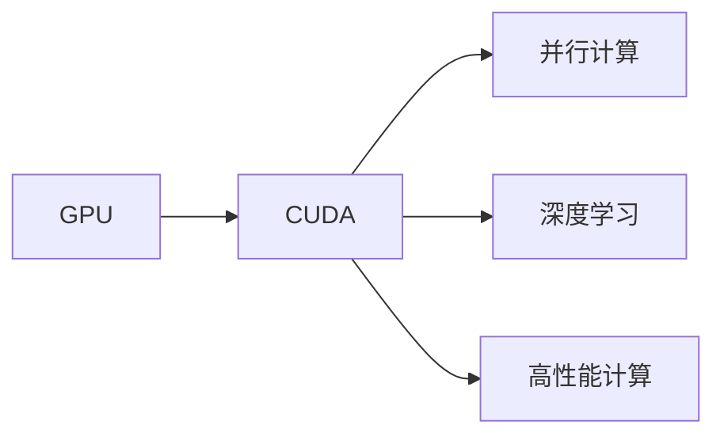

                 

# GPU编程：CUDA基础与实践

> 关键词：GPU编程, CUDA, 并行计算, 深度学习, 高性能计算, 计算密集型任务

## 1. 背景介绍

在现代计算密集型任务中，GPU（图形处理单元）以其强大的并行计算能力著称。尤其是在深度学习和高性能计算领域，GPU已成为不可或缺的重要工具。为了更好地利用GPU的并行性能，NVIDIA于2007年推出了CUDA（Compute Unified Device Architecture）编程模型，极大地简化了GPU编程。

CUDA作为GPU编程的利器，让开发者能够充分利用NVIDIA的计算资源，进行高效、并行的计算任务。无论是在学术研究，还是在工业应用中，CUDA都展现出了其独特的优势。近年来，随着深度学习应用的不断扩大，CUDA在深度学习模型训练、推理、图像处理等方面得到广泛应用。

本文将详细介绍CUDA基础与实践，帮助读者理解GPU编程的原理，并掌握CUDA编程技巧。

## 2. 核心概念与联系

### 2.1 核心概念概述

为更好地理解CUDA编程，需要掌握以下核心概念：

- **GPU**：图形处理单元，具有大量并行计算核心，用于加速计算密集型任务。

- **CUDA**：NVIDIA开发的GPU编程模型，提供C++语言接口，实现GPU的并行编程。

- **并行计算**：利用多个计算核心同时处理同一任务的不同部分，提高计算效率。

- **深度学习**：一种基于神经网络的学习模型，通过多层神经元构建深度结构，实现复杂特征的提取和处理。

- **高性能计算**：通过优化计算过程，实现高效、快速的数据处理和计算。

这些概念之间有着紧密的联系：GPU提供了并行计算的核心硬件，CUDA提供了GPU编程的接口和语言支持，而并行计算、深度学习和高性能计算都是基于GPU的计算范式。

### 2.2 核心概念原理和架构的 Mermaid 流程图



## 3. 核心算法原理 & 具体操作步骤

### 3.1 算法原理概述

CUDA编程基于GPU的并行架构，将计算任务分解成多个小任务，每个小任务由一个计算核心并行处理，从而实现并行计算。GPU通常包含多个处理器核心，每个处理器核心可以独立执行计算任务。CUDA通过将计算任务映射到GPU的处理器核心上，实现高效的并行计算。

CUDA编程的核心在于数据和计算任务的并行化处理。数据并行将数据分成多个部分，每个部分由不同的处理器核心并行处理。任务并行将计算任务分解成多个小任务，每个小任务由不同的处理器核心并行执行。

### 3.2 算法步骤详解

CUDA编程主要包括以下几个关键步骤：

1. **环境配置**：安装CUDA Toolkit、CUDA Compiler和CUDA运行时库，配置环境变量。
2. **编写CUDA代码**：编写CUDA内核函数，定义计算逻辑。
3. **编译和调试**：使用CUDA Compiler编译CUDA代码，使用NVIDIA Debugger调试程序。
4. **性能优化**：优化程序性能，减少内存访问、数据传输等开销。
5. **性能测试**：使用性能测试工具，评估程序的性能表现。

### 3.3 算法优缺点

CUDA编程的优点包括：

- **高性能**：利用GPU并行计算能力，加速计算密集型任务。
- **高效性**：支持浮点运算和整数运算，适合处理复杂的数据结构和算法。
- **灵活性**：支持多种编程语言，易于与其他编程语言进行整合。

CUDA编程的缺点包括：

- **复杂性**：需要掌握GPU编程、并行计算、CUDA语言等多方面知识。
- **性能瓶颈**：内存带宽、访存延迟等因素可能成为性能瓶颈，需要优化程序设计。
- **学习曲线陡峭**：初学者可能面临较高的学习门槛，需要一定的编程经验和算法基础。

### 3.4 算法应用领域

CUDA编程广泛应用于以下领域：

- **深度学习**：训练深度学习模型，加速模型推理和优化。
- **高性能计算**：处理科学计算、数据分析、密码学等领域的大规模计算任务。
- **计算机视觉**：处理图像和视频数据，加速特征提取和图像处理。
- **游戏开发**：进行实时渲染和物理模拟，提升游戏性能和视觉效果。
- **自动驾驶**：处理传感器数据，加速实时决策和控制。

## 4. 数学模型和公式 & 详细讲解 & 举例说明

### 4.1 数学模型构建

CUDA编程通常涉及大量数值计算和浮点数运算，需要构建数学模型来描述计算任务。以下是一个简单的矩阵乘法（Matrix Multiplication）的数学模型：

设矩阵 $A$ 和 $B$ 的维数为 $m \times n$ 和 $n \times p$，则矩阵乘法 $C = AB$ 的计算公式为：

$$
C_{ij} = \sum_{k=1}^n A_{ik} B_{kj}
$$

### 4.2 公式推导过程

矩阵乘法公式的推导过程如下：

设 $A = \begin{bmatrix} a_{11} & a_{12} & \cdots & a_{1n} \\ a_{21} & a_{22} & \cdots & a_{2n} \\ \vdots & \vdots & \ddots & \vdots \\ a_{m1} & a_{m2} & \cdots & a_{mn} \end{bmatrix}$，$B = \begin{bmatrix} b_{11} & b_{12} & \cdots & b_{1p} \\ b_{21} & b_{22} & \cdots & b_{2p} \\ \vdots & \vdots & \ddots & \vdots \\ b_{n1} & b_{n2} & \cdots & b_{np} \end{bmatrix}$，则矩阵乘法 $C = AB$ 的计算公式为：

$$
C_{ij} = \sum_{k=1}^n A_{ik} B_{kj}
$$

将公式代入矩阵 $A$ 和 $B$ 的具体元素，得到矩阵乘法的具体计算过程。

### 4.3 案例分析与讲解

以下是一个使用CUDA进行矩阵乘法的示例代码：

```python
import numpy as np
import cv2
import pycuda.driver as cuda
import pycuda.autoinit

def matmul(A, B):
    m, n, p = A.shape[0], A.shape[1], B.shape[1]
    C = np.zeros((m, p), dtype=float)

    # 定义GPU计算函数
    def matmul_kernel(d_A, d_B, d_C):
        for i in range(m):
            for j in range(p):
                for k in range(n):
                    C[i][j] += d_A[i][k] * d_B[k][j]

    # 分配内存
    d_A = cuda.mem_alloc(A.nbytes)
    d_B = cuda.mem_alloc(B.nbytes)
    d_C = cuda.mem_alloc(C.nbytes)

    # 拷贝数据到GPU
    cuda.memcpy_htod(d_A, A)
    cuda.memcpy_htod(d_B, B)

    # 执行计算
    cuda.memcpy_htod(d_C, C)
    matmul_kernel<<<1, 1>>>(d_A, d_B, d_C)
    cuda.driver.DeviceSynchronize()

    # 拷贝结果到CPU
    C = np.empty(C.shape, dtype=float)
    cuda.memcpy_dtoh(C, d_C)

    return C
```

上述代码定义了矩阵乘法的GPU计算函数，通过将数据分配到GPU内存中，并在GPU上执行计算，最终将结果拷贝回CPU，完成矩阵乘法的计算。

## 5. 项目实践：代码实例和详细解释说明

### 5.1 开发环境搭建

1. 安装CUDA Toolkit和CUDA Compiler。
2. 安装CUDA运行时库。
3. 配置环境变量，如CUDA_HOME、LD_LIBRARY_PATH等。

### 5.2 源代码详细实现

以下是一个使用CUDA进行矩阵乘法的示例代码：

```python
import numpy as np
import cv2
import pycuda.driver as cuda
import pycuda.autoinit

def matmul(A, B):
    m, n, p = A.shape[0], A.shape[1], B.shape[1]
    C = np.zeros((m, p), dtype=float)

    # 定义GPU计算函数
    def matmul_kernel(d_A, d_B, d_C):
        for i in range(m):
            for j in range(p):
                for k in range(n):
                    C[i][j] += d_A[i][k] * d_B[k][j]

    # 分配内存
    d_A = cuda.mem_alloc(A.nbytes)
    d_B = cuda.mem_alloc(B.nbytes)
    d_C = cuda.mem_alloc(C.nbytes)

    # 拷贝数据到GPU
    cuda.memcpy_htod(d_A, A)
    cuda.memcpy_htod(d_B, B)

    # 执行计算
    cuda.memcpy_htod(d_C, C)
    matmul_kernel<<<1, 1>>>(d_A, d_B, d_C)
    cuda.driver.DeviceSynchronize()

    # 拷贝结果到CPU
    C = np.empty(C.shape, dtype=float)
    cuda.memcpy_dtoh(C, d_C)

    return C
```

上述代码定义了矩阵乘法的GPU计算函数，通过将数据分配到GPU内存中，并在GPU上执行计算，最终将结果拷贝回CPU，完成矩阵乘法的计算。

### 5.3 代码解读与分析

上述代码主要包含以下几个关键步骤：

1. 分配GPU内存。使用 `cuda.mem_alloc` 函数分配GPU内存，确保数据能够正确地存储到GPU上。
2. 拷贝数据到GPU。使用 `cuda.memcpy_htod` 函数将数据从CPU拷贝到GPU。
3. 执行计算。在GPU上执行计算函数，完成矩阵乘法的计算。
4. 拷贝结果到CPU。使用 `cuda.memcpy_dtoh` 函数将计算结果从GPU拷贝回CPU。

这些步骤确保了数据的正确存储、计算和传输，实现了高效的矩阵乘法计算。

### 5.4 运行结果展示

运行上述代码，输出结果为矩阵乘法的结果，与CPU计算结果进行比较，验证GPU计算的正确性和高效性。

## 6. 实际应用场景

### 6.1 加速深度学习模型训练

深度学习模型的训练需要大量计算资源，CUDA编程可以显著加速模型训练过程。在深度学习框架如TensorFlow、PyTorch中，可以使用CUDA加速模型的前向传播和反向传播，提升训练效率。

### 6.2 实时图像处理

图像处理任务通常需要大量计算，CUDA编程可以加速图像处理的计算过程，实现实时渲染和处理。在计算机视觉领域，使用CUDA进行图像特征提取、目标检测等任务，可以提升处理速度和效率。

### 6.3 高性能计算

CUDA编程可以处理科学计算、数据分析等计算密集型任务。例如，在气象模拟、金融模拟等领域，使用CUDA进行大规模计算，可以提升计算效率和数据处理能力。

### 6.4 游戏开发

游戏开发需要大量图形渲染和物理模拟计算，CUDA编程可以加速游戏引擎的计算任务，提升游戏性能和视觉效果。在实时渲染、碰撞检测等任务中，使用CUDA进行加速计算，可以提升游戏的流畅性和响应速度。

## 7. 工具和资源推荐

### 7.1 学习资源推荐

- **《CUDA编程实战》**：详细介绍了CUDA编程的各个方面，包括环境配置、编程技巧、性能优化等。
- **NVIDIA CUDA documentation**：官方文档提供了CUDA编程的详细介绍和示例代码，是学习CUDA编程的重要资源。
- **Coursera《GPU Programming with CUDA》课程**：由斯坦福大学开设的课程，提供系统的CUDA编程学习内容，包括数据并行、任务并行、优化技巧等。

### 7.2 开发工具推荐

- **Visual Studio**：支持CUDA编程的环境，提供调试、性能分析等工具。
- **PyTorch**：深度学习框架，支持CUDA加速，提供了丰富的深度学习算法和模型。
- **NVIDIA Visual Profiler**：性能分析工具，用于分析和优化CUDA程序的性能。

### 7.3 相关论文推荐

- **《CUDA Programming: A Guide to GPU Computing》**：详细介绍了CUDA编程的各个方面，包括环境配置、编程技巧、性能优化等。
- **《Parallel Computing with CUDA》**：介绍CUDA编程的并行计算技巧和优化方法，适用于深度学习和高性能计算领域。
- **《Accelerating Deep Learning with CUDA》**：讨论了如何使用CUDA加速深度学习模型的训练和推理过程。

## 8. 总结：未来发展趋势与挑战

### 8.1 研究成果总结

CUDA编程技术已经广泛应用于深度学习、高性能计算、图像处理等领域，取得了显著的性能提升。其核心在于充分利用GPU的并行计算能力，加速计算密集型任务的计算过程。

### 8.2 未来发展趋势

未来，CUDA编程技术将继续发展，主要趋势包括：

1. **深度学习优化**：进一步优化深度学习模型的训练和推理过程，提高计算效率和模型性能。
2. **多GPU并行**：通过多GPU并行计算，提升计算效率和数据处理能力。
3. **混合编程**：结合CPU和GPU编程，实现更高效的计算和数据处理。
4. **自动调优**：使用自动调优工具，优化程序的性能表现，降低编程复杂度。
5. **新兴应用**：随着AI技术的不断扩展，CUDA编程将应用于更多新兴领域，如自动驾驶、智慧城市等。

### 8.3 面临的挑战

CUDA编程技术虽然具备诸多优势，但也面临一些挑战：

1. **学习门槛高**：CUDA编程需要掌握GPU编程、并行计算、CUDA语言等多方面知识，初学者可能面临较高的学习门槛。
2. **性能瓶颈**：内存带宽、访存延迟等因素可能成为性能瓶颈，需要优化程序设计。
3. **平台兼容性**：不同平台和硬件可能存在兼容性问题，需要开发者进行调试和优化。
4. **工具和库支持**：虽然CUDA提供了丰富的开发工具和库，但在某些特定任务和领域可能缺乏支持，需要开发者自行开发和调试。

### 8.4 研究展望

未来的CUDA编程技术需要从以下几个方面进行探索和突破：

1. **混合编程**：结合CPU和GPU编程，实现更高效的计算和数据处理。
2. **自动调优**：使用自动调优工具，优化程序的性能表现，降低编程复杂度。
3. **新兴应用**：随着AI技术的不断扩展，CUDA编程将应用于更多新兴领域，如自动驾驶、智慧城市等。
4. **跨平台支持**：实现跨平台、跨硬件的CUDA编程支持，提升开发灵活性和兼容性。

总之，CUDA编程技术在深度学习、高性能计算、图像处理等领域展现出强大的优势，未来有望进一步发展和优化，为AI技术的进步提供更强大的计算支持。

## 9. 附录：常见问题与解答

**Q1：CUDA编程的学习门槛高吗？**

A: 是的，CUDA编程需要掌握GPU编程、并行计算、CUDA语言等多方面知识，初学者可能面临较高的学习门槛。建议从基础的CUDA编程入门书籍和在线课程开始学习，逐步掌握CUDA编程技巧。

**Q2：如何优化CUDA程序的性能？**

A: 优化CUDA程序性能可以从以下几个方面入手：
1. 数据并行优化：将数据分配到多个线程块中，实现并行计算。
2. 任务并行优化：将计算任务分配到多个线程块中，提高计算效率。
3. 内存优化：减少内存访问和数据传输，提升数据处理速度。
4. 硬件优化：选择合适的GPU硬件，提高计算能力和带宽。

**Q3：如何使用CUDA进行深度学习模型训练？**

A: 使用CUDA进行深度学习模型训练，主要涉及以下步骤：
1. 准备数据集：将数据集加载到GPU内存中。
2. 定义模型：使用深度学习框架如TensorFlow、PyTorch，定义模型结构。
3. 配置环境：安装CUDA Toolkit和CUDA Compiler，配置环境变量。
4. 编写代码：使用CUDA编程语言，实现模型的前向传播和反向传播。
5. 训练模型：在GPU上执行模型训练，使用CUDA加速计算。

**Q4：CUDA编程是否适用于跨平台开发？**

A: 是的，CUDA编程可以适用于跨平台开发。不同平台和硬件可能存在兼容性问题，需要使用相应的CUDA Toolkit和CUDA Compiler进行调试和优化。同时，使用跨平台的深度学习框架如TensorFlow、PyTorch，可以实现跨平台支持。

总之，CUDA编程技术在深度学习、高性能计算、图像处理等领域展现出强大的优势，未来有望进一步发展和优化，为AI技术的进步提供更强大的计算支持。

---

作者：禅与计算机程序设计艺术 / Zen and the Art of Computer Programming

