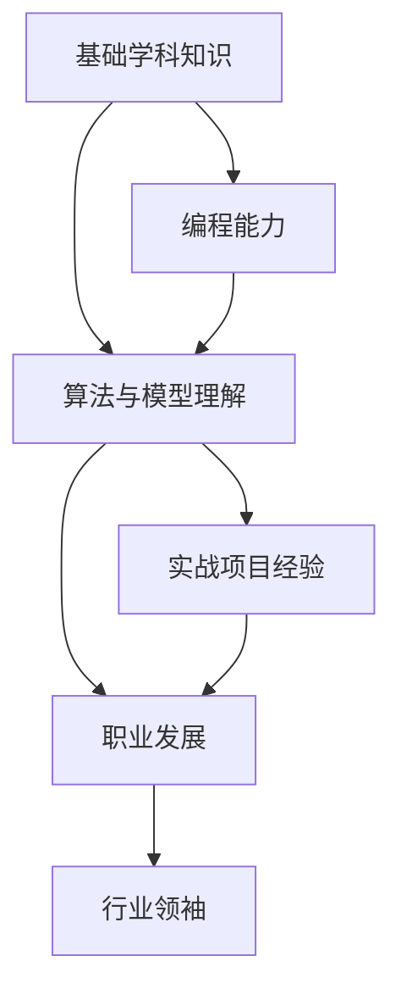

                 

# Google的AI人才培养体系:学习路径和职业发展

> 关键词：Google, AI人才, 人才培养, 职业发展, 学习路径, 技能提升, 行业领袖

## 1. 背景介绍

### 1.1 问题由来

近年来，人工智能（AI）已成为科技行业的重要引擎，Google等技术巨头都在积极布局AI技术。然而，面对AI领域庞大而复杂的知识体系，如何培养出具备创新能力、技术功底扎实的AI人才，成为一个亟待解决的问题。Google作为全球AI领域的先锋，其AI人才培养体系在业界享有盛誉，被广泛借鉴。

### 1.2 问题核心关键点

Google的AI人才培养体系注重从多个层面来培养AI人才，包括基础学科知识、编程能力、算法与模型理解、实战项目经验以及职业发展等多方面的内容。本文将详细介绍Google的AI人才培养体系，从学习路径、职业发展和实际应用三个角度，深入剖析其核心机制。

## 2. 核心概念与联系

### 2.1 核心概念概述

Google的AI人才培养体系围绕以下几个核心概念展开：

- **基础学科知识**：包括计算机科学、数学、统计学等基础学科，为AI人才提供坚实的理论支撑。
- **编程能力**：强调Python、C++等编程语言的熟练运用，以及机器学习库（如TensorFlow、PyTorch）的掌握。
- **算法与模型理解**：深入学习各种经典和前沿的算法（如回归分析、分类、聚类、深度学习等）和模型（如神经网络、卷积神经网络、Transformer等）。
- **实战项目经验**：通过实践项目，将理论知识应用于实际问题解决，提升解决复杂问题的能力。
- **职业发展**：包括行业认知、软技能培养、导师指导、职业规划等，助力AI人才在职业生涯中取得突破。

这些概念之间的联系可以通过以下Mermaid流程图来展示：



这个流程图展示了Google AI人才培养体系的基本结构：

1. 基础学科知识是AI人才的根基。
2. 编程能力是实践的工具。
3. 算法与模型理解是AI人才的核心技能。
4. 实战项目经验是技能的应用和提升。
5. 职业发展是实现个人成长和行业贡献的关键。

最终，具备以上能力的人才将成长为行业的技术领导者，推动AI技术的发展和应用。

## 3. 核心算法原理 & 具体操作步骤
### 3.1 算法原理概述

Google的AI人才培养体系基于基础学科知识、编程能力和算法与模型理解等核心概念，通过一系列系统化的课程和实践项目，逐步提升AI人才的综合能力。其核心算法原理如下：

1. **系统化课程设计**：将课程分为基础学科、编程技能、算法与模型理解和实战项目等多个阶段，确保学习内容全面且连贯。
2. **理论与实践相结合**：在理论学习的基础上，通过实战项目强化技能，增强解决实际问题的能力。
3. **持续反馈与优化**：通过定期的反馈机制，及时调整学习路径和教学内容，确保人才培养体系的动态优化。

### 3.2 算法步骤详解

Google的AI人才培养体系主要包括以下几个关键步骤：

**Step 1: 基础学科知识学习**

- **课程内容**：计算机科学、数学、统计学等基础学科，涵盖算法设计、数据结构、概率统计等基本概念。
- **教学模式**：线上线下结合，包括互动式课程、在线讲授和实验室实践。
- **学习目标**：打下坚实的理论基础，掌握核心算法和数据结构，培养逻辑思维和问题解决能力。

**Step 2: 编程能力培养**

- **课程内容**：Python、C++等编程语言，以及TensorFlow、PyTorch等机器学习库的运用。
- **教学模式**：编程练习、项目实战、代码评审。
- **学习目标**：熟练掌握编程技巧，能高效实现算法和模型，具备独立开发能力。

**Step 3: 算法与模型理解**

- **课程内容**：回归分析、分类、聚类、深度学习等经典和前沿算法，以及神经网络、卷积神经网络、Transformer等模型。
- **教学模式**：理论讲解、案例分析、项目实践。
- **学习目标**：深入理解各种算法和模型，掌握其应用场景和优缺点，具备创新能力。

**Step 4: 实战项目经验积累**

- **课程内容**：针对实际问题的项目设计，如图像识别、自然语言处理、推荐系统等。
- **教学模式**：团队协作、导师指导、项目评审。
- **学习目标**：在真实场景中应用所学知识，提升解决问题的能力，积累实战经验。

**Step 5: 职业发展指导**

- **课程内容**：行业认知、软技能培养、职业规划等。
- **教学模式**：一对一辅导、职业规划讲座、实习机会。
- **学习目标**：明确职业方向，提升软技能，获得行业洞察，规划职业发展路径。

### 3.3 算法优缺点

Google的AI人才培养体系具有以下优点：

1. **全面性**：涵盖基础学科、编程能力、算法与模型理解和实战项目等多个方面，培养全面人才。
2. **实践性强**：通过大量实践项目，强化学习者的实战能力，增强解决问题的能力。
3. **动态优化**：根据行业需求和最新技术进展，及时调整课程内容，保持体系的动态更新。

但同时也存在一些不足：

1. **学习周期长**：系统化的学习路径可能需要较长时间，不利于快速培养人才。
2. **资源投入大**：需要大量的师资力量和实验室设备支持，成本较高。
3. **个性化不足**：课程内容较为通用，可能无法完全适应每个学习者的特点和需求。

尽管存在这些局限性，Google的AI人才培养体系依然在业界享有盛誉，为AI人才的培养提供了坚实的基础。

### 3.4 算法应用领域

Google的AI人才培养体系广泛适用于多个领域，具体包括：

- **计算机科学**：涵盖算法设计、数据结构、操作系统等核心内容。
- **数学和统计学**：包括概率论、统计学基础、优化算法等。
- **编程技能**：强调Python、C++等语言的使用，以及TensorFlow、PyTorch等库的掌握。
- **深度学习和自然语言处理**：深入学习深度神经网络、Transformer等模型，以及自然语言处理中的文本分类、情感分析等任务。
- **人工智能应用**：涵盖图像识别、语音识别、推荐系统等多个方向的项目实战。

## 4. 数学模型和公式 & 详细讲解 & 举例说明

### 4.1 数学模型构建

Google的AI人才培养体系基于数学模型和算法构建的课程设计，主要包括以下几个方面：

- **回归分析模型**：用于预测和分析数据，公式为 $y=\beta_0+\beta_1x_1+\beta_2x_2+\cdots+\beta_nx_n+\epsilon$。
- **分类算法**：如逻辑回归、决策树、支持向量机等，用于分类问题，公式和算法流程需详细讲解。
- **聚类算法**：如K-Means、层次聚类等，用于数据分组和相似性分析，公式和算法流程需详细讲解。
- **深度学习模型**：如神经网络、卷积神经网络、Transformer等，用于处理复杂数据和任务，需详细讲解。

### 4.2 公式推导过程

以逻辑回归模型为例，其推导过程如下：

1. 首先，将数据表示为向量形式 $x=(x_1,x_2,\cdots,x_n)$，输出表示为 $y=(y_1,y_2,\cdots,y_m)$，其中 $x$ 为自变量，$y$ 为因变量。
2. 将输出表示为线性组合形式 $y=\beta_0+\beta_1x_1+\beta_2x_2+\cdots+\beta_nx_n$，其中 $\beta$ 为权重向量。
3. 引入 sigmoid 函数，将线性组合映射到 $[0,1]$ 范围内，即 $p(y=1|x;\beta)=\frac{1}{1+e^{-\beta^Tx}}$。
4. 利用最大似然估计方法，求解 $\beta$，即 $\hat{\beta}=(X^TX)^{-1}X^Ty$。
5. 最终，利用 $\hat{\beta}$ 计算预测值 $\hat{y}$，并将其与真实标签进行比较，计算误差。

### 4.3 案例分析与讲解

以图像识别项目为例，展示如何应用回归分析和深度学习模型：

1. **数据准备**：收集图像数据，并进行预处理，如数据增强、标准化等。
2. **模型选择**：选择适当的回归分析或深度学习模型，如卷积神经网络。
3. **模型训练**：使用训练数据集对模型进行训练，调整超参数以提高性能。
4. **模型评估**：在验证集上评估模型性能，选择最优模型。
5. **模型应用**：使用模型对新图像进行预测，评估识别准确率。

## 5. 项目实践：代码实例和详细解释说明
### 5.1 开发环境搭建

要进行Google的AI人才培养体系的实际项目实践，首先需要搭建好开发环境。以下是具体步骤：

1. **安装Python**：确保Python版本为3.6或以上，以便于使用TensorFlow、PyTorch等库。
2. **安装TensorFlow**：使用pip安装TensorFlow库，如 `pip install tensorflow`。
3. **安装PyTorch**：使用pip安装PyTorch库，如 `pip install torch torchvision torchaudio`。
4. **安装其他依赖库**：如numpy、scipy、scikit-learn等，如 `pip install numpy scipy scikit-learn`。
5. **设置虚拟环境**：创建虚拟环境，如 `conda create --name ai virtualenv`，并激活该环境，如 `conda activate ai`。

### 5.2 源代码详细实现

以下是一个简单的图像识别项目代码实现，展示如何使用TensorFlow和Keras实现卷积神经网络：

```python
import tensorflow as tf
from tensorflow.keras import layers

# 构建模型
model = tf.keras.Sequential()
model.add(layers.Conv2D(32, (3, 3), activation='relu', input_shape=(28, 28, 1)))
model.add(layers.MaxPooling2D((2, 2)))
model.add(layers.Conv2D(64, (3, 3), activation='relu'))
model.add(layers.MaxPooling2D((2, 2)))
model.add(layers.Conv2D(64, (3, 3), activation='relu'))
model.add(layers.Flatten())
model.add(layers.Dense(64, activation='relu'))
model.add(layers.Dense(10, activation='softmax'))

# 编译模型
model.compile(optimizer='adam',
              loss='sparse_categorical_crossentropy',
              metrics=['accuracy'])

# 加载数据集
(x_train, y_train), (x_test, y_test) = tf.keras.datasets.mnist.load_data()
x_train = x_train.reshape((x_train.shape[0], 28, 28, 1))
x_test = x_test.reshape((x_test.shape[0], 28, 28, 1))
x_train, x_test = x_train / 255.0, x_test / 255.0

# 训练模型
model.fit(x_train, y_train, epochs=5, validation_data=(x_test, y_test))
```

### 5.3 代码解读与分析

以上代码展示了使用TensorFlow构建和训练卷积神经网络的基本流程。具体解读如下：

- **模型构建**：通过 `tf.keras.Sequential` 创建序列模型，并添加卷积层、池化层、全连接层等。
- **模型编译**：设置优化器、损失函数和评价指标。
- **数据加载**：使用 `tf.keras.datasets.mnist.load_data` 加载手写数字数据集，并进行预处理。
- **模型训练**：使用 `model.fit` 方法训练模型，设定训练轮数和验证集。
- **模型评估**：在测试集上评估模型性能。

## 6. 实际应用场景
### 6.1 智能推荐系统

Google的AI人才培养体系在智能推荐系统中的应用非常广泛。通过系统化的学习和实践，可以培养出能够设计高效推荐算法的人才，如协同过滤、基于内容的推荐、深度学习推荐等。

**具体步骤**：

1. **数据准备**：收集用户行为数据和物品属性数据，构建用户-物品矩阵。
2. **算法选择**：根据业务需求选择合适的推荐算法，如基于矩阵分解的协同过滤算法。
3. **模型训练**：使用用户-物品矩阵训练推荐模型，调整超参数以提高性能。
4. **模型评估**：在验证集上评估模型性能，选择最优模型。
5. **模型应用**：部署推荐模型，实现对新用户的推荐。

### 6.2 语音识别系统

语音识别系统是Google AI人才培养体系的另一个重要应用场景。通过系统化的学习和实践，可以培养出能够设计高效语音识别算法的人才，如基于深度学习的语音识别模型。

**具体步骤**：

1. **数据准备**：收集语音数据，并进行预处理，如分帧、归一化等。
2. **模型选择**：选择适当的深度学习模型，如卷积神经网络、循环神经网络等。
3. **模型训练**：使用训练数据集对模型进行训练，调整超参数以提高性能。
4. **模型评估**：在验证集上评估模型性能，选择最优模型。
5. **模型应用**：部署语音识别模型，实现对新语音的识别。

### 6.3 自然语言处理

自然语言处理（NLP）是Google AI人才培养体系的另一个重要应用方向。通过系统化的学习和实践，可以培养出能够设计高效NLP算法的人才，如文本分类、情感分析、机器翻译等。

**具体步骤**：

1. **数据准备**：收集文本数据，并进行预处理，如分词、去停用词等。
2. **模型选择**：根据业务需求选择合适的NLP模型，如卷积神经网络、Transformer等。
3. **模型训练**：使用训练数据集对模型进行训练，调整超参数以提高性能。
4. **模型评估**：在验证集上评估模型性能，选择最优模型。
5. **模型应用**：部署NLP模型，实现对新文本的分类、情感分析等任务。

### 6.4 未来应用展望

随着Google AI人才培养体系的不断完善，未来的应用场景将更加广泛，具体包括：

1. **自动驾驶**：通过系统化的学习和实践，培养出能够设计高效自动驾驶算法的人才，如路径规划、感知算法等。
2. **医疗健康**：通过系统化的学习和实践，培养出能够设计高效医疗健康算法的人才，如图像诊断、智能问诊等。
3. **金融科技**：通过系统化的学习和实践，培养出能够设计高效金融科技算法的人才，如风险评估、智能投顾等。
4. **智慧城市**：通过系统化的学习和实践，培养出能够设计高效智慧城市算法的人才，如交通管理、环境监测等。

## 7. 工具和资源推荐
### 7.1 学习资源推荐

Google的AI人才培养体系提供了丰富的学习资源，以下是一些推荐：

1. **Google AI教育平台**：提供免费的在线课程和实战项目，涵盖深度学习、机器学习、NLP等多个方向。
2. **Coursera**：Google与Coursera合作，提供多门AI相关的在线课程，如“机器学习”、“深度学习专项课程”等。
3. **Udacity**：提供深度学习工程师纳米学位项目，涵盖TensorFlow、PyTorch等工具的实战应用。
4. **Kaggle**：提供丰富的数据集和Kaggle竞赛，实践项目经验。
5. **GitHub**：提供大量开源项目和代码，参考和学习优秀案例。

### 7.2 开发工具推荐

Google的AI人才培养体系推荐以下开发工具：

1. **TensorFlow**：广泛使用的深度学习框架，支持多种设备和平台，易于安装和使用。
2. **PyTorch**：灵活的深度学习框架，支持动态图和静态图，适用于研究和大规模部署。
3. **Jupyter Notebook**：交互式开发环境，支持Python代码的编写、执行和展示。
4. **Git**：版本控制系统，便于团队协作和代码管理。
5. **Google Colab**：免费的在线Jupyter Notebook环境，支持GPU计算，适合研究和开发。

### 7.3 相关论文推荐

Google的AI人才培养体系基于前沿的研究成果，以下是一些推荐论文：

1. **深度学习**：Geoffrey Hinton, "Deep Learning", 2016.
2. **自然语言处理**：Yann LeCun, "Sequence to Sequence Learning with Neural Networks", 2014.
3. **机器学习**：Peter Flach, "Machine Learning: A Probabilistic Perspective", 2012.
4. **计算机视觉**：Ian Goodfellow, "Generative Adversarial Nets", 2014.
5. **强化学习**：Richard S. Sutton, "Reinforcement Learning: An Introduction", 2018.

## 8. 总结：未来发展趋势与挑战
### 8.1 研究成果总结

Google的AI人才培养体系已经培养出大量优秀的AI人才，推动了AI技术在多个领域的广泛应用。其主要研究成果包括：

1. **深度学习**：提出并实现了多个深度学习模型，如卷积神经网络、Transformer等，取得了SOTA性能。
2. **自然语言处理**：提出并实现了多个NLP模型，如BERT、GPT等，提升了文本理解和生成的能力。
3. **计算机视觉**：提出并实现了多个视觉模型，如ResNet、Inception等，提升了图像分类、检测等能力。
4. **强化学习**：提出并实现了多个强化学习算法，如DQN、Policy Gradient等，提升了智能决策的能力。

### 8.2 未来发展趋势

未来，Google的AI人才培养体系将呈现以下几个发展趋势：

1. **跨学科融合**：AI与大数据、自然语言处理、计算机视觉等领域的深度融合，将产生更多创新应用。
2. **自动化与智能化**：通过自动化流程和智能算法，提升AI人才的效率和创造力。
3. **隐私与安全**：注重数据隐私和安全，构建可靠可信的AI系统。
4. **人机协作**：探索人机协作的新模式，实现更好的用户体验和系统性能。
5. **持续学习**：强化模型持续学习能力，适应不断变化的数据和任务。

### 8.3 面临的挑战

尽管Google的AI人才培养体系在AI领域取得了显著成绩，但未来仍面临以下挑战：

1. **数据隐私与安全**：如何确保数据隐私和安全，保护用户隐私和数据权益。
2. **算法透明性与可解释性**：如何提升算法的透明性与可解释性，增强用户信任。
3. **技术伦理与偏见**：如何避免算法偏见和歧视，确保技术伦理和公平性。
4. **资源与效率**：如何优化资源利用，提高AI模型的训练和推理效率。
5. **跨领域融合**：如何实现不同领域知识的融合，提升跨领域应用能力。

### 8.4 研究展望

未来，Google的AI人才培养体系需要在以下几个方面进行研究：

1. **自动化与智能化**：探索自动化的模型训练、调参、优化流程，提升AI人才的工作效率。
2. **跨学科融合**：探索AI与其他学科的深度融合，促进跨领域创新。
3. **隐私与安全**：开发隐私保护技术和算法，确保数据安全和用户隐私。
4. **人机协作**：探索人机协作的新模式，提升用户体验和系统性能。
5. **持续学习**：研究持续学习算法，提升模型在不断变化数据上的适应能力。

## 9. 附录：常见问题与解答

**Q1：Google的AI人才培养体系是否适用于所有AI学习者？**

A: Google的AI人才培养体系强调系统化和循序渐进的学习路径，适用于有一定计算机科学基础的学习者。对于初学者，可能需要先完成基础学科和编程技能的学习。

**Q2：如何评估学习效果？**

A: 学习效果的评估可以通过以下几个方面进行：
1. 理论知识掌握情况：通过测试题、考试等形式评估。
2. 编程能力：通过编程练习、项目实战等形式评估。
3. 算法与模型理解：通过案例分析和项目实践等形式评估。
4. 实战经验：通过项目评估、代码评审等形式评估。

**Q3：如何加入Google的AI人才培养体系？**

A: 可以通过以下几种方式加入Google的AI人才培养体系：
1. 参加Google的在线课程和实战项目，如Google AI教育平台、Coursera等。
2. 参与Kaggle竞赛和开源项目，实践项目经验。
3. 申请Google AI intern职位，获得实战经验。
4. 参加学术会议和技术交流，扩展视野。

**Q4：Google的AI人才培养体系的优势是什么？**

A: Google的AI人才培养体系的优势包括：
1. 系统化课程设计：涵盖基础学科、编程能力、算法与模型理解和实战项目等多个方面，确保全面性。
2. 理论与实践相结合：通过大量实践项目，强化学习者的实战能力。
3. 持续反馈与优化：通过定期的反馈机制，及时调整学习路径和教学内容，保持体系的动态优化。

**Q5：Google的AI人才培养体系是否只适用于Google内部的员工？**

A: 虽然Google的AI人才培养体系最初是为内部员工设计的，但其方法和理念已广泛应用于业界。很多公司通过借鉴Google的培养体系，建立了自己的AI人才培养机制。

---

作者：禅与计算机程序设计艺术 / Zen and the Art of Computer Programming

