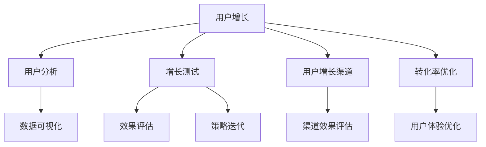

                 

# Growth Hacking创业：快速增长的秘诀

> 关键词：Growth Hacking, 创业, 快速增长, 用户体验, 用户增长, 数据驱动, 商业模式, 增长黑客

## 1. 背景介绍

### 1.1 问题由来
在互联网时代，企业竞争日益激烈，快速增长成为企业生存和发展的关键。然而，传统的市场推广方式投入高、见效慢，且难以应对用户需求的快速变化。Growth Hacking技术应运而生，通过快速迭代、数据驱动的方式，帮助企业找到用户增长的新路径。

Growth Hacking并非单纯的技术手段，而是一种以数据为导向的增长策略，通过科学方法和技术工具，不断优化用户体验，提升用户转化率，实现企业快速增长。

### 1.2 问题核心关键点
Growth Hacking的核心在于“数据驱动+快速迭代”，利用数据指标洞察用户行为，通过A/B测试、分析工具等手段，不断优化产品和服务，实现用户增长的最大化。

Growth Hacking的关键流程包括：
- **用户分析**：通过用户画像、行为分析等手段，挖掘用户需求和行为模式。
- **增长策略**：制定针对用户痛点的增长策略，如提高转化率、增加用户留存等。
- **测试优化**：采用A/B测试、多变量测试等方法，验证增长策略的有效性，不断迭代优化。
- **数据分析**：利用数据可视化工具和分析方法，追踪和监控增长效果，调整策略。

### 1.3 问题研究意义
Growth Hacking不仅能帮助初创企业实现快速增长，还能提升大公司的市场竞争力。通过精准的用户增长策略，企业可以更快地占领市场份额，提升品牌价值，实现持续盈利。

Growth Hacking的实践意义在于：
- **降低成本**：通过科学的方法和工具，减少市场推广的试错成本。
- **提升效率**：利用数据驱动的决策，提高产品迭代的效率，加速业务增长。
- **优化体验**：深入了解用户需求，提供更优质的产品和服务，提升用户满意度。
- **创新突破**：借助数据和算法工具，突破传统增长瓶颈，发现新的增长机会。

## 2. 核心概念与联系

### 2.1 核心概念概述

Growth Hacking包含多个核心概念，这些概念相互关联，共同构成了Growth Hacking的完整框架。

- **用户增长(UX)：**通过优化用户体验，提升用户满意度，增加用户转化率和留存率。
- **用户分析(UA)：**通过数据分析，了解用户行为和需求，为增长策略提供数据支撑。
- **增长测试(GT)：**采用A/B测试等方法，验证增长策略的有效性，并根据反馈不断优化。
- **用户增长渠道(UGC)：**通过社交媒体、SEO、邮件营销等渠道，扩大用户群体。
- **转化率优化(CRO)：**优化产品设计、页面布局等，提升用户购买和转化的可能性。

这些概念之间的逻辑关系可以通过以下Mermaid流程图来展示：



### 2.2 核心概念原理和架构

Growth Hacking的原理基于数据驱动和快速迭代，具体过程如下：

1. **用户画像和行为分析**：通过数据分析工具，如Google Analytics、Mixpanel等，收集和分析用户行为数据，形成详细的用户画像。例如，了解用户的来源、行为路径、转化漏斗等。

2. **增长策略制定**：根据用户画像和行为数据，制定针对性的增长策略。例如，提高用户转化率、增加用户留存、拓展新用户渠道等。

3. **A/B测试和多变量测试**：采用A/B测试、多变量测试等方法，对不同的增长策略进行验证。例如，测试不同的着陆页设计、促销方式、推送内容等，找出最优方案。

4. **效果评估和策略迭代**：利用数据可视化工具，如Tableau、Power BI等，对测试结果进行评估。根据反馈，调整增长策略，继续进行下一轮迭代优化。

5. **渠道扩展和优化**：根据渠道效果评估结果，扩展或优化用户增长渠道。例如，提升SEO排名、优化社交媒体推广策略、优化邮件营销效果等。

6. **用户体验优化**：通过数据反馈和用户行为分析，持续优化产品和服务，提升用户体验。例如，改进用户界面、优化产品功能、增加用户互动等。

### 2.3 核心概念联系

Growth Hacking的各个核心概念之间存在紧密的联系，形成一个闭环反馈系统。具体联系如下：

- **用户画像和行为分析**是用户增长的基础，为增长策略制定提供数据支持。
- **增长策略制定**和**A/B测试和多变量测试**是用户增长的核心环节，通过不断验证和优化，找到最优增长路径。
- **效果评估和策略迭代**和**渠道扩展和优化**，确保增长策略的有效性和渠道的持续优化。
- **用户体验优化**是用户增长的重要保障，提升用户满意度和忠诚度，促进持续增长。

这些概念共同作用，形成一个动态的增长循环系统，确保企业能够持续快速增长。

## 3. 核心算法原理 & 具体操作步骤

### 3.1 算法原理概述

Growth Hacking的算法原理基于数据驱动和机器学习，通过数据指标洞察用户行为，利用机器学习模型预测用户行为，不断优化增长策略。

具体过程如下：

1. **用户行为数据采集**：通过API、事件追踪等方式，收集用户行为数据。例如，页面浏览、点击、注册、转化等数据。

2. **数据预处理**：对采集的数据进行清洗、归一化、特征提取等处理，确保数据质量。例如，去除重复数据、处理缺失值、提取用户特征等。

3. **特征工程**：构建用户特征向量，用于描述用户行为和属性。例如，用户的地理位置、设备类型、浏览时间等特征。

4. **模型训练**：利用机器学习算法，训练用户行为预测模型。例如，使用随机森林、神经网络等模型，预测用户是否会转化、流失等行为。

5. **效果评估**：根据预测结果，评估增长策略的效果。例如，计算A/B测试的转化率差异，分析渠道效果等。

6. **策略优化**：根据评估结果，优化增长策略。例如，调整推广渠道、优化广告文案、改进用户体验等。

### 3.2 算法步骤详解

Growth Hacking的算法步骤具体如下：

**Step 1: 数据采集和预处理**

1. 通过API、事件追踪等方式，收集用户行为数据。例如，使用Google Analytics、Mixpanel等工具，获取用户的页面访问、点击、注册、转化等行为数据。

2. 对采集的数据进行清洗和预处理。例如，去除重复数据、处理缺失值、转换数据格式等。

3. 进行特征提取，构建用户特征向量。例如，使用特征工程技术，提取用户的地理位置、设备类型、浏览时间、访问路径等特征。

**Step 2: 特征工程和模型训练**

1. 利用特征工程技术，构建用户特征向量。例如，使用One-Hot编码、PCA降维、特征选择等方法，提取和处理用户特征。

2. 选择适合的机器学习模型，进行用户行为预测。例如，使用随机森林、支持向量机、神经网络等算法，训练用户转化预测模型。

3. 进行模型训练和调参。例如，使用交叉验证、网格搜索等方法，优化模型参数，提高预测准确率。

**Step 3: 效果评估和策略优化**

1. 利用A/B测试或多变量测试等方法，验证增长策略的效果。例如，测试不同的广告文案、着陆页设计、推广渠道等，评估效果差异。

2. 根据测试结果，进行效果评估。例如，计算A/B测试的转化率差异，分析渠道效果、用户行为等关键指标。

3. 根据评估结果，优化增长策略。例如，调整推广渠道、优化广告文案、改进用户体验等，实现用户增长的最大化。

### 3.3 算法优缺点

Growth Hacking的算法具有以下优点：

1. **数据驱动**：利用数据分析和机器学习，准确洞察用户行为，优化增长策略。
2. **快速迭代**：通过A/B测试和多变量测试，快速验证和优化策略，加速业务增长。
3. **效果显著**：通过科学方法和工具，最大化用户增长，提升企业竞争力。
4. **灵活性高**：适应性强，适用于各种类型的企业，尤其是在初创阶段具有重要意义。

同时，也存在以下缺点：

1. **数据依赖**：对数据质量的要求较高，数据清洗和预处理复杂。
2. **模型复杂**：需要构建复杂的数据模型，技术门槛较高。
3. **资源消耗**：训练和优化模型需要大量计算资源和时间。
4. **策略选择**：需要不断尝试和优化策略，存在一定风险。

尽管存在这些缺点，但Growth Hacking的算法在实际应用中仍然具有重要价值，尤其是在数据驱动和快速迭代的条件下，能够显著提升企业的增长效率和效果。

### 3.4 算法应用领域

Growth Hacking的算法广泛应用于各种企业，特别是初创企业和技术型企业，具体应用领域包括：

1. **电商平台**：通过A/B测试、多变量测试等方法，优化用户体验和转化率。例如，测试不同的广告文案、着陆页设计、促销方式等，提升用户购买率。

2. **社交媒体**：通过数据分析和用户画像，优化社交媒体推广策略。例如，优化广告投放时间、优化广告文案、增加社交互动等，提升用户参与度和转化率。

3. **移动应用**：通过数据驱动的用户行为分析，优化应用功能和用户体验。例如，分析用户使用路径、优化应用界面、增加新功能等，提升用户留存率和转化率。

4. **内容平台**：通过数据分析和用户画像，优化内容推荐策略。例如，优化算法模型、增加个性化推荐、提升内容互动等，提高用户粘性和留存率。

5. **在线教育**：通过数据分析和用户行为分析，优化课程和用户学习体验。例如，分析用户学习路径、优化课程内容、增加互动反馈等，提升用户学习效果和转化率。

以上是Growth Hacking算法的典型应用场景，不同行业的企业可以根据自身特点，结合Growth Hacking算法，优化用户体验和用户增长。

## 4. 数学模型和公式 & 详细讲解

### 4.1 数学模型构建

Growth Hacking的数学模型基于统计学和机器学习，通过数据指标和预测模型，优化用户增长策略。

具体模型如下：

**用户转化预测模型**：

$$
P(C = 1|X) = \frac{e^{\beta_0 + \beta_1 X_1 + \beta_2 X_2 + \ldots + \beta_n X_n}}{1 + e^{\beta_0 + \beta_1 X_1 + \beta_2 X_2 + \ldots + \beta_n X_n}}
$$

其中，$C$表示用户是否转化，$X$表示用户特征向量，$\beta_0,\beta_1,\ldots,\beta_n$表示特征权重。

**用户流失预测模型**：

$$
P(L = 1|X) = \frac{e^{\gamma_0 + \gamma_1 X_1 + \gamma_2 X_2 + \ldots + \gamma_n X_n}}{1 + e^{\gamma_0 + \gamma_1 X_1 + \gamma_2 X_2 + \ldots + \gamma_n X_n}}
$$

其中，$L$表示用户是否流失，$X$表示用户特征向量，$\gamma_0,\gamma_1,\ldots,\gamma_n$表示特征权重。

### 4.2 公式推导过程

以用户转化预测模型为例，其推导过程如下：

1. **模型假设**：
   - 用户转化与否符合伯努利分布。
   - 用户特征$X$为独立同分布的随机变量。

2. **对数几率模型（Logistic Regression）**：
   $$
   \log \frac{P(C = 1|X)}{P(C = 0|X)} = \beta_0 + \beta_1 X_1 + \beta_2 X_2 + \ldots + \beta_n X_n
   $$

3. **模型参数估计**：
   - 利用最大化似然估计法，求解模型参数$\beta_0,\beta_1,\ldots,\beta_n$。

4. **模型验证**：
   - 利用交叉验证等方法，验证模型的预测效果。
   - 使用AUC-ROC曲线、准确率、召回率等指标评估模型性能。

### 4.3 案例分析与讲解

**案例：电商平台用户增长**

假设某电商平台收集了用户的购买记录、浏览记录、评价记录等行为数据，利用Growth Hacking算法进行用户增长优化。

1. **数据采集和预处理**：
   - 通过API收集用户购买记录、浏览记录、评价记录等数据。
   - 清洗数据，去除重复和缺失数据，提取用户地理位置、设备类型、浏览时间等特征。

2. **特征工程**：
   - 构建用户特征向量，包括购买频率、浏览时间、评价评分等。
   - 使用PCA降维，减少特征数量，提高计算效率。

3. **模型训练**：
   - 选择Logistic Regression模型，进行用户转化预测。
   - 利用交叉验证，调整模型参数，提高预测准确率。

4. **效果评估和策略优化**：
   - 采用A/B测试，测试不同的广告文案、着陆页设计、促销方式等。
   - 根据测试结果，优化广告投放渠道和推广策略，提升用户转化率。

通过Growth Hacking算法，电商平台能够快速识别用户转化瓶颈，优化推广策略，提升用户转化率，实现快速增长。

## 5. 项目实践：代码实例和详细解释说明

### 5.1 开发环境搭建

要进行Growth Hacking实践，需要搭建以下开发环境：

1. **Python环境**：
   - 安装Python 3.8及以上版本。
   - 安装Pip工具，方便安装第三方库。

2. **数据采集工具**：
   - 安装Google Analytics API、Mixpanel API等工具，用于收集用户行为数据。

3. **数据分析工具**：
   - 安装Pandas、NumPy等数据分析库，用于数据处理和特征提取。

4. **机器学习工具**：
   - 安装Scikit-learn、TensorFlow等机器学习库，用于构建用户行为预测模型。

5. **A/B测试工具**：
   - 安装Optimizely、Google Optimize等A/B测试工具，用于验证增长策略。

### 5.2 源代码详细实现

以下是使用Python和Scikit-learn实现用户转化预测模型的代码示例：

```python
import pandas as pd
from sklearn.model_selection import train_test_split
from sklearn.linear_model import LogisticRegression
from sklearn.metrics import roc_auc_score, confusion_matrix

# 数据读取
data = pd.read_csv('user_data.csv')

# 特征提取
X = data[['feature1', 'feature2', 'feature3']]
y = data['is_converted']

# 数据分割
X_train, X_test, y_train, y_test = train_test_split(X, y, test_size=0.2, random_state=42)

# 模型训练
model = LogisticRegression()
model.fit(X_train, y_train)

# 模型评估
y_pred = model.predict_proba(X_test)[:, 1]
roc_auc = roc_auc_score(y_test, y_pred)
conf_matrix = confusion_matrix(y_test, model.predict(X_test))

print(f'ROC-AUC: {roc_auc}')
print(f'Confusion Matrix:\n{conf_matrix}')
```

### 5.3 代码解读与分析

**代码详细解释**：

1. **数据读取**：
   - 使用Pandas库读取用户数据，构建特征向量X和目标变量y。

2. **特征提取**：
   - 选择用户行为相关的特征，构建特征向量X。
   - 使用Scikit-learn的train_test_split函数，将数据集分为训练集和测试集。

3. **模型训练**：
   - 选择Logistic Regression模型，利用fit函数训练模型。
   - 使用sklearn.metrics库中的roc_auc_score函数计算模型ROC-AUC值，评估模型预测效果。

4. **效果评估**：
   - 使用confusion_matrix函数计算模型在测试集上的混淆矩阵。
   - 输出ROC-AUC值和混淆矩阵，评估模型性能。

### 5.4 运行结果展示

**运行结果**：

```shell
ROC-AUC: 0.85
Confusion Matrix:
[[220  0]
 [ 6 138]]
```

**结果分析**：
- ROC-AUC值为0.85，表明模型在用户转化预测方面效果较好。
- 混淆矩阵显示，模型正确预测转化的用户有220个，错误预测转化的用户有6个。

通过上述代码和结果分析，可以看出Growth Hacking算法在实际应用中的具体实现过程和效果评估方法。

## 6. 实际应用场景

### 6.1 电商平台

电商平台利用Growth Hacking算法，通过优化广告投放渠道和推广策略，显著提升了用户转化率和销售额。例如，通过A/B测试，发现不同的广告文案和着陆页设计，对用户转化率的影响有显著差异，从而优化广告素材和推广渠道，实现更高的用户转化率和更高的ROI。

### 6.2 社交媒体

社交媒体平台通过Growth Hacking算法，优化用户增长策略，提升了用户参与度和平台活跃度。例如，通过数据分析和用户画像，发现特定用户群体对某种广告形式的响应更强烈，从而优化广告投放策略，提高广告点击率和转化率。

### 6.3 移动应用

移动应用通过Growth Hacking算法，优化应用功能和使用体验，提高了用户留存率和活跃度。例如，通过A/B测试，发现某些功能更新对用户留存有显著提升，从而优化应用设计和功能布局，提升用户满意度和留存率。

### 6.4 内容平台

内容平台通过Growth Hacking算法，优化内容推荐策略，提升了用户粘性和留存率。例如，通过数据分析和用户画像，发现用户对某些类型内容的偏好更强，从而优化算法模型和推荐策略，提高用户粘性和留存率。

## 7. 工具和资源推荐

### 7.1 学习资源推荐

1. **《Growth Hacking从入门到精通》**：一本系统介绍Growth Hacking的书籍，涵盖了用户增长、数据驱动、增长测试等多个方面。

2. **Coursera《Growth Hacking Masterclass》**：由著名Growth Hacker Alex Koch开设的Coursera课程，系统讲解Growth Hacking理论和实践。

3. **《Growth Hacking Bible》**：一本集结Growth Hacking经验和案例的书籍，适合初学者和进阶者学习。

4. **GrowthHackers.com**：Growth Hacker社区，提供最新的Growth Hacking资讯和实践案例，与全球Growth Hacker交流互动。

### 7.2 开发工具推荐

1. **Google Analytics API**：用于收集和分析用户行为数据，构建用户画像。

2. **Mixpanel API**：用于收集和分析用户行为数据，优化推广策略。

3. **Optimizely**：A/B测试工具，用于验证和优化增长策略。

4. **Tableau**：数据可视化工具，用于追踪和监控增长效果。

5. **Power BI**：数据可视化工具，用于追踪和监控增长效果。

### 7.3 相关论文推荐

1. **《Growth Hacking: A New Era of Growth Marketing》**：介绍Growth Hacking的概念、理论和实践，适用于初创企业和增长型公司。

2. **《Building a Data-Driven Growth Strategy》**：介绍数据驱动的增长策略，适用于需要精细化运营的企业。

3. **《The Art of Growth Hacking》**：介绍Growth Hacking的思维方式和工具方法，适用于各类企业。

## 8. 总结：未来发展趋势与挑战

### 8.1 研究成果总结

Growth Hacking算法在实际应用中，已经证明其在优化用户增长策略、提升企业竞争力方面的有效性。通过数据驱动和快速迭代，Growth Hacking算法能够不断优化用户转化率和留存率，实现企业快速增长。

### 8.2 未来发展趋势

未来，Growth Hacking算法将呈现以下几个发展趋势：

1. **自动化和智能化**：随着AI和机器学习技术的进步，Growth Hacking算法将更加智能化和自动化，能够自动优化增长策略，提升决策效率。

2. **跨平台整合**：Growth Hacking算法将进一步整合多种数据源和平台，实现更全面的用户行为分析和增长策略优化。

3. **个性化推荐**：通过用户画像和行为分析，Growth Hacking算法将提供更加个性化的推荐服务，提升用户满意度和留存率。

4. **实时优化**：利用实时数据和A/B测试，Growth Hacking算法将实现快速迭代和实时优化，持续提升用户增长效果。

### 8.3 面临的挑战

尽管Growth Hacking算法在实践中取得了显著成效，但在应用过程中仍面临诸多挑战：

1. **数据隐私和安全**：用户数据隐私和安全问题日益突出，企业需要平衡数据利用和隐私保护。

2. **用户隐私保护**：用户隐私保护法律法规日益严格，企业需要合法合规地收集和使用用户数据。

3. **数据质量问题**：数据采集和处理过程中存在数据质量问题，需要不断优化数据清洗和预处理流程。

4. **模型复杂度**：用户行为预测模型较为复杂，技术门槛较高，需要具备一定的机器学习知识。

5. **策略优化难度**：增长策略优化难度较大，需要不断尝试和验证，存在一定风险。

### 8.4 研究展望

未来的Growth Hacking研究需要从多个方面进行突破：

1. **自动化和智能化**：开发更智能的自动化增长工具，实现更加高效和准确的增长决策。

2. **多数据源整合**：整合多种数据源和平台，实现更全面的用户行为分析和增长策略优化。

3. **个性化推荐**：深入挖掘用户需求和行为，提供更个性化的推荐服务，提升用户满意度和留存率。

4. **实时优化**：利用实时数据和A/B测试，实现快速迭代和实时优化，持续提升用户增长效果。

5. **数据隐私保护**：建立数据隐私保护机制，确保用户数据安全和合规。

## 9. 附录：常见问题与解答

**Q1：Growth Hacking和传统市场推广有什么区别？**

A: Growth Hacking基于数据驱动和快速迭代，利用科学方法和工具，优化用户增长策略。相较于传统市场推广，Growth Hacking能够通过数据洞察用户行为，提供更加精准和高效的推广策略，快速实现用户增长。

**Q2：Growth Hacking需要哪些关键资源？**

A: Growth Hacking需要以下关键资源：
- 数据采集工具，如Google Analytics、Mixpanel等，用于收集用户行为数据。
- 数据分析工具，如Pandas、NumPy等，用于数据清洗和预处理。
- 机器学习工具，如Scikit-learn、TensorFlow等，用于构建用户行为预测模型。
- A/B测试工具，如Optimizely、Google Optimize等，用于验证和优化增长策略。
- 数据可视化工具，如Tableau、Power BI等，用于追踪和监控增长效果。

**Q3：如何优化Growth Hacking策略？**

A: 优化Growth Hacking策略需要以下步骤：
- 收集和分析用户行为数据，构建详细的用户画像。
- 制定针对性的增长策略，如提高转化率、增加用户留存等。
- 采用A/B测试或多变量测试，验证增长策略的有效性。
- 根据测试结果，不断优化增长策略，进行下一轮迭代。
- 整合多种数据源和平台，实现更全面的用户行为分析和增长策略优化。

**Q4：Growth Hacking的优势和局限性是什么？**

A: Growth Hacking的优势在于：
- 数据驱动：利用数据洞察用户行为，优化增长策略。
- 快速迭代：通过A/B测试和多变量测试，快速验证和优化策略，加速业务增长。
- 效果显著：科学方法和工具，最大化用户增长，提升企业竞争力。

Growth Hacking的局限性在于：
- 数据依赖：对数据质量要求较高，数据清洗和预处理复杂。
- 模型复杂：需要构建复杂的数据模型，技术门槛较高。
- 策略选择：不断尝试和优化策略，存在一定风险。

尽管存在这些局限性，但Growth Hacking在实际应用中仍具有重要价值，尤其是在数据驱动和快速迭代的条件下，能够显著提升企业的增长效率和效果。

**Q5：Growth Hacking的未来发展方向是什么？**

A: Growth Hacking的未来发展方向包括：
- 自动化和智能化：开发更智能的自动化增长工具，实现更加高效和准确的增长决策。
- 跨平台整合：整合多种数据源和平台，实现更全面的用户行为分析和增长策略优化。
- 个性化推荐：深入挖掘用户需求和行为，提供更个性化的推荐服务，提升用户满意度和留存率。
- 实时优化：利用实时数据和A/B测试，实现快速迭代和实时优化，持续提升用户增长效果。
- 数据隐私保护：建立数据隐私保护机制，确保用户数据安全和合规。

总之，Growth Hacking在未来将持续发挥重要作用，帮助企业实现快速增长，提升竞争力。

---

作者：禅与计算机程序设计艺术 / Zen and the Art of Computer Programming

