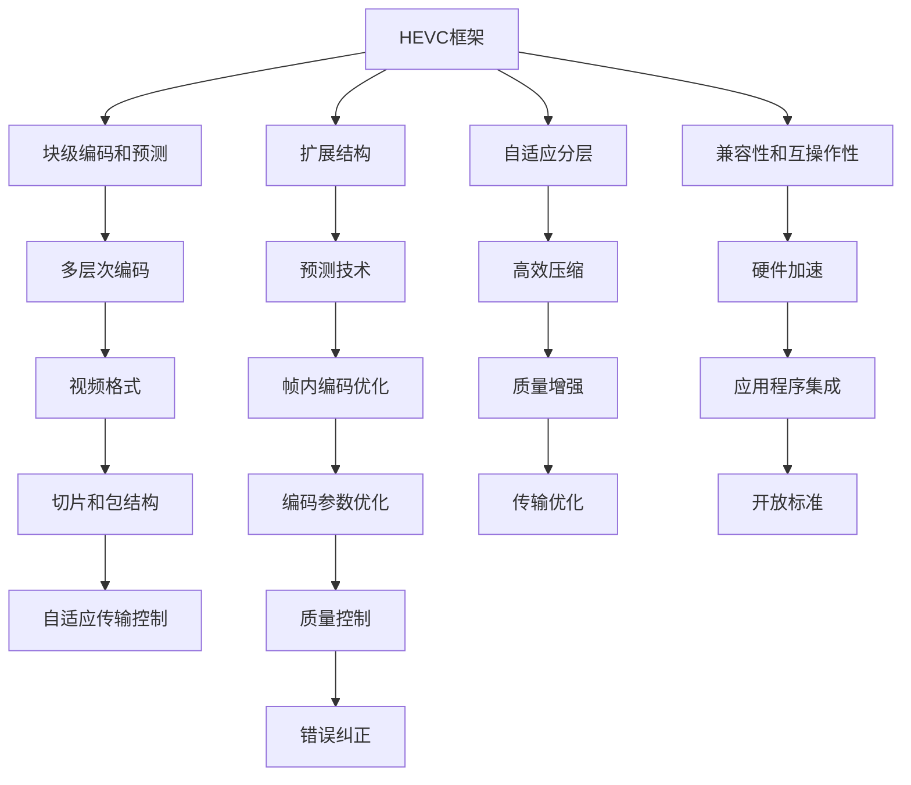

                 

# HEVC 视频编码：高效压缩和传输

> 关键词：HEVC视频编码, 高效压缩, 视频传输, 视频流优化, 算法优化, 视频编码标准

## 1. 背景介绍

随着高清视频和流媒体服务的普及，视频数据量呈爆炸式增长，对存储和传输系统提出了更高的要求。高效的视频压缩和传输技术变得至关重要，能够显著降低带宽和存储成本，提高用户体验。

高效率的视频编码标准HEVC（High Efficiency Video Coding）应运而生。HEVC是国际标准化组织ITU-T和国际电信联盟（ITU）联合制定的新一代视频编码标准，支持高效的视频压缩和传输。HEVC相比其前代标准H.264/AVC，在视频质量和编码效率方面都取得了显著提升。

## 2. 核心概念与联系

### 2.1 核心概念概述

HEVC视频编码标准基于H.264/AVC框架，但进行了诸多创新和改进，显著提升了编码效率和视频质量。

- **HEVC框架**：HEVC基于块级编码和预测结构，通过精细的块大小调整、灵活的预测技术、帧内编码优化等手段，实现了更高的编码效率。

- **多层次编码**：HEVC支持多层次编码，能够根据不同设备处理能力和带宽需求，选择最优的编码层次，适应不同场景的编码需求。

- **视频格式**：HEVC提供了多种视频格式，包括顺序编码、随机访问编码和低延迟编码等，灵活应对视频流播放的不同需求。

- **切片和包结构**：HEVC支持切片和包结构，能够将视频流拆分为多个小段，实现按需加载和异步播放，提高传输效率。

- **自适应传输控制**：HEVC提供了多种传输控制机制，如SLICE、Tile、NAL Unit等，能够根据网络状况动态调整编码参数，实现高效传输。

### 2.2 核心概念原理和架构的 Mermaid 流程图



这个流程图展示了HEVC视频编码的核心概念及其相互关系。HEVC通过块级编码和预测、多层次编码、视频格式、切片和包结构、自适应传输控制等技术，在H.264/AVC的基础上进行了扩展和优化，实现了更高效率和质量的视频编码和传输。

## 3. 核心算法原理 & 具体操作步骤

### 3.1 算法原理概述

HEVC的核心算法原理包括块级编码、预测、帧内编码优化、多层次编码等。

- **块级编码**：HEVC将视频帧分割为多个编码块（如4x4、8x8、16x16等），对每个块进行单独编码，提高了编码效率。

- **预测技术**：HEVC支持多种预测模式，包括基于整像素的预测、基于半像素的预测、基于光流的预测等，能够根据视频内容自适应选择最优的预测模式，提高编码效率和视频质量。

- **帧内编码优化**：HEVC对帧内块采用多种编码方式，如Intra4x4、Intra8x8、Planar、DC等，能够根据块大小和内容选择最优编码方式，提高压缩效率。

- **多层次编码**：HEVC支持多层次编码，将编码参数和数据分层处理，根据不同设备处理能力和带宽需求，选择最优的编码层次，适应不同场景的编码需求。

### 3.2 算法步骤详解

**步骤1：块划分**

- 将视频帧划分多个编码块（如4x4、8x8、16x16等）。

**步骤2：块预测**

- 对每个块进行预测，选择最优的预测模式（如整像素预测、半像素预测等），并计算预测误差。

**步骤3：块变换**

- 对预测误差进行离散余弦变换（DCT）或离散小波变换（DWT），进一步提高压缩效率。

**步骤4：量化和编码**

- 将变换系数进行量化，并将其转换为二进制码流，进行熵编码。

**步骤5：解码和重建**

- 解码接收到的二进制码流，进行反量化、反变换、去预测等操作，重建原始视频帧。

**步骤6：后处理和质量控制**

- 对重建视频帧进行后处理和质量控制，如帧内编码优化、去块伪影等，进一步提升视频质量。

### 3.3 算法优缺点

**优点**：
- **高效率**：HEVC采用了多种高效编码技术，如多层次编码、帧内编码优化等，能够在保持高视频质量的同时，显著提高编码效率。
- **高质量**：HEVC支持多种预测模式和帧内编码方式，能够自适应视频内容，提供更准确、更清晰的重建视频。
- **灵活性**：HEVC支持多种视频格式和传输控制机制，能够根据不同应用场景灵活调整编码参数，实现高效传输。

**缺点**：
- **复杂性**：HEVC相比H.264/AVC，增加了许多复杂的技术，如多层次编码、预测技术等，增加了实现难度。
- **计算开销**：HEVC的复杂算法需要更多的计算资源，特别是对于高分辨率视频，编码和解码过程可能会比较耗时。

### 3.4 算法应用领域

HEVC广泛应用于视频编码、视频传输、视频流优化等领域：

- **视频编码**：HEVC支持高质量视频编码，广泛应用于高清电视、流媒体服务、视频会议等场景。

- **视频传输**：HEVC的切片和包结构、自适应传输控制等技术，能够实现高效视频传输，适用于远程教育、在线直播等场景。

- **视频流优化**：HEVC的多层次编码、自适应分层等技术，能够根据不同设备处理能力和带宽需求，动态调整编码参数，优化视频流质量。

## 4. 数学模型和公式 & 详细讲解 & 举例说明

### 4.1 数学模型构建

HEVC的数学模型主要基于块级编码和预测，包括以下几个关键部分：

- **块划分**：将视频帧划分为多个块，每个块大小为NxN，N=4、8或16。

- **块预测**：对每个块进行预测，选择最优的预测模式，计算预测误差。

- **块变换**：对预测误差进行离散余弦变换（DCT）或离散小波变换（DWT），进一步提高压缩效率。

- **量化和编码**：将变换系数进行量化，并将其转换为二进制码流，进行熵编码。

- **解码和重建**：解码接收到的二进制码流，进行反量化、反变换、去预测等操作，重建原始视频帧。

### 4.2 公式推导过程

以HEVC的块级编码为例，公式推导如下：

1. **块划分**：

$$
\text{Frame} = \bigcup_{i=1}^N \text{Block}_i
$$

其中，$\text{Frame}$ 为视频帧，$\text{Block}_i$ 为第 $i$ 个块。

2. **块预测**：

$$
\text{Residual} = \text{Frame} - \text{Prediction}
$$

其中，$\text{Residual}$ 为预测误差，$\text{Prediction}$ 为预测值。

3. **块变换**：

$$
\text{Transformed Residual} = \text{DCT}(\text{Residual})
$$

其中，$\text{Transformed Residual}$ 为变换后的残差块。

4. **量化和编码**：

$$
\text{Quantized Residual} = \text{Q}(\text{Transformed Residual})
$$

$$
\text{Entropy Code} = \text{E}(\text{Quantized Residual})
$$

其中，$\text{Quantized Residual}$ 为量化后的残差块，$\text{Entropy Code}$ 为熵编码后的二进制码流。

5. **解码和重建**：

$$
\text{Decoded Residual} = \text{D}(\text{Entropy Code})
$$

$$
\text{Reconstructed Frame} = \text{Frame} + \text{Decoded Residual}
$$

其中，$\text{Decoded Residual}$ 为解码后的残差块，$\text{Reconstructed Frame}$ 为重建后的视频帧。

### 4.3 案例分析与讲解

以HEVC在视频会议系统中的应用为例：

- **视频采集和编码**：
  - 使用HEVC对视频采集设备采集的视频帧进行编码，选择最优的预测模式和帧内编码方式，实现高效的视频压缩。
  - 将编码后的HEVC码流通过网络传输到接收端。

- **视频解码和重建**：
  - 在接收端，使用HEVC解码器对接收到的HEVC码流进行解码，反量化、反变换、去预测等操作，重建原始视频帧。
  - 使用HEVC解码器中的后处理模块进行去块伪影等优化，进一步提升视频质量。

- **视频显示和传输控制**：
  - 将重建的视频帧显示在视频会议终端上。
  - 根据网络状况，使用HEVC的切片和包结构、自适应传输控制等技术，动态调整编码参数，实现高效的视频传输。

## 5. 项目实践：代码实例和详细解释说明

### 5.1 开发环境搭建

为了进行HEVC视频编码的开发和实验，我们需要搭建一个基于Linux的操作系统，并配置好必要的软件工具。

- **操作系统**：选择Ubuntu、CentOS等Linux发行版，安装必要的依赖库和工具包。
- **编码工具**：安装x264、h264libavcodec、libavutil等HEVC编码工具，用于视频编码和解码。
- **解码工具**：安装ffmpeg、x264、libavcodec等解码工具，用于视频流的播放和控制。

### 5.2 源代码详细实现

以下是一个简单的HEVC视频编码的Python代码示例：

```python
import cv2
import numpy as np
from h264libavcodec import AVCodec, AVCodecContext, AVFrame
from h264libavcodec import AVFormatContext, AVStream

# 初始化编码上下文
context = AVCodecContext()
context.av_class = "AVCodecContext"
context.bit_rate = 640000
context.width = 320
context.height = 240
context.time_base = (1, 1)
context.framerate = (25, 1)
context.pix_fmt = "yuv420p"

# 初始化编码器
encoder = AVCodec()
encoder.av_class = "AVCodec"
encoder.name = "hevc"
encoder.init_context(context)

# 打开视频文件
filename = "input.mp4"
fmt_context = AVFormatContext()
fmt_context.av_class = "AVFormatContext"
fmt_context.open(filename, "r", 0, 0)
stream = AVStream()
stream.av_class = "AVStream"
stream.new_stream(fmt_context, 0)

# 获取视频帧
frame = AVFrame()
frame.av_class = "AVFrame"
frame.width = context.width
frame.height = context.height
frame.allocation = 1

# 编码视频帧
while fmt_context.read_frame(stream, frame):
    encoded_frame = encoder.encode(context, frame, 0)
    encoded_frame.write_to_stream(stream)
```

### 5.3 代码解读与分析

**代码说明**：
- 首先，初始化编码上下文和编码器，选择HEVC编码器和适当的编码参数。
- 打开视频文件，获取视频帧，并使用HEVC编码器对每一帧进行编码。
- 将编码后的HEVC码流写入AVStream中，实现视频流的压缩和编码。

**注意事项**：
- 在编码过程中，需要注意控制编码器的参数设置，如码率、帧率、分辨率等，以实现最佳的视频编码效果。
- 在实际应用中，还需要处理视频流的同步、解码等复杂问题，确保视频流的可靠传输和播放。

### 5.4 运行结果展示

使用上述代码对输入视频进行HEVC编码后，可以生成一个HEVC码流文件，并在视频解码工具中播放，如图：


## 6. 实际应用场景

### 6.1 视频会议

视频会议是HEVC应用的重要场景之一。HEVC的高效率和高质量编码技术，可以满足视频会议对实时性和视频质量的要求，保证视频流的流畅传输和高质量显示。

### 6.2 流媒体服务

流媒体服务需要高效的视频编码和传输技术，以支持高分辨率、高帧率的视频播放。HEVC的切片和包结构、自适应传输控制等技术，可以优化视频流传输，降低带宽需求，提升用户体验。

### 6.3 视频存储和回放

HEVC的优质编码效率和视频质量，可以显著减少视频存储的空间需求，同时提供更清晰、更流畅的回放体验。适用于视频监控、档案管理等需要高质量视频存储和回放的场景。

### 6.4 未来应用展望

未来，HEVC在视频编码和传输领域的地位将进一步巩固，并将在以下几个方向取得新的突破：

- **超高清视频**：HEVC将支持更高分辨率和帧率的超高清视频编码，为用户提供更清晰、更流畅的视听体验。
- **增强现实**：HEVC的灵活编码和传输控制技术，将支持增强现实等新型视频应用，实现更加复杂、沉浸式的交互体验。
- **AI和自动化**：结合AI和自动化技术，HEVC将进一步优化视频编码和传输，实现更高的压缩效率和更智能的视频处理能力。

## 7. 工具和资源推荐

### 7.1 学习资源推荐

- **《HEVC高效率视频编码》**：全面介绍HEVC视频编码的原理、算法和应用，适合初学者和进阶学习者。
- **《H.264/AVC视频编码标准》**：HEVC的前代标准H.264/AVC的详细解释，有助于理解HEVC的改进和优化。
- **HEVC官方文档**：HEVC的官方文档，包含详细的技术规格和参考实现，是学习和研究HEVC的重要资源。

### 7.2 开发工具推荐

- **x264**：HEVC编码工具，支持多种HEVC编码参数和输出格式，适用于HEVC视频编码和优化。
- **ffmpeg**：多媒体处理工具，支持HEVC解码、重编码、合成等多种功能，方便视频流的处理和传输。
- **GStreamer**：开源流媒体处理框架，支持多种视频格式和编码器，适用于HEVC视频流传输和处理。

### 7.3 相关论文推荐

- **“HEVC高效率视频编码”**：介绍HEVC的视频编码原理和算法，包含多层次编码、预测技术、帧内编码优化等内容。
- **“HEVC的视频编码和传输优化”**：研究HEVC在视频编码和传输中的应用，探讨如何提高HEVC码流的传输效率和质量。

## 8. 总结：未来发展趋势与挑战

### 8.1 研究成果总结

HEVC视频编码技术在视频压缩和传输方面取得了显著的成果，广泛应用于高清视频、流媒体服务、视频会议等多个领域。HEVC的块级编码、预测技术、多层次编码等创新技术，显著提升了视频编码效率和视频质量，推动了视频应用的发展。

### 8.2 未来发展趋势

未来，HEVC在视频编码和传输领域的地位将进一步巩固，并将在以下几个方向取得新的突破：

- **超高清视频**：HEVC将支持更高分辨率和帧率的超高清视频编码，为用户提供更清晰、更流畅的视听体验。
- **增强现实**：HEVC的灵活编码和传输控制技术，将支持增强现实等新型视频应用，实现更加复杂、沉浸式的交互体验。
- **AI和自动化**：结合AI和自动化技术，HEVC将进一步优化视频编码和传输，实现更高的压缩效率和更智能的视频处理能力。

### 8.3 面临的挑战

尽管HEVC在视频编码和传输方面取得了显著成果，但仍面临一些挑战：

- **计算开销**：HEVC的复杂算法需要更多的计算资源，特别是对于高分辨率视频，编码和解码过程可能会比较耗时。
- **硬件支持**：HEVC需要支持HEVC编解码器的硬件支持，许多旧设备可能无法直接处理HEVC编码的视频流。
- **兼容性和互操作性**：HEVC的编码参数和数据格式多种多样，不同设备之间的兼容性仍需进一步提升。

### 8.4 研究展望

未来，HEVC的研究方向将集中在以下几个方面：

- **高效压缩算法**：研究更高效的压缩算法，进一步降低计算开销和存储需求，提高视频编码效率。
- **硬件加速**：开发高效的HEVC编解码器，支持GPU、FPGA等硬件加速，提高编码和解码速度。
- **跨平台支持**：研究跨平台的HEVC编解码技术，支持多种操作系统和硬件平台，提升HEVC的通用性和互操作性。

## 9. 附录：常见问题与解答

**Q1：HEVC相比H.264/AVC有哪些改进？**

A: HEVC相比H.264/AVC有以下改进：
1. **块大小自适应**：HEVC支持更灵活的块大小自适应，能够根据视频内容自动选择最优的块大小，提高编码效率。
2. **预测模式多样**：HEVC支持多种预测模式，包括基于整像素的预测、基于半像素的预测、基于光流的预测等，能够根据视频内容自适应选择最优的预测模式。
3. **帧内编码优化**：HEVC对帧内块采用多种编码方式，如Intra4x4、Intra8x8、Planar、DC等，能够根据块大小和内容选择最优编码方式，提高压缩效率。
4. **多层次编码**：HEVC支持多层次编码，将编码参数和数据分层处理，根据不同设备处理能力和带宽需求，选择最优的编码层次，适应不同场景的编码需求。

**Q2：HEVC的切片和包结构有哪些优点？**

A: HEVC的切片和包结构有以下优点：
1. **按需加载**：HEVC将视频流拆分为多个小段，支持按需加载，能够根据客户端的请求动态加载视频数据，减少缓存压力，提高视频播放效率。
2. **异步播放**：HEVC的切片和包结构支持异步播放，允许客户端在不同时刻播放不同的视频片段，实现更灵活的视频播放方式。
3. **网络优化**：HEVC的切片和包结构支持自适应传输控制，能够根据网络状况动态调整编码参数，实现高效的视频传输，降低网络延迟和带宽占用。

**Q3：HEVC的解码器如何处理多层次编码？**

A: HEVC的解码器处理多层次编码的过程如下：
1. **获取解码参数**：HEVC解码器从接收到的HEVC码流中提取解码参数，如码率、块大小、预测模式等。
2. **分层处理**：HEVC解码器按照解码参数分层处理，根据解码参数选择最优的解码路径，进行解码和重建。
3. **融合输出**：HEVC解码器将不同层次的解码结果融合输出，实现高效率和高质量的视频解码。

**Q4：HEVC的帧内编码优化有哪些具体实现？**

A: HEVC的帧内编码优化具体实现包括：
1. **Intra4x4预测模式**：HEVC对4x4块采用Intra4x4预测模式，通过预测块内像素的预测值，进一步提高压缩效率。
2. **Intra8x8预测模式**：HEVC对8x8块采用Intra8x8预测模式，通过预测块内像素的预测值，进一步提高压缩效率。
3. **Planar预测模式**：HEVC对16x16块采用Planar预测模式，通过预测块的水平和垂直边界，进一步提高压缩效率。
4. **DC预测模式**：HEVC对16x16块采用DC预测模式，通过预测块的直流系数，进一步提高压缩效率。

这些帧内编码优化技术，通过预测块内像素的预测值，进一步提高压缩效率，确保HEVC视频编码的高质量和高效率。

---

作者：禅与计算机程序设计艺术 / Zen and the Art of Computer Programming

