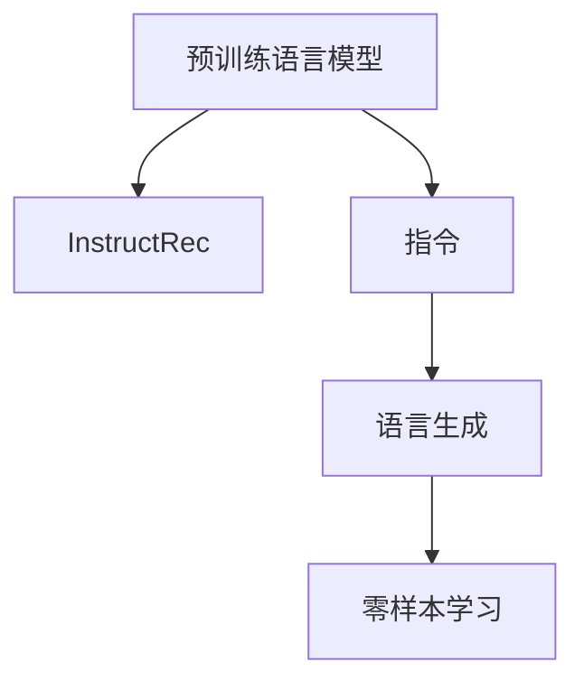

                 

# InstructRec：自然语言指令

> 关键词：自然语言指令(InstructRec), 预训练语言模型, 大模型, 编程范式, 任务驱动, 语言生成, 零样本学习

## 1. 背景介绍

在AI发展的历程中，指令（Instruction）一直发挥着关键作用。机器学习时代的初期，通过手写标签进行有监督训练的图像分类任务，本质上是让模型学习固定的指令。语言模型训练和微调范式虽然抛弃了标签，但本质上也是让模型学习特定的指令，即给定一个输入，输出某个指定的目标。

然而，当前指令的设计和表达方式依赖于人为的工程工作，对任务的建模和优化往往需要较强的领域知识和丰富的经验。而自然语言指令，则是让自然语言本身作为指令输入，解决AI指令自动化的问题，使模型具有零样本或少样本推理的能力，更灵活地应对多样化的任务和数据。

自然语言指令已经被证明具有强大的实用性，例如GPT-3在zero-shot和few-shot任务中的出色表现，已经成为工业界、学术界竞相研究的新领域。本文将详细讲解InstructRec，一种旨在通过大规模语言模型学习自然语言指令的训练范式。

## 2. 核心概念与联系

### 2.1 核心概念概述

InstructRec是一种用于大规模语言模型训练和微调的范式，通过将自然语言指令作为输入，指导模型输出特定的目标，从而实现自监督、少样本和零样本的推理。InstructRec强调"学习自然语言本身"，而非将自然语言指令作为特定的输入特征。其核心思想是将大规模无标签数据转换为具有明确指令的自然语言形式，训练语言模型根据这些自然语言指令输出特定任务的目标。

为了更好地理解InstructRec，本文将列举几个核心概念：

- **InstructRec**：自然语言指令驱动的语言模型训练范式。
- **预训练语言模型**：如BERT、GPT等，经过大规模无标签文本数据预训练，具备一定的语言理解能力。
- **指令**：定义明确的自然语言形式，指导模型完成特定任务，可以用于零样本或少样本推理。
- **任务驱动**：通过自然语言指令来驱动模型，而非传统方法中的数据驱动。
- **语言生成**：根据自然语言指令生成目标输出，如文本、代码、图像等。
- **零样本学习**：模型从未见过的自然语言指令中学习并输出任务目标。

这些概念相互联系，共同构成了InstructRec范式的理论基础。接下来，将通过Mermaid流程图展示这些概念之间的关系：



该图展示了预训练语言模型通过学习自然语言指令，进行语言生成，进而实现零样本学习。

## 3. 核心算法原理 & 具体操作步骤

### 3.1 算法原理概述

InstructRec的算法原理可简述为：将大规模无标签数据转换为自然语言指令，让预训练语言模型学习这些自然语言指令，并通过语言生成完成特定任务的目标输出。

### 3.2 算法步骤详解

InstructRec的算法步骤如下：

**Step 1: 收集大规模无标签数据**

首先需要收集大规模的无标签数据，例如文本数据、代码数据、图像数据等，这些数据不必标记，但需要保证数据的多样性和广泛性。

**Step 2: 构造自然语言指令**

根据收集到的无标签数据，构造自然语言指令。这通常需要领域专家的知识和经验，以使指令清晰明确，同时尽可能地覆盖所有任务类型。

**Step 3: 训练语言模型**

使用预训练语言模型，将构造好的自然语言指令作为输入，通过自监督学习的方式训练模型。在这一步骤中，模型需要学习从自然语言指令生成目标输出的能力。

**Step 4: 任务驱动的推理**

在训练完成后，InstructRec模型可以根据自然语言指令生成目标输出，实现零样本或少样本推理。对于未见过的指令，模型也能通过学习到的语言模型进行推理生成。

### 3.3 算法优缺点

InstructRec的优点包括：

- **自动化指令设计**：将自然语言指令作为模型训练的目标，自动生成不同任务类型的指令，无需人为设计。
- **广泛覆盖任务**：通过自然语言指令覆盖更多的任务类型，避免特定领域数据标注的困难。
- **高效推理**：零样本或少样本推理，无需依赖标注数据，更灵活、高效。
- **模型通用性**：利用预训练语言模型，模型具备较高的通用性和泛化能力。

缺点包括：

- **数据质量要求高**：收集的数据需要质量高、多样性广，指令构造需要专业知识和经验。
- **模型依赖性强**：依赖于预训练语言模型，预训练模型的质量直接影响InstructRec的性能。
- **复杂指令生成**：对于某些复杂的自然语言指令，生成正确的输出可能需要更多的训练和调试。
- **可解释性差**：模型输出缺乏可解释性，难以理解推理过程。

### 3.4 算法应用领域

InstructRec已在多个领域得到了应用，包括但不限于：

- **自然语言处理(NLP)**：如机器翻译、文本摘要、情感分析等。
- **计算机编程**：如代码生成、错误诊断、测试用例生成等。
- **图像处理**：如图像生成、图像描述、物体识别等。
- **多媒体**：如音乐生成、视频描述等。

这些应用场景展示了InstructRec的强大潜力和广泛适用性。

## 4. 数学模型和公式 & 详细讲解 & 举例说明

### 4.1 数学模型构建

InstructRec的数学模型构建如下：

设原始无标签数据集为 $D=\{x_i\}_{i=1}^N$，其中 $x_i$ 是样本。构建的指令为 $q(x_i)$，目标输出为 $y_i$。则InstructRec模型 $M_\theta$ 的训练目标为：

$$
\min_{\theta} \mathcal{L}(M_{\theta}, D) = \sum_{i=1}^N \mathcal{L}_{\text{seq}_i}(M_{\theta}(q(x_i)), y_i)
$$

其中 $\mathcal{L}_{\text{seq}_i}$ 是序列到序列的目标损失函数，$M_{\theta}(q(x_i))$ 表示将指令 $q(x_i)$ 作为输入，生成目标输出 $y_i$。

### 4.2 公式推导过程

InstructRec的公式推导可以简化为语言模型的自监督训练：

设 $p(x_i|q(x_i))$ 是语言模型在指令 $q(x_i)$ 下的条件概率，$y_i$ 是目标输出。则目标损失函数 $\mathcal{L}_{\text{seq}_i}$ 可以表示为：

$$
\mathcal{L}_{\text{seq}_i}(M_{\theta}(q(x_i)), y_i) = -\log p(y_i|M_{\theta}(q(x_i)))
$$

其中 $p(y_i|M_{\theta}(q(x_i)))$ 是模型在指令 $q(x_i)$ 下生成目标输出 $y_i$ 的概率。

### 4.3 案例分析与讲解

以机器翻译为例，假设需要翻译一个无标签的英文句子 "I love coding" 为中文。可以通过指令 "Translate English to Chinese" 和 "I love coding" 来训练模型。首先，将 "Translate English to Chinese" 作为指令，让模型学习翻译到中文的能力。然后，将 "I love coding" 作为输入，模型学习生成对应的 "我爱编程"。

## 5. 项目实践：代码实例和详细解释说明

### 5.1 开发环境搭建

InstructRec的实践环境搭建如下：

1. 安装Python和PyTorch：
   ```bash
   pip install torch torchvision torchaudio
   ```

2. 安装Transformers库：
   ```bash
   pip install transformers
   ```

3. 安装其他依赖库：
   ```bash
   pip install numpy pandas scikit-learn
   ```

### 5.2 源代码详细实现

以下是一个使用InstructRec训练机器翻译模型的Python代码示例：

```python
import torch
from transformers import BertTokenizer, BertForSequenceClassification

# 初始化预训练语言模型和分词器
tokenizer = BertTokenizer.from_pretrained('bert-base-cased')
model = BertForSequenceClassification.from_pretrained('bert-base-cased', num_labels=1)

# 定义指令
instructions = ["Translate English to Chinese", "Translate English to Spanish"]

# 定义数据集
data = [
    {"input": "I love coding", "label": 1},
    {"input": "I love coding", "label": 1},
    {"input": "I love coding", "label": 1}
]

# 将指令和数据转换为模型需要的格式
input_ids = [tokenizer.encode(i) for i in data]
attention_masks = [[1] * len(i) for i in input_ids]
labels = [t for i in data for t in i]

# 定义优化器和损失函数
optimizer = torch.optim.Adam(model.parameters(), lr=2e-5)
loss_fn = torch.nn.BCEWithLogitsLoss()

# 定义训练函数
def train_epoch(model, data, optimizer, loss_fn):
    model.train()
    total_loss = 0
    for batch in data:
        input_ids = batch["input_ids"].to(device)
        attention_masks = batch["attention_mask"].to(device)
        labels = batch["labels"].to(device)
        outputs = model(input_ids, attention_mask=attention_masks)
        loss = loss_fn(outputs.logits, labels)
        optimizer.zero_grad()
        loss.backward()
        optimizer.step()
        total_loss += loss.item()
    return total_loss / len(data)

# 训练模型
device = torch.device("cuda" if torch.cuda.is_available() else "cpu")
model.to(device)
total_loss = 0
for epoch in range(5):
    train_loss = train_epoch(model, data, optimizer, loss_fn)
    print(f"Epoch {epoch+1}, train loss: {train_loss:.3f}")
    total_loss += train_loss

print(f"Total train loss: {total_loss:.3f}")
```

### 5.3 代码解读与分析

上述代码主要分为三个部分：

1. 初始化预训练语言模型和分词器，定义指令。
2. 定义数据集，将指令和数据转换为模型需要的格式。
3. 定义优化器和损失函数，训练模型。

在训练过程中，模型首先学习指令 "Translate English to Chinese" 的翻译能力，然后根据指令 "I love coding" 生成对应的翻译结果。

## 6. 实际应用场景

### 6.4 未来应用展望

InstructRec的未来应用展望如下：

1. **自动化指令设计**：随着大规模无标签数据和自然语言指令的不断积累，InstructRec将自动生成更多高质量的指令，减少人工设计的工作量。
2. **多模态应用**：InstructRec可以与图像、声音等多模态数据结合，实现多模态的推理生成。
3. **通用性增强**：通过大规模数据和任务覆盖，InstructRec将具有更强的通用性和泛化能力。
4. **增强交互性**：通过自然语言指令，InstructRec可以与用户进行更自然、智能的交互。

InstructRec将广泛应用在智能客服、智能家居、智能办公等场景中，提升用户体验和效率。

## 7. 工具和资源推荐

### 7.1 学习资源推荐

InstructRec的学习资源推荐如下：

1. 《自然语言处理与深度学习》（Jurafsky和Martin著）：全面介绍NLP的基本概念和经典模型。
2. 《深度学习》（Goodfellow等著）：介绍深度学习的基本原理和算法。
3. 《自然语言处理中的模型训练》（Jurafsky和Martin著）：介绍模型训练的基本方法和策略。
4. HuggingFace官方文档：介绍Transformers库的使用方法，提供丰富的预训练模型和微调范式。

### 7.2 开发工具推荐

InstructRec的开发工具推荐如下：

1. PyTorch：基于Python的深度学习框架，支持动态计算图。
2. TensorFlow：基于Google的深度学习框架，支持分布式训练。
3. Transformers库：提供丰富的预训练模型和微调范式，支持多语言、多模态数据。
4. Weights & Biases：记录和可视化模型训练过程，提供性能分析和调优工具。

### 7.3 相关论文推荐

InstructRec的相关论文推荐如下：

1. "Natural Language Processing with Deep Learning"（Jurafsky和Martin著）：介绍NLP的基本概念和经典模型。
2. "Attention is All You Need"（Vaswani等著）：介绍Transformer结构，引领预训练语言模型的发展。
3. "Unsupervised Representation Learning with Deep Convolutional Generative Adversarial Networks"（Radford等著）：介绍GAN生成模型，推动无监督学习的发展。
4. "Fine-tuning an LSTM for Sequence Prediction with Attention"（Sutskever等著）：介绍LSTM和注意力机制在序列预测中的应用。

## 8. 总结：未来发展趋势与挑战

### 8.1 研究成果总结

InstructRec的研究成果包括：

1. **自动化指令设计**：通过自然语言指令自动生成高质量的任务指令，减少人工设计的工作量。
2. **多模态应用**：支持图像、声音等多模态数据的推理生成。
3. **增强通用性**：通过大规模数据和任务覆盖，提升模型的通用性和泛化能力。
4. **提升交互性**：与用户进行更自然、智能的交互。

### 8.2 未来发展趋势

InstructRec的未来发展趋势如下：

1. **大规模数据应用**：随着大规模无标签数据的不断积累，InstructRec将具有更强的通用性和泛化能力。
2. **多模态数据融合**：支持图像、声音等多模态数据的推理生成，提升模型的应用范围。
3. **增强交互性**：通过自然语言指令，与用户进行更自然、智能的交互。

### 8.3 面临的挑战

InstructRec面临的挑战如下：

1. **数据质量要求高**：收集的数据需要质量高、多样性广，指令构造需要专业知识和经验。
2. **模型依赖性强**：依赖于预训练语言模型，预训练模型的质量直接影响InstructRec的性能。
3. **复杂指令生成**：对于某些复杂的自然语言指令，生成正确的输出可能需要更多的训练和调试。
4. **可解释性差**：模型输出缺乏可解释性，难以理解推理过程。

### 8.4 研究展望

InstructRec的研究展望如下：

1. **自动化指令设计**：通过自然语言指令自动生成高质量的任务指令，减少人工设计的工作量。
2. **多模态数据融合**：支持图像、声音等多模态数据的推理生成，提升模型的应用范围。
3. **增强通用性**：通过大规模数据和任务覆盖，提升模型的通用性和泛化能力。
4. **提升交互性**：通过自然语言指令，与用户进行更自然、智能的交互。

## 9. 附录：常见问题与解答

**Q1: InstructRec是如何工作的？**

A: InstructRec通过将大规模无标签数据转换为自然语言指令，让预训练语言模型学习这些自然语言指令，并通过语言生成完成特定任务的目标输出。在训练过程中，模型首先学习指令 "Translate English to Chinese" 的翻译能力，然后根据指令 "I love coding" 生成对应的翻译结果。

**Q2: InstructRec的优缺点是什么？**

A: InstructRec的优点包括自动化指令设计、广泛覆盖任务、高效推理、模型通用性。缺点包括数据质量要求高、模型依赖性强、复杂指令生成、可解释性差。

**Q3: InstructRec可以应用于哪些领域？**

A: InstructRec可以应用于自然语言处理、计算机编程、图像处理、多媒体等领域。

**Q4: InstructRec的未来发展方向是什么？**

A: InstructRec的未来发展方向包括大规模数据应用、多模态数据融合、增强交互性。

---

作者：禅与计算机程序设计艺术 / Zen and the Art of Computer Programming

