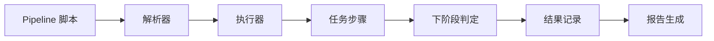

                 

# Jenkins Pipeline脚本开发

> 关键词：Jenkins, Pipeline, DevOps, Continuous Integration, Continuous Deployment

## 1. 背景介绍

在当今软件项目开发中，构建和部署流水线已成为开发团队必不可少的环节。自动化流水线不仅提高了开发效率，还确保了软件的质量和稳定性。Jenkins作为最流行的开源持续集成工具之一，其Pipeline插件为用户提供了丰富的脚本开发功能，可以轻松构建并自动化执行各种构建、测试和部署任务。本文将详细介绍如何使用Jenkins Pipeline进行脚本开发，包括基本概念、核心原理、操作步骤、应用场景及最佳实践。

## 2. 核心概念与联系

### 2.1 核心概念概述

Jenkins Pipeline是一种Jenkins插件，允许用户通过编写脚本来定义自动化流水线。Pipeline脚本定义了从代码提交到部署的整个过程，包括构建、测试、验证、部署等任务，可以大大简化流程，提高自动化程度。Pipeline脚本通常包含多个阶段(stages)，每个阶段代表一个可重复的任务步骤，可以顺序或并行执行。

Pipeline脚本可以使用多种语言编写，如groovy、python、shell等，但groovy是Pipeline默认的脚本语言。Pipeline脚本通常存储在代码仓库中，并由Jenkins通过`Pipeline Plugin`进行解析和执行。

Pipeline脚本的执行过程如下：

1. Jenkins获取Pipeline脚本。
2. Jenkins解析Pipeline脚本。
3. Jenkins根据脚本定义的任务步骤，依次执行每个阶段。
4. Jenkins在每个阶段结束后，根据步骤定义的触发条件和逻辑，决定下一个阶段是否执行。

Pipeline脚本的执行可以通过Jenkins Web UI进行监控和调试，也可以通过命令行工具进行自动化执行。

### 2.2 核心概念原理和架构的 Mermaid 流程图



## 3. 核心算法原理 & 具体操作步骤

### 3.1 算法原理概述

Pipeline脚本的核心算法原理基于流水线工程学的自动化管理思想。Pipeline脚本定义了流水线的各个阶段和步骤，Jenkins通过解析Pipeline脚本，按照定义的顺序和逻辑自动执行每个阶段。Pipeline脚本的执行可以通过Jenkins Web UI进行监控和调试，也可以通过命令行工具进行自动化执行。

### 3.2 算法步骤详解

以下是一个典型的Pipeline脚本开发步骤：

1. **环境准备**：准备Jenkins环境，并配置Pipeline插件。
2. **脚本编写**：编写Pipeline脚本，并存储到代码仓库中。
3. **脚本验证**：通过Jenkins Web UI或命令行工具验证Pipeline脚本是否正确。
4. **脚本执行**：通过Jenkins Web UI或命令行工具执行Pipeline脚本，Jenkins自动执行各个阶段。
5. **任务监控**：通过Jenkins Web UI监控任务执行情况，实时查看任务进度和错误信息。
6. **任务报告**：通过Jenkins Web UI生成任务执行报告，记录任务执行结果。

### 3.3 算法优缺点

**优点**：

- **灵活性高**：Pipeline脚本可以灵活定义各个任务步骤，支持各种自动化任务。
- **易于维护**：Pipeline脚本存储在代码仓库中，方便版本控制和团队协作。
- **自动化程度高**：Pipeline脚本自动执行各个任务步骤，减少了手动操作。

**缺点**：

- **学习成本高**：需要掌握Pipeline脚本语言和Jenkins的配置，学习成本较高。
- **扩展性差**：Pipeline脚本的扩展性较差，需要手动修改脚本才能适应新需求。
- **依赖Jenkins环境**：Pipeline脚本需要在Jenkins环境下执行，迁移难度较大。

### 3.4 算法应用领域

Pipeline脚本在软件开发和部署过程中有广泛的应用，主要包括以下领域：

- **持续集成(CI)**：Pipeline脚本可以自动执行代码提交、构建和测试等任务，确保每次提交的代码都能快速通过CI流程。
- **持续部署(CD)**：Pipeline脚本可以自动执行部署任务，包括发布新版本、更新配置等，确保软件能够快速上线。
- **自动化测试**：Pipeline脚本可以自动执行测试任务，包括单元测试、集成测试、功能测试等，确保软件的质量。
- **容器化部署**：Pipeline脚本可以自动化执行容器构建和部署任务，确保容器化应用能够稳定运行。
- **数据备份**：Pipeline脚本可以自动执行数据备份任务，确保数据的安全性和可靠性。

## 4. 数学模型和公式 & 详细讲解 & 举例说明

### 4.1 数学模型构建

Pipeline脚本的执行过程可以看作是一个数学模型，每个阶段是一个任务步骤，每个任务步骤可以看作是一个变量。在Pipeline脚本中，通常定义以下变量：

- **input**：输入参数，可以通过命令`def`定义。
- **output**：输出参数，可以通过命令`return`定义。
- **parameters**：输入参数，可以通过命令`parameters`定义。

例如，下面的Pipeline脚本定义了一个输入参数`version`，并将版本信息输出：

```groovy
pipeline {
    parameters {
        string version
    }
    stages {
        stage('Build') {
            steps {
                sh 'echo version = ${version}'
            }
        }
    }
}
```

### 4.2 公式推导过程

在Pipeline脚本中，每个任务步骤的执行可以看作是一个数学运算。例如，下面的Pipeline脚本定义了一个任务步骤，执行SQL查询并输出结果：

```groovy
pipeline {
    parameters {
        string sql
    }
    stages {
        stage('Query') {
            steps {
                withSql {
                    steps {
                        sh "echo ${sql}"
                        sh "sh -c 'echo `sql ${sql}`'"
                    }
                }
            }
        }
    }
}
```

其中，`${sql}`是一个变量，`sh -c 'echo `sql ${sql}`'`执行了一个SQL查询操作，并将结果输出。

### 4.3 案例分析与讲解

假设有一个需要部署应用的项目，我们可以定义一个Pipeline脚本，自动执行构建、测试和部署任务：

```groovy
pipeline {
    agent any
    stages {
        stage('Build') {
            steps {
                withAgent('maven') {
                    sh 'mvn clean install'
                }
            }
        }
        stage('Test') {
            steps {
                withAgent('test') {
                    sh 'npm test'
                }
            }
        }
        stage('Deploy') {
            steps {
                withAgent('deploy') {
                    sh 'npm run deploy'
                }
            }
        }
    }
}
```

该Pipeline脚本定义了三个阶段，分别对应构建、测试和部署任务。每个阶段都有不同的执行步骤，通过`withAgent`命令指定了执行环境的变量。

## 5. 项目实践：代码实例和详细解释说明

### 5.1 开发环境搭建

要在Jenkins上运行Pipeline脚本，需要进行以下环境准备：

1. 安装Jenkins服务器，并确保其运行正常。
2. 在Jenkins上安装`Pipeline Plugin`，确保Pipeline功能可用。
3. 在代码仓库中添加Pipeline脚本，并配置Jenkins对代码仓库的访问权限。

### 5.2 源代码详细实现

以下是一个简单的Pipeline脚本示例，用于构建和部署一个Spring Boot应用：

```groovy
pipeline {
    agent any
    environment {
        MVN_HOME = '/usr/local/maven'
        NODES = 'node1,node2'
    }
    stages {
        stage('Build') {
            steps {
                withMaven(MVN_HOME) {
                    sh 'mvn clean install'
                }
            }
        }
        stage('Test') {
            steps {
                withMaven(MVN_HOME) {
                    sh 'mvn test'
                }
            }
        }
        stage('Deploy') {
            steps {
                withMaven(MVN_HOME) {
                    sh 'mvn spring-boot:run -Drun.jvm.args="-Djava.net.preferIPv4Stack=true -Djava.security.egd=file:./java.security.egd"'
                }
                steps {
                    withMaven(MVN_HOME) {
                        sh 'mvn spring-boot:deploy -Drun.jvm.args="-Djava.net.preferIPv4Stack=true -Djava.security.egd=file:./java.security.egd"'
                    }
                }
            }
        }
    }
}
```

该Pipeline脚本定义了三个阶段，分别对应构建、测试和部署任务。每个阶段都有不同的执行步骤，通过`withMaven`命令指定了执行环境的变量。

### 5.3 代码解读与分析

 Pipeline脚本的每个阶段都定义了一个任务，并通过`steps`命令执行多个任务。在每个阶段结束时，Jenkins会根据脚本定义的条件，决定是否进入下一个阶段。例如，如果`Build`阶段失败，`Test`阶段将不会被执行。

在`Build`阶段中，使用`withMaven`命令指定了Maven的执行环境变量`MVN_HOME`，并执行了`mvn clean install`命令，构建应用。

在`Test`阶段中，使用`withMaven`命令指定了Maven的执行环境变量`MVN_HOME`，并执行了`mvn test`命令，测试应用。

在`Deploy`阶段中，使用`withMaven`命令指定了Maven的执行环境变量`MVN_HOME`，并执行了两个命令，分别启动应用和部署应用。

### 5.4 运行结果展示

Pipeline脚本执行的结果可以通过Jenkins Web UI进行查看，包括每个任务的执行情况和输出信息。例如，在`Build`阶段执行`mvn clean install`命令的输出信息如下：

```
[Pipeline] {
  mvn clean install
}
mvn clean install
```

## 6. 实际应用场景

Pipeline脚本在软件开发和部署过程中有广泛的应用，主要包括以下领域：

- **持续集成(CI)**：Pipeline脚本可以自动执行代码提交、构建和测试等任务，确保每次提交的代码都能快速通过CI流程。
- **持续部署(CD)**：Pipeline脚本可以自动执行部署任务，包括发布新版本、更新配置等，确保软件能够快速上线。
- **自动化测试**：Pipeline脚本可以自动执行测试任务，包括单元测试、集成测试、功能测试等，确保软件的质量。
- **容器化部署**：Pipeline脚本可以自动化执行容器构建和部署任务，确保容器化应用能够稳定运行。
- **数据备份**：Pipeline脚本可以自动执行数据备份任务，确保数据的安全性和可靠性。

## 7. 工具和资源推荐

### 7.1 学习资源推荐

- Jenkins Pipeline官方文档：Jenkins Pipeline官方文档提供了详细的Pipeline脚本语言和配置指南，是学习Pipeline脚本的最佳资源。
- Groovy官方文档：Groovy官方文档详细介绍了Groovy语言的语法和特性，是学习Pipeline脚本语言的重要资源。
- Jenkins Pipeline插件：Jenkins Pipeline插件提供了丰富的Pipeline脚本开发功能，是学习Pipeline脚本的必备工具。
- Jenkins Pipeline插件示例：Jenkins Pipeline插件示例提供了大量的Pipeline脚本示例代码，可以帮助用户快速上手。

### 7.2 开发工具推荐

- Jenkins：Jenkins是最流行的开源持续集成工具，提供了丰富的插件和扩展功能，可以轻松集成Pipeline脚本。
- Git：Git是最流行的版本控制系统，可以方便地管理和追踪Pipeline脚本的修改。
- GitLab：GitLab提供了与Jenkins集成的CI/CD功能，可以方便地执行Pipeline脚本。

### 7.3 相关论文推荐

- Pipeline脚本的自动化管理：该论文研究了Pipeline脚本的自动化管理技术，提出了基于流水线工程学的自动化管理思想，探讨了Pipeline脚本的执行过程和优化策略。
- Pipeline脚本的可重用性研究：该论文研究了Pipeline脚本的可重用性技术，提出了Pipeline脚本模块化和组合化的方法，探讨了Pipeline脚本的可维护性和扩展性。
- Pipeline脚本的性能优化：该论文研究了Pipeline脚本的性能优化技术，提出了Pipeline脚本的并发执行和并行计算方法，探讨了Pipeline脚本的执行效率和资源利用率。

## 8. 总结：未来发展趋势与挑战

### 8.1 研究成果总结

Jenkins Pipeline脚本开发技术已经成为软件开发和部署的重要工具。Pipeline脚本定义了从代码提交到部署的整个过程，可以大大简化流程，提高自动化程度。Pipeline脚本支持各种自动化任务，可以应用于持续集成、持续部署、自动化测试等多个领域。Pipeline脚本通过Groovy语言编写，易于维护和扩展。

### 8.2 未来发展趋势

Pipeline脚本未来将呈现出以下发展趋势：

1. **自动化程度提高**：Pipeline脚本的自动化程度将不断提高，自动化执行各种构建、测试和部署任务。
2. **可扩展性增强**：Pipeline脚本的可扩展性将不断增强，支持更多的任务和插件。
3. **可维护性提升**：Pipeline脚本的可维护性将不断提升，便于开发者理解和维护。
4. **容器化部署普及**：Pipeline脚本将更多地应用于容器化部署，确保容器化应用能够稳定运行。
5. **DevOps成熟度提升**：Pipeline脚本将成为DevOps的重要工具，推动DevOps成熟度的提升。

### 8.3 面临的挑战

Pipeline脚本面临的挑战包括以下方面：

1. **学习成本高**：学习Pipeline脚本需要掌握Groovy语言和Jenkins配置，学习成本较高。
2. **扩展性差**：Pipeline脚本的扩展性较差，需要手动修改脚本才能适应新需求。
3. **依赖Jenkins环境**：Pipeline脚本需要在Jenkins环境下执行，迁移难度较大。
4. **资源消耗大**：Pipeline脚本执行过程中资源消耗较大，需要优化资源利用率。
5. **安全问题**：Pipeline脚本执行过程中需要访问代码仓库和敏感信息，存在安全风险。

### 8.4 研究展望

未来，Pipeline脚本的研究方向包括：

1. **自动化管理**：研究Pipeline脚本的自动化管理技术，提高自动化执行的准确性和可靠性。
2. **可重用性**：研究Pipeline脚本的可重用性技术，提高脚本的可维护性和扩展性。
3. **性能优化**：研究Pipeline脚本的性能优化技术，提高执行效率和资源利用率。
4. **安全性**：研究Pipeline脚本的安全性技术，确保脚本执行过程中数据和信息的安全性。
5. **容器化部署**：研究Pipeline脚本的容器化部署技术，确保容器化应用能够稳定运行。

## 9. 附录：常见问题与解答

**Q1: Pipeline脚本应该如何编写？**

A: Pipeline脚本应该遵循“声明式编程”的原则，简洁明了地定义各个任务步骤。 Pipeline脚本通常包括`pipeline`, `agent`, `stages`, `parameters`等关键元素。编写Pipeline脚本时，应遵循以下步骤：

1. 定义输入参数：使用`parameters`命令定义输入参数，如`parameters {string version}`。
2. 定义任务步骤：使用`steps`命令定义各个任务步骤，如`sh 'mvn clean install'`。
3. 定义阶段：使用`stage`命令定义各个阶段，如`stages {stage('Build') {steps {sh 'mvn clean install'}}}`。
4. 定义环境变量：使用`environment`命令定义环境变量，如`environment {MVN_HOME = '/usr/local/maven'}`。

**Q2: Pipeline脚本应该如何部署？**

A: Pipeline脚本应该存储在代码仓库中，并配置Jenkins对代码仓库的访问权限。具体步骤如下：

1. 将Pipeline脚本存储在代码仓库中，如Git仓库。
2. 在Jenkins上配置Pipeline脚本的代码仓库，如`Pipeline Plugin`的`Configure`界面。
3. 在Jenkins上创建Pipeline任务，指定代码仓库和Pipeline脚本路径。

**Q3: Pipeline脚本应该如何优化性能？**

A: Pipeline脚本的性能优化包括以下几个方面：

1. 减少资源消耗：通过优化脚本代码，减少不必要的资源消耗，如优化SQL查询语句。
2. 使用并发执行：通过`withAgent`命令指定多个执行环境，使用并发执行，提高执行效率。
3. 使用并行计算：通过`steps`命令定义多个任务步骤，使用并行计算，提高执行效率。
4. 使用缓存技术：通过缓存中间结果，减少重复计算，提高执行效率。
5. 使用分布式执行：通过使用分布式执行，将任务分配到多个执行环境，提高执行效率。

**Q4: Pipeline脚本应该如何处理安全问题？**

A: Pipeline脚本的安全问题包括以下几个方面：

1. 限制代码仓库的访问权限：通过Jenkins的安全配置，限制代码仓库的访问权限，确保脚本执行过程中数据和信息的安全性。
2. 使用加密技术：通过加密技术，加密敏感信息，确保脚本执行过程中数据和信息的安全性。
3. 使用签名技术：通过签名技术，验证脚本的完整性和来源，确保脚本执行过程中数据和信息的安全性。

**Q5: Pipeline脚本应该如何处理任务失败的问题？**

A: Pipeline脚本的任务失败处理包括以下几个方面：

1. 定义任务失败条件：使用`if`命令定义任务失败条件，如`if errors != null`。
2. 记录任务失败信息：使用`echo`命令记录任务失败信息，如`echo 'Task failed: ${errors.message}'`。
3. 自动执行恢复任务：使用`post`命令定义任务失败后的恢复任务，如`post {echo 'Task recovery...'}`。
4. 使用异常处理：使用`try-catch`命令处理异常，确保脚本执行过程中的稳定性。

---

作者：禅与计算机程序设计艺术 / Zen and the Art of Computer Programming

