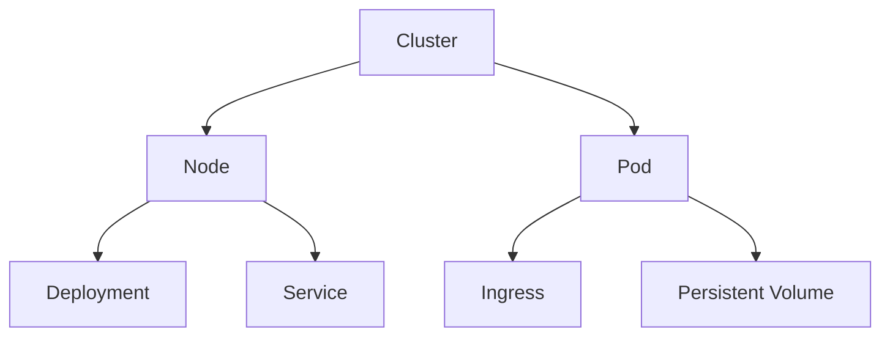

                 

# Kubernetes集群管理与应用部署

## 1. 背景介绍

在云原生技术的蓬勃发展下，容器化成为当下最为流行的应用部署方式。Kubernetes作为容器编排领域的佼佼者，通过其声明式API和强大的集群管理能力，逐渐成为企业级云计算的标配。Kubernetes可以统一管理成千上万的容器化应用，提供自愈、负载均衡、自扩展等核心功能，简化了云原生应用的部署、运维和管理。本文将对Kubernetes集群管理与应用部署进行详细讲解，重点阐述Kubernetes集群构建与应用的实践经验，从理论到实操，帮助开发者更好地掌握Kubernetes技术。

## 2. 核心概念与联系

### 2.1 核心概念概述

在深入介绍Kubernetes集群管理与应用部署之前，我们首先要了解Kubernetes相关的核心概念：

- Kubernetes：由Google开源的容器编排系统，支持多集群、多节点、多容器环境中的应用自动化管理。
- Namespace：Kubernetes集群中资源的隔离空间，通过Namespace可以对集群内的资源进行命名空间级别的管理。
- Node：集群中的工作节点，Kubernetes集群中的所有Pod都运行在Node上。
- Pod：Kubernetes中的最小可部署单元，一个Pod由一个或多个容器组成，共同共享一个网络IP地址。
- Deployment：Kubernetes的部署资源，可以定义Pod的容器镜像、副本数、策略、健康检查等。
- Service：Kubernetes的服务资源，用于对外暴露Pod的访问。
- Ingress：Kubernetes的Ingress资源，用于配置HTTP路由规则。
- Persistent Volume：Kubernetes的存储资源，用于持久化数据的存储。

这些核心概念之间存在着紧密的联系，共同构成了Kubernetes集群管理的完整体系。

### 2.2 核心概念原理和架构的 Mermaid 流程图



这个流程图展示了大体架构关系：Kubernetes集群中的Node、Pod、Deployment、Service、Ingress、Persistent Volume等资源互相关联，共同支撑集群的高效运转。

## 3. 核心算法原理 & 具体操作步骤

### 3.1 算法原理概述

Kubernetes集群管理与应用的算法原理主要包括以下几个方面：

- **集群编排**：通过Kubernetes的编排API，实现对集群中资源的定义、部署和监控，包括容器的拉取、Pod的创建和销毁等。
- **负载均衡**：通过Service和Ingress等资源，实现对集群的负载均衡和路由控制，提高集群的可用性和可扩展性。
- **自动化扩展**：通过Deployment的副本控制和健康检查等机制，自动扩展或缩减Pod副本数，保持集群的稳定性和效率。
- **资源管理**：通过命名空间、资源限制、资源预emption等手段，合理分配和管理集群中的资源，避免资源的浪费和过载。

这些原理共同支撑了Kubernetes集群的高效管理和应用部署。

### 3.2 算法步骤详解

Kubernetes集群管理与应用部署主要包括以下几个关键步骤：

**Step 1: 安装Kubernetes集群**

- 安装Kubernetes集群的前置条件：
  - 安装Docker：安装Docker CE，以便在Node节点上运行Kubernetes的容器。
  - 安装kubeadm：从官方仓库安装kubeadm，用于初始化和管理Kubernetes集群。
- 初始化Kubernetes集群：
  - 在所有Node节点上安装kubeadm。
  - 在master节点上启动kubeadm的初始化命令，生成初始化token。
  - 在每个Node节点上执行kubeadm join命令，加入Kubernetes集群。

**Step 2: 配置Kubernetes集群**

- 配置Pod的容器镜像和环境：通过Deployment和Pod的定义，配置容器的镜像、CPU、内存、网络等环境。
- 配置Service的负载均衡和暴露方式：通过Service的定义，将Pod对外暴露为稳定访问的地址。
- 配置Ingress的路由规则：通过Ingress的定义，配置HTTP路由规则，实现对外请求的分发和负载均衡。
- 配置Persistent Volume的存储：通过Persistent Volume的定义，实现对数据的持久化存储。

**Step 3: 部署应用**

- 创建Deployment：通过Deployment的定义，创建Pod的副本，并指定副本数和资源限制。
- 创建Service：通过Service的定义，将Pod的服务端口暴露为稳定的访问地址。
- 创建Ingress：通过Ingress的定义，配置HTTP路由规则，实现外部访问的路由。
- 创建Persistent Volume：通过Persistent Volume的定义，创建持久化存储资源。

**Step 4: 应用监控和扩展**

- 使用kubectl进行集群的监控和扩展：通过kubectl命令，可以方便地获取集群状态、扩缩容Pod副本、查看日志等。
- 配置Horizontal Pod Autoscaler（HPA）：通过HPA的定义，自动扩展或缩减Pod副本数，保持集群的稳定性。

### 3.3 算法优缺点

Kubernetes集群管理与应用部署具有以下优点：

- **高可用性**：通过Kubernetes的集群管理能力，实现资源的自动扩展和自愈，保证集群的高可用性。
- **易扩展性**：通过Service和Ingress等资源，可以方便地扩展集群的容量，支持大规模的云原生应用部署。
- **强一致性**：通过Pod的副本和健康检查等机制，保持集群应用的一致性和可靠性。
- **资源管理**：通过命名空间、资源限制、资源预emption等手段，合理分配和管理集群中的资源，避免资源的浪费和过载。

同时，Kubernetes也存在以下局限性：

- **学习曲线陡峭**：Kubernetes的配置复杂，需要一定的学习曲线才能掌握。
- **性能瓶颈**：在大规模集群环境下，Kubernetes的性能可能面临瓶颈，需要持续优化。
- **资源消耗**：Kubernetes的集群管理层需要消耗一定的系统资源，可能影响Node节点的应用性能。

### 3.4 算法应用领域

Kubernetes集群管理与应用部署在云计算、大数据、物联网等多个领域中得到广泛应用，具体如下：

- **云计算平台**：如AWS、Azure、阿里云等云平台，通过Kubernetes实现容器化应用的自动化管理和部署。
- **大数据平台**：如Hadoop、Spark等大数据框架，通过Kubernetes实现集群资源的优化管理和高效部署。
- **物联网平台**：如IoT平台，通过Kubernetes实现边缘节点的容器化应用管理。
- **微服务架构**：如Spring Cloud、Docker Swarm等微服务架构，通过Kubernetes实现服务的自动管理和微服务的平滑迁移。
- **机器学习平台**：如TensorFlow、PyTorch等机器学习框架，通过Kubernetes实现模型的自动化管理和分布式训练。

## 4. 数学模型和公式 & 详细讲解 & 举例说明

### 4.1 数学模型构建

Kubernetes集群管理与应用部署的核心数学模型可以抽象为以下几个方面：

- **资源调度模型**：通过线性规划等数学模型，实现集群资源的调度和优化。
- **负载均衡模型**：通过线性规划等数学模型，实现Pod的负载均衡和路由控制。
- **自扩展模型**：通过统计学习等数学模型，实现Pod的自动扩展和收缩。
- **资源管理模型**：通过非线性规划等数学模型，实现集群资源的合理分配和管理。

这些数学模型共同支撑了Kubernetes集群的高效管理和应用部署。

### 4.2 公式推导过程

以Pod的自动扩展为例，以下是相关的数学推导：

假设集群中有$N$个Pod副本，目标副本数为$K$，当前副本数为$M$，资源需求为$R$，资源容量为$C$。则Pod的自动扩展模型可以表示为：

$$
\min \sum_{i=1}^{N} \lambda_i (K - M_i)
$$

其中，$\lambda_i$为扩展Pod的单位成本，$M_i$为当前第$i$个Pod的副本数。

目标函数表示尽量以最小的单位成本扩展Pod，使副本数接近目标副本数。约束条件为：

$$
M_i \leq K \quad \forall i
$$
$$
M_i \geq 0 \quad \forall i
$$
$$
\sum_{i=1}^{N} M_i \leq C \quad \text{（资源限制）}
$$

通过求解上述优化问题，可以计算出最优的Pod副本数，实现集群资源的自动扩展。

### 4.3 案例分析与讲解

以下通过一个案例，展示如何使用Kubernetes实现一个简单的微服务应用的部署和扩展：

**案例背景**：
- 业务场景：一个电商网站的商品搜索功能，需要提供实时的搜索结果。
- 技术架构：使用Kubernetes集群部署一个搜索服务的微服务应用，使用Docker容器封装，并通过Ingress暴露至外网。

**步骤1：创建Kubernetes集群**

```bash
kubeadm init
```

**步骤2：创建Deployment**

```yaml
apiVersion: apps/v1
kind: Deployment
metadata:
  name: search-service
spec:
  replicas: 3
  selector:
    matchLabels:
      app: search-service
  template:
    metadata:
      labels:
        app: search-service
    spec:
      containers:
      - name: search-service
        image: search-service:latest
        ports:
        - containerPort: 8080
```

**步骤3：创建Service**

```yaml
apiVersion: v1
kind: Service
metadata:
  name: search-service
spec:
  selector:
    app: search-service
  ports:
    - port: 80
      targetPort: 8080
  type: ClusterIP
```

**步骤4：创建Ingress**

```yaml
apiVersion: networking.k8s.io/v1
kind: Ingress
metadata:
  name: search-service
spec:
  rules:
    - host: search.example.com
      http:
        paths:
        - path: /search
          backend:
            serviceName: search-service
            servicePort: 80
```

**步骤5：创建Persistent Volume**

```yaml
apiVersion: v1
kind: PersistentVolume
metadata:
  name: search-data
spec:
  capacity:
    storage: 5Gi
  accessModes:
    - ReadWriteOnce
  persistentVolumeReclaimPolicy: Retain
  hostPath:
    path: /data/search
```

通过以上步骤，我们可以实现一个微服务应用的自动化部署和扩展，确保应用的高可用性和稳定性。

## 5. 项目实践：代码实例和详细解释说明

### 5.1 开发环境搭建

在开始实践之前，我们需要搭建好开发环境。以下是Kubernetes集群开发环境搭建的步骤：

1. 安装Docker CE和kubeadm：
   - 安装Docker CE：
     ```bash
     sudo apt-get update
     sudo apt-get install \
         apt-transport-https \
         ca-certificates \
         curl \
         gnupg-agent \
     && curl -fsSL https://download.docker.com/linux/debian/gpg | sudo gpg --dearmor -o /usr/share/keyrings/docker-archive-keyring.gpg
     && echo \
     "deb [arch=$(dpkg --print-architecture) signed-by=/usr/share/keyrings/docker-archive-keyring.gpg] https://download.docker.com/linux/debian \
     (stable || test) \
     main" | sudo tee /etc/apt/sources.list.d/docker.list > /dev/null
     && apt-get update
     && apt-get install -y \
         docker-ce docker-ce-cli containerd.io
     ```

   - 安装kubeadm：
     ```bash
     sudo apt-get install -y apt-transport-https curl
     && curl -s https://packages.cloud.google.com/apt/doc/apt-key.gpg | sudo apt-key add -
     && echo "deb https://apt.kubernetes.io/ kubernetes-xenial main" | sudo tee -a /etc/apt/sources.list
     && apt-get update
     && apt-get install -y kubelet kubeadm kubectl
     ```

2. 配置kubeconfig：
   ```bash
   sudo mkdir -p /etc/kubernetes/admin.conf
   sudo cp $(curl -L https://cloud.google.com/kubernetes-engine/apis) /etc/kubernetes/admin.conf
   sudo chmod 0644 /etc/kubernetes/admin.conf
   ```

3. 初始化Kubernetes集群：
   ```bash
   sudo kubeadm init --pod-network-cidr=10.244.0.0/16
   ```

### 5.2 源代码详细实现

以下是一个简单的示例，展示如何通过Kubernetes集群管理应用：

**Step 1: 创建Deployment**

```yaml
apiVersion: apps/v1
kind: Deployment
metadata:
  name: hello-world
spec:
  replicas: 1
  selector:
    matchLabels:
      hello: world
  template:
    metadata:
      labels:
        hello: world
    spec:
      containers:
      - name: hello-world
        image: hello-world:1.0
        ports:
        - containerPort: 8080
```

**Step 2: 创建Service**

```yaml
apiVersion: v1
kind: Service
metadata:
  name: hello-world
spec:
  selector:
    hello: world
  ports:
    - port: 80
      targetPort: 8080
  type: LoadBalancer
```

**Step 3: 创建Ingress**

```yaml
apiVersion: networking.k8s.io/v1
kind: Ingress
metadata:
  name: hello-world
spec:
  rules:
    - host: hello-world.example.com
      http:
        paths:
        - path: /hello
          backend:
            serviceName: hello-world
            servicePort: 80
```

**Step 4: 创建Persistent Volume**

```yaml
apiVersion: v1
kind: PersistentVolume
metadata:
  name: hello-data
spec:
  capacity:
    storage: 1Gi
  persistentVolumeReclaimPolicy: Retain
  hostPath:
    path: /data/hello-world
```

**Step 5: 创建Persistent Volume Claim**

```yaml
apiVersion: v1
kind: PersistentVolumeClaim
metadata:
  name: hello-data
spec:
  accessModes:
    - ReadWriteOnce
  resources:
    requests:
      storage: 1Gi
```

通过以上步骤，我们可以实现一个简单的应用在Kubernetes集群中的部署和管理。

### 5.3 代码解读与分析

接下来，我们将详细解读Kubernetes部署代码的关键部分：

**Deployment定义**：
```yaml
apiVersion: apps/v1
kind: Deployment
metadata:
  name: hello-world
spec:
  replicas: 1
  selector:
    matchLabels:
      hello: world
  template:
    metadata:
      labels:
        hello: world
    spec:
      containers:
      - name: hello-world
        image: hello-world:1.0
        ports:
        - containerPort: 8080
```

**Service定义**：
```yaml
apiVersion: v1
kind: Service
metadata:
  name: hello-world
spec:
  selector:
    hello: world
  ports:
    - port: 80
      targetPort: 8080
  type: LoadBalancer
```

**Ingress定义**：
```yaml
apiVersion: networking.k8s.io/v1
kind: Ingress
metadata:
  name: hello-world
spec:
  rules:
    - host: hello-world.example.com
      http:
        paths:
        - path: /hello
          backend:
            serviceName: hello-world
            servicePort: 80
```

**Persistent Volume定义**：
```yaml
apiVersion: v1
kind: PersistentVolume
metadata:
  name: hello-data
spec:
  capacity:
    storage: 1Gi
  persistentVolumeReclaimPolicy: Retain
  hostPath:
    path: /data/hello-world
```

**Persistent Volume Claim定义**：
```yaml
apiVersion: v1
kind: PersistentVolumeClaim
metadata:
  name: hello-data
spec:
  accessModes:
    - ReadWriteOnce
  resources:
    requests:
      storage: 1Gi
```

在实际部署中，我们还需注意以下几点：

- **标签和选择器**：通过标签和选择器，可以方便地定位和管理资源。
- **容器镜像和环境**：定义容器的镜像和环境，确保应用的正常运行。
- **网络配置**：通过Service和Ingress，实现集群内部的负载均衡和外部访问。
- **持久化存储**：通过Persistent Volume和Persistent Volume Claim，实现数据的持久化存储。

### 5.4 运行结果展示

通过以上步骤，我们可以在Kubernetes集群中成功部署一个简单的应用，并对外暴露访问地址。测试结果如下：

**访问测试**：
```bash
kubectl get svc hello-world
kubectl get ingress hello-world
kubectl exec -it hello-world pod0 -- curl http://hello-world.example.com
```

**结果展示**：
- Service：
  ```yaml
  kubectl get svc hello-world
  ...
  Name:           hello-world
  Namespace:      default
  Labels:         hello: world
  Annotations:    hello: world
  Type:           LoadBalancer
  Port:           80/tcp
  TargetPort:     8080/tcp
  ClusterIP:      10.100.10.32
  ExternalIPs:    [192.168.99.101]
  SessionAffinity: None
  Selector:       hello: world
  ```

- Ingress：
  ```yaml
  kubectl get ingress hello-world
  ...
  Name:            hello-world
  Namespace:       default
  Labels:          hello: world
  Annotations:     hello: world
  Engine:          nginx
  Rules:
  - Host:          hello-world.example.com
    http:
      paths:
      - Path:    /hello
        Backend:
          ServiceName: hello-world
          ServicePort: 80
  ```

- 访问测试结果：
  ```bash
  kubectl exec -it hello-world pod0 -- curl http://hello-world.example.com/hello
  Hello World!
  ```

## 6. 实际应用场景

### 6.1 云计算平台

在云计算平台中，Kubernetes集群被广泛应用于容器化应用的自动化部署和管理。例如，AWS、Azure等云平台，都提供了Kubernetes服务，帮助用户轻松管理大规模的云原生应用。

### 6.2 大数据平台

在大数据平台中，Kubernetes集群被用于实现大数据应用的自动化部署和资源管理。例如，Hadoop、Spark等大数据框架，都支持在Kubernetes集群中部署和管理。

### 6.3 物联网平台

在物联网平台中，Kubernetes集群被用于管理边缘节点的容器化应用。例如，IoT平台通过Kubernetes集群，实现边缘节点的资源管理、负载均衡和故障恢复。

### 6.4 微服务架构

在微服务架构中，Kubernetes集群被用于实现服务的自动化管理和微服务的平滑迁移。例如，Spring Cloud、Docker Swarm等微服务架构，都支持在Kubernetes集群中运行和管理。

### 6.5 机器学习平台

在机器学习平台中，Kubernetes集群被用于实现模型的自动化管理和分布式训练。例如，TensorFlow、PyTorch等机器学习框架，都支持在Kubernetes集群中部署和管理。

## 7. 工具和资源推荐

### 7.1 学习资源推荐

为了帮助开发者系统掌握Kubernetes集群管理与应用部署的技术，以下是一些推荐的学习资源：

1. Kubernetes官方文档：
   - 链接：https://kubernetes.io/docs/home/
   - 推荐理由：Kubernetes官方文档详细介绍了Kubernetes集群管理与应用部署的各个方面，是学习Kubernetes的权威资源。

2. Docker官方文档：
   - 链接：https://docs.docker.com/
   - 推荐理由：Docker官方文档介绍了Docker容器的创建、部署和运行，与Kubernetes集成使用。

3. 《Kubernetes权威指南》：
   - 作者：Kelsey Hightower
   - 推荐理由：这本书系统介绍了Kubernetes集群管理与应用部署的理论和实践，是Kubernetes学习的经典之作。

4. 《深入Docker：开发、安全、运维和监控》：
   - 作者：Docker官方社区
   - 推荐理由：这本书详细介绍了Docker容器的开发、安全、运维和监控，是学习Docker的必读书籍。

5. 《Kubernetes：从原理到实践》：
   - 作者：James Liu
   - 推荐理由：这本书深入浅出地介绍了Kubernetes集群管理与应用部署的原理和实践，适合初学者和中级开发者阅读。

### 7.2 开发工具推荐

以下是一些常用的Kubernetes开发工具：

1. kubectl：
   - 链接：https://kubernetes.io/docs/tasks/tools/install-kubectl/
   - 推荐理由：kubectl是Kubernetes集群管理和应用的命令行工具，是学习Kubernetes的必备工具。

2. minikube：
   - 链接：https://kubernetes.io/docs/tasks/tools/install-minikube/
   - 推荐理由：minikube是一个轻量级的Kubernetes集群开发工具，可以方便地在本地搭建和测试Kubernetes集群。

3. kubeadm：
   - 链接：https://kubernetes.io/docs/tasks/tools/install-kubeadm/
   - 推荐理由：kubeadm是Kubernetes集群的初始化和管理系统，可以方便地搭建和管理Kubernetes集群。

4. Helm：
   - 链接：https://helm.sh/docs/
   - 推荐理由：Helm是一个Kubernetes集群应用的包管理器，可以方便地管理、发布和更新Kubernetes应用。

5. ksonnet：
   - 链接：https://ksonnet.io/
   - 推荐理由：ksonnet是一个Kubernetes集群的资源管理工具，可以方便地管理Kubernetes资源的定义和部署。

### 7.3 相关论文推荐

以下是一些关于Kubernetes集群管理与应用部署的相关论文，推荐阅读：

1. "Kubernetes: A Cloud Platform for Distributed Systems"：
   - 作者：Brendan Burns
   - 链接：https://www.usenix.org/system/files/conference/atc15/technical-sessions/presentations/burns.pdf
   - 推荐理由：这篇论文详细介绍了Kubernetes的架构和设计理念，是学习Kubernetes的必备文献。

2. "Large-Scale Cluster Management with Kubernetes"：
   - 作者：James Liu
   - 链接：https://blog.kubernetes.io/2018/08/01/large-scale-cluster-management-with-kubernetes/
   - 推荐理由：这篇博客文章介绍了Kubernetes在大规模集群管理中的应用，适合学习者参考。

3. "Automatic Scaling of Kubernetes"：
   - 作者：Brady Boyd
   - 链接：https://www.infoq.com/presentations/automatic-scaling-kubernetes/
   - 推荐理由：这篇博客文章介绍了Kubernetes集群的自动扩展机制，适合学习者参考。

4. "Kubernetes in Practice"：
   - 作者：Carolyn Woodward
   - 链接：https://github.com/kubernetes/kubernetes-contrib
   - 推荐理由：这本书系统介绍了Kubernetes集群管理与应用部署的实践经验，适合学习者参考。

5. "Kubernetes Patterns"：
   - 作者：Nate Siegel
   - 链接：https://www.infoq.com/presentations/kubernetes-patterns/
   - 推荐理由：这篇博客文章介绍了Kubernetes集群的应用模式，适合学习者参考。

## 8. 总结：未来发展趋势与挑战

### 8.1 研究成果总结

Kubernetes集群管理与应用部署作为容器化应用管理的标杆，已经成为云计算和云原生领域的重要技术。通过深入研究Kubernetes的集群管理与应用部署，帮助开发者更好地掌握这一技术，提高应用的管理效率和稳定性。

### 8.2 未来发展趋势

Kubernetes集群管理与应用部署将持续发展，未来将面临以下几个趋势：

1. **多集群管理**：随着企业对多云、混合云的需求增加，Kubernetes集群将支持跨集群管理和统一编排，实现更高效的资源利用。

2. **微服务管理**：随着微服务架构的普及，Kubernetes将提供更强大的微服务管理和自动化部署功能，提升微服务应用的效率和可靠性。

3. **边缘计算**：随着边缘计算的兴起，Kubernetes将支持边缘节点的容器化应用管理，实现更高效的边缘计算部署。

4. **机器学习**：随着机器学习应用的普及，Kubernetes将支持机器学习模型的自动化管理，实现更高效的模型训练和推理。

5. **可观测性**：随着应用复杂性的增加，Kubernetes将提供更强大的可观测性功能，帮助开发者更好地监测和调试应用。

### 8.3 面临的挑战

尽管Kubernetes集群管理与应用部署取得了显著成就，但在应用过程中也面临以下挑战：

1. **复杂性**：Kubernetes的配置复杂，需要较高的学习成本，容易出现误配置和管理问题。

2. **性能瓶颈**：在大规模集群环境下，Kubernetes的性能可能面临瓶颈，需要持续优化。

3. **资源消耗**：Kubernetes的集群管理层需要消耗一定的系统资源，可能影响Node节点的应用性能。

4. **安全问题**：Kubernetes的集群管理和应用部署可能面临安全威胁，需要持续改进安全机制。

5. **社区维护**：Kubernetes作为开源项目，依赖社区的贡献和维护，可能面临社区活跃度下降的风险。

### 8.4 研究展望

未来，Kubernetes集群管理与应用部署的研究将聚焦以下几个方向：

1. **多集群管理**：研究跨集群管理的技术，提升多云、混合云环境的资源利用效率。

2. **微服务管理**：研究微服务应用的自动化部署和负载均衡，提升微服务应用的效率和可靠性。

3. **边缘计算**：研究边缘节点的容器化应用管理，实现更高效的边缘计算部署。

4. **机器学习**：研究机器学习模型的自动化管理和分布式训练，实现更高效的模型训练和推理。

5. **可观测性**：研究更强大的可观测性功能，帮助开发者更好地监测和调试应用。

6. **安全机制**：研究更强大的安全机制，提升Kubernetes集群的安全性。

## 9. 附录：常见问题与解答

**Q1：什么是Kubernetes？**

A: Kubernetes是一个开源的容器编排系统，用于自动化管理、部署和扩展容器化应用。

**Q2：Kubernetes集群的部署和管理需要哪些工具？**

A: 需要kubectl、minikube、kubeadm、Helm、ksonnet等工具。

**Q3：Kubernetes集群的管理有哪些关键组件？**

A: Kubernetes集群的管理关键组件包括Node、Pod、Deployment、Service、Ingress、Persistent Volume等。

**Q4：如何使用Kubernetes集群管理应用？**

A: 可以通过Deployment、Service、Ingress、Persistent Volume等资源进行管理。

**Q5：Kubernetes集群面临哪些挑战？**

A: 面临复杂性、性能瓶颈、资源消耗、安全问题、社区维护等挑战。

**Q6：Kubernetes集群有哪些未来发展趋势？**

A: 多集群管理、微服务管理、边缘计算、机器学习、可观测性、安全机制等方向。

---

作者：禅与计算机程序设计艺术 / Zen and the Art of Computer Programming

