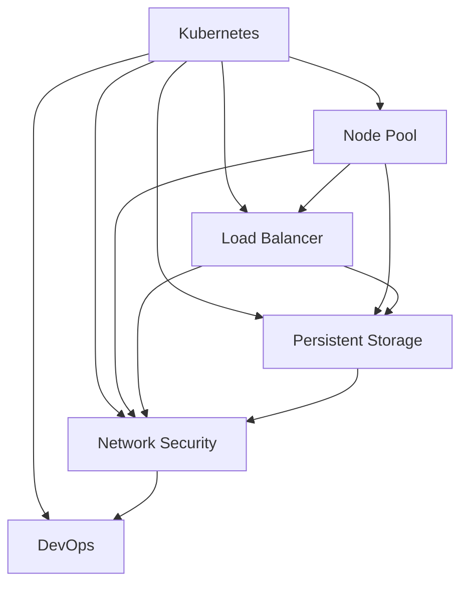

                 

# Kubernetes集群高可用部署方案

> 关键词：Kubernetes, 高可用性, 故障转移, 多节点部署, 负载均衡, 数据持久化, 网络安全, DevOps

## 1. 背景介绍

在当今的云计算环境中，Kubernetes已经成为了容器化应用部署和管理的最佳实践。Kubernetes（简称K8s）是一个开源的容器编排平台，由Google于2014年首次推出，目前是容器编排领域的领导者。K8s支持自动化运维、故障恢复、负载均衡、水平扩展等特性，能够显著提高云计算平台的效率和可靠性。

然而，高可用性一直是K8s部署和运维中的一大挑战。本文将从理论到实践，全面探讨如何构建高可用性的Kubernetes集群，确保应用在任何情况下都能保持稳定运行。

## 2. 核心概念与联系

### 2.1 核心概念概述

为更好地理解Kubernetes集群的高可用部署方案，本节将介绍几个关键概念：

- **Kubernetes**：一个开源的容器编排平台，用于自动化管理分布式应用。K8s通过抽象硬件资源，将容器化应用及其依赖项封装在Pod中，并通过调度器(Scheduler)和控制器(Controller)进行自动化部署和维护。
- **高可用性**：指系统在遇到硬件故障、软件错误或网络中断等异常情况下，依然能够继续正常工作。通过高可用性设计，可显著提升系统的可靠性和容错能力。
- **故障转移**：指当某个节点或组件发生故障时，系统能够自动切换到备份节点或组件，确保服务不中断。
- **多节点部署**：指将应用部署到多个节点上，以实现负载均衡和故障恢复。
- **负载均衡**：指通过分发请求到多个节点，确保应用不会因为单点故障而宕机。
- **数据持久化**：指将数据存储在可持久化的存储设备中，确保数据不会因为节点故障而丢失。
- **网络安全**：指通过网络策略、身份认证、授权等手段，保护集群和应用的安全。
- **DevOps**：一种软件开发运维实践，强调协作、自动化、持续交付和持续集成，是构建高可用系统的关键。

这些核心概念之间具有紧密联系，共同构成了Kubernetes集群高可用部署的基石。通过理解这些概念，我们可以更好地设计出高可靠、高性能的K8s集群。

### 2.2 核心概念原理和架构的 Mermaid 流程图



这个流程图展示了Kubernetes集群高可用部署的几个关键组件及其相互关系。

1. **Node Pool**：包含多个Kubernetes节点，负责承载应用容器。
2. **Load Balancer**：通过分发请求，实现负载均衡，确保应用在任何情况下都能稳定运行。
3. **Persistent Storage**：用于持久化数据，确保数据不会因为节点故障而丢失。
4. **Network Security**：通过网络策略、身份认证、授权等手段，保护集群和应用的安全。
5. **DevOps**：通过自动化、持续集成和持续交付，确保集群能够快速、稳定地扩展和更新。

这些组件通过Kubernetes的调度器和控制器进行协同工作，共同实现高可用性。

## 3. 核心算法原理 & 具体操作步骤

### 3.1 算法原理概述

Kubernetes集群高可用部署的核心算法原理主要包括以下几个方面：

- **故障检测与监控**：通过心跳检测、健康检查等手段，及时发现节点或组件的故障。
- **自动故障转移**：当检测到故障时，自动切换到备份节点或组件，确保应用不中断。
- **负载均衡**：通过轮询、加权、随机等方式，分发请求到多个节点，确保应用均衡运行。
- **数据持久化**：通过持久化存储设备，如本地磁盘、网络存储等，确保数据不会因为节点故障而丢失。
- **网络安全**：通过网络策略、身份认证、授权等手段，保护集群和应用的安全。
- **自动扩展与缩减**：根据负载情况，自动扩展或缩减节点数，确保应用始终处于最优状态。

### 3.2 算法步骤详解

下面详细讲解Kubernetes集群高可用部署的关键步骤：

**Step 1: 选择合适的Kubernetes架构**

- 根据应用需求，选择合适的K8s架构，如单集群、多集群、跨云等。
- 确定所需的节点数、CPU和内存等资源。

**Step 2: 配置Node Pool**

- 创建多个Node Pool，每个节点池包含多个Kubernetes节点。
- 配置每个节点池的标签、节点的CPU和内存等资源。

**Step 3: 配置Load Balancer**

- 配置Load Balancer，用于分发请求到多个节点。
- 配置Load Balancer的健康检查和心跳检测规则。

**Step 4: 配置Persistent Storage**

- 配置持久化存储设备，如本地磁盘、网络存储等。
- 配置存储卷(Persistent Volume)和存储卷声明(Persistent Volume Claim)。

**Step 5: 配置Network Security**

- 配置网络策略(Network Policy)，限制节点之间的访问。
- 配置身份认证和授权策略，确保集群和应用的安全。

**Step 6: 自动化运维**

- 配置自动化运维工具，如Prometheus、Grafana等，监控集群健康状态。
- 配置报警机制，及时发现并处理故障。

**Step 7: 定期备份与恢复**

- 定期备份集群和应用数据，确保数据不会丢失。
- 配置自动恢复机制，确保故障恢复。

**Step 8: 持续优化**

- 根据负载和应用需求，持续优化集群配置。
- 优化应用性能，提升用户体验。

### 3.3 算法优缺点

Kubernetes集群高可用部署方法具有以下优点：

- **高可靠性**：通过故障检测、自动故障转移和负载均衡等手段，确保应用在任何情况下都能稳定运行。
- **自动扩展与缩减**：根据负载情况，自动扩展或缩减节点数，确保应用始终处于最优状态。
- **网络安全**：通过网络策略、身份认证和授权等手段，保护集群和应用的安全。
- **自动化运维**：通过自动化工具，如Prometheus、Grafana等，确保集群始终处于健康状态。
- **灵活性**：可根据应用需求，选择不同的K8s架构和资源配置。

同时，该方法也存在以下局限性：

- **初始成本高**：构建高可用性集群需要一定的硬件资源和初始配置成本。
- **复杂性高**：需要配置和管理多个组件，运维复杂度较高。
- **性能损失**：负载均衡和自动故障转移等机制可能会带来一定的性能损失。
- **数据冗余**：为确保数据持久化和冗余，需要额外的存储空间。

尽管存在这些局限性，但就目前而言，Kubernetes集群高可用部署方法仍然是最主流和成熟的高可用性方案。

### 3.4 算法应用领域

Kubernetes集群高可用部署方法广泛应用于各种云计算和云原生环境中，具体包括：

- **云计算平台**：如AWS、Azure、Google Cloud等，支持多节点部署、负载均衡和自动扩展。
- **容器化应用**：如Docker、Kubernetes等，通过容器化技术实现高可用性。
- **微服务架构**：通过Kubernetes的微服务支持，实现服务自动发现、负载均衡和故障恢复。
- **DevOps实践**：通过自动化、持续集成和持续交付等DevOps实践，确保应用快速、稳定地部署和更新。

## 4. 数学模型和公式 & 详细讲解 & 举例说明

### 4.1 数学模型构建

Kubernetes集群高可用部署的数学模型主要包括以下几个方面：

- **节点故障率**：节点故障的概率。
- **负载均衡策略**：请求分配规则。
- **数据冗余度**：数据持久化和冗余策略。
- **网络策略**：节点之间的访问控制策略。
- **自动化运维指标**：监控和报警指标。

假设集群中有 $n$ 个节点，每个节点的故障率均为 $\lambda$，则节点总故障率为 $n\lambda$。

### 4.2 公式推导过程

节点总故障率计算公式为：

$$
n\lambda
$$

假设请求负载为 $L$，每个节点的计算能力为 $C$，则负载均衡策略为：

$$
L/C
$$

假设数据冗余度为 $r$，则数据持久化策略为：

$$
r\% × (n\lambda)
$$

假设节点之间的网络带宽为 $W$，则网络策略为：

$$
W/L
$$

假设自动化运维指标为 $K$，则监控和报警指标为：

$$
K/n
$$

### 4.3 案例分析与讲解

以某电商平台的订单处理系统为例，分析如何构建高可用性Kubernetes集群：

- **节点故障率**：假设集群中有 $N=50$ 个节点，每个节点的故障率 $\lambda=0.01$。则节点总故障率为 $50×0.01=0.5$。
- **负载均衡策略**：订单处理系统的负载为 $L=10000$，每个节点的计算能力为 $C=500$，则负载均衡策略为 $10000/500=20$，即将请求分配到每个节点的任务数为 $20$。
- **数据冗余度**：订单数据需要冗余备份，冗余度为 $r=2$，则数据持久化策略为 $2\% × (50×0.01)=0.1$，即数据持久化需要 $10\%$ 的额外存储空间。
- **网络策略**：节点之间的网络带宽为 $W=1Gbps$，则网络策略为 $1Gbps/10000=0.1$，即每个节点每秒需要传输 $0.1Gbps$ 的数据。
- **自动化运维指标**：使用Prometheus和Grafana进行监控，监控指标为 $K=200$，则监控和报警指标为 $200/50=4$，即每个节点每秒需要处理 $4$ 个监控指标。

根据以上计算，可以设计出满足电商订单处理系统的Kubernetes高可用性集群。

## 5. 项目实践：代码实例和详细解释说明

### 5.1 开发环境搭建

在进行Kubernetes集群高可用部署实践前，我们需要准备好开发环境。以下是使用Kubernetes、Docker和Prometheus搭建高可用性集群的步骤：

1. 安装Kubernetes：可以使用Minikube或KubeVx等工具搭建本地Kubernetes集群。
2. 安装Docker：使用Docker引擎进行容器化应用部署。
3. 安装Prometheus：用于监控集群健康状态和报警。

完成上述步骤后，即可在本地环境进行高可用性集群的部署和运维。

### 5.2 源代码详细实现

下面以配置Persistent Storage为例，给出Kubernetes集群高可用部署的代码实现。

**Persistent Storage配置**

```yaml
# 定义持久化存储卷(Persistent Volume)
apiVersion: v1
kind: PersistentVolume
metadata:
  name: pv-data
spec:
  capacity:
    storage: 10Gi
  accessModes:
    - ReadWriteOnce
  hostPath:
    path: /var/lib/kubelet/pv-data
  storageClass: local
```

**Persistent Volume Claim配置**

```yaml
# 定义持久化存储卷声明(Persistent Volume Claim)
apiVersion: v1
kind: PersistentVolumeClaim
metadata:
  name: pvc-data
spec:
  accessModes:
    - ReadWriteOnce
  resources:
    requests:
      storage: 2Gi
  volumeName: pv-data
```

**Pod配置**

```yaml
# 定义Pod配置
apiVersion: v1
kind: Pod
metadata:
  name: my-app
spec:
  containers:
    - name: my-app-container
      image: my-app-image:latest
      ports:
        - containerPort: 8080
      resources:
        requests:
          cpu: "1"
          memory: "512Mi"
      volumeMounts:
        - name: pv-data
          mountPath: /data
```

**Deployment配置**

```yaml
# 定义Deployment配置
apiVersion: apps/v1
kind: Deployment
metadata:
  name: my-app-deployment
spec:
  replicas: 3
  selector:
    matchLabels:
      app: my-app
  template:
    metadata:
      labels:
        app: my-app
    spec:
      containers:
        - name: my-app-container
          image: my-app-image:latest
          ports:
            - containerPort: 8080
          resources:
            requests:
              cpu: "1"
              memory: "512Mi"
          volumeMounts:
            - name: pv-data
              mountPath: /data
  volumeClaimTemplate:
    metadata:
      name: pv-data
      labels:
        app: my-app
```

通过以上配置，我们可以将应用容器挂载到持久化存储卷上，确保数据不会因为节点故障而丢失。

### 5.3 代码解读与分析

**Persistent Storage配置**

- `capacity`：指定存储卷的容量大小。
- `accessModes`：指定存储卷的访问模式。
- `hostPath`：指定存储卷的挂载路径。
- `storageClass`：指定存储卷的存储类别。

**Persistent Volume Claim配置**

- `accessModes`：指定存储卷声明的访问模式。
- `resources`：指定存储卷声明的资源需求。
- `volumeName`：指定存储卷的名称。

**Pod配置**

- `containerPort`：指定容器暴露的端口号。
- `resources`：指定容器的资源需求。
- `volumeMounts`：指定容器挂载的存储卷。

**Deployment配置**

- `replicas`：指定Pod的副本数。
- `selector`：指定Pod的标签选择器。
- `template`：指定Pod的模板配置。
- `volumeClaimTemplate`：指定持久化存储卷声明的模板配置。

### 5.4 运行结果展示

配置完成后，可以通过Kubectl命令行工具访问持久化存储卷，确认数据是否成功挂载：

```bash
kubectl exec my-app-deployment-0 -- ls /data
```

## 6. 实际应用场景

### 6.1 金融行业

在金融行业，高可用性Kubernetes集群能够有效支持实时交易和处理高并发请求，确保数据的安全性和一致性。通过负载均衡和故障转移，金融应用能够在任何情况下都能稳定运行，提升客户体验和服务质量。

### 6.2 电子商务

电子商务平台需要处理海量订单和支付请求，高可用性Kubernetes集群能够支持多节点部署和负载均衡，确保应用在高并发情况下稳定运行。通过持久化存储和自动备份，订单数据能够安全保存，避免因节点故障而丢失。

### 6.3 物联网

物联网设备众多，数据量大，高可用性Kubernetes集群能够支持海量数据存储和处理，确保数据不会因节点故障而丢失。通过负载均衡和故障转移，物联网应用能够在任何情况下都能稳定运行，提升数据采集和处理效率。

### 6.4 未来应用展望

随着Kubernetes的持续演进和生态系统的不断完善，Kubernetes集群高可用部署方法将广泛应用于各种云计算和云原生环境中，为应用提供更可靠、更高效的运维保障。未来，Kubernetes将进一步支持边缘计算、微服务治理、自动调度和资源管理等特性，构建更强大、更智能的云原生基础设施。

## 7. 工具和资源推荐

### 7.1 学习资源推荐

为了帮助开发者系统掌握Kubernetes集群高可用部署的理论基础和实践技巧，这里推荐一些优质的学习资源：

1. Kubernetes官方文档：Kubernetes官方提供的详尽文档，涵盖K8s的各个方面，包括安装、部署、运维和管理。
2. Kubernetes权威指南：一本全面介绍Kubernetes的书籍，涵盖K8s的各个组件和技术细节。
3. Kubernetes实战教程：通过实际案例，详细介绍K8s的安装、部署和运维过程。
4. Kubernetes架构设计：深入分析Kubernetes的架构设计，帮助你理解其核心原理。
5. Kubernetes高级特性：介绍K8s的高级特性，如分布式系统、自治计算和微服务治理等。

通过对这些资源的学习实践，相信你一定能够快速掌握Kubernetes集群高可用部署的精髓，并用于解决实际的运维问题。

### 7.2 开发工具推荐

高效的开发离不开优秀的工具支持。以下是几款用于Kubernetes集群高可用部署开发的常用工具：

1. Kubectl：Kubernetes命令行客户端，用于管理和操作K8s集群。
2. Helm：Kubernetes包管理器，用于部署和管理K8s应用。
3. KubeVx：Kubernetes可视化管理工具，提供图形化界面，方便运维管理。
4. Portworx：Kubernetes存储解决方案，提供数据持久化和备份功能。
5. Weave Net：Kubernetes网络解决方案，提供网络策略和负载均衡功能。

合理利用这些工具，可以显著提升Kubernetes集群高可用部署的开发效率，加快创新迭代的步伐。

### 7.3 相关论文推荐

Kubernetes集群高可用部署技术的发展源于学界的持续研究。以下是几篇奠基性的相关论文，推荐阅读：

1. Kubernetes: Container Orchestration for Google Cloud：介绍Kubernetes的设计思想和核心特性。
2. Deploying Kubernetes Clusters on Azure: A Simple Guide：介绍在Azure上部署Kubernetes集群的最佳实践。
3. Deploying Kubernetes on AWS：介绍在AWS上部署Kubernetes集群的最佳实践。
4. Kubernetes for Dummies：一本Kubernetes入门指南，适合初学者阅读。
5. Kubernetes: An Overview of Architecture, Deployment, and Usage：详细介绍Kubernetes的架构设计、部署和使用方法。

这些论文代表了大规模容器化部署的技术前沿，通过学习这些前沿成果，可以帮助研究者把握学科前进方向，激发更多的创新灵感。

## 8. 总结：未来发展趋势与挑战

### 8.1 研究成果总结

本文对Kubernetes集群高可用部署方法进行了全面系统的介绍。首先阐述了Kubernetes集群高可用部署的研究背景和意义，明确了高可用性设计在云计算中的重要性。其次，从原理到实践，详细讲解了Kubernetes集群高可用部署的数学模型和具体操作步骤，给出了高可用性集群的完整配置方法。同时，本文还广泛探讨了Kubernetes集群在高可用性、可靠性、可扩展性等方面的应用前景，展示了Kubernetes集群在各行各业中的巨大潜力。

通过本文的系统梳理，可以看到，Kubernetes集群高可用部署方法已经成为云计算和云原生应用的重要基础设施，显著提升了应用的可靠性和运维效率。未来，伴随Kubernetes的持续演进和生态系统的不断完善，Kubernetes集群将迎来更加广泛的应用场景和更高的性能要求。

### 8.2 未来发展趋势

展望未来，Kubernetes集群高可用部署技术将呈现以下几个发展趋势：

1. **容器化应用普及**：随着容器化技术的普及，越来越多的应用将部署在Kubernetes集群上，带来更高的运维需求。
2. **云原生生态系统完善**：Kubernetes的生态系统将进一步完善，涵盖更多的云原生技术，如微服务、分布式系统、自治计算等。
3. **边缘计算支持**：Kubernetes将支持边缘计算，提供在边缘设备上的应用部署和运维能力。
4. **自动调度和资源管理**：Kubernetes将进一步支持自动调度和资源管理，优化集群资源利用率。
5. **可观测性提升**：通过更好的监控和报警机制，提升Kubernetes集群的可观测性，确保应用始终处于健康状态。

### 8.3 面临的挑战

尽管Kubernetes集群高可用部署技术已经取得了瞩目成就，但在迈向更加智能化、普适化应用的过程中，它仍面临着诸多挑战：

1. **复杂性高**：Kubernetes集群配置和管理复杂，需要一定的运维经验。
2. **学习成本高**：需要掌握大量的配置和操作命令，学习成本较高。
3. **性能损失**：负载均衡和自动故障转移等机制可能会带来一定的性能损失。
4. **安全风险高**：Kubernetes集群的配置不当可能会带来安全风险，需要加强安全防护。

尽管存在这些挑战，但就目前而言，Kubernetes集群高可用部署方法仍然是最主流和成熟的高可用性方案。

### 8.4 研究展望

面对Kubernetes集群高可用部署所面临的种种挑战，未来的研究需要在以下几个方面寻求新的突破：

1. **自动化运维**：通过自动化工具，如Prometheus、Grafana等，确保集群始终处于健康状态。
2. **容器编排优化**：通过优化容器编排工具，如Kubernetes，提升集群的扩展性和伸缩性。
3. **边缘计算支持**：通过支持边缘计算，提升应用在边缘设备的部署和运维能力。
4. **安全防护**：通过网络策略、身份认证和授权等手段，保护集群和应用的安全。
5. **数据持久化优化**：通过优化持久化存储方案，提升数据的安全性和可靠性。

这些研究方向的探索，必将引领Kubernetes集群高可用部署技术迈向更高的台阶，为构建安全、可靠、高效的云原生系统铺平道路。面向未来，Kubernetes集群高可用部署技术还需要与其他云计算技术进行更深入的融合，共同推动云计算和云原生应用的发展。只有勇于创新、敢于突破，才能不断拓展云原生基础设施的边界，让应用在各个领域中大放异彩。

## 9. 附录：常见问题与解答

**Q1：如何设计Kubernetes集群高可用部署方案？**

A: 设计Kubernetes集群高可用部署方案，需要考虑以下几个方面：
1. **节点数和资源配置**：根据应用需求，选择适当的节点数和资源配置。
2. **负载均衡策略**：选择合适的负载均衡算法，如轮询、加权等。
3. **数据持久化和冗余策略**：配置持久化存储卷和数据冗余备份。
4. **网络策略**：配置网络策略，限制节点之间的访问。
5. **自动化运维**：配置监控和报警机制，确保集群始终处于健康状态。

**Q2：Kubernetes集群高可用部署的优缺点有哪些？**

A: Kubernetes集群高可用部署的优点包括：
1. **高可靠性**：通过故障检测、自动故障转移和负载均衡等手段，确保应用在任何情况下都能稳定运行。
2. **自动扩展与缩减**：根据负载情况，自动扩展或缩减节点数，确保应用始终处于最优状态。
3. **网络安全**：通过网络策略、身份认证和授权等手段，保护集群和应用的安全。
4. **自动化运维**：通过自动化工具，如Prometheus、Grafana等，确保集群始终处于健康状态。

缺点包括：
1. **初始成本高**：构建高可用性集群需要一定的硬件资源和初始配置成本。
2. **复杂性高**：需要配置和管理多个组件，运维复杂度较高。
3. **性能损失**：负载均衡和自动故障转移等机制可能会带来一定的性能损失。
4. **数据冗余**：为确保数据持久化和冗余，需要额外的存储空间。

**Q3：如何应对Kubernetes集群的复杂性和学习成本？**

A: 应对Kubernetes集群的复杂性和学习成本，可以从以下几个方面入手：
1. **使用管理工具**：使用如KubeVx、Helm等管理工具，简化配置和管理流程。
2. **官方文档和教程**：参考Kubernetes官方文档和教程，逐步掌握核心配置和管理命令。
3. **实践经验**：通过实际操作和调试，积累运维经验，提升对Kubernetes集群的理解。
4. **社区支持**：加入Kubernetes社区，参与讨论和学习，获取专家和同行支持。

**Q4：如何优化Kubernetes集群的性能？**

A: 优化Kubernetes集群的性能，可以从以下几个方面入手：
1. **优化调度策略**：通过优化调度器，提升应用部署和扩展效率。
2. **优化负载均衡**：选择合适的负载均衡算法，减少资源浪费。
3. **优化存储方案**：使用高性能的存储设备和分布式存储方案，提升数据访问速度和可靠性。
4. **优化网络策略**：优化网络带宽和延迟，提升节点之间的通信效率。
5. **优化监控和报警**：通过优化监控和报警机制，及时发现并处理性能问题。

通过以上优化，可以显著提升Kubernetes集群的性能和稳定性。

**Q5：如何保障Kubernetes集群的安全性？**

A: 保障Kubernetes集群的安全性，可以从以下几个方面入手：
1. **网络策略**：配置网络策略，限制节点之间的访问。
2. **身份认证和授权**：使用RBAC等机制，确保集群和应用的安全。
3. **监控和报警**：通过监控和报警机制，及时发现并处理安全问题。
4. **安全加固**：使用安全加固工具，如Kube-bench，对集群进行漏洞扫描和修复。
5. **最小权限原则**：遵循最小权限原则，限制用户的权限和访问范围。

通过以上措施，可以显著提升Kubernetes集群的的安全性，确保集群和应用的安全运行。

---

作者：禅与计算机程序设计艺术 / Zen and the Art of Computer Programming

