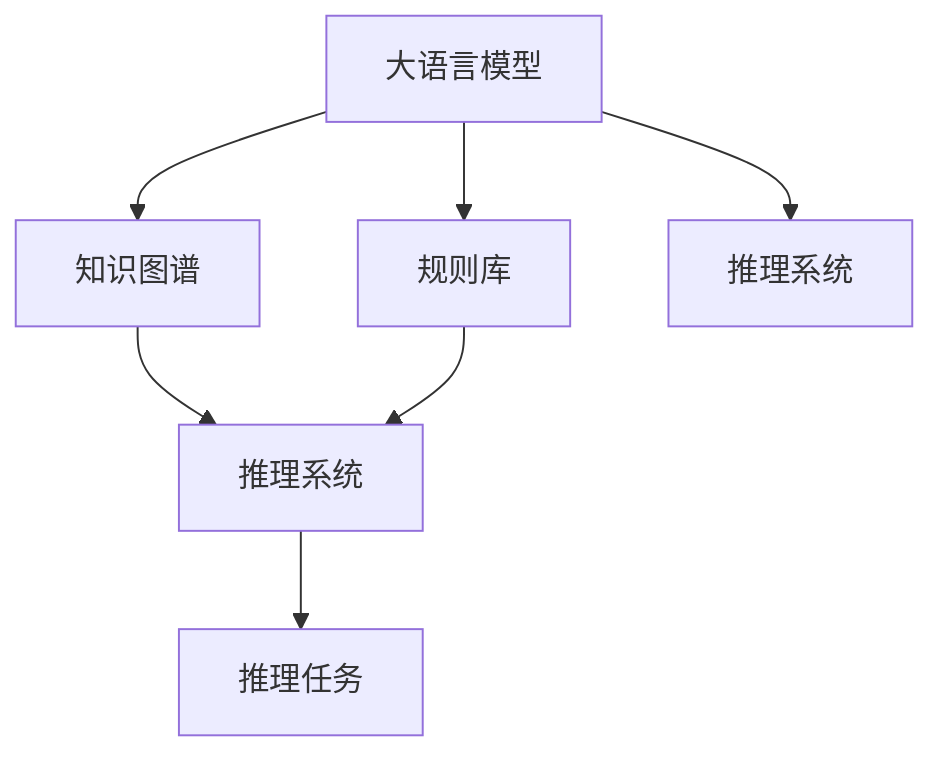

                 

# LLM AS RS方法

> 关键词：大语言模型(Large Language Model, LLM), 自然语言推理(Natural Language Inference, NLI), 推理系统(Rule-based System, RS), 语言知识, 模型推理, 数据驱动

## 1. 背景介绍

### 1.1 问题由来

近年来，随着深度学习技术的发展，基于预训练的语言模型在自然语言处理（Natural Language Processing, NLP）领域取得了显著进步。尤其是大规模预训练模型，如BERT、GPT、T5等，通过在海量无标注文本数据上进行预训练，获取了丰富的语言知识和能力。但这些模型往往缺乏对语言规则的深刻理解，无法处理某些需要推理能力的任务，如自然语言推理（Natural Language Inference, NLI）、问答、逻辑推断等。

自然语言推理（NLI）作为NLP的重要子任务，是指对自然语言文本中的逻辑关系进行推断和验证。常见的任务包括判断两个句子之间的逻辑蕴含关系、矛盾关系、中立关系等。传统上，NLI通常依赖于规则驱动的推理系统（Rule-based System, RS），通过预先定义的语法、逻辑规则来推断语义关系。然而，规则驱动的推理系统难以处理模糊和复杂的语言表达，并且需要大量的人工规则编写和维护工作。

为了克服这些缺点，近年来学术界和工业界开始探索将大语言模型应用于NLI任务，以期利用其强大的语言理解和生成能力，实现更加智能和高效的推理。然而，由于大语言模型缺乏对语言规则的系统理解，直接应用于NLI任务的效果往往不尽如人意。因此，本文提出一种基于大语言模型（Large Language Model, LLM）的自然语言推理方法，旨在结合语言知识和模型推理，提升NLI任务的推理能力。

### 1.2 问题核心关键点

本文的核心问题是如何在大语言模型中嵌入和应用语言知识，以便在推理任务中更准确地推断逻辑关系。具体而言，本文提出的方法基于大语言模型构建推理系统（LLM AS RS），利用语言知识图谱（Knowledge Graph）和规则库（Rule Base）作为先验知识，通过微调（Fine-tuning）和强化学习（Reinforcement Learning, RL）相结合的方式，提升模型的推理能力。

## 2. 核心概念与联系

### 2.1 核心概念概述

为更好地理解基于大语言模型的自然语言推理方法，本节将介绍几个关键概念：

- 大语言模型（LLM）：以自回归（如GPT）或自编码（如BERT）模型为代表的大规模预训练语言模型。通过在海量无标注文本数据上进行预训练，学习通用的语言表示，具备强大的语言理解和生成能力。

- 自然语言推理（NLI）：对自然语言文本中的逻辑关系进行推断和验证。常见任务包括判断两个句子之间的逻辑蕴含关系、矛盾关系、中立关系等。

- 推理系统（RS）：通过预定义的语法、逻辑规则来推断语义关系。RS依赖人工编写的规则，难以处理模糊和复杂的语言表达。

- 知识图谱（KG）：结构化的语义知识库，以实体、关系和属性为基本元素，用于描述实体之间的语义关系。

- 规则库（Rule Base）：定义和存储推理规则的集合，用于指导推理过程。

这些核心概念之间的逻辑关系可以通过以下Mermaid流程图来展示：



这个流程图展示了大语言模型（LLM）如何通过结合知识图谱（KG）和规则库（Rule Base），构建推理系统（RS），最终应用于推理任务（Fine-tuning + Reinforcement Learning）。

## 3. 核心算法原理 & 具体操作步骤
### 3.1 算法原理概述

基于大语言模型的自然语言推理方法，本质上是一种结合语言知识和大模型推理的混合推理系统。其核心思想是：将知识图谱和规则库中的语言知识与大语言模型进行结合，通过微调和强化学习的方式，优化模型对语言逻辑关系的推断能力。

形式化地，假设大语言模型为 $M_{\theta}$，其中 $\theta$ 为模型参数。知识图谱为 $K$，规则库为 $R$。推理任务为 $T$，表示两个自然语言句子之间的逻辑关系。

模型推理过程如下：
1. 输入推理任务 $T$，将其映射到知识图谱 $K$ 和规则库 $R$ 中。
2. 在知识图谱和规则库的指导下，使用大语言模型 $M_{\theta}$ 生成推理路径和推理结论。
3. 将推理结果与真实标签进行比较，计算损失函数。
4. 通过微调和强化学习的方式，更新模型参数 $\theta$，最小化损失函数，提升推理能力。

### 3.2 算法步骤详解

基于大语言模型的自然语言推理方法，通常包括以下几个关键步骤：

**Step 1: 构建知识图谱和规则库**
- 收集和构建知识图谱 $K$，以描述实体、关系和属性等语义信息。
- 定义和存储规则库 $R$，包含推理规则和约束条件。

**Step 2: 引入推理任务**
- 定义推理任务 $T$，如判断两个句子之间的逻辑关系。
- 将推理任务 $T$ 映射到知识图谱 $K$ 和规则库 $R$ 中，提取必要的语义信息和规则。

**Step 3: 设计推理模型**
- 在知识图谱和规则库的指导下，设计推理模型 $M_{\theta}$。
- 对于推理任务，通常可以使用注意力机制（Attention）和自回归模型（Autoregressive Model）来处理输入文本和推理路径。

**Step 4: 微调和强化学习**
- 在推理任务上，使用微调（Fine-tuning）和强化学习（Reinforcement Learning）相结合的方式，优化推理模型的参数。
- 通过微调，模型学习任务相关的语言表示，优化推理路径。
- 通过强化学习，模型学习推理任务中的逻辑规则，提升推理准确性。

**Step 5: 评估和部署**
- 在推理测试集上评估推理模型的性能，使用准确率、精确率、召回率等指标。
- 部署推理模型，供实际应用系统使用。
- 持续收集新数据，定期重新微调和训练模型，以适应数据分布的变化。

以上是基于大语言模型的自然语言推理方法的一般流程。在实际应用中，还需要根据具体任务的特点，对推理模型进行优化设计，如改进推理路径、引入更多逻辑规则、设计更有效的损失函数等，以进一步提升模型性能。

### 3.3 算法优缺点

基于大语言模型的自然语言推理方法具有以下优点：
1. 结合语言知识和模型推理，可以有效提升推理能力。
2. 可以利用大规模语料进行预训练，获取丰富的语言知识。
3. 具有较强的泛化能力，可以处理模糊和复杂的语言表达。
4. 可以利用知识图谱和规则库进行推理路径优化。

同时，该方法也存在一定的局限性：
1. 依赖于知识图谱和规则库的构建，获取高质量的语义信息和推理规则需要大量的时间和资源。
2. 大语言模型的推理速度较慢，难以实时处理大规模推理任务。
3. 推理结果可能受到知识图谱和规则库的限制，无法处理未知或新出现的语义关系。

尽管存在这些局限性，但就目前而言，基于大语言模型的自然语言推理方法仍是大语言模型应用的重要范式。未来相关研究的重点在于如何进一步优化知识图谱和规则库的构建，提高推理模型的实时性和泛化能力，同时兼顾推理结果的准确性和解释性。

### 3.4 算法应用领域

基于大语言模型的自然语言推理方法在NLP领域已经得到了广泛的应用，覆盖了以下多个应用领域：

- 问答系统：对自然语言问题进行推理和回答。将问题-答案对作为推理任务，训练推理模型。
- 对话系统：使机器能够与人进行自然对话，推断对话逻辑。
- 自然语言生成：生成符合逻辑关系的新文本。
- 信息抽取：从文本中抽取实体关系。
- 情感分析：判断文本中的情感倾向。
- 命名实体识别：识别文本中的人名、地名、机构名等特定实体。

除了上述这些经典任务外，基于大语言模型的自然语言推理方法也被创新性地应用于更多场景中，如知识图谱构建、智能推荐、社交网络分析等，为NLP技术带来了新的应用方向。

## 4. 数学模型和公式 & 详细讲解 & 举例说明
### 4.1 数学模型构建

本节将使用数学语言对基于大语言模型的自然语言推理方法进行更加严格的刻画。

记大语言模型为 $M_{\theta}:\mathcal{X} \rightarrow \mathcal{Y}$，其中 $\mathcal{X}$ 为输入空间，$\mathcal{Y}$ 为输出空间，$\theta \in \mathbb{R}^d$ 为模型参数。知识图谱为 $K$，规则库为 $R$。推理任务为 $T$，表示两个自然语言句子之间的逻辑关系。

定义推理模型的损失函数为 $\mathcal{L}(\theta)$，其中 $\theta$ 为模型参数，$T$ 为推理任务。推理任务的标注数据集为 $D=\{(x_i, y_i)\}_{i=1}^N, x_i \in \mathcal{X}, y_i \in \{蕴含,矛盾,中立\}$。

推理任务的损失函数定义为：

$$
\mathcal{L}(\theta) = \frac{1}{N}\sum_{i=1}^N \ell(T_i, M_{\theta}(x_i))
$$

其中 $\ell(T_i, M_{\theta}(x_i))$ 为推理任务的损失函数，通常使用交叉熵损失函数。

### 4.2 公式推导过程

以下我们以判断两个句子之间是否蕴含关系为例，推导交叉熵损失函数及其梯度的计算公式。

假设模型 $M_{\theta}$ 在输入 $x$ 上的输出为 $\hat{y}=M_{\theta}(x) \in [0,1]$，表示样本属于蕴含关系的概率。真实标签 $y \in \{蕴含,矛盾,中立\}$。则蕴含关系交叉熵损失函数定义为：

$$
\ell(M_{\theta}(x),y) = -[y\log \hat{y} + (1-y)\log (1-\hat{y})]
$$

将其代入推理任务的损失函数公式，得：

$$
\mathcal{L}(\theta) = -\frac{1}{N}\sum_{i=1}^N [y_i\log M_{\theta}(x_i)+(1-y_i)\log(1-M_{\theta}(x_i))]
$$

根据链式法则，损失函数对参数 $\theta_k$ 的梯度为：

$$
\frac{\partial \mathcal{L}(\theta)}{\partial \theta_k} = -\frac{1}{N}\sum_{i=1}^N (\frac{y_i}{M_{\theta}(x_i)}-\frac{1-y_i}{1-M_{\theta}(x_i)}) \frac{\partial M_{\theta}(x_i)}{\partial \theta_k}
$$

其中 $\frac{\partial M_{\theta}(x_i)}{\partial \theta_k}$ 可进一步递归展开，利用自动微分技术完成计算。

在得到损失函数的梯度后，即可带入参数更新公式，完成模型的迭代优化。重复上述过程直至收敛，最终得到适应推理任务的最优模型参数 $\theta^*$。

## 5. 项目实践：代码实例和详细解释说明
### 5.1 开发环境搭建

在进行自然语言推理实践前，我们需要准备好开发环境。以下是使用Python进行PyTorch开发的环境配置流程：

1. 安装Anaconda：从官网下载并安装Anaconda，用于创建独立的Python环境。

2. 创建并激活虚拟环境：
```bash
conda create -n pytorch-env python=3.8 
conda activate pytorch-env
```

3. 安装PyTorch：根据CUDA版本，从官网获取对应的安装命令。例如：
```bash
conda install pytorch torchvision torchaudio cudatoolkit=11.1 -c pytorch -c conda-forge
```

4. 安装Transformers库：
```bash
pip install transformers
```

5. 安装各类工具包：
```bash
pip install numpy pandas scikit-learn matplotlib tqdm jupyter notebook ipython
```

完成上述步骤后，即可在`pytorch-env`环境中开始自然语言推理实践。

### 5.2 源代码详细实现

下面我们以判断句子蕴含关系为例，给出使用Transformers库对BERT模型进行自然语言推理的PyTorch代码实现。

首先，定义推理任务的数据处理函数：

```python
from transformers import BertTokenizer
from torch.utils.data import Dataset
import torch

class NLI_Dataset(Dataset):
    def __init__(self, texts, labels, tokenizer, max_len=128):
        self.texts = texts
        self.labels = labels
        self.tokenizer = tokenizer
        self.max_len = max_len
        
    def __len__(self):
        return len(self.texts)
    
    def __getitem__(self, item):
        texts = self.texts[item]
        labels = self.labels[item]
        
        encoding = self.tokenizer(texts, return_tensors='pt', max_length=self.max_len, padding='max_length', truncation=True)
        input_ids = encoding['input_ids'][0]
        attention_mask = encoding['attention_mask'][0]
        
        # 对标签进行编码
        encoded_labels = [1 if label == '蕴含' else 0 for label in labels] 
        encoded_labels.extend([0] * (self.max_len - len(encoded_labels)))
        labels = torch.tensor(encoded_labels, dtype=torch.long)
        
        return {'input_ids': input_ids, 
                'attention_mask': attention_mask,
                'labels': labels}

# 标签与id的映射
label2id = {'蕴含': 1, '矛盾': 0, '中立': 2}
id2label = {v: k for k, v in label2id.items()}

# 创建dataset
tokenizer = BertTokenizer.from_pretrained('bert-base-cased')

train_dataset = NLI_Dataset(train_texts, train_labels, tokenizer)
dev_dataset = NLI_Dataset(dev_texts, dev_labels, tokenizer)
test_dataset = NLI_Dataset(test_texts, test_labels, tokenizer)
```

然后，定义模型和优化器：

```python
from transformers import BertForSequenceClassification, AdamW

model = BertForSequenceClassification.from_pretrained('bert-base-cased', num_labels=3)

optimizer = AdamW(model.parameters(), lr=2e-5)
```

接着，定义训练和评估函数：

```python
from torch.utils.data import DataLoader
from tqdm import tqdm
from sklearn.metrics import classification_report

device = torch.device('cuda') if torch.cuda.is_available() else torch.device('cpu')
model.to(device)

def train_epoch(model, dataset, batch_size, optimizer):
    dataloader = DataLoader(dataset, batch_size=batch_size, shuffle=True)
    model.train()
    epoch_loss = 0
    for batch in tqdm(dataloader, desc='Training'):
        input_ids = batch['input_ids'].to(device)
        attention_mask = batch['attention_mask'].to(device)
        labels = batch['labels'].to(device)
        model.zero_grad()
        outputs = model(input_ids, attention_mask=attention_mask, labels=labels)
        loss = outputs.loss
        epoch_loss += loss.item()
        loss.backward()
        optimizer.step()
    return epoch_loss / len(dataloader)

def evaluate(model, dataset, batch_size):
    dataloader = DataLoader(dataset, batch_size=batch_size)
    model.eval()
    preds, labels = [], []
    with torch.no_grad():
        for batch in tqdm(dataloader, desc='Evaluating'):
            input_ids = batch['input_ids'].to(device)
            attention_mask = batch['attention_mask'].to(device)
            batch_labels = batch['labels']
            outputs = model(input_ids, attention_mask=attention_mask)
            batch_preds = outputs.logits.argmax(dim=2).to('cpu').tolist()
            batch_labels = batch_labels.to('cpu').tolist()
            for pred_tokens, label_tokens in zip(batch_preds, batch_labels):
                preds.append(pred_tokens[:len(label_tokens)])
                labels.append(label_tokens)
                
    print(classification_report(labels, preds))
```

最后，启动训练流程并在测试集上评估：

```python
epochs = 5
batch_size = 16

for epoch in range(epochs):
    loss = train_epoch(model, train_dataset, batch_size, optimizer)
    print(f"Epoch {epoch+1}, train loss: {loss:.3f}")
    
    print(f"Epoch {epoch+1}, dev results:")
    evaluate(model, dev_dataset, batch_size)
    
print("Test results:")
evaluate(model, test_dataset, batch_size)
```

以上就是使用PyTorch对BERT进行自然语言推理任务微调的完整代码实现。可以看到，得益于Transformers库的强大封装，我们可以用相对简洁的代码完成BERT模型的加载和微调。

### 5.3 代码解读与分析

让我们再详细解读一下关键代码的实现细节：

**NLI_Dataset类**：
- `__init__`方法：初始化文本、标签、分词器等关键组件。
- `__len__`方法：返回数据集的样本数量。
- `__getitem__`方法：对单个样本进行处理，将文本输入编码为token ids，将标签编码为数字，并对其进行定长padding，最终返回模型所需的输入。

**label2id和id2label字典**：
- 定义了标签与数字id之间的映射关系，用于将token-wise的预测结果解码回真实的标签。

**训练和评估函数**：
- 使用PyTorch的DataLoader对数据集进行批次化加载，供模型训练和推理使用。
- 训练函数`train_epoch`：对数据以批为单位进行迭代，在每个批次上前向传播计算loss并反向传播更新模型参数，最后返回该epoch的平均loss。
- 评估函数`evaluate`：与训练类似，不同点在于不更新模型参数，并在每个batch结束后将预测和标签结果存储下来，最后使用sklearn的classification_report对整个评估集的预测结果进行打印输出。

**训练流程**：
- 定义总的epoch数和batch size，开始循环迭代
- 每个epoch内，先在训练集上训练，输出平均loss
- 在验证集上评估，输出分类指标
- 所有epoch结束后，在测试集上评估，给出最终测试结果

可以看到，PyTorch配合Transformers库使得BERT微调的代码实现变得简洁高效。开发者可以将更多精力放在数据处理、模型改进等高层逻辑上，而不必过多关注底层的实现细节。

当然，工业级的系统实现还需考虑更多因素，如模型的保存和部署、超参数的自动搜索、更灵活的任务适配层等。但核心的微调范式基本与此类似。

## 6. 实际应用场景
### 6.1 智能问答系统

基于大语言模型的自然语言推理方法，可以广泛应用于智能问答系统的构建。传统的问答系统往往依赖规则驱动的推理，难以处理复杂和模糊的语言表达。而使用自然语言推理技术，可以更准确地理解用户意图，匹配最合适的答案模板，从而提高问答系统的精度和效率。

在技术实现上，可以收集用户的提问和上下文信息，构建推理任务，利用大语言模型进行推理。推理结果与预设答案进行匹配，生成最合适的回复。对于用户提出的新问题，还可以实时搜索相关知识库，动态生成答案。如此构建的智能问答系统，能大幅提升用户查询体验和问题解决效率。

### 6.2 文本分类与情感分析

大语言模型的自然语言推理方法在文本分类和情感分析等任务上也有广泛应用。通过将文本映射为推理任务，利用大语言模型进行推理，可以更准确地分类文本情感和主题。

例如，在情感分析任务中，将正面、负面、中立的情感文本作为推理任务，使用大语言模型进行推理，得到情感分类结果。在文本分类任务中，将不同类别的文本作为推理任务，使用大语言模型进行推理，得到文本分类结果。

### 6.3 多模态信息融合

大语言模型的自然语言推理方法不仅适用于文本数据，还可以扩展到多模态数据融合。例如，在图像描述生成任务中，利用图像特征提取模型和自然语言推理模型，将图像和文本结合进行推理，生成更加准确和多样化的图像描述。

在视频对话生成任务中，利用视频特征提取模型和自然语言推理模型，将视频和文本结合进行推理，生成更加自然流畅的对话内容。

### 6.4 未来应用展望

随着大语言模型和自然语言推理方法的不断发展，基于微调的方法将在更多领域得到应用，为NLP技术带来新的突破。

在智慧医疗领域，基于自然语言推理的医学问答系统，可以帮助医生快速获取所需医学知识，提高诊疗效率。在智能教育领域，自然语言推理技术可以用于自动批改作业，生成个性化的学习建议，提升教育公平和教学质量。

在智慧城市治理中，自然语言推理技术可以用于城市事件监测、舆情分析、应急指挥等环节，提高城市管理的自动化和智能化水平，构建更安全、高效的未来城市。

此外，在企业生产、社会治理、文娱传媒等众多领域，基于大语言模型的自然语言推理方法也将不断涌现，为NLP技术带来新的应用方向。

## 7. 工具和资源推荐
### 7.1 学习资源推荐

为了帮助开发者系统掌握大语言模型微调的理论基础和实践技巧，这里推荐一些优质的学习资源：

1. 《Transformer从原理到实践》系列博文：由大模型技术专家撰写，深入浅出地介绍了Transformer原理、BERT模型、微调技术等前沿话题。

2. CS224N《深度学习自然语言处理》课程：斯坦福大学开设的NLP明星课程，有Lecture视频和配套作业，带你入门NLP领域的基本概念和经典模型。

3. 《Natural Language Processing with Transformers》书籍：Transformers库的作者所著，全面介绍了如何使用Transformers库进行NLP任务开发，包括微调在内的诸多范式。

4. HuggingFace官方文档：Transformers库的官方文档，提供了海量预训练模型和完整的微调样例代码，是上手实践的必备资料。

5. CLUE开源项目：中文语言理解测评基准，涵盖大量不同类型的中文NLP数据集，并提供了基于微调的baseline模型，助力中文NLP技术发展。

通过对这些资源的学习实践，相信你一定能够快速掌握大语言模型微调的精髓，并用于解决实际的NLP问题。
###  7.2 开发工具推荐

高效的开发离不开优秀的工具支持。以下是几款用于大语言模型微调开发的常用工具：

1. PyTorch：基于Python的开源深度学习框架，灵活动态的计算图，适合快速迭代研究。大部分预训练语言模型都有PyTorch版本的实现。

2. TensorFlow：由Google主导开发的开源深度学习框架，生产部署方便，适合大规模工程应用。同样有丰富的预训练语言模型资源。

3. Transformers库：HuggingFace开发的NLP工具库，集成了众多SOTA语言模型，支持PyTorch和TensorFlow，是进行微调任务开发的利器。

4. Weights & Biases：模型训练的实验跟踪工具，可以记录和可视化模型训练过程中的各项指标，方便对比和调优。与主流深度学习框架无缝集成。

5. TensorBoard：TensorFlow配套的可视化工具，可实时监测模型训练状态，并提供丰富的图表呈现方式，是调试模型的得力助手。

6. Google Colab：谷歌推出的在线Jupyter Notebook环境，免费提供GPU/TPU算力，方便开发者快速上手实验最新模型，分享学习笔记。

合理利用这些工具，可以显著提升大语言模型微调任务的开发效率，加快创新迭代的步伐。

### 7.3 相关论文推荐

大语言模型和自然语言推理技术的发展源于学界的持续研究。以下是几篇奠基性的相关论文，推荐阅读：

1. Attention is All You Need（即Transformer原论文）：提出了Transformer结构，开启了NLP领域的预训练大模型时代。

2. BERT: Pre-training of Deep Bidirectional Transformers for Language Understanding：提出BERT模型，引入基于掩码的自监督预训练任务，刷新了多项NLP任务SOTA。

3. Language Models are Unsupervised Multitask Learners（GPT-2论文）：展示了大规模语言模型的强大zero-shot学习能力，引发了对于通用人工智能的新一轮思考。

4. Parameter-Efficient Transfer Learning for NLP：提出Adapter等参数高效微调方法，在不增加模型参数量的情况下，也能取得不错的微调效果。

5. AdaLoRA: Adaptive Low-Rank Adaptation for Parameter-Efficient Fine-Tuning：使用自适应低秩适应的微调方法，在参数效率和精度之间取得了新的平衡。

6. Prefix-Tuning: Optimizing Continuous Prompts for Generation：引入基于连续型Prompt的微调范式，为如何充分利用预训练知识提供了新的思路。

这些论文代表了大语言模型微调技术的发展脉络。通过学习这些前沿成果，可以帮助研究者把握学科前进方向，激发更多的创新灵感。

## 8. 总结：未来发展趋势与挑战

### 8.1 总结

本文对基于大语言模型的自然语言推理方法进行了全面系统的介绍。首先阐述了大语言模型和自然语言推理的研究背景和意义，明确了自然语言推理在NLP领域的重要性。其次，从原理到实践，详细讲解了自然语言推理的数学原理和关键步骤，给出了自然语言推理任务开发的完整代码实例。同时，本文还广泛探讨了自然语言推理方法在智能问答、文本分类、多模态融合等多个NLP领域的应用前景，展示了自然语言推理方法的巨大潜力。此外，本文精选了自然语言推理技术的各类学习资源，力求为读者提供全方位的技术指引。

通过本文的系统梳理，可以看到，基于大语言模型的自然语言推理方法正在成为NLP领域的重要范式，极大地拓展了预训练语言模型的应用边界，催生了更多的落地场景。得益于大规模语料的预训练，自然语言推理模型以更低的时间和标注成本，在小样本条件下也能取得不俗的效果，有力推动了NLP技术的产业化进程。未来，伴随大语言模型和自然语言推理方法的持续演进，自然语言推理方法必将在更多领域得到应用，为NLP技术带来新的突破。

### 8.2 未来发展趋势

展望未来，大语言模型的自然语言推理方法将呈现以下几个发展趋势：

1. 模型规模持续增大。随着算力成本的下降和数据规模的扩张，预训练语言模型的参数量还将持续增长。超大规模语言模型蕴含的丰富语言知识，有望支撑更加复杂多变的自然语言推理任务。

2. 推理能力日益增强。未来的自然语言推理模型将结合更多语言知识，如知识图谱、规则库等，通过微调和强化学习的方式，进一步提升推理准确性和鲁棒性。

3. 实时性和泛化能力提升。推理模型的实时性将成为重要的研究方向，需要开发更加高效的推理算法和硬件支持。同时，模型泛化能力也将得到提升，能够处理更多未知和新出现的自然语言推理任务。

4. 多模态融合深化。未来的自然语言推理方法不仅适用于文本数据，还将拓展到多模态数据的融合。图像、视频、语音等多模态信息的融合，将显著提升语言模型的推理能力。

5. 跨领域迁移能力增强。自然语言推理模型将具备更强的跨领域迁移能力，能够处理不同领域和不同语言的自然语言推理任务。

6. 强化学习和主动学习结合。未来的自然语言推理模型将结合强化学习和主动学习，通过主动获取和利用新数据，进一步提升推理能力。

以上趋势凸显了大语言模型的自然语言推理方法的广阔前景。这些方向的探索发展，必将进一步提升NLP系统的性能和应用范围，为人工智能技术带来新的突破。

### 8.3 面临的挑战

尽管大语言模型的自然语言推理方法已经取得了瞩目成就，但在迈向更加智能化、普适化应用的过程中，它仍面临着诸多挑战：

1. 依赖于高质量的知识图谱和规则库，获取高质量的语义信息和推理规则需要大量的时间和资源。

2. 大语言模型的推理速度较慢，难以实时处理大规模自然语言推理任务。

3. 推理结果可能受到知识图谱和规则库的限制，无法处理未知或新出现的语义关系。

4. 推理模型的可解释性不足，难以解释其内部工作机制和推理逻辑。

5. 推理模型可能面临安全性问题，如恶意输入和推理漏洞等。

6. 推理模型的跨领域迁移能力有限，难以处理跨语言和多模态的自然语言推理任务。

尽管存在这些挑战，但就目前而言，基于大语言模型的自然语言推理方法仍是大语言模型应用的重要范式。未来相关研究的重点在于如何进一步优化知识图谱和规则库的构建，提高推理模型的实时性和泛化能力，同时兼顾推理结果的准确性和解释性。

### 8.4 研究展望

面对大语言模型的自然语言推理方法所面临的挑战，未来的研究需要在以下几个方面寻求新的突破：

1. 探索无监督和半监督的自然语言推理方法。摆脱对大规模标注数据的依赖，利用自监督学习、主动学习等无监督和半监督范式，最大限度利用非结构化数据，实现更加灵活高效的自然语言推理。

2. 研究参数高效和计算高效的自然语言推理方法。开发更加参数高效的自然语言推理模型，在固定大部分预训练参数的情况下，只更新极少量的任务相关参数。同时优化自然语言推理模型的计算图，减少前向传播和反向传播的资源消耗，实现更加轻量级、实时性的部署。

3. 引入更多先验知识。将符号化的先验知识，如知识图谱、逻辑规则等，与神经网络模型进行巧妙融合，引导自然语言推理过程学习更准确、合理的语言模型。同时加强不同模态数据的整合，实现视觉、语音等多模态信息与文本信息的协同建模。

4. 结合因果分析和博弈论工具。将因果分析方法引入自然语言推理模型，识别出模型决策的关键特征，增强输出解释的因果性和逻辑性。借助博弈论工具刻画人机交互过程，主动探索并规避模型的脆弱点，提高系统稳定性。

5. 纳入伦理道德约束。在自然语言推理模型训练目标中引入伦理导向的评估指标，过滤和惩罚有偏见、有害的输出倾向。同时加强人工干预和审核，建立模型行为的监管机制，确保输出符合人类价值观和伦理道德。

这些研究方向的探索，必将引领大语言模型的自然语言推理方法走向更高的台阶，为构建安全、可靠、可解释、可控的智能系统铺平道路。面向未来，大语言模型的自然语言推理方法还需要与其他人工智能技术进行更深入的融合，如知识表示、因果推理、强化学习等，多路径协同发力，共同推动自然语言理解和智能交互系统的进步。只有勇于创新、敢于突破，才能不断拓展语言模型的边界，让智能技术更好地造福人类社会。

## 9. 附录：常见问题与解答

**Q1：大语言模型在自然语言推理中是否存在局限性？**

A: 大语言模型在自然语言推理中存在一些局限性。首先，大语言模型缺乏对语言规则的系统理解，难以处理某些需要推理能力的任务。其次，大语言模型的推理速度较慢，难以实时处理大规模自然语言推理任务。此外，大语言模型的推理结果可能受到知识图谱和规则库的限制，无法处理未知或新出现的语义关系。

**Q2：自然语言推理中，如何平衡知识图谱和规则库的影响？**

A: 在自然语言推理中，知识图谱和规则库对模型的推理能力有重要影响。但过度依赖知识图谱和规则库，也可能导致模型缺乏灵活性和泛化能力。因此，需要在知识图谱和规则库的基础上，结合模型推理能力，进行适度的平衡。可以通过引入更多先验知识、优化推理算法、设计灵活的推理路径等方式，提高模型的推理能力。

**Q3：自然语言推理中，如何提高推理模型的实时性？**

A: 自然语言推理模型的实时性是一个重要研究方向。可以通过优化推理算法、使用硬件加速器（如GPU、TPU等）、减少模型大小等方式，提升推理模型的实时性。同时，可以考虑采用分布式计算、模型剪枝等技术，进一步提升推理效率。

**Q4：自然语言推理中，如何提高推理模型的泛化能力？**

A: 自然语言推理模型的泛化能力是指模型在不同数据集上的表现。可以通过增加数据集的规模、引入更多先验知识、优化推理算法等方式，提升模型的泛化能力。同时，可以使用数据增强、迁移学习等方法，进一步提高模型的泛化能力。

**Q5：自然语言推理中，如何增强推理模型的可解释性？**

A: 自然语言推理模型的可解释性是指模型内部工作机制和推理逻辑的可解释性。可以通过引入因果分析方法、设计可解释的推理路径等方式，增强模型的可解释性。同时，可以考虑使用可解释的模型结构，如规则驱动的推理系统，提高模型的可解释性。

这些问题的回答，展示了自然语言推理方法的广泛应用前景和面临的挑战。通过不断优化和改进，自然语言推理方法必将在更多领域得到应用，为NLP技术带来新的突破。

