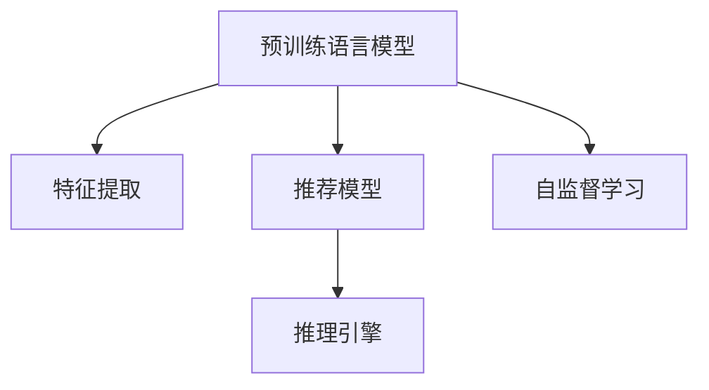

                 

# LLM Tokens + RS: 语义挖掘与推荐

> 关键词：语义挖掘,推荐系统,预训练模型,图神经网络,自监督学习,特征提取,推理引擎,深度学习

## 1. 背景介绍

### 1.1 问题由来
随着信息时代的发展，用户对个性化推荐服务的需求日益增加。推荐系统已成为各大互联网平台的核心竞争力之一，能够根据用户的历史行为和兴趣，提供符合其需求的物品。然而，传统推荐系统往往依赖于用户的历史行为数据，难以处理无标签的文本数据，而自然语言处理技术的发展，使得推荐系统能够拓展到文本数据领域。

近年来，基于预训练语言模型的大规模推荐系统，成为推荐领域研究的热点。以BERT、GPT为代表的预训练语言模型，在文本数据上取得了显著的成效。这些模型在大规模无标签文本上进行了预训练，学习了丰富的语义知识，再结合下游推荐任务进行微调，能够显著提升推荐系统的性能。

### 1.2 问题核心关键点
本节将介绍基于预训练语言模型的大规模推荐系统的研究背景和主要技术点。通过预训练模型和推荐系统的结合，构建推荐系统的核心技术包括：
- 语义特征提取：将文本数据转化为语义表示，构建特征向量，用于推荐模型的训练。
- 推荐模型的构建：结合推荐算法和预训练模型，形成推荐系统架构。
- 推荐模型的训练：使用推荐任务的数据，在预训练模型基础上进行微调，优化推荐模型的性能。
- 推理引擎的构建：搭建基于预训练模型的推理引擎，支持高效推荐结果生成。

## 2. 核心概念与联系

### 2.1 核心概念概述

本节将介绍与基于预训练语言模型的推荐系统相关的几个核心概念：

- 预训练语言模型(Pre-trained Language Model, PLM)：指在大规模无标签文本上进行了自监督预训练的通用语言模型。常见的预训练模型包括BERT、GPT、RoBERTa等。
- 推荐系统(Recommendation System)：指根据用户行为或兴趣，预测用户对物品的喜好，推荐合适的物品给用户的系统。
- 特征提取(Feature Extraction)：指从输入数据中提取有用的特征向量，用于机器学习模型的训练。
- 推理引擎(Reasoning Engine)：指支持高效推理和查询的计算引擎，通常使用图神经网络、深度学习等技术实现。
- 自监督学习(Self-supervised Learning)：指在没有标注数据的情况下，利用自生成数据进行模型训练的方法。

这些概念之间的联系可以用以下Mermaid流程图来展示：



这个流程图展示了预训练语言模型与其他核心概念之间的联系：

1. 预训练语言模型在大量无标签文本上进行自监督学习，学习通用的语言表示。
2. 将预训练模型作为特征提取器，将文本数据转化为语义特征向量。
3. 基于语义特征向量构建推荐模型，结合推荐算法，形成推荐系统。
4. 使用推荐任务数据对推荐模型进行微调，提升推荐效果。
5. 构建推理引擎，支持高效推荐结果生成。

## 3. 核心算法原理 & 具体操作步骤
### 3.1 算法原理概述

基于预训练语言模型的推荐系统，核心思想是将预训练模型作为特征提取器，从文本数据中提取语义特征向量，再结合推荐算法构建推荐模型，在推荐数据上进行微调，优化推荐模型的性能。

形式化地，假设预训练模型为 $M_{\theta}$，其中 $\theta$ 为预训练得到的模型参数。给定推荐任务 $T$ 的数据集 $D=\{(x_i, y_i)\}_{i=1}^N$，其中 $x_i$ 为物品描述文本，$y_i$ 为用户的兴趣标签，推荐模型的训练目标是最小化损失函数：

$$
\min_{\theta} \mathcal{L}(M_{\theta},D)
$$

其中 $\mathcal{L}$ 为推荐任务损失函数，用于衡量模型输出与真实标签之间的差异。常用的推荐任务包括物品推荐、用户兴趣预测、召回率优化等。

### 3.2 算法步骤详解

基于预训练语言模型的推荐系统通常包括以下几个关键步骤：

**Step 1: 准备预训练模型和数据集**
- 选择合适的预训练语言模型 $M_{\theta}$，如BERT、GPT等。
- 准备推荐任务 $T$ 的数据集 $D$，其中 $x_i$ 为物品描述文本，$y_i$ 为用户的兴趣标签。

**Step 2: 添加任务适配层**
- 在预训练模型的基础上，添加适配层的任务损失函数。例如，对于物品推荐任务，可以添加物品-用户交互标签的二分类交叉熵损失函数。

**Step 3: 设置微调超参数**
- 选择合适的优化算法及其参数，如AdamW、SGD等，设置学习率、批大小、迭代轮数等。
- 设置正则化技术及强度，包括权重衰减、Dropout、Early Stopping等。
- 确定冻结预训练参数的策略，如仅微调顶层，或全部参数都参与微调。

**Step 4: 执行梯度训练**
- 将数据集 $D$ 以批为单位输入模型，前向传播计算损失函数。
- 反向传播计算参数梯度，根据设定的优化算法和学习率更新模型参数。
- 周期性在验证集上评估模型性能，根据性能指标决定是否触发 Early Stopping。
- 重复上述步骤直至满足预设的迭代轮数或 Early Stopping 条件。

**Step 5: 测试和部署**
- 在测试集上评估微调后模型 $M_{\hat{\theta}}$ 的性能，对比微调前后的精度提升。
- 使用微调后的模型对新物品进行推理预测，集成到实际的应用系统中。
- 持续收集新的数据，定期重新微调模型，以适应数据分布的变化。

以上是基于预训练语言模型的推荐系统的一般流程。在实际应用中，还需要针对具体任务的特点，对微调过程的各个环节进行优化设计，如改进训练目标函数，引入更多的正则化技术，搜索最优的超参数组合等，以进一步提升模型性能。

### 3.3 算法优缺点

基于预训练语言模型的推荐系统具有以下优点：
1. 高效特征提取：预训练语言模型能够自动学习文本数据的语义表示，通过特征提取过程可以高效生成高质量特征向量，提升推荐系统的精度。
2. 跨领域适应：预训练语言模型在广泛领域进行了预训练，可以跨领域地应用于推荐任务。
3. 泛化能力强：大模型的泛化能力较强，能够处理未见过的文本数据。
4. 可解释性高：通过特征提取过程，可以揭示推荐系统的决策依据，增强系统的可解释性。

同时，该方法也存在一定的局限性：
1. 对标注数据依赖：微调过程中需要标注数据进行训练，标注成本较高。
2. 计算资源消耗大：预训练模型参数量庞大，训练和推理过程需要消耗大量计算资源。
3. 泛化能力有限：预训练模型在特定领域的应用效果可能会受到数据分布的影响。
4. 推理效率低：预训练模型的推理过程较为复杂，推理速度较慢。

尽管存在这些局限性，但基于预训练语言模型的推荐系统仍是大规模推荐系统的重要范式。未来相关研究的重点在于如何进一步降低对标注数据的依赖，提高模型的推理效率，同时兼顾可解释性和泛化能力等因素。

### 3.4 算法应用领域

基于预训练语言模型的推荐系统已经广泛应用于多个领域，例如：

- 电商推荐：帮助电商平台推荐用户可能感兴趣的商品。通过收集用户行为数据和物品描述数据，在预训练模型基础上进行微调，优化推荐效果。
- 内容推荐：为社交媒体、新闻平台等推荐用户可能感兴趣的内容。通过收集用户阅读历史和内容描述，利用预训练模型提取语义特征，构建推荐模型。
- 广告推荐：根据用户的浏览历史和行为数据，推荐用户可能感兴趣的广告。通过将广告文本描述输入预训练模型，提取特征，再结合广告推荐算法，实现精准推荐。
- 新闻推荐：为用户推荐相关的新闻文章。通过预训练模型提取新闻标题和摘要的语义特征，构建推荐模型，优化新闻推荐效果。

除了上述这些经典应用外，预训练语言模型在音乐推荐、视频推荐、教育推荐等多个领域也有广泛应用，为推荐系统带来了新的创新思路。随着预训练模型和推荐算法的不断演进，预训练语言模型在推荐系统中的应用前景将更加广阔。

## 4. 数学模型和公式 & 详细讲解  
### 4.1 数学模型构建

本节将使用数学语言对基于预训练语言模型的推荐系统进行更加严格的刻画。

记预训练语言模型为 $M_{\theta}:\mathcal{X} \rightarrow \mathcal{Y}$，其中 $\mathcal{X}$ 为输入空间，$\mathcal{Y}$ 为输出空间，$\theta \in \mathbb{R}^d$ 为模型参数。假设推荐任务 $T$ 的训练集为 $D=\{(x_i, y_i)\}_{i=1}^N$，其中 $x_i$ 为物品描述文本，$y_i$ 为用户的兴趣标签。

定义模型 $M_{\theta}$ 在输入 $x_i$ 上的输出为 $\hat{y}_i=M_{\theta}(x_i) \in [0,1]$，表示物品 $i$ 的推荐概率。推荐模型的训练目标是最小化交叉熵损失函数：

$$
\mathcal{L}(\theta) = -\frac{1}{N}\sum_{i=1}^N y_i\log \hat{y}_i + (1-y_i)\log (1-\hat{y}_i)
$$

在得到损失函数后，可以基于梯度下降等优化算法进行微调。设 $\eta$ 为学习率，$\lambda$ 为正则化系数，则参数的更新公式为：

$$
\theta \leftarrow \theta - \eta \nabla_{\theta}\mathcal{L}(\theta) - \eta\lambda\theta
$$

其中 $\nabla_{\theta}\mathcal{L}(\theta)$ 为损失函数对参数 $\theta$ 的梯度，可通过反向传播算法高效计算。

### 4.2 公式推导过程

以下我们以物品推荐任务为例，推导交叉熵损失函数及其梯度的计算公式。

假设模型 $M_{\theta}$ 在输入 $x_i$ 上的输出为 $\hat{y}_i=M_{\theta}(x_i) \in [0,1]$，表示物品 $i$ 的推荐概率。真实标签 $y_i \in \{0,1\}$。则交叉熵损失函数定义为：

$$
\ell(M_{\theta}(x_i),y_i) = -[y_i\log \hat{y}_i + (1-y_i)\log (1-\hat{y}_i)]
$$

将其代入经验风险公式，得：

$$
\mathcal{L}(\theta) = -\frac{1}{N}\sum_{i=1}^N [y_i\log M_{\theta}(x_i)+(1-y_i)\log(1-M_{\theta}(x_i))]
$$

根据链式法则，损失函数对参数 $\theta_k$ 的梯度为：

$$
\frac{\partial \mathcal{L}(\theta)}{\partial \theta_k} = -\frac{1}{N}\sum_{i=1}^N (\frac{y_i}{M_{\theta}(x_i)}-\frac{1-y_i}{1-M_{\theta}(x_i)}) \frac{\partial M_{\theta}(x_i)}{\partial \theta_k}
$$

其中 $\frac{\partial M_{\theta}(x_i)}{\partial \theta_k}$ 可进一步递归展开，利用自动微分技术完成计算。

在得到损失函数的梯度后，即可带入参数更新公式，完成模型的迭代优化。重复上述过程直至收敛，最终得到适应下游任务的最优模型参数 $\theta^*$。

## 5. 项目实践：代码实例和详细解释说明
### 5.1 开发环境搭建

在进行推荐系统开发前，我们需要准备好开发环境。以下是使用Python进行PyTorch开发的环境配置流程：

1. 安装Anaconda：从官网下载并安装Anaconda，用于创建独立的Python环境。

2. 创建并激活虚拟环境：
```bash
conda create -n pytorch-env python=3.8 
conda activate pytorch-env
```

3. 安装PyTorch：根据CUDA版本，从官网获取对应的安装命令。例如：
```bash
conda install pytorch torchvision torchaudio cudatoolkit=11.1 -c pytorch -c conda-forge
```

4. 安装Transformers库：
```bash
pip install transformers
```

5. 安装各类工具包：
```bash
pip install numpy pandas scikit-learn matplotlib tqdm jupyter notebook ipython
```

完成上述步骤后，即可在`pytorch-env`环境中开始推荐系统实践。

### 5.2 源代码详细实现

下面我们以电商推荐系统为例，给出使用Transformers库对BERT模型进行推荐微调的PyTorch代码实现。

首先，定义推荐任务的数据处理函数：

```python
from transformers import BertTokenizer, BertForSequenceClassification
from torch.utils.data import Dataset
import torch

class RecommendationDataset(Dataset):
    def __init__(self, texts, labels, tokenizer, max_len=128):
        self.texts = texts
        self.labels = labels
        self.tokenizer = tokenizer
        self.max_len = max_len
        
    def __len__(self):
        return len(self.texts)
    
    def __getitem__(self, item):
        text = self.texts[item]
        label = self.labels[item]
        
        encoding = self.tokenizer(text, return_tensors='pt', max_length=self.max_len, padding='max_length', truncation=True)
        input_ids = encoding['input_ids'][0]
        attention_mask = encoding['attention_mask'][0]
        
        # 对标签进行one-hot编码
        encoded_label = torch.tensor([label], dtype=torch.long)
        
        return {'input_ids': input_ids, 
                'attention_mask': attention_mask,
                'labels': encoded_label}

# 定义标签与id的映射
label2id = {0: 'not_recommended', 1: 'recommended'}
id2label = {v: k for k, v in label2id.items()}

# 创建dataset
tokenizer = BertTokenizer.from_pretrained('bert-base-cased')

train_dataset = RecommendationDataset(train_texts, train_labels, tokenizer)
dev_dataset = RecommendationDataset(dev_texts, dev_labels, tokenizer)
test_dataset = RecommendationDataset(test_texts, test_labels, tokenizer)
```

然后，定义模型和优化器：

```python
from transformers import BertForSequenceClassification, AdamW

model = BertForSequenceClassification.from_pretrained('bert-base-cased', num_labels=len(label2id))

optimizer = AdamW(model.parameters(), lr=2e-5)
```

接着，定义训练和评估函数：

```python
from torch.utils.data import DataLoader
from tqdm import tqdm
from sklearn.metrics import classification_report

device = torch.device('cuda') if torch.cuda.is_available() else torch.device('cpu')
model.to(device)

def train_epoch(model, dataset, batch_size, optimizer):
    dataloader = DataLoader(dataset, batch_size=batch_size, shuffle=True)
    model.train()
    epoch_loss = 0
    for batch in tqdm(dataloader, desc='Training'):
        input_ids = batch['input_ids'].to(device)
        attention_mask = batch['attention_mask'].to(device)
        labels = batch['labels'].to(device)
        model.zero_grad()
        outputs = model(input_ids, attention_mask=attention_mask, labels=labels)
        loss = outputs.loss
        epoch_loss += loss.item()
        loss.backward()
        optimizer.step()
    return epoch_loss / len(dataloader)

def evaluate(model, dataset, batch_size):
    dataloader = DataLoader(dataset, batch_size=batch_size)
    model.eval()
    preds, labels = [], []
    with torch.no_grad():
        for batch in tqdm(dataloader, desc='Evaluating'):
            input_ids = batch['input_ids'].to(device)
            attention_mask = batch['attention_mask'].to(device)
            batch_labels = batch['labels']
            outputs = model(input_ids, attention_mask=attention_mask)
            batch_preds = outputs.logits.argmax(dim=1).to('cpu').tolist()
            batch_labels = batch_labels.to('cpu').tolist()
            for pred, label in zip(batch_preds, batch_labels):
                preds.append(pred)
                labels.append(label)
                
    print(classification_report(labels, preds))
```

最后，启动训练流程并在测试集上评估：

```python
epochs = 5
batch_size = 16

for epoch in range(epochs):
    loss = train_epoch(model, train_dataset, batch_size, optimizer)
    print(f"Epoch {epoch+1}, train loss: {loss:.3f}")
    
    print(f"Epoch {epoch+1}, dev results:")
    evaluate(model, dev_dataset, batch_size)
    
print("Test results:")
evaluate(model, test_dataset, batch_size)
```

以上就是使用PyTorch对BERT进行电商推荐任务微调的完整代码实现。可以看到，得益于Transformers库的强大封装，我们可以用相对简洁的代码完成BERT模型的加载和微调。

### 5.3 代码解读与分析

让我们再详细解读一下关键代码的实现细节：

**RecommendationDataset类**：
- `__init__`方法：初始化文本、标签、分词器等关键组件。
- `__len__`方法：返回数据集的样本数量。
- `__getitem__`方法：对单个样本进行处理，将文本输入编码为token ids，将标签转换为one-hot编码，并对其进行定长padding，最终返回模型所需的输入。

**label2id和id2label字典**：
- 定义了标签与数字id之间的映射关系，用于将one-hot编码的预测结果解码回真实的标签。

**训练和评估函数**：
- 使用PyTorch的DataLoader对数据集进行批次化加载，供模型训练和推理使用。
- 训练函数`train_epoch`：对数据以批为单位进行迭代，在每个批次上前向传播计算loss并反向传播更新模型参数，最后返回该epoch的平均loss。
- 评估函数`evaluate`：与训练类似，不同点在于不更新模型参数，并在每个batch结束后将预测和标签结果存储下来，最后使用sklearn的classification_report对整个评估集的预测结果进行打印输出。

**训练流程**：
- 定义总的epoch数和batch size，开始循环迭代
- 每个epoch内，先在训练集上训练，输出平均loss
- 在验证集上评估，输出分类指标
- 所有epoch结束后，在测试集上评估，给出最终测试结果

可以看到，PyTorch配合Transformers库使得BERT微调的代码实现变得简洁高效。开发者可以将更多精力放在数据处理、模型改进等高层逻辑上，而不必过多关注底层的实现细节。

当然，工业级的系统实现还需考虑更多因素，如模型的保存和部署、超参数的自动搜索、更灵活的任务适配层等。但核心的微调范式基本与此类似。

## 6. 实际应用场景
### 6.1 智能推荐系统

基于预训练语言模型的推荐系统，可以广泛应用于各类智能推荐系统的构建。例如，电商、内容、广告、新闻等推荐系统，都可以通过预训练语言模型进行高效特征提取和推荐模型构建。

在技术实现上，可以收集用户行为数据和物品描述数据，构建监督数据集，在此基础上对预训练语言模型进行微调。微调后的模型能够高效提取文本数据的语义特征，构建推荐模型，在推荐任务上取得优异的性能。

### 6.2 个性化推荐

传统的推荐系统往往依赖用户的历史行为数据，难以处理新用户的推荐问题。基于预训练语言模型的推荐系统，可以通过文本描述自动提取用户的兴趣偏好，实现对新用户的个性化推荐。

例如，在招聘场景中，可以通过用户简历描述提取文本特征，构建推荐模型，自动匹配合适的职位。在旅游场景中，可以通过用户攻略描述提取兴趣点，推荐适合的旅游目的地。

### 6.3 信息检索

信息检索系统需要快速找到用户感兴趣的信息，基于预训练语言模型的推荐系统，可以通过提取文本描述的语义特征，构建推荐模型，实现高效的文本检索。

例如，在图书检索系统中，可以通过书名和简介描述提取文本特征，构建推荐模型，自动推荐符合用户兴趣的图书。在新闻检索系统中，可以通过新闻标题和摘要描述提取特征，构建推荐模型，实现快速的搜索结果推荐。

### 6.4 未来应用展望

随着预训练语言模型和推荐算法的不断演进，基于预训练语言模型的推荐系统将在更多领域得到应用，为推荐系统带来新的创新思路。

在智慧医疗领域，基于预训练语言模型的推荐系统可以推荐适合患者的诊断和治疗方案。在智慧教育领域，可以通过预训练语言模型推荐适合学生的学习内容和资源。在智慧金融领域，可以通过预训练语言模型推荐适合客户的理财建议。

此外，在企业推荐、社交网络推荐、智慧城市推荐等众多领域，基于预训练语言模型的推荐系统也将不断涌现，为推荐系统带来新的创新方向。相信随着技术的日益成熟，预训练语言模型在推荐系统中的应用前景将更加广阔。

## 7. 工具和资源推荐
### 7.1 学习资源推荐

为了帮助开发者系统掌握基于预训练语言模型的推荐系统的理论基础和实践技巧，这里推荐一些优质的学习资源：

1. 《深度学习推荐系统》书籍：详细介绍了推荐系统的工作原理和最新进展，涵盖基于深度学习的推荐算法和应用。
2. 《自然语言处理与深度学习》课程：斯坦福大学开设的NLP明星课程，涵盖推荐系统、文本挖掘、序列建模等多个方面。
3. 《推荐系统实践》书籍：介绍推荐系统的工程实践，涵盖推荐算法的实现、性能调优、工程部署等。
4. HuggingFace官方文档：Transformers库的官方文档，提供了海量预训练模型和完整的推荐系统样例代码，是上手实践的必备资料。
5. Kaggle推荐系统竞赛：丰富的推荐系统竞赛数据集和模型实现，能够提供实战经验，提高实战能力。

通过对这些资源的学习实践，相信你一定能够快速掌握基于预训练语言模型的推荐系统的精髓，并用于解决实际的推荐问题。
###  7.2 开发工具推荐

高效的开发离不开优秀的工具支持。以下是几款用于预训练语言模型推荐系统开发的常用工具：

1. PyTorch：基于Python的开源深度学习框架，灵活动态的计算图，适合快速迭代研究。大部分预训练语言模型都有PyTorch版本的实现。
2. TensorFlow：由Google主导开发的开源深度学习框架，生产部署方便，适合大规模工程应用。同样有丰富的预训练语言模型资源。
3. Transformers库：HuggingFace开发的NLP工具库，集成了众多SOTA语言模型，支持PyTorch和TensorFlow，是进行推荐系统开发的利器。
4. Weights & Biases：模型训练的实验跟踪工具，可以记录和可视化模型训练过程中的各项指标，方便对比和调优。与主流深度学习框架无缝集成。
5. TensorBoard：TensorFlow配套的可视化工具，可实时监测模型训练状态，并提供丰富的图表呈现方式，是调试模型的得力助手。
6. Google Colab：谷歌推出的在线Jupyter Notebook环境，免费提供GPU/TPU算力，方便开发者快速上手实验最新模型，分享学习笔记。

合理利用这些工具，可以显著提升预训练语言模型推荐系统的开发效率，加快创新迭代的步伐。

### 7.3 相关论文推荐

预训练语言模型和推荐系统的研究源于学界的持续研究。以下是几篇奠基性的相关论文，推荐阅读：

1. Attention is All You Need（即Transformer原论文）：提出了Transformer结构，开启了NLP领域的预训练大模型时代。
2. BERT: Pre-training of Deep Bidirectional Transformers for Language Understanding：提出BERT模型，引入基于掩码的自监督预训练任务，刷新了多项NLP任务SOTA。
3. Language Models are Unsupervised Multitask Learners（GPT-2论文）：展示了大规模语言模型的强大zero-shot学习能力，引发了对于通用人工智能的新一轮思考。
4. Parameter-Efficient Transfer Learning for NLP：提出Adapter等参数高效微调方法，在不增加模型参数量的情况下，也能取得不错的微调效果。
5. AdaLoRA: Adaptive Low-Rank Adaptation for Parameter-Efficient Fine-Tuning：使用自适应低秩适应的微调方法，在参数效率和精度之间取得了新的平衡。

这些论文代表了大语言模型微调技术的发展脉络。通过学习这些前沿成果，可以帮助研究者把握学科前进方向，激发更多的创新灵感。

## 8. 总结：未来发展趋势与挑战

### 8.1 总结

本文对基于预训练语言模型的推荐系统进行了全面系统的介绍。首先阐述了预训练语言模型和推荐系统的工作原理和结合方式。通过预训练语言模型作为特征提取器，构建推荐模型，在推荐数据上微调优化，得到高效的推荐结果。其次，介绍了预训练语言模型在推荐系统中的应用场景和未来发展趋势，展示了其广阔的应用前景。

通过本文的系统梳理，可以看到，基于预训练语言模型的推荐系统已成为推荐领域的重要范式，极大地拓展了推荐系统的应用边界，催生了更多的落地场景。受益于预训练语言模型的广泛适用性和高效特征提取能力，推荐系统能够更好地处理无标签文本数据，提供精准的推荐结果。

### 8.2 未来发展趋势

展望未来，基于预训练语言模型的推荐系统将呈现以下几个发展趋势：

1. 模型规模持续增大。随着算力成本的下降和数据规模的扩张，预训练语言模型的参数量还将持续增长。超大模型的泛化能力较强，能够处理未见过的文本数据。
2. 推荐算法多样化。结合不同的推荐算法，如协同过滤、内容过滤、混合推荐等，构建更加个性化的推荐模型。
3. 特征提取多样化。除了文本特征外，还可以结合图像、音频、视频等多种模态数据，实现多模态推荐。
4. 推理引擎优化。优化推理引擎，减少计算资源消耗，提高推荐速度和效率。
5. 实时化推荐。通过流数据处理技术，实现实时推荐，提升用户体验。
6. 跨领域推荐。预训练语言模型在广泛领域进行了预训练，可以跨领域地应用于推荐任务。

以上趋势凸显了基于预训练语言模型的推荐系统的广阔前景。这些方向的探索发展，必将进一步提升推荐系统的性能和应用范围，为推荐系统带来新的创新方向。

### 8.3 面临的挑战

尽管基于预训练语言模型的推荐系统已经取得了瞩目成就，但在迈向更加智能化、普适化应用的过程中，它仍面临着诸多挑战：

1. 标注成本瓶颈。虽然推荐系统往往依赖用户行为数据，但这些数据的获取成本较高。如何在低成本条件下，获取高精度的推荐结果，还需要进一步探索。
2. 计算资源消耗大。预训练模型参数量庞大，训练和推理过程需要消耗大量计算资源。如何降低计算成本，提高推荐系统的部署效率，是当前的重要研究课题。
3. 泛化能力有限。预训练模型在特定领域的应用效果可能会受到数据分布的影响。如何在不同领域和场景下，实现跨领域推荐，是未来的重要研究方向。
4. 实时化推荐难度大。推荐系统需要处理实时流数据，并快速生成推荐结果，这对系统的计算能力和网络延迟提出了较高要求。如何实现高效实时推荐，还需要进一步优化。

尽管存在这些挑战，但基于预训练语言模型的推荐系统仍是大规模推荐系统的重要范式。未来相关研究的重点在于如何进一步降低标注数据的需求，提高模型的推理效率，同时兼顾可解释性和泛化能力等因素。

### 8.4 研究展望

面对预训练语言模型推荐系统所面临的种种挑战，未来的研究需要在以下几个方面寻求新的突破：

1. 探索无监督和半监督推荐方法。摆脱对大规模标注数据的依赖，利用自生成数据进行推荐，降低成本。
2. 研究参数高效和计算高效的推荐范式。开发更加参数高效的推荐方法，在固定大部分预训练参数的情况下，只更新少量任务相关参数。同时优化推荐系统的计算图，减少前向传播和反向传播的资源消耗。
3. 融合因果和对比学习范式。通过引入因果推断和对比学习思想，增强推荐模型的建立稳定因果关系的能力，学习更加普适、鲁棒的语言表征，从而提升模型泛化性和抗干扰能力。
4. 引入更多先验知识。将符号化的先验知识，如知识图谱、逻辑规则等，与神经网络模型进行巧妙融合，引导推荐过程学习更准确、合理的语言模型。同时加强不同模态数据的整合，实现视觉、语音等多模态信息与文本信息的协同建模。
5. 结合因果分析和博弈论工具。将因果分析方法引入推荐模型，识别出推荐决策的关键特征，增强输出解释的因果性和逻辑性。借助博弈论工具刻画人机交互过程，主动探索并规避推荐系统的脆弱点，提高系统稳定性。
6. 纳入伦理道德约束。在推荐系统的训练目标中引入伦理导向的评估指标，过滤和惩罚有害的推荐结果，确保推荐系统符合人类价值观和伦理道德。

这些研究方向的探索，必将引领基于预训练语言模型的推荐系统技术迈向更高的台阶，为构建安全、可靠、可解释、可控的智能推荐系统铺平道路。面向未来，预训练语言模型推荐系统还需要与其他人工智能技术进行更深入的融合，如知识表示、因果推理、强化学习等，多路径协同发力，共同推动推荐系统技术的进步。只有勇于创新、敢于突破，才能不断拓展推荐系统的边界，让智能技术更好地服务于人类社会。

## 9. 附录：常见问题与解答

**Q1：预训练语言模型和推荐系统结合的难点是什么？**

A: 预训练语言模型和推荐系统结合的难点主要有以下两点：

1. 特征提取的精度和维度：预训练语言模型的特征提取能力很强，但生成的特征向量维度较高，且缺乏解释性。如何高效提取推荐系统的语义特征，同时减少计算量和存储开销，是当前的重要研究方向。

2. 推荐模型的训练和优化：推荐系统需要处理大量的用户行为数据和物品描述数据，而这些数据往往噪声较大，难以直接用于模型的训练。如何在微调过程中，有效地利用这些数据，优化推荐模型的性能，也需要进一步研究。

**Q2：如何平衡预训练语言模型和推荐算法的权重？**

A: 预训练语言模型和推荐算法的结合，需要通过特征提取层和推荐模型层进行协同优化。在具体实践中，可以通过以下方法平衡二者的权重：

1. 双塔结构：将预训练语言模型的特征提取和推荐算法分列处理，分别提取文本特征和构建推荐模型，最后再融合两者的输出。这样可以避免单一模型参数的过拟合，同时利用各自的优势。

2. 单塔结构：将预训练语言模型的特征提取和推荐算法融合在一起，直接在推荐模型中使用预训练模型作为特征提取器，构建推荐模型。这种方法能够充分利用预训练模型的语言表示能力，但也需要注意避免参数的过拟合。

**Q3：推荐系统的泛化能力如何保证？**

A: 预训练语言模型在广泛领域进行了预训练，具备较强的泛化能力。但推荐系统的泛化能力还受到数据分布的影响。为提高推荐系统的泛化能力，可以采取以下方法：

1. 跨领域微调：在多个领域的数据上进行预训练和微调，增强模型的泛化能力。

2. 迁移学习：利用预训练模型在不同领域进行微调，将跨领域迁移学习引入推荐系统，提升模型在未见过的领域上的性能。

3. 多模态融合：将文本、图像、音频等多种模态信息融合在一起，提高模型的泛化能力。

4. 对抗训练：引入对抗样本，训练模型的鲁棒性，提高其泛化能力。

5. 自适应学习：通过动态调整模型参数和学习率，适应不同领域和场景的数据分布，提升推荐系统的泛化能力。

**Q4：推荐系统在部署时需要注意哪些问题？**

A: 推荐系统在部署时需要注意以下问题：

1. 模型裁剪：去除不必要的层和参数，减小模型尺寸，加快推理速度。

2. 量化加速：将浮点模型转为定点模型，压缩存储空间，提高计算效率。

3. 服务化封装：将模型封装为标准化服务接口，便于集成调用。

4. 弹性伸缩：根据请求流量动态调整资源配置，平衡服务质量和成本。

5. 监控告警：实时采集系统指标，设置异常告警阈值，确保服务稳定性。

6. 安全防护：采用访问鉴权、数据脱敏等措施，保障数据和模型安全。

预训练语言模型推荐系统的部署需要考虑多个方面的因素，只有在数据、算法、工程、业务等多个维度协同发力，才能真正实现人工智能技术在推荐系统中的落地应用。

---

作者：禅与计算机程序设计艺术 / Zen and the Art of Computer Programming

