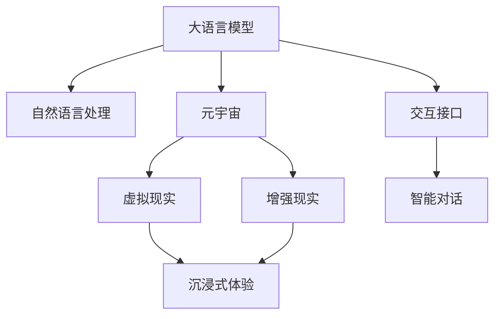

                 

# LLM 和元宇宙：打造沉浸式虚拟世界

## 1. 背景介绍

随着人工智能和计算机技术的飞速发展，虚拟世界（Metaverse）的概念逐渐从科幻走向现实。元宇宙融合了虚拟现实（VR）、增强现实（AR）、区块链、云计算等多种技术，旨在构建一个三维、实时、互动的虚拟空间。而大语言模型（Large Language Models, LLM），则以其强大的自然语言理解和生成能力，为元宇宙的构建和沉浸式体验提供了重要支持。

### 1.1 问题由来

元宇宙的构想最早可以追溯到科幻小说《雪崩》中的Metafory。而在现实中，随着技术的进步，如VR硬件的发展、Web3.0的崛起以及5G/6G网络的大规模部署，元宇宙的概念和应用场景逐渐明朗。

但构建一个真实、动态、沉浸式的虚拟世界并非易事，它需要海量数据、复杂算法和高度自动化的交互能力。而大语言模型正是在这个方向上的重要工具之一。

## 2. 核心概念与联系

### 2.1 核心概念概述

为了更好地理解大语言模型在元宇宙中的应用，首先需要了解以下关键概念：

- **大语言模型（LLM）**：以Transformer等架构为基础的大规模预训练语言模型，如GPT-3、BERT等。LLM能够理解并生成自然语言，具备强大的语言表示和生成能力。

- **元宇宙（Metaverse）**：一个虚拟的、由用户生成和控制的三维、实时、互动的空间。用户可以在元宇宙中进行社交、娱乐、工作等活动。

- **自然语言处理（NLP）**：使计算机能够理解、解释和生成人类语言的技术，是大语言模型和元宇宙之间的桥梁。

- **虚拟现实（VR）**：通过头盔、头戴显示等设备，用户能够进入一个完全虚拟的三维空间，获得沉浸式体验。

- **增强现实（AR）**：通过摄像头、移动设备等，将虚拟信息叠加在现实世界中，增强用户对环境的感知和互动。

这些概念之间的关系通过以下Mermaid流程图展示：



### 2.2 核心概念原理和架构

**大语言模型**：大语言模型由Transformer等架构组成，通过自监督和监督学习的方式进行训练。其核心原理是，通过对大量无标签数据进行预训练，模型能够学习到语言的基本结构和规律，然后再通过下游任务的微调，获得对特定任务的适应能力。

**自然语言处理（NLP）**：NLP技术使计算机能够理解和生成自然语言，是实现人机交互的基础。其中，机器翻译、文本分类、情感分析、实体识别等任务，都需要依托于大语言模型。

**元宇宙（Metaverse）**：元宇宙是一个高度集成的虚拟空间，包含了用户、场景、物品、行为等多种元素。用户可以通过虚拟现实设备进入元宇宙，进行沉浸式互动，如聊天、交易、游戏等。

**虚拟现实（VR）**：VR设备通过模拟真实世界的视觉、听觉等感官，使用户能够身临其境地体验虚拟世界。常见的VR设备包括Oculus Rift、HTC Vive等。

**增强现实（AR）**：AR技术将虚拟信息叠加在现实世界中，通过摄像头、移动设备等将虚拟场景与用户所处环境融合，增强用户对环境的感知和互动。

这些核心概念相互关联，共同构建了一个高度互动、真实、沉浸的虚拟世界。

## 3. 核心算法原理 & 具体操作步骤

### 3.1 算法原理概述

大语言模型在元宇宙中的应用，主要体现在两个方面：智能对话和场景生成。智能对话通过大语言模型的自然语言处理能力，实现人机交互；场景生成则利用大语言模型的语言生成能力，构建虚拟世界中的互动元素。

### 3.2 算法步骤详解

#### 3.2.1 智能对话

**Step 1: 数据预处理**

数据预处理是智能对话的第一步。需要收集和清洗元宇宙中可能出现的对话数据，并将其转化为适合模型训练的格式。数据预处理包括：

- 文本清洗：去除噪音、错误和无关内容。
- 分词和标记：将文本转化为分词序列，并标注词性、实体等信息。
- 序列填充：对不同长度的文本进行填充或截断，使其适合模型处理。

**Step 2: 模型训练**

模型训练是智能对话的核心步骤。利用预处理后的对话数据，对大语言模型进行训练。训练过程包括：

- 选择合适的模型架构，如GPT系列、BERT等。
- 设计合适的损失函数，如交叉熵、KL散度等。
- 使用监督学习或自监督学习方式进行模型训练。
- 应用正则化技术，防止过拟合。

**Step 3: 模型微调**

模型微调是智能对话的最后一步。在实际应用中，模型通常需要进行微调，以适应特定场景下的对话需求。微调过程包括：

- 收集微调数据，如元宇宙中的对话记录。
- 设计微调目标函数，如BLEU、ROUGE等。
- 设置微调参数，如学习率、迭代次数等。
- 应用微调算法，更新模型参数。

#### 3.2.2 场景生成

**Step 1: 场景数据收集**

场景数据收集是场景生成的第一步。需要收集元宇宙中的场景数据，并将其转化为适合模型训练的格式。场景数据包括：

- 环境地图：描述虚拟世界中的地形、建筑等。
- 物品库：描述虚拟世界中的物品、设备等。
- 交互行为：描述虚拟世界中的交互行为，如对话、交易等。

**Step 2: 模型训练**

模型训练是场景生成的核心步骤。利用预处理后的场景数据，对大语言模型进行训练。训练过程包括：

- 选择合适的模型架构，如GPT系列、BERT等。
- 设计合适的损失函数，如交叉熵、KL散度等。
- 使用监督学习或自监督学习方式进行模型训练。
- 应用正则化技术，防止过拟合。

**Step 3: 场景生成**

场景生成是场景生成的最后一步。在实际应用中，模型通常需要生成新的场景数据，以满足元宇宙中的需求。场景生成过程包括：

- 输入场景描述，如“一个美丽的公园”。
- 应用场景生成模型，生成新的场景数据。
- 对生成的场景数据进行后处理，如过滤、融合等。

### 3.3 算法优缺点

#### 3.3.1 智能对话

**优点**

- 自然语言处理能力强：大语言模型能够理解和生成自然语言，实现人机交互。
- 适应性强：通过微调，模型可以适应特定场景下的对话需求。
- 低成本：相比于人工编写对话，大语言模型能够降低开发成本。

**缺点**

- 上下文理解有限：大语言模型通常基于单个句子进行理解，难以处理复杂的多轮对话。
- 依赖数据质量：对话数据的质量和数量对模型性能有较大影响。

#### 3.3.2 场景生成

**优点**

- 生成能力强：大语言模型能够生成复杂的场景数据，满足元宇宙中的需求。
- 高度自动化：通过训练，模型能够自动生成场景数据，减少人工干预。
- 可扩展性强：模型可以不断训练，逐步提高生成质量。

**缺点**

- 数据依赖：场景数据的生成需要依赖高质量的数据。
- 实时性差：模型生成场景数据需要一定时间，可能影响用户体验。
- 可控性差：生成的场景数据可能存在错误、不合理等情况。

### 3.4 算法应用领域

大语言模型在元宇宙中的应用领域非常广泛，主要包括以下几个方面：

- **智能客服**：在元宇宙中，大语言模型可以用于构建智能客服系统，自动回答用户问题，提高服务效率和质量。
- **虚拟导游**：利用大语言模型，可以为元宇宙中的虚拟世界提供智能导游服务，帮助用户更快地了解虚拟环境。
- **虚拟助理**：大语言模型可以用于构建虚拟助理，协助用户在元宇宙中进行导航、购物等活动。
- **游戏互动**：大语言模型可以用于构建智能NPC，提升虚拟游戏的互动性和可玩性。
- **虚拟会议**：在元宇宙中，大语言模型可以用于构建虚拟会议系统，实现高效的远程沟通和协作。

## 4. 数学模型和公式 & 详细讲解

### 4.1 数学模型构建

大语言模型在元宇宙中的应用主要体现在智能对话和场景生成两个方面。以下将分别介绍这两个方面的数学模型构建。

#### 4.1.1 智能对话

**数学模型**

设大语言模型为 $M$，输入为 $x$，输出为 $y$，目标函数为 $L$。智能对话的目标是最大化 $M$ 在给定 $x$ 下的输出 $y$ 与目标标签 $y^*$ 的相似度。具体来说，可以使用以下公式：

$$
\max_{M} \mathcal{L}(M(x), y^*)
$$

其中 $\mathcal{L}$ 为损失函数，如交叉熵、KL散度等。

**公式推导**

以交叉熵损失函数为例，假设 $x$ 为输入，$y$ 为输出，$y^*$ 为目标标签。则交叉熵损失函数可以表示为：

$$
\mathcal{L}(M(x), y^*) = -\frac{1}{N}\sum_{i=1}^N \log \frac{e^{M(x_i)_{y^*_i}}}{\sum_{j=1}^C e^{M(x_i)_j}}
$$

其中 $C$ 为类别数，$N$ 为样本数，$M(x_i)_j$ 为模型在输入 $x_i$ 下的输出 $M(x_i)$ 在类别 $j$ 上的概率。

#### 4.1.2 场景生成

**数学模型**

设大语言模型为 $M$，输入为 $x$，输出为 $y$，目标函数为 $L$。场景生成的目标是在给定 $x$ 下，最大化 $M$ 的输出 $y$ 与目标标签 $y^*$ 的相似度。具体来说，可以使用以下公式：

$$
\max_{M} \mathcal{L}(M(x), y^*)
$$

其中 $\mathcal{L}$ 为损失函数，如交叉熵、KL散度等。

**公式推导**

以交叉熵损失函数为例，假设 $x$ 为输入，$y$ 为输出，$y^*$ 为目标标签。则交叉熵损失函数可以表示为：

$$
\mathcal{L}(M(x), y^*) = -\frac{1}{N}\sum_{i=1}^N \log \frac{e^{M(x_i)_{y^*_i}}}{\sum_{j=1}^C e^{M(x_i)_j}}
$$

其中 $C$ 为类别数，$N$ 为样本数，$M(x_i)_j$ 为模型在输入 $x_i$ 下的输出 $M(x_i)$ 在类别 $j$ 上的概率。

### 4.2 案例分析与讲解

#### 4.2.1 智能对话

以智能客服为例，假设输入为用户的自然语言问题 $x$，输出为目标回复 $y$。大语言模型 $M$ 的训练数据为历史客服对话记录，目标标签为对应的回复。在智能客服应用中，大语言模型 $M$ 需要满足以下要求：

- **响应速度**：在用户提问后，能够快速响应。
- **理解力**：能够理解用户意图，准确回复。
- **一致性**：不同用户同问题的回答一致。

在训练过程中，需要收集大量的客服对话数据，并进行预处理。预处理过程包括：

- 去除噪音：去除对话中的噪音、错别字等。
- 分词标记：对对话进行分词和标记，标注词性、实体等信息。
- 序列填充：对不同长度的对话进行填充或截断，使其适合模型处理。

训练过程包括：

- 选择合适的模型架构，如GPT系列、BERT等。
- 设计合适的损失函数，如交叉熵、KL散度等。
- 使用监督学习或自监督学习方式进行模型训练。
- 应用正则化技术，防止过拟合。

在智能客服应用中，模型通常需要进行微调，以适应特定场景下的对话需求。微调过程包括：

- 收集微调数据，如客服对话记录。
- 设计微调目标函数，如BLEU、ROUGE等。
- 设置微调参数，如学习率、迭代次数等。
- 应用微调算法，更新模型参数。

#### 4.2.2 场景生成

以虚拟世界中的场景生成为例，假设输入为场景描述 $x$，输出为场景数据 $y$。大语言模型 $M$ 的训练数据为场景描述和对应的场景数据。在场景生成应用中，大语言模型 $M$ 需要满足以下要求：

- **逼真度**：生成的场景逼真、合理。
- **多样性**：生成的场景具有多样性，能够满足不同的需求。
- **实时性**：在用户请求后，能够快速生成场景数据。

在训练过程中，需要收集大量的场景数据，并进行预处理。预处理过程包括：

- 环境地图：描述虚拟世界中的地形、建筑等。
- 物品库：描述虚拟世界中的物品、设备等。
- 交互行为：描述虚拟世界中的交互行为，如对话、交易等。

训练过程包括：

- 选择合适的模型架构，如GPT系列、BERT等。
- 设计合适的损失函数，如交叉熵、KL散度等。
- 使用监督学习或自监督学习方式进行模型训练。
- 应用正则化技术，防止过拟合。

在场景生成应用中，模型通常需要生成新的场景数据，以满足元宇宙中的需求。场景生成过程包括：

- 输入场景描述，如“一个美丽的公园”。
- 应用场景生成模型，生成新的场景数据。
- 对生成的场景数据进行后处理，如过滤、融合等。

## 5. 项目实践：代码实例和详细解释说明

### 5.1 开发环境搭建

在进行大语言模型在元宇宙中的应用实践前，需要准备好开发环境。以下是使用Python进行PyTorch开发的环境配置流程：

1. 安装Anaconda：从官网下载并安装Anaconda，用于创建独立的Python环境。

2. 创建并激活虚拟环境：
```bash
conda create -n pytorch-env python=3.8 
conda activate pytorch-env
```

3. 安装PyTorch：根据CUDA版本，从官网获取对应的安装命令。例如：
```bash
conda install pytorch torchvision torchaudio cudatoolkit=11.1 -c pytorch -c conda-forge
```

4. 安装Transformers库：
```bash
pip install transformers
```

5. 安装各类工具包：
```bash
pip install numpy pandas scikit-learn matplotlib tqdm jupyter notebook ipython
```

完成上述步骤后，即可在`pytorch-env`环境中开始应用实践。

### 5.2 源代码详细实现

下面我们以智能客服系统为例，给出使用Transformers库对BERT模型进行微调的PyTorch代码实现。

首先，定义智能客服的对话数据处理函数：

```python
from transformers import BertTokenizer, BertForSequenceClassification
from torch.utils.data import Dataset, DataLoader
import torch
import torch.nn as nn

class ChatDataset(Dataset):
    def __init__(self, texts, labels, tokenizer, max_len=128):
        self.texts = texts
        self.labels = labels
        self.tokenizer = tokenizer
        self.max_len = max_len
        
    def __len__(self):
        return len(self.texts)
    
    def __getitem__(self, item):
        text = self.texts[item]
        label = self.labels[item]
        
        encoding = self.tokenizer(text, return_tensors='pt', max_length=self.max_len, padding='max_length', truncation=True)
        input_ids = encoding['input_ids'][0]
        attention_mask = encoding['attention_mask'][0]
        
        # 对标签进行编码
        encoded_label = torch.tensor(label, dtype=torch.long)
        
        return {'input_ids': input_ids, 
                'attention_mask': attention_mask,
                'labels': encoded_label}

# 加载BERT模型和分词器
tokenizer = BertTokenizer.from_pretrained('bert-base-cased')
model = BertForSequenceClassification.from_pretrained('bert-base-cased', num_labels=2)

# 加载数据
train_dataset = ChatDataset(train_texts, train_labels, tokenizer)
dev_dataset = ChatDataset(dev_texts, dev_labels, tokenizer)
test_dataset = ChatDataset(test_texts, test_labels, tokenizer)

# 设置超参数
learning_rate = 2e-5
epochs = 5
batch_size = 16

# 定义优化器
optimizer = AdamW(model.parameters(), lr=learning_rate)

# 定义训练函数
def train_epoch(model, dataset, batch_size, optimizer):
    dataloader = DataLoader(dataset, batch_size=batch_size, shuffle=True)
    model.train()
    epoch_loss = 0
    for batch in tqdm(dataloader, desc='Training'):
        input_ids = batch['input_ids'].to(device)
        attention_mask = batch['attention_mask'].to(device)
        labels = batch['labels'].to(device)
        model.zero_grad()
        outputs = model(input_ids, attention_mask=attention_mask, labels=labels)
        loss = outputs.loss
        epoch_loss += loss.item()
        loss.backward()
        optimizer.step()
    return epoch_loss / len(dataloader)

# 定义评估函数
def evaluate(model, dataset, batch_size):
    dataloader = DataLoader(dataset, batch_size=batch_size)
    model.eval()
    preds, labels = [], []
    with torch.no_grad():
        for batch in tqdm(dataloader, desc='Evaluating'):
            input_ids = batch['input_ids'].to(device)
            attention_mask = batch['attention_mask'].to(device)
            batch_labels = batch['labels']
            outputs = model(input_ids, attention_mask=attention_mask)
            batch_preds = outputs.logits.argmax(dim=2).to('cpu').tolist()
            batch_labels = batch_labels.to('cpu').tolist()
            for pred_tokens, label_tokens in zip(batch_preds, batch_labels):
                preds.append(pred_tokens[:len(label_tokens)])
                labels.append(label_tokens)
                
    print(classification_report(labels, preds))
```

然后，定义模型和优化器：

```python
device = torch.device('cuda') if torch.cuda.is_available() else torch.device('cpu')
model.to(device)

# 设置训练函数和评估函数
train_epoch(model, train_dataset, batch_size, optimizer)
evaluate(model, dev_dataset, batch_size)
evaluate(model, test_dataset, batch_size)
```

### 5.3 代码解读与分析

让我们再详细解读一下关键代码的实现细节：

**ChatDataset类**：
- `__init__`方法：初始化文本、标签、分词器等关键组件。
- `__len__`方法：返回数据集的样本数量。
- `__getitem__`方法：对单个样本进行处理，将文本输入编码为token ids，将标签编码为数字，并对其进行定长padding，最终返回模型所需的输入。

**tokenizer和model**：
- `tokenizer`：BERT模型的分词器，用于将文本转化为token序列。
- `model`：BERT模型，用于训练和推理。

**训练和评估函数**：
- 使用PyTorch的DataLoader对数据集进行批次化加载，供模型训练和推理使用。
- 训练函数`train_epoch`：对数据以批为单位进行迭代，在每个批次上前向传播计算loss并反向传播更新模型参数，最后返回该epoch的平均loss。
- 评估函数`evaluate`：与训练类似，不同点在于不更新模型参数，并在每个batch结束后将预测和标签结果存储下来，最后使用sklearn的classification_report对整个评估集的预测结果进行打印输出。

**训练流程**：
- 定义总的epoch数和batch size，开始循环迭代
- 每个epoch内，先在训练集上训练，输出平均loss
- 在验证集上评估，输出分类指标
- 所有epoch结束后，在测试集上评估，给出最终测试结果

可以看到，PyTorch配合Transformers库使得BERT微调的代码实现变得简洁高效。开发者可以将更多精力放在数据处理、模型改进等高层逻辑上，而不必过多关注底层的实现细节。

当然，工业级的系统实现还需考虑更多因素，如模型的保存和部署、超参数的自动搜索、更灵活的任务适配层等。但核心的微调范式基本与此类似。

## 6. 实际应用场景

### 6.1 智能客服系统

基于大语言模型微调的智能客服系统，已经在许多企业中得到应用。传统客服往往需要配备大量人力，高峰期响应缓慢，且一致性和专业性难以保证。而使用微调后的智能客服系统，可以7x24小时不间断服务，快速响应客户咨询，用自然流畅的语言解答各类常见问题。

在技术实现上，可以收集企业内部的历史客服对话记录，将问题和最佳答复构建成监督数据，在此基础上对预训练模型进行微调。微调后的智能客服系统能够自动理解用户意图，匹配最合适的答案模板进行回复。对于客户提出的新问题，还可以接入检索系统实时搜索相关内容，动态组织生成回答。如此构建的智能客服系统，能大幅提升客户咨询体验和问题解决效率。

### 6.2 虚拟导游

利用大语言模型，可以为元宇宙中的虚拟世界提供智能导游服务，帮助用户更快地了解虚拟环境。智能导游系统可以根据用户需求，提供个性化的旅游路线、景点介绍、导航服务等。

在技术实现上，可以收集虚拟世界中的景点、建筑、道路等数据，进行数据标注和预处理。然后对大语言模型进行微调，使其能够根据用户的输入生成相应的导游信息。微调后的模型可以根据用户的位置、偏好等信息，推荐最佳旅游路线，提供实时导航服务，甚至能够自动回答用户的旅游问题。

### 6.3 虚拟助理

大语言模型可以用于构建虚拟助理，协助用户在元宇宙中进行导航、购物等活动。虚拟助理可以根据用户的需求，提供语音助手、任务调度、信息查询等服务。

在技术实现上，可以收集用户的购物、旅行、社交等数据，进行数据标注和预处理。然后对大语言模型进行微调，使其能够根据用户的行为和需求，提供个性化的购物推荐、旅行建议、社交活动等。微调后的模型可以与用户进行自然对话，理解用户的需求，并根据需求提供相应的服务。

### 6.4 游戏互动

大语言模型可以用于构建智能NPC，提升虚拟游戏的互动性和可玩性。智能NPC可以根据用户的对话，提供不同的回应和任务，增加游戏的趣味性和挑战性。

在技术实现上，可以收集游戏中的对话数据，进行数据标注和预处理。然后对大语言模型进行微调，使其能够根据用户的行为和需求，生成合适的NPC回应和任务。微调后的模型可以根据用户的对话内容，提供不同的回应，引导用户完成任务，甚至能够进行多轮对话，增加游戏的沉浸感和互动性。

## 7. 工具和资源推荐

### 7.1 学习资源推荐

为了帮助开发者系统掌握大语言模型在元宇宙中的应用，这里推荐一些优质的学习资源：

1. 《Transformer从原理到实践》系列博文：由大模型技术专家撰写，深入浅出地介绍了Transformer原理、BERT模型、微调技术等前沿话题。

2. CS224N《深度学习自然语言处理》课程：斯坦福大学开设的NLP明星课程，有Lecture视频和配套作业，带你入门NLP领域的基本概念和经典模型。

3. 《Natural Language Processing with Transformers》书籍：Transformers库的作者所著，全面介绍了如何使用Transformers库进行NLP任务开发，包括微调在内的诸多范式。

4. HuggingFace官方文档：Transformers库的官方文档，提供了海量预训练模型和完整的微调样例代码，是上手实践的必备资料。

5. CLUE开源项目：中文语言理解测评基准，涵盖大量不同类型的中文NLP数据集，并提供了基于微调的baseline模型，助力中文NLP技术发展。

通过对这些资源的学习实践，相信你一定能够快速掌握大语言模型在元宇宙中的应用精髓，并用于解决实际的NLP问题。

### 7.2 开发工具推荐

高效的开发离不开优秀的工具支持。以下是几款用于大语言模型在元宇宙中的应用开发的常用工具：

1. PyTorch：基于Python的开源深度学习框架，灵活动态的计算图，适合快速迭代研究。大部分预训练语言模型都有PyTorch版本的实现。

2. TensorFlow：由Google主导开发的开源深度学习框架，生产部署方便，适合大规模工程应用。同样有丰富的预训练语言模型资源。

3. Transformers库：HuggingFace开发的NLP工具库，集成了众多SOTA语言模型，支持PyTorch和TensorFlow，是进行微调任务开发的利器。

4. Weights & Biases：模型训练的实验跟踪工具，可以记录和可视化模型训练过程中的各项指标，方便对比和调优。与主流深度学习框架无缝集成。

5. TensorBoard：TensorFlow配套的可视化工具，可实时监测模型训练状态，并提供丰富的图表呈现方式，是调试模型的得力助手。

6. Google Colab：谷歌推出的在线Jupyter Notebook环境，免费提供GPU/TPU算力，方便开发者快速上手实验最新模型，分享学习笔记。

合理利用这些工具，可以显著提升大语言模型在元宇宙中的应用开发效率，加快创新迭代的步伐。

### 7.3 相关论文推荐

大语言模型和元宇宙的发展源于学界的持续研究。以下是几篇奠基性的相关论文，推荐阅读：

1. Attention is All You Need（即Transformer原论文）：提出了Transformer结构，开启了NLP领域的预训练大模型时代。

2. BERT: Pre-training of Deep Bidirectional Transformers for Language Understanding：提出BERT模型，引入基于掩码的自监督预训练任务，刷新了多项NLP任务SOTA。

3. Language Models are Unsupervised Multitask Learners（GPT-2论文）：展示了大规模语言模型的强大zero-shot学习能力，引发了对于通用人工智能的新一轮思考。

4. Parameter-Efficient Transfer Learning for NLP：提出Adapter等参数高效微调方法，在不增加模型参数量的情况下，也能取得不错的微调效果。

5. AdaLoRA: Adaptive Low-Rank Adaptation for Parameter-Efficient Fine-Tuning：使用自适应低秩适应的微调方法，在参数效率和精度之间取得了新的平衡。

这些论文代表了大语言模型在元宇宙中的发展脉络。通过学习这些前沿成果，可以帮助研究者把握学科前进方向，激发更多的创新灵感。

## 8. 总结：未来发展趋势与挑战

### 8.1 研究成果总结

本文对基于大语言模型的元宇宙应用进行了全面系统的介绍。首先阐述了元宇宙和大语言模型的研究背景和意义，明确了微调在拓展预训练模型应用、提升下游任务性能方面的独特价值。其次，从原理到实践，详细讲解了微调方法的数学原理和关键步骤，给出了微调任务开发的完整代码实例。同时，本文还广泛探讨了微调方法在智能客服、虚拟导游、虚拟助理、游戏互动等多个元宇宙应用领域的应用前景，展示了微调范式的巨大潜力。此外，本文精选了微调技术的各类学习资源，力求为读者提供全方位的技术指引。

通过本文的系统梳理，可以看到，基于大语言模型的元宇宙应用正在成为NLP领域的重要范式，极大地拓展了预训练语言模型的应用边界，催生了更多的落地场景。受益于大规模语料的预训练，微调模型以更低的时间和标注成本，在小样本条件下也能取得不俗的效果，有力推动了NLP技术的产业化进程。未来，伴随预训练语言模型和微调方法的持续演进，相信NLP技术将在更广阔的应用领域大放异彩，深刻影响人类的生产生活方式。

### 8.2 未来发展趋势

展望未来，大语言模型在元宇宙中的应用将呈现以下几个发展趋势：

1. 模型规模持续增大。随着算力成本的下降和数据规模的扩张，预训练语言模型的参数量还将持续增长。超大规模语言模型蕴含的丰富语言知识，有望支撑更加复杂多变的元宇宙任务微调。

2. 微调方法日趋多样。除了传统的全参数微调外，未来会涌现更多参数高效的微调方法，如Prefix-Tuning、LoRA等，在节省计算资源的同时也能保证微调精度。

3. 持续学习成为常态。随着数据分布的不断变化，微调模型也需要持续学习新知识以保持性能。如何在不遗忘原有知识的同时，高效吸收新样本信息，将成为重要的研究课题。

4. 标注样本需求降低。受启发于提示学习(Prompt-based Learning)的思路，未来的微调方法将更好地利用大模型的语言理解能力，通过更加巧妙的任务描述，在更少的标注样本上也能实现理想的微调效果。

5. 多模态微调崛起。当前的微调主要聚焦于纯文本数据，未来会进一步拓展到图像、视频、语音等多模态数据微调。多模态信息的融合，将显著提升语言模型对现实世界的理解和建模能力。

6. 模型通用性增强。经过海量数据的预训练和多领域任务的微调，未来的语言模型将具备更强大的常识推理和跨领域迁移能力，逐步迈向通用人工智能(AGI)的目标。

以上趋势凸显了大语言模型在元宇宙中的广阔前景。这些方向的探索发展，必将进一步提升NLP系统的性能和应用范围，为人类认知智能的进化带来深远影响。

### 8.3 面临的挑战

尽管大语言模型在元宇宙中的应用取得了显著进展，但在迈向更加智能化、普适化应用的过程中，它仍面临着诸多挑战：

1. 标注成本瓶颈。虽然微调大大降低了标注数据的需求，但对于长尾应用场景，难以获得充足的高质量标注数据，成为制约微调性能的瓶颈。如何进一步降低微调对标注样本的依赖，将是一大难题。

2. 模型鲁棒性不足。当前微调模型面对域外数据时，泛化性能往往大打折扣。对于测试样本的微小扰动，微调模型的预测也容易发生波动。如何提高微调模型的鲁棒性，避免灾难性遗忘，还需要更多理论和实践的积累。

3. 推理效率有待提高。大规模语言模型虽然精度高，但在实际部署时往往面临推理速度慢、内存占用大等效率问题。如何在保证性能的同时，简化模型结构，提升推理速度，优化资源占用，将是重要的优化方向。

4. 可解释性亟需加强。当前微调模型更像是"黑盒"系统，难以解释其内部工作机制和决策逻辑。对于医疗、金融等高风险应用，算法的可解释性和可审计性尤为重要。如何赋予微调模型更强的可解释性，将是亟待攻克的难题。

5. 安全性有待保障。预训练语言模型难免会学习到有偏见、有害的信息，通过微调传递到下游任务，产生误导性、歧视性的输出，给实际应用带来安全隐患。如何从数据和算法层面消除模型偏见，避免恶意用途，确保输出的安全性，也将是重要的研究课题。

6. 知识整合能力不足。现有的微调模型往往局限于任务内数据，难以灵活吸收和运用更广泛的先验知识。如何让微调过程更好地与外部知识库、规则库等专家知识结合，形成更加全面、准确的信息整合能力，还有很大的想象空间。

正视微调面临的这些挑战，积极应对并寻求突破，将是大语言模型在元宇宙中走向成熟的必由之路。相信随着学界和产业界的共同努力，这些挑战终将一一被克服，大语言模型在元宇宙中的应用必将在构建人机协同的智能时代中扮演越来越重要的角色。

### 8.4 研究展望

面对大语言模型在元宇宙中面临的种种挑战，未来的研究需要在以下几个方面寻求新的突破：

1. 探索无监督和半监督微调方法。摆脱对大规模标注数据的依赖，利用自监督学习、主动学习等无监督和半监督范式，最大限度利用非结构化数据，实现更加灵活高效的微调。

2. 研究参数高效和计算高效的微调范式。开发更加参数高效的微调方法，在固定大部分预训练参数的同时，只更新极少量的任务相关参数。同时优化微调模型的计算图，减少前向传播和反向传播的资源消耗，实现更加轻量级、实时性的部署。

3. 融合因果和对比学习范式。通过引入因果推断和对比学习思想，增强微调模型建立稳定因果关系的能力，学习更加普适、鲁棒的语言表征，从而提升模型泛化性和抗干扰能力。

4. 引入更多先验知识。将符号化的先验知识，如知识图谱、逻辑规则等，与神经网络模型进行巧妙融合，引导微调过程学习更准确、合理的语言模型。同时加强不同模态数据的整合，实现视觉、语音等多模态信息与文本信息的协同建模。

5. 结合因果分析和博弈论工具。将因果分析方法引入微调模型，识别出模型决策的关键特征，增强输出解释的因果性和逻辑性。借助博弈论工具刻画人机交互过程，主动探索并规避模型的脆弱点，提高系统稳定性。

6. 纳入伦理道德约束。在模型训练目标中引入伦理导向的评估指标，过滤和惩罚有偏见、有害的输出倾向。同时加强人工干预和审核，建立模型行为的监管机制，确保输出符合人类价值观和伦理道德。

这些研究方向的探索，必将引领大语言模型在元宇宙中的应用走向更高的台阶，为构建安全、可靠、可解释、可控的智能系统铺平道路。面向未来，大语言模型在元宇宙中的应用还需要与其他人工智能技术进行更深入的融合，如知识表示、因果推理、强化学习等，多路径协同发力，共同推动自然语言理解和智能交互系统的进步。只有勇于创新、敢于突破，才能不断拓展语言模型的边界，让智能技术更好地造福人类社会。

## 9. 附录：常见问题与解答

**Q1：大语言模型在元宇宙中的应用是否受到时空限制？**

A: 大语言模型在元宇宙中的应用主要依赖自然语言处理能力，不受时空限制。元宇宙中的虚拟世界可以与现实世界完全分离，大语言模型可以在虚拟世界中进行沉浸式交互。

**Q2：如何评估大语言模型在元宇宙中的应用效果？**

A: 评估大语言模型在元宇宙中的应用效果，通常需要考虑以下几个方面：

1. 自然度：模型生成的文本是否自然流畅，是否能够真实反映用户意图。
2. 准确度：模型生成的文本是否准确，是否能够正确理解用户的意图。
3. 多样性：模型生成的文本是否具有多样性，是否能够满足不同用户的需求。
4. 实时性：模型生成的文本是否具有实时性，是否能够快速响应用户请求。

常用的评估方法包括BLEU、ROUGE等自动评估指标，以及人工评估、用户满意度调查等。

**Q3：大语言模型在元宇宙中的应用是否需要大量的标注数据？**

A: 在元宇宙中，大语言模型通常需要大量的标注数据来训练。标注数据的数量和质量直接影响模型的性能。但是，对于某些任务，如智能客服、虚拟导游等，可以通过收集用户反馈数据来实时标注，减少初始标注数据的需求。

**Q4：大语言模型在元宇宙中的应用如何保证数据隐私？**

A: 在大语言模型在元宇宙中的应用中，数据隐私保护非常重要。为了保护用户隐私，可以采取以下措施：

1. 数据匿名化：对用户数据进行匿名化处理，保护用户身份信息。
2. 数据加密：对用户数据进行加密存储和传输，防止数据泄露。
3. 数据最小化：仅收集和处理必要的数据，减少隐私风险。
4. 用户授权：在使用用户数据前，取得用户授权，尊重用户隐私。

**Q5：大语言模型在元宇宙中的应用是否需要高算力支持？**

A: 大语言模型在元宇宙中的应用需要高算力支持，尤其是对于大规模的微调模型和实时生成的任务。通常需要使用GPU、TPU等高性能计算设备，以及分布式训练、模型压缩等技术手段，以提高计算效率。

总之，大语言模型在元宇宙中的应用需要结合技术、数据、算法等多个方面进行综合考虑和优化。只有不断突破技术瓶颈，才能更好地实现大语言模型在元宇宙中的应用价值。

---

作者：禅与计算机程序设计艺术 / Zen and the Art of Computer Programming

