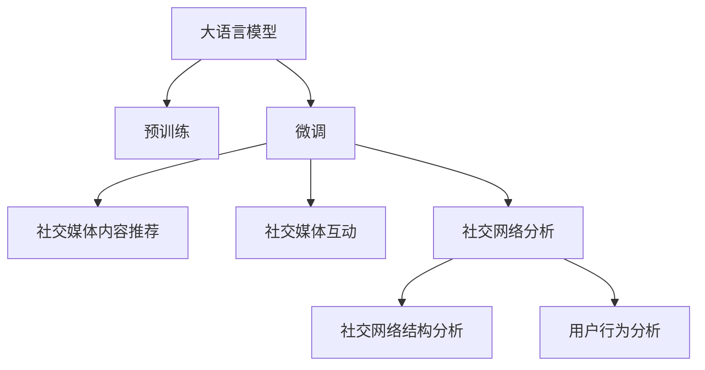

                 

# LLM 在社交媒体上的应用：内容推荐和社交互动

> 关键词：大语言模型(Large Language Model, LLM), 社交媒体, 内容推荐, 社交互动, 深度学习, 数据挖掘, 强化学习, 自然语言处理(NLP), 社交网络分析(SNA)

## 1. 背景介绍

### 1.1 问题由来
社交媒体作为21世纪最重要的信息传播渠道之一，对个人、组织乃至国家都具有深远的影响。然而，社交媒体的海量数据和复杂的用户行为模式也带来了巨大的挑战。如何高效地分析用户行为，提高内容推荐的精准度，以及促进用户之间的积极互动，是社交媒体平台亟需解决的问题。

近年来，大语言模型(Large Language Model, LLM)在自然语言处理(Natural Language Processing, NLP)领域的飞速发展，使其在社交媒体内容推荐和互动中展现了巨大的潜力。LLM通过在海量数据上预训练学习语言表示，并在社交媒体数据上进行微调，能够理解和生成符合用户需求的语言内容，实现高效的内容推荐和互动。

### 1.2 问题核心关键点
LLM在社交媒体上的应用主要聚焦于两个方面：

- **内容推荐**：基于用户的历史行为、兴趣偏好和当前语境，推荐其感兴趣的内容，如文章、视频、广告等，提升用户黏性和满意度。
- **社交互动**：通过理解用户的社交行为和语义，促进用户之间的互动，如回复评论、分享帖子、加入群组等，增强社交网络的活跃度和凝聚力。

LLM在内容推荐和社交互动中的应用，依赖于其强大的语言理解和生成能力，可以通过微调来适应特定的社交媒体场景，实现更为精准和个性化的服务。

## 2. 核心概念与联系

### 2.1 核心概念概述

为更好地理解LLM在社交媒体上的应用，本节将介绍几个密切相关的核心概念：

- **大语言模型(Large Language Model, LLM)**：以自回归(如GPT)或自编码(如BERT)模型为代表的大规模预训练语言模型。通过在海量无标签文本语料上进行预训练，学习通用的语言表示，具备强大的语言理解和生成能力。

- **预训练(Pre-training)**：指在大规模无标签文本语料上，通过自监督学习任务训练通用语言模型的过程。常见的预训练任务包括言语建模、遮挡语言模型等。预训练使得模型学习到语言的通用表示。

- **微调(Fine-tuning)**：指在预训练模型的基础上，使用社交媒体任务的少量标注数据，通过有监督学习优化模型在该任务上的性能。通常只需要调整顶层分类器或解码器，并以较小的学习率更新全部或部分的模型参数。

- **迁移学习(Transfer Learning)**：指将一个领域学习到的知识，迁移应用到另一个不同但相关的领域的学习范式。LLM的预训练-微调过程即是一种典型的迁移学习方式。

- **社交媒体**：通过网络技术实现的全球性互动平台，用户可以发布、评论、点赞、分享等内容，形成虚拟社交网络。

- **内容推荐系统**：通过算法推荐用户可能感兴趣的内容，如文章、视频、商品等，提高用户粘性和满意度。

- **社交网络分析(Social Network Analysis, SNA)**：通过分析社交网络中的结构、行为和交互，揭示社会关系、信息传播等规律。

这些核心概念之间的逻辑关系可以通过以下Mermaid流程图来展示：



这个流程图展示了大语言模型的核心概念及其之间的关系：

1. 大语言模型通过预训练获得基础能力。
2. 微调是对预训练模型进行任务特定的优化，可以分为社交媒体内容推荐和社交媒体互动。
3. 社交媒体互动和内容推荐共同构成了LLM在社交媒体上的主要应用。
4. 社交网络分析为内容推荐和互动提供了数据支持和行为洞察。

## 3. 核心算法原理 & 具体操作步骤
### 3.1 算法原理概述

基于LLM的社交媒体内容推荐和互动，本质上是一个有监督的细粒度迁移学习过程。其核心思想是：将预训练的大语言模型视作一个强大的"特征提取器"，通过在社交媒体任务的标注数据上进行有监督的微调，使得模型输出能够匹配任务标签，从而获得针对特定社交媒体任务的优化的模型。

形式化地，假设预训练模型为 $M_{\theta}$，其中 $\theta$ 为预训练得到的模型参数。给定社交媒体内容推荐任务的标注数据集 $D=\{(x_i, y_i)\}_{i=1}^N$，微调的目标是找到新的模型参数 $\hat{\theta}$，使得：

$$
\hat{\theta}=\mathop{\arg\min}_{\theta} \mathcal{L}(M_{\theta},D)
$$

其中 $\mathcal{L}$ 为针对社交媒体内容推荐任务的损失函数，用于衡量模型预测输出与真实标签之间的差异。常见的损失函数包括交叉熵损失、均方误差损失等。

通过梯度下降等优化算法，微调过程不断更新模型参数 $\theta$，最小化损失函数 $\mathcal{L}$，使得模型输出逼近真实标签。由于 $\theta$ 已经通过预训练获得了较好的初始化，因此即便在社交媒体数据集 $D$ 上进行微调，也能较快收敛到理想的模型参数 $\hat{\theta}$。

### 3.2 算法步骤详解

基于LLM的社交媒体内容推荐和互动一般包括以下几个关键步骤：

**Step 1: 准备预训练模型和数据集**
- 选择合适的预训练语言模型 $M_{\theta}$ 作为初始化参数，如 BERT、GPT等。
- 准备社交媒体内容推荐任务的标注数据集 $D$，划分为训练集、验证集和测试集。一般要求标注数据与预训练数据的分布不要差异过大。

**Step 2: 添加任务适配层**
- 根据社交媒体内容推荐任务的类型，在预训练模型顶层设计合适的输出层和损失函数。
- 对于分类任务，通常在顶层添加线性分类器和交叉熵损失函数。
- 对于生成任务，通常使用语言模型的解码器输出概率分布，并以负对数似然为损失函数。

**Step 3: 设置微调超参数**
- 选择合适的优化算法及其参数，如 AdamW、SGD 等，设置学习率、批大小、迭代轮数等。
- 设置正则化技术及强度，包括权重衰减、Dropout、Early Stopping等。
- 确定冻结预训练参数的策略，如仅微调顶层，或全部参数都参与微调。

**Step 4: 执行梯度训练**
- 将训练集数据分批次输入模型，前向传播计算损失函数。
- 反向传播计算参数梯度，根据设定的优化算法和学习率更新模型参数。
- 周期性在验证集上评估模型性能，根据性能指标决定是否触发 Early Stopping。
- 重复上述步骤直到满足预设的迭代轮数或 Early Stopping 条件。

**Step 5: 测试和部署**
- 在测试集上评估微调后模型 $M_{\hat{\theta}}$ 的性能，对比微调前后的精度提升。
- 使用微调后的模型对新样本进行推理预测，集成到实际的应用系统中。
- 持续收集新的数据，定期重新微调模型，以适应数据分布的变化。

以上是基于LLM的社交媒体内容推荐和互动的一般流程。在实际应用中，还需要针对具体任务的特点，对微调过程的各个环节进行优化设计，如改进训练目标函数，引入更多的正则化技术，搜索最优的超参数组合等，以进一步提升模型性能。

### 3.3 算法优缺点

基于LLM的社交媒体内容推荐和互动方法具有以下优点：
1. 简单高效。只需准备少量标注数据，即可对预训练模型进行快速适配，获得较大的性能提升。
2. 通用适用。适用于各种社交媒体推荐和互动任务，包括文本、图片、视频等，设计简单的任务适配层即可实现微调。
3. 性能优异。LLM在大规模数据上的预训练，使得微调后的模型具备很强的泛化能力和适应性，能够应对多样化的社交媒体场景。

同时，该方法也存在一定的局限性：
1. 数据依赖。微调的效果很大程度上取决于标注数据的质量和数量，获取高质量标注数据的成本较高。
2. 迁移能力有限。当目标任务与预训练数据的分布差异较大时，微调的性能提升有限。
3. 技术复杂度。LLM的微调需要一定的技术门槛，对模型的调参和优化有一定要求。
4. 伦理风险。LLM可能会学习到有害信息，通过微调传递到社交媒体上，造成负面影响。
5. 可解释性不足。微调模型的决策过程通常缺乏可解释性，难以对其推理逻辑进行分析和调试。

尽管存在这些局限性，但就目前而言，基于LLM的社交媒体内容推荐和互动方法仍是最主流范式。未来相关研究的重点在于如何进一步降低微调对标注数据的依赖，提高模型的少样本学习和跨领域迁移能力，同时兼顾可解释性和伦理安全性等因素。

### 3.4 算法应用领域

基于LLM的社交媒体内容推荐和互动方法在社交媒体领域已经得到了广泛的应用，覆盖了几乎所有常见任务，例如：

- 内容推荐：为用户推荐可能感兴趣的文章、视频、广告等。通常使用用户的历史行为和兴趣标签作为标注数据，微调推荐模型。
- 用户互动：促进用户之间的回复、点赞、评论、分享等互动行为。通过理解用户输入文本的语义，生成互动回应。
- 群组推荐：为用户推荐其可能感兴趣的群组或社区，帮助其加入兴趣相关的社交网络。
- 广告推荐：针对不同用户群体，推荐个性化的广告内容，提高广告投放效果。
- 内容生成：生成符合用户需求和社交媒体平台规范的内容，如自动生成话题标签、图片描述等。

除了上述这些经典任务外，LLM在社交媒体上还可以应用于更多场景中，如情感分析、舆情监控、用户画像构建、网络谣言检测等，为社交媒体平台带来了全新的技术突破。随着预训练语言模型和微调方法的不断进步，相信社交媒体内容推荐和互动技术将在更广阔的应用领域大放异彩。

## 4. 数学模型和公式 & 详细讲解  
### 4.1 数学模型构建

本节将使用数学语言对基于LLM的社交媒体内容推荐和互动过程进行更加严格的刻画。

记预训练语言模型为 $M_{\theta}$，其中 $\theta$ 为预训练得到的模型参数。假设社交媒体内容推荐任务的标注数据集为 $D=\{(x_i, y_i)\}_{i=1}^N, x_i \in \mathcal{X}, y_i \in \mathcal{Y}$。

定义模型 $M_{\theta}$ 在输入 $x$ 上的输出为 $\hat{y}=M_{\theta}(x) \in [0,1]$，表示样本属于正类的概率。真实标签 $y \in \{0,1\}$。则二分类交叉熵损失函数定义为：

$$
\ell(M_{\theta}(x),y) = -[y\log \hat{y} + (1-y)\log (1-\hat{y})]
$$

将其代入经验风险公式，得：

$$
\mathcal{L}(\theta) = -\frac{1}{N}\sum_{i=1}^N [y_i\log M_{\theta}(x_i)+(1-y_i)\log(1-M_{\theta}(x_i))]
$$

根据链式法则，损失函数对参数 $\theta_k$ 的梯度为：

$$
\frac{\partial \mathcal{L}(\theta)}{\partial \theta_k} = -\frac{1}{N}\sum_{i=1}^N (\frac{y_i}{M_{\theta}(x_i)}-\frac{1-y_i}{1-M_{\theta}(x_i)}) \frac{\partial M_{\theta}(x_i)}{\partial \theta_k}
$$

其中 $\frac{\partial M_{\theta}(x_i)}{\partial \theta_k}$ 可进一步递归展开，利用自动微分技术完成计算。

### 4.2 公式推导过程

以下我们以二分类任务为例，推导交叉熵损失函数及其梯度的计算公式。

假设模型 $M_{\theta}$ 在输入 $x$ 上的输出为 $\hat{y}=M_{\theta}(x) \in [0,1]$，表示样本属于正类的概率。真实标签 $y \in \{0,1\}$。则二分类交叉熵损失函数定义为：

$$
\ell(M_{\theta}(x),y) = -[y\log \hat{y} + (1-y)\log (1-\hat{y})]
$$

将其代入经验风险公式，得：

$$
\mathcal{L}(\theta) = -\frac{1}{N}\sum_{i=1}^N [y_i\log M_{\theta}(x_i)+(1-y_i)\log(1-M_{\theta}(x_i))]
$$

根据链式法则，损失函数对参数 $\theta_k$ 的梯度为：

$$
\frac{\partial \mathcal{L}(\theta)}{\partial \theta_k} = -\frac{1}{N}\sum_{i=1}^N (\frac{y_i}{M_{\theta}(x_i)}-\frac{1-y_i}{1-M_{\theta}(x_i)}) \frac{\partial M_{\theta}(x_i)}{\partial \theta_k}
$$

其中 $\frac{\partial M_{\theta}(x_i)}{\partial \theta_k}$ 可进一步递归展开，利用自动微分技术完成计算。

在得到损失函数的梯度后，即可带入参数更新公式，完成模型的迭代优化。重复上述过程直至收敛，最终得到适应社交媒体任务的最优模型参数 $\theta^*$。

## 5. 项目实践：代码实例和详细解释说明
### 5.1 开发环境搭建

在进行微调实践前，我们需要准备好开发环境。以下是使用Python进行PyTorch开发的环境配置流程：

1. 安装Anaconda：从官网下载并安装Anaconda，用于创建独立的Python环境。

2. 创建并激活虚拟环境：
```bash
conda create -n pytorch-env python=3.8 
conda activate pytorch-env
```

3. 安装PyTorch：根据CUDA版本，从官网获取对应的安装命令。例如：
```bash
conda install pytorch torchvision torchaudio cudatoolkit=11.1 -c pytorch -c conda-forge
```

4. 安装Transformers库：
```bash
pip install transformers
```

5. 安装各类工具包：
```bash
pip install numpy pandas scikit-learn matplotlib tqdm jupyter notebook ipython
```

完成上述步骤后，即可在`pytorch-env`环境中开始微调实践。

### 5.2 源代码详细实现

下面我以内容推荐任务为例，给出使用Transformers库对BERT模型进行微调的PyTorch代码实现。

首先，定义内容推荐任务的数据处理函数：

```python
from transformers import BertTokenizer
from torch.utils.data import Dataset
import torch

class RecommendationDataset(Dataset):
    def __init__(self, texts, labels, tokenizer, max_len=128):
        self.texts = texts
        self.labels = labels
        self.tokenizer = tokenizer
        self.max_len = max_len
        
    def __len__(self):
        return len(self.texts)
    
    def __getitem__(self, item):
        text = self.texts[item]
        label = self.labels[item]
        
        encoding = self.tokenizer(text, return_tensors='pt', max_length=self.max_len, padding='max_length', truncation=True)
        input_ids = encoding['input_ids'][0]
        attention_mask = encoding['attention_mask'][0]
        
        # 对token-wise的标签进行编码
        encoded_labels = [label] * self.max_len
        labels = torch.tensor(encoded_labels, dtype=torch.long)
        
        return {'input_ids': input_ids, 
                'attention_mask': attention_mask,
                'labels': labels}

# 标签与id的映射
label2id = {'positive': 1, 'negative': 0}
id2label = {v: k for k, v in label2id.items()}

# 创建dataset
tokenizer = BertTokenizer.from_pretrained('bert-base-cased')

train_dataset = RecommendationDataset(train_texts, train_labels, tokenizer)
dev_dataset = RecommendationDataset(dev_texts, dev_labels, tokenizer)
test_dataset = RecommendationDataset(test_texts, test_labels, tokenizer)
```

然后，定义模型和优化器：

```python
from transformers import BertForTokenClassification, AdamW

model = BertForTokenClassification.from_pretrained('bert-base-cased', num_labels=2)

optimizer = AdamW(model.parameters(), lr=2e-5)
```

接着，定义训练和评估函数：

```python
from torch.utils.data import DataLoader
from tqdm import tqdm
from sklearn.metrics import accuracy_score

device = torch.device('cuda') if torch.cuda.is_available() else torch.device('cpu')
model.to(device)

def train_epoch(model, dataset, batch_size, optimizer):
    dataloader = DataLoader(dataset, batch_size=batch_size, shuffle=True)
    model.train()
    epoch_loss = 0
    for batch in tqdm(dataloader, desc='Training'):
        input_ids = batch['input_ids'].to(device)
        attention_mask = batch['attention_mask'].to(device)
        labels = batch['labels'].to(device)
        model.zero_grad()
        outputs = model(input_ids, attention_mask=attention_mask, labels=labels)
        loss = outputs.loss
        epoch_loss += loss.item()
        loss.backward()
        optimizer.step()
    return epoch_loss / len(dataloader)

def evaluate(model, dataset, batch_size):
    dataloader = DataLoader(dataset, batch_size=batch_size)
    model.eval()
    preds, labels = [], []
    with torch.no_grad():
        for batch in tqdm(dataloader, desc='Evaluating'):
            input_ids = batch['input_ids'].to(device)
            attention_mask = batch['attention_mask'].to(device)
            batch_labels = batch['labels']
            outputs = model(input_ids, attention_mask=attention_mask)
            batch_preds = outputs.logits.argmax(dim=2).to('cpu').tolist()
            batch_labels = batch_labels.to('cpu').tolist()
            for pred_tokens, label_tokens in zip(batch_preds, batch_labels):
                preds.append(pred_tokens[:len(label_tokens)])
                labels.append(label_tokens)
                
    print(f"Accuracy: {accuracy_score(labels, preds):.2f}")
```

最后，启动训练流程并在测试集上评估：

```python
epochs = 5
batch_size = 16

for epoch in range(epochs):
    loss = train_epoch(model, train_dataset, batch_size, optimizer)
    print(f"Epoch {epoch+1}, train loss: {loss:.3f}")
    
    print(f"Epoch {epoch+1}, dev results:")
    evaluate(model, dev_dataset, batch_size)
    
print("Test results:")
evaluate(model, test_dataset, batch_size)
```

以上就是使用PyTorch对BERT进行内容推荐任务微调的完整代码实现。可以看到，得益于Transformers库的强大封装，我们可以用相对简洁的代码完成BERT模型的加载和微调。

### 5.3 代码解读与分析

让我们再详细解读一下关键代码的实现细节：

**RecommendationDataset类**：
- `__init__`方法：初始化文本、标签、分词器等关键组件。
- `__len__`方法：返回数据集的样本数量。
- `__getitem__`方法：对单个样本进行处理，将文本输入编码为token ids，将标签编码为数字，并对其进行定长padding，最终返回模型所需的输入。

**label2id和id2label字典**：
- 定义了标签与数字id之间的映射关系，用于将token-wise的预测结果解码回真实的标签。

**训练和评估函数**：
- 使用PyTorch的DataLoader对数据集进行批次化加载，供模型训练和推理使用。
- 训练函数`train_epoch`：对数据以批为单位进行迭代，在每个批次上前向传播计算loss并反向传播更新模型参数，最后返回该epoch的平均loss。
- 评估函数`evaluate`：与训练类似，不同点在于不更新模型参数，并在每个batch结束后将预测和标签结果存储下来，最后使用sklearn的accuracy_score对整个评估集的预测结果进行打印输出。

**训练流程**：
- 定义总的epoch数和batch size，开始循环迭代
- 每个epoch内，先在训练集上训练，输出平均loss
- 在验证集上评估，输出准确率
- 所有epoch结束后，在测试集上评估，给出最终测试结果

可以看到，PyTorch配合Transformers库使得BERT微调的内容推荐任务的代码实现变得简洁高效。开发者可以将更多精力放在数据处理、模型改进等高层逻辑上，而不必过多关注底层的实现细节。

当然，工业级的系统实现还需考虑更多因素，如模型的保存和部署、超参数的自动搜索、更灵活的任务适配层等。但核心的微调范式基本与此类似。

## 6. 实际应用场景
### 6.1 智能客服系统

基于LLM的对话技术，可以广泛应用于智能客服系统的构建。传统客服往往需要配备大量人力，高峰期响应缓慢，且一致性和专业性难以保证。而使用微调后的对话模型，可以7x24小时不间断服务，快速响应客户咨询，用自然流畅的语言解答各类常见问题。

在技术实现上，可以收集企业内部的历史客服对话记录，将问题和最佳答复构建成监督数据，在此基础上对预训练对话模型进行微调。微调后的对话模型能够自动理解用户意图，匹配最合适的答案模板进行回复。对于客户提出的新问题，还可以接入检索系统实时搜索相关内容，动态组织生成回答。如此构建的智能客服系统，能大幅提升客户咨询体验和问题解决效率。

### 6.2 金融舆情监测

金融机构需要实时监测市场舆论动向，以便及时应对负面信息传播，规避金融风险。传统的人工监测方式成本高、效率低，难以应对网络时代海量信息爆发的挑战。基于LLM的文本分类和情感分析技术，为金融舆情监测提供了新的解决方案。

具体而言，可以收集金融领域相关的新闻、报道、评论等文本数据，并对其进行主题标注和情感标注。在此基础上对预训练语言模型进行微调，使其能够自动判断文本属于何种主题，情感倾向是正面、中性还是负面。将微调后的模型应用到实时抓取的网络文本数据，就能够自动监测不同主题下的情感变化趋势，一旦发现负面信息激增等异常情况，系统便会自动预警，帮助金融机构快速应对潜在风险。

### 6.3 个性化推荐系统

当前的推荐系统往往只依赖用户的历史行为数据进行物品推荐，无法深入理解用户的真实兴趣偏好。基于LLM的个性化推荐系统可以更好地挖掘用户行为背后的语义信息，从而提供更精准、多样的推荐内容。

在实践中，可以收集用户浏览、点击、评论、分享等行为数据，提取和用户交互的物品标题、描述、标签等文本内容。将文本内容作为模型输入，用户的后续行为（如是否点击、购买等）作为监督信号，在此基础上微调预训练语言模型。微调后的模型能够从文本内容中准确把握用户的兴趣点。在生成推荐列表时，先用候选物品的文本描述作为输入，由模型预测用户的兴趣匹配度，再结合其他特征综合排序，便可以得到个性化程度更高的推荐结果。

### 6.4 未来应用展望

随着LLM和微调方法的不断发展，基于微调范式将在更多领域得到应用，为传统行业带来变革性影响。

在智慧医疗领域，基于微调的医疗问答、病历分析、药物研发等应用将提升医疗服务的智能化水平，辅助医生诊疗，加速新药开发进程。

在智能教育领域，微调技术可应用于作业批改、学情分析、知识推荐等方面，因材施教，促进教育公平，提高教学质量。

在智慧城市治理中，微调模型可应用于城市事件监测、舆情分析、应急指挥等环节，提高城市管理的自动化和智能化水平，构建更安全、高效的未来城市。

此外，在企业生产、社会治理、文娱传媒等众多领域，基于LLM微调的人工智能应用也将不断涌现，为经济社会发展注入新的动力。相信随着技术的日益成熟，LLM微调技术将成为人工智能落地应用的重要范式，推动人工智能技术在垂直行业的规模化落地。

## 7. 工具和资源推荐
### 7.1 学习资源推荐

为了帮助开发者系统掌握LLM微调的理论基础和实践技巧，这里推荐一些优质的学习资源：

1. 《Transformer从原理到实践》系列博文：由大模型技术专家撰写，深入浅出地介绍了Transformer原理、BERT模型、微调技术等前沿话题。

2. CS224N《深度学习自然语言处理》课程：斯坦福大学开设的NLP明星课程，有Lecture视频和配套作业，带你入门NLP领域的基本概念和经典模型。

3. 《Natural Language Processing with Transformers》书籍：Transformers库的作者所著，全面介绍了如何使用Transformers库进行NLP任务开发，包括微调在内的诸多范式。

4. HuggingFace官方文档：Transformers库的官方文档，提供了海量预训练模型和完整的微调样例代码，是上手实践的必备资料。

5. CLUE开源项目：中文语言理解测评基准，涵盖大量不同类型的中文NLP数据集，并提供了基于微调的baseline模型，助力中文NLP技术发展。

通过对这些资源的学习实践，相信你一定能够快速掌握LLM微调的精髓，并用于解决实际的NLP问题。
###  7.2 开发工具推荐

高效的开发离不开优秀的工具支持。以下是几款用于LLM微调开发的常用工具：

1. PyTorch：基于Python的开源深度学习框架，灵活动态的计算图，适合快速迭代研究。大部分预训练语言模型都有PyTorch版本的实现。

2. TensorFlow：由Google主导开发的开源深度学习框架，生产部署方便，适合大规模工程应用。同样有丰富的预训练语言模型资源。

3. Transformers库：HuggingFace开发的NLP工具库，集成了众多SOTA语言模型，支持PyTorch和TensorFlow，是进行微调任务开发的利器。

4. Weights & Biases：模型训练的实验跟踪工具，可以记录和可视化模型训练过程中的各项指标，方便对比和调优。与主流深度学习框架无缝集成。

5. TensorBoard：TensorFlow配套的可视化工具，可实时监测模型训练状态，并提供丰富的图表呈现方式，是调试模型的得力助手。

6. Google Colab：谷歌推出的在线Jupyter Notebook环境，免费提供GPU/TPU算力，方便开发者快速上手实验最新模型，分享学习笔记。

合理利用这些工具，可以显著提升LLM微调任务的开发效率，加快创新迭代的步伐。

### 7.3 相关论文推荐

LLM和微调技术的发展源于学界的持续研究。以下是几篇奠基性的相关论文，推荐阅读：

1. Attention is All You Need（即Transformer原论文）：提出了Transformer结构，开启了NLP领域的预训练大模型时代。

2. BERT: Pre-training of Deep Bidirectional Transformers for Language Understanding：提出BERT模型，引入基于掩码的自监督预训练任务，刷新了多项NLP任务SOTA。

3. Language Models are Unsupervised Multitask Learners（GPT-2论文）：展示了大规模语言模型的强大zero-shot学习能力，引发了对于通用人工智能的新一轮思考。

4. Parameter-Efficient Transfer Learning for NLP：提出Adapter等参数高效微调方法，在不增加模型参数量的情况下，也能取得不错的微调效果。

5. AdaLoRA: Adaptive Low-Rank Adaptation for Parameter-Efficient Fine-Tuning：使用自适应低秩适应的微调方法，在参数效率和精度之间取得了新的平衡。

这些论文代表了大语言模型微调技术的发展脉络。通过学习这些前沿成果，可以帮助研究者把握学科前进方向，激发更多的创新灵感。

## 8. 总结：未来发展趋势与挑战
### 8.1 总结

本文对基于LLM的社交媒体内容推荐和互动方法进行了全面系统的介绍。首先阐述了LLM在社交媒体上的应用背景和意义，明确了内容推荐和社交互动在社交媒体平台中的重要价值。其次，从原理到实践，详细讲解了LLM微调的数学原理和关键步骤，给出了微调任务开发的完整代码实例。同时，本文还广泛探讨了LLM在社交媒体内容推荐和互动中的应用前景，展示了LLM微调范式的巨大潜力。

通过本文的系统梳理，可以看到，基于LLM的社交媒体内容推荐和互动方法正在成为社交媒体平台的重要范式，极大地提升了用户粘性和满意度。得益于预训练语言模型的强大能力和微调技术的灵活性，LLM在社交媒体中的应用前景广阔。未来，随着LLM和微调方法的不断进步，基于LLM的社交媒体内容推荐和互动技术将在更广阔的应用领域大放异彩，深刻影响人类的生产生活方式。

### 8.2 未来发展趋势

展望未来，LLM在社交媒体内容推荐和互动领域将呈现以下几个发展趋势：

1. **内容推荐的多样化**：随着数据和算法的不断进步，社交媒体平台将提供更多样化、个性化的内容推荐服务，如基于用户兴趣、情感、时间等维度的推荐算法，提升用户满意度和互动质量。

2. **社交互动的智能化**：基于LLM的智能对话技术将进一步成熟，能够在更广泛的场景下实现高质量的互动，如情感交流、娱乐娱乐、教育辅助等，构建更加自然和谐的社交网络。

3. **跨平台协同**：社交媒体平台将打破界限，实现多平台间的协同推荐和互动，提升用户的整体体验和粘性。

4. **增强现实(AR)和虚拟现实(VR)的融合**：随着AR和VR技术的发展，社交媒体内容推荐和互动将更多地利用这些新兴技术，为用户提供更沉浸、互动的体验。

5. **隐私保护和安全**：随着数据隐私和安全问题的日益突出，社交媒体平台将更加注重用户隐私保护，采取更严格的隐私保护措施，确保用户数据的安全性和隐私性。

6. **跨语言和跨文化**：LLM将更加注重跨语言和跨文化的适应性，实现多语言自然交互和全球化的社交网络，提升全球用户的体验。

以上趋势凸显了LLM在社交媒体上的应用前景。这些方向的探索发展，将进一步提升社交媒体平台的智能化和用户体验，为未来的社交网络构建带来新的机遇。

### 8.3 面临的挑战

尽管LLM在社交媒体内容推荐和互动方面展现了巨大的潜力，但在迈向更加智能化、普适化应用的过程中，它仍面临诸多挑战：

1. **数据隐私和安全**：社交媒体平台需要平衡用户隐私保护和数据使用的需求，避免用户数据滥用和隐私泄露。

2. **技术复杂度**：LLM微调和优化需要较高的技术门槛，涉及模型调参、优化器选择、正则化技术等环节，对开发者提出了更高的要求。

3. **算法透明性和可解释性**：LLM的决策过程通常缺乏可解释性，用户难以理解模型的输出逻辑和决策依据，可能会对用户信任度产生负面影响。

4. **公平性和偏见**：LLM在训练过程中可能会学习到有偏见的信息，对特定群体的输出可能存在偏差，引发社会公平性问题。

5. **鲁棒性和泛化性**：LLM在面对新数据时，可能会出现泛化性能下降或鲁棒性不足的情况，影响模型的实用性和稳定性。

6. **伦理和法律问题**：LLM在社交媒体应用中可能涉及隐私保护、版权等问题，需要制定相应的伦理和法律规范。

尽管存在这些挑战，但通过不断优化算法、加强监管、提高透明度，相信LLM在社交媒体上的应用将逐步走向成熟，为人类社会的数字化转型提供新的动力。

### 8.4 研究展望

面对LLM在社交媒体内容推荐和互动中面临的诸多挑战，未来的研究需要在以下几个方面寻求新的突破：

1. **隐私保护技术**：研究如何在使用用户数据进行模型微调时，保证数据隐私和安全，避免数据滥用和泄露。

2. **公平性算法**：开发更加公平、公正的推荐和互动算法，避免算法偏见，保障用户权益。

3. **可解释性增强**：探索增强模型的可解释性和可理解性，让用户能够更好地理解模型的决策逻辑和输出结果。

4. **跨语言和跨文化适应性**：研究如何构建更加通用、多语言的LLM模型，提升其跨文化适应性和国际竞争力。

5. **鲁棒性和泛化性提升**：开发更加鲁棒和泛化的LLM模型，应对复杂多变的社交媒体场景和数据分布。

6. **算法透明性和可审计性**：研究如何提升算法的透明性和可审计性，确保模型的公正性和可靠性。

这些研究方向将引领LLM在社交媒体内容推荐和互动中的应用不断深化，为构建更智能、公正、安全的社交网络奠定基础。面向未来，LLM微调技术将在多领域得到广泛应用，推动人工智能技术向更加智能化、普适化方向发展。

## 9. 附录：常见问题与解答

**Q1：基于LLM的社交媒体内容推荐和互动是否适用于所有社交媒体平台？**

A: 基于LLM的社交媒体内容推荐和互动方法适用于大多数社交媒体平台，包括微博、微信、Twitter等。然而，不同平台的社交网络结构和用户行为模式存在差异，需要根据具体平台的特点进行微调和优化。

**Q2：如何进行LLM在社交媒体内容推荐和互动中的模型微调？**

A: 基于LLM的社交媒体内容推荐和互动的模型微调，通常遵循以下步骤：
1. 收集社交媒体平台的标注数据，包括用户行为、兴趣、互动等数据。
2. 选择合适的预训练语言模型（如BERT、GPT等）作为初始化参数。
3. 添加任务适配层，设计合适的输出层和损失函数。
4. 设置微调超参数，包括学习率、批大小、迭代轮数等。
5. 使用标注数据对模型进行微调，最小化损失函数。
6. 在验证集上评估模型性能，调整超参数。
7. 在测试集上测试微调后的模型，评估推荐和互动效果。
8. 持续收集新数据，定期重新微调模型，以适应数据分布的变化。

**Q3：LLM在社交媒体上的应用需要注意哪些伦理和安全问题？**

A: 基于LLM的社交媒体应用需要特别注意以下伦理和安全问题：
1. 数据隐私：确保用户数据的安全性和隐私性，避免数据滥用和泄露。
2. 算法偏见：避免LLM学习到有偏见的信息，避免对特定群体的输出存在偏差。
3. 鲁棒性：确保LLM在面对新数据和复杂环境时，具有鲁棒性和泛化能力，避免模型失效。
4. 安全性和稳定性：确保LLM的应用不会导致网络攻击、虚假信息传播等安全问题。

开发者需要制定相应的伦理和安全规范，建立完善的监管机制，确保LLM在社交媒体上的应用健康发展。

**Q4：LLM在社交媒体内容推荐和互动中的推荐算法有哪些？**

A: 社交媒体内容推荐算法通常包括：
1. 基于协同过滤的推荐算法，如矩阵分解、邻域推荐等。
2. 基于内容的推荐算法，如文本相似度、标签匹配等。
3. 基于混合模型的推荐算法，如基于内容与协同过滤的混合推荐、深度学习与协同过滤的混合推荐等。
4. 基于自然语言处理的推荐算法，如基于LLM的内容推荐算法。

这些算法可以根据具体的社交媒体平台和任务特点，选择适合的推荐算法，提升推荐效果。

**Q5：如何在LLM微调中避免过拟合？**

A: 在LLM微调中避免过拟合，通常可以采取以下措施：
1. 数据增强：通过回译、近义替换等方式扩充训练集。
2. 正则化技术：使用L2正则、Dropout、Early Stopping等防止模型过度适应训练数据。
3. 参数高效微调：只更新极少量的任务相关参数，避免过拟合。
4. 对抗训练：引入对抗样本，提高模型鲁棒性。
5. 多模型集成：训练多个微调模型，取平均输出，抑制过拟合。

这些策略通常需要根据具体任务和数据特点进行灵活组合，以达到最佳的微调效果。

---

作者：禅与计算机程序设计艺术 / Zen and the Art of Computer Programming

