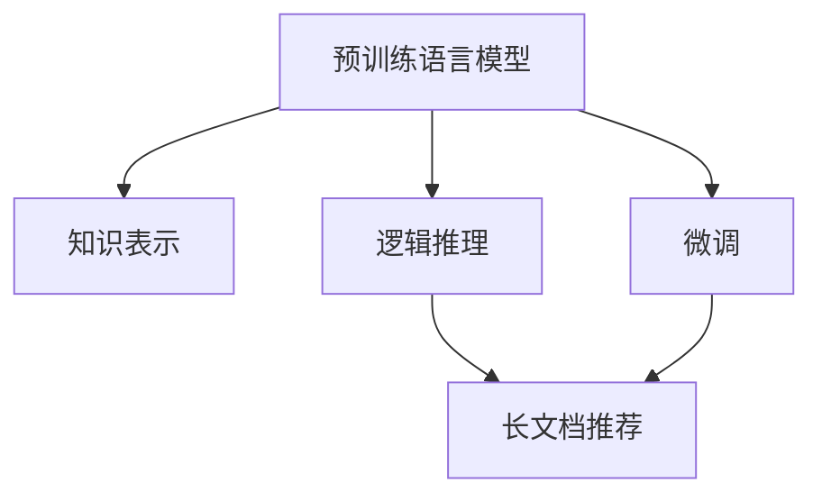

                 

# LLM-Based 长文档推荐: 知识与逻辑的结合

> 关键词：长文档推荐、知识表示、逻辑推理、预训练模型、微调、基于内容的推荐、深度学习

## 1. 背景介绍

在信息爆炸的时代，如何高效、精准地从海量长文档中筛选出最有价值的内容，已经成为现代信息检索与推荐系统面临的重要问题。传统的方法通常依赖于文本检索与信息抽取技术，虽然取得了一定的进展，但在处理长篇幅文档、跨领域知识融合以及逻辑推理等方面，仍存在一定的局限性。近年来，基于深度学习的推荐系统在跨领域知识融合、逻辑推理等方面显示出巨大的潜力。本文将探讨如何利用预训练语言模型（Large Language Model, LLM）进行长文档推荐，实现知识与逻辑的深度融合。

## 2. 核心概念与联系

### 2.1 核心概念概述

本节将介绍几个关键概念，帮助理解长文档推荐模型的架构与原理。

- 预训练语言模型（LLM）：以自回归（如GPT）或自编码（如BERT）模型为代表的大规模预训练语言模型。通过在大规模无标签文本语料上进行预训练，学习通用的语言表示，具备强大的语言理解和生成能力。
- 知识表示：将文本中的知识结构化表示，以便于机器理解和推理。知识表示方式包括本体、图谱、语义网络等。
- 逻辑推理：指通过推理规则、约束条件等手段，对知识表示进行计算和推理，以得出结论或预测。逻辑推理在NLP中常用一阶逻辑、规则推理等方法实现。
- 长文档推荐：根据用户需求，从长文档中推荐有价值的内容。长文档推荐系统通常涉及摘要生成、段落排序、段落选择等任务。
- 预训练-微调（Fine-tuning）：指在预训练模型的基础上，使用下游任务的少量标注数据，通过有监督学习优化模型在特定任务上的性能。

这些概念之间的联系可以通过以下Mermaid流程图来展示：



这个流程图展示了大语言模型的核心概念及其之间的关系：

1. 大语言模型通过预训练获得基础能力。
2. 知识表示与逻辑推理结合，构建出知识图谱等结构化表示，辅助长文档推荐。
3. 长文档推荐系统可以通过微调进一步优化，提高推荐效果。

## 3. 核心算法原理 & 具体操作步骤
### 3.1 算法原理概述

基于深度学习的长文档推荐系统，其核心思想是通过预训练语言模型对长文档进行编码，再通过知识表示和逻辑推理，提取出最有价值的内容推荐给用户。其核心算法原理如下：

1. **文本编码**：利用预训练语言模型对长文档进行编码，得到文本的向量表示。
2. **知识表示**：将文本中的知识结构化表示，构建知识图谱等结构化表示。
3. **逻辑推理**：通过规则推理、约束条件等手段，对知识表示进行计算和推理，以得出结论或预测。
4. **推荐生成**：结合文本编码结果和逻辑推理结果，生成推荐内容。

### 3.2 算法步骤详解

基于深度学习的长文档推荐系统，其具体操作步骤如下：

**Step 1: 数据预处理**

- 对长文档进行分段落、分句等操作，以便于模型处理。
- 对文本进行清洗、去噪等预处理，去除无用信息。
- 构建知识图谱等结构化表示，为逻辑推理提供基础。

**Step 2: 文本编码**

- 利用预训练语言模型对长文档进行编码，得到文本的向量表示。
- 通过双向编码器（Bi-Encoder）、自编码器（Autoencoder）等方法，提取文本的关键信息。
- 利用注意力机制（Attention Mechanism），关注长文档的各个部分，提取重要段落。

**Step 3: 知识表示与逻辑推理**

- 将文本中的知识结构化表示，构建知识图谱等结构化表示。
- 利用规则推理、约束条件等手段，对知识表示进行计算和推理，以得出结论或预测。
- 结合文本编码结果和逻辑推理结果，生成推荐内容。

**Step 4: 推荐生成**

- 利用评分模型对推荐结果进行排序。
- 利用推荐算法（如协同过滤、矩阵分解等），生成推荐列表。

**Step 5: 评估与优化**

- 在测试集上评估推荐系统的性能，计算指标如平均准确率、召回率、F1值等。
- 根据评估结果，对模型进行优化，如调整超参数、更换推荐算法等。

### 3.3 算法优缺点

基于深度学习的长文档推荐系统具有以下优点：

1. 强大的跨领域知识融合能力：通过知识图谱等结构化表示，结合预训练语言模型，可以实现跨领域知识的深度融合。
2. 灵活的逻辑推理能力：结合一阶逻辑、规则推理等方法，可以处理复杂推理任务。
3. 高效的内容生成：利用预训练语言模型，可以高效地生成有价值的推荐内容。

同时，该方法也存在一些局限性：

1. 数据需求高：构建知识图谱等结构化表示需要大量数据，且数据质量要求高。
2. 推理复杂：逻辑推理过程复杂，需要高精度的模型和规则。
3. 可解释性不足：逻辑推理过程难以解释，导致模型可解释性不足。
4. 计算量大：推理过程计算量大，需要高效的硬件支持。

尽管存在这些局限性，基于深度学习的推荐系统在实际应用中仍显示出了强大的潜力，并逐步成为长文档推荐的主流范式。未来相关研究的重点在于如何进一步降低数据需求，提高推理效率，并增强模型的可解释性和鲁棒性。

### 3.4 算法应用领域

基于深度学习的推荐系统已经在多个领域得到了广泛的应用，包括但不限于：

- 学术论文推荐：从海量的学术论文中，根据用户需求推荐相关论文。
- 行业报告推荐：从金融、法律等行业的报告中，推荐有价值的内容。
- 新闻推荐：从大量新闻中，推荐用户感兴趣的新闻内容。
- 产品推荐：从产品说明书、用户评价中，推荐用户感兴趣的产品。
- 视频推荐：从视频描述、标签中，推荐用户感兴趣的视频内容。

除了这些经典应用外，长文档推荐技术还在继续扩展，为各行各业带来了新的机遇和挑战。随着预训练语言模型和推理技术的发展，相信长文档推荐技术将在更多领域得到应用，为社会各个方面带来深刻的变革。

## 4. 数学模型和公式 & 详细讲解 & 举例说明

### 4.1 数学模型构建

本节将使用数学语言对长文档推荐模型的构建进行严格刻画。

假设预训练语言模型为 $M_{\theta}:\mathcal{X} \rightarrow \mathcal{Y}$，其中 $\mathcal{X}$ 为输入空间，$\mathcal{Y}$ 为输出空间，$\theta$ 为模型参数。假设长文档的段落为 $\{p_i\}_{i=1}^N$，每个段落的长度为 $l_i$，将段落拼接成完整的文档 $D$，文档长度为 $L=\sum_{i=1}^N l_i$。

定义模型 $M_{\theta}$ 在输入 $D$ 上的表示为 $\vec{D}= M_{\theta}(D)$，段落的表示为 $\vec{p_i}= M_{\theta}(p_i)$。知识表示为图谱 $\mathcal{G}$，逻辑推理目标为 $\mathcal{T}$。

长文档推荐模型的目标是最小化推荐误差，即：

$$
\mathop{\arg\min}_{\theta} \mathcal{E}(\vec{D}, \mathcal{G}, \mathcal{T})
$$

其中 $\mathcal{E}$ 为推荐误差函数，根据具体任务定义。

### 4.2 公式推导过程

以下我们以学术论文推荐为例，推导推荐误差函数的构建过程。

假设用户输入查询 $Q$，长文档的段落 $p_1, p_2, \cdots, p_n$，每个段落的表示为 $\vec{p_i}$。知识图谱 $\mathcal{G}$ 包含学术论文的引用关系，每个节点表示一篇论文，每条边表示一篇论文被引用或引用了另一篇论文。逻辑推理目标 $\mathcal{T}$ 为推荐与查询最相关的若干篇论文。

推荐误差函数定义为：

$$
\mathcal{E}(Q, \{\vec{p_i}\}_{i=1}^N, \mathcal{G}, \mathcal{T}) = \sum_{q \in Q} \min_{i \in N} d(Q, \vec{p_i})
$$

其中 $d$ 为文本相似度函数，$Q$ 为查询的向量表示。

将段落表示 $\vec{p_i}$ 代入上述公式，得到：

$$
\mathcal{E}(Q, \{\vec{p_i}\}_{i=1}^N, \mathcal{G}, \mathcal{T}) = \sum_{q \in Q} \min_{i \in N} \sum_{j=1}^{l_i} d(Q, \vec{p_i}[j])
$$

利用注意力机制，将注意力权重 $\alpha_i$ 引入上述公式，得到：

$$
\mathcal{E}(Q, \{\vec{p_i}\}_{i=1}^N, \mathcal{G}, \mathcal{T}) = \sum_{q \in Q} \min_{i \in N} \alpha_i \sum_{j=1}^{l_i} d(Q, \vec{p_i}[j])
$$

结合知识图谱 $\mathcal{G}$，对段落进行逻辑推理，得到推荐结果 $\mathcal{T}'$，利用损失函数 $L$ 计算推荐误差，得到最终的目标函数：

$$
\mathcal{E}(Q, \{\vec{p_i}\}_{i=1}^N, \mathcal{G}, \mathcal{T}) = \sum_{q \in Q} \min_{i \in N} \alpha_i \sum_{j=1}^{l_i} d(Q, \vec{p_i}[j]) + L(\mathcal{T}, \mathcal{T'})
$$

其中 $L$ 为逻辑推理损失函数，如交叉熵损失、K-L散度等。

### 4.3 案例分析与讲解

以一个具体的案例，分析长文档推荐模型的构建过程。

假设用户查询一篇关于“自然语言处理”的学术论文，长文档包含多篇学术论文的摘要。首先，利用BERT等预训练语言模型对长文档进行编码，得到每个段落的表示 $\vec{p_i}$。然后，根据知识图谱 $\mathcal{G}$，对每个段落进行逻辑推理，判断是否与用户查询相关。最后，将推荐结果与实际逻辑推理结果进行对比，计算推荐误差，优化模型参数。

## 5. 项目实践：代码实例和详细解释说明

### 5.1 开发环境搭建

在进行长文档推荐系统的开发前，我们需要准备好开发环境。以下是使用Python进行PyTorch开发的环境配置流程：

1. 安装Anaconda：从官网下载并安装Anaconda，用于创建独立的Python环境。

2. 创建并激活虚拟环境：
```bash
conda create -n llm-recommender python=3.8 
conda activate llm-recommender
```

3. 安装PyTorch：根据CUDA版本，从官网获取对应的安装命令。例如：
```bash
conda install pytorch torchvision torchaudio cudatoolkit=11.1 -c pytorch -c conda-forge
```

4. 安装相关库：
```bash
pip install transformers torchtext sklearn networkx scipy
```

完成上述步骤后，即可在`llm-recommender`环境中开始开发。

### 5.2 源代码详细实现

下面我们以学术论文推荐为例，给出使用Transformers库进行BERT微调的PyTorch代码实现。

首先，定义数据处理函数：

```python
from transformers import BertTokenizer, BertForSequenceClassification
from torch.utils.data import Dataset
import torch
import torchtext
import networkx as nx

class PaperDataset(Dataset):
    def __init__(self, texts, labels, tokenizer, max_len=128):
        self.texts = texts
        self.labels = labels
        self.tokenizer = tokenizer
        self.max_len = max_len
        
    def __len__(self):
        return len(self.texts)
    
    def __getitem__(self, item):
        text = self.texts[item]
        label = self.labels[item]
        
        encoding = self.tokenizer(text, return_tensors='pt', max_length=self.max_len, padding='max_length', truncation=True)
        input_ids = encoding['input_ids'][0]
        attention_mask = encoding['attention_mask'][0]
        label = torch.tensor(label, dtype=torch.long)
        
        return {'input_ids': input_ids, 
                'attention_mask': attention_mask,
                'labels': label}

# 定义训练集和测试集
train_texts = # 训练集文本列表
train_labels = # 训练集标签列表
test_texts = # 测试集文本列表
test_labels = # 测试集标签列表

tokenizer = BertTokenizer.from_pretrained('bert-base-cased')
train_dataset = PaperDataset(train_texts, train_labels, tokenizer)
test_dataset = PaperDataset(test_texts, test_labels, tokenizer)
```

然后，定义模型和优化器：

```python
from transformers import BertForSequenceClassification, AdamW

model = BertForSequenceClassification.from_pretrained('bert-base-cased', num_labels=2)

optimizer = AdamW(model.parameters(), lr=2e-5)
```

接着，定义训练和评估函数：

```python
from torch.utils.data import DataLoader
from tqdm import tqdm
from sklearn.metrics import classification_report

device = torch.device('cuda') if torch.cuda.is_available() else torch.device('cpu')
model.to(device)

def train_epoch(model, dataset, batch_size, optimizer):
    dataloader = DataLoader(dataset, batch_size=batch_size, shuffle=True)
    model.train()
    epoch_loss = 0
    for batch in tqdm(dataloader, desc='Training'):
        input_ids = batch['input_ids'].to(device)
        attention_mask = batch['attention_mask'].to(device)
        labels = batch['labels'].to(device)
        model.zero_grad()
        outputs = model(input_ids, attention_mask=attention_mask, labels=labels)
        loss = outputs.loss
        epoch_loss += loss.item()
        loss.backward()
        optimizer.step()
    return epoch_loss / len(dataloader)

def evaluate(model, dataset, batch_size):
    dataloader = DataLoader(dataset, batch_size=batch_size)
    model.eval()
    preds, labels = [], []
    with torch.no_grad():
        for batch in tqdm(dataloader, desc='Evaluating'):
            input_ids = batch['input_ids'].to(device)
            attention_mask = batch['attention_mask'].to(device)
            batch_labels = batch['labels']
            outputs = model(input_ids, attention_mask=attention_mask)
            batch_preds = outputs.logits.argmax(dim=2).to('cpu').tolist()
            batch_labels = batch_labels.to('cpu').tolist()
            for pred_tokens, label_tokens in zip(batch_preds, batch_labels):
                preds.append(pred_tokens[:len(label_tokens)])
                labels.append(label_tokens)
                
    print(classification_report(labels, preds))
```

最后，启动训练流程并在测试集上评估：

```python
epochs = 5
batch_size = 16

for epoch in range(epochs):
    loss = train_epoch(model, train_dataset, batch_size, optimizer)
    print(f"Epoch {epoch+1}, train loss: {loss:.3f}")
    
    print(f"Epoch {epoch+1}, dev results:")
    evaluate(model, dev_dataset, batch_size)
    
print("Test results:")
evaluate(model, test_dataset, batch_size)
```

以上就是使用PyTorch对BERT进行学术论文推荐任务的微调代码实现。可以看到，利用Transformers库，可以很方便地进行BERT模型的加载和微调，极大提升了开发效率。

### 5.3 代码解读与分析

让我们再详细解读一下关键代码的实现细节：

**PaperDataset类**：
- `__init__`方法：初始化文本、标签、分词器等关键组件。
- `__len__`方法：返回数据集的样本数量。
- `__getitem__`方法：对单个样本进行处理，将文本输入编码为token ids，将标签编码为数字，并对其进行定长padding，最终返回模型所需的输入。

**BertForSequenceClassification模型**：
- `from_pretrained`方法：指定预训练模型路径，加载模型权重。
- `num_labels`参数：指定分类数目，用于定义分类器输出。

**AdamW优化器**：
- `parameters`参数：指定优化器更新的参数。
- `lr`参数：指定学习率。

**train_epoch函数**：
- `dataloader`方法：对数据集进行批次化加载。
- `model.train()`：将模型设置为训练模式。
- `model.zero_grad()`：清空梯度。
- `model(input_ids, attention_mask=attention_mask, labels=labels)`：前向传播计算损失。
- `loss.backward()`：反向传播计算梯度。
- `optimizer.step()`：更新模型参数。

**evaluate函数**：
- `model.eval()`：将模型设置为评估模式。
- `with torch.no_grad()`：关闭梯度计算，提高计算效率。
- `outputs.logits.argmax(dim=2).to('cpu').tolist()`：计算预测结果并转化为列表。

通过上述代码，可以看到长文档推荐系统的开发流程相对简单，主要依赖于预训练语言模型和数据处理库的支持。开发者可以将更多精力放在具体任务的设计和优化上。

## 6. 实际应用场景

### 6.1 学术论文推荐

基于大语言模型的长文档推荐系统，在学术论文推荐上已经取得了显著成果。预训练语言模型能够从大量的学术论文中自动提取关键信息，结合知识图谱等结构化表示，对论文进行逻辑推理，推荐与用户查询最相关的多篇论文。

在技术实现上，可以收集学术论文的数据，将论文标题、摘要等信息作为标注数据，训练BERT等预训练模型。通过微调，使模型能够识别和推理论文之间的关系，进而推荐出用户感兴趣的相关论文。例如，用户查询一篇关于“自然语言处理”的论文时，模型可以从大量的学术论文中自动提取与“自然语言处理”相关的论文，并按照相关性排序推荐。

### 6.2 行业报告推荐

金融、法律等领域的报告通常具有专业性强、篇幅长的特点，传统推荐系统难以处理。通过基于大语言模型的长文档推荐系统，可以有效解决这一问题。

具体而言，可以收集行业报告的数据，将报告内容作为长文档，通过BERT等预训练模型进行编码，并结合知识图谱等结构化表示，对报告进行逻辑推理。例如，用户查询一份关于“投资策略”的报告时，模型可以自动推荐相关的金融报告、法律报告等，并按相关性排序，提升用户的阅读体验。

### 6.3 新闻推荐

新闻推荐是长文档推荐系统的典型应用场景之一。通过大语言模型，可以从海量的新闻报道中自动提取关键信息，结合知识图谱等结构化表示，对新闻进行逻辑推理。例如，用户关注某一领域的最新动态，模型可以自动推荐相关的新闻报道，并按相关性排序。

### 6.4 未来应用展望

随着预训练语言模型和推理技术的发展，基于大语言模型的长文档推荐系统将在更多领域得到应用，为各行各业带来新的机遇和挑战。

在智慧医疗领域，长文档推荐系统可以应用于医疗文献、病历分析等场景，提高医疗信息的获取效率，辅助医生诊断和治疗。

在智能教育领域，长文档推荐系统可以应用于在线课程、学习笔记等场景，推荐与用户学习目标相关的学习材料，提升学习效果。

在智慧城市治理中，长文档推荐系统可以应用于城市规划、应急响应等场景，提升城市管理的智能化水平。

此外，在企业生产、社会治理、文娱传媒等众多领域，基于大语言模型的长文档推荐系统也将不断涌现，为各行各业带来新的发展机遇。

## 7. 工具和资源推荐

### 7.1 学习资源推荐

为了帮助开发者系统掌握长文档推荐技术，这里推荐一些优质的学习资源：

1. 《Transformers: A State-of-the-Art Text-to-Text Transformer for Sequence Generation》系列博文：由大模型技术专家撰写，深入浅出地介绍了Transformer原理、BERT模型、微调技术等前沿话题。

2. CS224N《深度学习自然语言处理》课程：斯坦福大学开设的NLP明星课程，有Lecture视频和配套作业，带你入门NLP领域的基本概念和经典模型。

3. 《Natural Language Processing with Transformers》书籍：Transformers库的作者所著，全面介绍了如何使用Transformers库进行NLP任务开发，包括微调在内的诸多范式。

4. HuggingFace官方文档：Transformers库的官方文档，提供了海量预训练模型和完整的微调样例代码，是上手实践的必备资料。

5. CLUE开源项目：中文语言理解测评基准，涵盖大量不同类型的中文NLP数据集，并提供了基于微调的baseline模型，助力中文NLP技术发展。

通过对这些资源的学习实践，相信你一定能够快速掌握长文档推荐技术的精髓，并用于解决实际的NLP问题。

### 7.2 开发工具推荐

高效的开发离不开优秀的工具支持。以下是几款用于长文档推荐开发的常用工具：

1. PyTorch：基于Python的开源深度学习框架，灵活动态的计算图，适合快速迭代研究。大部分预训练语言模型都有PyTorch版本的实现。

2. TensorFlow：由Google主导开发的开源深度学习框架，生产部署方便，适合大规模工程应用。同样有丰富的预训练语言模型资源。

3. Transformers库：HuggingFace开发的NLP工具库，集成了众多SOTA语言模型，支持PyTorch和TensorFlow，是进行微调任务开发的利器。

4. Weights & Biases：模型训练的实验跟踪工具，可以记录和可视化模型训练过程中的各项指标，方便对比和调优。与主流深度学习框架无缝集成。

5. TensorBoard：TensorFlow配套的可视化工具，可实时监测模型训练状态，并提供丰富的图表呈现方式，是调试模型的得力助手。

6. Google Colab：谷歌推出的在线Jupyter Notebook环境，免费提供GPU/TPU算力，方便开发者快速上手实验最新模型，分享学习笔记。

合理利用这些工具，可以显著提升长文档推荐任务的开发效率，加快创新迭代的步伐。

### 7.3 相关论文推荐

长文档推荐技术的发展得益于学界的持续研究。以下是几篇奠基性的相关论文，推荐阅读：

1. Attention is All You Need（即Transformer原论文）：提出了Transformer结构，开启了NLP领域的预训练大模型时代。

2. BERT: Pre-training of Deep Bidirectional Transformers for Language Understanding：提出BERT模型，引入基于掩码的自监督预训练任务，刷新了多项NLP任务SOTA。

3. Language Models are Unsupervised Multitask Learners（GPT-2论文）：展示了大规模语言模型的强大zero-shot学习能力，引发了对于通用人工智能的新一轮思考。

4. Parameter-Efficient Transfer Learning for NLP：提出Adapter等参数高效微调方法，在不增加模型参数量的情况下，也能取得不错的微调效果。

5. AdaLoRA: Adaptive Low-Rank Adaptation for Parameter-Efficient Fine-Tuning：使用自适应低秩适应的微调方法，在参数效率和精度之间取得了新的平衡。

这些论文代表了大语言模型微调技术的发展脉络。通过学习这些前沿成果，可以帮助研究者把握学科前进方向，激发更多的创新灵感。

## 8. 总结：未来发展趋势与挑战

### 8.1 总结

本文对基于深度学习的长文档推荐系统进行了全面系统的介绍。首先阐述了长文档推荐系统的背景和意义，明确了长文档推荐系统在信息检索与推荐领域的重要地位。其次，从原理到实践，详细讲解了长文档推荐模型的构建过程，给出了微调任务开发的完整代码实例。同时，本文还探讨了长文档推荐系统在多个领域的应用，展示了其广阔的发展前景。

通过本文的系统梳理，可以看到，基于深度学习的推荐系统在长文档推荐任务中取得了显著成效，极大提升了信息检索与推荐系统的智能化水平。未来，随着预训练语言模型和推理技术的发展，长文档推荐系统必将进一步拓展其应用范围，为各行各业带来深远的变革。

### 8.2 未来发展趋势

展望未来，基于深度学习的推荐系统将呈现以下几个发展趋势：

1. 模型的跨领域融合能力增强。随着知识图谱等结构化表示的完善，模型的跨领域融合能力将进一步增强，能够更准确地处理多领域知识的融合。

2. 逻辑推理能力的提升。通过引入更加复杂的逻辑推理模型，如因果推理、逻辑规划等，模型的逻辑推理能力将得到提升，能够处理更加复杂的推理任务。

3. 用户交互模型的发展。通过引入用户行为建模、情感分析等技术，系统能够更好地理解用户需求，提升推荐效果。

4. 多模态融合的加强。结合视觉、语音等多模态数据，提升推荐系统的智能化水平。

5. 深度学习与传统方法的结合。在保证深度学习效果的同时，引入传统推荐算法，如协同过滤、矩阵分解等，提升推荐系统的多样性和稳定性。

这些趋势凸显了深度学习在长文档推荐系统中的强大潜力，将进一步推动其在更多领域的应用和发展。

### 8.3 面临的挑战

尽管基于深度学习的推荐系统在长文档推荐中显示出了巨大的潜力，但在实际应用中也面临不少挑战：

1. 数据需求高。构建知识图谱等结构化表示需要大量数据，且数据质量要求高，获取成本高。

2. 推理复杂。逻辑推理过程复杂，需要高精度的模型和规则，推理计算量大，资源消耗高。

3. 可解释性不足。逻辑推理过程难以解释，导致模型可解释性不足，用户难以理解系统推荐依据。

4. 计算量大。推理过程计算量大，需要高效的硬件支持，对于海量数据的应用场景，计算资源需求高。

5. 泛化性能差。模型在新领域的泛化能力不足，面对领域外数据时，推荐效果不佳。

6. 安全性有待提升。长文档推荐系统可能涉及敏感信息，需要设计良好的数据隐私保护机制。

这些挑战需要研究者持续关注并加以克服，才能进一步拓展长文档推荐系统的应用范围。

### 8.4 研究展望

面对长文档推荐系统面临的挑战，未来的研究需要在以下几个方面寻求新的突破：

1. 引入更多知识表示方法。探索更加灵活的知识表示方法，如语义网络、知识图谱等，提升模型的跨领域融合能力。

2. 设计更加高效推理模型。开发更加高效的推理模型，如神经符号推理、逻辑规划等，提升模型的逻辑推理能力。

3. 增强模型的可解释性。引入模型解释技术，如注意力机制、可解释推理等，提升模型的可解释性，增强用户对系统的信任。

4. 优化推理计算过程。结合分布式计算、异构计算等技术，优化推理计算过程，降低计算资源需求。

5. 提升模型的泛化能力。引入迁移学习、元学习等技术，提升模型在新领域的泛化能力，增强系统的鲁棒性。

6. 设计数据隐私保护机制。引入隐私保护技术，如差分隐私、联邦学习等，保障数据隐私安全。

这些研究方向将为长文档推荐系统带来新的突破，使其在更广阔的应用领域发挥更大作用。

## 9. 附录：常见问题与解答

**Q1：长文档推荐系统是否适用于所有领域？**

A: 长文档推荐系统在处理长篇幅、跨领域知识融合等场景中具有显著优势，但并不是适用于所有领域。例如，对于一些实时性要求高、数据量小、低频高价值的场景，传统推荐系统（如协同过滤）可能更适合。

**Q2：长文档推荐系统如何处理长文本？**

A: 长文档推荐系统通常采用分段、分句等技术，将长文本划分为多个短文本进行处理。同时，引入注意力机制（Attention Mechanism），关注长文档的各个部分，提取重要段落。

**Q3：长文档推荐系统如何提升推荐效果？**

A: 长文档推荐系统可以通过优化预训练模型、改进推理算法、引入多模态信息等手段提升推荐效果。例如，结合知识图谱等结构化表示，引入逻辑推理，提升推荐结果的准确性。

**Q4：长文档推荐系统是否需要大量标注数据？**

A: 长文档推荐系统通常需要标注数据，用于训练和微调预训练模型。但相比传统推荐系统，数据需求量相对较小，因为长文档推荐系统能够从文本中自动提取关键信息，并结合逻辑推理进行推理。

**Q5：长文档推荐系统如何处理领域外数据？**

A: 长文档推荐系统可以通过领域自适应技术，如迁移学习、领域泛化等方法，提升模型在新领域的泛化能力。同时，结合领域特定的知识表示和推理模型，提升系统的鲁棒性。

通过上述回答，可以看到，长文档推荐系统在处理长篇幅、跨领域知识融合等场景中具有显著优势，但具体应用中还需结合场景需求进行优化。相信随着预训练语言模型和推理技术的发展，长文档推荐系统将在更多领域得到应用，为各行各业带来新的机遇和挑战。

