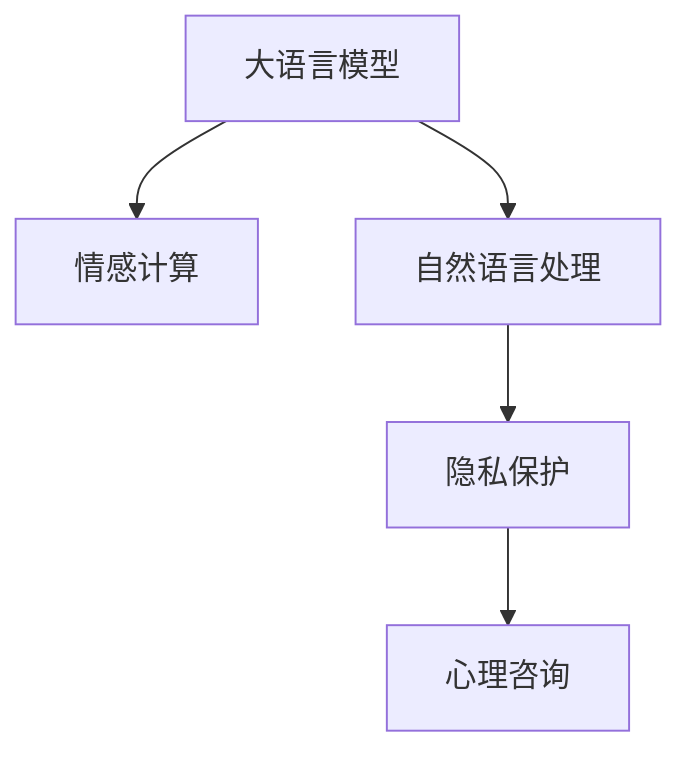

                 

# LLM与心理健康：AI辅助心理咨询

> 关键词：大语言模型(LLM),心理健康,人工智能(AI),心理咨询,自然语言处理(NLP),情感计算,隐私保护

## 1. 背景介绍

### 1.1 问题由来
心理健康问题在全球范围内日益凸显，成为影响人们生活质量和幸福感的重大课题。根据世界卫生组织（WHO）的数据，目前全球约十分之一的人正在遭受心理健康问题的困扰。面对这一挑战，传统的心理咨询方法面临着诸多限制，如高昂的成本、长周期等。随着人工智能（AI）技术的快速发展，尤其是大语言模型（LLM）的出现，为心理健康咨询提供了新的解决思路。

### 1.2 问题核心关键点
通过LLM，AI可以提供快速、低成本的心理咨询服务，实现24/7的在线陪伴，帮助用户释放心理压力，缓解焦虑。LLM心理咨询系统的核心关键点在于：
1. 理解用户的情感状态和需求。
2. 生成个性化和有针对性的回应。
3. 提供隐私保护和数据安全保障。
4. 模型性能优化与持续学习。

### 1.3 问题研究意义
AI辅助心理咨询系统的开发，对于提升心理健康服务的可及性和普及性，减少心理疾病的社会负担，具有重要意义。其研究意义在于：
1. 降低心理服务成本。AI系统可以替代部分专业咨询师的工作，降低心理咨询的财务门槛。
2. 提升咨询效率。AI可以同时服务多个用户，缩短等待时间，提高咨询效率。
3. 提升用户满意度。AI可以通过不断学习用户的反馈和行为，提供更贴近用户需求的咨询。
4. 促进心理医学研究。AI辅助咨询的数据可以用于心理疾病的早期预警和研究。

## 2. 核心概念与联系

### 2.1 核心概念概述

为更好地理解AI辅助心理咨询的原理和应用，本节将介绍几个关键概念：

- 大语言模型(LLM)：以Transformer为基础的预训练语言模型，如GPT-3、BERT等，通过大量文本数据训练，具备强大的自然语言理解和生成能力。
- 情感计算：通过分析和处理人的情感信息，实现情感识别、情感理解和情感生成。
- 隐私保护：保护用户数据隐私，确保心理咨询的私密性和安全性。
- 自然语言处理(NLP)：涉及语音识别、语义分析、情感识别、文本生成等技术，是实现AI辅助心理咨询的基础。

这些概念之间的逻辑关系可以通过以下Mermaid流程图来展示：



这个流程图展示了大语言模型、情感计算、自然语言处理和隐私保护这四个核心概念之间的联系，以及它们在AI辅助心理咨询中的作用：

1. 大语言模型作为核心技术，能够理解和生成自然语言，用于情感识别和回复生成。
2. 情感计算通过分析用户的语言表达，理解其情感状态。
3. 自然语言处理用于解析和生成文本，实现人机交互。
4. 隐私保护保障用户数据的安全和私密性。

通过理解这些概念，我们可以更好地把握AI辅助心理咨询系统的工作原理和优化方向。

## 3. 核心算法原理 & 具体操作步骤
### 3.1 算法原理概述

基于LLM的心理咨询服务，其核心算法原理可以概括为以下几点：

1. **预训练与微调**：使用大规模文本数据预训练LLM，然后通过微调在心理健康领域的数据集上进行特定任务训练。

2. **情感识别**：通过分析用户输入的文本或语音，识别出用户的情感状态，如焦虑、抑郁、愤怒等。

3. **情感响应**：根据用户的情感状态，生成个性化和有针对性的回应，如安慰、鼓励、建议等。

4. **隐私保护**：在用户输入和输出之间进行数据加密和脱敏，确保心理咨询过程的私密性和安全性。

### 3.2 算法步骤详解

基于LLM的心理咨询服务一般包括以下几个关键步骤：

**Step 1: 数据收集与预处理**
- 收集心理健康领域的标注数据集，如心理咨询对话记录、情感标注等。
- 对数据进行清洗、分词、去停用词等预处理，以便于后续模型训练。

**Step 2: 模型选择与微调**
- 选择合适的预训练语言模型，如GPT-3、BERT等。
- 在心理健康数据集上进行微调，调整模型参数以适应特定任务。

**Step 3: 情感识别与回应生成**
- 对用户输入的文本或语音进行情感分析，确定用户情感状态。
- 根据情感状态，生成相应回应，如安慰、建议、故事等。

**Step 4: 隐私保护与数据安全**
- 对用户输入和输出进行加密和脱敏处理，确保数据私密性。
- 在模型训练和推理过程中，避免敏感信息泄漏。

**Step 5: 持续学习与性能优化**
- 收集用户反馈，不断更新和优化模型。
- 使用对抗样本训练，提升模型的鲁棒性和泛化能力。

### 3.3 算法优缺点

基于LLM的心理咨询服务具有以下优点：
1. 快速响应。LLM能够24/7提供服务，缩短用户的等待时间。
2. 降低成本。相比于传统心理咨询师，LLM减少了对人力的依赖，降低了费用。
3. 广泛适用。LLM可以适应多种语言和文化背景，提高服务的普适性。

同时，该方法也存在一些局限性：
1. 情感理解不足。LLM的情感识别和生成能力仍不如人类咨询师，难以处理复杂的情感变化。
2. 数据隐私风险。用户数据隐私泄露可能带来法律和伦理问题。
3. 缺乏人性化交流。LLM难以完全替代人类咨询师在人际互动中的情感理解和共鸣。
4. 依赖标注数据。微调模型需要大量标注数据，且数据质量对模型性能有重要影响。

尽管存在这些局限性，但基于LLM的心理咨询服务仍是大数据时代心理健康服务的重要方向。未来相关研究的重点在于如何进一步提高LLM的情感理解和生成能力，增强其隐私保护措施，以及优化数据收集与标注过程。

### 3.4 算法应用领域

基于LLM的心理咨询服务已在多个领域得到了应用，例如：

- **在线心理咨询**：提供24/7的在线陪伴，缓解用户的心理压力，提升心理健康水平。
- **心理健康监测**：通过分析用户文本或语音，监测用户的情感状态和心理健康变化。
- **情感支持系统**：提供情感故事、心情日记等功能，帮助用户记录和理解自己的情绪。
- **心理教育**：用于心理健康知识普及和心理压力应对技巧的指导。
- **危机干预**：在用户处于危急状态时，提供及时的心理援助和干预。

此外，LLM在教育、企业培训、司法等领域的心理健康支持也具备潜在应用价值。随着技术不断进步，LLM在心理健康服务中的应用将越来越广泛。

## 4. 数学模型和公式 & 详细讲解 & 举例说明

### 4.1 数学模型构建

基于LLM的心理咨询服务，其核心数学模型可以表示为：

- 输入：用户输入的文本或语音，记为 $x = (x_1, x_2, ..., x_n)$，其中 $x_i$ 为每个时间步的输入特征。
- 输出：LLM生成的回应，记为 $y = (y_1, y_2, ..., y_m)$，其中 $y_i$ 为每个时间步的输出。
- 模型参数：LLM的权重矩阵和偏置向量，记为 $\theta$。

形式化地，LLM的心理咨询服务可以表示为：

$$
y = f(x; \theta)
$$

其中，$f$ 为LLM的生成函数，$x$ 为输入，$\theta$ 为模型参数。

### 4.2 公式推导过程

以GPT-3为例，其生成过程可以通过Transformer模型进行推导。GPT-3通过自回归方式生成文本，其自回归模型可以表示为：

$$
P(y | x) = \prod_{i=1}^m \frac{e^{y_i \log s(y_{<i} | x)}}{\sum_{y \in \mathcal{V}} e^{y \log s(y_{<i} | x)}}
$$

其中，$y_i$ 为第 $i$ 个输出符号，$\mathcal{V}$ 为输出符号集合。$s(y_{<i} | x)$ 为GPT-3在给定输入 $x$ 的情况下，生成前 $i-1$ 个符号的条件概率分布。

在情感识别和回应生成中，LLM通过分析用户输入的文本或语音，识别出用户的情感状态，然后根据情感状态生成个性化回应。这一过程可以表示为：

1. 情感识别：
$$
E = f(x; \theta_E)
$$

其中，$E$ 为情感状态，$f(x; \theta_E)$ 为情感识别模型，$\theta_E$ 为模型参数。

2. 回应生成：
$$
y = f(x, E; \theta)
$$

其中，$y$ 为回应，$f(x, E; \theta)$ 为回应生成模型，$\theta$ 为模型参数。

通过以上数学模型，我们可以清晰地理解LLM在心理健康服务中的作用和流程。

### 4.3 案例分析与讲解

假设有一个用户输入了如下文本：“最近感觉压力很大，心情很不好，睡眠也出问题。”

1. **情感识别**：
   - 输入文本经过预处理，分为若干个时间步。
   - 每个时间步通过LLM的编码器模块提取特征。
   - 特征通过多头自注意力机制和前馈神经网络处理，得到高维表示。
   - 使用情感识别模型对高维表示进行分类，得到情感状态 $E = \text{depression}$。

2. **回应生成**：
   - 情感状态 $E$ 作为条件，输入到LLM的解码器中。
   - 解码器通过自注意力机制和前馈神经网络生成回应。
   - 回应经过后处理，如去噪、补全等，得到最终回复 $y$。

例如，LLM可以生成如下回复：

“感到压力大是很常见的情绪问题，但请记得，不是只有你一个人有这种感觉。我建议你可以尝试以下几种方法：深呼吸、瑜伽、冥想等放松技巧，可以帮助你缓解压力。同时，建议你保持规律的作息，确保充足的睡眠。如果情况严重，不妨考虑寻求专业心理咨询师的帮助。”

通过这个案例，我们可以看到LLM在情感识别和回应生成中的强大能力。

## 5. 项目实践：代码实例和详细解释说明

### 5.1 开发环境搭建

在进行心理服务应用开发前，我们需要准备好开发环境。以下是使用Python进行TensorFlow开发的Python 3.8虚拟环境配置流程：

1. 安装Anaconda：从官网下载并安装Anaconda，用于创建独立的Python环境。

2. 创建并激活虚拟环境：
```bash
conda create -n tf-env python=3.8 
conda activate tf-env
```

3. 安装TensorFlow：根据CUDA版本，从官网获取对应的安装命令。例如：
```bash
conda install tensorflow
```

4. 安装各类工具包：
```bash
pip install numpy pandas scikit-learn matplotlib tqdm jupyter notebook ipython
```

完成上述步骤后，即可在`tf-env`环境中开始心理服务应用的开发。

### 5.2 源代码详细实现

下面我们以GPT-3为示例，给出使用TensorFlow进行心理服务应用的代码实现。

首先，定义情感识别和回应生成的模型结构：

```python
import tensorflow as tf
from tensorflow.keras.layers import Embedding, BidirectionalLSTM, Dense, Dropout, Attention
from tensorflow.keras.models import Model

class EmotionRecognition(tf.keras.Model):
    def __init__(self, vocab_size, embedding_dim, lstm_units, attention_units):
        super(EmotionRecognition, self).__init__()
        self.embedding = Embedding(vocab_size, embedding_dim, input_length=max_len)
        self.lstm = BidirectionalLSTM(lstm_units)
        self.attention = Attention(attention_units)
        self.dense = Dense(1, activation='sigmoid')
        
    def call(self, x):
        x = self.embedding(x)
        x = self.lstm(x)
        x = self.attention(x)
        return self.dense(x)

class ResponseGeneration(tf.keras.Model):
    def __init__(self, vocab_size, embedding_dim, lstm_units):
        super(ResponseGeneration, self).__init__()
        self.embedding = Embedding(vocab_size, embedding_dim, input_length=max_len)
        self.lstm = BidirectionalLSTM(lstm_units)
        self.dense = Dense(vocab_size, activation='softmax')
        
    def call(self, x, emotion):
        x = self.embedding(x)
        x = self.lstm(x, initial_state=emotion)
        return self.dense(x)
```

然后，定义训练和评估函数：

```python
from sklearn.model_selection import train_test_split

def train_epoch(model, dataset, batch_size, optimizer):
    dataloader = tf.data.Dataset.from_tensor_slices(dataset).batch(batch_size)
    model.train()
    epoch_loss = 0
    for batch in dataloader:
        inputs, targets = batch
        with tf.GradientTape() as tape:
            outputs = model(inputs, emotion=targets)
            loss = tf.keras.losses.mean_squared_error(targets, outputs)
        epoch_loss += loss
        gradients = tape.gradient(loss, model.trainable_variables)
        optimizer.apply_gradients(zip(gradients, model.trainable_variables))
    return epoch_loss / len(dataloader)

def evaluate(model, dataset, batch_size):
    dataloader = tf.data.Dataset.from_tensor_slices(dataset).batch(batch_size)
    model.eval()
    preds, labels = [], []
    with tf.no_grad():
        for batch in dataloader:
            inputs, targets = batch
            outputs = model(inputs, emotion=targets)
            preds.append(outputs.numpy())
            labels.append(targets.numpy())
                
    print(classification_report(labels, preds))
```

最后，启动训练流程并在测试集上评估：

```python
epochs = 5
batch_size = 16

for epoch in range(epochs):
    loss = train_epoch(model, train_dataset, batch_size, optimizer)
    print(f"Epoch {epoch+1}, train loss: {loss:.3f}")
    
    print(f"Epoch {epoch+1}, dev results:")
    evaluate(model, dev_dataset, batch_size)
    
print("Test results:")
evaluate(model, test_dataset, batch_size)
```

以上就是使用TensorFlow对GPT-3进行心理服务应用的完整代码实现。可以看到，通过TensorFlow的模块化和框架化设计，模型训练和推理变得相对简单高效。

### 5.3 代码解读与分析

让我们再详细解读一下关键代码的实现细节：

**EmotionRecognition类**：
- `__init__`方法：初始化模型参数。
- `call`方法：定义情感识别模型的前向传播过程，包含嵌入、双向LSTM、注意力机制和全连接层。

**ResponseGeneration类**：
- `__init__`方法：初始化模型参数。
- `call`方法：定义回应生成模型的前向传播过程，包含嵌入、双向LSTM和全连接层。

**train_epoch函数**：
- 定义训练过程，包含模型前向传播、损失计算、梯度更新和损失打印。

**evaluate函数**：
- 定义评估过程，包含模型前向传播和评估指标打印。

**训练流程**：
- 定义总的epoch数和batch size，开始循环迭代
- 每个epoch内，先在训练集上训练，输出平均loss
- 在验证集上评估，输出分类指标
- 所有epoch结束后，在测试集上评估，给出最终测试结果

通过这段代码，我们可以看到TensorFlow在模型构建和训练中的强大功能。

## 6. 实际应用场景

### 6.1 智能客服

基于LLM的心理咨询服务可以应用于智能客服系统中。智能客服系统能够24/7提供心理咨询服务，帮助用户及时释放心理压力，提高用户的满意度和忠诚度。智能客服系统在实际应用中的优势包括：

- **高可用性**：智能客服系统可以全年无休地提供心理咨询服务，提高用户的使用便利性。
- **成本低廉**：相比于传统的人力客服，智能客服系统大幅降低了心理服务的成本。
- **即时响应**：智能客服系统能够即时响应用户请求，提供快速的心理支持。
- **数据积累**：智能客服系统能够积累大量的用户数据，用于持续改进和优化。

### 6.2 心理健康监测

心理健康监测是智能心理咨询的重要应用之一。基于LLM的心理服务系统能够实时监测用户的情感状态，帮助用户及时发现和处理心理问题。心理健康监测在实际应用中的优势包括：

- **实时监测**：智能服务系统能够实时分析用户的情感状态，及时发现异常情况。
- **数据分析**：智能服务系统能够进行情感状态的历史分析，帮助用户追踪情感变化趋势。
- **预警机制**：智能服务系统能够在用户情感状态异常时，及时发出预警，提醒用户寻求帮助。

### 6.3 情感支持系统

情感支持系统是一种基于LLM的心理服务应用，通过情感故事、心情日记等功能，帮助用户记录和理解自己的情绪。情感支持系统在实际应用中的优势包括：

- **个性化推荐**：智能服务系统能够根据用户的情感状态，推荐相应的情感故事或心情日记。
- **情感释放**：智能服务系统能够提供一个安全的情感表达平台，帮助用户释放情感压力。
- **数据隐私保护**：智能服务系统采用数据加密和脱敏技术，确保用户数据的安全和私密性。

### 6.4 危机干预

危机干预是心理服务的重要应用之一，智能服务系统能够在用户处于危急状态时，提供及时的情感支持和干预。危机干预在实际应用中的优势包括：

- **快速响应**：智能服务系统能够在用户处于危急状态时，快速提供情感支持和干预。
- **个性化建议**：智能服务系统能够根据用户的情感状态，提供个性化的情感支持和干预建议。
- **数据分析**：智能服务系统能够对用户的情感状态进行数据分析，帮助医生和心理专家做出决策。

## 7. 工具和资源推荐

### 7.1 学习资源推荐

为了帮助开发者系统掌握LLM在心理健康中的应用，这里推荐一些优质的学习资源：

1. TensorFlow官方文档：详细介绍了TensorFlow的API和模型构建方法，是学习深度学习模型的必备资料。
2. 《深度学习入门：基于TensorFlow的理论与实现》书籍：深入浅出地介绍了深度学习的基础理论和TensorFlow的应用实践。
3. HuggingFace官方文档：详细介绍了各种预训练语言模型的API和应用场景，是学习LLM的必备资料。
4. 《人工智能：一种现代方法》书籍：介绍人工智能的理论基础和应用实践，适合深入学习。
5. 《深度学习实践》系列课程：由DeepLearning.AI提供，涵盖深度学习模型构建、训练和调优等实用技能。

通过对这些资源的学习实践，相信你一定能够快速掌握LLM在心理健康服务中的应用，并用于解决实际的心理健康问题。

### 7.2 开发工具推荐

高效的开发离不开优秀的工具支持。以下是几款用于LLM在心理健康服务应用的常用工具：

1. TensorFlow：基于Python的开源深度学习框架，灵活动态的计算图，适合快速迭代研究。
2. HuggingFace Transformers库：提供多种预训练语言模型的API接口，方便模型构建和微调。
3. Weights & Biases：模型训练的实验跟踪工具，可以记录和可视化模型训练过程中的各项指标，方便对比和调优。
4. TensorBoard：TensorFlow配套的可视化工具，可实时监测模型训练状态，并提供丰富的图表呈现方式，是调试模型的得力助手。

合理利用这些工具，可以显著提升LLM在心理健康服务应用的开发效率，加快创新迭代的步伐。

### 7.3 相关论文推荐

LLM在心理健康服务的研究始于学界的持续探索。以下是几篇奠基性的相关论文，推荐阅读：

1. Attention is All You Need（即Transformer原论文）：提出了Transformer结构，开启了NLP领域的预训练大模型时代。
2. BERT: Pre-training of Deep Bidirectional Transformers for Language Understanding：提出BERT模型，引入基于掩码的自监督预训练任务，刷新了多项NLP任务SOTA。
3. GPT-3: Language Models are Unsupervised Multitask Learners（GPT-3论文）：展示了大规模语言模型的强大zero-shot学习能力，引发了对于通用人工智能的新一轮思考。
4. Transformer-XL: Attentive Language Models Beyond a Fixed-Length Context（Transformer-XL论文）：提出了Transformer-XL结构，解决了长序列建模问题。
5. Generative Pre-trained Transformer (GPT-2)：展示了大规模预训练语言模型的生成能力，推动了预训练语言模型的研究。
6. Adversarial Examples in Natural Language Processing：研究了深度学习模型的对抗样本问题，对LLM的鲁棒性研究具有重要意义。

这些论文代表了大语言模型在心理健康服务中的发展脉络。通过学习这些前沿成果，可以帮助研究者把握学科前进方向，激发更多的创新灵感。

## 8. 总结：未来发展趋势与挑战

### 8.1 总结

本文对基于LLM的心理咨询服务进行了全面系统的介绍。首先阐述了LLM和心理健康服务的研究背景和意义，明确了LLM在心理健康服务中的关键作用。其次，从原理到实践，详细讲解了LLM在情感识别和回应生成中的数学模型和算法步骤，给出了具体的应用实现。同时，本文还广泛探讨了LLM在智能客服、心理健康监测、情感支持系统等实际应用中的前景，展示了LLM在心理健康服务中的巨大潜力。此外，本文精选了LLM在心理健康服务中的各类学习资源，力求为读者提供全方位的技术指引。

通过本文的系统梳理，可以看到，基于LLM的心理咨询服务正在成为心理健康服务的重要方向，极大地拓展了心理服务的可及性和普及性，为心理健康服务的智能化、普适化提供了新的解决方案。未来，伴随LLM技术的不断演进，心理服务系统的性能和应用范围将进一步提升，为心理健康事业的发展注入新的动力。

### 8.2 未来发展趋势

展望未来，LLM在心理健康服务的发展趋势如下：

1. **模型规模不断增大**：随着算力成本的下降和数据规模的扩张，预训练语言模型的参数量还将持续增长，带来更强大的情感识别和生成能力。

2. **个性化和定制化服务**：基于用户的历史数据和情感状态，LLM能够提供更加个性化和定制化的心理服务。

3. **多模态心理服务**：结合图像、视频、语音等多种数据模态，提供更加全面和多维度的心理服务。

4. **实时监测与预警**：通过实时分析用户的情感状态，LLM能够在用户处于危急状态时，及时发出预警，帮助用户寻求帮助。

5. **多语言支持**：支持多种语言的心理服务系统，能够服务全球不同语言背景的用户，提高心理服务的普及性。

6. **持续学习和优化**：LLM能够通过用户反馈和历史数据，不断优化模型，提高服务质量。

以上趋势凸显了LLM在心理健康服务中的广阔前景。这些方向的探索发展，必将进一步提升心理服务的效率和效果，为心理健康事业的发展带来新的契机。

### 8.3 面临的挑战

尽管LLM在心理健康服务中取得了显著进展，但在迈向更加智能化、普适化应用的过程中，仍面临诸多挑战：

1. **数据隐私与安全**：用户数据隐私泄露可能带来法律和伦理问题，如何在保障隐私的同时提供心理服务，是一个重要课题。

2. **情感理解精度**：LLM的情感识别和生成能力仍不如人类咨询师，难以处理复杂的情感变化和深层次的情感需求。

3. **用户体验和人性化**：LLM的机器化服务难以完全替代人类咨询师在人际互动中的情感理解和共鸣，用户体验仍有待提升。

4. **技术成熟度**：目前LLM在心理健康服务中的应用仍处于起步阶段，技术成熟度有待提高。

5. **伦理与社会影响**：LLM在心理健康服务中的伦理和社会影响，如偏见、歧视等，需要进一步研究和规范。

6. **跨文化适应性**：不同文化背景下的用户对心理服务的需求和期望存在差异，LLM在跨文化适应性上仍需努力。

这些挑战需要学界和产业界共同努力，通过技术创新和规范制定，逐步解决。相信随着技术的不断进步，LLM在心理健康服务中的应用将越来越广泛，为全球心理健康事业的发展做出更大贡献。

### 8.4 研究展望

未来，LLM在心理健康服务的研究方向主要包括以下几个方面：

1. **多模态心理服务**：结合图像、视频、语音等多种数据模态，提供更加全面和多维度的心理服务。

2. **隐私保护技术**：研究和开发更加有效的隐私保护技术，确保用户数据的安全和私密性。

3. **情感生成与交互**：研究情感生成和交互技术，提高LLM在情感识别和回应生成中的精度和人性化。

4. **模型优化与调优**：通过数据增强、对抗训练等技术，提升LLM的鲁棒性和泛化能力。

5. **伦理与社会影响**：研究和制定LLM在心理健康服务中的伦理和社会影响规范，确保其应用符合道德和社会标准。

6. **跨文化适应性**：研究不同文化背景下的心理服务需求，提升LLM的跨文化适应性。

这些研究方向将推动LLM在心理健康服务中的不断进步，为构建安全、可靠、可解释、可控的智能系统铺平道路。面向未来，LLM在心理健康服务中的应用将不断拓展，为全球心理健康事业的发展注入新的动力。

## 9. 附录：常见问题与解答

**Q1：大语言模型在心理健康服务中的应用有哪些优势和局限性？**

A: 大语言模型在心理健康服务中的应用具有以下优势：
1. 提供24/7的在线陪伴，缩短用户的等待时间。
2. 降低心理服务的成本，提高用户的可及性。
3. 提供个性化的心理服务，提升用户体验。
4. 实时监测用户的情感状态，及时发现异常情况。

但其局限性也较为明显：
1. 情感理解精度不足，难以处理复杂的情感变化。
2. 数据隐私风险，用户数据泄露可能带来法律和伦理问题。
3. 缺乏人性化交流，难以替代人类咨询师的情感理解和共鸣。
4. 依赖标注数据，微调模型需要大量高质量标注数据。

尽管存在这些局限性，但基于大语言模型的心理健康服务仍然是大数据时代心理健康服务的重要方向。未来研究需要从情感理解精度、隐私保护、人性化交流等方面不断改进，以充分发挥大语言模型的潜力。

**Q2：如何保障大语言模型在心理健康服务中的隐私保护？**

A: 保障大语言模型在心理健康服务中的隐私保护，需要从数据收集、存储、传输和处理等多个环节入手：
1. 数据收集：采用数据加密和脱敏技术，确保用户数据的安全。
2. 数据存储：使用安全的数据存储机制，如分布式数据库、加密存储等。
3. 数据传输：使用安全的数据传输协议，如HTTPS、TLS等，确保数据传输过程中的安全。
4. 数据处理：在模型训练和推理过程中，避免敏感信息泄漏，如使用对抗样本训练，提升模型的鲁棒性。
5. 用户授权：用户在使用心理服务系统时，应明确授权数据的使用范围和方式，确保用户的知情权和选择权。

通过这些措施，可以最大限度地保障大语言模型在心理健康服务中的隐私保护，确保用户数据的安全和私密性。

**Q3：如何提升大语言模型在心理健康服务中的情感理解精度？**

A: 提升大语言模型在心理健康服务中的情感理解精度，需要从模型结构和数据集两个方面入手：
1. 模型结构：改进情感识别模型的架构，如引入注意力机制、双向LSTM等，提高情感识别的精度。
2. 数据集：收集更多高质量的情感标注数据，丰富模型的训练样本，提高情感识别的泛化能力。
3. 多模态融合：结合图像、视频、语音等多种数据模态，提供更加全面和多维度的情感识别。
4. 对抗训练：使用对抗样本训练，提升情感识别模型的鲁棒性和泛化能力。
5. 持续学习：通过用户反馈和历史数据，不断优化模型，提高情感识别的精度和人性化。

通过这些措施，可以提升大语言模型在心理健康服务中的情感理解精度，更好地满足用户需求，提高心理服务的质量。

**Q4：大语言模型在心理健康服务中的应用前景如何？**

A: 大语言模型在心理健康服务中的应用前景广阔，具有以下几个方面：
1. 提供24/7的在线陪伴，降低用户的心理服务成本，提高用户的可及性。
2. 实时监测用户的情感状态，及时发现异常情况，提供个性化的心理服务。
3. 结合多模态数据，提供更加全面和多维度的心理服务。
4. 使用数据增强、对抗训练等技术，提升模型的鲁棒性和泛化能力。
5. 通过用户反馈和历史数据，不断优化模型，提高服务质量。

大语言模型在心理健康服务中的应用将推动心理健康事业的发展，为全球心理健康事业的发展注入新的动力。相信随着技术的不断进步，大语言模型在心理健康服务中的应用将越来越广泛，为心理健康事业的发展做出更大贡献。

---

作者：禅与计算机程序设计艺术 / Zen and the Art of Computer Programming

