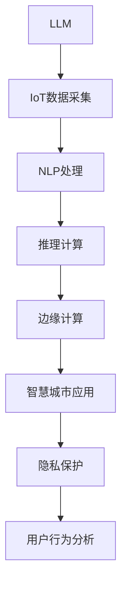

                 

# LLM与物联网的结合：智能家居的新可能

> 关键词：大型语言模型(LLM)、物联网(IoT)、智能家居、NLP技术、AI推理引擎、边缘计算、隐私保护、智慧城市、用户行为分析

## 1. 背景介绍

### 1.1 问题由来
随着人工智能技术的发展，大型语言模型(LLM)在自然语言处理(NLP)领域取得了显著的进步。这些模型通过在海量文本数据上进行自监督学习，具备强大的语言理解和生成能力，广泛应用于机器翻译、文本摘要、问答系统、情感分析等任务。然而，LLM的应用还局限于文本数据处理，对于物联网(IoT)领域的数据种类和处理需求，现有模型显得有些力不从心。

与此同时，物联网技术在智能家居、智慧城市等领域得到了广泛应用。这些系统中的数据种类多样，包括传感器数据、视频图像、用户行为等，对模型的处理能力和适应性提出了更高的要求。为了满足这一需求，需要一种能够融合NLP和IoT技术的新型模型。

## 2. 核心概念与联系

### 2.1 核心概念概述

为更好地理解LLM与IoT结合的模型，本节将介绍几个核心概念：

- 大型语言模型(LLM)：以自回归(如GPT)或自编码(如BERT)模型为代表的大型预训练语言模型。通过在大规模无标签文本语料上进行预训练，学习通用语言表示，具备强大的语言理解和生成能力。

- 物联网(IoT)：连接物体与网络的设施，通过传感器、RFID标签、智能设备等，实现数据的收集、传输和处理。物联网为智能家居、智慧城市等场景提供了数据采集的基础设施。

- 自然语言处理(NLP)：涉及计算机与人类语言交互的学科，主要研究如何让计算机理解、生成自然语言。NLP技术在语音识别、机器翻译、问答系统等领域得到广泛应用。

- 边缘计算(Edge Computing)：一种分布式计算范式，将数据处理任务直接放在网络边缘的设备上，降低延迟、提高数据安全。

- 人工智能推理引擎(AI Inference Engine)：用于加速AI模型的推理过程，优化计算效率和资源利用。

- 隐私保护(Privacy Protection)：在数据处理和传输过程中，保护用户隐私和数据安全的技术，如数据匿名化、差分隐私等。

- 智慧城市(Smart City)：利用物联网、云计算、大数据等技术，提升城市管理水平和居民生活质量的城市发展模式。

- 用户行为分析(User Behavior Analysis)：通过分析用户数据，理解用户需求、行为和偏好，实现个性化服务和决策优化。

这些核心概念之间的逻辑关系可以通过以下Mermaid流程图来展示：



这个流程图展示了大语言模型与物联网数据结合的流程：

1. LLM通过处理IoT设备采集的文本数据，学习用户的语言模式和行为习惯。
2. NLP处理将文本数据转化为机器可处理的形式，提取关键信息。
3. 推理计算在AI推理引擎的支持下，对提取的信息进行推理和预测。
4. 边缘计算将计算任务分配到本地设备，减少网络延迟，提高处理效率。
5. 智慧城市应用将推理结果反馈到城市管理系统中，优化城市运营。
6. 隐私保护在数据处理过程中，确保用户数据的安全和匿名性。
7. 用户行为分析通过分析用户数据，提升个性化服务体验。

## 3. 核心算法原理 & 具体操作步骤
### 3.1 算法原理概述

LLM与IoT结合的模型主要基于以下原理：

1. **数据采集与预处理**：通过IoT设备收集家庭环境、用户行为等数据，将文本信息转化为数字信号。
2. **语言理解**：使用LLM模型理解文本数据的语义信息，提取关键特征和实体。
3. **推理与决策**：利用NLP处理技术对提取的信息进行推理，形成决策建议。
4. **边缘计算**：将推理计算任务分配到本地设备，提高计算效率，减少网络延迟。
5. **应用反馈**：将推理结果反馈到智慧城市应用系统中，优化城市管理。

### 3.2 算法步骤详解

基于LLM与IoT结合的模型通常包括以下几个关键步骤：

**Step 1: 数据采集与预处理**

1. **设备部署**：在家庭环境中部署IoT设备，如智能温控器、传感器、摄像头等，收集环境数据和用户行为数据。
2. **数据清洗**：对采集到的数据进行清洗和处理，去除噪声和无效数据。
3. **文本提取**：将文本数据转化为数字信号，如将传感器读数转换为数值型文本。

**Step 2: 语言理解**

1. **预训练模型选择**：选择适合的预训练模型，如BERT、GPT等，用于文本理解。
2. **特征提取**：通过LLM模型提取文本数据的语义特征，如实体识别、情感分析等。
3. **特征融合**：将提取的语义特征与其他数据源（如用户行为数据、传感器数据）进行融合，形成更全面的特征向量。

**Step 3: 推理与决策**

1. **推理计算**：在AI推理引擎的支持下，对融合后的特征向量进行推理计算，形成决策建议。
2. **决策优化**：利用优化算法（如梯度下降、遗传算法等）优化决策建议，确保其合理性和可行性。
3. **反馈控制**：将决策建议反馈到IoT设备，调整其行为，形成闭环控制。

**Step 4: 边缘计算**

1. **任务分配**：将推理计算任务分配到本地设备（如边缘服务器、嵌入式设备等），减少网络延迟。
2. **本地处理**：在本地设备上进行数据处理和计算，保护数据安全。
3. **结果上传**：将处理结果上传至云端，进行进一步分析和存储。

**Step 5: 应用反馈**

1. **数据存储**：将处理结果存储到云端数据库中，供后续分析使用。
2. **可视化展示**：将处理结果通过图表、仪表盘等形式展示，帮助用户理解和管理家庭环境。
3. **智能决策**：利用用户反馈和历史数据，不断优化决策算法，提升系统性能。

### 3.3 算法优缺点

基于LLM与IoT结合的模型具有以下优点：

1. **高效处理多模态数据**：能够同时处理文本数据和传感器数据，提升数据利用率。
2. **灵活性高**：通过调整预训练模型和推理算法，适用于多种NLP和IoT任务。
3. **实时性强**：边缘计算将计算任务分配到本地设备，减少网络延迟，实现实时响应。
4. **隐私保护**：通过数据匿名化和差分隐私等技术，保护用户隐私。
5. **用户友好**：利用自然语言交互，提升用户体验，实现个性化服务。

同时，该模型也存在一些局限性：

1. **数据质量依赖**：IoT设备采集的数据质量直接影响到模型的推理效果。
2. **模型训练成本高**：预训练模型的训练需要大量的计算资源和时间。
3. **计算资源限制**：边缘设备计算能力有限，可能无法处理大规模数据集。
4. **数据隐私风险**：IoT设备采集的数据涉及用户隐私，需要严格的数据保护措施。
5. **模型泛化能力**：现有预训练模型对特定任务和数据集的泛化能力有待提升。

尽管存在这些局限性，但基于LLM与IoT结合的模型在智能家居和智慧城市等场景中仍展现出巨大的潜力。未来相关研究将致力于提升模型性能和数据利用效率，同时兼顾隐私保护和计算资源优化。

### 3.4 算法应用领域

基于LLM与IoT结合的模型已经在多个领域得到应用，例如：

- 智能家居：通过收集家庭环境数据和用户行为数据，实现智能控制和个性化服务。如智能温控、照明、安防等。
- 智慧城市：利用传感器数据和IoT设备，提升城市管理水平和居民生活质量。如智能交通、环境监测、公共安全等。
- 健康监测：通过可穿戴设备采集生理数据，利用LLM进行健康分析和风险预测。
- 智慧医疗：利用IoT设备采集医疗数据，结合LLM进行疾病诊断和治疗方案优化。
- 工业物联网：通过IoT设备采集工业数据，利用LLM进行生产过程监控和故障预测。
- 智慧农业：利用IoT设备采集农业数据，结合LLM进行农业生产优化和智能决策。

这些应用场景展示了LLM与IoT结合的强大能力，为智能家居、智慧城市等领域带来了新的突破。

## 4. 数学模型和公式 & 详细讲解 & 举例说明

### 4.1 数学模型构建

在本节中，我们将使用数学语言对基于LLM与IoT结合的模型进行更加严格的刻画。

记IoT设备采集的数据集为 $D=\{x_i,y_i\}_{i=1}^N$，其中 $x_i$ 为文本数据，$y_i$ 为标签数据（如温度、湿度等）。预训练模型为 $M_{\theta}:\mathcal{X} \rightarrow \mathcal{Y}$，其中 $\mathcal{X}$ 为输入空间，$\mathcal{Y}$ 为输出空间，$\theta \in \mathbb{R}^d$ 为模型参数。

定义模型 $M_{\theta}$ 在数据样本 $(x,y)$ 上的损失函数为 $\ell(M_{\theta}(x),y)$，则在数据集 $D$ 上的经验风险为：

$$
\mathcal{L}(\theta) = \frac{1}{N} \sum_{i=1}^N \ell(M_{\theta}(x_i),y_i)
$$

微调的优化目标是最小化经验风险，即找到最优参数：

$$
\theta^* = \mathop{\arg\min}_{\theta} \mathcal{L}(\theta)
$$

在实践中，我们通常使用基于梯度的优化算法（如SGD、Adam等）来近似求解上述最优化问题。设 $\eta$ 为学习率，$\lambda$ 为正则化系数，则参数的更新公式为：

$$
\theta \leftarrow \theta - \eta \nabla_{\theta}\mathcal{L}(\theta) - \eta\lambda\theta
$$

其中 $\nabla_{\theta}\mathcal{L}(\theta)$ 为损失函数对参数 $\theta$ 的梯度，可通过反向传播算法高效计算。

### 4.2 公式推导过程

以下我们以智能家居中的温度控制为例，推导推理计算的数学模型和计算过程。

假设模型 $M_{\theta}$ 在输入 $x$ 上的输出为 $\hat{y}=M_{\theta}(x)$，表示预测的温度值。真实标签 $y$ 为实际温度值。则均方误差损失函数定义为：

$$
\ell(M_{\theta}(x),y) = \frac{1}{N} \sum_{i=1}^N (y_i - \hat{y}_i)^2
$$

将其代入经验风险公式，得：

$$
\mathcal{L}(\theta) = \frac{1}{N} \sum_{i=1}^N (y_i - M_{\theta}(x_i))^2
$$

根据链式法则，损失函数对参数 $\theta_k$ 的梯度为：

$$
\frac{\partial \mathcal{L}(\theta)}{\partial \theta_k} = \frac{2}{N} \sum_{i=1}^N \frac{\partial M_{\theta}(x_i)}{\partial \theta_k} (\hat{y}_i - y_i)
$$

其中 $\frac{\partial M_{\theta}(x_i)}{\partial \theta_k}$ 可进一步递归展开，利用自动微分技术完成计算。

在得到损失函数的梯度后，即可带入参数更新公式，完成模型的迭代优化。重复上述过程直至收敛，最终得到适应智能家居的温度控制模型参数 $\theta^*$。

### 4.3 案例分析与讲解

以智能家居中的语音助手为例，展示基于LLM与IoT结合的模型如何处理用户命令和反馈，实现智能控制。

**Step 1: 数据采集与预处理**

1. **语音识别**：用户通过语音命令控制智能家居设备。
2. **语音转文本**：将语音信号转换为文本数据。
3. **文本清洗**：对文本数据进行清洗，去除噪声和无效数据。

**Step 2: 语言理解**

1. **预训练模型选择**：选择BERT或GPT模型进行语音命令的语义理解。
2. **特征提取**：通过BERT模型提取语音命令的语义特征。
3. **意图识别**：利用NLP处理技术对提取的语义特征进行意图识别，如“开启空调”、“调高温度”等。

**Step 3: 推理与决策**

1. **推理计算**：在AI推理引擎的支持下，对意图进行推理，形成决策建议。
2. **决策优化**：利用优化算法（如梯度下降、遗传算法等）优化决策建议，确保其合理性和可行性。
3. **反馈控制**：将决策建议反馈到IoT设备，调整其行为，如调高空调温度、开启灯光等。

**Step 4: 边缘计算**

1. **任务分配**：将推理计算任务分配到本地设备（如边缘服务器、嵌入式设备等），减少网络延迟。
2. **本地处理**：在本地设备上进行数据处理和计算，保护数据安全。
3. **结果上传**：将处理结果上传至云端，进行进一步分析和存储。

**Step 5: 应用反馈**

1. **数据存储**：将处理结果存储到云端数据库中，供后续分析使用。
2. **可视化展示**：将处理结果通过图表、仪表盘等形式展示，帮助用户理解和管理家庭环境。
3. **智能决策**：利用用户反馈和历史数据，不断优化决策算法，提升系统性能。

## 5. 项目实践：代码实例和详细解释说明

### 5.1 开发环境搭建

在进行基于LLM与IoT结合的模型实践前，我们需要准备好开发环境。以下是使用Python进行PyTorch开发的环境配置流程：

1. 安装Anaconda：从官网下载并安装Anaconda，用于创建独立的Python环境。

2. 创建并激活虚拟环境：
```bash
conda create -n pytorch-env python=3.8 
conda activate pytorch-env
```

3. 安装PyTorch：根据CUDA版本，从官网获取对应的安装命令。例如：
```bash
conda install pytorch torchvision torchaudio cudatoolkit=11.1 -c pytorch -c conda-forge
```

4. 安装Transformers库：
```bash
pip install transformers
```

5. 安装各类工具包：
```bash
pip install numpy pandas scikit-learn matplotlib tqdm jupyter notebook ipython
```

完成上述步骤后，即可在`pytorch-env`环境中开始模型实践。

### 5.2 源代码详细实现

这里以智能家居中的温度控制为例，给出使用PyTorch实现基于LLM与IoT结合的温度控制模型的代码实现。

首先，定义数据处理函数：

```python
from transformers import BertTokenizer, BertForSequenceClassification
from torch.utils.data import Dataset
import torch

class TemperatureDataset(Dataset):
    def __init__(self, texts, labels, tokenizer, max_len=128):
        self.texts = texts
        self.labels = labels
        self.tokenizer = tokenizer
        self.max_len = max_len
        
    def __len__(self):
        return len(self.texts)
    
    def __getitem__(self, item):
        text = self.texts[item]
        label = self.labels[item]
        
        encoding = self.tokenizer(text, return_tensors='pt', max_length=self.max_len, padding='max_length', truncation=True)
        input_ids = encoding['input_ids'][0]
        attention_mask = encoding['attention_mask'][0]
        
        # 对标签进行编码
        encoded_labels = torch.tensor(label, dtype=torch.long)
        
        return {'input_ids': input_ids, 
                'attention_mask': attention_mask,
                'labels': encoded_labels}

# 标签编码
label2id = {'low': 0, 'medium': 1, 'high': 2}
id2label = {v: k for k, v in label2id.items()}

# 创建dataset
tokenizer = BertTokenizer.from_pretrained('bert-base-uncased')

train_dataset = TemperatureDataset(train_texts, train_labels, tokenizer)
dev_dataset = TemperatureDataset(dev_texts, dev_labels, tokenizer)
test_dataset = TemperatureDataset(test_texts, test_labels, tokenizer)
```

然后，定义模型和优化器：

```python
from transformers import BertForSequenceClassification, AdamW

model = BertForSequenceClassification.from_pretrained('bert-base-uncased', num_labels=3)

optimizer = AdamW(model.parameters(), lr=2e-5)
```

接着，定义训练和评估函数：

```python
from torch.utils.data import DataLoader
from tqdm import tqdm
from sklearn.metrics import classification_report

device = torch.device('cuda') if torch.cuda.is_available() else torch.device('cpu')
model.to(device)

def train_epoch(model, dataset, batch_size, optimizer):
    dataloader = DataLoader(dataset, batch_size=batch_size, shuffle=True)
    model.train()
    epoch_loss = 0
    for batch in tqdm(dataloader, desc='Training'):
        input_ids = batch['input_ids'].to(device)
        attention_mask = batch['attention_mask'].to(device)
        labels = batch['labels'].to(device)
        model.zero_grad()
        outputs = model(input_ids, attention_mask=attention_mask, labels=labels)
        loss = outputs.loss
        epoch_loss += loss.item()
        loss.backward()
        optimizer.step()
    return epoch_loss / len(dataloader)

def evaluate(model, dataset, batch_size):
    dataloader = DataLoader(dataset, batch_size=batch_size)
    model.eval()
    preds, labels = [], []
    with torch.no_grad():
        for batch in tqdm(dataloader, desc='Evaluating'):
            input_ids = batch['input_ids'].to(device)
            attention_mask = batch['attention_mask'].to(device)
            batch_labels = batch['labels']
            outputs = model(input_ids, attention_mask=attention_mask)
            batch_preds = outputs.logits.argmax(dim=2).to('cpu').tolist()
            batch_labels = batch_labels.to('cpu').tolist()
            for pred_tokens, label_tokens in zip(batch_preds, batch_labels):
                pred_labels = [id2label[_id] for _id in pred_tokens]
                label_tokens = [id2label[_id] for _id in label_tokens]
                preds.append(pred_labels[:len(label_tokens)])
                labels.append(label_tokens)
                
    print(classification_report(labels, preds))
```

最后，启动训练流程并在测试集上评估：

```python
epochs = 5
batch_size = 16

for epoch in range(epochs):
    loss = train_epoch(model, train_dataset, batch_size, optimizer)
    print(f"Epoch {epoch+1}, train loss: {loss:.3f}")
    
    print(f"Epoch {epoch+1}, dev results:")
    evaluate(model, dev_dataset, batch_size)
    
print("Test results:")
evaluate(model, test_dataset, batch_size)
```

以上就是使用PyTorch对BERT模型进行温度控制任务微调的完整代码实现。可以看到，得益于Transformers库的强大封装，我们可以用相对简洁的代码完成BERT模型的加载和微调。

### 5.3 代码解读与分析

让我们再详细解读一下关键代码的实现细节：

**TemperatureDataset类**：
- `__init__`方法：初始化文本、标签、分词器等关键组件。
- `__len__`方法：返回数据集的样本数量。
- `__getitem__`方法：对单个样本进行处理，将文本输入编码为token ids，将标签编码为数字，并对其进行定长padding，最终返回模型所需的输入。

**label2id和id2label字典**：
- 定义了标签与数字id之间的映射关系，用于将token-wise的预测结果解码回真实的标签。

**训练和评估函数**：
- 使用PyTorch的DataLoader对数据集进行批次化加载，供模型训练和推理使用。
- 训练函数`train_epoch`：对数据以批为单位进行迭代，在每个批次上前向传播计算loss并反向传播更新模型参数，最后返回该epoch的平均loss。
- 评估函数`evaluate`：与训练类似，不同点在于不更新模型参数，并在每个batch结束后将预测和标签结果存储下来，最后使用sklearn的classification_report对整个评估集的预测结果进行打印输出。

**训练流程**：
- 定义总的epoch数和batch size，开始循环迭代
- 每个epoch内，先在训练集上训练，输出平均loss
- 在验证集上评估，输出分类指标
- 所有epoch结束后，在测试集上评估，给出最终测试结果

可以看到，PyTorch配合Transformers库使得BERT微调的代码实现变得简洁高效。开发者可以将更多精力放在数据处理、模型改进等高层逻辑上，而不必过多关注底层的实现细节。

当然，工业级的系统实现还需考虑更多因素，如模型的保存和部署、超参数的自动搜索、更灵活的任务适配层等。但核心的微调范式基本与此类似。

## 6. 实际应用场景
### 6.1 智能家居

基于大语言模型与物联网的结合，智能家居系统能够实现更加智能、个性化的服务。传统的智能家居系统主要依赖单一设备或规则进行控制，无法灵活处理复杂场景和用户需求。而通过结合LLM与IoT技术，智能家居系统可以实现以下功能：

- 自然语言交互：用户通过语音或文本命令控制家居设备，提升用户体验。
- 环境监测与分析：利用传感器数据监测家庭环境，如温度、湿度、光照等，形成智能控制策略。
- 个性化推荐：通过分析用户行为数据，推荐适合的用户设置和活动。
- 安全预警：利用视频监控和语音识别技术，检测异常行为并及时预警。

**案例分析**：以智能温控为例，展示基于LLM与IoT结合的温度控制模型如何工作。

1. **数据采集**：智能温控器采集室内温度、湿度、光照等传感器数据，以及用户通过语音或文本输入的温度需求。
2. **预处理**：对传感器数据进行清洗和预处理，去除噪声和无效数据。
3. **语言理解**：利用BERT模型对用户输入的文本进行语义理解，提取温度需求。
4. **推理与决策**：在AI推理引擎的支持下，对温度需求进行推理，形成决策建议。
5. **边缘计算**：将推理计算任务分配到本地设备，如边缘服务器或智能温控器，减少网络延迟，提高处理效率。
6. **反馈控制**：将决策建议反馈到智能温控器，调整温度设置，实现智能控制。

通过这种机制，智能家居系统可以更加灵活、智能地应对用户需求，提升用户的生活体验。

### 6.2 智慧城市

智慧城市是利用物联网、云计算、大数据等技术，提升城市管理水平和居民生活质量的城市发展模式。基于LLM与IoT结合的模型，智慧城市可以实现以下功能：

- 交通管理：利用传感器数据和摄像头，监测交通流量和拥堵情况，优化交通信号控制。
- 环境监测：利用传感器数据监测空气质量、水质、噪音等环境指标，形成智能预警和治理策略。
- 公共安全：利用视频监控和语音识别技术，检测异常行为和潜在威胁，及时预警和处理。
- 智慧农业：利用IoT设备采集农业数据，结合LLM进行农业生产优化和智能决策。

**案例分析**：以智慧交通为例，展示基于LLM与IoT结合的模型如何提升交通管理水平。

1. **数据采集**：交通监控摄像头和传感器采集道路交通数据，包括车流量、车速、道路状况等。
2. **预处理**：对采集到的数据进行清洗和预处理，去除噪声和无效数据。
3. **语言理解**：利用BERT模型对交通指令进行语义理解，如“堵车”、“畅通”等。
4. **推理与决策**：在AI推理引擎的支持下，对交通指令进行推理，形成决策建议，如调整交通信号灯、发布交通预警等。
5. **边缘计算**：将推理计算任务分配到本地设备，如边缘服务器或智能交通管理系统，减少网络延迟，提高处理效率。
6. **反馈控制**：将决策建议反馈到交通管理系统，调整信号灯设置，实现智能控制。

通过这种机制，智慧城市系统可以更加灵活、高效地应对交通管理需求，提升城市运营效率和居民生活质量。

### 6.3 未来应用展望

随着LLM与IoT结合技术的不断发展，未来将迎来更多的应用场景，为城市管理和居民生活带来新的变革。

- **健康监测**：通过可穿戴设备采集生理数据，利用LLM进行健康分析和风险预测，提升医疗服务质量。
- **智慧医疗**：利用IoT设备采集医疗数据，结合LLM进行疾病诊断和治疗方案优化，提高诊疗效率和精度。
- **工业物联网**：通过IoT设备采集工业数据，利用LLM进行生产过程监控和故障预测，优化生产流程，提升工业效率。
- **智慧农业**：利用IoT设备采集农业数据，结合LLM进行农业生产优化和智能决策，提高农业生产效率和品质。
- **智慧能源**：利用IoT设备采集能源数据，结合LLM进行能源管理和优化，提升能源利用效率。
- **智慧金融**：利用IoT设备采集金融数据，结合LLM进行风险评估和投资决策，提升金融服务水平。

未来，随着LLM与IoT结合技术的不断成熟和应用范围的拓展，必将在更多领域带来颠覆性变革，推动智慧城市、智能家居等技术的快速发展。

## 7. 工具和资源推荐
### 7.1 学习资源推荐

为了帮助开发者系统掌握LLM与IoT结合的模型理论基础和实践技巧，这里推荐一些优质的学习资源：

1. **《Transformers: From Self-Attention to Statistical Learning with Transformers》书籍**：Transformer模型的经典书籍，深入浅出地介绍了Transformer原理、BERT模型、微调技术等前沿话题。
2. **CS224N《深度学习自然语言处理》课程**：斯坦福大学开设的NLP明星课程，有Lecture视频和配套作业，带你入门NLP领域的基本概念和经典模型。
3. **《Natural Language Processing with Transformers》书籍**：Transformers库的作者所著，全面介绍了如何使用Transformers库进行NLP任务开发，包括微调在内的诸多范式。
4. **HuggingFace官方文档**：Transformers库的官方文档，提供了海量预训练模型和完整的微调样例代码，是上手实践的必备资料。
5. **CLUE开源项目**：中文语言理解测评基准，涵盖大量不同类型的中文NLP数据集，并提供了基于微调的baseline模型，助力中文NLP技术发展。

通过对这些资源的学习实践，相信你一定能够快速掌握LLM与IoT结合的模型精髓，并用于解决实际的NLP问题。

### 7.2 开发工具推荐

高效的开发离不开优秀的工具支持。以下是几款用于LLM与IoT结合的模型开发的常用工具：

1. **PyTorch**：基于Python的开源深度学习框架，灵活动态的计算图，适合快速迭代研究。大部分预训练语言模型都有PyTorch版本的实现。
2. **TensorFlow**：由Google主导开发的开源深度学习框架，生产部署方便，适合大规模工程应用。同样有丰富的预训练语言模型资源。
3. **Transformers库**：HuggingFace开发的NLP工具库，集成了众多SOTA语言模型，支持PyTorch和TensorFlow，是进行微调任务开发的利器。
4. **Weights & Biases**：模型训练的实验跟踪工具，可以记录和可视化模型训练过程中的各项指标，方便对比和调优。与主流深度学习框架无缝集成。
5. **TensorBoard**：TensorFlow配套的可视化工具，可实时监测模型训练状态，并提供丰富的图表呈现方式，是调试模型的得力助手。
6. **Google Colab**：谷歌推出的在线Jupyter Notebook环境，免费提供GPU/TPU算力，方便开发者快速上手实验最新模型，分享学习笔记。

合理利用这些工具，可以显著提升LLM与IoT结合的模型开发效率，加快创新迭代的步伐。

### 7.3 相关论文推荐

LLM与IoT结合技术的发展源于学界的持续研究。以下是几篇奠基性的相关论文，推荐阅读：

1. **Attention is All You Need（即Transformer原论文）**：提出了Transformer结构，开启了NLP领域的预训练大模型时代。
2. **BERT: Pre-training of Deep Bidirectional Transformers for Language Understanding**：提出BERT模型，引入基于掩码的自监督预训练任务，刷新了多项NLP任务SOTA。
3. **Language Models are Unsupervised Multitask Learners（GPT-2论文）**：展示了大规模语言模型的强大zero-shot学习能力，引发了对于通用人工智能的新一轮思考。
4. **Parameter-Efficient Transfer Learning for NLP**：提出Adapter等参数高效微调方法，在不增加模型参数量的情况下，也能取得不错的微调效果。
5. **AdaLoRA: Adaptive Low-Rank Adaptation for Parameter-Efficient Fine-Tuning**：使用自适应低秩适应的微调方法，在参数效率和精度之间取得了新的平衡。
6. **Few-shot Learning with Unified Feature Networks**：提出统一特征网络，通过融合多模态数据，提升微调模型的性能和泛化能力。

这些论文代表了大语言模型微调技术的发展脉络。通过学习这些前沿成果，可以帮助研究者把握学科前进方向，激发更多的创新灵感。

## 8. 总结：未来发展趋势与挑战

### 8.1 总结

本文对基于LLM与IoT结合的模型进行了全面系统的介绍。首先阐述了LLM和IoT技术在智能家居、智慧城市等领域的应用背景和前景，明确了结合NLP和IoT技术的必要性。其次，从原理到实践，详细讲解了模型构建、数据预处理、推理计算、边缘计算等关键步骤，给出了模型实现的完整代码实例。同时，本文还探讨了模型在智能家居、智慧城市等实际场景中的应用，展示了模型强大的潜力和未来前景。

通过本文的系统梳理，可以看到，LLM与IoT结合的模型正在成为NLP和IoT融合的新范式，为智能家居、智慧城市等领域带来了新的突破。随着预训练模型和微调方法的不断进步，LLM与IoT结合的模型必将在更多领域得到应用，推动人工智能技术的进一步普及和应用。

### 8.2 未来发展趋势

展望未来，LLM与IoT结合的模型将呈现以下几个发展趋势：

1. **模型规模持续增大**：随着算力成本的下降和数据规模的扩张，预训练语言模型的参数量还将持续增长。超大规模语言模型蕴含的丰富语言知识，有望支撑更加复杂多变的IoT任务。
2. **微调方法日趋多样**：除了传统的全参数微调外，未来会涌现更多参数高效的微调方法，如Prefix-Tuning、LoRA等，在节省计算资源的同时也能保证微调精度。
3. **持续学习成为常态**：随着数据分布的不断变化，微调模型也需要持续学习新知识以保持性能。如何在不遗忘原有知识的同时，高效吸收新样本信息，将成为重要的研究课题。
4. **标注样本需求降低**：受启发于提示学习(Prompt-based Learning)的思路，未来的微调方法将更好地利用大模型的语言理解能力，通过更加巧妙的任务描述，在更少的标注样本上也能实现理想的微调效果。
5. **计算资源优化**：开发更加参数高效的微调方法，如AdaLoRA等，在保证性能的同时，简化模型结构，提升推理速度，优化资源占用，将是重要的优化方向。
6. **数据隐私保护**：在数据处理过程中，确保用户数据的安全和匿名性，是IoT设备采集数据的核心需求。未来的模型将更加注重隐私保护技术的应用。
7. **多模态融合**：将视觉、语音、文本等多模态数据进行融合，提升模型的泛化能力和推理性能。

以上趋势凸显了LLM与IoT结合模型的广阔前景。这些方向的探索发展，必将进一步提升模型的性能和应用范围，为智慧城市、智能家居等领域带来新的突破。

### 8.3 面临的挑战

尽管LLM与IoT结合的模型已经取得了一定的进展，但在迈向更加智能化、普适化应用的过程中，它仍面临以下挑战：

1. **数据质量依赖**：IoT设备采集的数据质量直接影响到模型的推理效果，如传感器精度、数据传输延迟等。
2. **计算资源限制**：边缘设备计算能力有限，可能无法处理大规模数据集。
3. **隐私保护风险**：IoT设备采集的数据涉及用户隐私，需要严格的数据保护措施，如差分隐私等。
4. **模型泛化能力**：现有预训练模型对特定任务和数据集的泛化能力有待提升。
5. **计算效率**：推理计算任务需要在本地设备上进行处理，计算效率有待提升。
6. **模型可解释性**：大模型通常被视为"黑盒"系统，难以解释其内部工作机制和决策逻辑。
7. **模型安全**：模型可能会学习到有害信息，甚至被恶意利用，需要保障模型的安全性。

这些挑战需要进一步的研究和实践来解决，以确保LLM与IoT结合模型能够安全、高效、可靠地应用于实际场景。

### 8.4 研究展望

面对LLM与IoT结合模型所面临的挑战，未来的研究需要在以下几个方面寻求新的突破：

1. **数据增强技术**：通过数据增强技术，提升IoT设备采集数据的质量，增强模型的泛化能力。
2. **边缘计算优化**：研究高效的边缘计算方法，如模型压缩、模型分割等，提升计算效率。
3. **隐私保护技术**：研究差分隐私、联邦学习等隐私保护技术，确保用户数据的安全和匿名性。
4. **多模态融合方法**：研究多模态数据的融合方法，提升模型的泛化能力和推理性能。
5. **模型压缩技术**：研究模型压缩技术，如稀疏化、量化等，优化模型的存储空间和计算效率。
6. **模型解释性**：研究可解释性技术，如知识图谱、因果推理等，提升模型的可解释性和可信度。
7. **安全保护技术**：研究模型安全保护技术，如对抗训练、鲁棒性评估等，保障模型的安全性。

这些研究方向将引领LLM与IoT结合技术的不断发展，为构建安全、可靠、可解释、可控的智能系统铺平道路。面向未来，LLM与IoT结合技术还需要与其他人工智能技术进行更深入的融合，如知识表示、因果推理、强化学习等，多路径协同发力，共同推动自然语言理解和智能交互系统的进步。只有勇于创新、敢于突破，才能不断拓展语言模型的边界，让智能技术更好地造福人类社会。

## 9. 附录：常见问题与解答

**Q1：IoT设备采集的数据质量如何保证？**

A: IoT设备采集的数据质量直接影响到模型的推理效果，因此需要采取以下措施：

1. **传感器校准**：定期对传感器进行校准，确保其准确度。
2. **数据清洗**：对采集到的数据进行清洗，去除噪声和无效数据。
3. **数据融合**：将多个传感器的数据进行融合，提升数据质量和鲁棒性。
4. **数据增强**：通过数据增强技术，提升模型的泛化能力。
5. **异常检测**：利用异常检测技术，及时发现并处理异常数据。

这些措施可以显著提升IoT设备采集数据的质量，保障模型的推理效果。

**Q2：如何在本地设备上进行高效的边缘计算？**

A: 边缘计算可以显著减少网络延迟，提高处理效率。为了实现高效的边缘计算，可以采取以下措施：

1. **模型压缩**：研究模型压缩技术，如稀疏化、量化等，优化模型的存储空间和计算效率。
2. **模型分割**：将模型分割为多个子模块，只将需要计算的部分部署到本地设备，减少计算量。
3. **模型并行**：利用模型并行技术，将计算任务分配到多个计算单元，提升计算效率。
4. **动态负载均衡**：根据计算负载实时调整资源分配，提升系统响应速度。

这些措施可以显著提升边缘计算的效率，保障模型的实时性。

**Q3：如何保障IoT设备采集数据的安全性？**

A: IoT设备采集的数据涉及用户隐私，需要严格的数据保护措施，以保障用户数据的安全性。以下是一些保障措施：

1. **数据加密**：对数据进行加密，防止数据在传输和存储过程中被窃取或篡改。
2. **数据匿名化**：对数据进行匿名化处理，去除敏感信息，保护用户隐私。
3. **访问控制**：限制数据的访问权限，确保只有授权人员才能访问数据。
4. **差分隐私**：在数据处理过程中加入噪声，保护用户隐私，同时保障数据分析的准确性。
5. **安全协议**：采用安全协议，如TLS、SSL等，保障数据传输的安全性。

这些措施可以显著提升IoT设备采集数据的安全性，保障用户数据的安全和隐私。

**Q4：如何提升模型的泛化能力和推理性能？**

A: 提升模型的泛化能力和推理性能是当前研究的重点方向，以下是一些可行的方法：

1. **多模态融合**：将视觉、语音、文本等多模态数据进行融合，提升模型的泛化能力和推理性能。
2. **对抗训练**：通过引入对抗样本，提高模型的鲁棒性和泛化能力。
3. **自监督学习**：利用自监督学习技术，提升模型的泛化能力和推理性能。
4. **知识图谱**：利用知识图谱技术，提升模型的推理能力和泛化能力。
5. **持续学习**：通过持续学习，模型能够不断更新和优化，提升泛化能力和推理性能。

这些方法可以有效提升模型的泛化能力和推理性能，保障模型的实际应用效果。

**Q5：如何提升模型的可解释性？**

A: 提升模型的可解释性是当前研究的重要方向，以下是一些可行的方法：

1. **知识图谱**：利用知识图谱技术，提升模型的可解释性，解释模型的推理过程。
2. **因果推理**：研究因果推理技术，解释模型的推理过程和决策逻辑。
3. **可解释性模型**：研究可解释性模型，如LIME、SHAP等，解释模型的预测结果和决策过程。
4. **用户交互**：通过用户交互，获取用户反馈，提升模型的可解释性和可信度。

这些方法可以有效提升模型的可解释性，保障用户对模型的理解和信任。

---

作者：禅与计算机程序设计艺术 / Zen and the Art of Computer Programming

