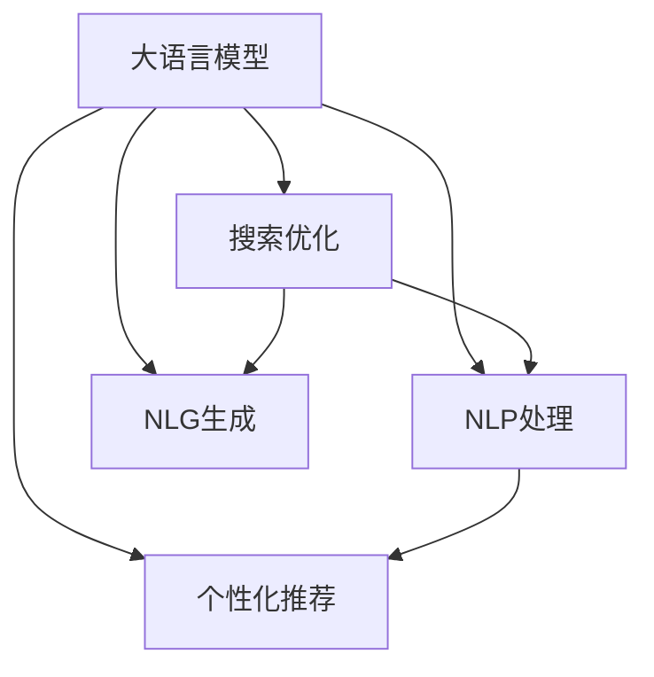

                 

# LLM与电子商务：重塑在线购物体验

> 关键词：大语言模型(LLM)，电子商务，用户体验(UX)，个性化推荐，搜索优化，自然语言处理(NLP)，自然语言生成(NLG)

## 1. 背景介绍

随着互联网技术的飞速发展和电子商务市场的逐渐成熟，线上购物已经成为人们日常生活的重要组成部分。然而，尽管在线平台种类繁多，用户界面也愈发友好，但用户在浏览和购买商品时仍面临诸多挑战。商品信息纷繁复杂，搜索结果不够精确，个性化推荐系统无法精准把握用户需求，这些问题都在影响着用户体验和购物效率。为了应对这些问题，电商平台逐渐引入大语言模型(Large Language Model, LLM)，以提升在线购物的智能化水平，并重塑用户交互体验。

## 2. 核心概念与联系

### 2.1 核心概念概述

- **大语言模型(LLM)**：以自回归(如GPT)或自编码(如BERT)模型为代表的大规模预训练语言模型。通过在大规模无标签文本语料上进行预训练，学习通用的语言表示，具备强大的语言理解和生成能力。
- **个性化推荐系统**：通过分析用户历史行为数据，利用机器学习算法为用户推荐符合其偏好的商品，提升购物体验和转化率。
- **搜索优化**：通过提升搜索结果的相关性和排序，提高用户搜索效率，帮助用户快速找到所需商品。
- **自然语言处理(NLP)**：指利用计算机对自然语言进行处理和理解，包括语言理解、文本分类、信息抽取等。
- **自然语言生成(NLG)**：指计算机根据输入指令，自动生成自然语言文本，用于聊天机器人、自动化报告等应用。

这些概念之间的联系可以通过以下Mermaid流程图来展示：



这个流程图展示了LLM在个性化推荐和搜索优化中的作用，以及NLP和NLG在优化用户交互体验中的应用。

## 3. 核心算法原理 & 具体操作步骤

### 3.1 算法原理概述

大语言模型在电子商务中的应用主要集中在个性化推荐和搜索优化两个方面。个性化推荐系统通过分析用户历史行为数据，利用LLM模型理解用户偏好，从而生成精准的商品推荐。搜索优化则通过NLG模型生成自然语言查询，提高搜索结果的相关性。

个性化推荐系统的工作原理是：首先，收集用户的浏览历史、购买记录、搜索记录等数据，使用NLP技术进行清洗和分析。然后，将分析结果作为输入，通过LLM模型生成个性化推荐列表。最后，系统根据用户的反馈，调整推荐算法和模型参数，以进一步提升推荐效果。

搜索优化系统的工作原理是：首先，收集用户的查询历史，使用NLP技术对查询进行分词、实体识别等处理，转换为模型可识别的格式。然后，将查询输入LLM模型，生成自然语言查询。最后，根据自然语言查询，调整搜索结果排序算法，优化搜索结果的相关性。

### 3.2 算法步骤详解

**个性化推荐系统：**

1. **数据收集与处理**：收集用户行为数据，包括浏览记录、购买记录、搜索记录等。使用NLP技术清洗数据，去除无关信息，提取出关键特征。
   
2. **特征提取**：使用NLP技术将用户行为数据转换为模型可处理的特征向量，如用户兴趣、商品属性、类别等。

3. **模型训练**：使用LLM模型对用户行为数据进行训练，生成推荐列表。训练时，可以采用监督学习、无监督学习、半监督学习等多种方法。

4. **推荐输出**：根据用户行为数据和模型预测，生成个性化推荐列表，并将其呈现给用户。

5. **反馈与优化**：收集用户对推荐结果的反馈，根据反馈调整推荐算法和模型参数，以进一步提升推荐效果。

**搜索优化系统：**

1. **查询收集与预处理**：收集用户的查询数据，包括文本、图片等。使用NLP技术对查询进行预处理，如分词、实体识别等，转换为模型可识别的格式。

2. **自然语言生成**：使用NLG模型生成自然语言查询，提高查询的精确度和表达能力。

3. **搜索结果排序**：根据自然语言查询，调整搜索结果排序算法，优化搜索结果的相关性。

4. **反馈与优化**：收集用户对搜索结果的反馈，根据反馈调整模型参数，以进一步提升搜索效果。

### 3.3 算法优缺点

个性化推荐系统的优点包括：
1. **提升用户满意度**：通过精准推荐，减少用户搜索时间，提高购物效率。
2. **提高转化率**：推荐系统能够引导用户发现潜在的兴趣商品，提升购买意愿。
3. **数据驱动决策**：基于用户历史行为数据，实现个性化推荐，减少用户流失率。

个性化推荐系统的缺点包括：
1. **数据隐私问题**：用户行为数据可能泄露隐私，存在数据安全风险。
2. **推荐准确性问题**：模型参数调整不当可能导致推荐结果与用户需求不符。
3. **冷启动问题**：新用户缺乏足够数据，难以获得精准推荐。

搜索优化系统的优点包括：
1. **提高搜索效率**：通过自然语言生成，使查询更加精准、自然，减少用户搜索时间。
2. **增强用户体验**：自然语言查询能够提高搜索结果的相关性，提升用户体验。
3. **适应性高**：NLG模型能够处理多种查询形式，适应不同用户需求。

搜索优化系统的缺点包括：
1. **模型训练复杂**：需要大量标注数据进行训练，对标注成本有较高要求。
2. **响应速度慢**：自然语言生成和处理增加了系统延迟，影响用户体验。
3. **查询理解能力有限**：复杂的查询可能无法准确理解，导致搜索结果错误。

### 3.4 算法应用领域

个性化推荐系统和搜索优化系统在电子商务领域应用广泛，具体包括：
1. **商品推荐**：根据用户浏览和购买记录，推荐符合其兴趣的商品。
2. **活动推荐**：根据用户行为数据，推荐有吸引力的促销活动，增加用户参与度。
3. **搜索建议**：根据用户输入的搜索词，生成自然语言查询，帮助用户精准搜索商品。
4. **客服机器人**：使用NLG模型生成自然语言回复，提高客户服务效率。

此外，LLM在大语言模型的其他应用领域，如智能客服、金融舆情监测、个性化推荐等，也有着重要的作用。

## 4. 数学模型和公式 & 详细讲解 & 举例说明

### 4.1 数学模型构建

假设个性化推荐系统收集到用户历史行为数据 $D=\{(x_i,y_i)\}_{i=1}^N$，其中 $x_i$ 为用户行为向量，$y_i$ 为用户兴趣标签。假设模型为LLM，输入特征为 $x$，输出为推荐列表 $r$。

个性化推荐系统的优化目标是：

$$
\theta^* = \mathop{\arg\min}_{\theta} \mathcal{L}(r,\hat{y})
$$

其中 $\mathcal{L}$ 为损失函数，$\hat{y}$ 为模型预测的兴趣标签。

假设模型为线性回归模型，则损失函数为：

$$
\mathcal{L}(r,\hat{y}) = \frac{1}{2N}\sum_{i=1}^N ||r_i - \hat{y}_i||^2
$$

其中 $||\cdot||$ 为向量范数。

### 4.2 公式推导过程

在得到损失函数后，可以采用梯度下降等优化算法更新模型参数。假设采用梯度下降算法，更新公式为：

$$
\theta \leftarrow \theta - \eta \nabla_{\theta}\mathcal{L}(\theta)
$$

其中 $\eta$ 为学习率，$\nabla_{\theta}\mathcal{L}(\theta)$ 为损失函数对模型参数的梯度。

在实际应用中，可以采用监督学习、无监督学习、半监督学习等多种方法进行模型训练。监督学习方法需要大量标注数据，训练复杂度高；无监督学习方法无需标注数据，但可能需要更多预训练步骤；半监督学习方法结合了有监督和无监督学习，在标注数据较少的情况下，仍能取得不错的效果。

### 4.3 案例分析与讲解

假设某电商平台使用BERT模型进行个性化推荐，输入特征为用户的浏览记录 $x_i$，输出为推荐列表 $r_i$。

1. **数据收集与预处理**：收集用户浏览记录，使用NLP技术进行分词、去除停用词等处理，转换为模型可识别的格式。

2. **模型训练**：使用BERT模型对用户浏览记录进行训练，生成推荐列表。训练时，可以采用监督学习方法，标注数据为用户的兴趣标签。

3. **推荐输出**：根据用户浏览记录和模型预测，生成个性化推荐列表，并将其呈现给用户。

4. **反馈与优化**：收集用户对推荐结果的反馈，根据反馈调整模型参数，以进一步提升推荐效果。

## 5. 项目实践：代码实例和详细解释说明

### 5.1 开发环境搭建

在进行微调实践前，我们需要准备好开发环境。以下是使用Python进行PyTorch开发的环境配置流程：

1. 安装Anaconda：从官网下载并安装Anaconda，用于创建独立的Python环境。

2. 创建并激活虚拟环境：
```bash
conda create -n pytorch-env python=3.8 
conda activate pytorch-env
```

3. 安装PyTorch：根据CUDA版本，从官网获取对应的安装命令。例如：
```bash
conda install pytorch torchvision torchaudio cudatoolkit=11.1 -c pytorch -c conda-forge
```

4. 安装Transformers库：
```bash
pip install transformers
```

5. 安装各类工具包：
```bash
pip install numpy pandas scikit-learn matplotlib tqdm jupyter notebook ipython
```

完成上述步骤后，即可在`pytorch-env`环境中开始微调实践。

### 5.2 源代码详细实现

下面我们以商品推荐任务为例，给出使用Transformers库对BERT模型进行微调的PyTorch代码实现。

首先，定义商品推荐任务的数据处理函数：

```python
from transformers import BertTokenizer
from torch.utils.data import Dataset
import torch

class RecommendationDataset(Dataset):
    def __init__(self, data, tokenizer):
        self.data = data
        self.tokenizer = tokenizer
        
    def __len__(self):
        return len(self.data)
    
    def __getitem__(self, item):
        text = self.data[item]
        encoded = self.tokenizer(text, return_tensors='pt', padding=True, truncation=True)
        return {'input_ids': encoded['input_ids'][0], 'attention_mask': encoded['attention_mask'][0]}
```

然后，定义模型和优化器：

```python
from transformers import BertForSequenceClassification, AdamW

model = BertForSequenceClassification.from_pretrained('bert-base-uncased', num_labels=2)

optimizer = AdamW(model.parameters(), lr=2e-5)
```

接着，定义训练和评估函数：

```python
from torch.utils.data import DataLoader
from tqdm import tqdm
from sklearn.metrics import accuracy_score

device = torch.device('cuda') if torch.cuda.is_available() else torch.device('cpu')
model.to(device)

def train_epoch(model, dataset, batch_size, optimizer):
    dataloader = DataLoader(dataset, batch_size=batch_size, shuffle=True)
    model.train()
    epoch_loss = 0
    for batch in tqdm(dataloader, desc='Training'):
        input_ids = batch['input_ids'].to(device)
        attention_mask = batch['attention_mask'].to(device)
        labels = batch['labels'].to(device)
        model.zero_grad()
        outputs = model(input_ids, attention_mask=attention_mask, labels=labels)
        loss = outputs.loss
        epoch_loss += loss.item()
        loss.backward()
        optimizer.step()
    return epoch_loss / len(dataloader)

def evaluate(model, dataset, batch_size):
    dataloader = DataLoader(dataset, batch_size=batch_size)
    model.eval()
    preds, labels = [], []
    with torch.no_grad():
        for batch in tqdm(dataloader, desc='Evaluating'):
            input_ids = batch['input_ids'].to(device)
            attention_mask = batch['attention_mask'].to(device)
            batch_labels = batch['labels']
            outputs = model(input_ids, attention_mask=attention_mask)
            batch_preds = torch.argmax(outputs.logits, dim=1).to('cpu').tolist()
            batch_labels = batch_labels.to('cpu').tolist()
            for pred, label in zip(batch_preds, batch_labels):
                preds.append(pred)
                labels.append(label)
    
    print(accuracy_score(labels, preds))
```

最后，启动训练流程并在测试集上评估：

```python
epochs = 5
batch_size = 16

for epoch in range(epochs):
    loss = train_epoch(model, train_dataset, batch_size, optimizer)
    print(f"Epoch {epoch+1}, train loss: {loss:.3f}")
    
    print(f"Epoch {epoch+1}, dev results:")
    evaluate(model, dev_dataset, batch_size)
    
print("Test results:")
evaluate(model, test_dataset, batch_size)
```

以上就是使用PyTorch对BERT进行商品推荐任务微调的完整代码实现。可以看到，得益于Transformers库的强大封装，我们可以用相对简洁的代码完成BERT模型的加载和微调。

### 5.3 代码解读与分析

让我们再详细解读一下关键代码的实现细节：

**RecommendationDataset类**：
- `__init__`方法：初始化数据和分词器等关键组件。
- `__len__`方法：返回数据集的样本数量。
- `__getitem__`方法：对单个样本进行处理，将文本输入编码为token ids，并进行padding和截断，最终返回模型所需的输入。

**model和optimizer定义**：
- `BertForSequenceClassification`类：定义了基于序列的分类模型，用于商品推荐。
- `AdamW`优化器：采用Adam优化器，设置学习率等参数。

**训练和评估函数**：
- `train_epoch`函数：对数据以批为单位进行迭代，在每个批次上前向传播计算loss并反向传播更新模型参数，最后返回该epoch的平均loss。
- `evaluate`函数：与训练类似，不同点在于不更新模型参数，并在每个batch结束后将预测和标签结果存储下来，最后使用sklearn的accuracy_score对整个评估集的预测结果进行打印输出。

**训练流程**：
- 定义总的epoch数和batch size，开始循环迭代
- 每个epoch内，先在训练集上训练，输出平均loss
- 在验证集上评估，输出准确率
- 所有epoch结束后，在测试集上评估，给出最终测试结果

可以看到，PyTorch配合Transformers库使得BERT微调的代码实现变得简洁高效。开发者可以将更多精力放在数据处理、模型改进等高层逻辑上，而不必过多关注底层的实现细节。

当然，工业级的系统实现还需考虑更多因素，如模型的保存和部署、超参数的自动搜索、更灵活的任务适配层等。但核心的微调范式基本与此类似。

## 6. 实际应用场景

### 6.1 智能客服系统

基于大语言模型微调的对话技术，可以广泛应用于智能客服系统的构建。传统客服往往需要配备大量人力，高峰期响应缓慢，且一致性和专业性难以保证。而使用微调后的对话模型，可以7x24小时不间断服务，快速响应客户咨询，用自然流畅的语言解答各类常见问题。

在技术实现上，可以收集企业内部的历史客服对话记录，将问题和最佳答复构建成监督数据，在此基础上对预训练对话模型进行微调。微调后的对话模型能够自动理解用户意图，匹配最合适的答案模板进行回复。对于客户提出的新问题，还可以接入检索系统实时搜索相关内容，动态组织生成回答。如此构建的智能客服系统，能大幅提升客户咨询体验和问题解决效率。

### 6.2 金融舆情监测

金融机构需要实时监测市场舆论动向，以便及时应对负面信息传播，规避金融风险。传统的人工监测方式成本高、效率低，难以应对网络时代海量信息爆发的挑战。基于大语言模型微调的文本分类和情感分析技术，为金融舆情监测提供了新的解决方案。

具体而言，可以收集金融领域相关的新闻、报道、评论等文本数据，并对其进行主题标注和情感标注。在此基础上对预训练语言模型进行微调，使其能够自动判断文本属于何种主题，情感倾向是正面、中性还是负面。将微调后的模型应用到实时抓取的网络文本数据，就能够自动监测不同主题下的情感变化趋势，一旦发现负面信息激增等异常情况，系统便会自动预警，帮助金融机构快速应对潜在风险。

### 6.3 个性化推荐系统

当前的推荐系统往往只依赖用户的历史行为数据进行物品推荐，无法深入理解用户的真实兴趣偏好。基于大语言模型微调技术，个性化推荐系统可以更好地挖掘用户行为背后的语义信息，从而提供更精准、多样的推荐内容。

在实践中，可以收集用户浏览、点击、评论、分享等行为数据，提取和用户交互的物品标题、描述、标签等文本内容。将文本内容作为模型输入，用户的后续行为（如是否点击、购买等）作为监督信号，在此基础上微调预训练语言模型。微调后的模型能够从文本内容中准确把握用户的兴趣点。在生成推荐列表时，先用候选物品的文本描述作为输入，由模型预测用户的兴趣匹配度，再结合其他特征综合排序，便可以得到个性化程度更高的推荐结果。

### 6.4 未来应用展望

随着大语言模型和微调方法的不断发展，基于微调范式将在更多领域得到应用，为传统行业带来变革性影响。

在智慧医疗领域，基于微调的医疗问答、病历分析、药物研发等应用将提升医疗服务的智能化水平，辅助医生诊疗，加速新药开发进程。

在智能教育领域，微调技术可应用于作业批改、学情分析、知识推荐等方面，因材施教，促进教育公平，提高教学质量。

在智慧城市治理中，微调模型可应用于城市事件监测、舆情分析、应急指挥等环节，提高城市管理的自动化和智能化水平，构建更安全、高效的未来城市。

此外，在企业生产、社会治理、文娱传媒等众多领域，基于大模型微调的人工智能应用也将不断涌现，为经济社会发展注入新的动力。相信随着预训练语言模型和微调方法的持续演进，基于微调范式必将在构建人机协同的智能时代中扮演越来越重要的角色。

## 7. 工具和资源推荐

### 7.1 学习资源推荐

为了帮助开发者系统掌握大语言模型微调的理论基础和实践技巧，这里推荐一些优质的学习资源：

1. 《Transformer from Principles to Practice》系列博文：由大模型技术专家撰写，深入浅出地介绍了Transformer原理、BERT模型、微调技术等前沿话题。

2. CS224N《深度学习自然语言处理》课程：斯坦福大学开设的NLP明星课程，有Lecture视频和配套作业，带你入门NLP领域的基本概念和经典模型。

3. 《Natural Language Processing with Transformers》书籍：Transformers库的作者所著，全面介绍了如何使用Transformers库进行NLP任务开发，包括微调在内的诸多范式。

4. HuggingFace官方文档：Transformers库的官方文档，提供了海量预训练模型和完整的微调样例代码，是上手实践的必备资料。

5. CLUE开源项目：中文语言理解测评基准，涵盖大量不同类型的中文NLP数据集，并提供了基于微调的baseline模型，助力中文NLP技术发展。

通过对这些资源的学习实践，相信你一定能够快速掌握大语言模型微调的精髓，并用于解决实际的NLP问题。
###  7.2 开发工具推荐

高效的开发离不开优秀的工具支持。以下是几款用于大语言模型微调开发的常用工具：

1. PyTorch：基于Python的开源深度学习框架，灵活动态的计算图，适合快速迭代研究。大部分预训练语言模型都有PyTorch版本的实现。

2. TensorFlow：由Google主导开发的开源深度学习框架，生产部署方便，适合大规模工程应用。同样有丰富的预训练语言模型资源。

3. Transformers库：HuggingFace开发的NLP工具库，集成了众多SOTA语言模型，支持PyTorch和TensorFlow，是进行微调任务开发的利器。

4. Weights & Biases：模型训练的实验跟踪工具，可以记录和可视化模型训练过程中的各项指标，方便对比和调优。与主流深度学习框架无缝集成。

5. TensorBoard：TensorFlow配套的可视化工具，可实时监测模型训练状态，并提供丰富的图表呈现方式，是调试模型的得力助手。

6. Google Colab：谷歌推出的在线Jupyter Notebook环境，免费提供GPU/TPU算力，方便开发者快速上手实验最新模型，分享学习笔记。

合理利用这些工具，可以显著提升大语言模型微调任务的开发效率，加快创新迭代的步伐。

### 7.3 相关论文推荐

大语言模型和微调技术的发展源于学界的持续研究。以下是几篇奠基性的相关论文，推荐阅读：

1. Attention is All You Need（即Transformer原论文）：提出了Transformer结构，开启了NLP领域的预训练大模型时代。

2. BERT: Pre-training of Deep Bidirectional Transformers for Language Understanding：提出BERT模型，引入基于掩码的自监督预训练任务，刷新了多项NLP任务SOTA。

3. Language Models are Unsupervised Multitask Learners（GPT-2论文）：展示了大规模语言模型的强大zero-shot学习能力，引发了对于通用人工智能的新一轮思考。

4. Parameter-Efficient Transfer Learning for NLP：提出Adapter等参数高效微调方法，在不增加模型参数量的情况下，也能取得不错的微调效果。

5. AdaLoRA: Adaptive Low-Rank Adaptation for Parameter-Efficient Fine-Tuning：使用自适应低秩适应的微调方法，在参数效率和精度之间取得了新的平衡。

6. Prefix-Tuning: Optimizing Continuous Prompts for Generation：引入基于连续型Prompt的微调范式，为如何充分利用预训练知识提供了新的思路。

这些论文代表了大语言模型微调技术的发展脉络。通过学习这些前沿成果，可以帮助研究者把握学科前进方向，激发更多的创新灵感。

## 8. 总结：未来发展趋势与挑战

### 8.1 总结

本文对基于大语言模型的电子商务应用进行了全面系统的介绍。首先阐述了LLM在电子商务中的重要性和应用场景，明确了个性化推荐和搜索优化对提升用户购物体验的独特价值。其次，从原理到实践，详细讲解了基于LLM的个性化推荐和搜索优化的数学模型和关键步骤，给出了微调任务开发的完整代码实例。同时，本文还广泛探讨了LLM在大语言模型的其他应用领域，如智能客服、金融舆情监测、个性化推荐等，展示了LLM范式的巨大潜力。此外，本文精选了LLM微调技术的各类学习资源，力求为读者提供全方位的技术指引。

通过本文的系统梳理，可以看到，基于大语言模型的电子商务应用正在成为NLP领域的重要范式，极大地拓展了预训练语言模型的应用边界，催生了更多的落地场景。受益于大规模语料的预训练，LLM微调模型在个性化推荐和搜索优化等方面取得了显著的效果，显著提升了用户体验和购物效率。未来，伴随预训练语言模型和微调方法的持续演进，基于LLM的电子商务应用必将在构建人机协同的智能时代中扮演越来越重要的角色。

### 8.2 未来发展趋势

展望未来，LLM在电子商务领域的应用将呈现以下几个发展趋势：

1. **用户画像构建**：通过分析用户行为数据，构建精准的用户画像，实现更加个性化和智能化的推荐。

2. **智能客服普及**：智能客服系统将更加普及，通过微调后的对话模型，提供7x24小时不间断服务，提升客户服务效率和体验。

3. **跨平台无缝体验**：通过微调技术，实现跨平台、跨设备的用户无缝体验，如手机端到PC端的切换，提升用户粘性。

4. **深度融合多模态数据**：结合自然语言、图像、视频等多模态数据，实现更全面、更丰富的商品推荐和搜索体验。

5. **智能推荐引擎**：通过微调后的模型，构建更加智能、高效的推荐引擎，提升推荐算法的精度和效率。

6. **实时分析与预警**：通过微调后的模型，实时分析用户行为数据，对异常情况进行预警，提高运营效率和风险控制能力。

以上趋势凸显了LLM在电子商务领域的广阔前景。这些方向的探索发展，必将进一步提升电子商务平台的智能化水平，为消费者提供更加便捷、高效、个性化的购物体验。

### 8.3 面临的挑战

尽管LLM在电子商务领域的应用取得了初步成功，但在迈向更加智能化、普适化应用的过程中，它仍面临诸多挑战：

1. **数据隐私与安全**：用户行为数据的隐私保护和数据安全问题，是LLM微调应用面临的重要挑战。如何确保数据隐私和安全，避免数据泄露和滥用，将成为首要任务。

2. **模型鲁棒性**：当前的LLM模型在处理噪声、不完整数据等方面仍较为脆弱，需要进一步提高模型的鲁棒性和泛化能力。

3. **计算资源**：超大规模LLM模型的训练和部署需要大量的计算资源，如何优化计算效率，降低成本，也是重要的研究方向。

4. **用户体验**：尽管微调后的LLM模型在个性化推荐和搜索优化方面取得了不错的效果，但仍需进一步提升用户交互的自然流畅性和智能水平。

5. **模型可解释性**：LLM模型的内部决策过程较为复杂，缺乏可解释性，难以满足高风险领域如金融、医疗等对算法可解释性的需求。

6. **模型优化**：如何优化LLM模型，使其在有限的标注数据和计算资源下，仍能取得良好的性能，也是当前研究的重要方向。

这些挑战需要学界和产业界的共同努力，不断优化算法和模型，才能更好地应对未来的需求。

### 8.4 研究展望

面对LLM在电子商务领域面临的挑战，未来的研究需要在以下几个方面寻求新的突破：

1. **隐私保护技术**：开发更加先进的隐私保护技术，如差分隐私、联邦学习等，确保用户数据的安全和隐私。

2. **鲁棒性增强**：引入鲁棒性增强技术，如对抗训练、数据增强等，提高LLM模型的泛化能力和鲁棒性。

3. **计算优化**：开发高效的计算框架和算法，优化模型的训练和推理过程，降低计算成本和资源消耗。

4. **智能交互**：通过NLP、NLG等技术，提升用户交互的自然流畅性和智能水平，提供更加自然、个性化的用户体验。

5. **模型解释性**：引入可解释性技术，如注意力机制、规则化等，增强LLM模型的可解释性和透明性。

6. **跨模态融合**：开发跨模态融合算法，将自然语言、图像、视频等多模态数据结合，构建更加全面、丰富的推荐系统和搜索系统。

这些研究方向的探索，必将引领LLM在电子商务领域的应用向更深层次、更广范围拓展，为构建智能化、个性化的电商生态奠定基础。

## 9. 附录：常见问题与解答

**Q1：LLM在电子商务中的优势是什么？**

A: LLM在电子商务中的优势主要体现在以下几个方面：

1. **个性化推荐**：通过分析用户行为数据，构建精准的用户画像，实现更加个性化和智能化的推荐，提升用户满意度和购买转化率。

2. **智能客服**：通过微调后的对话模型，提供7x24小时不间断服务，快速响应客户咨询，提升客户服务效率和体验。

3. **智能搜索**：通过自然语言处理和生成技术，提高搜索效率和结果的相关性，提升用户搜索体验。

4. **数据驱动决策**：基于用户历史行为数据，进行个性化推荐和搜索优化，减少用户流失率，提高运营效率。

5. **实时分析与预警**：通过微调后的模型，实时分析用户行为数据，对异常情况进行预警，提高运营效率和风险控制能力。

**Q2：LLM在电子商务中的应用流程是什么？**

A: LLM在电子商务中的应用流程主要包括以下几个步骤：

1. **数据收集与处理**：收集用户行为数据，包括浏览记录、购买记录、搜索记录等，使用NLP技术进行清洗和分析。

2. **特征提取**：使用NLP技术将用户行为数据转换为模型可处理的特征向量，如用户兴趣、商品属性、类别等。

3. **模型训练**：使用LLM模型对用户行为数据进行训练，生成推荐列表。训练时，可以采用监督学习、无监督学习、半监督学习等多种方法。

4. **推荐输出**：根据用户行为数据和模型预测，生成个性化推荐列表，并将其呈现给用户。

5. **反馈与优化**：收集用户对推荐结果的反馈，根据反馈调整推荐算法和模型参数，以进一步提升推荐效果。

**Q3：如何选择LLM模型进行个性化推荐？**

A: 选择LLM模型进行个性化推荐，需要考虑以下几个因素：

1. **模型规模**：大模型通常能够处理更多的特征和数据，但也需要更多的计算资源。

2. **预训练任务**：不同的预训练任务对推荐效果的影响不同，如BERT适用于文本分类，GPT适用于生成任务。

3. **训练数据**：推荐系统需要大量标注数据进行训练，数据的质量和数量直接影响模型性能。

4. **任务复杂度**：对于复杂的推荐任务，可能需要更加强大的模型和更复杂的训练过程。

5. **可解释性**：对于高风险领域如金融、医疗等，模型的可解释性尤为重要，需要选择具有更好可解释性的模型。

**Q4：LLM在电子商务中如何保证数据隐私与安全？**

A: 在电子商务中，LLM的应用需要保证用户数据的隐私和安全。以下是一些常用的保护措施：

1. **数据匿名化**：对用户数据进行匿名化处理，去除敏感信息。

2. **差分隐私**：在数据收集和处理过程中，采用差分隐私技术，确保用户数据不会泄露。

3. **联邦学习**：采用联邦学习技术，将模型训练在本地设备上进行，不传输原始数据。

4. **安全多方计算**：在多设备环境下，采用安全多方计算技术，确保数据安全和隐私保护。

5. **模型水印**：在模型中添加水印，防止模型被非法复制和滥用。

通过这些措施，可以有效保护用户数据隐私和安全，确保LLM在电子商务中的应用能够平稳进行。

**Q5：LLM在电子商务中的计算优化策略有哪些？**

A: 在电子商务中，LLM的应用需要处理大量数据，计算资源需求高。以下是一些常用的计算优化策略：

1. **模型裁剪**：去除不必要的层和参数，减小模型尺寸，加快推理速度。

2. **量化加速**：将浮点模型转为定点模型，压缩存储空间，提高计算效率。

3. **模型并行**：采用模型并行技术，将模型分割为多个子模型，分布计算。

4. **混合精度训练**：采用混合精度训练技术，降低计算开销，提高训练效率。

5. **分布式训练**：采用分布式训练技术，加速模型训练过程。

通过这些优化策略，可以显著提高LLM在电子商务中的应用效率，降低计算成本。

---

作者：禅与计算机程序设计艺术 / Zen and the Art of Computer Programming

